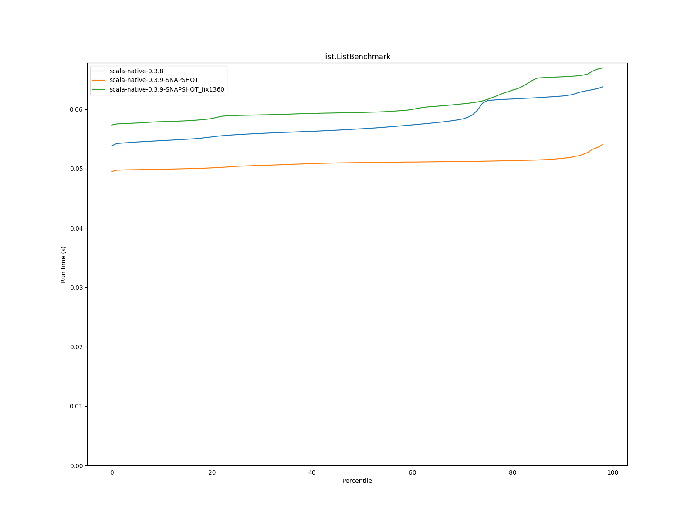
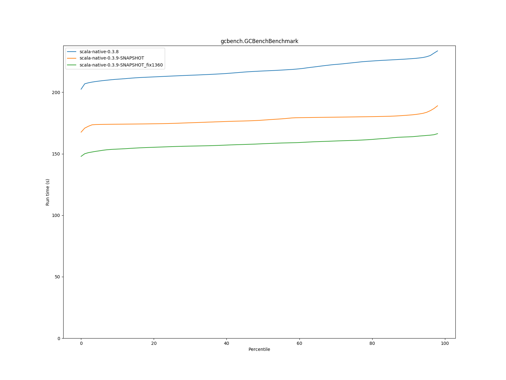

# Summary
## Benchmark run time (s) at 50 percentile 

|name | scala-native-0.3.8 | scala-native-0.3.9-SNAPSHOT |  | scala-native-0.3.9-SNAPSHOT_fix1360 | |
| -- | -- | -- | -- | -- | -- |
|[bounce.BounceBenchmark](#bouncebouncebenchmark)|0.0450|0.1109|+146.14%|0.0485|+7.70%|
|[list.ListBenchmark](#listlistbenchmark)|0.0567|0.0510|__-10.05%__|0.0595|+4.84%|
|[richards.RichardsBenchmark](#richardsrichardsbenchmark)|0.0643|0.1554|+141.67%|0.0651|+1.28%|
|[queens.QueensBenchmark](#queensqueensbenchmark)|0.0730|0.1195|+63.65%|0.0891|+21.99%|
|[permute.PermuteBenchmark](#permutepermutebenchmark)|0.3010|0.8057|+167.67%|0.2300|__-23.59%__|
|[deltablue.DeltaBlueBenchmark](#deltabluedeltabluebenchmark)|0.2303|0.2057|__-10.66%__|0.2053|__-10.84%__|
|[tracer.TracerBenchmark](#tracertracerbenchmark)|1.2365|1.0245|__-17.14%__|0.9892|__-19.99%__|
|[brainfuck.BrainfuckBenchmark](#brainfuckbrainfuckbenchmark)|4.1650|16.1010|+286.58%|4.2121|+1.13%|
|[json.JsonBenchmark](#jsonjsonbenchmark)|1.8026|8.6960|+382.42%|2.5663|+42.37%|
|[cd.CDBenchmark](#cdcdbenchmark)|33.5637|35.7777|+6.60%|30.0169|__-10.57%__|
|[kmeans.KmeansBenchmark](#kmeanskmeansbenchmark)|78.1445|164.0224|+109.90%|55.1838|__-29.38%__|
|[gcbench.GCBenchBenchmark](#gcbenchgcbenchbenchmark)|217.3393|177.3804|__-18.39%__|158.1685|__-27.23%__|
|[mandelbrot.MandelbrotBenchmark](#mandelbrotmandelbrotbenchmark)|90.5439|89.7242|__-0.91%__|89.9634|__-0.64%__|
|[nbody.NbodyBenchmark](#nbodynbodybenchmark)|31.6678|171.2756|+440.85%|31.2183|__-1.42%__|
|[sudoku.SudokuBenchmark](#sudokusudokubenchmark)|2.2472|8.1184|+261.27%|2.4256|+7.94%|
## Benchmark run time (s) at 90 percentile 

|name | scala-native-0.3.8 | scala-native-0.3.9-SNAPSHOT |  | scala-native-0.3.9-SNAPSHOT_fix1360 | |
| -- | -- | -- | -- | -- | -- |
|[bounce.BounceBenchmark](#bouncebouncebenchmark)|0.0496|0.1153|+132.57%|0.0514|+3.60%|
|[list.ListBenchmark](#listlistbenchmark)|0.0622|0.0517|__-16.86%__|0.0655|+5.20%|
|[richards.RichardsBenchmark](#richardsrichardsbenchmark)|0.0707|0.1709|+141.70%|0.0672|__-5.00%__|
|[queens.QueensBenchmark](#queensqueensbenchmark)|0.0747|0.1319|+76.72%|0.0912|+22.17%|
|[permute.PermuteBenchmark](#permutepermutebenchmark)|0.3163|0.8514|+169.14%|0.2518|__-20.40%__|
|[deltablue.DeltaBlueBenchmark](#deltabluedeltabluebenchmark)|0.2543|0.2179|__-14.31%__|0.2264|__-10.97%__|
|[tracer.TracerBenchmark](#tracertracerbenchmark)|1.2562|1.0440|__-16.89%__|1.0083|__-19.74%__|
|[brainfuck.BrainfuckBenchmark](#brainfuckbrainfuckbenchmark)|4.2946|16.4608|+283.29%|4.2874|__-0.17%__|
|[json.JsonBenchmark](#jsonjsonbenchmark)|2.0274|9.0781|+347.76%|2.8022|+38.21%|
|[cd.CDBenchmark](#cdcdbenchmark)|33.8186|36.3131|+7.38%|30.5162|__-9.77%__|
|[kmeans.KmeansBenchmark](#kmeanskmeansbenchmark)|83.4022|167.8540|+101.26%|56.2514|__-32.55%__|
|[gcbench.GCBenchBenchmark](#gcbenchgcbenchbenchmark)|227.1816|181.4256|__-20.14%__|163.7536|__-27.92%__|
|[mandelbrot.MandelbrotBenchmark](#mandelbrotmandelbrotbenchmark)|93.6267|92.5854|__-1.11%__|92.2356|__-1.49%__|
|[nbody.NbodyBenchmark](#nbodynbodybenchmark)|32.4596|174.8444|+438.65%|31.7173|__-2.29%__|
|[sudoku.SudokuBenchmark](#sudokusudokubenchmark)|2.4687|8.3635|+238.78%|2.6547|+7.54%|
## Benchmark run time (s) at 99 percentile 

|name | scala-native-0.3.8 | scala-native-0.3.9-SNAPSHOT |  | scala-native-0.3.9-SNAPSHOT_fix1360 | |
| -- | -- | -- | -- | -- | -- |
|[bounce.BounceBenchmark](#bouncebouncebenchmark)|0.0512|0.1508|+194.40%|0.0539|+5.24%|
|[list.ListBenchmark](#listlistbenchmark)|0.0653|0.0566|__-13.28%__|0.0673|+3.16%|
|[richards.RichardsBenchmark](#richardsrichardsbenchmark)|0.0728|0.2124|+191.88%|0.0750|+2.99%|
|[queens.QueensBenchmark](#queensqueensbenchmark)|0.0813|0.1606|+97.47%|0.1289|+58.45%|
|[permute.PermuteBenchmark](#permutepermutebenchmark)|0.3331|0.9279|+178.60%|0.2722|__-18.27%__|
|[deltablue.DeltaBlueBenchmark](#deltabluedeltabluebenchmark)|0.3085|0.2565|__-16.87%__|0.2785|__-9.73%__|
|[tracer.TracerBenchmark](#tracertracerbenchmark)|1.3680|1.1355|__-17.00%__|1.0920|__-20.17%__|
|[brainfuck.BrainfuckBenchmark](#brainfuckbrainfuckbenchmark)|4.5997|17.7753|+286.45%|4.5836|__-0.35%__|
|[json.JsonBenchmark](#jsonjsonbenchmark)|2.1159|9.4792|+348.00%|3.0547|+44.37%|
|[cd.CDBenchmark](#cdcdbenchmark)|34.6614|39.0174|+12.57%|32.8739|__-5.16%__|
|[kmeans.KmeansBenchmark](#kmeanskmeansbenchmark)|87.0139|183.0590|+110.38%|58.2742|__-33.03%__|
|[gcbench.GCBenchBenchmark](#gcbenchgcbenchbenchmark)|237.2987|191.6265|__-19.25%__|168.7931|__-28.87%__|
|[mandelbrot.MandelbrotBenchmark](#mandelbrotmandelbrotbenchmark)|100.7630|99.9938|__-0.76%__|100.0021|__-0.76%__|
|[nbody.NbodyBenchmark](#nbodynbodybenchmark)|34.8175|186.2449|+434.92%|33.0828|__-4.98%__|
|[sudoku.SudokuBenchmark](#sudokusudokubenchmark)|2.6971|8.9656|+232.42%|2.8196|+4.54%|
# Individual benchmarks
## bounce.BounceBenchmark

## list.ListBenchmark

## richards.RichardsBenchmark

## queens.QueensBenchmark

## permute.PermuteBenchmark

## deltablue.DeltaBlueBenchmark

## tracer.TracerBenchmark

## brainfuck.BrainfuckBenchmark

## json.JsonBenchmark

## cd.CDBenchmark

## kmeans.KmeansBenchmark

## gcbench.GCBenchBenchmark

## mandelbrot.MandelbrotBenchmark

## nbody.NbodyBenchmark

## sudoku.SudokuBenchmark

