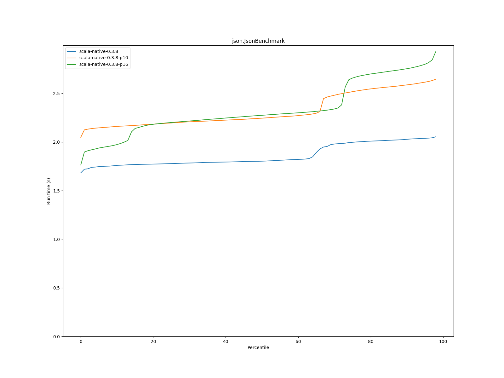
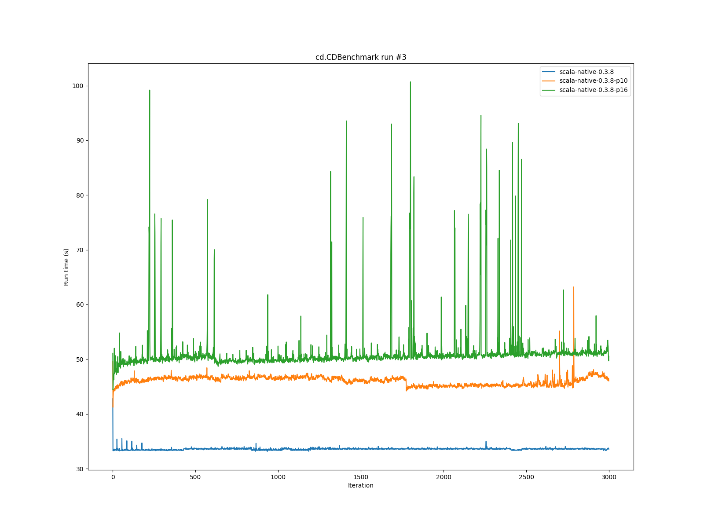
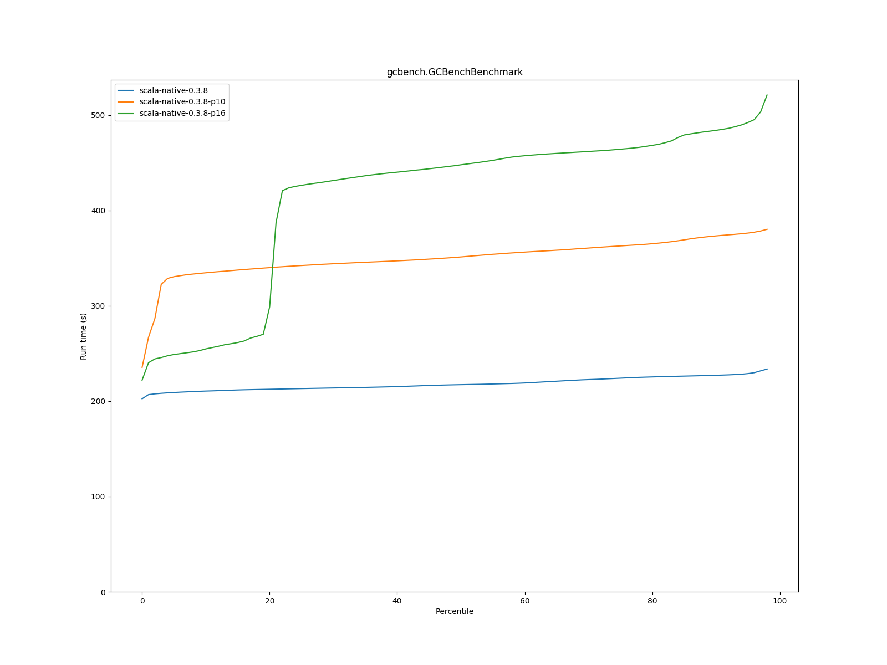

# Summary
## Benchmark run time (s) at 50 percentile 

|name | scala-native-0.3.8 | scala-native-0.3.8-p10 |  | scala-native-0.3.8-p16 | |
| -- | -- | -- | -- | -- | -- |
|[bounce.BounceBenchmark](#bouncebouncebenchmark)|0.0450|0.0496|+10.03%|0.0497|+10.25%|
|[list.ListBenchmark](#listlistbenchmark)|0.0567|0.0621|+9.42%|0.0620|+9.24%|
|[richards.RichardsBenchmark](#richardsrichardsbenchmark)|0.0643|0.0709|+10.25%|0.0705|+9.56%|
|[queens.QueensBenchmark](#queensqueensbenchmark)|0.0730|0.0810|+10.93%|0.0806|+10.33%|
|[permute.PermuteBenchmark](#permutepermutebenchmark)|0.3010|0.3474|+15.41%|0.3313|+10.07%|
|[deltablue.DeltaBlueBenchmark](#deltabluedeltabluebenchmark)|0.2303|0.2660|+15.51%|0.2524|+9.62%|
|[tracer.TracerBenchmark](#tracertracerbenchmark)|1.2365|1.5310|+23.82%|2.0108|+62.62%|
|[brainfuck.BrainfuckBenchmark](#brainfuckbrainfuckbenchmark)|4.1650|5.0334|+20.85%|5.0909|+22.23%|
|[json.JsonBenchmark](#jsonjsonbenchmark)|1.8026|2.2449|+24.53%|2.2744|+26.18%|
|[cd.CDBenchmark](#cdcdbenchmark)|33.5637|45.7203|+36.22%|51.2258|+52.62%|
|[kmeans.KmeansBenchmark](#kmeanskmeansbenchmark)|78.1445|107.3811|+37.41%|125.3548|+60.41%|
|[gcbench.GCBenchBenchmark](#gcbenchgcbenchbenchmark)|217.3393|351.3323|+61.65%|448.0089|+106.13%|
|[mandelbrot.MandelbrotBenchmark](#mandelbrotmandelbrotbenchmark)|90.5439|103.6683|+14.50%|112.4579|+24.20%|
|[nbody.NbodyBenchmark](#nbodynbodybenchmark)|31.6678|40.3585|+27.44%|42.3676|+33.79%|
|[sudoku.SudokuBenchmark](#sudokusudokubenchmark)|2.2472|2.7938|+24.32%|2.9173|+29.82%|
## Benchmark run time (s) at 90 percentile 

|name | scala-native-0.3.8 | scala-native-0.3.8-p10 |  | scala-native-0.3.8-p16 | |
| -- | -- | -- | -- | -- | -- |
|[bounce.BounceBenchmark](#bouncebouncebenchmark)|0.0496|0.0579|+16.72%|0.0502|+1.15%|
|[list.ListBenchmark](#listlistbenchmark)|0.0622|0.0637|+2.33%|0.0638|+2.48%|
|[richards.RichardsBenchmark](#richardsrichardsbenchmark)|0.0707|0.0716|+1.30%|0.0936|+32.40%|
|[queens.QueensBenchmark](#queensqueensbenchmark)|0.0747|0.0817|+9.41%|0.0817|+9.38%|
|[permute.PermuteBenchmark](#permutepermutebenchmark)|0.3163|0.3696|+16.84%|0.3777|+19.40%|
|[deltablue.DeltaBlueBenchmark](#deltabluedeltabluebenchmark)|0.2543|0.2754|+8.31%|0.2801|+10.16%|
|[tracer.TracerBenchmark](#tracertracerbenchmark)|1.2562|1.5901|+26.59%|2.2827|+81.72%|
|[brainfuck.BrainfuckBenchmark](#brainfuckbrainfuckbenchmark)|4.2946|5.2575|+22.42%|5.5751|+29.82%|
|[json.JsonBenchmark](#jsonjsonbenchmark)|2.0274|2.5871|+27.60%|2.7536|+35.82%|
|[cd.CDBenchmark](#cdcdbenchmark)|33.8186|46.5982|+37.79%|52.2277|+54.44%|
|[kmeans.KmeansBenchmark](#kmeanskmeansbenchmark)|83.4022|117.1709|+40.49%|140.4644|+68.42%|
|[gcbench.GCBenchBenchmark](#gcbenchgcbenchbenchmark)|227.1816|373.3973|+64.36%|484.1522|+113.11%|
|[mandelbrot.MandelbrotBenchmark](#mandelbrotmandelbrotbenchmark)|93.6267|105.2461|+12.41%|113.4016|+21.12%|
|[nbody.NbodyBenchmark](#nbodynbodybenchmark)|32.4596|40.6512|+25.24%|42.8702|+32.07%|
|[sudoku.SudokuBenchmark](#sudokusudokubenchmark)|2.4687|3.1441|+27.36%|3.3163|+34.34%|
## Benchmark run time (s) at 99 percentile 

|name | scala-native-0.3.8 | scala-native-0.3.8-p10 |  | scala-native-0.3.8-p16 | |
| -- | -- | -- | -- | -- | -- |
|[bounce.BounceBenchmark](#bouncebouncebenchmark)|0.0512|0.0861|+68.11%|0.0709|+38.42%|
|[list.ListBenchmark](#listlistbenchmark)|0.0653|0.0761|+16.55%|0.0877|+34.35%|
|[richards.RichardsBenchmark](#richardsrichardsbenchmark)|0.0728|0.0909|+24.86%|0.1121|+54.04%|
|[queens.QueensBenchmark](#queensqueensbenchmark)|0.0813|0.1206|+48.29%|0.1171|+43.95%|
|[permute.PermuteBenchmark](#permutepermutebenchmark)|0.3331|0.4091|+22.83%|0.5372|+61.28%|
|[deltablue.DeltaBlueBenchmark](#deltabluedeltabluebenchmark)|0.3085|0.3575|+15.88%|0.4062|+31.67%|
|[tracer.TracerBenchmark](#tracertracerbenchmark)|1.3680|1.6969|+24.04%|2.9099|+112.71%|
|[brainfuck.BrainfuckBenchmark](#brainfuckbrainfuckbenchmark)|4.5997|5.4332|+18.12%|8.0632|+75.30%|
|[json.JsonBenchmark](#jsonjsonbenchmark)|2.1159|2.6781|+26.57%|3.4014|+60.75%|
|[cd.CDBenchmark](#cdcdbenchmark)|34.6614|47.9221|+38.26%|73.1427|+111.02%|
|[kmeans.KmeansBenchmark](#kmeanskmeansbenchmark)|87.0139|123.4725|+41.90%|169.5194|+94.82%|
|[gcbench.GCBenchBenchmark](#gcbenchgcbenchbenchmark)|237.2987|382.5240|+61.20%|546.6962|+130.38%|
|[mandelbrot.MandelbrotBenchmark](#mandelbrotmandelbrotbenchmark)|100.7630|109.1803|+8.35%|117.0178|+16.13%|
|[nbody.NbodyBenchmark](#nbodynbodybenchmark)|34.8175|41.7139|+19.81%|56.2083|+61.44%|
|[sudoku.SudokuBenchmark](#sudokusudokubenchmark)|2.6971|3.2470|+20.39%|3.7165|+37.79%|
# Individual benchmarks
## bounce.BounceBenchmark

## list.ListBenchmark

## richards.RichardsBenchmark

## queens.QueensBenchmark

## permute.PermuteBenchmark

## deltablue.DeltaBlueBenchmark

## tracer.TracerBenchmark

## brainfuck.BrainfuckBenchmark

## json.JsonBenchmark

## cd.CDBenchmark

## kmeans.KmeansBenchmark

## gcbench.GCBenchBenchmark

## mandelbrot.MandelbrotBenchmark

## nbody.NbodyBenchmark

## sudoku.SudokuBenchmark

