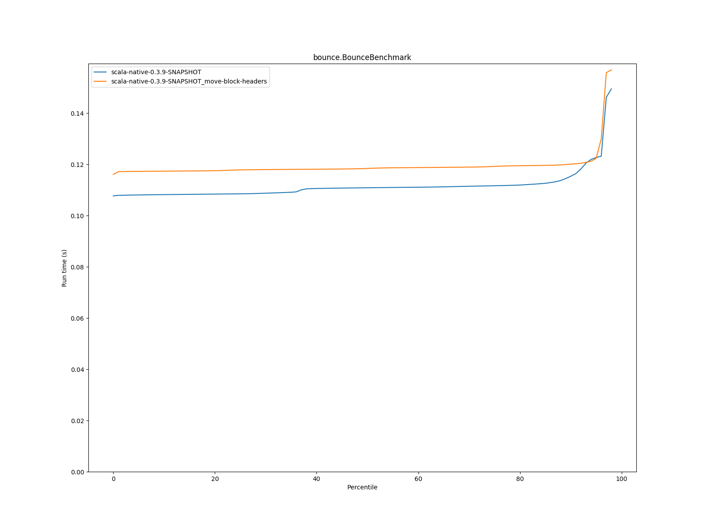
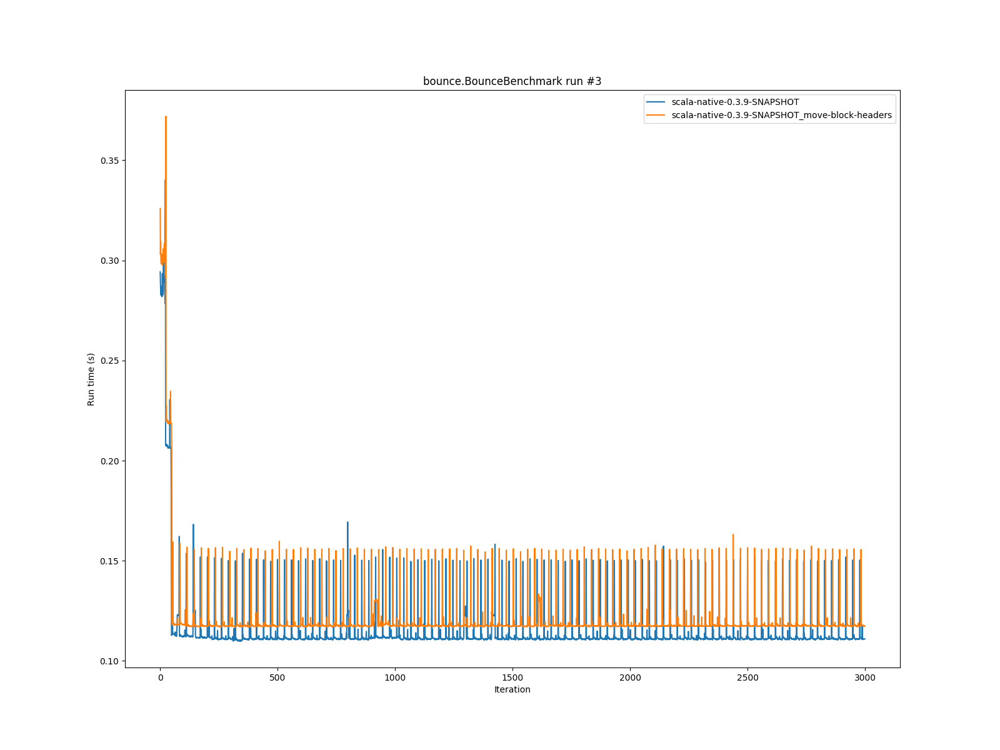
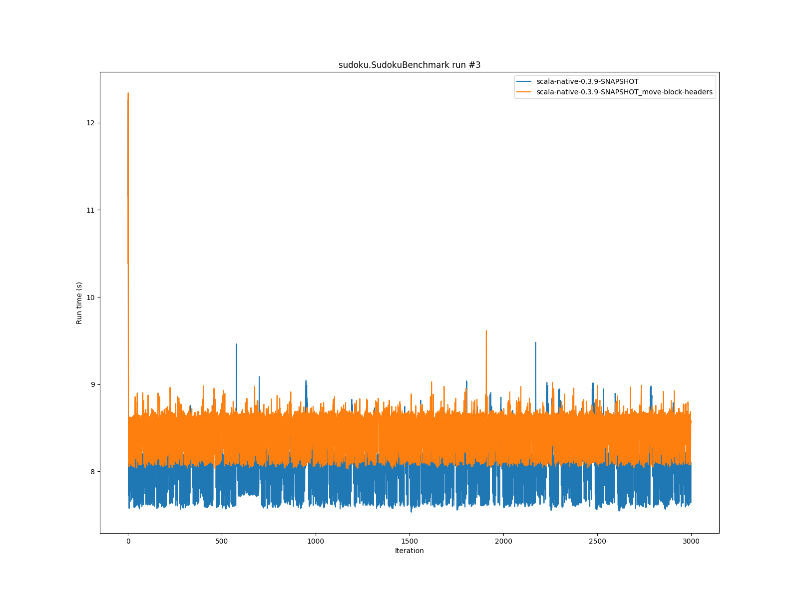

# Summary
## Benchmark run time (s) at 50 percentile 

|name | scala-native-0.3.9-SNAPSHOT | scala-native-0.3.9-SNAPSHOT_move-block-headers | |
| -- | -- | -- | -- |
|[bounce.BounceBenchmark](#bouncebouncebenchmark)|0.1109|0.1184|+6.81%|
|[list.ListBenchmark](#listlistbenchmark)|0.0510|0.0515|+0.88%|
|[richards.RichardsBenchmark](#richardsrichardsbenchmark)|0.1554|0.1620|+4.21%|
|[queens.QueensBenchmark](#queensqueensbenchmark)|0.1195|0.1233|+3.13%|
|[permute.PermuteBenchmark](#permutepermutebenchmark)|0.8057|0.8860|+9.97%|
|[deltablue.DeltaBlueBenchmark](#deltabluedeltabluebenchmark)|0.2057|0.2075|+0.87%|
|[tracer.TracerBenchmark](#tracertracerbenchmark)|1.0245|1.0736|+4.79%|
|[brainfuck.BrainfuckBenchmark](#brainfuckbrainfuckbenchmark)|16.1010|16.8394|+4.59%|
|[json.JsonBenchmark](#jsonjsonbenchmark)|8.6960|9.5620|+9.96%|
|[cd.CDBenchmark](#cdcdbenchmark)|35.7777|36.7726|+2.78%|
|[kmeans.KmeansBenchmark](#kmeanskmeansbenchmark)|164.0224|175.9006|+7.24%|
|[gcbench.GCBenchBenchmark](#gcbenchgcbenchbenchmark)|177.3804|188.3633|+6.19%|
|[mandelbrot.MandelbrotBenchmark](#mandelbrotmandelbrotbenchmark)|89.7242|90.4111|+0.77%|
|[nbody.NbodyBenchmark](#nbodynbodybenchmark)|171.2756|170.1479|__-0.66%__|
|[sudoku.SudokuBenchmark](#sudokusudokubenchmark)|8.1184|8.5258|+5.02%|
## Benchmark run time (s) at 90 percentile 

|name | scala-native-0.3.9-SNAPSHOT | scala-native-0.3.9-SNAPSHOT_move-block-headers | |
| -- | -- | -- | -- |
|[bounce.BounceBenchmark](#bouncebouncebenchmark)|0.1153|0.1201|+4.11%|
|[list.ListBenchmark](#listlistbenchmark)|0.0517|0.0525|+1.41%|
|[richards.RichardsBenchmark](#richardsrichardsbenchmark)|0.1709|0.1672|__-2.21%__|
|[queens.QueensBenchmark](#queensqueensbenchmark)|0.1319|0.1263|__-4.30%__|
|[permute.PermuteBenchmark](#permutepermutebenchmark)|0.8514|0.9290|+9.11%|
|[deltablue.DeltaBlueBenchmark](#deltabluedeltabluebenchmark)|0.2179|0.2165|__-0.63%__|
|[tracer.TracerBenchmark](#tracertracerbenchmark)|1.0440|1.0947|+4.85%|
|[brainfuck.BrainfuckBenchmark](#brainfuckbrainfuckbenchmark)|16.4608|17.1793|+4.36%|
|[json.JsonBenchmark](#jsonjsonbenchmark)|9.0781|9.9329|+9.42%|
|[cd.CDBenchmark](#cdcdbenchmark)|36.3131|37.4797|+3.21%|
|[kmeans.KmeansBenchmark](#kmeanskmeansbenchmark)|167.8540|191.6851|+14.20%|
|[gcbench.GCBenchBenchmark](#gcbenchgcbenchbenchmark)|181.4256|192.9008|+6.33%|
|[mandelbrot.MandelbrotBenchmark](#mandelbrotmandelbrotbenchmark)|92.5854|91.4710|__-1.20%__|
|[nbody.NbodyBenchmark](#nbodynbodybenchmark)|174.8444|172.1211|__-1.56%__|
|[sudoku.SudokuBenchmark](#sudokusudokubenchmark)|8.3635|8.6810|+3.80%|
## Benchmark run time (s) at 99 percentile 

|name | scala-native-0.3.9-SNAPSHOT | scala-native-0.3.9-SNAPSHOT_move-block-headers | |
| -- | -- | -- | -- |
|[bounce.BounceBenchmark](#bouncebouncebenchmark)|0.1508|0.1580|+4.81%|
|[list.ListBenchmark](#listlistbenchmark)|0.0566|0.0568|+0.27%|
|[richards.RichardsBenchmark](#richardsrichardsbenchmark)|0.2124|0.2038|__-4.07%__|
|[queens.QueensBenchmark](#queensqueensbenchmark)|0.1606|0.1646|+2.48%|
|[permute.PermuteBenchmark](#permutepermutebenchmark)|0.9279|0.9619|+3.66%|
|[deltablue.DeltaBlueBenchmark](#deltabluedeltabluebenchmark)|0.2565|0.3314|+29.22%|
|[tracer.TracerBenchmark](#tracertracerbenchmark)|1.1355|1.1597|+2.13%|
|[brainfuck.BrainfuckBenchmark](#brainfuckbrainfuckbenchmark)|17.7753|17.8825|+0.60%|
|[json.JsonBenchmark](#jsonjsonbenchmark)|9.4792|10.2401|+8.03%|
|[cd.CDBenchmark](#cdcdbenchmark)|39.0174|38.4504|__-1.45%__|
|[kmeans.KmeansBenchmark](#kmeanskmeansbenchmark)|183.0590|198.7336|+8.56%|
|[gcbench.GCBenchBenchmark](#gcbenchgcbenchbenchmark)|191.6265|194.9789|+1.75%|
|[mandelbrot.MandelbrotBenchmark](#mandelbrotmandelbrotbenchmark)|99.9938|92.7938|__-7.20%__|
|[nbody.NbodyBenchmark](#nbodynbodybenchmark)|186.2449|176.2564|__-5.36%__|
|[sudoku.SudokuBenchmark](#sudokusudokubenchmark)|8.9656|8.9223|__-0.48%__|
# Individual benchmarks
## bounce.BounceBenchmark

## list.ListBenchmark

## richards.RichardsBenchmark

## queens.QueensBenchmark

## permute.PermuteBenchmark

## deltablue.DeltaBlueBenchmark

## tracer.TracerBenchmark

## brainfuck.BrainfuckBenchmark

## json.JsonBenchmark

## cd.CDBenchmark

## kmeans.KmeansBenchmark

## gcbench.GCBenchBenchmark

## mandelbrot.MandelbrotBenchmark

## nbody.NbodyBenchmark

## sudoku.SudokuBenchmark

