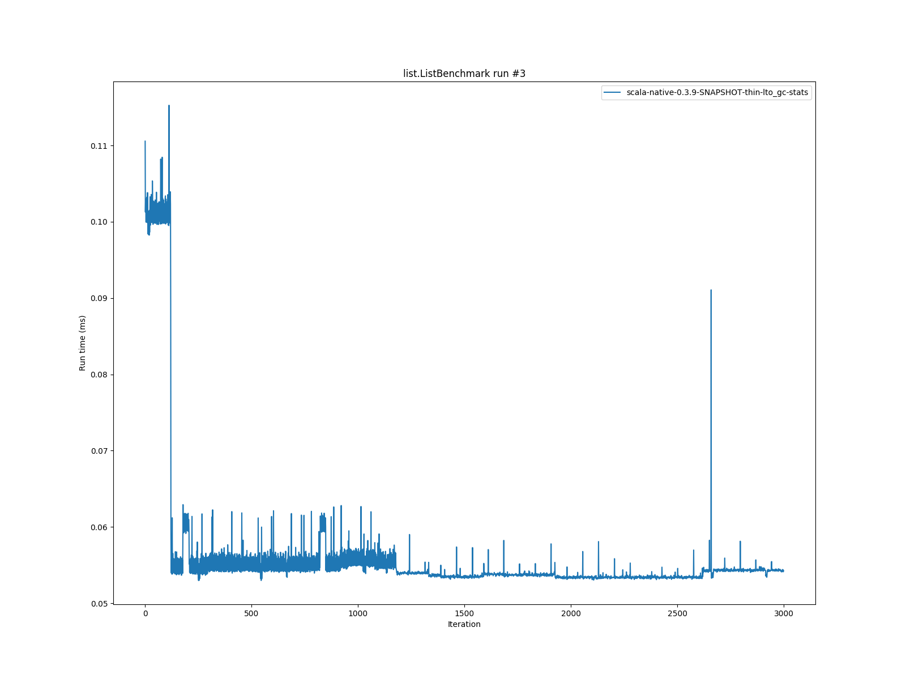
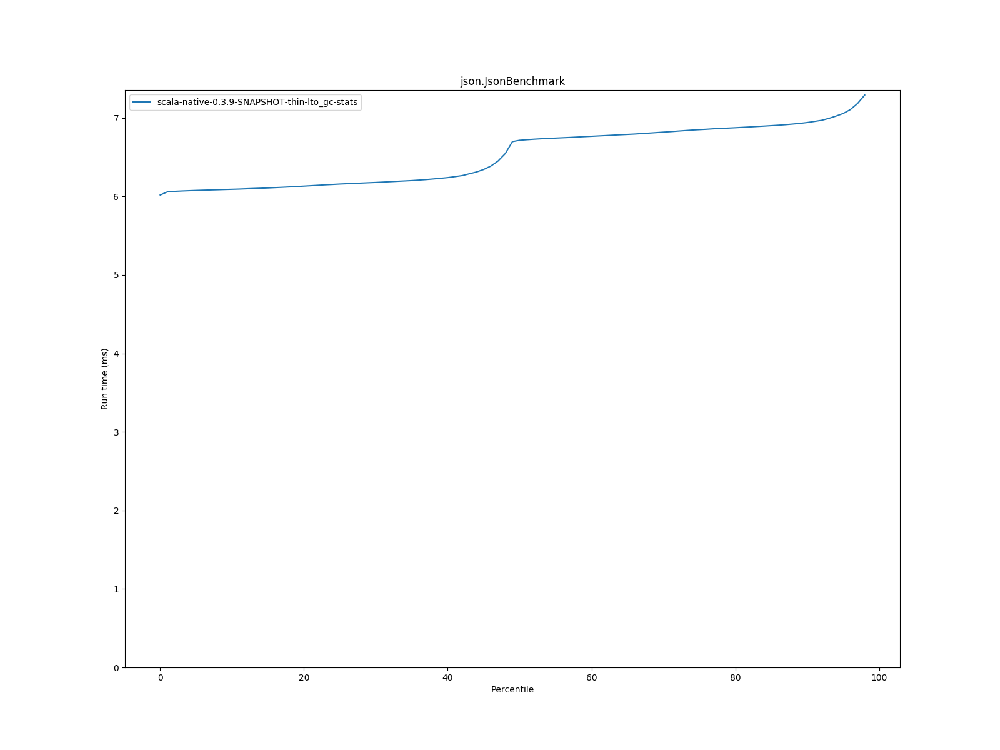

# Summary
## Benchmark run time (ms) at 50 percentile 

|name | scala-native-0.3.9-SNAPSHOT-thin-lto_gc-stats|
| -- | -- |
|[bounce.BounceBenchmark](#bouncebouncebenchmark)|0.0854|
|[list.ListBenchmark](#listlistbenchmark)|0.0538|
|[richards.RichardsBenchmark](#richardsrichardsbenchmark)|0.1347|
|[queens.QueensBenchmark](#queensqueensbenchmark)|0.1070|
|[permute.PermuteBenchmark](#permutepermutebenchmark)|0.6304|
|[deltablue.DeltaBlueBenchmark](#deltabluedeltabluebenchmark)|0.1950|
|[tracer.TracerBenchmark](#tracertracerbenchmark)|0.7070|
|[brainfuck.BrainfuckBenchmark](#brainfuckbrainfuckbenchmark)|12.6132|
|[json.JsonBenchmark](#jsonjsonbenchmark)|6.7164|
|[cd.CDBenchmark](#cdcdbenchmark)|28.8256|
|[kmeans.KmeansBenchmark](#kmeanskmeansbenchmark)|131.5756|
|[gcbench.GCBenchBenchmark](#gcbenchgcbenchbenchmark)|105.0152|
|[mandelbrot.MandelbrotBenchmark](#mandelbrotmandelbrotbenchmark)|90.8288|
|[nbody.NbodyBenchmark](#nbodynbodybenchmark)|115.2016|
|[sudoku.SudokuBenchmark](#sudokusudokubenchmark)|6.9997|
## GC time (ms) at 50 percentile 

|name |  | scala-native-0.3.9-SNAPSHOT-thin-lto_gc-stats|
| -- | -- | -- |
|[bounce.BounceBenchmark](#bouncebouncebenchmark)|mark|0.0110|
|sweep|0.0215|
|total|0.0320|
|[list.ListBenchmark](#listlistbenchmark)|mark|0.0160|
|sweep|0.0250|
|total|0.0410|
|[richards.RichardsBenchmark](#richardsrichardsbenchmark)|mark|0.0110|
|sweep|0.0220|
|total|0.0330|
|[queens.QueensBenchmark](#queensqueensbenchmark)|mark|0.0120|
|sweep|0.0220|
|total|0.0350|
|[permute.PermuteBenchmark](#permutepermutebenchmark)|mark|0.0120|
|sweep|0.0220|
|total|0.0340|
|[deltablue.DeltaBlueBenchmark](#deltabluedeltabluebenchmark)|mark|0.0150|
|sweep|0.0260|
|total|0.0410|
|[tracer.TracerBenchmark](#tracertracerbenchmark)|mark|0.0140|
|sweep|0.0230|
|total|0.0380|
|[brainfuck.BrainfuckBenchmark](#brainfuckbrainfuckbenchmark)|mark|0.0670|
|sweep|0.1420|
|total|0.2100|
|[json.JsonBenchmark](#jsonjsonbenchmark)|mark|0.2190|
|sweep|0.4550|
|total|0.6750|
|[cd.CDBenchmark](#cdcdbenchmark)|mark|0.0510|
|sweep|0.0680|
|total|0.1190|
|[kmeans.KmeansBenchmark](#kmeanskmeansbenchmark)|mark|4.0630|
|sweep|2.2290|
|total|6.3100|
|[gcbench.GCBenchBenchmark](#gcbenchgcbenchbenchmark)|mark|1.4800|
|sweep|0.9160|
|total|2.3860|
|[mandelbrot.MandelbrotBenchmark](#mandelbrotmandelbrotbenchmark)|mark|0.0425|
|sweep|0.0535|
|total|0.0965|
|[nbody.NbodyBenchmark](#nbodynbodybenchmark)|mark|0.0120|
|sweep|0.0200|
|total|0.0320|
|[sudoku.SudokuBenchmark](#sudokusudokubenchmark)|mark|0.2000|
|sweep|0.3880|
|total|0.5890|
## Benchmark run time (ms) at 90 percentile 

|name | scala-native-0.3.9-SNAPSHOT-thin-lto_gc-stats|
| -- | -- |
|[bounce.BounceBenchmark](#bouncebouncebenchmark)|0.0878|
|[list.ListBenchmark](#listlistbenchmark)|0.0548|
|[richards.RichardsBenchmark](#richardsrichardsbenchmark)|0.1457|
|[queens.QueensBenchmark](#queensqueensbenchmark)|0.1092|
|[permute.PermuteBenchmark](#permutepermutebenchmark)|0.6704|
|[deltablue.DeltaBlueBenchmark](#deltabluedeltabluebenchmark)|0.2117|
|[tracer.TracerBenchmark](#tracertracerbenchmark)|0.7275|
|[brainfuck.BrainfuckBenchmark](#brainfuckbrainfuckbenchmark)|13.0481|
|[json.JsonBenchmark](#jsonjsonbenchmark)|6.9423|
|[cd.CDBenchmark](#cdcdbenchmark)|29.6473|
|[kmeans.KmeansBenchmark](#kmeanskmeansbenchmark)|142.1331|
|[gcbench.GCBenchBenchmark](#gcbenchgcbenchbenchmark)|106.8962|
|[mandelbrot.MandelbrotBenchmark](#mandelbrotmandelbrotbenchmark)|91.7045|
|[nbody.NbodyBenchmark](#nbodynbodybenchmark)|117.2540|
|[sudoku.SudokuBenchmark](#sudokusudokubenchmark)|7.3503|
## GC time (ms) at 90 percentile 

|name |  | scala-native-0.3.9-SNAPSHOT-thin-lto_gc-stats|
| -- | -- | -- |
|[bounce.BounceBenchmark](#bouncebouncebenchmark)|mark|0.0120|
|sweep|0.0230|
|total|0.0350|
|[list.ListBenchmark](#listlistbenchmark)|mark|0.0351|
|sweep|0.0452|
|total|0.0784|
|[richards.RichardsBenchmark](#richardsrichardsbenchmark)|mark|0.0120|
|sweep|0.0230|
|total|0.0350|
|[queens.QueensBenchmark](#queensqueensbenchmark)|mark|0.0140|
|sweep|0.0240|
|total|0.0370|
|[permute.PermuteBenchmark](#permutepermutebenchmark)|mark|0.0130|
|sweep|0.0230|
|total|0.0360|
|[deltablue.DeltaBlueBenchmark](#deltabluedeltabluebenchmark)|mark|0.0160|
|sweep|0.0270|
|total|0.0440|
|[tracer.TracerBenchmark](#tracertracerbenchmark)|mark|0.0160|
|sweep|0.0240|
|total|0.0400|
|[brainfuck.BrainfuckBenchmark](#brainfuckbrainfuckbenchmark)|mark|0.0740|
|sweep|0.1560|
|total|0.2290|
|[json.JsonBenchmark](#jsonjsonbenchmark)|mark|0.2270|
|sweep|0.4780|
|total|0.7010|
|[cd.CDBenchmark](#cdcdbenchmark)|mark|0.0840|
|sweep|0.1310|
|total|0.2120|
|[kmeans.KmeansBenchmark](#kmeanskmeansbenchmark)|mark|5.9950|
|sweep|3.6360|
|total|9.5030|
|[gcbench.GCBenchBenchmark](#gcbenchgcbenchbenchmark)|mark|5.7620|
|sweep|2.7090|
|total|8.4790|
|[mandelbrot.MandelbrotBenchmark](#mandelbrotmandelbrotbenchmark)|mark|0.0501|
|sweep|0.0660|
|total|0.1170|
|[nbody.NbodyBenchmark](#nbodynbodybenchmark)|mark|0.0120|
|sweep|0.0210|
|total|0.0330|
|[sudoku.SudokuBenchmark](#sudokusudokubenchmark)|mark|0.2280|
|sweep|0.4070|
|total|0.6340|
## Benchmark run time (ms) at 99 percentile 

|name | scala-native-0.3.9-SNAPSHOT-thin-lto_gc-stats|
| -- | -- |
|[bounce.BounceBenchmark](#bouncebouncebenchmark)|0.1192|
|[list.ListBenchmark](#listlistbenchmark)|0.0595|
|[richards.RichardsBenchmark](#richardsrichardsbenchmark)|0.1745|
|[queens.QueensBenchmark](#queensqueensbenchmark)|0.1424|
|[permute.PermuteBenchmark](#permutepermutebenchmark)|0.7288|
|[deltablue.DeltaBlueBenchmark](#deltabluedeltabluebenchmark)|0.2427|
|[tracer.TracerBenchmark](#tracertracerbenchmark)|0.7781|
|[brainfuck.BrainfuckBenchmark](#brainfuckbrainfuckbenchmark)|13.8924|
|[json.JsonBenchmark](#jsonjsonbenchmark)|7.4524|
|[cd.CDBenchmark](#cdcdbenchmark)|31.7554|
|[kmeans.KmeansBenchmark](#kmeanskmeansbenchmark)|155.0053|
|[gcbench.GCBenchBenchmark](#gcbenchgcbenchbenchmark)|113.1045|
|[mandelbrot.MandelbrotBenchmark](#mandelbrotmandelbrotbenchmark)|97.6018|
|[nbody.NbodyBenchmark](#nbodynbodybenchmark)|125.0276|
|[sudoku.SudokuBenchmark](#sudokusudokubenchmark)|7.7645|
## GC time (ms) at 99 percentile 

|name |  | scala-native-0.3.9-SNAPSHOT-thin-lto_gc-stats|
| -- | -- | -- |
|[bounce.BounceBenchmark](#bouncebouncebenchmark)|mark|0.0326|
|sweep|0.0456|
|total|0.0800|
|[list.ListBenchmark](#listlistbenchmark)|mark|0.0444|
|sweep|0.0610|
|total|0.1054|
|[richards.RichardsBenchmark](#richardsrichardsbenchmark)|mark|0.0296|
|sweep|0.0416|
|total|0.0690|
|[queens.QueensBenchmark](#queensqueensbenchmark)|mark|0.0400|
|sweep|0.0504|
|total|0.0914|
|[permute.PermuteBenchmark](#permutepermutebenchmark)|mark|0.0190|
|sweep|0.0300|
|total|0.0470|
|[deltablue.DeltaBlueBenchmark](#deltabluedeltabluebenchmark)|mark|0.0410|
|sweep|0.0540|
|total|0.0950|
|[tracer.TracerBenchmark](#tracertracerbenchmark)|mark|0.0180|
|sweep|0.0270|
|total|0.0450|
|[brainfuck.BrainfuckBenchmark](#brainfuckbrainfuckbenchmark)|mark|0.1180|
|sweep|0.2190|
|total|0.3440|
|[json.JsonBenchmark](#jsonjsonbenchmark)|mark|0.2690|
|sweep|0.5370|
|total|0.8088|
|[cd.CDBenchmark](#cdcdbenchmark)|mark|0.1140|
|sweep|0.1460|
|total|0.2470|
|[kmeans.KmeansBenchmark](#kmeanskmeansbenchmark)|mark|6.9590|
|sweep|4.1540|
|total|11.0080|
|[gcbench.GCBenchBenchmark](#gcbenchgcbenchbenchmark)|mark|6.0170|
|sweep|2.7710|
|total|8.7630|
|[mandelbrot.MandelbrotBenchmark](#mandelbrotmandelbrotbenchmark)|mark|0.0520|
|sweep|0.0690|
|total|0.1186|
|[nbody.NbodyBenchmark](#nbodynbodybenchmark)|mark|0.0140|
|sweep|0.0230|
|total|0.0370|
|[sudoku.SudokuBenchmark](#sudokusudokubenchmark)|mark|0.2540|
|sweep|0.4320|
|total|0.6788|
# Individual benchmarks
## bounce.BounceBenchmark

## list.ListBenchmark

## richards.RichardsBenchmark

## queens.QueensBenchmark

## permute.PermuteBenchmark

## deltablue.DeltaBlueBenchmark

## tracer.TracerBenchmark

## brainfuck.BrainfuckBenchmark

## json.JsonBenchmark

## cd.CDBenchmark

## kmeans.KmeansBenchmark

## gcbench.GCBenchBenchmark

## mandelbrot.MandelbrotBenchmark

## nbody.NbodyBenchmark

## sudoku.SudokuBenchmark

