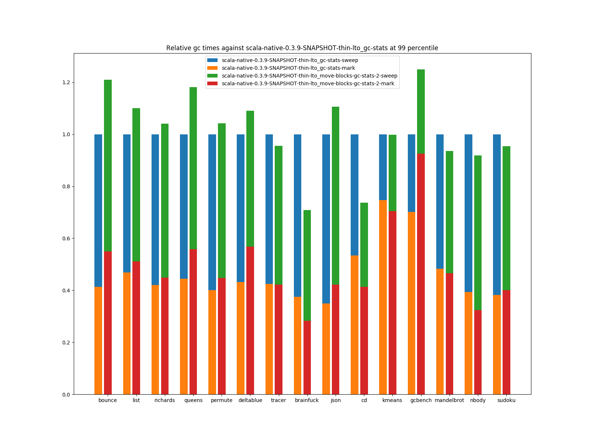
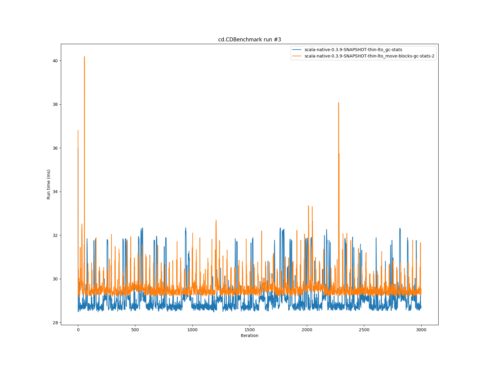
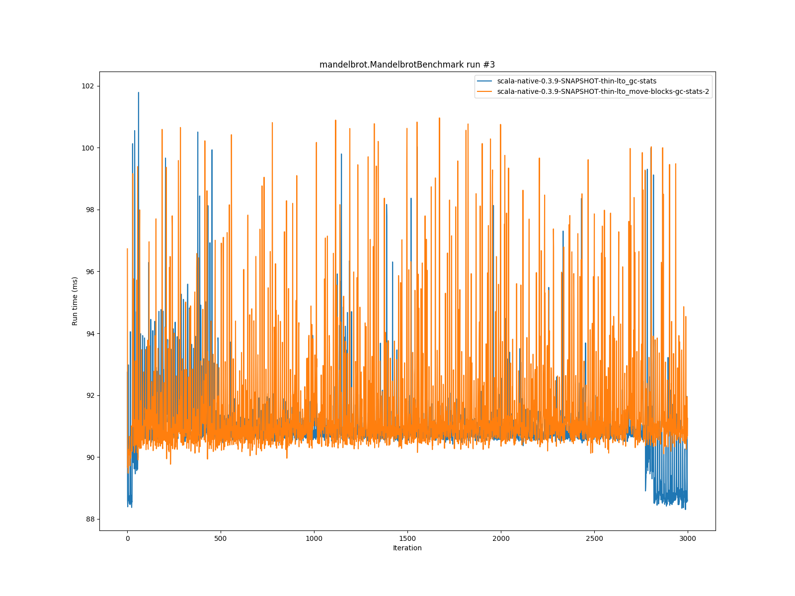

# Summary
## Benchmark run time (ms) at 50 percentile 

|name | scala-native-0.3.9-SNAPSHOT-thin-lto_gc-stats | scala-native-0.3.9-SNAPSHOT-thin-lto_move-blocks-gc-stats-2 | |
| -- | -- | -- | -- |
|[bounce.BounceBenchmark](#bouncebouncebenchmark)|0.0854|0.0853|__-0.19%__|
|[list.ListBenchmark](#listlistbenchmark)|0.0538|0.0535|__-0.46%__|
|[richards.RichardsBenchmark](#richardsrichardsbenchmark)|0.1347|0.1373|+1.91%|
|[queens.QueensBenchmark](#queensqueensbenchmark)|0.1070|0.1091|+1.95%|
|[permute.PermuteBenchmark](#permutepermutebenchmark)|0.6304|0.6189|__-1.82%__|
|[deltablue.DeltaBlueBenchmark](#deltabluedeltabluebenchmark)|0.1950|0.1927|__-1.15%__|
|[tracer.TracerBenchmark](#tracertracerbenchmark)|0.7070|0.7160|+1.28%|
|[brainfuck.BrainfuckBenchmark](#brainfuckbrainfuckbenchmark)|12.6132|11.9783|__-5.03%__|
|[json.JsonBenchmark](#jsonjsonbenchmark)|6.7164|6.8630|+2.18%|
|[cd.CDBenchmark](#cdcdbenchmark)|28.8256|29.4623|+2.21%|
|[kmeans.KmeansBenchmark](#kmeanskmeansbenchmark)|131.5756|124.5051|__-5.37%__|
|[gcbench.GCBenchBenchmark](#gcbenchgcbenchbenchmark)|105.0152|104.6571|__-0.34%__|
|[mandelbrot.MandelbrotBenchmark](#mandelbrotmandelbrotbenchmark)|90.8288|91.0800|+0.28%|
|[nbody.NbodyBenchmark](#nbodynbodybenchmark)|115.2016|111.1883|__-3.48%__|
|[sudoku.SudokuBenchmark](#sudokusudokubenchmark)|6.9997|7.1832|+2.62%|
## GC time (ms) at 50 percentile 

|name |  | scala-native-0.3.9-SNAPSHOT-thin-lto_gc-stats | scala-native-0.3.9-SNAPSHOT-thin-lto_move-blocks-gc-stats-2 | |
| -- | -- | -- | -- | -- |
|[bounce.BounceBenchmark](#bouncebouncebenchmark)|mark|0.0110|0.0110|__0.00%__|
||sweep|0.0215|0.0200|__-6.98%__|
||total|0.0320|0.0310|__-3.12%__|
|[list.ListBenchmark](#listlistbenchmark)|mark|0.0160|0.0150|__-6.25%__|
||sweep|0.0250|0.0225|__-10.00%__|
||total|0.0410|0.0370|__-9.76%__|
|[richards.RichardsBenchmark](#richardsrichardsbenchmark)|mark|0.0110|0.0110|__0.00%__|
||sweep|0.0220|0.0200|__-9.09%__|
||total|0.0330|0.0310|__-6.06%__|
|[queens.QueensBenchmark](#queensqueensbenchmark)|mark|0.0120|0.0130|+8.33%|
||sweep|0.0220|0.0210|__-4.55%__|
||total|0.0350|0.0340|__-2.86%__|
|[permute.PermuteBenchmark](#permutepermutebenchmark)|mark|0.0120|0.0120|__0.00%__|
||sweep|0.0220|0.0200|__-9.09%__|
||total|0.0340|0.0320|__-5.88%__|
|[deltablue.DeltaBlueBenchmark](#deltabluedeltabluebenchmark)|mark|0.0150|0.0260|+73.33%|
||sweep|0.0260|0.0280|+7.69%|
||total|0.0410|0.0530|+29.27%|
|[tracer.TracerBenchmark](#tracertracerbenchmark)|mark|0.0140|0.0140|__0.00%__|
||sweep|0.0230|0.0210|__-8.70%__|
||total|0.0380|0.0360|__-5.26%__|
|[brainfuck.BrainfuckBenchmark](#brainfuckbrainfuckbenchmark)|mark|0.0670|0.0690|+2.99%|
||sweep|0.1420|0.1190|__-16.20%__|
||total|0.2100|0.1890|__-10.00%__|
|[json.JsonBenchmark](#jsonjsonbenchmark)|mark|0.2190|0.3030|+38.36%|
||sweep|0.4550|0.4930|+8.35%|
||total|0.6750|0.7960|+17.93%|
|[cd.CDBenchmark](#cdcdbenchmark)|mark|0.0510|0.0500|__-1.96%__|
||sweep|0.0680|0.0590|__-13.24%__|
||total|0.1190|0.1100|__-7.56%__|
|[kmeans.KmeansBenchmark](#kmeanskmeansbenchmark)|mark|4.0630|2.9890|__-26.43%__|
||sweep|2.2290|1.5620|__-29.92%__|
||total|6.3100|4.5260|__-28.27%__|
|[gcbench.GCBenchBenchmark](#gcbenchgcbenchbenchmark)|mark|1.4800|1.6060|+8.51%|
||sweep|0.9160|0.3770|__-58.84%__|
||total|2.3860|1.9780|__-17.10%__|
|[mandelbrot.MandelbrotBenchmark](#mandelbrotmandelbrotbenchmark)|mark|0.0425|0.0445|+4.71%|
||sweep|0.0535|0.0460|__-14.02%__|
||total|0.0965|0.0905|__-6.22%__|
|[nbody.NbodyBenchmark](#nbodynbodybenchmark)|mark|0.0120|0.0100|__-16.67%__|
||sweep|0.0200|0.0190|__-5.00%__|
||total|0.0320|0.0290|__-9.38%__|
|[sudoku.SudokuBenchmark](#sudokusudokubenchmark)|mark|0.2000|0.2040|+2.00%|
||sweep|0.3880|0.3430|__-11.60%__|
||total|0.5890|0.5490|__-6.79%__|
## Benchmark run time (ms) at 90 percentile 

|name | scala-native-0.3.9-SNAPSHOT-thin-lto_gc-stats | scala-native-0.3.9-SNAPSHOT-thin-lto_move-blocks-gc-stats-2 | |
| -- | -- | -- | -- |
|[bounce.BounceBenchmark](#bouncebouncebenchmark)|0.0878|0.0895|+1.96%|
|[list.ListBenchmark](#listlistbenchmark)|0.0548|0.0560|+2.21%|
|[richards.RichardsBenchmark](#richardsrichardsbenchmark)|0.1457|0.1446|__-0.79%__|
|[queens.QueensBenchmark](#queensqueensbenchmark)|0.1092|0.1192|+9.18%|
|[permute.PermuteBenchmark](#permutepermutebenchmark)|0.6704|0.6589|__-1.71%__|
|[deltablue.DeltaBlueBenchmark](#deltabluedeltabluebenchmark)|0.2117|0.2061|__-2.65%__|
|[tracer.TracerBenchmark](#tracertracerbenchmark)|0.7275|0.7444|+2.32%|
|[brainfuck.BrainfuckBenchmark](#brainfuckbrainfuckbenchmark)|13.0481|12.2718|__-5.95%__|
|[json.JsonBenchmark](#jsonjsonbenchmark)|6.9423|7.0020|+0.86%|
|[cd.CDBenchmark](#cdcdbenchmark)|29.6473|30.1658|+1.75%|
|[kmeans.KmeansBenchmark](#kmeanskmeansbenchmark)|142.1331|130.3161|__-8.31%__|
|[gcbench.GCBenchBenchmark](#gcbenchgcbenchbenchmark)|106.8962|106.8953|__-0.00%__|
|[mandelbrot.MandelbrotBenchmark](#mandelbrotmandelbrotbenchmark)|91.7045|92.7879|+1.18%|
|[nbody.NbodyBenchmark](#nbodynbodybenchmark)|117.2540|112.6656|__-3.91%__|
|[sudoku.SudokuBenchmark](#sudokusudokubenchmark)|7.3503|7.3517|+0.02%|
## GC time (ms) at 90 percentile 

|name |  | scala-native-0.3.9-SNAPSHOT-thin-lto_gc-stats | scala-native-0.3.9-SNAPSHOT-thin-lto_move-blocks-gc-stats-2 | |
| -- | -- | -- | -- | -- |
|[bounce.BounceBenchmark](#bouncebouncebenchmark)|mark|0.0120|0.0130|+8.33%|
||sweep|0.0230|0.0210|__-8.70%__|
||total|0.0350|0.0340|__-2.86%__|
|[list.ListBenchmark](#listlistbenchmark)|mark|0.0351|0.0381|+8.55%|
||sweep|0.0452|0.0443|__-1.99%__|
||total|0.0784|0.0816|+4.08%|
|[richards.RichardsBenchmark](#richardsrichardsbenchmark)|mark|0.0120|0.0120|__0.00%__|
||sweep|0.0230|0.0210|__-8.70%__|
||total|0.0350|0.0340|__-2.86%__|
|[queens.QueensBenchmark](#queensqueensbenchmark)|mark|0.0140|0.0150|+7.14%|
||sweep|0.0240|0.0230|__-4.17%__|
||total|0.0370|0.0380|+2.70%|
|[permute.PermuteBenchmark](#permutepermutebenchmark)|mark|0.0130|0.0130|__0.00%__|
||sweep|0.0230|0.0210|__-8.70%__|
||total|0.0360|0.0340|__-5.56%__|
|[deltablue.DeltaBlueBenchmark](#deltabluedeltabluebenchmark)|mark|0.0160|0.0390|+143.75%|
||sweep|0.0270|0.0320|+18.52%|
||total|0.0440|0.0720|+63.64%|
|[tracer.TracerBenchmark](#tracertracerbenchmark)|mark|0.0160|0.0160|__0.00%__|
||sweep|0.0240|0.0230|__-4.17%__|
||total|0.0400|0.0380|__-5.00%__|
|[brainfuck.BrainfuckBenchmark](#brainfuckbrainfuckbenchmark)|mark|0.0740|0.0770|+4.05%|
||sweep|0.1560|0.1330|__-14.74%__|
||total|0.2290|0.2080|__-9.17%__|
|[json.JsonBenchmark](#jsonjsonbenchmark)|mark|0.2270|0.3120|+37.44%|
||sweep|0.4780|0.5070|+6.07%|
||total|0.7010|0.8150|+16.26%|
|[cd.CDBenchmark](#cdcdbenchmark)|mark|0.0840|0.0700|__-16.67%__|
||sweep|0.1310|0.0680|__-48.09%__|
||total|0.2120|0.1380|__-34.91%__|
|[kmeans.KmeansBenchmark](#kmeanskmeansbenchmark)|mark|5.9950|5.3670|__-10.48%__|
||sweep|3.6360|2.7470|__-24.45%__|
||total|9.5030|7.3530|__-22.62%__|
|[gcbench.GCBenchBenchmark](#gcbenchgcbenchbenchmark)|mark|5.7620|7.8250|+35.80%|
||sweep|2.7090|2.6530|__-2.07%__|
||total|8.4790|10.4740|+23.53%|
|[mandelbrot.MandelbrotBenchmark](#mandelbrotmandelbrotbenchmark)|mark|0.0501|0.0540|+7.78%|
||sweep|0.0660|0.0560|__-15.15%__|
||total|0.1170|0.1091|__-6.75%__|
|[nbody.NbodyBenchmark](#nbodynbodybenchmark)|mark|0.0120|0.0110|__-8.33%__|
||sweep|0.0210|0.0200|__-4.76%__|
||total|0.0330|0.0300|__-9.09%__|
|[sudoku.SudokuBenchmark](#sudokusudokubenchmark)|mark|0.2280|0.2350|+3.07%|
||sweep|0.4070|0.3580|__-12.04%__|
||total|0.6340|0.5900|__-6.94%__|
## Benchmark run time (ms) at 99 percentile 

|name | scala-native-0.3.9-SNAPSHOT-thin-lto_gc-stats | scala-native-0.3.9-SNAPSHOT-thin-lto_move-blocks-gc-stats-2 | |
| -- | -- | -- | -- |
|[bounce.BounceBenchmark](#bouncebouncebenchmark)|0.1192|0.1177|__-1.24%__|
|[list.ListBenchmark](#listlistbenchmark)|0.0595|0.0608|+2.11%|
|[richards.RichardsBenchmark](#richardsrichardsbenchmark)|0.1745|0.1748|+0.18%|
|[queens.QueensBenchmark](#queensqueensbenchmark)|0.1424|0.1453|+2.01%|
|[permute.PermuteBenchmark](#permutepermutebenchmark)|0.7288|0.7078|__-2.89%__|
|[deltablue.DeltaBlueBenchmark](#deltabluedeltabluebenchmark)|0.2427|0.2646|+9.03%|
|[tracer.TracerBenchmark](#tracertracerbenchmark)|0.7781|0.7858|+0.99%|
|[brainfuck.BrainfuckBenchmark](#brainfuckbrainfuckbenchmark)|13.8924|13.1429|__-5.40%__|
|[json.JsonBenchmark](#jsonjsonbenchmark)|7.4524|7.4020|__-0.68%__|
|[cd.CDBenchmark](#cdcdbenchmark)|31.7554|32.4493|+2.19%|
|[kmeans.KmeansBenchmark](#kmeanskmeansbenchmark)|155.0053|139.4487|__-10.04%__|
|[gcbench.GCBenchBenchmark](#gcbenchgcbenchbenchmark)|113.1045|111.8844|__-1.08%__|
|[mandelbrot.MandelbrotBenchmark](#mandelbrotmandelbrotbenchmark)|97.6018|99.4571|+1.90%|
|[nbody.NbodyBenchmark](#nbodynbodybenchmark)|125.0276|115.6585|__-7.49%__|
|[sudoku.SudokuBenchmark](#sudokusudokubenchmark)|7.7645|7.8935|+1.66%|
## GC time (ms) at 99 percentile 

|name |  | scala-native-0.3.9-SNAPSHOT-thin-lto_gc-stats | scala-native-0.3.9-SNAPSHOT-thin-lto_move-blocks-gc-stats-2 | |
| -- | -- | -- | -- | -- |
|[bounce.BounceBenchmark](#bouncebouncebenchmark)|mark|0.0326|0.0440|+34.89%|
||sweep|0.0456|0.0520|+13.99%|
||total|0.0800|0.0968|+20.94%|
|[list.ListBenchmark](#listlistbenchmark)|mark|0.0444|0.0539|+21.41%|
||sweep|0.0610|0.0621|+1.89%|
||total|0.1054|0.1161|+10.11%|
|[richards.RichardsBenchmark](#richardsrichardsbenchmark)|mark|0.0296|0.0310|+4.69%|
||sweep|0.0416|0.0428|+2.88%|
||total|0.0690|0.0718|+4.07%|
|[queens.QueensBenchmark](#queensqueensbenchmark)|mark|0.0400|0.0510|+27.50%|
||sweep|0.0504|0.0570|+13.05%|
||total|0.0914|0.1080|+18.14%|
|[permute.PermuteBenchmark](#permutepermutebenchmark)|mark|0.0190|0.0210|+10.53%|
||sweep|0.0300|0.0280|__-6.67%__|
||total|0.0470|0.0490|+4.26%|
|[deltablue.DeltaBlueBenchmark](#deltabluedeltabluebenchmark)|mark|0.0410|0.0540|+31.76%|
||sweep|0.0540|0.0485|__-10.13%__|
||total|0.0950|0.1035|+9.00%|
|[tracer.TracerBenchmark](#tracertracerbenchmark)|mark|0.0180|0.0190|+5.56%|
||sweep|0.0270|0.0250|__-7.41%__|
||total|0.0450|0.0430|__-4.44%__|
|[brainfuck.BrainfuckBenchmark](#brainfuckbrainfuckbenchmark)|mark|0.1180|0.0970|__-17.80%__|
||sweep|0.2190|0.1580|__-27.85%__|
||total|0.3440|0.2440|__-29.07%__|
|[json.JsonBenchmark](#jsonjsonbenchmark)|mark|0.2690|0.3414|+26.92%|
||sweep|0.5370|0.5570|+3.72%|
||total|0.8088|0.8950|+10.66%|
|[cd.CDBenchmark](#cdcdbenchmark)|mark|0.1140|0.1020|__-10.53%__|
||sweep|0.1460|0.0850|__-41.78%__|
||total|0.2470|0.1820|__-26.32%__|
|[kmeans.KmeansBenchmark](#kmeanskmeansbenchmark)|mark|6.9590|7.7550|+11.44%|
||sweep|4.1540|3.4060|__-18.01%__|
||total|11.0080|10.9820|__-0.24%__|
|[gcbench.GCBenchBenchmark](#gcbenchgcbenchbenchmark)|mark|6.0170|8.1140|+34.85%|
||sweep|2.7710|2.9070|+4.91%|
||total|8.7630|10.9510|+24.97%|
|[mandelbrot.MandelbrotBenchmark](#mandelbrotmandelbrotbenchmark)|mark|0.0520|0.0552|+6.19%|
||sweep|0.0690|0.0576|__-16.51%__|
||total|0.1186|0.1110|__-6.42%__|
|[nbody.NbodyBenchmark](#nbodynbodybenchmark)|mark|0.0140|0.0120|__-14.29%__|
||sweep|0.0230|0.0220|__-4.35%__|
||total|0.0370|0.0340|__-8.11%__|
|[sudoku.SudokuBenchmark](#sudokusudokubenchmark)|mark|0.2540|0.2720|+7.09%|
||sweep|0.4320|0.3800|__-12.04%__|
||total|0.6788|0.6476|__-4.60%__|
# Individual benchmarks
## bounce.BounceBenchmark

## list.ListBenchmark

## richards.RichardsBenchmark

## queens.QueensBenchmark

## permute.PermuteBenchmark

## deltablue.DeltaBlueBenchmark

## tracer.TracerBenchmark

## brainfuck.BrainfuckBenchmark

## json.JsonBenchmark

## cd.CDBenchmark

## kmeans.KmeansBenchmark

## gcbench.GCBenchBenchmark

## mandelbrot.MandelbrotBenchmark

## nbody.NbodyBenchmark

## sudoku.SudokuBenchmark

