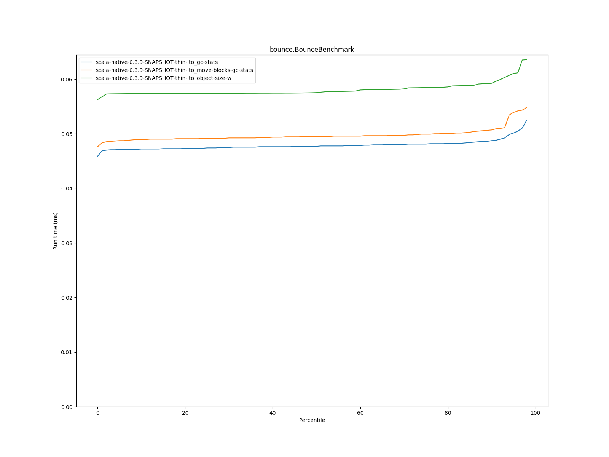
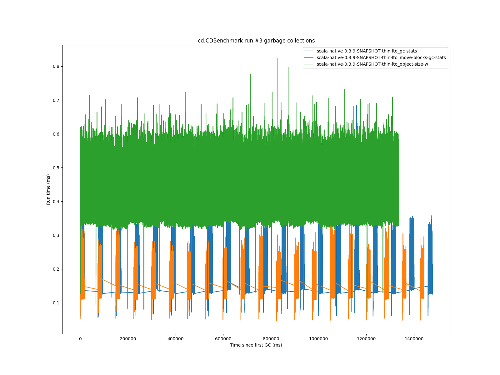

# Summary
## Benchmark run time (ms) at 50 percentile 

|name | scala-native-0.3.9-SNAPSHOT-thin-lto_gc-stats | scala-native-0.3.9-SNAPSHOT-thin-lto_move-blocks-gc-stats |  | scala-native-0.3.9-SNAPSHOT-thin-lto_object-size-w | |
| -- | -- | -- | -- | -- | -- |
|[bounce.BounceBenchmark](#bouncebouncebenchmark)|0.0477|0.0495|+3.80%|0.0576|+20.65%|
|[list.ListBenchmark](#listlistbenchmark)|0.0498|0.0509|+2.25%|0.0539|+8.28%|
|[richards.RichardsBenchmark](#richardsrichardsbenchmark)|0.0659|0.0654|__-0.74%__|0.0616|__-6.49%__|
|[queens.QueensBenchmark](#queensqueensbenchmark)|0.0894|0.0873|__-2.34%__|0.0858|__-4.01%__|
|[permute.PermuteBenchmark](#permutepermutebenchmark)|0.2158|0.2101|__-2.65%__|0.1959|__-9.22%__|
|[deltablue.DeltaBlueBenchmark](#deltabluedeltabluebenchmark)|0.2007|0.1884|__-6.13%__|0.1794|__-10.61%__|
|[tracer.TracerBenchmark](#tracertracerbenchmark)|0.6811|0.6811|+0.00%|0.5915|__-13.15%__|
|[brainfuck.BrainfuckBenchmark](#brainfuckbrainfuckbenchmark)|3.5770|3.7324|+4.34%|3.4516|__-3.51%__|
|[json.JsonBenchmark](#jsonjsonbenchmark)|2.6490|2.8240|+6.61%|2.6835|+1.30%|
|[cd.CDBenchmark](#cdcdbenchmark)|25.4158|24.8439|__-2.25%__|22.1424|__-12.88%__|
|[kmeans.KmeansBenchmark](#kmeanskmeansbenchmark)|61.0161|62.8263|+2.97%|53.2844|__-12.67%__|
|[gcbench.GCBenchBenchmark](#gcbenchgcbenchbenchmark)|92.9670|90.7185|__-2.42%__|112.8475|+21.38%|
|[mandelbrot.MandelbrotBenchmark](#mandelbrotmandelbrotbenchmark)|90.8127|90.6431|__-0.19%__|91.2459|+0.48%|
|[nbody.NbodyBenchmark](#nbodynbodybenchmark)|29.1364|29.1585|+0.08%|28.5822|__-1.90%__|
|[sudoku.SudokuBenchmark](#sudokusudokubenchmark)|2.5772|2.7299|+5.92%|2.5189|__-2.26%__|
## GC time (ms) at 50 percentile 

|name |  | scala-native-0.3.9-SNAPSHOT-thin-lto_gc-stats | scala-native-0.3.9-SNAPSHOT-thin-lto_move-blocks-gc-stats |  | scala-native-0.3.9-SNAPSHOT-thin-lto_object-size-w | |
| -- | -- | -- | -- | -- | -- | -- |
|[bounce.BounceBenchmark](#bouncebouncebenchmark)|mark|0.0120|0.0110|__-8.33%__|0.0130|+8.33%|
||sweep|0.0090|0.0070|__-22.22%__|0.0210|+133.33%|
||total|0.0210|0.0185|__-11.90%__|0.0340|+61.90%|
|[list.ListBenchmark](#listlistbenchmark)|mark|0.0260|0.0265|+1.92%|0.0000|__-100.00%__|
||sweep|0.0140|0.0100|__-28.57%__|0.0000|__-100.00%__|
||total|0.0390|0.0365|__-6.41%__|0.0000|__-100.00%__|
|[richards.RichardsBenchmark](#richardsrichardsbenchmark)|mark|0.0100|0.0110|+10.00%|0.0110|+10.00%|
||sweep|0.0080|0.0070|__-12.50%__|0.0200|+150.00%|
||total|0.0180|0.0170|__-5.56%__|0.0310|+72.22%|
|[queens.QueensBenchmark](#queensqueensbenchmark)|mark|0.0120|0.0120|__0.00%__|0.0130|+8.33%|
||sweep|0.0080|0.0070|__-12.50%__|0.0220|+175.00%|
||total|0.0210|0.0190|__-9.52%__|0.0350|+66.67%|
|[permute.PermuteBenchmark](#permutepermutebenchmark)|mark|0.0100|0.0100|__0.00%__|0.0110|+10.00%|
||sweep|0.0080|0.0060|__-25.00%__|0.0210|+162.50%|
||total|0.0170|0.0170|__0.00%__|0.0320|+88.24%|
|[deltablue.DeltaBlueBenchmark](#deltabluedeltabluebenchmark)|mark|0.0280|0.0300|+7.14%|0.0370|+32.14%|
||sweep|0.0180|0.0170|__-5.56%__|0.0390|+116.67%|
||total|0.0470|0.0470|__0.00%__|0.0760|+61.70%|
|[tracer.TracerBenchmark](#tracertracerbenchmark)|mark|0.0120|0.0120|__0.00%__|0.0120|__0.00%__|
||sweep|0.0090|0.0070|__-22.22%__|0.0210|+133.33%|
||total|0.0210|0.0200|__-4.76%__|0.0330|+57.14%|
|[brainfuck.BrainfuckBenchmark](#brainfuckbrainfuckbenchmark)|mark|0.0500|0.0720|+44.00%|0.0580|+16.00%|
||sweep|0.0600|0.0660|+10.00%|0.1350|+125.00%|
||total|0.1100|0.1400|+27.27%|0.1930|+75.45%|
|[json.JsonBenchmark](#jsonjsonbenchmark)|mark|0.0895|0.1100|+22.91%|0.0590|__-34.08%__|
||sweep|0.0720|0.0850|+18.06%|0.1000|+38.89%|
||total|0.1570|0.2060|+31.21%|0.1590|+1.27%|
|[cd.CDBenchmark](#cdcdbenchmark)|mark|0.0730|0.0660|__-9.59%__|0.0880|+20.55%|
||sweep|0.0860|0.0620|__-27.91%__|0.2920|+239.53%|
||total|0.1600|0.1270|__-20.62%__|0.3790|+136.88%|
|[kmeans.KmeansBenchmark](#kmeanskmeansbenchmark)|mark|3.3910|3.7620|+10.94%|2.2640|__-33.24%__|
||sweep|1.6470|0.7000|__-57.50%__|1.1990|__-27.20%__|
||total|4.8630|4.5240|__-6.97%__|3.5550|__-26.90%__|
|[gcbench.GCBenchBenchmark](#gcbenchgcbenchbenchmark)|mark|1.4650|1.5280|+4.30%|1.9750|+34.81%|
||sweep|0.8040|0.3850|__-52.11%__|1.5000|+86.57%|
||total|2.3660|1.9040|__-19.53%__|3.4680|+46.58%|
|[mandelbrot.MandelbrotBenchmark](#mandelbrotmandelbrotbenchmark)|mark|0.0000|0.0000|N/A|0.0000|N/A|
||sweep|0.0000|0.0000|N/A|0.0000|N/A|
||total|0.0000|0.0000|N/A|0.0000|N/A|
|[nbody.NbodyBenchmark](#nbodynbodybenchmark)|mark|0.0080|0.0080|__0.00%__|0.0090|+12.50%|
||sweep|0.0070|0.0070|__0.00%__|0.0190|+171.43%|
||total|0.0150|0.0150|__0.00%__|0.0280|+86.67%|
|[sudoku.SudokuBenchmark](#sudokusudokubenchmark)|mark|0.0810|0.0830|+2.47%|0.1650|+103.70%|
||sweep|0.0910|0.0770|__-15.38%__|0.3360|+269.23%|
||total|0.1720|0.1600|__-6.98%__|0.5020|+191.86%|
## Benchmark run time (ms) at 90 percentile 

|name | scala-native-0.3.9-SNAPSHOT-thin-lto_gc-stats | scala-native-0.3.9-SNAPSHOT-thin-lto_move-blocks-gc-stats |  | scala-native-0.3.9-SNAPSHOT-thin-lto_object-size-w | |
| -- | -- | -- | -- | -- | -- |
|[bounce.BounceBenchmark](#bouncebouncebenchmark)|0.0488|0.0507|+4.01%|0.0593|+21.55%|
|[list.ListBenchmark](#listlistbenchmark)|0.0518|0.0529|+2.02%|0.0587|+13.31%|
|[richards.RichardsBenchmark](#richardsrichardsbenchmark)|0.0691|0.0714|+3.33%|0.0642|__-7.18%__|
|[queens.QueensBenchmark](#queensqueensbenchmark)|0.0953|0.0907|__-4.84%__|0.0879|__-7.80%__|
|[permute.PermuteBenchmark](#permutepermutebenchmark)|0.2341|0.2269|__-3.10%__|0.2052|__-12.35%__|
|[deltablue.DeltaBlueBenchmark](#deltabluedeltabluebenchmark)|0.2185|0.2053|__-6.01%__|0.1909|__-12.62%__|
|[tracer.TracerBenchmark](#tracertracerbenchmark)|0.7101|0.7020|__-1.14%__|0.6102|__-14.07%__|
|[brainfuck.BrainfuckBenchmark](#brainfuckbrainfuckbenchmark)|3.7685|3.9149|+3.89%|3.5225|__-6.53%__|
|[json.JsonBenchmark](#jsonjsonbenchmark)|2.8830|3.0499|+5.79%|2.8345|__-1.68%__|
|[cd.CDBenchmark](#cdcdbenchmark)|25.9378|25.7393|__-0.77%__|22.7607|__-12.25%__|
|[kmeans.KmeansBenchmark](#kmeanskmeansbenchmark)|66.0959|67.9761|+2.84%|57.1569|__-13.52%__|
|[gcbench.GCBenchBenchmark](#gcbenchgcbenchbenchmark)|96.7885|93.8223|__-3.06%__|117.1636|+21.05%|
|[mandelbrot.MandelbrotBenchmark](#mandelbrotmandelbrotbenchmark)|92.0342|91.8592|__-0.19%__|93.2445|+1.32%|
|[nbody.NbodyBenchmark](#nbodynbodybenchmark)|29.7822|30.0220|+0.81%|29.2776|__-1.69%__|
|[sudoku.SudokuBenchmark](#sudokusudokubenchmark)|2.7898|2.9243|+4.82%|2.7985|+0.31%|
## GC time (ms) at 90 percentile 

|name |  | scala-native-0.3.9-SNAPSHOT-thin-lto_gc-stats | scala-native-0.3.9-SNAPSHOT-thin-lto_move-blocks-gc-stats |  | scala-native-0.3.9-SNAPSHOT-thin-lto_object-size-w | |
| -- | -- | -- | -- | -- | -- | -- |
|[bounce.BounceBenchmark](#bouncebouncebenchmark)|mark|0.0240|0.0250|+4.17%|0.0331|+37.92%|
||sweep|0.0140|0.0100|__-28.57%__|0.0440|+214.29%|
||total|0.0380|0.0341|__-10.26%__|0.0770|+102.63%|
|[list.ListBenchmark](#listlistbenchmark)|mark|0.0350|0.0341|__-2.57%__|0.0000|__-100.00%__|
||sweep|0.0190|0.0111|__-41.58%__|0.0000|__-100.00%__|
||total|0.0542|0.0452|__-16.61%__|0.0000|__-100.00%__|
|[richards.RichardsBenchmark](#richardsrichardsbenchmark)|mark|0.0130|0.0231|+77.69%|0.0180|+38.46%|
||sweep|0.0090|0.0090|__0.00%__|0.0312|+246.67%|
||total|0.0230|0.0312|+35.65%|0.0472|+105.22%|
|[queens.QueensBenchmark](#queensqueensbenchmark)|mark|0.0260|0.0280|+7.69%|0.0370|+42.31%|
||sweep|0.0131|0.0100|__-23.66%__|0.0440|+235.88%|
||total|0.0410|0.0381|__-7.07%__|0.0801|+95.37%|
|[permute.PermuteBenchmark](#permutepermutebenchmark)|mark|0.0110|0.0110|__0.00%__|0.0130|+18.18%|
||sweep|0.0090|0.0070|__-22.22%__|0.0220|+144.44%|
||total|0.0190|0.0180|__-5.26%__|0.0340|+78.95%|
|[deltablue.DeltaBlueBenchmark](#deltabluedeltabluebenchmark)|mark|0.0470|0.0420|__-10.64%__|0.0510|+8.51%|
||sweep|0.0260|0.0210|__-19.23%__|0.0480|+84.62%|
||total|0.0730|0.0640|__-12.33%__|0.1000|+36.99%|
|[tracer.TracerBenchmark](#tracertracerbenchmark)|mark|0.0140|0.0140|__0.00%__|0.0130|__-7.14%__|
||sweep|0.0100|0.0080|__-20.00%__|0.0220|+120.00%|
||total|0.0230|0.0220|__-4.35%__|0.0350|+52.17%|
|[brainfuck.BrainfuckBenchmark](#brainfuckbrainfuckbenchmark)|mark|0.1100|0.1490|+35.45%|0.0610|__-44.55%__|
||sweep|0.1080|0.1130|+4.63%|0.1390|+28.70%|
||total|0.2180|0.2640|+21.10%|0.1990|__-8.72%__|
|[json.JsonBenchmark](#jsonjsonbenchmark)|mark|0.1130|0.1280|+13.27%|0.0640|__-43.36%__|
||sweep|0.1070|0.0910|__-14.95%__|0.1080|+0.93%|
||total|0.2210|0.2200|__-0.45%__|0.1720|__-22.17%__|
|[cd.CDBenchmark](#cdcdbenchmark)|mark|0.0940|0.0910|__-3.19%__|0.1520|+61.70%|
||sweep|0.0990|0.0710|__-28.28%__|0.3240|+227.27%|
||total|0.1910|0.1610|__-15.71%__|0.4730|+147.64%|
|[kmeans.KmeansBenchmark](#kmeanskmeansbenchmark)|mark|5.6020|6.1060|+9.00%|4.9990|__-10.76%__|
||sweep|2.0640|1.7980|__-12.89%__|1.7510|__-15.16%__|
||total|7.5140|7.8060|+3.89%|6.6840|__-11.05%__|
|[gcbench.GCBenchBenchmark](#gcbenchgcbenchbenchmark)|mark|2.1590|2.2300|+3.29%|6.3560|+194.40%|
||sweep|1.1540|0.6390|__-44.63%__|2.1050|+82.41%|
||total|3.2130|2.8660|__-10.80%__|8.4860|+164.11%|
|[mandelbrot.MandelbrotBenchmark](#mandelbrotmandelbrotbenchmark)|mark|0.0000|0.0000|N/A|0.0000|N/A|
||sweep|0.0000|0.0000|N/A|0.0000|N/A|
||total|0.0000|0.0000|N/A|0.0000|N/A|
|[nbody.NbodyBenchmark](#nbodynbodybenchmark)|mark|0.0080|0.0090|+12.50%|0.0110|+37.50%|
||sweep|0.0080|0.0070|__-12.50%__|0.0210|+162.50%|
||total|0.0160|0.0160|__0.00%__|0.0310|+93.75%|
|[sudoku.SudokuBenchmark](#sudokusudokubenchmark)|mark|0.0870|0.0890|+2.30%|0.1750|+101.15%|
||sweep|0.0990|0.0820|__-17.17%__|0.3510|+254.55%|
||total|0.1850|0.1720|__-7.03%__|0.5240|+183.24%|
## Benchmark run time (ms) at 99 percentile 

|name | scala-native-0.3.9-SNAPSHOT-thin-lto_gc-stats | scala-native-0.3.9-SNAPSHOT-thin-lto_move-blocks-gc-stats |  | scala-native-0.3.9-SNAPSHOT-thin-lto_object-size-w | |
| -- | -- | -- | -- | -- | -- |
|[bounce.BounceBenchmark](#bouncebouncebenchmark)|0.0592|0.0610|+3.19%|0.0637|+7.60%|
|[list.ListBenchmark](#listlistbenchmark)|0.0610|0.0624|+2.29%|0.0606|__-0.59%__|
|[richards.RichardsBenchmark](#richardsrichardsbenchmark)|0.1312|0.1306|__-0.48%__|0.0694|__-47.14%__|
|[queens.QueensBenchmark](#queensqueensbenchmark)|0.1066|0.1067|+0.13%|0.0946|__-11.22%__|
|[permute.PermuteBenchmark](#permutepermutebenchmark)|0.2519|0.2454|__-2.55%__|0.2366|__-6.04%__|
|[deltablue.DeltaBlueBenchmark](#deltabluedeltabluebenchmark)|0.2684|0.2496|__-7.03%__|0.2704|+0.75%|
|[tracer.TracerBenchmark](#tracertracerbenchmark)|0.7538|0.7480|__-0.78%__|0.6540|__-13.24%__|
|[brainfuck.BrainfuckBenchmark](#brainfuckbrainfuckbenchmark)|4.0052|4.1520|+3.67%|3.7585|__-6.16%__|
|[json.JsonBenchmark](#jsonjsonbenchmark)|3.1342|3.3131|+5.71%|3.0206|__-3.62%__|
|[cd.CDBenchmark](#cdcdbenchmark)|27.9152|27.4254|__-1.75%__|24.2713|__-13.05%__|
|[kmeans.KmeansBenchmark](#kmeanskmeansbenchmark)|69.4771|70.9493|+2.12%|61.6579|__-11.25%__|
|[gcbench.GCBenchBenchmark](#gcbenchgcbenchbenchmark)|100.3226|98.1994|__-2.12%__|121.5325|+21.14%|
|[mandelbrot.MandelbrotBenchmark](#mandelbrotmandelbrotbenchmark)|99.9049|99.9200|+0.02%|100.9629|+1.06%|
|[nbody.NbodyBenchmark](#nbodynbodybenchmark)|31.8774|32.1943|+0.99%|31.5265|__-1.10%__|
|[sudoku.SudokuBenchmark](#sudokusudokubenchmark)|3.0161|3.1356|+3.96%|3.1714|+5.15%|
## GC time (ms) at 99 percentile 

|name |  | scala-native-0.3.9-SNAPSHOT-thin-lto_gc-stats | scala-native-0.3.9-SNAPSHOT-thin-lto_move-blocks-gc-stats |  | scala-native-0.3.9-SNAPSHOT-thin-lto_object-size-w | |
| -- | -- | -- | -- | -- | -- | -- |
|[bounce.BounceBenchmark](#bouncebouncebenchmark)|mark|0.0280|0.0320|+14.16%|0.0390|+39.09%|
||sweep|0.0160|0.0120|__-25.08%__|0.0492|+206.99%|
||total|0.0431|0.0440|+2.16%|0.0848|+96.94%|
|[list.ListBenchmark](#listlistbenchmark)|mark|0.0366|0.0447|+22.12%|0.0000|__-100.00%__|
||sweep|0.0222|0.0169|__-24.19%__|0.0000|__-100.00%__|
||total|0.0576|0.0616|+6.87%|0.0000|__-100.00%__|
|[richards.RichardsBenchmark](#richardsrichardsbenchmark)|mark|0.0270|0.0330|+22.30%|0.0370|+37.04%|
||sweep|0.0160|0.0120|__-24.98%__|0.0508|+217.49%|
||total|0.0420|0.0450|+7.11%|0.0852|+102.76%|
|[queens.QueensBenchmark](#queensqueensbenchmark)|mark|0.0352|0.0388|+10.31%|0.0412|+17.07%|
||sweep|0.0236|0.0130|__-44.99%__|0.0638|+169.83%|
||total|0.0588|0.0511|__-13.24%__|0.1038|+76.34%|
|[permute.PermuteBenchmark](#permutepermutebenchmark)|mark|0.0260|0.0270|+3.85%|0.0330|+26.92%|
||sweep|0.0160|0.0140|__-12.50%__|0.0400|+150.06%|
||total|0.0420|0.0380|__-9.52%__|0.0690|+64.38%|
|[deltablue.DeltaBlueBenchmark](#deltabluedeltabluebenchmark)|mark|0.0628|0.0580|__-7.66%__|0.0690|+9.86%|
||sweep|0.0360|0.0300|__-16.67%__|0.0640|+77.78%|
||total|0.0980|0.0880|__-10.20%__|0.1282|+30.84%|
|[tracer.TracerBenchmark](#tracertracerbenchmark)|mark|0.0170|0.0180|+5.88%|0.0160|__-5.88%__|
||sweep|0.0120|0.0100|__-16.67%__|0.0260|+116.67%|
||total|0.0310|0.0300|__-3.23%__|0.0410|+32.26%|
|[brainfuck.BrainfuckBenchmark](#brainfuckbrainfuckbenchmark)|mark|0.1680|0.1910|+13.69%|0.0790|__-52.98%__|
||sweep|0.1570|0.1360|__-13.38%__|0.1510|__-3.82%__|
||total|0.3240|0.3230|__-0.31%__|0.2290|__-29.32%__|
|[json.JsonBenchmark](#jsonjsonbenchmark)|mark|0.1280|0.1440|+12.50%|0.0710|__-44.53%__|
||sweep|0.1220|0.1030|__-15.57%__|0.1160|__-4.92%__|
||total|0.2440|0.2410|__-1.23%__|0.1860|__-23.77%__|
|[cd.CDBenchmark](#cdcdbenchmark)|mark|0.1950|0.1530|__-21.54%__|0.2280|+16.92%|
||sweep|0.1210|0.0920|__-23.97%__|0.3550|+193.39%|
||total|0.3140|0.2400|__-23.57%__|0.5760|+83.44%|
|[kmeans.KmeansBenchmark](#kmeanskmeansbenchmark)|mark|6.7910|7.3930|+8.86%|5.1880|__-23.60%__|
||sweep|2.3100|1.9270|__-16.58%__|2.2880|__-0.95%__|
||total|8.7280|9.1380|+4.70%|7.3690|__-15.57%__|
|[gcbench.GCBenchBenchmark](#gcbenchgcbenchbenchmark)|mark|4.5340|4.9210|+8.54%|6.8330|+50.71%|
||sweep|2.2880|1.8590|__-18.75%__|2.2480|__-1.75%__|
||total|6.8190|6.7380|__-1.19%__|9.0420|+32.60%|
|[mandelbrot.MandelbrotBenchmark](#mandelbrotmandelbrotbenchmark)|mark|0.0000|0.0000|N/A|0.0000|N/A|
||sweep|0.0000|0.0000|N/A|0.0000|N/A|
||total|0.0000|0.0000|N/A|0.0000|N/A|
|[nbody.NbodyBenchmark](#nbodynbodybenchmark)|mark|0.0200|0.0190|__-5.00%__|0.0190|__-5.00%__|
||sweep|0.0150|0.0100|__-33.33%__|0.0330|+120.00%|
||total|0.0320|0.0290|__-9.38%__|0.0500|+56.25%|
|[sudoku.SudokuBenchmark](#sudokusudokubenchmark)|mark|0.1100|0.1210|+10.00%|0.1900|+72.73%|
||sweep|0.1230|0.1050|__-14.63%__|0.3730|+203.25%|
||total|0.2310|0.2250|__-2.60%__|0.5560|+140.69%|
# Individual benchmarks
## bounce.BounceBenchmark

## list.ListBenchmark

## richards.RichardsBenchmark

## queens.QueensBenchmark

## permute.PermuteBenchmark

## deltablue.DeltaBlueBenchmark

## tracer.TracerBenchmark

## brainfuck.BrainfuckBenchmark

## json.JsonBenchmark

## cd.CDBenchmark

## kmeans.KmeansBenchmark

## gcbench.GCBenchBenchmark

## mandelbrot.MandelbrotBenchmark

## nbody.NbodyBenchmark

## sudoku.SudokuBenchmark

