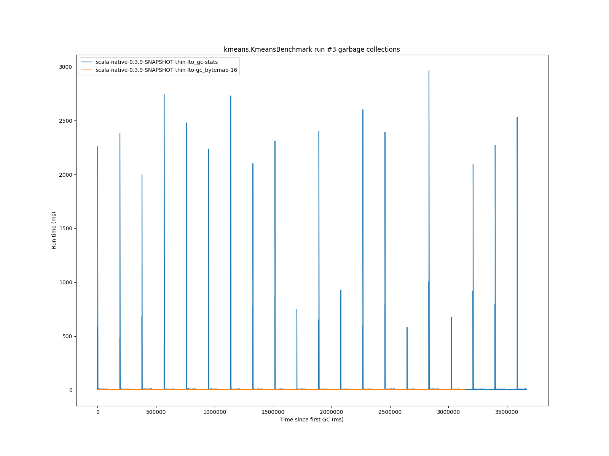
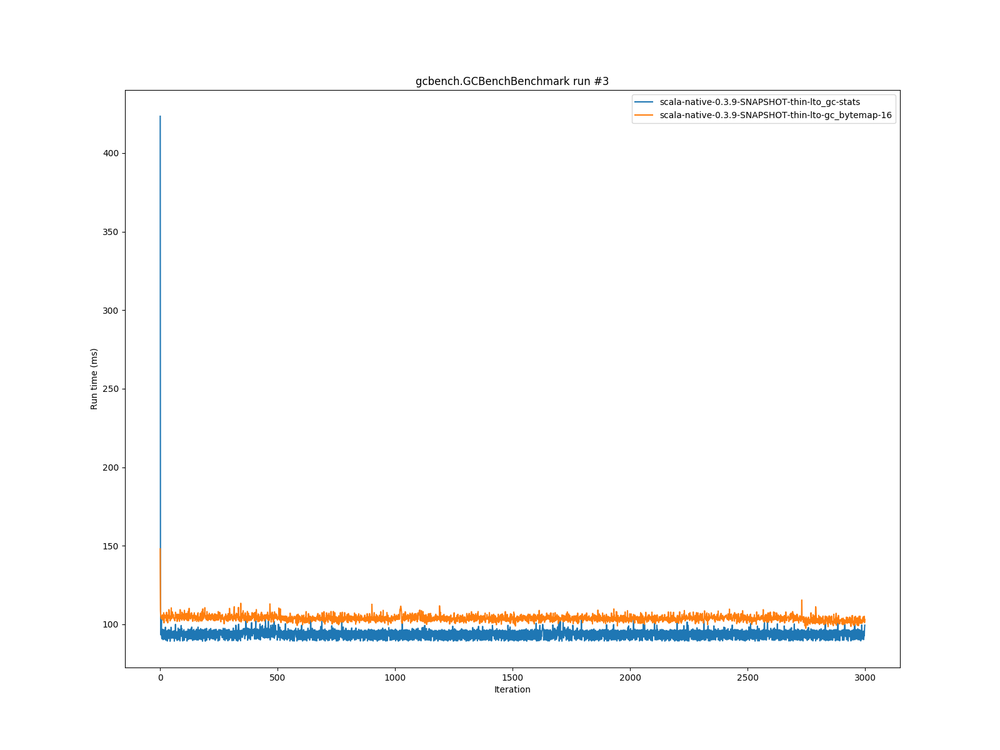

# Summary
## Benchmark run time (ms) at 50 percentile 

|name | scala-native-0.3.9-SNAPSHOT-thin-lto_gc-stats | scala-native-0.3.9-SNAPSHOT-thin-lto-gc_bytemap-16 | |
| -- | -- | -- | -- |
|[bounce.BounceBenchmark](#bouncebouncebenchmark)|0.0477|0.0463|__-2.94%__|
|[list.ListBenchmark](#listlistbenchmark)|0.0498|0.0508|+1.93%|
|[richards.RichardsBenchmark](#richardsrichardsbenchmark)|0.0659|0.0631|__-4.24%__|
|[queens.QueensBenchmark](#queensqueensbenchmark)|0.0894|0.0850|__-4.98%__|
|[permute.PermuteBenchmark](#permutepermutebenchmark)|0.2158|0.1935|__-10.32%__|
|[deltablue.DeltaBlueBenchmark](#deltabluedeltabluebenchmark)|0.2007|0.2110|+5.18%|
|[tracer.TracerBenchmark](#tracertracerbenchmark)|0.6811|0.5844|__-14.19%__|
|[brainfuck.BrainfuckBenchmark](#brainfuckbrainfuckbenchmark)|3.5770|3.5540|__-0.64%__|
|[json.JsonBenchmark](#jsonjsonbenchmark)|2.6490|2.7253|+2.88%|
|[cd.CDBenchmark](#cdcdbenchmark)|25.4158|22.4432|__-11.70%__|
|[kmeans.KmeansBenchmark](#kmeanskmeansbenchmark)|61.0161|52.1247|__-14.57%__|
|[gcbench.GCBenchBenchmark](#gcbenchgcbenchbenchmark)|92.9670|105.1911|+13.15%|
|[mandelbrot.MandelbrotBenchmark](#mandelbrotmandelbrotbenchmark)|90.8127|90.4569|__-0.39%__|
|[nbody.NbodyBenchmark](#nbodynbodybenchmark)|29.1364|28.7214|__-1.42%__|
|[sudoku.SudokuBenchmark](#sudokusudokubenchmark)|2.5772|2.5240|__-2.07%__|
| __Geometrical mean:__|| |__-21.82%__|
## GC time (ms) at 50 percentile 

|name |  | scala-native-0.3.9-SNAPSHOT-thin-lto_gc-stats | scala-native-0.3.9-SNAPSHOT-thin-lto-gc_bytemap-16 | |
| -- | -- | -- | -- | -- |
|[bounce.BounceBenchmark](#bouncebouncebenchmark)|mark|0.0120|0.0120|__0.00%__|
||sweep|0.0090|0.0080|__-11.11%__|
||total|0.0210|0.0200|__-4.76%__|
|[list.ListBenchmark](#listlistbenchmark)|mark|0.0260|0.0300|+15.38%|
||sweep|0.0140|0.0180|+28.57%|
||total|0.0390|0.0485|+24.36%|
|[richards.RichardsBenchmark](#richardsrichardsbenchmark)|mark|0.0100|0.0100|__0.00%__|
||sweep|0.0080|0.0080|__0.00%__|
||total|0.0180|0.0170|__-5.56%__|
|[queens.QueensBenchmark](#queensqueensbenchmark)|mark|0.0120|0.0110|__-8.33%__|
||sweep|0.0080|0.0080|__0.00%__|
||total|0.0210|0.0190|__-9.52%__|
|[permute.PermuteBenchmark](#permutepermutebenchmark)|mark|0.0100|0.0100|__0.00%__|
||sweep|0.0080|0.0070|__-12.50%__|
||total|0.0170|0.0170|__0.00%__|
|[deltablue.DeltaBlueBenchmark](#deltabluedeltabluebenchmark)|mark|0.0280|0.0300|+7.14%|
||sweep|0.0180|0.0080|__-55.56%__|
||total|0.0470|0.0380|__-19.15%__|
|[tracer.TracerBenchmark](#tracertracerbenchmark)|mark|0.0120|0.0100|__-16.67%__|
||sweep|0.0090|0.0080|__-11.11%__|
||total|0.0210|0.0180|__-14.29%__|
|[brainfuck.BrainfuckBenchmark](#brainfuckbrainfuckbenchmark)|mark|0.0500|0.1260|+152.00%|
||sweep|0.0600|0.0330|__-45.00%__|
||total|0.1100|0.1590|+44.55%|
|[json.JsonBenchmark](#jsonjsonbenchmark)|mark|0.0895|0.0540|__-39.66%__|
||sweep|0.0720|0.0110|__-84.72%__|
||total|0.1570|0.0650|__-58.60%__|
|[cd.CDBenchmark](#cdcdbenchmark)|mark|0.0730|0.0900|+23.29%|
||sweep|0.0860|0.1150|+33.72%|
||total|0.1600|0.2050|+28.13%|
|[kmeans.KmeansBenchmark](#kmeanskmeansbenchmark)|mark|3.3910|2.0130|__-40.64%__|
||sweep|1.6470|0.3310|__-79.90%__|
||total|4.8630|2.4220|__-50.20%__|
|[gcbench.GCBenchBenchmark](#gcbenchgcbenchbenchmark)|mark|1.4650|1.5650|+6.83%|
||sweep|0.8040|0.6170|__-23.26%__|
||total|2.3660|2.1810|__-7.82%__|
|[mandelbrot.MandelbrotBenchmark](#mandelbrotmandelbrotbenchmark)|mark|0.0000|0.0000|N/A|
||sweep|0.0000|0.0000|N/A|
||total|0.0000|0.0000|N/A|
|[nbody.NbodyBenchmark](#nbodynbodybenchmark)|mark|0.0080|0.0080|__0.00%__|
||sweep|0.0070|0.0080|+14.29%|
||total|0.0150|0.0150|__0.00%__|
|[sudoku.SudokuBenchmark](#sudokusudokubenchmark)|mark|0.0810|0.1300|+60.49%|
||sweep|0.0910|0.1170|+28.57%|
||total|0.1720|0.2470|+43.60%|
## Benchmark run time (ms) at 90 percentile 

|name | scala-native-0.3.9-SNAPSHOT-thin-lto_gc-stats | scala-native-0.3.9-SNAPSHOT-thin-lto-gc_bytemap-16 | |
| -- | -- | -- | -- |
|[bounce.BounceBenchmark](#bouncebouncebenchmark)|0.0488|0.0494|+1.25%|
|[list.ListBenchmark](#listlistbenchmark)|0.0518|0.0551|+6.31%|
|[richards.RichardsBenchmark](#richardsrichardsbenchmark)|0.0691|0.0654|__-5.49%__|
|[queens.QueensBenchmark](#queensqueensbenchmark)|0.0953|0.0865|__-9.24%__|
|[permute.PermuteBenchmark](#permutepermutebenchmark)|0.2341|0.2050|__-12.45%__|
|[deltablue.DeltaBlueBenchmark](#deltabluedeltabluebenchmark)|0.2185|0.2173|__-0.53%__|
|[tracer.TracerBenchmark](#tracertracerbenchmark)|0.7101|0.5989|__-15.67%__|
|[brainfuck.BrainfuckBenchmark](#brainfuckbrainfuckbenchmark)|3.7685|3.7405|__-0.74%__|
|[json.JsonBenchmark](#jsonjsonbenchmark)|2.8830|2.8424|__-1.41%__|
|[cd.CDBenchmark](#cdcdbenchmark)|25.9378|22.7661|__-12.23%__|
|[kmeans.KmeansBenchmark](#kmeanskmeansbenchmark)|66.0959|55.3713|__-16.23%__|
|[gcbench.GCBenchBenchmark](#gcbenchgcbenchbenchmark)|96.7885|108.5890|+12.19%|
|[mandelbrot.MandelbrotBenchmark](#mandelbrotmandelbrotbenchmark)|92.0342|91.7620|__-0.30%__|
|[nbody.NbodyBenchmark](#nbodynbodybenchmark)|29.7822|29.2637|__-1.74%__|
|[sudoku.SudokuBenchmark](#sudokusudokubenchmark)|2.7898|2.7628|__-0.97%__|
| __Geometrical mean:__|| |__-27.12%__|
## GC time (ms) at 90 percentile 

|name |  | scala-native-0.3.9-SNAPSHOT-thin-lto_gc-stats | scala-native-0.3.9-SNAPSHOT-thin-lto-gc_bytemap-16 | |
| -- | -- | -- | -- | -- |
|[bounce.BounceBenchmark](#bouncebouncebenchmark)|mark|0.0240|0.0331|+37.92%|
||sweep|0.0140|0.0180|+28.57%|
||total|0.0380|0.0510|+34.21%|
|[list.ListBenchmark](#listlistbenchmark)|mark|0.0350|0.0400|+14.29%|
||sweep|0.0190|0.0252|+32.63%|
||total|0.0542|0.0651|+20.11%|
|[richards.RichardsBenchmark](#richardsrichardsbenchmark)|mark|0.0130|0.0140|+7.69%|
||sweep|0.0090|0.0100|+11.11%|
||total|0.0230|0.0221|__-3.91%__|
|[queens.QueensBenchmark](#queensqueensbenchmark)|mark|0.0260|0.0360|+38.46%|
||sweep|0.0131|0.0170|+29.77%|
||total|0.0410|0.0531|+29.51%|
|[permute.PermuteBenchmark](#permutepermutebenchmark)|mark|0.0110|0.0120|+9.09%|
||sweep|0.0090|0.0080|__-11.11%__|
||total|0.0190|0.0190|__0.00%__|
|[deltablue.DeltaBlueBenchmark](#deltabluedeltabluebenchmark)|mark|0.0470|0.0460|__-2.13%__|
||sweep|0.0260|0.0090|__-65.38%__|
||total|0.0730|0.0540|__-26.03%__|
|[tracer.TracerBenchmark](#tracertracerbenchmark)|mark|0.0140|0.0120|__-14.29%__|
||sweep|0.0100|0.0090|__-10.00%__|
||total|0.0230|0.0200|__-13.04%__|
|[brainfuck.BrainfuckBenchmark](#brainfuckbrainfuckbenchmark)|mark|0.1100|0.2030|+84.55%|
||sweep|0.1080|0.0370|__-65.74%__|
||total|0.2180|0.2380|+9.17%|
|[json.JsonBenchmark](#jsonjsonbenchmark)|mark|0.1130|0.0560|__-50.44%__|
||sweep|0.1070|0.0120|__-88.79%__|
||total|0.2210|0.0680|__-69.23%__|
|[cd.CDBenchmark](#cdcdbenchmark)|mark|0.0940|0.1390|+47.87%|
||sweep|0.0990|0.1190|+20.20%|
||total|0.1910|0.2580|+35.08%|
|[kmeans.KmeansBenchmark](#kmeanskmeansbenchmark)|mark|5.6020|4.5850|__-18.15%__|
||sweep|2.0640|0.6310|__-69.43%__|
||total|7.5140|4.9290|__-34.40%__|
|[gcbench.GCBenchBenchmark](#gcbenchgcbenchbenchmark)|mark|2.1590|4.8200|+123.25%|
||sweep|1.1540|0.6360|__-44.89%__|
||total|3.2130|5.3890|+67.72%|
|[mandelbrot.MandelbrotBenchmark](#mandelbrotmandelbrotbenchmark)|mark|0.0000|0.0000|N/A|
||sweep|0.0000|0.0000|N/A|
||total|0.0000|0.0000|N/A|
|[nbody.NbodyBenchmark](#nbodynbodybenchmark)|mark|0.0080|0.0090|+12.50%|
||sweep|0.0080|0.0080|__0.00%__|
||total|0.0160|0.0170|+6.25%|
|[sudoku.SudokuBenchmark](#sudokusudokubenchmark)|mark|0.0870|0.1430|+64.37%|
||sweep|0.0990|0.1250|+26.26%|
||total|0.1850|0.2660|+43.78%|
## Benchmark run time (ms) at 99 percentile 

|name | scala-native-0.3.9-SNAPSHOT-thin-lto_gc-stats | scala-native-0.3.9-SNAPSHOT-thin-lto-gc_bytemap-16 | |
| -- | -- | -- | -- |
|[bounce.BounceBenchmark](#bouncebouncebenchmark)|0.0592|0.0512|__-13.42%__|
|[list.ListBenchmark](#listlistbenchmark)|0.0610|0.0749|+22.78%|
|[richards.RichardsBenchmark](#richardsrichardsbenchmark)|0.1312|0.0704|__-46.39%__|
|[queens.QueensBenchmark](#queensqueensbenchmark)|0.1066|0.0942|__-11.60%__|
|[permute.PermuteBenchmark](#permutepermutebenchmark)|0.2519|0.2200|__-12.67%__|
|[deltablue.DeltaBlueBenchmark](#deltabluedeltabluebenchmark)|0.2684|0.2657|__-1.01%__|
|[tracer.TracerBenchmark](#tracertracerbenchmark)|0.7538|0.6439|__-14.58%__|
|[brainfuck.BrainfuckBenchmark](#brainfuckbrainfuckbenchmark)|4.0052|3.9757|__-0.74%__|
|[json.JsonBenchmark](#jsonjsonbenchmark)|3.1342|4.0811|+30.21%|
|[cd.CDBenchmark](#cdcdbenchmark)|27.9152|23.5674|__-15.57%__|
|[kmeans.KmeansBenchmark](#kmeanskmeansbenchmark)|69.4771|59.5489|__-14.29%__|
|[gcbench.GCBenchBenchmark](#gcbenchgcbenchbenchmark)|100.3226|114.5147|+14.15%|
|[mandelbrot.MandelbrotBenchmark](#mandelbrotmandelbrotbenchmark)|99.9049|98.6615|__-1.24%__|
|[nbody.NbodyBenchmark](#nbodynbodybenchmark)|31.8774|30.8290|__-3.29%__|
|[sudoku.SudokuBenchmark](#sudokusudokubenchmark)|3.0161|2.8807|__-4.49%__|
| __Geometrical mean:__|| |__-39.81%__|
## GC time (ms) at 99 percentile 

|name |  | scala-native-0.3.9-SNAPSHOT-thin-lto_gc-stats | scala-native-0.3.9-SNAPSHOT-thin-lto-gc_bytemap-16 | |
| -- | -- | -- | -- | -- |
|[bounce.BounceBenchmark](#bouncebouncebenchmark)|mark|0.0280|0.0381|+35.84%|
||sweep|0.0160|0.0290|+81.04%|
||total|0.0431|0.0651|+51.14%|
|[list.ListBenchmark](#listlistbenchmark)|mark|0.0366|0.0424|+15.87%|
||sweep|0.0222|0.0319|+43.26%|
||total|0.0576|0.0741|+28.60%|
|[richards.RichardsBenchmark](#richardsrichardsbenchmark)|mark|0.0270|0.0320|+18.52%|
||sweep|0.0160|0.0190|+18.68%|
||total|0.0420|0.0490|+16.61%|
|[queens.QueensBenchmark](#queensqueensbenchmark)|mark|0.0352|0.0410|+16.44%|
||sweep|0.0236|0.0312|+32.08%|
||total|0.0588|0.0674|+14.58%|
|[permute.PermuteBenchmark](#permutepermutebenchmark)|mark|0.0260|0.0288|+10.81%|
||sweep|0.0160|0.0150|__-6.25%__|
||total|0.0420|0.0418|__-0.45%__|
|[deltablue.DeltaBlueBenchmark](#deltabluedeltabluebenchmark)|mark|0.0628|0.0740|+17.82%|
||sweep|0.0360|0.0220|__-38.89%__|
||total|0.0980|0.0840|__-14.29%__|
|[tracer.TracerBenchmark](#tracertracerbenchmark)|mark|0.0170|0.0140|__-17.65%__|
||sweep|0.0120|0.0100|__-16.67%__|
||total|0.0310|0.0240|__-22.58%__|
|[brainfuck.BrainfuckBenchmark](#brainfuckbrainfuckbenchmark)|mark|0.1680|0.2300|+36.90%|
||sweep|0.1570|0.0470|__-70.06%__|
||total|0.3240|0.2750|__-15.12%__|
|[json.JsonBenchmark](#jsonjsonbenchmark)|mark|0.1280|0.0670|__-47.66%__|
||sweep|0.1220|0.0180|__-85.25%__|
||total|0.2440|0.0840|__-65.57%__|
|[cd.CDBenchmark](#cdcdbenchmark)|mark|0.1950|0.2280|+16.92%|
||sweep|0.1210|0.1430|+18.18%|
||total|0.3140|0.3470|+10.51%|
|[kmeans.KmeansBenchmark](#kmeanskmeansbenchmark)|mark|6.7910|4.7290|__-30.36%__|
||sweep|2.3100|0.7430|__-67.84%__|
||total|8.7280|5.2830|__-39.47%__|
|[gcbench.GCBenchBenchmark](#gcbenchgcbenchbenchmark)|mark|4.5340|5.2020|+14.73%|
||sweep|2.2880|0.6530|__-71.46%__|
||total|6.8190|5.7380|__-15.85%__|
|[mandelbrot.MandelbrotBenchmark](#mandelbrotmandelbrotbenchmark)|mark|0.0000|0.0000|N/A|
||sweep|0.0000|0.0000|N/A|
||total|0.0000|0.0000|N/A|
|[nbody.NbodyBenchmark](#nbodynbodybenchmark)|mark|0.0200|0.0200|__0.00%__|
||sweep|0.0150|0.0150|__0.00%__|
||total|0.0320|0.0350|+9.38%|
|[sudoku.SudokuBenchmark](#sudokusudokubenchmark)|mark|0.1100|0.1520|+38.18%|
||sweep|0.1230|0.1380|+12.20%|
||total|0.2310|0.2820|+22.08%|
# Individual benchmarks
## bounce.BounceBenchmark

## list.ListBenchmark

## richards.RichardsBenchmark

## queens.QueensBenchmark

## permute.PermuteBenchmark

## deltablue.DeltaBlueBenchmark

## tracer.TracerBenchmark

## brainfuck.BrainfuckBenchmark

## json.JsonBenchmark

## cd.CDBenchmark

## kmeans.KmeansBenchmark

## gcbench.GCBenchBenchmark

## mandelbrot.MandelbrotBenchmark

## nbody.NbodyBenchmark

## sudoku.SudokuBenchmark

