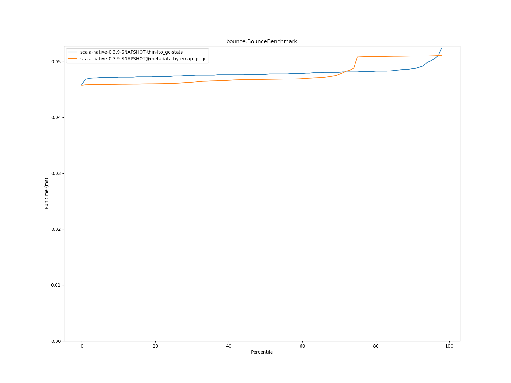
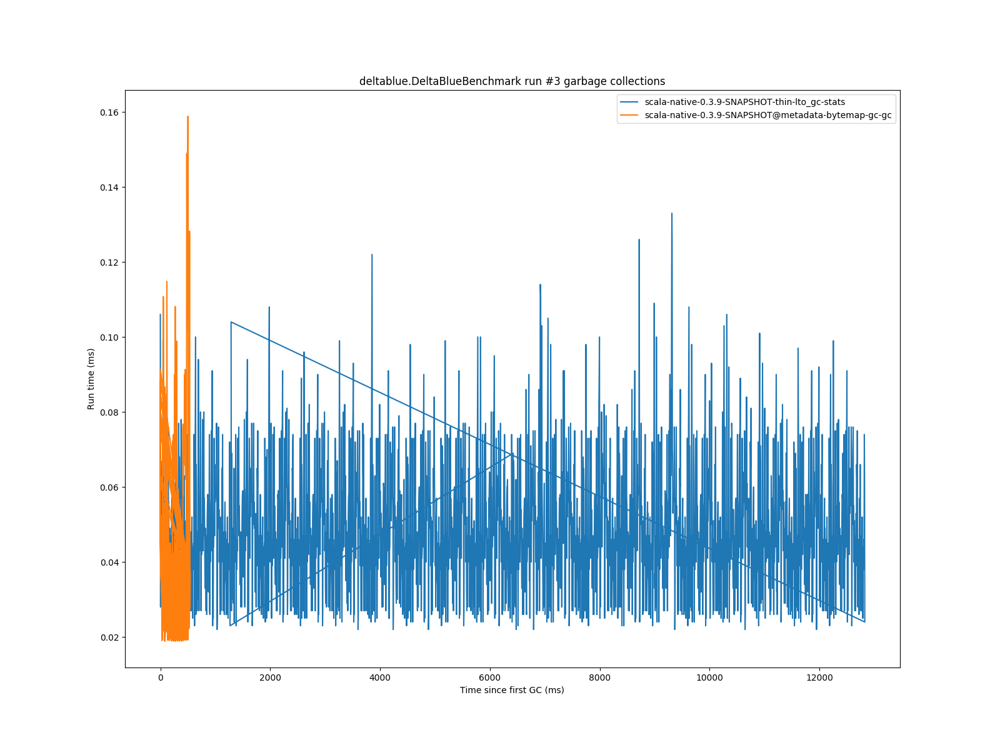
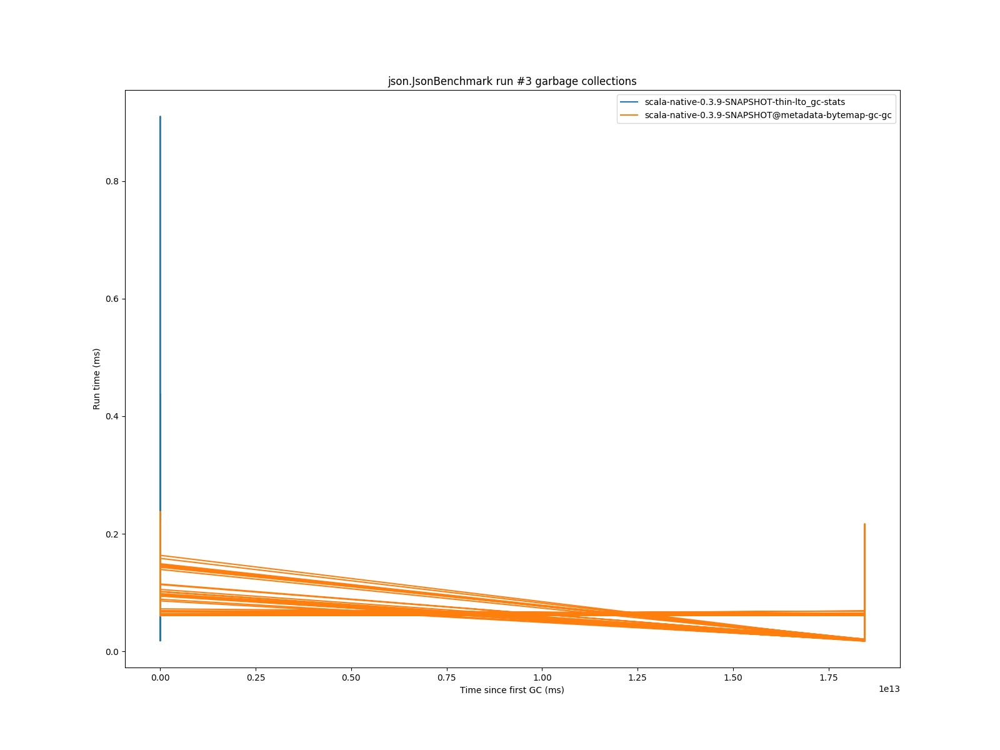
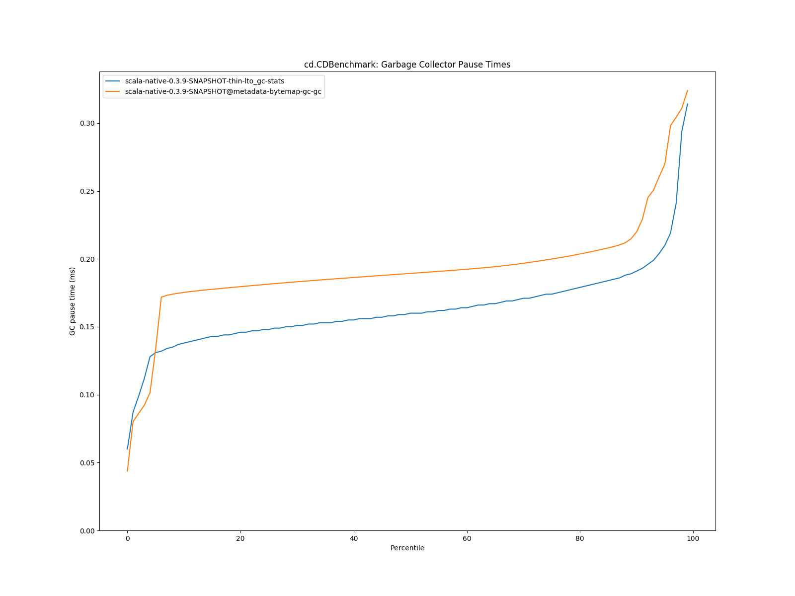
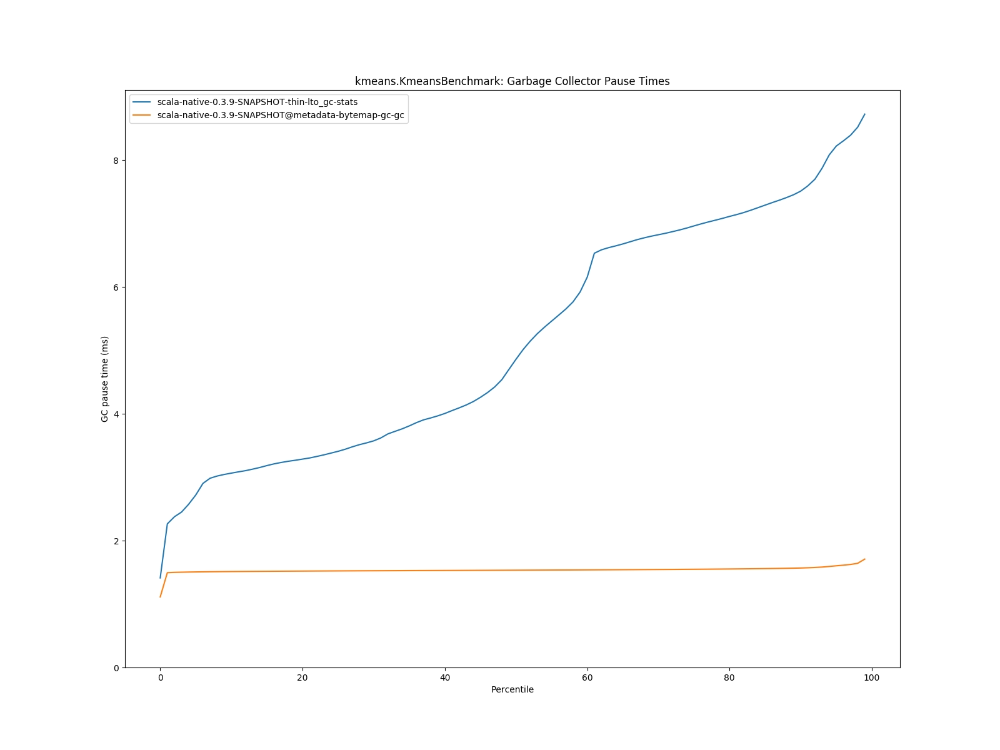
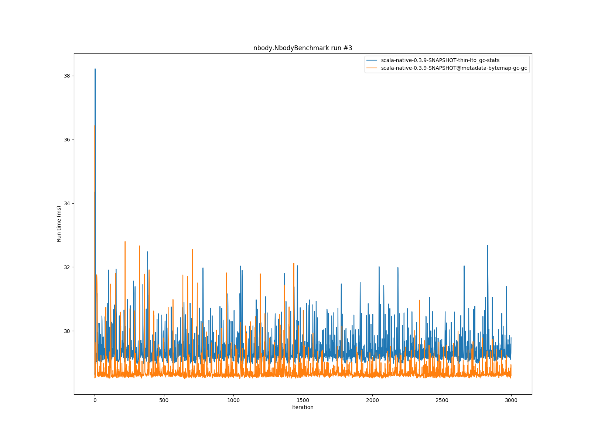
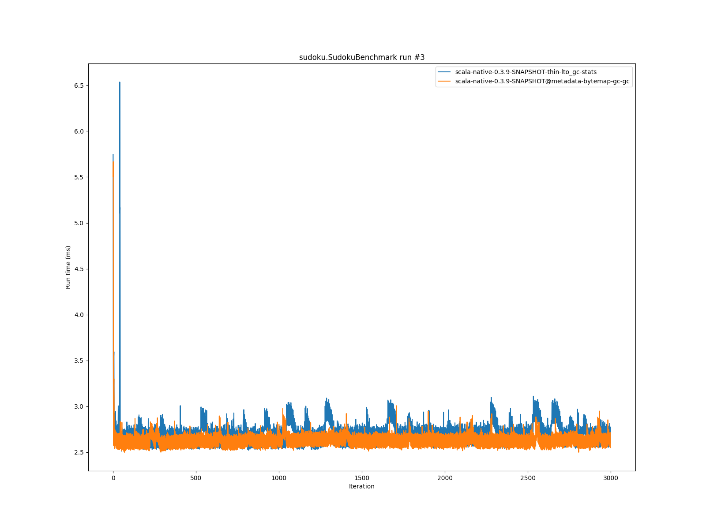

# Summary
## Benchmark run time (ms) at 50 percentile 

|name | scala-native-0.3.9-SNAPSHOT-thin-lto_gc-stats | scala-native-0.3.9-SNAPSHOT@metadata-bytemap-gc-gc | |
| -- | -- | -- | -- |
|[bounce.BounceBenchmark](#bouncebouncebenchmark)|0.0477|0.0468|__-1.90%__|
|[list.ListBenchmark](#listlistbenchmark)|0.0498|0.0539|+8.32%|
|[richards.RichardsBenchmark](#richardsrichardsbenchmark)|0.0659|0.0625|__-5.15%__|
|[queens.QueensBenchmark](#queensqueensbenchmark)|0.0894|0.0871|__-2.60%__|
|[permute.PermuteBenchmark](#permutepermutebenchmark)|0.2158|0.1982|__-8.16%__|
|[deltablue.DeltaBlueBenchmark](#deltabluedeltabluebenchmark)|0.2007|0.1741|__-13.26%__|
|[tracer.TracerBenchmark](#tracertracerbenchmark)|0.6811|0.5844|__-14.20%__|
|[brainfuck.BrainfuckBenchmark](#brainfuckbrainfuckbenchmark)|3.5770|3.3905|__-5.21%__|
|[json.JsonBenchmark](#jsonjsonbenchmark)|2.6490|2.4518|__-7.44%__|
|[cd.CDBenchmark](#cdcdbenchmark)|25.4158|21.8937|__-13.86%__|
|[kmeans.KmeansBenchmark](#kmeanskmeansbenchmark)|61.0161|47.8529|__-21.57%__|
|[gcbench.GCBenchBenchmark](#gcbenchgcbenchbenchmark)|92.9670|102.1571|+9.89%|
|[mandelbrot.MandelbrotBenchmark](#mandelbrotmandelbrotbenchmark)|90.8127|90.5561|__-0.28%__|
|[nbody.NbodyBenchmark](#nbodynbodybenchmark)|29.1364|28.7122|__-1.46%__|
|[sudoku.SudokuBenchmark](#sudokusudokubenchmark)|2.5772|2.5579|__-0.75%__|
| __Geometrical mean:__|| |__-5.53%__|
## GC time (ms) at 50 percentile 

|name |  | scala-native-0.3.9-SNAPSHOT-thin-lto_gc-stats | scala-native-0.3.9-SNAPSHOT@metadata-bytemap-gc-gc | |
| -- | -- | -- | -- | -- |
|[bounce.BounceBenchmark](#bouncebouncebenchmark)|mark|0.0120|0.0118|__-1.65%__|
||sweep|0.0090|0.0077|__-14.22%__|
||total|0.0210|0.0198|__-5.68%__|
|[list.ListBenchmark](#listlistbenchmark)|mark|0.0260|0.0341|+31.31%|
||sweep|0.0140|0.0191|+36.47%|
||total|0.0390|0.0514|+31.79%|
|[richards.RichardsBenchmark](#richardsrichardsbenchmark)|mark|0.0100|0.0093|__-7.12%__|
||sweep|0.0080|0.0076|__-4.63%__|
||total|0.0180|0.0168|__-6.43%__|
|[queens.QueensBenchmark](#queensqueensbenchmark)|mark|0.0120|0.0103|__-13.92%__|
||sweep|0.0080|0.0077|__-3.25%__|
||total|0.0210|0.0183|__-13.02%__|
|[permute.PermuteBenchmark](#permutepermutebenchmark)|mark|0.0100|0.0087|__-13.29%__|
||sweep|0.0080|0.0073|__-8.20%__|
||total|0.0170|0.0160|__-5.82%__|
|[deltablue.DeltaBlueBenchmark](#deltabluedeltabluebenchmark)|mark|0.0280|0.0207|__-26.13%__|
||sweep|0.0180|0.0078|__-56.42%__|
||total|0.0470|0.0286|__-39.15%__|
|[tracer.TracerBenchmark](#tracertracerbenchmark)|mark|0.0120|0.0094|__-22.02%__|
||sweep|0.0090|0.0078|__-13.61%__|
||total|0.0210|0.0172|__-18.13%__|
|[brainfuck.BrainfuckBenchmark](#brainfuckbrainfuckbenchmark)|mark|0.0500|0.0385|__-23.01%__|
||sweep|0.0600|0.0108|__-81.97%__|
||total|0.1100|0.0497|__-54.81%__|
|[json.JsonBenchmark](#jsonjsonbenchmark)|mark|0.0895|0.0510|__-42.97%__|
||sweep|0.0720|0.0113|__-84.33%__|
||total|0.1570|0.0623|__-60.29%__|
|[cd.CDBenchmark](#cdcdbenchmark)|mark|0.0730|0.0725|__-0.62%__|
||sweep|0.0860|0.1164|+35.35%|
||total|0.1600|0.1893|+18.30%|
|[kmeans.KmeansBenchmark](#kmeanskmeansbenchmark)|mark|3.3910|1.2145|__-64.18%__|
||sweep|1.6470|0.3192|__-80.62%__|
||total|4.8630|1.5348|__-68.44%__|
|[gcbench.GCBenchBenchmark](#gcbenchgcbenchbenchmark)|mark|1.4650|1.5025|+2.56%|
||sweep|0.8040|0.5916|__-26.42%__|
||total|2.3660|2.1170|__-10.53%__|
|[mandelbrot.MandelbrotBenchmark](#mandelbrotmandelbrotbenchmark)|mark|0.0000|0.0000|N/A|
||sweep|0.0000|0.0000|N/A|
||total|0.0000|0.0000|N/A|
|[nbody.NbodyBenchmark](#nbodynbodybenchmark)|mark|0.0080|0.0075|__-6.83%__|
||sweep|0.0070|0.0072|+3.34%|
||total|0.0150|0.0147|__-2.08%__|
|[sudoku.SudokuBenchmark](#sudokusudokubenchmark)|mark|0.0810|0.0901|+11.27%|
||sweep|0.0910|0.0334|__-63.30%__|
||total|0.1720|0.1238|__-28.00%__|
## Benchmark run time (ms) at 90 percentile 

|name | scala-native-0.3.9-SNAPSHOT-thin-lto_gc-stats | scala-native-0.3.9-SNAPSHOT@metadata-bytemap-gc-gc | |
| -- | -- | -- | -- |
|[bounce.BounceBenchmark](#bouncebouncebenchmark)|0.0488|0.0510|+4.55%|
|[list.ListBenchmark](#listlistbenchmark)|0.0518|0.0561|+8.23%|
|[richards.RichardsBenchmark](#richardsrichardsbenchmark)|0.0691|0.0642|__-7.11%__|
|[queens.QueensBenchmark](#queensqueensbenchmark)|0.0953|0.0903|__-5.32%__|
|[permute.PermuteBenchmark](#permutepermutebenchmark)|0.2341|0.2146|__-8.32%__|
|[deltablue.DeltaBlueBenchmark](#deltabluedeltabluebenchmark)|0.2185|0.1890|__-13.51%__|
|[tracer.TracerBenchmark](#tracertracerbenchmark)|0.7101|0.6211|__-12.53%__|
|[brainfuck.BrainfuckBenchmark](#brainfuckbrainfuckbenchmark)|3.7685|3.4929|__-7.31%__|
|[json.JsonBenchmark](#jsonjsonbenchmark)|2.8830|2.5063|__-13.07%__|
|[cd.CDBenchmark](#cdcdbenchmark)|25.9378|22.3246|__-13.93%__|
|[kmeans.KmeansBenchmark](#kmeanskmeansbenchmark)|66.0959|48.8747|__-26.05%__|
|[gcbench.GCBenchBenchmark](#gcbenchgcbenchbenchmark)|96.7885|105.9204|+9.43%|
|[mandelbrot.MandelbrotBenchmark](#mandelbrotmandelbrotbenchmark)|92.0342|91.9315|__-0.11%__|
|[nbody.NbodyBenchmark](#nbodynbodybenchmark)|29.7822|29.2673|__-1.73%__|
|[sudoku.SudokuBenchmark](#sudokusudokubenchmark)|2.7898|2.7105|__-2.85%__|
| __Geometrical mean:__|| |__-6.42%__|
## GC time (ms) at 90 percentile 

|name |  | scala-native-0.3.9-SNAPSHOT-thin-lto_gc-stats | scala-native-0.3.9-SNAPSHOT@metadata-bytemap-gc-gc | |
| -- | -- | -- | -- | -- |
|[bounce.BounceBenchmark](#bouncebouncebenchmark)|mark|0.0240|0.0332|+38.23%|
||sweep|0.0140|0.0167|+19.44%|
||total|0.0380|0.0496|+30.52%|
|[list.ListBenchmark](#listlistbenchmark)|mark|0.0350|0.0370|+5.70%|
||sweep|0.0190|0.0244|+28.20%|
||total|0.0542|0.0601|+10.92%|
|[richards.RichardsBenchmark](#richardsrichardsbenchmark)|mark|0.0130|0.0134|+2.96%|
||sweep|0.0090|0.0105|+17.06%|
||total|0.0230|0.0236|+2.76%|
|[queens.QueensBenchmark](#queensqueensbenchmark)|mark|0.0260|0.0345|+32.64%|
||sweep|0.0131|0.0171|+30.46%|
||total|0.0410|0.0540|+31.70%|
|[permute.PermuteBenchmark](#permutepermutebenchmark)|mark|0.0110|0.0096|__-12.47%__|
||sweep|0.0090|0.0081|__-9.94%__|
||total|0.0190|0.0177|__-7.03%__|
|[deltablue.DeltaBlueBenchmark](#deltabluedeltabluebenchmark)|mark|0.0470|0.0339|__-27.90%__|
||sweep|0.0260|0.0091|__-65.05%__|
||total|0.0730|0.0422|__-42.23%__|
|[tracer.TracerBenchmark](#tracertracerbenchmark)|mark|0.0140|0.0106|__-24.57%__|
||sweep|0.0100|0.0085|__-15.34%__|
||total|0.0230|0.0187|__-18.71%__|
|[brainfuck.BrainfuckBenchmark](#brainfuckbrainfuckbenchmark)|mark|0.1100|0.0629|__-42.81%__|
||sweep|0.1080|0.0135|__-87.54%__|
||total|0.2180|0.0762|__-65.03%__|
|[json.JsonBenchmark](#jsonjsonbenchmark)|mark|0.1130|0.0523|__-53.68%__|
||sweep|0.1070|0.0119|__-88.88%__|
||total|0.2210|0.0641|__-70.99%__|
|[cd.CDBenchmark](#cdcdbenchmark)|mark|0.0940|0.0951|+1.19%|
||sweep|0.0990|0.1210|+22.17%|
||total|0.1910|0.2199|+15.12%|
|[kmeans.KmeansBenchmark](#kmeanskmeansbenchmark)|mark|5.6020|1.2476|__-77.73%__|
||sweep|2.0640|0.3277|__-84.12%__|
||total|7.5140|1.5692|__-79.12%__|
|[gcbench.GCBenchBenchmark](#gcbenchgcbenchbenchmark)|mark|2.1590|4.6725|+116.42%|
||sweep|1.1540|0.6359|__-44.90%__|
||total|3.2130|5.2463|+63.28%|
|[mandelbrot.MandelbrotBenchmark](#mandelbrotmandelbrotbenchmark)|mark|0.0000|0.0000|N/A|
||sweep|0.0000|0.0000|N/A|
||total|0.0000|0.0000|N/A|
|[nbody.NbodyBenchmark](#nbodynbodybenchmark)|mark|0.0080|0.0090|+11.96%|
||sweep|0.0080|0.0079|__-1.69%__|
||total|0.0160|0.0168|+5.01%|
|[sudoku.SudokuBenchmark](#sudokusudokubenchmark)|mark|0.0870|0.0993|+14.14%|
||sweep|0.0990|0.0374|__-62.26%__|
||total|0.1850|0.1360|__-26.51%__|
## Benchmark run time (ms) at 99 percentile 

|name | scala-native-0.3.9-SNAPSHOT-thin-lto_gc-stats | scala-native-0.3.9-SNAPSHOT@metadata-bytemap-gc-gc | |
| -- | -- | -- | -- |
|[bounce.BounceBenchmark](#bouncebouncebenchmark)|0.0592|0.0512|__-13.39%__|
|[list.ListBenchmark](#listlistbenchmark)|0.0610|0.0605|__-0.82%__|
|[richards.RichardsBenchmark](#richardsrichardsbenchmark)|0.1312|0.0692|__-47.28%__|
|[queens.QueensBenchmark](#queensqueensbenchmark)|0.1066|0.0958|__-10.15%__|
|[permute.PermuteBenchmark](#permutepermutebenchmark)|0.2519|0.2314|__-8.13%__|
|[deltablue.DeltaBlueBenchmark](#deltabluedeltabluebenchmark)|0.2684|0.2238|__-16.62%__|
|[tracer.TracerBenchmark](#tracertracerbenchmark)|0.7538|0.6447|__-14.47%__|
|[brainfuck.BrainfuckBenchmark](#brainfuckbrainfuckbenchmark)|4.0052|3.7001|__-7.62%__|
|[json.JsonBenchmark](#jsonjsonbenchmark)|3.1342|2.6697|__-14.82%__|
|[cd.CDBenchmark](#cdcdbenchmark)|27.9152|23.8348|__-14.62%__|
|[kmeans.KmeansBenchmark](#kmeanskmeansbenchmark)|69.4771|50.6572|__-27.09%__|
|[gcbench.GCBenchBenchmark](#gcbenchgcbenchbenchmark)|100.3226|109.4152|+9.06%|
|[mandelbrot.MandelbrotBenchmark](#mandelbrotmandelbrotbenchmark)|99.9049|98.8699|__-1.04%__|
|[nbody.NbodyBenchmark](#nbodynbodybenchmark)|31.8774|31.0626|__-2.56%__|
|[sudoku.SudokuBenchmark](#sudokusudokubenchmark)|3.0161|2.8869|__-4.28%__|
| __Geometrical mean:__|| |__-12.65%__|
## GC time (ms) at 99 percentile 

|name |  | scala-native-0.3.9-SNAPSHOT-thin-lto_gc-stats | scala-native-0.3.9-SNAPSHOT@metadata-bytemap-gc-gc | |
| -- | -- | -- | -- | -- |
|[bounce.BounceBenchmark](#bouncebouncebenchmark)|mark|0.0280|0.0376|+33.96%|
||sweep|0.0160|0.0207|+29.27%|
||total|0.0431|0.0566|+31.36%|
|[list.ListBenchmark](#listlistbenchmark)|mark|0.0366|0.0415|+13.24%|
||sweep|0.0222|0.0306|+37.71%|
||total|0.0576|0.0697|+20.97%|
|[richards.RichardsBenchmark](#richardsrichardsbenchmark)|mark|0.0270|0.0340|+25.78%|
||sweep|0.0160|0.0197|+22.91%|
||total|0.0420|0.0544|+29.35%|
|[queens.QueensBenchmark](#queensqueensbenchmark)|mark|0.0352|0.0428|+21.55%|
||sweep|0.0236|0.0348|+47.15%|
||total|0.0588|0.0708|+20.30%|
|[permute.PermuteBenchmark](#permutepermutebenchmark)|mark|0.0260|0.0328|+26.12%|
||sweep|0.0160|0.0155|__-3.44%__|
||total|0.0420|0.0482|+14.81%|
|[deltablue.DeltaBlueBenchmark](#deltabluedeltabluebenchmark)|mark|0.0628|0.0557|__-11.38%__|
||sweep|0.0360|0.0238|__-33.88%__|
||total|0.0980|0.0799|__-18.52%__|
|[tracer.TracerBenchmark](#tracertracerbenchmark)|mark|0.0170|0.0150|__-11.72%__|
||sweep|0.0120|0.0104|__-13.33%__|
||total|0.0310|0.0248|__-20.04%__|
|[brainfuck.BrainfuckBenchmark](#brainfuckbrainfuckbenchmark)|mark|0.1680|0.0708|__-57.83%__|
||sweep|0.1570|0.0200|__-87.27%__|
||total|0.3240|0.0864|__-73.32%__|
|[json.JsonBenchmark](#jsonjsonbenchmark)|mark|0.1280|0.0782|__-38.88%__|
||sweep|0.1220|0.0246|__-79.81%__|
||total|0.2440|0.1031|__-57.73%__|
|[cd.CDBenchmark](#cdcdbenchmark)|mark|0.1950|0.1958|+0.42%|
||sweep|0.1210|0.1466|+21.13%|
||total|0.3140|0.3240|+3.17%|
|[kmeans.KmeansBenchmark](#kmeanskmeansbenchmark)|mark|6.7910|1.3823|__-79.65%__|
||sweep|2.3100|0.3430|__-85.15%__|
||total|8.7280|1.7096|__-80.41%__|
|[gcbench.GCBenchBenchmark](#gcbenchgcbenchbenchmark)|mark|4.5340|5.0241|+10.81%|
||sweep|2.2880|0.6560|__-71.33%__|
||total|6.8190|5.5759|__-18.23%__|
|[mandelbrot.MandelbrotBenchmark](#mandelbrotmandelbrotbenchmark)|mark|0.0000|0.0000|N/A|
||sweep|0.0000|0.0000|N/A|
||total|0.0000|0.0000|N/A|
|[nbody.NbodyBenchmark](#nbodynbodybenchmark)|mark|0.0200|0.0175|__-12.27%__|
||sweep|0.0150|0.0141|__-6.21%__|
||total|0.0320|0.0319|__-0.34%__|
|[sudoku.SudokuBenchmark](#sudokusudokubenchmark)|mark|0.1100|0.1378|+25.28%|
||sweep|0.1230|0.0727|__-40.87%__|
||total|0.2310|0.2102|__-8.99%__|
# Individual benchmarks
## bounce.BounceBenchmark

## list.ListBenchmark

## richards.RichardsBenchmark

## queens.QueensBenchmark

## permute.PermuteBenchmark

## deltablue.DeltaBlueBenchmark

## tracer.TracerBenchmark

## brainfuck.BrainfuckBenchmark

## json.JsonBenchmark

## cd.CDBenchmark

## kmeans.KmeansBenchmark

## gcbench.GCBenchBenchmark

## mandelbrot.MandelbrotBenchmark

## nbody.NbodyBenchmark

## sudoku.SudokuBenchmark

