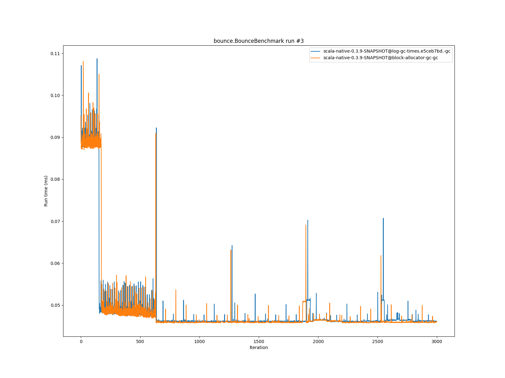

# Summary
## Benchmark run time (ms) at 50 percentile 

|name | scala-native-0.3.9-SNAPSHOT@log-gc-times.e5ceb7bd.-gc | scala-native-0.3.9-SNAPSHOT@block-allocator-gc-gc | |
| -- | -- | -- | -- |
|[bounce.BounceBenchmark](#bouncebouncebenchmark)|0.0467|0.0468|+0.06%|
|[list.ListBenchmark](#listlistbenchmark)|0.0491|0.0482|__-1.67%__|
|[richards.RichardsBenchmark](#richardsrichardsbenchmark)|0.0624|0.0637|+2.15%|
|[queens.QueensBenchmark](#queensqueensbenchmark)|0.0865|0.0868|+0.41%|
|[permute.PermuteBenchmark](#permutepermutebenchmark)|0.2014|0.1907|__-5.27%__|
|[deltablue.DeltaBlueBenchmark](#deltabluedeltabluebenchmark)|0.1756|0.1820|+3.69%|
|[tracer.TracerBenchmark](#tracertracerbenchmark)|0.5909|0.5884|__-0.43%__|
|[brainfuck.BrainfuckBenchmark](#brainfuckbrainfuckbenchmark)|3.4073|3.3172|__-2.64%__|
|[json.JsonBenchmark](#jsonjsonbenchmark)|1.3358|1.3756|+2.98%|
|[cd.CDBenchmark](#cdcdbenchmark)|21.9186|22.6527|+3.35%|
|[kmeans.KmeansBenchmark](#kmeanskmeansbenchmark)|48.4345|47.3242|__-2.29%__|
|[gcbench.GCBenchBenchmark](#gcbenchgcbenchbenchmark)|104.4325|104.5417|+0.10%|
|[mandelbrot.MandelbrotBenchmark](#mandelbrotmandelbrotbenchmark)|91.1676|90.6533|__-0.56%__|
|[nbody.NbodyBenchmark](#nbodynbodybenchmark)|28.7866|28.6745|__-0.39%__|
|[sudoku.SudokuBenchmark](#sudokusudokubenchmark)|2.3391|2.2943|__-1.91%__|
| __Geometrical mean:__|| |__-0.19%__|
## GC time (ms) at 50 percentile 

|name |  | scala-native-0.3.9-SNAPSHOT@log-gc-times.e5ceb7bd.-gc | scala-native-0.3.9-SNAPSHOT@block-allocator-gc-gc | |
| -- | -- | -- | -- | -- |
|[bounce.BounceBenchmark](#bouncebouncebenchmark)|mark|0.0117|0.0107|__-8.13%__|
||sweep|0.0082|0.0078|__-5.73%__|
||total|0.0207|0.0182|__-11.89%__|
|[list.ListBenchmark](#listlistbenchmark)|mark|0.0331|0.0313|__-5.33%__|
||sweep|0.0182|0.0177|__-2.84%__|
||total|0.0510|0.0489|__-4.10%__|
|[richards.RichardsBenchmark](#richardsrichardsbenchmark)|mark|0.0086|0.0092|+7.78%|
||sweep|0.0074|0.0074|__-0.41%__|
||total|0.0160|0.0168|+4.75%|
|[queens.QueensBenchmark](#queensqueensbenchmark)|mark|0.0109|0.0097|__-11.28%__|
||sweep|0.0078|0.0074|__-5.19%__|
||total|0.0189|0.0173|__-8.60%__|
|[permute.PermuteBenchmark](#permutepermutebenchmark)|mark|0.0089|0.0084|__-5.51%__|
||sweep|0.0075|0.0072|__-3.75%__|
||total|0.0164|0.0157|__-4.45%__|
|[deltablue.DeltaBlueBenchmark](#deltabluedeltabluebenchmark)|mark|0.0245|0.0283|+15.54%|
||sweep|0.0083|0.0079|__-3.77%__|
||total|0.0329|0.0364|+10.42%|
|[tracer.TracerBenchmark](#tracertracerbenchmark)|mark|0.0090|0.0085|__-5.34%__|
||sweep|0.0079|0.0073|__-7.83%__|
||total|0.0170|0.0159|__-6.61%__|
|[brainfuck.BrainfuckBenchmark](#brainfuckbrainfuckbenchmark)|mark|0.0383|0.0354|__-7.36%__|
||sweep|0.0110|0.0102|__-7.55%__|
||total|0.0493|0.0457|__-7.39%__|
|[json.JsonBenchmark](#jsonjsonbenchmark)|mark|0.0516|0.0375|__-27.37%__|
||sweep|0.0123|0.0100|__-18.51%__|
||total|0.0639|0.0475|__-25.64%__|
|[cd.CDBenchmark](#cdcdbenchmark)|mark|0.0744|0.0509|__-31.59%__|
||sweep|0.1158|0.0267|__-76.92%__|
||total|0.1907|0.0776|__-59.28%__|
|[kmeans.KmeansBenchmark](#kmeanskmeansbenchmark)|mark|1.2074|0.9976|__-17.37%__|
||sweep|0.3188|0.4627|+45.15%|
||total|1.5266|1.4567|__-4.57%__|
|[gcbench.GCBenchBenchmark](#gcbenchgcbenchbenchmark)|mark|1.4801|1.4578|__-1.51%__|
||sweep|0.6214|0.5341|__-14.05%__|
||total|2.0995|2.0023|__-4.63%__|
|[mandelbrot.MandelbrotBenchmark](#mandelbrotmandelbrotbenchmark)|mark|0.0000|0.0000|N/A|
||sweep|0.0000|0.0000|N/A|
||total|0.0000|0.0000|N/A|
|[nbody.NbodyBenchmark](#nbodynbodybenchmark)|mark|0.0070|0.0066|__-5.55%__|
||sweep|0.0073|0.0069|__-5.50%__|
||total|0.0144|0.0136|__-5.65%__|
|[sudoku.SudokuBenchmark](#sudokusudokubenchmark)|mark|0.0919|0.0902|__-1.85%__|
||sweep|0.0353|0.0340|__-3.89%__|
||total|0.1269|0.1243|__-2.03%__|
|__Geometrical mean:__|mark|| |__-8.27%__|
||sweep|| |__-12.86%__|
||total|| |__-11.25%__|
## Benchmark run time (ms) at 90 percentile 

|name | scala-native-0.3.9-SNAPSHOT@log-gc-times.e5ceb7bd.-gc | scala-native-0.3.9-SNAPSHOT@block-allocator-gc-gc | |
| -- | -- | -- | -- |
|[bounce.BounceBenchmark](#bouncebouncebenchmark)|0.0504|0.0508|+0.90%|
|[list.ListBenchmark](#listlistbenchmark)|0.0508|0.0517|+1.59%|
|[richards.RichardsBenchmark](#richardsrichardsbenchmark)|0.0642|0.0684|+6.67%|
|[queens.QueensBenchmark](#queensqueensbenchmark)|0.0885|0.0916|+3.47%|
|[permute.PermuteBenchmark](#permutepermutebenchmark)|0.2166|0.2049|__-5.40%__|
|[deltablue.DeltaBlueBenchmark](#deltabluedeltabluebenchmark)|0.1879|0.1962|+4.40%|
|[tracer.TracerBenchmark](#tracertracerbenchmark)|0.6272|0.6053|__-3.48%__|
|[brainfuck.BrainfuckBenchmark](#brainfuckbrainfuckbenchmark)|3.6021|3.4635|__-3.85%__|
|[json.JsonBenchmark](#jsonjsonbenchmark)|1.3863|1.4215|+2.54%|
|[cd.CDBenchmark](#cdcdbenchmark)|22.6967|23.1863|+2.16%|
|[kmeans.KmeansBenchmark](#kmeanskmeansbenchmark)|49.6069|48.6426|__-1.94%__|
|[gcbench.GCBenchBenchmark](#gcbenchgcbenchbenchmark)|108.4186|110.5789|+1.99%|
|[mandelbrot.MandelbrotBenchmark](#mandelbrotmandelbrotbenchmark)|92.8670|92.0227|__-0.91%__|
|[nbody.NbodyBenchmark](#nbodynbodybenchmark)|29.5384|29.3661|__-0.58%__|
|[sudoku.SudokuBenchmark](#sudokusudokubenchmark)|2.5018|2.4540|__-1.91%__|
| __Geometrical mean:__|| |+0.32%|
## GC time (ms) at 90 percentile 

|name |  | scala-native-0.3.9-SNAPSHOT@log-gc-times.e5ceb7bd.-gc | scala-native-0.3.9-SNAPSHOT@block-allocator-gc-gc | |
| -- | -- | -- | -- | -- |
|[bounce.BounceBenchmark](#bouncebouncebenchmark)|mark|0.0323|0.0316|__-2.19%__|
||sweep|0.0184|0.0179|__-2.58%__|
||total|0.0506|0.0481|__-4.93%__|
|[list.ListBenchmark](#listlistbenchmark)|mark|0.0382|0.0362|__-5.13%__|
||sweep|0.0216|0.0220|+1.93%|
||total|0.0565|0.0588|+4.20%|
|[richards.RichardsBenchmark](#richardsrichardsbenchmark)|mark|0.0125|0.0141|+12.81%|
||sweep|0.0109|0.0123|+13.42%|
||total|0.0228|0.0263|+15.13%|
|[queens.QueensBenchmark](#queensqueensbenchmark)|mark|0.0345|0.0330|__-4.27%__|
||sweep|0.0176|0.0155|__-12.27%__|
||total|0.0521|0.0489|__-6.26%__|
|[permute.PermuteBenchmark](#permutepermutebenchmark)|mark|0.0106|0.0105|__-0.58%__|
||sweep|0.0082|0.0078|__-4.64%__|
||total|0.0187|0.0182|__-2.74%__|
|[deltablue.DeltaBlueBenchmark](#deltabluedeltabluebenchmark)|mark|0.0363|0.0374|+3.15%|
||sweep|0.0092|0.0088|__-3.94%__|
||total|0.0445|0.0460|+3.22%|
|[tracer.TracerBenchmark](#tracertracerbenchmark)|mark|0.0103|0.0093|__-9.25%__|
||sweep|0.0086|0.0077|__-9.72%__|
||total|0.0187|0.0170|__-9.30%__|
|[brainfuck.BrainfuckBenchmark](#brainfuckbrainfuckbenchmark)|mark|0.0634|0.0625|__-1.44%__|
||sweep|0.0134|0.0120|__-10.50%__|
||total|0.0766|0.0744|__-2.85%__|
|[json.JsonBenchmark](#jsonjsonbenchmark)|mark|0.0538|0.0388|__-27.86%__|
||sweep|0.0129|0.0105|__-18.57%__|
||total|0.0665|0.0492|__-26.05%__|
|[cd.CDBenchmark](#cdcdbenchmark)|mark|0.0955|0.0677|__-29.08%__|
||sweep|0.1207|0.0286|__-76.34%__|
||total|0.2148|0.0960|__-55.30%__|
|[kmeans.KmeansBenchmark](#kmeanskmeansbenchmark)|mark|1.2529|1.4692|+17.26%|
||sweep|0.3277|0.4987|+52.19%|
||total|1.5750|1.9627|+24.62%|
|[gcbench.GCBenchBenchmark](#gcbenchgcbenchbenchmark)|mark|5.1950|2.1933|__-57.78%__|
||sweep|0.6396|0.5639|__-11.84%__|
||total|5.7625|2.7015|__-53.12%__|
|[mandelbrot.MandelbrotBenchmark](#mandelbrotmandelbrotbenchmark)|mark|0.0000|0.0000|N/A|
||sweep|0.0000|0.0000|N/A|
||total|0.0000|0.0000|N/A|
|[nbody.NbodyBenchmark](#nbodynbodybenchmark)|mark|0.0080|0.0072|__-9.63%__|
||sweep|0.0079|0.0074|__-5.73%__|
||total|0.0157|0.0146|__-7.15%__|
|[sudoku.SudokuBenchmark](#sudokusudokubenchmark)|mark|0.1006|0.0998|__-0.77%__|
||sweep|0.0394|0.0366|__-7.12%__|
||total|0.1393|0.1357|__-2.58%__|
|__Geometrical mean:__|mark|| |__-10.59%__|
||sweep|| |__-12.06%__|
||total|| |__-12.07%__|
## Benchmark run time (ms) at 99 percentile 

|name | scala-native-0.3.9-SNAPSHOT@log-gc-times.e5ceb7bd.-gc | scala-native-0.3.9-SNAPSHOT@block-allocator-gc-gc | |
| -- | -- | -- | -- |
|[bounce.BounceBenchmark](#bouncebouncebenchmark)|0.0515|0.0512|__-0.49%__|
|[list.ListBenchmark](#listlistbenchmark)|0.0548|0.0542|__-1.15%__|
|[richards.RichardsBenchmark](#richardsrichardsbenchmark)|0.0687|0.0741|+7.87%|
|[queens.QueensBenchmark](#queensqueensbenchmark)|0.0946|0.0960|+1.49%|
|[permute.PermuteBenchmark](#permutepermutebenchmark)|0.2267|0.2176|__-4.00%__|
|[deltablue.DeltaBlueBenchmark](#deltabluedeltabluebenchmark)|0.2207|0.2307|+4.52%|
|[tracer.TracerBenchmark](#tracertracerbenchmark)|0.6488|0.6440|__-0.73%__|
|[brainfuck.BrainfuckBenchmark](#brainfuckbrainfuckbenchmark)|3.7820|3.6335|__-3.93%__|
|[json.JsonBenchmark](#jsonjsonbenchmark)|1.4808|1.5195|+2.62%|
|[cd.CDBenchmark](#cdcdbenchmark)|24.0180|24.6910|+2.80%|
|[kmeans.KmeansBenchmark](#kmeanskmeansbenchmark)|52.7281|51.8576|__-1.65%__|
|[gcbench.GCBenchBenchmark](#gcbenchgcbenchbenchmark)|112.7124|116.8553|+3.68%|
|[mandelbrot.MandelbrotBenchmark](#mandelbrotmandelbrotbenchmark)|100.3280|98.2608|__-2.06%__|
|[nbody.NbodyBenchmark](#nbodynbodybenchmark)|31.6836|31.6599|__-0.07%__|
|[sudoku.SudokuBenchmark](#sudokusudokubenchmark)|2.6446|2.6052|__-1.49%__|
| __Geometrical mean:__|| |+0.44%|
## GC time (ms) at 99 percentile 

|name |  | scala-native-0.3.9-SNAPSHOT@log-gc-times.e5ceb7bd.-gc | scala-native-0.3.9-SNAPSHOT@block-allocator-gc-gc | |
| -- | -- | -- | -- | -- |
|[bounce.BounceBenchmark](#bouncebouncebenchmark)|mark|0.0365|0.0353|__-3.26%__|
||sweep|0.0261|0.0295|+12.99%|
||total|0.0593|0.0630|+6.15%|
|[list.ListBenchmark](#listlistbenchmark)|mark|0.0410|0.0406|__-1.08%__|
||sweep|0.0237|0.0241|+1.65%|
||total|0.0642|0.0638|__-0.66%__|
|[richards.RichardsBenchmark](#richardsrichardsbenchmark)|mark|0.0339|0.0340|+0.53%|
||sweep|0.0234|0.0208|__-11.05%__|
||total|0.0573|0.0528|__-7.87%__|
|[queens.QueensBenchmark](#queensqueensbenchmark)|mark|0.0385|0.0378|__-1.85%__|
||sweep|0.0377|0.0325|__-13.85%__|
||total|0.0746|0.0673|__-9.81%__|
|[permute.PermuteBenchmark](#permutepermutebenchmark)|mark|0.0329|0.0290|__-12.06%__|
||sweep|0.0162|0.0145|__-10.59%__|
||total|0.0488|0.0433|__-11.44%__|
|[deltablue.DeltaBlueBenchmark](#deltabluedeltabluebenchmark)|mark|0.0585|0.0566|__-3.22%__|
||sweep|0.0234|0.0219|__-6.53%__|
||total|0.0797|0.0791|__-0.76%__|
|[tracer.TracerBenchmark](#tracertracerbenchmark)|mark|0.0132|0.0121|__-7.94%__|
||sweep|0.0102|0.0096|__-6.26%__|
||total|0.0231|0.0217|__-6.04%__|
|[brainfuck.BrainfuckBenchmark](#brainfuckbrainfuckbenchmark)|mark|0.0703|0.0692|__-1.56%__|
||sweep|0.0173|0.0148|__-14.25%__|
||total|0.0848|0.0826|__-2.64%__|
|[json.JsonBenchmark](#jsonjsonbenchmark)|mark|0.0584|0.0445|__-23.84%__|
||sweep|0.0143|0.0129|__-9.89%__|
||total|0.0720|0.0558|__-22.43%__|
|[cd.CDBenchmark](#cdcdbenchmark)|mark|0.1991|0.1075|__-46.02%__|
||sweep|0.1456|0.0397|__-72.74%__|
||total|0.3228|0.1374|__-57.43%__|
|[kmeans.KmeansBenchmark](#kmeanskmeansbenchmark)|mark|2.5302|2.7399|+8.29%|
||sweep|0.3450|0.5633|+63.28%|
||total|2.8618|3.1941|+11.61%|
|[gcbench.GCBenchBenchmark](#gcbenchgcbenchbenchmark)|mark|5.3905|4.4147|__-18.10%__|
||sweep|0.6573|0.5828|__-11.33%__|
||total|5.9504|4.8968|__-17.71%__|
|[mandelbrot.MandelbrotBenchmark](#mandelbrotmandelbrotbenchmark)|mark|0.0000|0.0000|N/A|
||sweep|0.0000|0.0000|N/A|
||total|0.0000|0.0000|N/A|
|[nbody.NbodyBenchmark](#nbodynbodybenchmark)|mark|0.0161|0.0163|+1.38%|
||sweep|0.0132|0.0133|+0.77%|
||total|0.0291|0.0297|+1.84%|
|[sudoku.SudokuBenchmark](#sudokusudokubenchmark)|mark|0.1301|0.1257|__-3.36%__|
||sweep|0.0688|0.0641|__-6.86%__|
||total|0.1988|0.1907|__-4.09%__|
|__Geometrical mean:__|mark|| |__-9.17%__|
||sweep|| |__-10.95%__|
||total|| |__-10.59%__|
# Individual benchmarks
## bounce.BounceBenchmark

## list.ListBenchmark

## richards.RichardsBenchmark

## queens.QueensBenchmark

## permute.PermuteBenchmark

## deltablue.DeltaBlueBenchmark

## tracer.TracerBenchmark

## brainfuck.BrainfuckBenchmark

## json.JsonBenchmark

## cd.CDBenchmark

## kmeans.KmeansBenchmark

## gcbench.GCBenchBenchmark

## mandelbrot.MandelbrotBenchmark

## nbody.NbodyBenchmark

## sudoku.SudokuBenchmark

