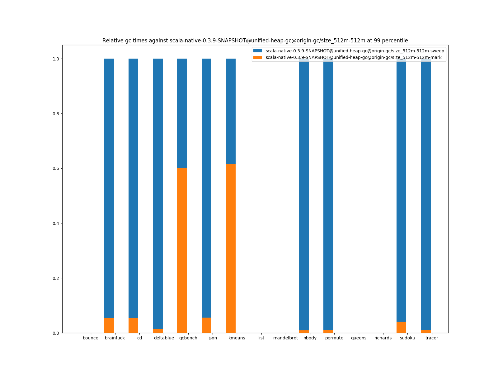
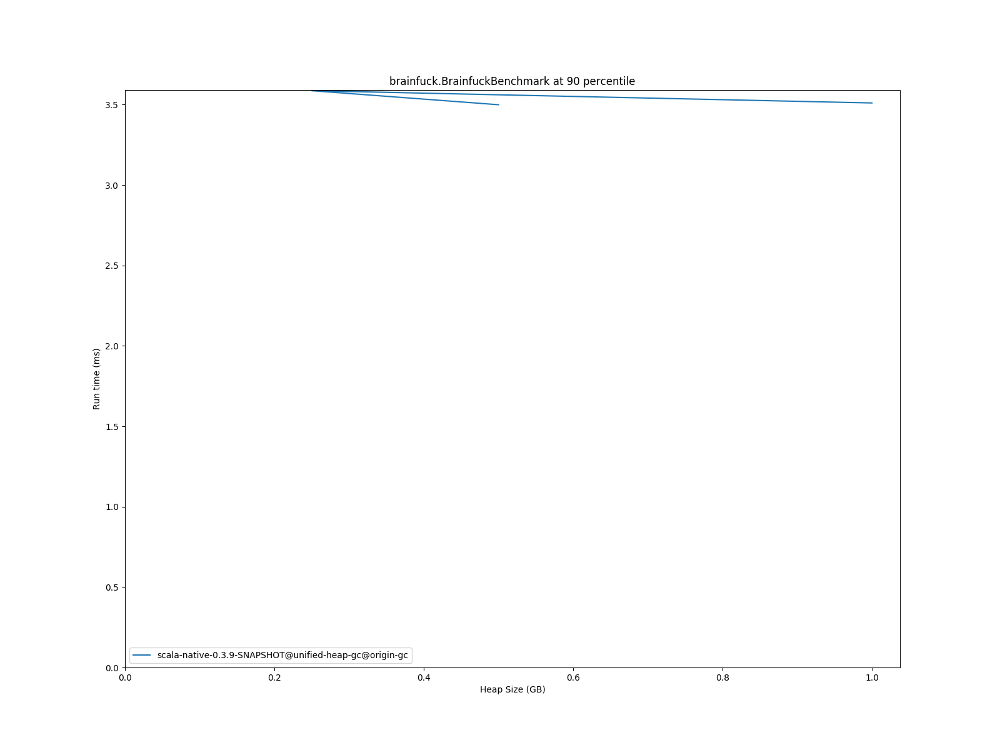
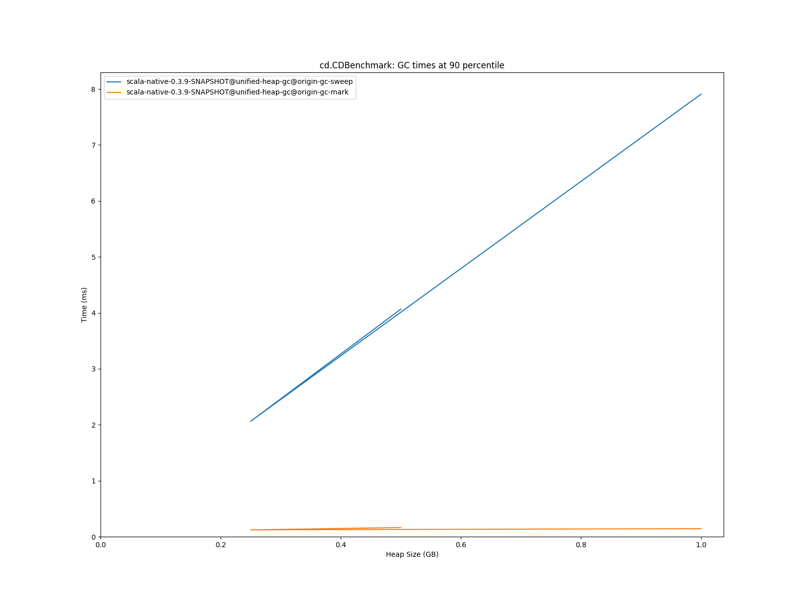
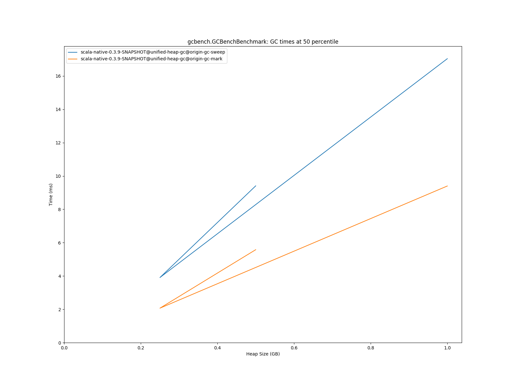
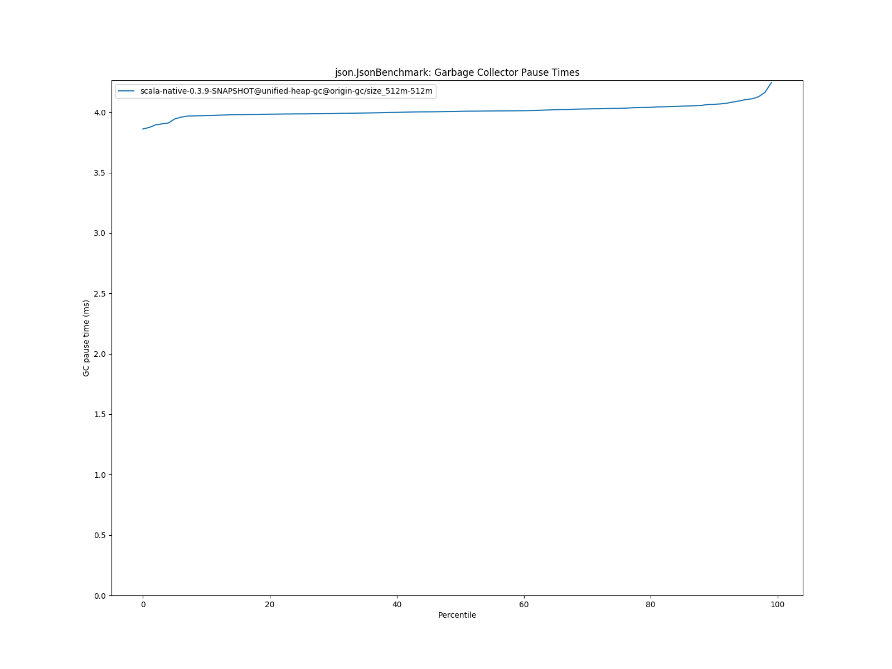
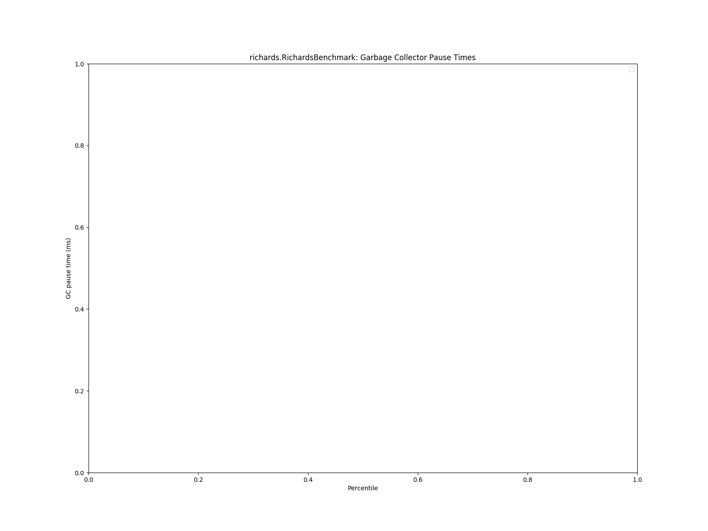

# Summary
## Benchmark run time (ms) at 50 percentile 

|name | scala-native-0.3.9-SNAPSHOT@unified-heap-gc@origin-gc/size_512m-512m|
| -- | -- |
|[bounce.BounceBenchmark](#bouncebouncebenchmark)|0.0542|
|[brainfuck.BrainfuckBenchmark](#brainfuckbrainfuckbenchmark)|3.4097|
|[cd.CDBenchmark](#cdcdbenchmark)|30.9515|
|[deltablue.DeltaBlueBenchmark](#deltabluedeltabluebenchmark)|0.2433|
|[gcbench.GCBenchBenchmark](#gcbenchgcbenchbenchmark)|106.3089|
|[json.JsonBenchmark](#jsonjsonbenchmark)|1.5937|
|[kmeans.KmeansBenchmark](#kmeanskmeansbenchmark)|51.7727|
|[list.ListBenchmark](#listlistbenchmark)|0.0615|
|[mandelbrot.MandelbrotBenchmark](#mandelbrotmandelbrotbenchmark)|126.1834|
|[nbody.NbodyBenchmark](#nbodynbodybenchmark)|37.9890|
|[permute.PermuteBenchmark](#permutepermutebenchmark)|0.2057|
|[queens.QueensBenchmark](#queensqueensbenchmark)|0.1217|
|[richards.RichardsBenchmark](#richardsrichardsbenchmark)|0.0807|
|[sudoku.SudokuBenchmark](#sudokusudokubenchmark)|2.3733|
|[tracer.TracerBenchmark](#tracertracerbenchmark)|0.8194|
| __Geometrical mean:__||
## GC time (ms) at 50 percentile 

|name |  | scala-native-0.3.9-SNAPSHOT@unified-heap-gc@origin-gc/size_512m-512m|
| -- | -- | -- |
|[bounce.BounceBenchmark](#bouncebouncebenchmark)|mark|0.0000|
||sweep|0.0000|
||total|0.0000|
|[brainfuck.BrainfuckBenchmark](#brainfuckbrainfuckbenchmark)|mark|0.1716|
||sweep|3.7810|
||total|3.9445|
|[cd.CDBenchmark](#cdcdbenchmark)|mark|0.0776|
||sweep|3.8763|
||total|3.9623|
|[deltablue.DeltaBlueBenchmark](#deltabluedeltabluebenchmark)|mark|0.0444|
||sweep|3.8976|
||total|3.9425|
|[gcbench.GCBenchBenchmark](#gcbenchgcbenchbenchmark)|mark|5.5785|
||sweep|3.8335|
||total|9.4100|
|[json.JsonBenchmark](#jsonjsonbenchmark)|mark|0.1972|
||sweep|3.8104|
||total|4.0070|
|[kmeans.KmeansBenchmark](#kmeanskmeansbenchmark)|mark|1.8841|
||sweep|3.0752|
||total|4.9500|
|[list.ListBenchmark](#listlistbenchmark)|mark|0.0000|
||sweep|0.0000|
||total|0.0000|
|[mandelbrot.MandelbrotBenchmark](#mandelbrotmandelbrotbenchmark)|mark|0.0000|
||sweep|0.0000|
||total|0.0000|
|[nbody.NbodyBenchmark](#nbodynbodybenchmark)|mark|0.0296|
||sweep|3.8355|
||total|3.8648|
|[permute.PermuteBenchmark](#permutepermutebenchmark)|mark|0.0360|
||sweep|3.8459|
||total|3.8819|
|[queens.QueensBenchmark](#queensqueensbenchmark)|mark|0.0000|
||sweep|0.0000|
||total|0.0000|
|[richards.RichardsBenchmark](#richardsrichardsbenchmark)|mark|0.0000|
||sweep|0.0000|
||total|0.0000|
|[sudoku.SudokuBenchmark](#sudokusudokubenchmark)|mark|0.1462|
||sweep|3.8679|
||total|4.0150|
|[tracer.TracerBenchmark](#tracertracerbenchmark)|mark|0.0364|
||sweep|3.7966|
||total|3.8318|
|__Geometrical mean:__|mark||
||sweep||
||total||
## Benchmark run time (ms) at 90 percentile 

|name | scala-native-0.3.9-SNAPSHOT@unified-heap-gc@origin-gc/size_512m-512m|
| -- | -- |
|[bounce.BounceBenchmark](#bouncebouncebenchmark)|0.0557|
|[brainfuck.BrainfuckBenchmark](#brainfuckbrainfuckbenchmark)|3.4992|
|[cd.CDBenchmark](#cdcdbenchmark)|34.7072|
|[deltablue.DeltaBlueBenchmark](#deltabluedeltabluebenchmark)|0.2510|
|[gcbench.GCBenchBenchmark](#gcbenchgcbenchbenchmark)|107.7157|
|[json.JsonBenchmark](#jsonjsonbenchmark)|1.6346|
|[kmeans.KmeansBenchmark](#kmeanskmeansbenchmark)|53.1581|
|[list.ListBenchmark](#listlistbenchmark)|0.0627|
|[mandelbrot.MandelbrotBenchmark](#mandelbrotmandelbrotbenchmark)|127.5655|
|[nbody.NbodyBenchmark](#nbodynbodybenchmark)|39.0272|
|[permute.PermuteBenchmark](#permutepermutebenchmark)|0.2089|
|[queens.QueensBenchmark](#queensqueensbenchmark)|0.1244|
|[richards.RichardsBenchmark](#richardsrichardsbenchmark)|0.0837|
|[sudoku.SudokuBenchmark](#sudokusudokubenchmark)|2.4838|
|[tracer.TracerBenchmark](#tracertracerbenchmark)|0.8397|
| __Geometrical mean:__||
## GC time (ms) at 90 percentile 

|name |  | scala-native-0.3.9-SNAPSHOT@unified-heap-gc@origin-gc/size_512m-512m|
| -- | -- | -- |
|[bounce.BounceBenchmark](#bouncebouncebenchmark)|mark|0.0000|
||sweep|0.0000|
||total|0.0000|
|[brainfuck.BrainfuckBenchmark](#brainfuckbrainfuckbenchmark)|mark|0.2005|
||sweep|3.8302|
||total|4.0149|
|[cd.CDBenchmark](#cdcdbenchmark)|mark|0.1636|
||sweep|3.9500|
||total|4.0653|
|[deltablue.DeltaBlueBenchmark](#deltabluedeltabluebenchmark)|mark|0.0452|
||sweep|3.9716|
||total|4.0172|
|[gcbench.GCBenchBenchmark](#gcbenchgcbenchbenchmark)|mark|5.6688|
||sweep|3.9081|
||total|9.5466|
|[json.JsonBenchmark](#jsonjsonbenchmark)|mark|0.2048|
||sweep|3.8808|
||total|4.0652|
|[kmeans.KmeansBenchmark](#kmeanskmeansbenchmark)|mark|2.7522|
||sweep|3.1300|
||total|5.8248|
|[list.ListBenchmark](#listlistbenchmark)|mark|0.0000|
||sweep|0.0000|
||total|0.0000|
|[mandelbrot.MandelbrotBenchmark](#mandelbrotmandelbrotbenchmark)|mark|0.0000|
||sweep|0.0000|
||total|0.0000|
|[nbody.NbodyBenchmark](#nbodynbodybenchmark)|mark|0.0321|
||sweep|3.8815|
||total|3.9115|
|[permute.PermuteBenchmark](#permutepermutebenchmark)|mark|0.0370|
||sweep|3.9046|
||total|3.9414|
|[queens.QueensBenchmark](#queensqueensbenchmark)|mark|0.0000|
||sweep|0.0000|
||total|0.0000|
|[richards.RichardsBenchmark](#richardsrichardsbenchmark)|mark|0.0000|
||sweep|0.0000|
||total|0.0000|
|[sudoku.SudokuBenchmark](#sudokusudokubenchmark)|mark|0.1559|
||sweep|3.9736|
||total|4.1211|
|[tracer.TracerBenchmark](#tracertracerbenchmark)|mark|0.0385|
||sweep|3.8768|
||total|3.9133|
|__Geometrical mean:__|mark||
||sweep||
||total||
## Benchmark run time (ms) at 99 percentile 

|name | scala-native-0.3.9-SNAPSHOT@unified-heap-gc@origin-gc/size_512m-512m|
| -- | -- |
|[bounce.BounceBenchmark](#bouncebouncebenchmark)|0.0582|
|[brainfuck.BrainfuckBenchmark](#brainfuckbrainfuckbenchmark)|3.6646|
|[cd.CDBenchmark](#cdcdbenchmark)|36.0748|
|[deltablue.DeltaBlueBenchmark](#deltabluedeltabluebenchmark)|0.2779|
|[gcbench.GCBenchBenchmark](#gcbenchgcbenchbenchmark)|108.8856|
|[json.JsonBenchmark](#jsonjsonbenchmark)|1.6882|
|[kmeans.KmeansBenchmark](#kmeanskmeansbenchmark)|57.7265|
|[list.ListBenchmark](#listlistbenchmark)|0.0647|
|[mandelbrot.MandelbrotBenchmark](#mandelbrotmandelbrotbenchmark)|130.0224|
|[nbody.NbodyBenchmark](#nbodynbodybenchmark)|41.8326|
|[permute.PermuteBenchmark](#permutepermutebenchmark)|0.2182|
|[queens.QueensBenchmark](#queensqueensbenchmark)|0.1301|
|[richards.RichardsBenchmark](#richardsrichardsbenchmark)|0.0906|
|[sudoku.SudokuBenchmark](#sudokusudokubenchmark)|2.6255|
|[tracer.TracerBenchmark](#tracertracerbenchmark)|0.9311|
| __Geometrical mean:__||
## GC time (ms) at 99 percentile 

|name |  | scala-native-0.3.9-SNAPSHOT@unified-heap-gc@origin-gc/size_512m-512m|
| -- | -- | -- |
|[bounce.BounceBenchmark](#bouncebouncebenchmark)|mark|0.0000|
||sweep|0.0000|
||total|0.0000|
|[brainfuck.BrainfuckBenchmark](#brainfuckbrainfuckbenchmark)|mark|0.2088|
||sweep|3.9900|
||total|4.1568|
|[cd.CDBenchmark](#cdcdbenchmark)|mark|0.2223|
||sweep|4.1437|
||total|4.2422|
|[deltablue.DeltaBlueBenchmark](#deltabluedeltabluebenchmark)|mark|0.0610|
||sweep|3.9985|
||total|4.0556|
|[gcbench.GCBenchBenchmark](#gcbenchgcbenchbenchmark)|mark|5.7994|
||sweep|4.0920|
||total|9.7976|
|[json.JsonBenchmark](#jsonjsonbenchmark)|mark|0.2275|
||sweep|4.0401|
||total|4.2448|
|[kmeans.KmeansBenchmark](#kmeanskmeansbenchmark)|mark|4.9313|
||sweep|3.2512|
||total|8.0319|
|[list.ListBenchmark](#listlistbenchmark)|mark|0.0000|
||sweep|0.0000|
||total|0.0000|
|[mandelbrot.MandelbrotBenchmark](#mandelbrotmandelbrotbenchmark)|mark|0.0000|
||sweep|0.0000|
||total|0.0000|
|[nbody.NbodyBenchmark](#nbodynbodybenchmark)|mark|0.0354|
||sweep|4.0293|
||total|4.0581|
|[permute.PermuteBenchmark](#permutepermutebenchmark)|mark|0.0393|
||sweep|3.9455|
||total|3.9815|
|[queens.QueensBenchmark](#queensqueensbenchmark)|mark|0.0000|
||sweep|0.0000|
||total|0.0000|
|[richards.RichardsBenchmark](#richardsrichardsbenchmark)|mark|0.0000|
||sweep|0.0000|
||total|0.0000|
|[sudoku.SudokuBenchmark](#sudokusudokubenchmark)|mark|0.1707|
||sweep|4.3502|
||total|4.5177|
|[tracer.TracerBenchmark](#tracertracerbenchmark)|mark|0.0419|
||sweep|4.0587|
||total|4.0903|
|__Geometrical mean:__|mark||
||sweep||
||total||
# Individual benchmarks
## bounce.BounceBenchmark

## brainfuck.BrainfuckBenchmark

## cd.CDBenchmark

## deltablue.DeltaBlueBenchmark

## gcbench.GCBenchBenchmark

## json.JsonBenchmark

## kmeans.KmeansBenchmark

## list.ListBenchmark

## mandelbrot.MandelbrotBenchmark

## nbody.NbodyBenchmark

## permute.PermuteBenchmark

## queens.QueensBenchmark

## richards.RichardsBenchmark

## sudoku.SudokuBenchmark

## tracer.TracerBenchmark

