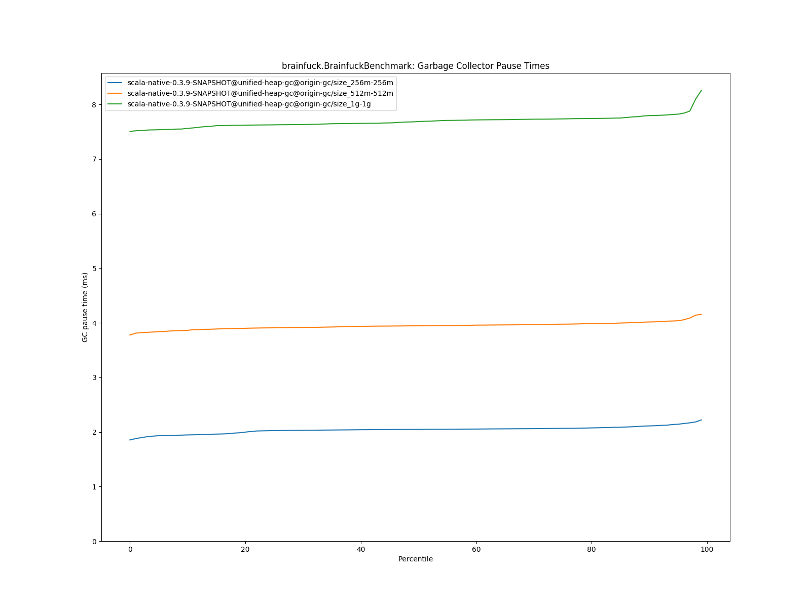
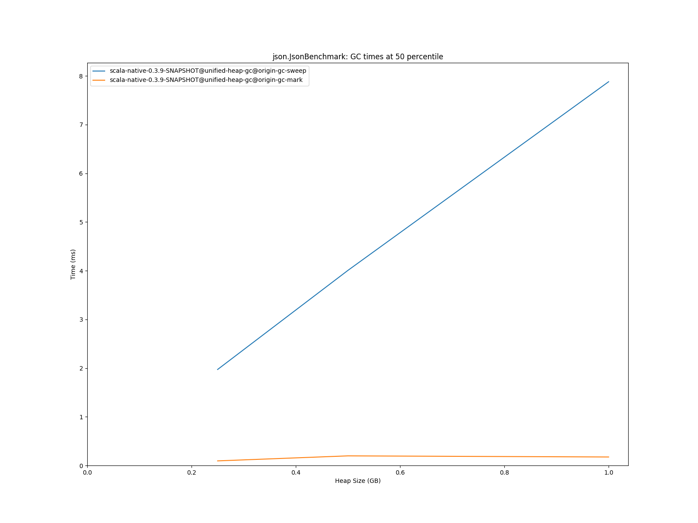
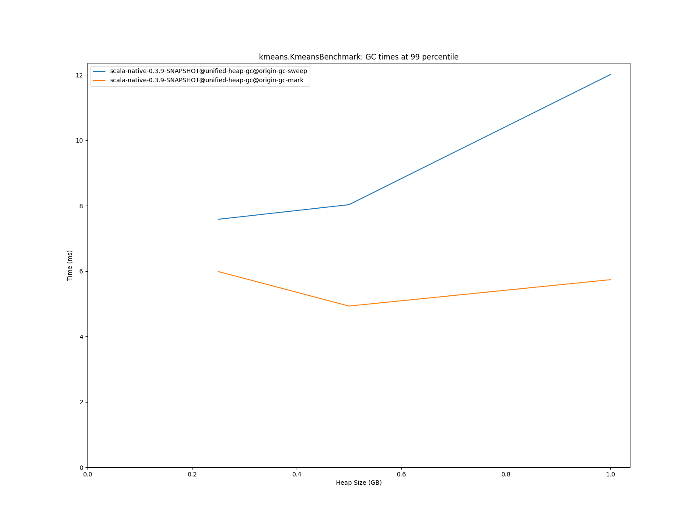
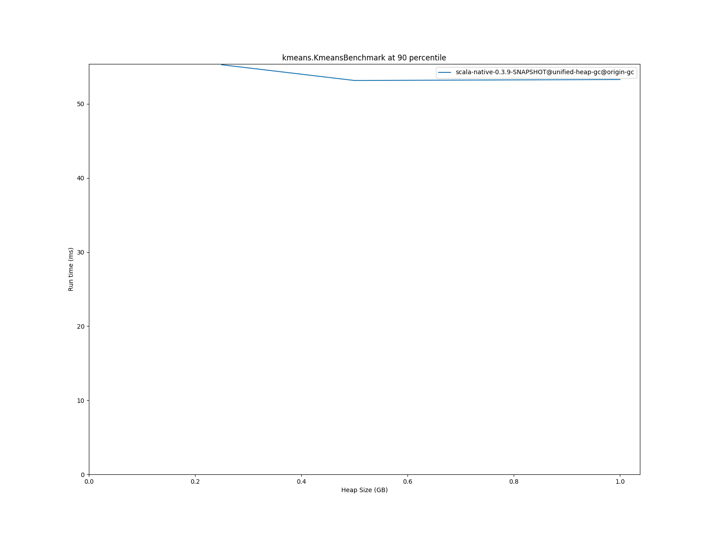
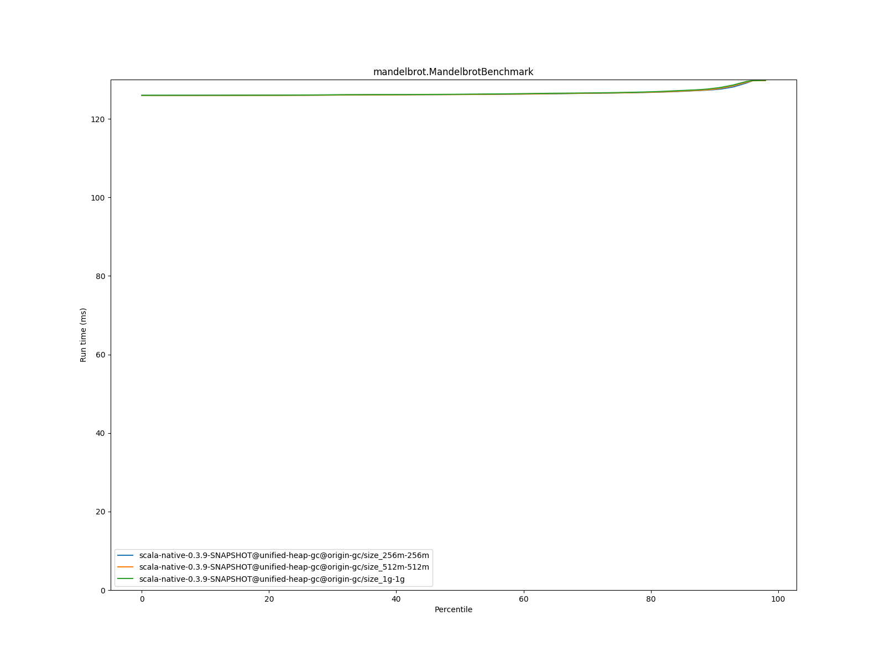

# Summary
## Benchmark run time (ms) at 50 percentile 

|name | scala-native-0.3.9-SNAPSHOT@unified-heap-gc@origin-gc/size_256m-256m | scala-native-0.3.9-SNAPSHOT@unified-heap-gc@origin-gc/size_512m-512m |  | scala-native-0.3.9-SNAPSHOT@unified-heap-gc@origin-gc/size_1g-1g | |
| -- | -- | -- | -- | -- | -- |
|[bounce.BounceBenchmark](#bouncebouncebenchmark)|0.0562|0.0542|__-3.66%__|0.0553|__-1.60%__|
|[brainfuck.BrainfuckBenchmark](#brainfuckbrainfuckbenchmark)|3.4834|3.4097|__-2.12%__|3.4118|__-2.06%__|
|[cd.CDBenchmark](#cdcdbenchmark)|32.2345|30.9515|__-3.98%__|30.6331|__-4.97%__|
|[deltablue.DeltaBlueBenchmark](#deltabluedeltabluebenchmark)|0.1891|0.2433|+28.65%|0.2408|+27.32%|
|[gcbench.GCBenchBenchmark](#gcbenchgcbenchbenchmark)|104.0151|106.3089|+2.21%|106.9537|+2.83%|
|[json.JsonBenchmark](#jsonjsonbenchmark)|1.6063|1.5937|__-0.79%__|1.7058|+6.19%|
|[kmeans.KmeansBenchmark](#kmeanskmeansbenchmark)|52.0428|51.7727|__-0.52%__|51.9763|__-0.13%__|
|[list.ListBenchmark](#listlistbenchmark)|0.0581|0.0615|+5.71%|0.0615|+5.81%|
|[mandelbrot.MandelbrotBenchmark](#mandelbrotmandelbrotbenchmark)|126.1955|126.1834|__-0.01%__|126.2500|+0.04%|
|[nbody.NbodyBenchmark](#nbodynbodybenchmark)|38.0338|37.9890|__-0.12%__|38.0356|+0.00%|
|[permute.PermuteBenchmark](#permutepermutebenchmark)|0.2058|0.2057|__-0.05%__|0.2758|+33.97%|
|[queens.QueensBenchmark](#queensqueensbenchmark)|0.1211|0.1217|+0.47%|0.1233|+1.81%|
|[richards.RichardsBenchmark](#richardsrichardsbenchmark)|0.0812|0.0807|__-0.65%__|0.0816|+0.56%|
|[sudoku.SudokuBenchmark](#sudokusudokubenchmark)|2.4515|2.3733|__-3.19%__|2.4203|__-1.27%__|
|[tracer.TracerBenchmark](#tracertracerbenchmark)|0.8121|0.8194|+0.91%|0.8188|+0.82%|
| __Geometrical mean:__|| |+1.27%| |+4.14%|
## GC time (ms) at 50 percentile 

|name |  | scala-native-0.3.9-SNAPSHOT@unified-heap-gc@origin-gc/size_256m-256m | scala-native-0.3.9-SNAPSHOT@unified-heap-gc@origin-gc/size_512m-512m |  | scala-native-0.3.9-SNAPSHOT@unified-heap-gc@origin-gc/size_1g-1g | |
| -- | -- | -- | -- | -- | -- | -- |
|[bounce.BounceBenchmark](#bouncebouncebenchmark)|mark|0.0000|0.0000|N/A|0.0000|N/A|
||sweep|0.0000|0.0000|N/A|0.0000|N/A|
||total|0.0000|0.0000|N/A|0.0000|N/A|
|[brainfuck.BrainfuckBenchmark](#brainfuckbrainfuckbenchmark)|mark|0.1953|0.1716|__-12.11%__|0.1652|__-15.37%__|
||sweep|1.8549|3.7810|+103.84%|7.5522|+307.14%|
||total|2.0477|3.9445|+92.63%|7.6859|+275.34%|
|[cd.CDBenchmark](#cdcdbenchmark)|mark|0.0794|0.0776|__-2.28%__|0.0792|__-0.26%__|
||sweep|1.9199|3.8763|+101.90%|7.6965|+300.89%|
||total|2.0081|3.9623|+97.32%|7.7842|+287.64%|
|[deltablue.DeltaBlueBenchmark](#deltabluedeltabluebenchmark)|mark|0.0541|0.0444|__-17.81%__|0.0000|__-100.00%__|
||sweep|1.9133|3.8976|+103.71%|0.0000|__-100.00%__|
||total|1.9775|3.9425|+99.37%|0.0000|__-100.00%__|
|[gcbench.GCBenchBenchmark](#gcbenchgcbenchbenchmark)|mark|2.0688|5.5785|+169.65%|9.4006|+354.40%|
||sweep|1.8683|3.8335|+105.19%|7.6395|+308.91%|
||total|3.9074|9.4100|+140.82%|17.0411|+336.12%|
|[json.JsonBenchmark](#jsonjsonbenchmark)|mark|0.0942|0.1972|+109.39%|0.1743|+85.03%|
||sweep|1.8763|3.8104|+103.08%|7.7455|+312.81%|
||total|1.9713|4.0070|+103.27%|7.8815|+299.82%|
|[kmeans.KmeansBenchmark](#kmeanskmeansbenchmark)|mark|2.6808|1.8841|__-29.72%__|2.4632|__-8.12%__|
||sweep|1.5286|3.0752|+101.17%|6.1359|+301.40%|
||total|4.2189|4.9500|+17.33%|8.6167|+104.24%|
|[list.ListBenchmark](#listlistbenchmark)|mark|0.0000|0.0000|N/A|0.0000|N/A|
||sweep|0.0000|0.0000|N/A|0.0000|N/A|
||total|0.0000|0.0000|N/A|0.0000|N/A|
|[mandelbrot.MandelbrotBenchmark](#mandelbrotmandelbrotbenchmark)|mark|0.0000|0.0000|N/A|0.0000|N/A|
||sweep|0.0000|0.0000|N/A|0.0000|N/A|
||total|0.0000|0.0000|N/A|0.0000|N/A|
|[nbody.NbodyBenchmark](#nbodynbodybenchmark)|mark|0.0279|0.0296|+6.25%|0.0308|+10.33%|
||sweep|1.8831|3.8355|+103.68%|7.6713|+307.39%|
||total|1.9098|3.8648|+102.37%|7.7030|+303.35%|
|[permute.PermuteBenchmark](#permutepermutebenchmark)|mark|0.0286|0.0360|+26.15%|0.0000|__-100.00%__|
||sweep|1.8641|3.8459|+106.31%|0.0000|__-100.00%__|
||total|1.8931|3.8819|+105.06%|0.0000|__-100.00%__|
|[queens.QueensBenchmark](#queensqueensbenchmark)|mark|0.0000|0.0000|N/A|0.0000|N/A|
||sweep|0.0000|0.0000|N/A|0.0000|N/A|
||total|0.0000|0.0000|N/A|0.0000|N/A|
|[richards.RichardsBenchmark](#richardsrichardsbenchmark)|mark|0.0000|0.0000|N/A|0.0000|N/A|
||sweep|0.0000|0.0000|N/A|0.0000|N/A|
||total|0.0000|0.0000|N/A|0.0000|N/A|
|[sudoku.SudokuBenchmark](#sudokusudokubenchmark)|mark|0.1514|0.1462|__-3.44%__|0.1444|__-4.66%__|
||sweep|1.9029|3.8679|+103.27%|7.6914|+304.20%|
||total|2.0559|4.0150|+95.29%|7.8402|+281.35%|
|[tracer.TracerBenchmark](#tracertracerbenchmark)|mark|0.0362|0.0364|+0.56%|0.0380|+5.04%|
||sweep|1.8714|3.7966|+102.88%|7.7280|+312.96%|
||total|1.9069|3.8318|+100.95%|7.7664|+307.29%|
|__Geometrical mean:__|mark|| |+13.81%| |+28.00%|
||sweep|| |+103.50%| |+306.94%|
||total|| |+92.78%| |+266.37%|
## Benchmark run time (ms) at 90 percentile 

|name | scala-native-0.3.9-SNAPSHOT@unified-heap-gc@origin-gc/size_256m-256m | scala-native-0.3.9-SNAPSHOT@unified-heap-gc@origin-gc/size_512m-512m |  | scala-native-0.3.9-SNAPSHOT@unified-heap-gc@origin-gc/size_1g-1g | |
| -- | -- | -- | -- | -- | -- |
|[bounce.BounceBenchmark](#bouncebouncebenchmark)|0.0579|0.0557|__-3.81%__|0.0567|__-2.03%__|
|[brainfuck.BrainfuckBenchmark](#brainfuckbrainfuckbenchmark)|3.5865|3.4992|__-2.43%__|3.5102|__-2.13%__|
|[cd.CDBenchmark](#cdcdbenchmark)|34.2771|34.7072|+1.25%|31.5070|__-8.08%__|
|[deltablue.DeltaBlueBenchmark](#deltabluedeltabluebenchmark)|0.1995|0.2510|+25.83%|0.2458|+23.19%|
|[gcbench.GCBenchBenchmark](#gcbenchgcbenchbenchmark)|105.1932|107.7157|+2.40%|115.2136|+9.53%|
|[json.JsonBenchmark](#jsonjsonbenchmark)|1.6499|1.6346|__-0.93%__|1.7523|+6.20%|
|[kmeans.KmeansBenchmark](#kmeanskmeansbenchmark)|55.2823|53.1581|__-3.84%__|53.2907|__-3.60%__|
|[list.ListBenchmark](#listlistbenchmark)|0.0597|0.0627|+5.07%|0.0628|+5.22%|
|[mandelbrot.MandelbrotBenchmark](#mandelbrotmandelbrotbenchmark)|127.4384|127.5655|+0.10%|127.7862|+0.27%|
|[nbody.NbodyBenchmark](#nbodynbodybenchmark)|39.0915|39.0272|__-0.16%__|39.0627|__-0.07%__|
|[permute.PermuteBenchmark](#permutepermutebenchmark)|0.2120|0.2089|__-1.48%__|0.2822|+33.13%|
|[queens.QueensBenchmark](#queensqueensbenchmark)|0.1248|0.1244|__-0.34%__|0.1255|+0.55%|
|[richards.RichardsBenchmark](#richardsrichardsbenchmark)|0.0842|0.0837|__-0.60%__|0.0840|__-0.22%__|
|[sudoku.SudokuBenchmark](#sudokusudokubenchmark)|2.5292|2.4838|__-1.80%__|2.5087|__-0.81%__|
|[tracer.TracerBenchmark](#tracertracerbenchmark)|0.8277|0.8397|+1.45%|0.8393|+1.40%|
| __Geometrical mean:__|| |+1.17%| |+3.70%|
## GC time (ms) at 90 percentile 

|name |  | scala-native-0.3.9-SNAPSHOT@unified-heap-gc@origin-gc/size_256m-256m | scala-native-0.3.9-SNAPSHOT@unified-heap-gc@origin-gc/size_512m-512m |  | scala-native-0.3.9-SNAPSHOT@unified-heap-gc@origin-gc/size_1g-1g | |
| -- | -- | -- | -- | -- | -- | -- |
|[bounce.BounceBenchmark](#bouncebouncebenchmark)|mark|0.0000|0.0000|N/A|0.0000|N/A|
||sweep|0.0000|0.0000|N/A|0.0000|N/A|
||total|0.0000|0.0000|N/A|0.0000|N/A|
|[brainfuck.BrainfuckBenchmark](#brainfuckbrainfuckbenchmark)|mark|0.2057|0.2005|__-2.55%__|0.1740|__-15.45%__|
||sweep|1.9158|3.8302|+99.92%|7.6292|+298.22%|
||total|2.1109|4.0149|+90.20%|7.7954|+269.29%|
|[cd.CDBenchmark](#cdcdbenchmark)|mark|0.1219|0.1636|+34.23%|0.1433|+17.57%|
||sweep|1.9726|3.9500|+100.24%|7.8071|+295.77%|
||total|2.0620|4.0653|+97.16%|7.9076|+283.49%|
|[deltablue.DeltaBlueBenchmark](#deltabluedeltabluebenchmark)|mark|0.0703|0.0452|__-35.66%__|0.0000|__-100.00%__|
||sweep|1.9743|3.9716|+101.16%|0.0000|__-100.00%__|
||total|2.0378|4.0172|+97.14%|0.0000|__-100.00%__|
|[gcbench.GCBenchBenchmark](#gcbenchgcbenchbenchmark)|mark|3.5704|5.6688|+58.77%|9.5295|+166.90%|
||sweep|1.8977|3.9081|+105.93%|7.7676|+309.31%|
||total|5.4654|9.5466|+74.67%|17.2489|+215.60%|
|[json.JsonBenchmark](#jsonjsonbenchmark)|mark|0.0995|0.2048|+105.86%|0.1889|+89.86%|
||sweep|1.9088|3.8808|+103.31%|7.8576|+311.64%|
||total|2.0029|4.0652|+102.96%|8.0372|+301.27%|
|[kmeans.KmeansBenchmark](#kmeanskmeansbenchmark)|mark|3.7529|2.7522|__-26.67%__|3.4323|__-8.54%__|
||sweep|1.5737|3.1300|+98.90%|6.2318|+296.00%|
||total|5.2695|5.8248|+10.54%|9.6894|+83.88%|
|[list.ListBenchmark](#listlistbenchmark)|mark|0.0000|0.0000|N/A|0.0000|N/A|
||sweep|0.0000|0.0000|N/A|0.0000|N/A|
||total|0.0000|0.0000|N/A|0.0000|N/A|
|[mandelbrot.MandelbrotBenchmark](#mandelbrotmandelbrotbenchmark)|mark|0.0000|0.0000|N/A|0.0000|N/A|
||sweep|0.0000|0.0000|N/A|0.0000|N/A|
||total|0.0000|0.0000|N/A|0.0000|N/A|
|[nbody.NbodyBenchmark](#nbodynbodybenchmark)|mark|0.0304|0.0321|+5.61%|0.0336|+10.56%|
||sweep|1.9314|3.8815|+100.96%|7.7582|+301.68%|
||total|1.9587|3.9115|+99.70%|7.7902|+297.71%|
|[permute.PermuteBenchmark](#permutepermutebenchmark)|mark|0.0389|0.0370|__-4.91%__|0.0000|__-100.00%__|
||sweep|1.9007|3.9046|+105.43%|0.0000|__-100.00%__|
||total|1.9295|3.9414|+104.27%|0.0000|__-100.00%__|
|[queens.QueensBenchmark](#queensqueensbenchmark)|mark|0.0000|0.0000|N/A|0.0000|N/A|
||sweep|0.0000|0.0000|N/A|0.0000|N/A|
||total|0.0000|0.0000|N/A|0.0000|N/A|
|[richards.RichardsBenchmark](#richardsrichardsbenchmark)|mark|0.0000|0.0000|N/A|0.0000|N/A|
||sweep|0.0000|0.0000|N/A|0.0000|N/A|
||total|0.0000|0.0000|N/A|0.0000|N/A|
|[sudoku.SudokuBenchmark](#sudokusudokubenchmark)|mark|0.1631|0.1559|__-4.43%__|0.1589|__-2.59%__|
||sweep|1.9402|3.9736|+104.80%|7.7948|+301.76%|
||total|2.0979|4.1211|+96.44%|7.9402|+278.49%|
|[tracer.TracerBenchmark](#tracertracerbenchmark)|mark|0.0389|0.0385|__-1.09%__|0.0402|+3.33%|
||sweep|1.9114|3.8768|+102.83%|7.8500|+310.70%|
||total|1.9472|3.9133|+100.97%|7.8871|+305.04%|
|__Geometrical mean:__|mark|| |+6.71%| |+22.67%|
||sweep|| |+102.34%| |+303.09%|
||total|| |+84.88%| |+245.08%|
## Benchmark run time (ms) at 99 percentile 

|name | scala-native-0.3.9-SNAPSHOT@unified-heap-gc@origin-gc/size_256m-256m | scala-native-0.3.9-SNAPSHOT@unified-heap-gc@origin-gc/size_512m-512m |  | scala-native-0.3.9-SNAPSHOT@unified-heap-gc@origin-gc/size_1g-1g | |
| -- | -- | -- | -- | -- | -- |
|[bounce.BounceBenchmark](#bouncebouncebenchmark)|0.0605|0.0582|__-3.92%__|0.0592|__-2.19%__|
|[brainfuck.BrainfuckBenchmark](#brainfuckbrainfuckbenchmark)|5.5460|3.6646|__-33.92%__|3.6286|__-34.57%__|
|[cd.CDBenchmark](#cdcdbenchmark)|35.0692|36.0748|+2.87%|39.3051|+12.08%|
|[deltablue.DeltaBlueBenchmark](#deltabluedeltabluebenchmark)|0.2183|0.2779|+27.28%|0.2597|+18.97%|
|[gcbench.GCBenchBenchmark](#gcbenchgcbenchbenchmark)|106.0931|108.8856|+2.63%|116.8551|+10.14%|
|[json.JsonBenchmark](#jsonjsonbenchmark)|1.7633|1.6882|__-4.26%__|1.8444|+4.60%|
|[kmeans.KmeansBenchmark](#kmeanskmeansbenchmark)|58.0660|57.7265|__-0.58%__|61.3493|+5.65%|
|[list.ListBenchmark](#listlistbenchmark)|0.0628|0.0647|+2.98%|0.0647|+3.02%|
|[mandelbrot.MandelbrotBenchmark](#mandelbrotmandelbrotbenchmark)|129.8025|130.0224|+0.17%|130.1722|+0.28%|
|[nbody.NbodyBenchmark](#nbodynbodybenchmark)|40.4085|41.8326|+3.52%|40.5333|+0.31%|
|[permute.PermuteBenchmark](#permutepermutebenchmark)|0.2275|0.2182|__-4.08%__|0.2992|+31.52%|
|[queens.QueensBenchmark](#queensqueensbenchmark)|0.1309|0.1301|__-0.64%__|0.1332|+1.78%|
|[richards.RichardsBenchmark](#richardsrichardsbenchmark)|0.0914|0.0906|__-0.92%__|0.0914|__-0.03%__|
|[sudoku.SudokuBenchmark](#sudokusudokubenchmark)|2.6449|2.6255|__-0.74%__|2.6102|__-1.31%__|
|[tracer.TracerBenchmark](#tracertracerbenchmark)|2.7062|0.9311|__-65.59%__|0.9339|__-65.49%__|
| __Geometrical mean:__|| |__-8.14%__| |__-4.64%__|
## GC time (ms) at 99 percentile 

|name |  | scala-native-0.3.9-SNAPSHOT@unified-heap-gc@origin-gc/size_256m-256m | scala-native-0.3.9-SNAPSHOT@unified-heap-gc@origin-gc/size_512m-512m |  | scala-native-0.3.9-SNAPSHOT@unified-heap-gc@origin-gc/size_1g-1g | |
| -- | -- | -- | -- | -- | -- | -- |
|[bounce.BounceBenchmark](#bouncebouncebenchmark)|mark|0.0000|0.0000|N/A|0.0000|N/A|
||sweep|0.0000|0.0000|N/A|0.0000|N/A|
||total|0.0000|0.0000|N/A|0.0000|N/A|
|[brainfuck.BrainfuckBenchmark](#brainfuckbrainfuckbenchmark)|mark|0.3012|0.2088|__-30.68%__|0.2469|__-18.04%__|
||sweep|2.0083|3.9900|+98.68%|8.1100|+303.83%|
||total|2.2208|4.1568|+87.17%|8.2567|+271.78%|
|[cd.CDBenchmark](#cdcdbenchmark)|mark|0.1408|0.2223|+57.93%|0.1977|+40.48%|
||sweep|2.0681|4.1437|+100.36%|8.2934|+301.02%|
||total|2.1657|4.2422|+95.88%|8.3955|+287.66%|
|[deltablue.DeltaBlueBenchmark](#deltabluedeltabluebenchmark)|mark|0.0761|0.0610|__-19.89%__|0.0000|__-100.00%__|
||sweep|2.0342|3.9985|+96.56%|0.0000|__-100.00%__|
||total|2.1005|4.0556|+93.07%|0.0000|__-100.00%__|
|[gcbench.GCBenchBenchmark](#gcbenchgcbenchbenchmark)|mark|3.6361|5.7994|+59.50%|9.6982|+166.72%|
||sweep|2.0128|4.0920|+103.30%|8.1850|+306.65%|
||total|5.5872|9.7976|+75.36%|17.7236|+217.22%|
|[json.JsonBenchmark](#jsonjsonbenchmark)|mark|0.1074|0.2275|+111.87%|0.2123|+97.72%|
||sweep|2.0602|4.0401|+96.10%|8.2132|+298.65%|
||total|2.1617|4.2448|+96.37%|8.3865|+287.97%|
|[kmeans.KmeansBenchmark](#kmeanskmeansbenchmark)|mark|5.9872|4.9313|__-17.64%__|5.7378|__-4.17%__|
||sweep|1.6595|3.2512|+95.92%|6.4890|+291.03%|
||total|7.5850|8.0319|+5.89%|12.0118|+58.36%|
|[list.ListBenchmark](#listlistbenchmark)|mark|0.0000|0.0000|N/A|0.0000|N/A|
||sweep|0.0000|0.0000|N/A|0.0000|N/A|
||total|0.0000|0.0000|N/A|0.0000|N/A|
|[mandelbrot.MandelbrotBenchmark](#mandelbrotmandelbrotbenchmark)|mark|0.0000|0.0000|N/A|0.0000|N/A|
||sweep|0.0000|0.0000|N/A|0.0000|N/A|
||total|0.0000|0.0000|N/A|0.0000|N/A|
|[nbody.NbodyBenchmark](#nbodynbodybenchmark)|mark|0.0390|0.0354|__-9.05%__|0.0377|__-3.18%__|
||sweep|2.0232|4.0293|+99.16%|8.2365|+307.11%|
||total|2.0451|4.0581|+98.43%|8.2656|+304.17%|
|[permute.PermuteBenchmark](#permutepermutebenchmark)|mark|0.0405|0.0393|__-3.06%__|0.0000|__-100.00%__|
||sweep|2.0162|3.9455|+95.69%|0.0000|__-100.00%__|
||total|2.0444|3.9815|+94.75%|0.0000|__-100.00%__|
|[queens.QueensBenchmark](#queensqueensbenchmark)|mark|0.0000|0.0000|N/A|0.0000|N/A|
||sweep|0.0000|0.0000|N/A|0.0000|N/A|
||total|0.0000|0.0000|N/A|0.0000|N/A|
|[richards.RichardsBenchmark](#richardsrichardsbenchmark)|mark|0.0000|0.0000|N/A|0.0000|N/A|
||sweep|0.0000|0.0000|N/A|0.0000|N/A|
||total|0.0000|0.0000|N/A|0.0000|N/A|
|[sudoku.SudokuBenchmark](#sudokusudokubenchmark)|mark|0.1900|0.1707|__-10.17%__|0.1638|__-13.80%__|
||sweep|2.0489|4.3502|+112.32%|8.1180|+296.22%|
||total|2.2177|4.5177|+103.71%|8.2731|+273.04%|
|[tracer.TracerBenchmark](#tracertracerbenchmark)|mark|0.0417|0.0419|+0.56%|0.0454|+8.80%|
||sweep|2.0527|4.0587|+97.72%|8.3178|+305.21%|
||total|2.0872|4.0903|+95.97%|8.3552|+300.31%|
|__Geometrical mean:__|mark|| |+6.88%| |+23.13%|
||sweep|| |+99.52%| |+301.18%|
||total|| |+81.97%| |+237.80%|
# Individual benchmarks
## bounce.BounceBenchmark

## brainfuck.BrainfuckBenchmark

## cd.CDBenchmark

## deltablue.DeltaBlueBenchmark

## gcbench.GCBenchBenchmark

## json.JsonBenchmark

## kmeans.KmeansBenchmark

## list.ListBenchmark

## mandelbrot.MandelbrotBenchmark

## nbody.NbodyBenchmark

## permute.PermuteBenchmark

## queens.QueensBenchmark

## richards.RichardsBenchmark

## sudoku.SudokuBenchmark

## tracer.TracerBenchmark

