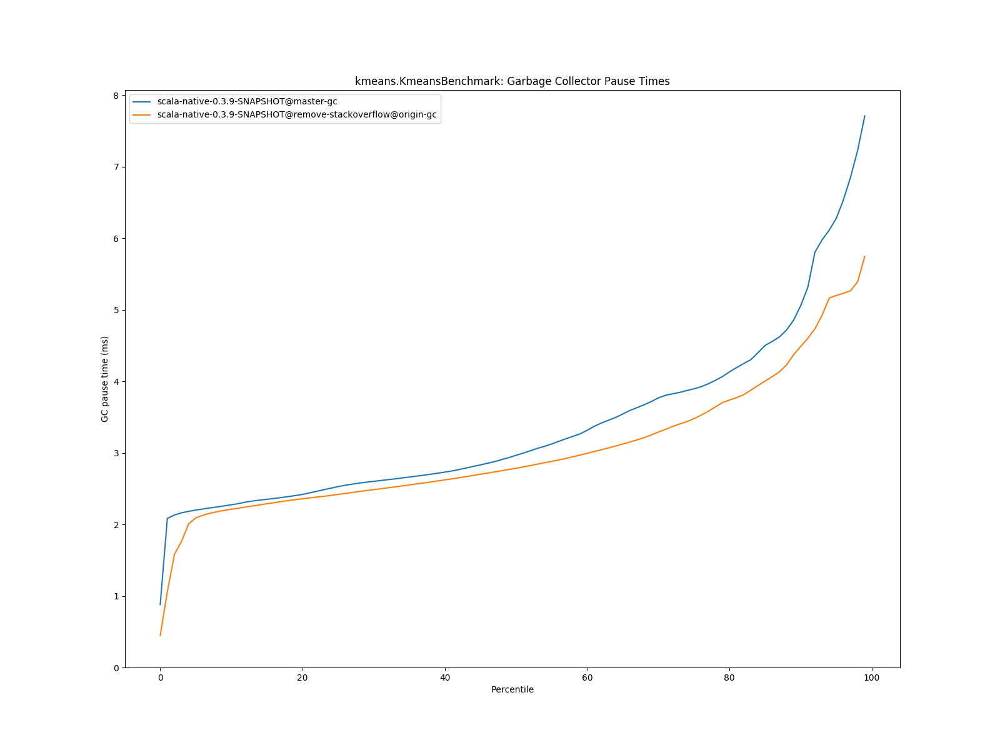

# Summary
## Benchmark run time (ms) at 50 percentile 

|name | scala-native-0.3.9-SNAPSHOT@master-gc | scala-native-0.3.9-SNAPSHOT@remove-stackoverflow@origin-gc | |
| -- | -- | -- | -- |
|[bounce.BounceBenchmark](#bouncebouncebenchmark)|0.0588|0.0555|__-5.60%__|
|[list.ListBenchmark](#listlistbenchmark)|0.0643|0.0645|+0.28%|
|[richards.RichardsBenchmark](#richardsrichardsbenchmark)|0.0763|0.0778|+1.96%|
|[queens.QueensBenchmark](#queensqueensbenchmark)|0.1137|0.1157|+1.74%|
|[permute.PermuteBenchmark](#permutepermutebenchmark)|0.2039|0.2028|__-0.51%__|
|[deltablue.DeltaBlueBenchmark](#deltabluedeltabluebenchmark)|0.1914|0.1898|__-0.80%__|
|[tracer.TracerBenchmark](#tracertracerbenchmark)|0.7505|0.7467|__-0.51%__|
|[brainfuck.BrainfuckBenchmark](#brainfuckbrainfuckbenchmark)|3.3540|3.3429|__-0.33%__|
|[json.JsonBenchmark](#jsonjsonbenchmark)|1.6341|1.6748|+2.49%|
|[cd.CDBenchmark](#cdcdbenchmark)|32.8311|32.2067|__-1.90%__|
|[kmeans.KmeansBenchmark](#kmeanskmeansbenchmark)|53.6443|54.4146|+1.44%|
|[gcbench.GCBenchBenchmark](#gcbenchgcbenchbenchmark)|134.0681|134.2983|+0.17%|
|[mandelbrot.MandelbrotBenchmark](#mandelbrotmandelbrotbenchmark)|126.2417|126.3105|+0.05%|
|[nbody.NbodyBenchmark](#nbodynbodybenchmark)|39.4775|39.5429|+0.17%|
|[sudoku.SudokuBenchmark](#sudokusudokubenchmark)|2.4608|2.5368|+3.09%|
| __Geometrical mean:__|| |+0.09%|
## GC time (ms) at 50 percentile 

|name |  | scala-native-0.3.9-SNAPSHOT@master-gc | scala-native-0.3.9-SNAPSHOT@remove-stackoverflow@origin-gc | |
| -- | -- | -- | -- | -- |
|[bounce.BounceBenchmark](#bouncebouncebenchmark)|mark|0.0187|0.0190|+1.78%|
||sweep|0.0143|0.0142|__-0.68%__|
||total|0.0331|0.0332|+0.33%|
|[list.ListBenchmark](#listlistbenchmark)|mark|0.0301|0.0294|__-2.36%__|
||sweep|0.0163|0.0167|+2.34%|
||total|0.0464|0.0467|+0.62%|
|[richards.RichardsBenchmark](#richardsrichardsbenchmark)|mark|0.0171|0.0159|__-6.67%__|
||sweep|0.0139|0.0141|+1.11%|
||total|0.0309|0.0301|__-2.62%__|
|[queens.QueensBenchmark](#queensqueensbenchmark)|mark|0.0194|0.0181|__-6.68%__|
||sweep|0.0139|0.0140|+0.72%|
||total|0.0332|0.0320|__-3.45%__|
|[permute.PermuteBenchmark](#permutepermutebenchmark)|mark|0.0141|0.0125|__-11.79%__|
||sweep|0.0139|0.0136|__-1.71%__|
||total|0.0280|0.0261|__-6.99%__|
|[deltablue.DeltaBlueBenchmark](#deltabluedeltabluebenchmark)|mark|0.0458|0.0439|__-4.27%__|
||sweep|0.0148|0.0145|__-2.21%__|
||total|0.0608|0.0585|__-3.70%__|
|[tracer.TracerBenchmark](#tracertracerbenchmark)|mark|0.0155|0.0145|__-6.51%__|
||sweep|0.0140|0.0139|__-0.90%__|
||total|0.0295|0.0284|__-3.85%__|
|[brainfuck.BrainfuckBenchmark](#brainfuckbrainfuckbenchmark)|mark|0.0528|0.0970|+83.57%|
||sweep|0.0164|0.0311|+90.05%|
||total|0.0691|0.1282|+85.39%|
|[json.JsonBenchmark](#jsonjsonbenchmark)|mark|0.0541|0.0518|__-4.33%__|
||sweep|0.0172|0.0172|+0.17%|
||total|0.0714|0.0690|__-3.28%__|
|[cd.CDBenchmark](#cdcdbenchmark)|mark|0.0718|0.0789|+9.83%|
||sweep|0.0719|0.1114|+55.04%|
||total|0.1445|0.1852|+28.13%|
|[kmeans.KmeansBenchmark](#kmeanskmeansbenchmark)|mark|2.5488|2.3151|__-9.17%__|
||sweep|0.4230|0.4469|+5.64%|
||total|2.9652|2.7846|__-6.09%__|
|[gcbench.GCBenchBenchmark](#gcbenchgcbenchbenchmark)|mark|3.4065|3.3349|__-2.10%__|
||sweep|0.3938|0.4007|+1.74%|
||total|3.8029|3.7426|__-1.59%__|
|[mandelbrot.MandelbrotBenchmark](#mandelbrotmandelbrotbenchmark)|mark|0.0000|0.0000|N/A|
||sweep|0.0000|0.0000|N/A|
||total|0.0000|0.0000|N/A|
|[nbody.NbodyBenchmark](#nbodynbodybenchmark)|mark|0.0128|0.0125|__-2.09%__|
||sweep|0.0137|0.0140|+1.70%|
||total|0.0265|0.0265|__-0.29%__|
|[sudoku.SudokuBenchmark](#sudokusudokubenchmark)|mark|0.1206|0.1358|+12.62%|
||sweep|0.0843|0.0891|+5.67%|
||total|0.2050|0.2247|+9.61%|
|__Geometrical mean:__|mark|| |+1.85%|
||sweep|| |+9.05%|
||total|| |+4.68%|
## Benchmark run time (ms) at 90 percentile 

|name | scala-native-0.3.9-SNAPSHOT@master-gc | scala-native-0.3.9-SNAPSHOT@remove-stackoverflow@origin-gc | |
| -- | -- | -- | -- |
|[bounce.BounceBenchmark](#bouncebouncebenchmark)|0.0595|0.0560|__-5.79%__|
|[list.ListBenchmark](#listlistbenchmark)|0.0656|0.0658|+0.29%|
|[richards.RichardsBenchmark](#richardsrichardsbenchmark)|0.0785|0.0795|+1.24%|
|[queens.QueensBenchmark](#queensqueensbenchmark)|0.1167|0.1175|+0.71%|
|[permute.PermuteBenchmark](#permutepermutebenchmark)|0.2111|0.2134|+1.12%|
|[deltablue.DeltaBlueBenchmark](#deltabluedeltabluebenchmark)|0.2002|0.1977|__-1.27%__|
|[tracer.TracerBenchmark](#tracertracerbenchmark)|0.7662|0.7726|+0.83%|
|[brainfuck.BrainfuckBenchmark](#brainfuckbrainfuckbenchmark)|3.4431|3.4379|__-0.15%__|
|[json.JsonBenchmark](#jsonjsonbenchmark)|1.6803|1.7072|+1.60%|
|[cd.CDBenchmark](#cdcdbenchmark)|33.5115|32.7169|__-2.37%__|
|[kmeans.KmeansBenchmark](#kmeanskmeansbenchmark)|56.2849|56.8817|+1.06%|
|[gcbench.GCBenchBenchmark](#gcbenchgcbenchbenchmark)|137.3548|136.5588|__-0.58%__|
|[mandelbrot.MandelbrotBenchmark](#mandelbrotmandelbrotbenchmark)|127.1121|127.3232|+0.17%|
|[nbody.NbodyBenchmark](#nbodynbodybenchmark)|40.1422|40.1558|+0.03%|
|[sudoku.SudokuBenchmark](#sudokusudokubenchmark)|2.6719|2.7924|+4.51%|
| __Geometrical mean:__|| |+0.07%|
## GC time (ms) at 90 percentile 

|name |  | scala-native-0.3.9-SNAPSHOT@master-gc | scala-native-0.3.9-SNAPSHOT@remove-stackoverflow@origin-gc | |
| -- | -- | -- | -- | -- |
|[bounce.BounceBenchmark](#bouncebouncebenchmark)|mark|0.0299|0.0303|+1.35%|
||sweep|0.0156|0.0155|__-1.05%__|
||total|0.0454|0.0458|+0.74%|
|[list.ListBenchmark](#listlistbenchmark)|mark|0.0350|0.0347|__-0.81%__|
||sweep|0.0267|0.0249|__-6.75%__|
||total|0.0616|0.0596|__-3.12%__|
|[richards.RichardsBenchmark](#richardsrichardsbenchmark)|mark|0.0267|0.0233|__-12.77%__|
||sweep|0.0147|0.0149|+0.89%|
||total|0.0422|0.0383|__-9.38%__|
|[queens.QueensBenchmark](#queensqueensbenchmark)|mark|0.0299|0.0294|__-1.72%__|
||sweep|0.0151|0.0156|+3.07%|
||total|0.0456|0.0448|__-1.65%__|
|[permute.PermuteBenchmark](#permutepermutebenchmark)|mark|0.0164|0.0162|__-1.20%__|
||sweep|0.0143|0.0140|__-1.91%__|
||total|0.0305|0.0300|__-1.43%__|
|[deltablue.DeltaBlueBenchmark](#deltabluedeltabluebenchmark)|mark|0.0619|0.0599|__-3.26%__|
||sweep|0.0155|0.0150|__-2.89%__|
||total|0.0776|0.0747|__-3.79%__|
|[tracer.TracerBenchmark](#tracertracerbenchmark)|mark|0.0173|0.0162|__-6.44%__|
||sweep|0.0145|0.0142|__-1.66%__|
||total|0.0316|0.0303|__-4.16%__|
|[brainfuck.BrainfuckBenchmark](#brainfuckbrainfuckbenchmark)|mark|0.0906|0.1035|+14.22%|
||sweep|0.0186|0.0324|+74.83%|
||total|0.1092|0.1354|+24.05%|
|[json.JsonBenchmark](#jsonjsonbenchmark)|mark|0.0579|0.0553|__-4.54%__|
||sweep|0.0177|0.0177|+0.37%|
||total|0.0754|0.0728|__-3.45%__|
|[cd.CDBenchmark](#cdcdbenchmark)|mark|0.1106|0.1428|+29.07%|
||sweep|0.0786|0.1161|+47.61%|
||total|0.1881|0.2425|+28.94%|
|[kmeans.KmeansBenchmark](#kmeanskmeansbenchmark)|mark|4.6157|4.0340|__-12.60%__|
||sweep|0.4561|0.5039|+10.50%|
||total|5.0564|4.4878|__-11.24%__|
|[gcbench.GCBenchBenchmark](#gcbenchgcbenchbenchmark)|mark|4.7766|4.6318|__-3.03%__|
||sweep|0.4511|0.4638|+2.81%|
||total|5.1933|5.0572|__-2.62%__|
|[mandelbrot.MandelbrotBenchmark](#mandelbrotmandelbrotbenchmark)|mark|0.0000|0.0000|N/A|
||sweep|0.0000|0.0000|N/A|
||total|0.0000|0.0000|N/A|
|[nbody.NbodyBenchmark](#nbodynbodybenchmark)|mark|0.0163|0.0159|__-2.40%__|
||sweep|0.0146|0.0146|+0.40%|
||total|0.0307|0.0302|__-1.64%__|
|[sudoku.SudokuBenchmark](#sudokusudokubenchmark)|mark|0.1293|0.1487|+15.01%|
||sweep|0.1029|0.1186|+15.27%|
||total|0.2299|0.2666|+15.97%|
|__Geometrical mean:__|mark|| |+0.22%|
||sweep|| |+8.32%|
||total|| |+1.33%|
## Benchmark run time (ms) at 99 percentile 

|name | scala-native-0.3.9-SNAPSHOT@master-gc | scala-native-0.3.9-SNAPSHOT@remove-stackoverflow@origin-gc | |
| -- | -- | -- | -- |
|[bounce.BounceBenchmark](#bouncebouncebenchmark)|0.0674|0.0640|__-5.05%__|
|[list.ListBenchmark](#listlistbenchmark)|0.0733|0.0693|__-5.49%__|
|[richards.RichardsBenchmark](#richardsrichardsbenchmark)|0.0952|0.0900|__-5.50%__|
|[queens.QueensBenchmark](#queensqueensbenchmark)|0.1345|0.1349|+0.33%|
|[permute.PermuteBenchmark](#permutepermutebenchmark)|0.2459|0.2386|__-2.99%__|
|[deltablue.DeltaBlueBenchmark](#deltabluedeltabluebenchmark)|0.2703|0.2677|__-0.96%__|
|[tracer.TracerBenchmark](#tracertracerbenchmark)|0.8347|0.8313|__-0.41%__|
|[brainfuck.BrainfuckBenchmark](#brainfuckbrainfuckbenchmark)|3.5782|3.5844|+0.17%|
|[json.JsonBenchmark](#jsonjsonbenchmark)|1.7565|1.7992|+2.43%|
|[cd.CDBenchmark](#cdcdbenchmark)|34.6577|33.7031|__-2.75%__|
|[kmeans.KmeansBenchmark](#kmeanskmeansbenchmark)|59.4711|58.8044|__-1.12%__|
|[gcbench.GCBenchBenchmark](#gcbenchgcbenchbenchmark)|139.9987|138.3567|__-1.17%__|
|[mandelbrot.MandelbrotBenchmark](#mandelbrotmandelbrotbenchmark)|128.8094|129.0238|+0.17%|
|[nbody.NbodyBenchmark](#nbodynbodybenchmark)|41.3540|41.4634|+0.26%|
|[sudoku.SudokuBenchmark](#sudokusudokubenchmark)|2.8524|3.7065|+29.95%|
| __Geometrical mean:__|| |+0.24%|
## GC time (ms) at 99 percentile 

|name |  | scala-native-0.3.9-SNAPSHOT@master-gc | scala-native-0.3.9-SNAPSHOT@remove-stackoverflow@origin-gc | |
| -- | -- | -- | -- | -- |
|[bounce.BounceBenchmark](#bouncebouncebenchmark)|mark|0.0365|0.0369|+1.20%|
||sweep|0.0276|0.0280|+1.50%|
||total|0.0605|0.0593|__-1.89%__|
|[list.ListBenchmark](#listlistbenchmark)|mark|0.0356|0.0594|+66.62%|
||sweep|0.0289|0.0329|+13.97%|
||total|0.0635|0.0923|+45.44%|
|[richards.RichardsBenchmark](#richardsrichardsbenchmark)|mark|0.0305|0.0312|+2.25%|
||sweep|0.0273|0.0261|__-4.73%__|
||total|0.0581|0.0547|__-5.92%__|
|[queens.QueensBenchmark](#queensqueensbenchmark)|mark|0.0345|0.0347|+0.64%|
||sweep|0.0294|0.0295|+0.35%|
||total|0.0612|0.0606|__-0.85%__|
|[permute.PermuteBenchmark](#permutepermutebenchmark)|mark|0.0300|0.0242|__-19.30%__|
||sweep|0.0214|0.0184|__-14.21%__|
||total|0.0512|0.0416|__-18.84%__|
|[deltablue.DeltaBlueBenchmark](#deltabluedeltabluebenchmark)|mark|0.0869|0.0751|__-13.62%__|
||sweep|0.0224|0.0194|__-13.41%__|
||total|0.1035|0.0918|__-11.28%__|
|[tracer.TracerBenchmark](#tracertracerbenchmark)|mark|0.0234|0.0200|__-14.62%__|
||sweep|0.0168|0.0151|__-10.12%__|
||total|0.0395|0.0351|__-11.19%__|
|[brainfuck.BrainfuckBenchmark](#brainfuckbrainfuckbenchmark)|mark|0.1126|0.1336|+18.59%|
||sweep|0.0207|0.0411|+98.32%|
||total|0.1331|0.1745|+31.10%|
|[json.JsonBenchmark](#jsonjsonbenchmark)|mark|0.0803|0.0782|__-2.58%__|
||sweep|0.0227|0.0230|+1.40%|
||total|0.1009|0.0978|__-3.03%__|
|[cd.CDBenchmark](#cdcdbenchmark)|mark|0.1836|0.1966|+7.11%|
||sweep|0.1018|0.1297|+27.49%|
||total|0.2628|0.3098|+17.87%|
|[kmeans.KmeansBenchmark](#kmeanskmeansbenchmark)|mark|7.2798|5.2877|__-27.36%__|
||sweep|0.5124|0.5578|+8.86%|
||total|7.7074|5.7453|__-25.46%__|
|[gcbench.GCBenchBenchmark](#gcbenchgcbenchbenchmark)|mark|8.1974|7.8017|__-4.83%__|
||sweep|0.5117|0.5192|+1.46%|
||total|8.6813|8.2855|__-4.56%__|
|[mandelbrot.MandelbrotBenchmark](#mandelbrotmandelbrotbenchmark)|mark|0.0000|0.0000|N/A|
||sweep|0.0000|0.0000|N/A|
||total|0.0000|0.0000|N/A|
|[nbody.NbodyBenchmark](#nbodynbodybenchmark)|mark|0.0258|0.0250|__-3.05%__|
||sweep|0.0263|0.0288|+9.33%|
||total|0.0520|0.0536|+3.03%|
|[sudoku.SudokuBenchmark](#sudokusudokubenchmark)|mark|0.1597|0.1732|+8.47%|
||sweep|0.1307|0.1353|+3.51%|
||total|0.2813|0.3043|+8.16%|
|__Geometrical mean:__|mark|| |__-0.52%__|
||sweep|| |+6.34%|
||total|| |+0.08%|
# Individual benchmarks
## bounce.BounceBenchmark

## list.ListBenchmark

## richards.RichardsBenchmark

## queens.QueensBenchmark

## permute.PermuteBenchmark

## deltablue.DeltaBlueBenchmark

## tracer.TracerBenchmark

## brainfuck.BrainfuckBenchmark

## json.JsonBenchmark

## cd.CDBenchmark

## kmeans.KmeansBenchmark

## gcbench.GCBenchBenchmark

## mandelbrot.MandelbrotBenchmark

## nbody.NbodyBenchmark

## sudoku.SudokuBenchmark

