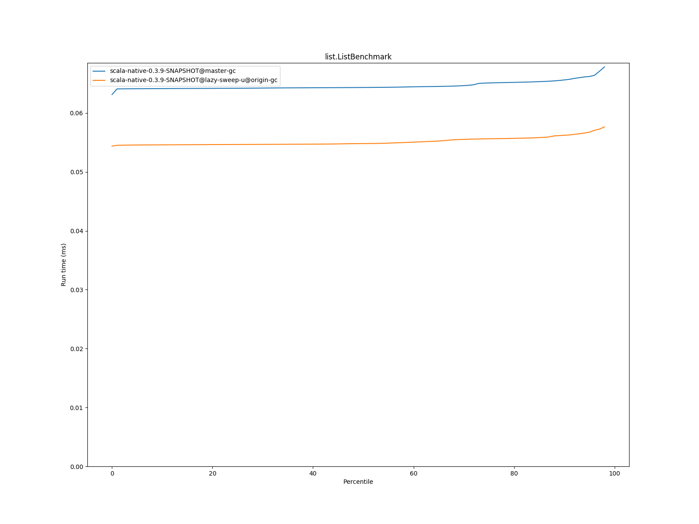

# Summary
## Benchmark run time (ms) at 50 percentile 

|name | scala-native-0.3.9-SNAPSHOT@master-gc | scala-native-0.3.9-SNAPSHOT@lazy-sweep-u@origin-gc | |
| -- | -- | -- | -- |
|[bounce.BounceBenchmark](#bouncebouncebenchmark)|0.0588|0.0541|__-8.08%__|
|[list.ListBenchmark](#listlistbenchmark)|0.0643|0.0548|__-14.81%__|
|[richards.RichardsBenchmark](#richardsrichardsbenchmark)|0.0763|0.0761|__-0.33%__|
|[queens.QueensBenchmark](#queensqueensbenchmark)|0.1137|0.1154|+1.48%|
|[permute.PermuteBenchmark](#permutepermutebenchmark)|0.2039|0.2036|__-0.15%__|
|[deltablue.DeltaBlueBenchmark](#deltabluedeltabluebenchmark)|0.1914|0.1803|__-5.77%__|
|[tracer.TracerBenchmark](#tracertracerbenchmark)|0.7505|0.7694|+2.51%|
|[brainfuck.BrainfuckBenchmark](#brainfuckbrainfuckbenchmark)|3.3540|3.3959|+1.25%|
|[json.JsonBenchmark](#jsonjsonbenchmark)|1.6341|1.6473|+0.81%|
|[cd.CDBenchmark](#cdcdbenchmark)|32.8311|32.7846|__-0.14%__|
|[kmeans.KmeansBenchmark](#kmeanskmeansbenchmark)|53.6443|53.1329|__-0.95%__|
|[gcbench.GCBenchBenchmark](#gcbenchgcbenchbenchmark)|134.0681|134.1908|+0.09%|
|[mandelbrot.MandelbrotBenchmark](#mandelbrotmandelbrotbenchmark)|126.2417|126.2438|+0.00%|
|[nbody.NbodyBenchmark](#nbodynbodybenchmark)|39.4775|39.5996|+0.31%|
|[sudoku.SudokuBenchmark](#sudokusudokubenchmark)|2.4608|2.4033|__-2.33%__|
| __Geometrical mean:__|| |__-1.85%__|
## GC time (ms) at 50 percentile 

|name |  | scala-native-0.3.9-SNAPSHOT@master-gc | scala-native-0.3.9-SNAPSHOT@lazy-sweep-u@origin-gc | |
| -- | -- | -- | -- | -- |
|[bounce.BounceBenchmark](#bouncebouncebenchmark)|mark|0.0187|0.0186|__-0.38%__|
||sweep|0.0143|0.0143|__-0.17%__|
||total|0.0331|0.0326|__-1.49%__|
|[list.ListBenchmark](#listlistbenchmark)|mark|0.0301|0.0289|__-4.09%__|
||sweep|0.0163|0.0162|__-0.84%__|
||total|0.0464|0.0457|__-1.40%__|
|[richards.RichardsBenchmark](#richardsrichardsbenchmark)|mark|0.0171|0.0158|__-7.48%__|
||sweep|0.0139|0.0140|+0.66%|
||total|0.0309|0.0298|__-3.45%__|
|[queens.QueensBenchmark](#queensqueensbenchmark)|mark|0.0194|0.0202|+4.01%|
||sweep|0.0139|0.0141|+1.02%|
||total|0.0332|0.0344|+3.84%|
|[permute.PermuteBenchmark](#permutepermutebenchmark)|mark|0.0141|0.0144|+1.88%|
||sweep|0.0139|0.0137|__-1.23%__|
||total|0.0280|0.0281|+0.25%|
|[deltablue.DeltaBlueBenchmark](#deltabluedeltabluebenchmark)|mark|0.0458|0.0429|__-6.47%__|
||sweep|0.0148|0.0148|__-0.08%__|
||total|0.0608|0.0576|__-5.24%__|
|[tracer.TracerBenchmark](#tracertracerbenchmark)|mark|0.0155|0.0155|+0.30%|
||sweep|0.0140|0.0139|__-0.63%__|
||total|0.0295|0.0295|__-0.11%__|
|[brainfuck.BrainfuckBenchmark](#brainfuckbrainfuckbenchmark)|mark|0.0528|0.0528|+0.01%|
||sweep|0.0164|0.0170|+3.71%|
||total|0.0691|0.0696|+0.65%|
|[json.JsonBenchmark](#jsonjsonbenchmark)|mark|0.0541|0.0527|__-2.65%__|
||sweep|0.0172|0.0172|__-0.22%__|
||total|0.0714|0.0699|__-2.06%__|
|[cd.CDBenchmark](#cdcdbenchmark)|mark|0.0718|0.0733|+1.98%|
||sweep|0.0719|0.0715|__-0.45%__|
||total|0.1445|0.1460|+1.01%|
|[kmeans.KmeansBenchmark](#kmeanskmeansbenchmark)|mark|2.5488|1.9602|__-23.09%__|
||sweep|0.4230|0.4417|+4.42%|
||total|2.9652|2.4059|__-18.86%__|
|[gcbench.GCBenchBenchmark](#gcbenchgcbenchbenchmark)|mark|3.4065|3.3603|__-1.36%__|
||sweep|0.3938|0.3974|+0.91%|
||total|3.8029|3.7610|__-1.10%__|
|[mandelbrot.MandelbrotBenchmark](#mandelbrotmandelbrotbenchmark)|mark|0.0000|0.0000|N/A|
||sweep|0.0000|0.0000|N/A|
||total|0.0000|0.0000|N/A|
|[nbody.NbodyBenchmark](#nbodynbodybenchmark)|mark|0.0128|0.0129|+1.13%|
||sweep|0.0137|0.0138|+0.96%|
||total|0.0265|0.0268|+1.07%|
|[sudoku.SudokuBenchmark](#sudokusudokubenchmark)|mark|0.1206|0.1297|+7.58%|
||sweep|0.0843|0.0839|__-0.41%__|
||total|0.2050|0.2141|+4.45%|
|__Geometrical mean:__|mark|| |__-2.32%__|
||sweep|| |+0.54%|
||total|| |__-1.76%__|
## Benchmark run time (ms) at 90 percentile 

|name | scala-native-0.3.9-SNAPSHOT@master-gc | scala-native-0.3.9-SNAPSHOT@lazy-sweep-u@origin-gc | |
| -- | -- | -- | -- |
|[bounce.BounceBenchmark](#bouncebouncebenchmark)|0.0595|0.0544|__-8.53%__|
|[list.ListBenchmark](#listlistbenchmark)|0.0656|0.0562|__-14.32%__|
|[richards.RichardsBenchmark](#richardsrichardsbenchmark)|0.0785|0.0784|__-0.11%__|
|[queens.QueensBenchmark](#queensqueensbenchmark)|0.1167|0.1175|+0.69%|
|[permute.PermuteBenchmark](#permutepermutebenchmark)|0.2111|0.2118|+0.35%|
|[deltablue.DeltaBlueBenchmark](#deltabluedeltabluebenchmark)|0.2002|0.1885|__-5.86%__|
|[tracer.TracerBenchmark](#tracertracerbenchmark)|0.7662|0.7926|+3.44%|
|[brainfuck.BrainfuckBenchmark](#brainfuckbrainfuckbenchmark)|3.4431|3.4807|+1.09%|
|[json.JsonBenchmark](#jsonjsonbenchmark)|1.6803|1.6805|+0.02%|
|[cd.CDBenchmark](#cdcdbenchmark)|33.5115|33.4624|__-0.15%__|
|[kmeans.KmeansBenchmark](#kmeanskmeansbenchmark)|56.2849|54.7135|__-2.79%__|
|[gcbench.GCBenchBenchmark](#gcbenchgcbenchbenchmark)|137.3548|137.6260|+0.20%|
|[mandelbrot.MandelbrotBenchmark](#mandelbrotmandelbrotbenchmark)|127.1121|127.2542|+0.11%|
|[nbody.NbodyBenchmark](#nbodynbodybenchmark)|40.1422|40.2316|+0.22%|
|[sudoku.SudokuBenchmark](#sudokusudokubenchmark)|2.6719|2.6447|__-1.02%__|
| __Geometrical mean:__|| |__-1.88%__|
## GC time (ms) at 90 percentile 

|name |  | scala-native-0.3.9-SNAPSHOT@master-gc | scala-native-0.3.9-SNAPSHOT@lazy-sweep-u@origin-gc | |
| -- | -- | -- | -- | -- |
|[bounce.BounceBenchmark](#bouncebouncebenchmark)|mark|0.0299|0.0298|__-0.21%__|
||sweep|0.0156|0.0155|__-1.15%__|
||total|0.0454|0.0463|+1.82%|
|[list.ListBenchmark](#listlistbenchmark)|mark|0.0350|0.0346|__-1.18%__|
||sweep|0.0267|0.0228|__-14.55%__|
||total|0.0616|0.0586|__-4.79%__|
|[richards.RichardsBenchmark](#richardsrichardsbenchmark)|mark|0.0267|0.0248|__-7.04%__|
||sweep|0.0147|0.0150|+1.69%|
||total|0.0422|0.0412|__-2.31%__|
|[queens.QueensBenchmark](#queensqueensbenchmark)|mark|0.0299|0.0308|+2.92%|
||sweep|0.0151|0.0190|+25.64%|
||total|0.0456|0.0474|+3.94%|
|[permute.PermuteBenchmark](#permutepermutebenchmark)|mark|0.0164|0.0174|+6.24%|
||sweep|0.0143|0.0141|__-1.54%__|
||total|0.0305|0.0313|+2.72%|
|[deltablue.DeltaBlueBenchmark](#deltabluedeltabluebenchmark)|mark|0.0619|0.0598|__-3.36%__|
||sweep|0.0155|0.0154|__-0.74%__|
||total|0.0776|0.0752|__-3.19%__|
|[tracer.TracerBenchmark](#tracertracerbenchmark)|mark|0.0173|0.0176|+1.41%|
||sweep|0.0145|0.0143|__-1.51%__|
||total|0.0316|0.0316|+0.08%|
|[brainfuck.BrainfuckBenchmark](#brainfuckbrainfuckbenchmark)|mark|0.0906|0.0896|__-1.13%__|
||sweep|0.0186|0.0188|+1.53%|
||total|0.1092|0.1084|__-0.67%__|
|[json.JsonBenchmark](#jsonjsonbenchmark)|mark|0.0579|0.0561|__-3.20%__|
||sweep|0.0177|0.0176|__-0.56%__|
||total|0.0754|0.0735|__-2.63%__|
|[cd.CDBenchmark](#cdcdbenchmark)|mark|0.1106|0.1327|+19.94%|
||sweep|0.0786|0.0787|+0.11%|
||total|0.1881|0.2099|+11.60%|
|[kmeans.KmeansBenchmark](#kmeanskmeansbenchmark)|mark|4.6157|2.8581|__-38.08%__|
||sweep|0.4561|0.4682|+2.67%|
||total|5.0564|3.2681|__-35.37%__|
|[gcbench.GCBenchBenchmark](#gcbenchgcbenchbenchmark)|mark|4.7766|4.7164|__-1.26%__|
||sweep|0.4511|0.4559|+1.05%|
||total|5.1933|5.1316|__-1.19%__|
|[mandelbrot.MandelbrotBenchmark](#mandelbrotmandelbrotbenchmark)|mark|0.0000|0.0000|N/A|
||sweep|0.0000|0.0000|N/A|
||total|0.0000|0.0000|N/A|
|[nbody.NbodyBenchmark](#nbodynbodybenchmark)|mark|0.0163|0.0161|__-1.64%__|
||sweep|0.0146|0.0147|+1.02%|
||total|0.0307|0.0307|__-0.01%__|
|[sudoku.SudokuBenchmark](#sudokusudokubenchmark)|mark|0.1293|0.1430|+10.61%|
||sweep|0.1029|0.1030|+0.15%|
||total|0.2299|0.2412|+4.93%|
|__Geometrical mean:__|mark|| |__-2.03%__|
||sweep|| |+0.70%|
||total|| |__-2.43%__|
## Benchmark run time (ms) at 99 percentile 

|name | scala-native-0.3.9-SNAPSHOT@master-gc | scala-native-0.3.9-SNAPSHOT@lazy-sweep-u@origin-gc | |
| -- | -- | -- | -- |
|[bounce.BounceBenchmark](#bouncebouncebenchmark)|0.0674|0.0576|__-14.54%__|
|[list.ListBenchmark](#listlistbenchmark)|0.0733|0.0590|__-19.53%__|
|[richards.RichardsBenchmark](#richardsrichardsbenchmark)|0.0952|0.0941|__-1.25%__|
|[queens.QueensBenchmark](#queensqueensbenchmark)|0.1345|0.1329|__-1.18%__|
|[permute.PermuteBenchmark](#permutepermutebenchmark)|0.2459|0.2425|__-1.38%__|
|[deltablue.DeltaBlueBenchmark](#deltabluedeltabluebenchmark)|0.2703|0.2601|__-3.77%__|
|[tracer.TracerBenchmark](#tracertracerbenchmark)|0.8347|0.8524|+2.11%|
|[brainfuck.BrainfuckBenchmark](#brainfuckbrainfuckbenchmark)|3.5782|3.6332|+1.54%|
|[json.JsonBenchmark](#jsonjsonbenchmark)|1.7565|1.7719|+0.88%|
|[cd.CDBenchmark](#cdcdbenchmark)|34.6577|34.6858|+0.08%|
|[kmeans.KmeansBenchmark](#kmeanskmeansbenchmark)|59.4711|56.5069|__-4.98%__|
|[gcbench.GCBenchBenchmark](#gcbenchgcbenchbenchmark)|139.9987|139.0530|__-0.68%__|
|[mandelbrot.MandelbrotBenchmark](#mandelbrotmandelbrotbenchmark)|128.8094|128.9813|+0.13%|
|[nbody.NbodyBenchmark](#nbodynbodybenchmark)|41.3540|41.5073|+0.37%|
|[sudoku.SudokuBenchmark](#sudokusudokubenchmark)|2.8524|3.5360|+23.97%|
| __Geometrical mean:__|| |__-1.61%__|
## GC time (ms) at 99 percentile 

|name |  | scala-native-0.3.9-SNAPSHOT@master-gc | scala-native-0.3.9-SNAPSHOT@lazy-sweep-u@origin-gc | |
| -- | -- | -- | -- | -- |
|[bounce.BounceBenchmark](#bouncebouncebenchmark)|mark|0.0365|0.0338|__-7.34%__|
||sweep|0.0276|0.0294|+6.51%|
||total|0.0605|0.0593|__-1.92%__|
|[list.ListBenchmark](#listlistbenchmark)|mark|0.0356|0.0370|+3.66%|
||sweep|0.0289|0.0294|+1.84%|
||total|0.0635|0.0661|+4.04%|
|[richards.RichardsBenchmark](#richardsrichardsbenchmark)|mark|0.0305|0.0321|+5.22%|
||sweep|0.0273|0.0268|__-2.12%__|
||total|0.0581|0.0604|+3.87%|
|[queens.QueensBenchmark](#queensqueensbenchmark)|mark|0.0345|0.0371|+7.56%|
||sweep|0.0294|0.0284|__-3.45%__|
||total|0.0612|0.0618|+1.01%|
|[permute.PermuteBenchmark](#permutepermutebenchmark)|mark|0.0300|0.0292|__-2.71%__|
||sweep|0.0214|0.0206|__-4.05%__|
||total|0.0512|0.0487|__-5.02%__|
|[deltablue.DeltaBlueBenchmark](#deltabluedeltabluebenchmark)|mark|0.0869|0.0769|__-11.54%__|
||sweep|0.0224|0.0231|+2.77%|
||total|0.1035|0.0946|__-8.62%__|
|[tracer.TracerBenchmark](#tracertracerbenchmark)|mark|0.0234|0.0217|__-7.22%__|
||sweep|0.0168|0.0151|__-10.17%__|
||total|0.0395|0.0371|__-6.09%__|
|[brainfuck.BrainfuckBenchmark](#brainfuckbrainfuckbenchmark)|mark|0.1126|0.1235|+9.63%|
||sweep|0.0207|0.0217|+4.83%|
||total|0.1331|0.1444|+8.54%|
|[json.JsonBenchmark](#jsonjsonbenchmark)|mark|0.0803|0.0786|__-2.13%__|
||sweep|0.0227|0.0221|__-2.50%__|
||total|0.1009|0.0990|__-1.88%__|
|[cd.CDBenchmark](#cdcdbenchmark)|mark|0.1836|0.1950|+6.20%|
||sweep|0.1018|0.1016|__-0.20%__|
||total|0.2628|0.2751|+4.68%|
|[kmeans.KmeansBenchmark](#kmeanskmeansbenchmark)|mark|7.2798|4.6925|__-35.54%__|
||sweep|0.5124|0.5182|+1.15%|
||total|7.7074|5.0484|__-34.50%__|
|[gcbench.GCBenchBenchmark](#gcbenchgcbenchbenchmark)|mark|8.1974|8.1184|__-0.96%__|
||sweep|0.5117|0.5149|+0.63%|
||total|8.6813|8.5992|__-0.95%__|
|[mandelbrot.MandelbrotBenchmark](#mandelbrotmandelbrotbenchmark)|mark|0.0000|0.0000|N/A|
||sweep|0.0000|0.0000|N/A|
||total|0.0000|0.0000|N/A|
|[nbody.NbodyBenchmark](#nbodynbodybenchmark)|mark|0.0258|0.0263|+1.79%|
||sweep|0.0263|0.0282|+7.13%|
||total|0.0520|0.0543|+4.34%|
|[sudoku.SudokuBenchmark](#sudokusudokubenchmark)|mark|0.1597|0.1731|+8.41%|
||sweep|0.1307|0.1304|__-0.26%__|
||total|0.2813|0.2947|+4.74%|
|__Geometrical mean:__|mark|| |__-2.55%__|
||sweep|| |+0.05%|
||total|| |__-2.62%__|
# Individual benchmarks
## bounce.BounceBenchmark

## list.ListBenchmark

## richards.RichardsBenchmark

## queens.QueensBenchmark

## permute.PermuteBenchmark

## deltablue.DeltaBlueBenchmark

## tracer.TracerBenchmark

## brainfuck.BrainfuckBenchmark

## json.JsonBenchmark

## cd.CDBenchmark

## kmeans.KmeansBenchmark

## gcbench.GCBenchBenchmark

## mandelbrot.MandelbrotBenchmark

## nbody.NbodyBenchmark

## sudoku.SudokuBenchmark

