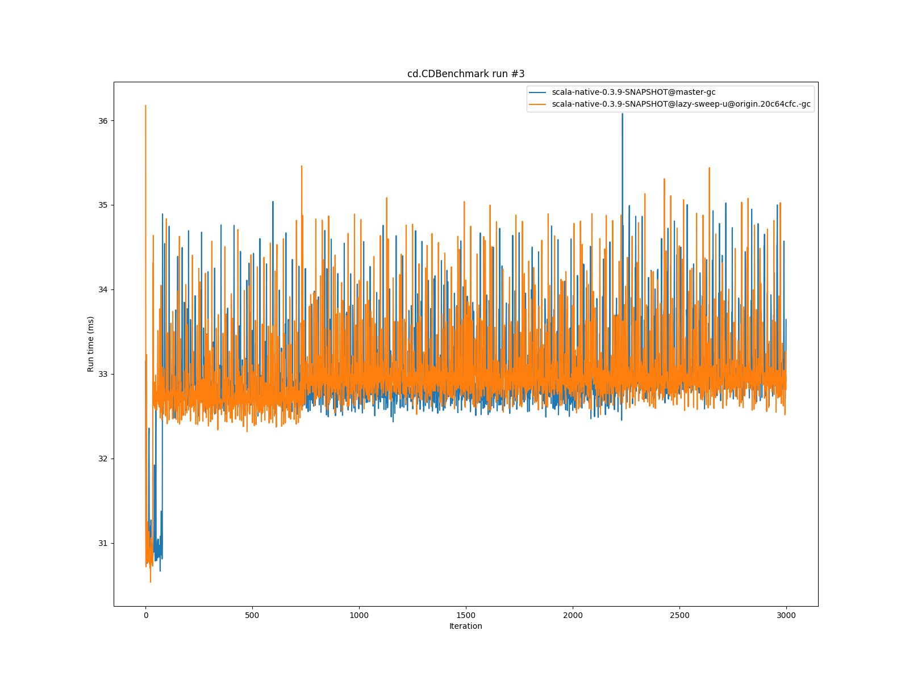
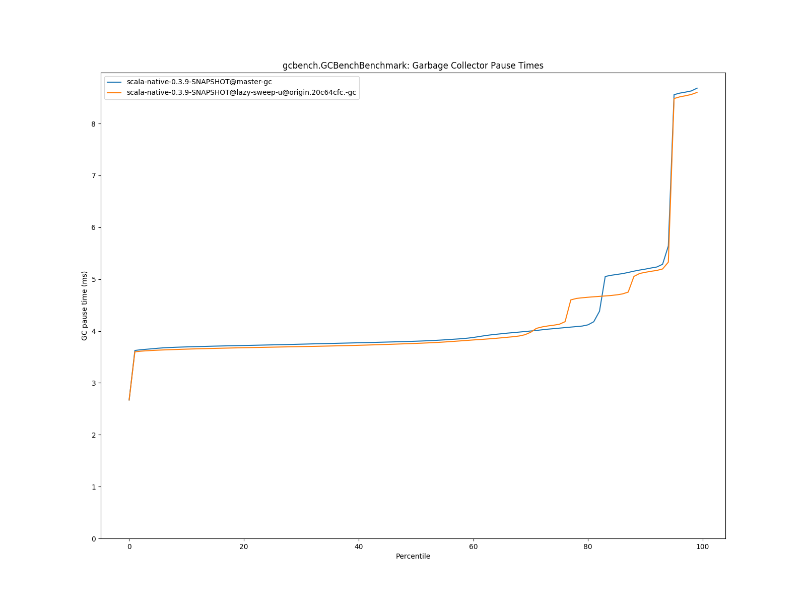
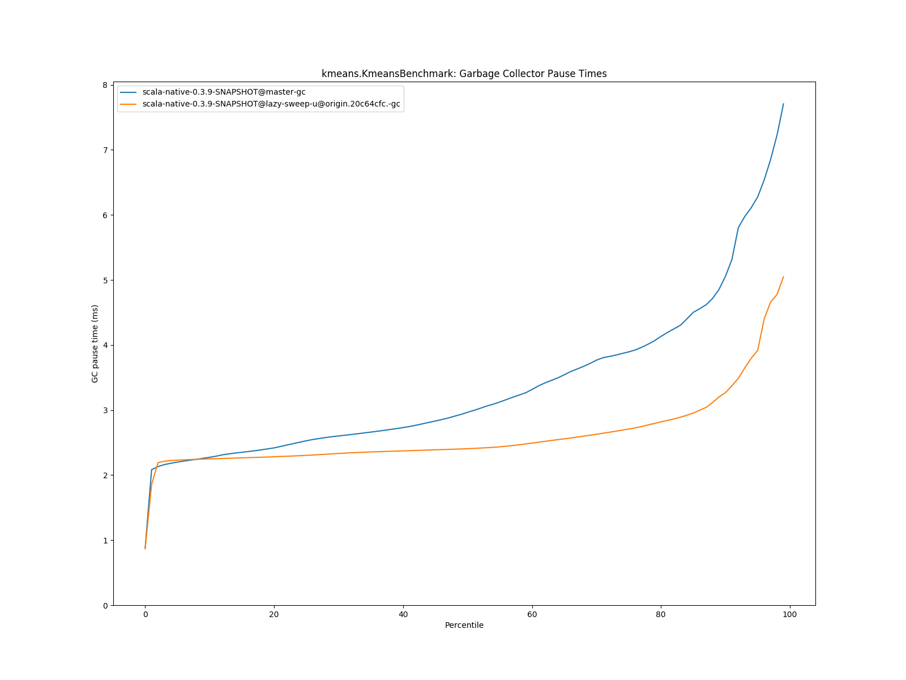
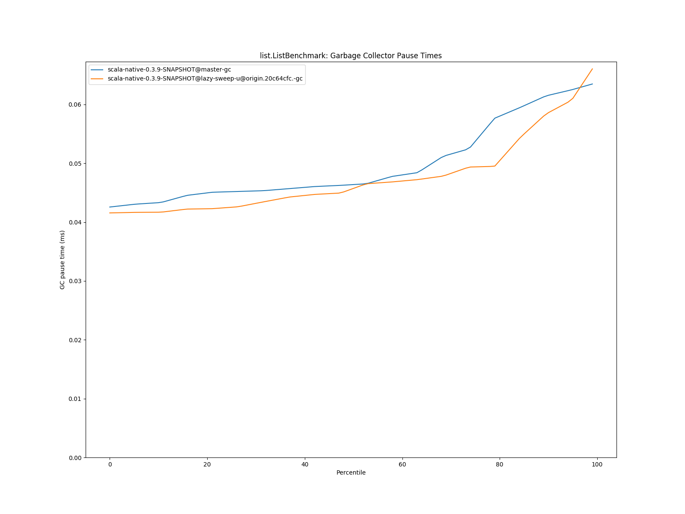
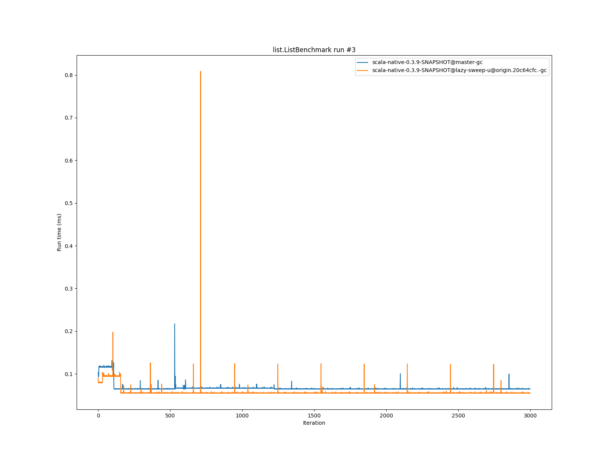

# Summary
## Benchmark run time (ms) at 50 percentile 

|name | scala-native-0.3.9-SNAPSHOT@master-gc | scala-native-0.3.9-SNAPSHOT@lazy-sweep-u@origin.20c64cfc.-gc | |
| -- | -- | -- | -- |
|[bounce.BounceBenchmark](#bouncebouncebenchmark)|0.0588|0.0541|__-8.08%__|
|[brainfuck.BrainfuckBenchmark](#brainfuckbrainfuckbenchmark)|3.3540|3.3959|+1.25%|
|[cd.CDBenchmark](#cdcdbenchmark)|32.8311|32.7846|__-0.14%__|
|[deltablue.DeltaBlueBenchmark](#deltabluedeltabluebenchmark)|0.1914|0.1803|__-5.77%__|
|[gcbench.GCBenchBenchmark](#gcbenchgcbenchbenchmark)|134.0681|134.1908|+0.09%|
|[json.JsonBenchmark](#jsonjsonbenchmark)|1.6341|1.6473|+0.81%|
|[kmeans.KmeansBenchmark](#kmeanskmeansbenchmark)|53.6443|53.1329|__-0.95%__|
|[list.ListBenchmark](#listlistbenchmark)|0.0643|0.0548|__-14.81%__|
|[mandelbrot.MandelbrotBenchmark](#mandelbrotmandelbrotbenchmark)|126.2417|126.2438|+0.00%|
|[nbody.NbodyBenchmark](#nbodynbodybenchmark)|39.4775|39.5996|+0.31%|
|[permute.PermuteBenchmark](#permutepermutebenchmark)|0.2039|0.2036|__-0.15%__|
|[queens.QueensBenchmark](#queensqueensbenchmark)|0.1137|0.1154|+1.48%|
|[richards.RichardsBenchmark](#richardsrichardsbenchmark)|0.0763|0.0761|__-0.33%__|
|[sudoku.SudokuBenchmark](#sudokusudokubenchmark)|2.4608|2.4033|__-2.33%__|
|[tracer.TracerBenchmark](#tracertracerbenchmark)|0.7505|0.7694|+2.51%|
| __Geometrical mean:__|| |__-1.85%__|
## Benchmark run time (ms) at 90 percentile 

|name | scala-native-0.3.9-SNAPSHOT@master-gc | scala-native-0.3.9-SNAPSHOT@lazy-sweep-u@origin.20c64cfc.-gc | |
| -- | -- | -- | -- |
|[bounce.BounceBenchmark](#bouncebouncebenchmark)|0.0595|0.0544|__-8.53%__|
|[brainfuck.BrainfuckBenchmark](#brainfuckbrainfuckbenchmark)|3.4431|3.4807|+1.09%|
|[cd.CDBenchmark](#cdcdbenchmark)|33.5115|33.4624|__-0.15%__|
|[deltablue.DeltaBlueBenchmark](#deltabluedeltabluebenchmark)|0.2002|0.1885|__-5.86%__|
|[gcbench.GCBenchBenchmark](#gcbenchgcbenchbenchmark)|137.3548|137.6260|+0.20%|
|[json.JsonBenchmark](#jsonjsonbenchmark)|1.6803|1.6805|+0.02%|
|[kmeans.KmeansBenchmark](#kmeanskmeansbenchmark)|56.2849|54.7135|__-2.79%__|
|[list.ListBenchmark](#listlistbenchmark)|0.0656|0.0562|__-14.32%__|
|[mandelbrot.MandelbrotBenchmark](#mandelbrotmandelbrotbenchmark)|127.1121|127.2542|+0.11%|
|[nbody.NbodyBenchmark](#nbodynbodybenchmark)|40.1422|40.2316|+0.22%|
|[permute.PermuteBenchmark](#permutepermutebenchmark)|0.2111|0.2118|+0.35%|
|[queens.QueensBenchmark](#queensqueensbenchmark)|0.1167|0.1175|+0.69%|
|[richards.RichardsBenchmark](#richardsrichardsbenchmark)|0.0785|0.0784|__-0.11%__|
|[sudoku.SudokuBenchmark](#sudokusudokubenchmark)|2.6719|2.6447|__-1.02%__|
|[tracer.TracerBenchmark](#tracertracerbenchmark)|0.7662|0.7926|+3.44%|
| __Geometrical mean:__|| |__-1.88%__|
## Benchmark run time (ms) at 99 percentile 

|name | scala-native-0.3.9-SNAPSHOT@master-gc | scala-native-0.3.9-SNAPSHOT@lazy-sweep-u@origin.20c64cfc.-gc | |
| -- | -- | -- | -- |
|[bounce.BounceBenchmark](#bouncebouncebenchmark)|0.0674|0.0576|__-14.54%__|
|[brainfuck.BrainfuckBenchmark](#brainfuckbrainfuckbenchmark)|3.5782|3.6332|+1.54%|
|[cd.CDBenchmark](#cdcdbenchmark)|34.6577|34.6858|+0.08%|
|[deltablue.DeltaBlueBenchmark](#deltabluedeltabluebenchmark)|0.2703|0.2601|__-3.77%__|
|[gcbench.GCBenchBenchmark](#gcbenchgcbenchbenchmark)|139.9987|139.0530|__-0.68%__|
|[json.JsonBenchmark](#jsonjsonbenchmark)|1.7565|1.7719|+0.88%|
|[kmeans.KmeansBenchmark](#kmeanskmeansbenchmark)|59.4711|56.5069|__-4.98%__|
|[list.ListBenchmark](#listlistbenchmark)|0.0733|0.0590|__-19.53%__|
|[mandelbrot.MandelbrotBenchmark](#mandelbrotmandelbrotbenchmark)|128.8094|128.9813|+0.13%|
|[nbody.NbodyBenchmark](#nbodynbodybenchmark)|41.3540|41.5073|+0.37%|
|[permute.PermuteBenchmark](#permutepermutebenchmark)|0.2459|0.2425|__-1.38%__|
|[queens.QueensBenchmark](#queensqueensbenchmark)|0.1345|0.1329|__-1.18%__|
|[richards.RichardsBenchmark](#richardsrichardsbenchmark)|0.0952|0.0941|__-1.25%__|
|[sudoku.SudokuBenchmark](#sudokusudokubenchmark)|2.8524|3.5360|+23.97%|
|[tracer.TracerBenchmark](#tracertracerbenchmark)|0.8347|0.8524|+2.11%|
| __Geometrical mean:__|| |__-1.61%__|
## Total GC time (ms) 

|name |  | scala-native-0.3.9-SNAPSHOT@master-gc | scala-native-0.3.9-SNAPSHOT@lazy-sweep-u@origin.20c64cfc.-gc | |
| -- | -- | -- | -- | -- |
|[bounce.BounceBenchmark](#bouncebouncebenchmark)|mark|2.0981|2.1248|+1.28%|
||sweep|1.5055|1.5051|__-0.02%__|
||total|3.6035|3.6300|+0.73%|
|[brainfuck.BrainfuckBenchmark](#brainfuckbrainfuckbenchmark)|mark|4249.6554|4371.3516|+2.86%|
||sweep|1104.3096|1138.3139|+3.08%|
||total|5353.9650|5509.6655|+2.91%|
|[cd.CDBenchmark](#cdcdbenchmark)|mark|19231.6357|19705.0030|+2.46%|
||sweep|17189.0062|17134.7619|__-0.32%__|
||total|36420.6419|36839.7649|+1.15%|
|[deltablue.DeltaBlueBenchmark](#deltabluedeltabluebenchmark)|mark|127.8300|107.6304|__-15.80%__|
||sweep|39.8346|39.5594|__-0.69%__|
||total|167.6645|147.1898|__-12.21%__|
|[gcbench.GCBenchBenchmark](#gcbenchgcbenchbenchmark)|mark|1971714.7835|1952061.5963|__-1.00%__|
||sweep|205181.6443|207361.7904|+1.06%|
||total|2176896.4279|2159423.3867|__-0.80%__|
|[json.JsonBenchmark](#jsonjsonbenchmark)|mark|1654.6457|1605.6372|__-2.96%__|
||sweep|522.8067|520.7062|__-0.40%__|
||total|2177.4524|2126.3434|__-2.35%__|
|[kmeans.KmeansBenchmark](#kmeanskmeansbenchmark)|mark|93632.3268|68144.7953|__-27.22%__|
||sweep|13061.2684|13442.4687|+2.92%|
||total|106693.5952|81587.2640|__-23.53%__|
|[list.ListBenchmark](#listlistbenchmark)|mark|0.6264|0.6015|__-3.97%__|
||sweep|0.3720|0.3560|__-4.30%__|
||total|0.9984|0.9575|__-4.09%__|
|[mandelbrot.MandelbrotBenchmark](#mandelbrotmandelbrotbenchmark)|mark|0.0000|0.0000|N/A|
||sweep|0.0000|0.0000|N/A|
||total|0.0000|0.0000|N/A|
|[nbody.NbodyBenchmark](#nbodynbodybenchmark)|mark|1591.4349|1594.1687|+0.17%|
||sweep|1686.2146|1690.1767|+0.23%|
||total|3277.6495|3284.3455|+0.20%|
|[permute.PermuteBenchmark](#permutepermutebenchmark)|mark|59.0019|59.3029|+0.51%|
||sweep|55.9604|54.3695|__-2.84%__|
||total|114.9624|113.6724|__-1.12%__|
|[queens.QueensBenchmark](#queensqueensbenchmark)|mark|3.7701|3.9513|+4.81%|
||sweep|2.6527|2.7408|+3.32%|
||total|6.4227|6.6921|+4.19%|
|[richards.RichardsBenchmark](#richardsrichardsbenchmark)|mark|5.5804|5.2095|__-6.65%__|
||sweep|4.3183|4.3812|+1.46%|
||total|9.8987|9.5907|__-3.11%__|
|[sudoku.SudokuBenchmark](#sudokusudokubenchmark)|mark|747.9854|805.3192|+7.67%|
||sweep|532.5128|530.2083|__-0.43%__|
||total|1280.4983|1335.5275|+4.30%|
|[tracer.TracerBenchmark](#tracertracerbenchmark)|mark|653.9944|650.9147|__-0.47%__|
||sweep|591.1863|581.4823|__-1.64%__|
||total|1245.1807|1232.3970|__-1.03%__|
|__Geometrical mean:__|mark|| |__-3.17%__|
||sweep|| |+0.08%|
||total|| |__-2.77%__|
## GC pause time (ms) at 50 percentile 

|name | scala-native-0.3.9-SNAPSHOT@master-gc | scala-native-0.3.9-SNAPSHOT@lazy-sweep-u@origin.20c64cfc.-gc | |
| -- | -- | -- | -- |
|[bounce.BounceBenchmark](#bouncebouncebenchmark)|0.0331|0.0326|__-1.49%__|
|[brainfuck.BrainfuckBenchmark](#brainfuckbrainfuckbenchmark)|0.0691|0.0696|+0.65%|
|[cd.CDBenchmark](#cdcdbenchmark)|0.1445|0.1460|+1.01%|
|[deltablue.DeltaBlueBenchmark](#deltabluedeltabluebenchmark)|0.0608|0.0576|__-5.24%__|
|[gcbench.GCBenchBenchmark](#gcbenchgcbenchbenchmark)|3.8029|3.7610|__-1.10%__|
|[json.JsonBenchmark](#jsonjsonbenchmark)|0.0714|0.0699|__-2.06%__|
|[kmeans.KmeansBenchmark](#kmeanskmeansbenchmark)|2.9652|2.4059|__-18.86%__|
|[list.ListBenchmark](#listlistbenchmark)|0.0464|0.0457|__-1.40%__|
|[mandelbrot.MandelbrotBenchmark](#mandelbrotmandelbrotbenchmark)|0.0000|0.0000|N/A|
|[nbody.NbodyBenchmark](#nbodynbodybenchmark)|0.0265|0.0268|+1.07%|
|[permute.PermuteBenchmark](#permutepermutebenchmark)|0.0280|0.0281|+0.25%|
|[queens.QueensBenchmark](#queensqueensbenchmark)|0.0332|0.0344|+3.84%|
|[richards.RichardsBenchmark](#richardsrichardsbenchmark)|0.0309|0.0298|__-3.45%__|
|[sudoku.SudokuBenchmark](#sudokusudokubenchmark)|0.2050|0.2141|+4.45%|
|[tracer.TracerBenchmark](#tracertracerbenchmark)|0.0295|0.0295|__-0.11%__|
| __Geometrical mean:__|| |__-1.76%__|
## GC pause time (ms) at 90 percentile 

|name | scala-native-0.3.9-SNAPSHOT@master-gc | scala-native-0.3.9-SNAPSHOT@lazy-sweep-u@origin.20c64cfc.-gc | |
| -- | -- | -- | -- |
|[bounce.BounceBenchmark](#bouncebouncebenchmark)|0.0454|0.0463|+1.82%|
|[brainfuck.BrainfuckBenchmark](#brainfuckbrainfuckbenchmark)|0.1092|0.1084|__-0.67%__|
|[cd.CDBenchmark](#cdcdbenchmark)|0.1881|0.2099|+11.60%|
|[deltablue.DeltaBlueBenchmark](#deltabluedeltabluebenchmark)|0.0776|0.0752|__-3.19%__|
|[gcbench.GCBenchBenchmark](#gcbenchgcbenchbenchmark)|5.1933|5.1316|__-1.19%__|
|[json.JsonBenchmark](#jsonjsonbenchmark)|0.0754|0.0735|__-2.63%__|
|[kmeans.KmeansBenchmark](#kmeanskmeansbenchmark)|5.0564|3.2681|__-35.37%__|
|[list.ListBenchmark](#listlistbenchmark)|0.0616|0.0586|__-4.79%__|
|[mandelbrot.MandelbrotBenchmark](#mandelbrotmandelbrotbenchmark)|0.0000|0.0000|N/A|
|[nbody.NbodyBenchmark](#nbodynbodybenchmark)|0.0307|0.0307|__-0.01%__|
|[permute.PermuteBenchmark](#permutepermutebenchmark)|0.0305|0.0313|+2.72%|
|[queens.QueensBenchmark](#queensqueensbenchmark)|0.0456|0.0474|+3.94%|
|[richards.RichardsBenchmark](#richardsrichardsbenchmark)|0.0422|0.0412|__-2.31%__|
|[sudoku.SudokuBenchmark](#sudokusudokubenchmark)|0.2299|0.2412|+4.93%|
|[tracer.TracerBenchmark](#tracertracerbenchmark)|0.0316|0.0316|+0.08%|
| __Geometrical mean:__|| |__-2.43%__|
## GC pause time (ms) at 99 percentile 

|name | scala-native-0.3.9-SNAPSHOT@master-gc | scala-native-0.3.9-SNAPSHOT@lazy-sweep-u@origin.20c64cfc.-gc | |
| -- | -- | -- | -- |
|[bounce.BounceBenchmark](#bouncebouncebenchmark)|0.0605|0.0593|__-1.92%__|
|[brainfuck.BrainfuckBenchmark](#brainfuckbrainfuckbenchmark)|0.1331|0.1444|+8.54%|
|[cd.CDBenchmark](#cdcdbenchmark)|0.2628|0.2751|+4.68%|
|[deltablue.DeltaBlueBenchmark](#deltabluedeltabluebenchmark)|0.1035|0.0946|__-8.62%__|
|[gcbench.GCBenchBenchmark](#gcbenchgcbenchbenchmark)|8.6813|8.5992|__-0.95%__|
|[json.JsonBenchmark](#jsonjsonbenchmark)|0.1009|0.0990|__-1.88%__|
|[kmeans.KmeansBenchmark](#kmeanskmeansbenchmark)|7.7074|5.0484|__-34.50%__|
|[list.ListBenchmark](#listlistbenchmark)|0.0635|0.0661|+4.04%|
|[mandelbrot.MandelbrotBenchmark](#mandelbrotmandelbrotbenchmark)|0.0000|0.0000|N/A|
|[nbody.NbodyBenchmark](#nbodynbodybenchmark)|0.0520|0.0543|+4.34%|
|[permute.PermuteBenchmark](#permutepermutebenchmark)|0.0512|0.0487|__-5.02%__|
|[queens.QueensBenchmark](#queensqueensbenchmark)|0.0612|0.0618|+1.01%|
|[richards.RichardsBenchmark](#richardsrichardsbenchmark)|0.0581|0.0604|+3.87%|
|[sudoku.SudokuBenchmark](#sudokusudokubenchmark)|0.2813|0.2947|+4.74%|
|[tracer.TracerBenchmark](#tracertracerbenchmark)|0.0395|0.0371|__-6.09%__|
| __Geometrical mean:__|| |__-2.62%__|
# Individual benchmarks
## bounce.BounceBenchmark

## brainfuck.BrainfuckBenchmark

## cd.CDBenchmark

## deltablue.DeltaBlueBenchmark

## gcbench.GCBenchBenchmark

## json.JsonBenchmark

## kmeans.KmeansBenchmark

## list.ListBenchmark

## mandelbrot.MandelbrotBenchmark

## nbody.NbodyBenchmark

## permute.PermuteBenchmark

## queens.QueensBenchmark

## richards.RichardsBenchmark

## sudoku.SudokuBenchmark

## tracer.TracerBenchmark

