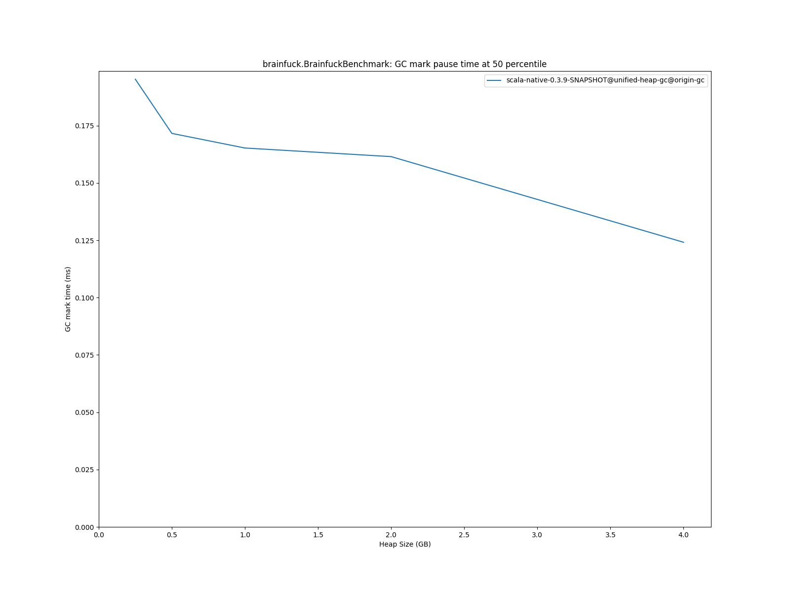
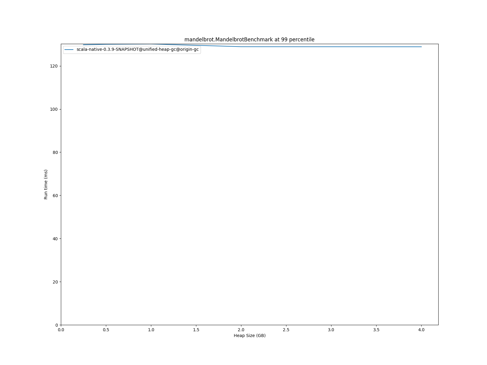

# Summary
## Benchmark run time (ms) at 50 percentile 

|name | scala-native-0.3.9-SNAPSHOT@unified-heap-gc@origin-gc/size_256m-256m | scala-native-0.3.9-SNAPSHOT@unified-heap-gc@origin-gc/size_512m-512m |  | scala-native-0.3.9-SNAPSHOT@unified-heap-gc@origin-gc/size_1g-1g |  | scala-native-0.3.9-SNAPSHOT@unified-heap-gc@origin-gc/size_2g-2g |  | scala-native-0.3.9-SNAPSHOT@unified-heap-gc@origin-gc/size_4g-4g | |
| -- | -- | -- | -- | -- | -- | -- | -- | -- | -- |
|[bounce.BounceBenchmark](#bouncebouncebenchmark)|0.0562|0.0542|__-3.66%__|0.0553|__-1.60%__|0.0542|__-3.59%__|0.0573|+1.89%|
|[brainfuck.BrainfuckBenchmark](#brainfuckbrainfuckbenchmark)|3.4834|3.4097|__-2.12%__|3.4118|__-2.06%__|3.3633|__-3.45%__|3.3377|__-4.18%__|
|[cd.CDBenchmark](#cdcdbenchmark)|32.2345|30.9515|__-3.98%__|30.6331|__-4.97%__|30.8588|__-4.27%__|30.8384|__-4.33%__|
|[deltablue.DeltaBlueBenchmark](#deltabluedeltabluebenchmark)|0.1891|0.2433|+28.65%|0.2408|+27.32%|0.2356|+24.56%|0.2409|+27.36%|
|[gcbench.GCBenchBenchmark](#gcbenchgcbenchbenchmark)|104.0151|106.3089|+2.21%|106.9537|+2.83%|97.2410|__-6.51%__|98.5240|__-5.28%__|
|[json.JsonBenchmark](#jsonjsonbenchmark)|1.6063|1.5937|__-0.79%__|1.7058|+6.19%|1.6161|+0.61%|1.6178|+0.71%|
|[kmeans.KmeansBenchmark](#kmeanskmeansbenchmark)|52.0428|51.7727|__-0.52%__|51.9763|__-0.13%__|51.8850|__-0.30%__|51.4977|__-1.05%__|
|[list.ListBenchmark](#listlistbenchmark)|0.0581|0.0615|+5.71%|0.0615|+5.81%|0.0612|+5.34%|0.0611|+5.08%|
|[mandelbrot.MandelbrotBenchmark](#mandelbrotmandelbrotbenchmark)|126.1955|126.1834|__-0.01%__|126.2500|+0.04%|126.2813|+0.07%|126.2357|+0.03%|
|[nbody.NbodyBenchmark](#nbodynbodybenchmark)|38.0338|37.9890|__-0.12%__|38.0356|+0.00%|38.0717|+0.10%|38.0811|+0.12%|
|[permute.PermuteBenchmark](#permutepermutebenchmark)|0.2058|0.2057|__-0.05%__|0.2758|+33.97%|0.2796|+35.84%|0.2929|+42.28%|
|[queens.QueensBenchmark](#queensqueensbenchmark)|0.1211|0.1217|+0.47%|0.1233|+1.81%|0.1213|+0.18%|0.1216|+0.44%|
|[richards.RichardsBenchmark](#richardsrichardsbenchmark)|0.0812|0.0807|__-0.65%__|0.0816|+0.56%|0.0887|+9.25%|0.0822|+1.28%|
|[sudoku.SudokuBenchmark](#sudokusudokubenchmark)|2.4515|2.3733|__-3.19%__|2.4203|__-1.27%__|2.4356|__-0.65%__|2.4934|+1.71%|
|[tracer.TracerBenchmark](#tracertracerbenchmark)|0.8121|0.8194|+0.91%|0.8188|+0.82%|0.8129|+0.10%|0.8016|__-1.29%__|
| __Geometrical mean:__|| |+1.27%| |+4.14%| |+3.28%| |+3.67%|
## Benchmark run time (ms) at 90 percentile 

|name | scala-native-0.3.9-SNAPSHOT@unified-heap-gc@origin-gc/size_256m-256m | scala-native-0.3.9-SNAPSHOT@unified-heap-gc@origin-gc/size_512m-512m |  | scala-native-0.3.9-SNAPSHOT@unified-heap-gc@origin-gc/size_1g-1g |  | scala-native-0.3.9-SNAPSHOT@unified-heap-gc@origin-gc/size_2g-2g |  | scala-native-0.3.9-SNAPSHOT@unified-heap-gc@origin-gc/size_4g-4g | |
| -- | -- | -- | -- | -- | -- | -- | -- | -- | -- |
|[bounce.BounceBenchmark](#bouncebouncebenchmark)|0.0579|0.0557|__-3.81%__|0.0567|__-2.03%__|0.0560|__-3.38%__|0.0587|+1.31%|
|[brainfuck.BrainfuckBenchmark](#brainfuckbrainfuckbenchmark)|3.5865|3.4992|__-2.43%__|3.5102|__-2.13%__|3.4638|__-3.42%__|3.4388|__-4.12%__|
|[cd.CDBenchmark](#cdcdbenchmark)|34.2771|34.7072|+1.25%|31.5070|__-8.08%__|31.4831|__-8.15%__|31.4397|__-8.28%__|
|[deltablue.DeltaBlueBenchmark](#deltabluedeltabluebenchmark)|0.1995|0.2510|+25.83%|0.2458|+23.19%|0.2414|+20.98%|0.2464|+23.51%|
|[gcbench.GCBenchBenchmark](#gcbenchgcbenchbenchmark)|105.1932|107.7157|+2.40%|115.2136|+9.53%|116.6951|+10.93%|132.1988|+25.67%|
|[json.JsonBenchmark](#jsonjsonbenchmark)|1.6499|1.6346|__-0.93%__|1.7523|+6.20%|1.6865|+2.22%|2.0433|+23.84%|
|[kmeans.KmeansBenchmark](#kmeanskmeansbenchmark)|55.2823|53.1581|__-3.84%__|53.2907|__-3.60%__|52.7453|__-4.59%__|52.3487|__-5.31%__|
|[list.ListBenchmark](#listlistbenchmark)|0.0597|0.0627|+5.07%|0.0628|+5.22%|0.0625|+4.79%|0.0622|+4.22%|
|[mandelbrot.MandelbrotBenchmark](#mandelbrotmandelbrotbenchmark)|127.4384|127.5655|+0.10%|127.7862|+0.27%|127.2203|__-0.17%__|127.1476|__-0.23%__|
|[nbody.NbodyBenchmark](#nbodynbodybenchmark)|39.0915|39.0272|__-0.16%__|39.0627|__-0.07%__|38.8373|__-0.65%__|38.8115|__-0.72%__|
|[permute.PermuteBenchmark](#permutepermutebenchmark)|0.2120|0.2089|__-1.48%__|0.2822|+33.13%|0.2853|+34.57%|0.3000|+41.53%|
|[queens.QueensBenchmark](#queensqueensbenchmark)|0.1248|0.1244|__-0.34%__|0.1255|+0.55%|0.1244|__-0.33%__|0.1252|+0.27%|
|[richards.RichardsBenchmark](#richardsrichardsbenchmark)|0.0842|0.0837|__-0.60%__|0.0840|__-0.22%__|0.0917|+8.88%|0.0854|+1.41%|
|[sudoku.SudokuBenchmark](#sudokusudokubenchmark)|2.5292|2.4838|__-1.80%__|2.5087|__-0.81%__|2.5273|__-0.07%__|2.7476|+8.63%|
|[tracer.TracerBenchmark](#tracertracerbenchmark)|0.8277|0.8397|+1.45%|0.8393|+1.40%|0.8433|+1.88%|0.8459|+2.20%|
| __Geometrical mean:__|| |+1.17%| |+3.70%| |+3.74%| |+6.78%|
## Benchmark run time (ms) at 99 percentile 

|name | scala-native-0.3.9-SNAPSHOT@unified-heap-gc@origin-gc/size_256m-256m | scala-native-0.3.9-SNAPSHOT@unified-heap-gc@origin-gc/size_512m-512m |  | scala-native-0.3.9-SNAPSHOT@unified-heap-gc@origin-gc/size_1g-1g |  | scala-native-0.3.9-SNAPSHOT@unified-heap-gc@origin-gc/size_2g-2g |  | scala-native-0.3.9-SNAPSHOT@unified-heap-gc@origin-gc/size_4g-4g | |
| -- | -- | -- | -- | -- | -- | -- | -- | -- | -- |
|[bounce.BounceBenchmark](#bouncebouncebenchmark)|0.0605|0.0582|__-3.92%__|0.0592|__-2.19%__|0.0591|__-2.42%__|0.0613|+1.27%|
|[brainfuck.BrainfuckBenchmark](#brainfuckbrainfuckbenchmark)|5.5460|3.6646|__-33.92%__|3.6286|__-34.57%__|3.6315|__-34.52%__|3.5721|__-35.59%__|
|[cd.CDBenchmark](#cdcdbenchmark)|35.0692|36.0748|+2.87%|39.3051|+12.08%|46.4895|+32.57%|61.4375|+75.19%|
|[deltablue.DeltaBlueBenchmark](#deltabluedeltabluebenchmark)|0.2183|0.2779|+27.28%|0.2597|+18.97%|0.2736|+25.31%|0.2650|+21.38%|
|[gcbench.GCBenchBenchmark](#gcbenchgcbenchbenchmark)|106.0931|108.8856|+2.63%|116.8551|+10.14%|122.0468|+15.04%|137.9347|+30.01%|
|[json.JsonBenchmark](#jsonjsonbenchmark)|1.7633|1.6882|__-4.26%__|1.8444|+4.60%|2.0052|+13.72%|2.1095|+19.64%|
|[kmeans.KmeansBenchmark](#kmeanskmeansbenchmark)|58.0660|57.7265|__-0.58%__|61.3493|+5.65%|66.4866|+14.50%|53.9419|__-7.10%__|
|[list.ListBenchmark](#listlistbenchmark)|0.0628|0.0647|+2.98%|0.0647|+3.02%|0.0671|+6.81%|0.0646|+2.90%|
|[mandelbrot.MandelbrotBenchmark](#mandelbrotmandelbrotbenchmark)|129.8025|130.0224|+0.17%|130.1722|+0.28%|128.9023|__-0.69%__|128.8588|__-0.73%__|
|[nbody.NbodyBenchmark](#nbodynbodybenchmark)|40.4085|41.8326|+3.52%|40.5333|+0.31%|40.0434|__-0.90%__|40.0105|__-0.98%__|
|[permute.PermuteBenchmark](#permutepermutebenchmark)|0.2275|0.2182|__-4.08%__|0.2992|+31.52%|0.3155|+38.68%|0.3367|+47.98%|
|[queens.QueensBenchmark](#queensqueensbenchmark)|0.1309|0.1301|__-0.64%__|0.1332|+1.78%|0.1317|+0.62%|0.1402|+7.10%|
|[richards.RichardsBenchmark](#richardsrichardsbenchmark)|0.0914|0.0906|__-0.92%__|0.0914|__-0.03%__|0.1023|+11.90%|0.0949|+3.86%|
|[sudoku.SudokuBenchmark](#sudokusudokubenchmark)|2.6449|2.6255|__-0.74%__|2.6102|__-1.31%__|2.6491|+0.16%|2.9185|+10.35%|
|[tracer.TracerBenchmark](#tracertracerbenchmark)|2.7062|0.9311|__-65.59%__|0.9339|__-65.49%__|0.9141|__-66.22%__|0.9033|__-66.62%__|
| __Geometrical mean:__|| |__-8.14%__| |__-4.64%__| |__-0.83%__| |+1.38%|
## Total GC time (ms) 

|name |  | scala-native-0.3.9-SNAPSHOT@unified-heap-gc@origin-gc/size_256m-256m | scala-native-0.3.9-SNAPSHOT@unified-heap-gc@origin-gc/size_512m-512m |  | scala-native-0.3.9-SNAPSHOT@unified-heap-gc@origin-gc/size_1g-1g |  | scala-native-0.3.9-SNAPSHOT@unified-heap-gc@origin-gc/size_2g-2g |  | scala-native-0.3.9-SNAPSHOT@unified-heap-gc@origin-gc/size_4g-4g | |
| -- | -- | -- | -- | -- | -- | -- | -- | -- | -- | -- |
|[bounce.BounceBenchmark](#bouncebouncebenchmark)|mark|0.0000|0.0000|N/A|0.0000|N/A|0.0000|N/A|0.0000|N/A|
||sweep|0.0000|0.0000|N/A|0.0000|N/A|0.0000|N/A|0.0000|N/A|
||total|0.0000|0.0000|N/A|0.0000|N/A|0.0000|N/A|0.0000|N/A|
|[brainfuck.BrainfuckBenchmark](#brainfuckbrainfuckbenchmark)|mark|154.1733|71.2687|__-53.77%__|31.3865|__-79.64%__|15.0550|__-90.24%__|4.9862|__-96.77%__|
||sweep|1641.4968|1664.6684|+1.41%|1661.1799|+1.20%|1488.1515|__-9.34%__|1191.3210|__-27.42%__|
||total|1795.6702|1735.9371|__-3.33%__|1692.5664|__-5.74%__|1503.2065|__-16.29%__|1196.3072|__-33.38%__|
|[cd.CDBenchmark](#cdcdbenchmark)|mark|1286.1767|686.0004|__-46.66%__|347.5082|__-72.98%__|189.4225|__-85.27%__|98.6092|__-92.33%__|
||sweep|29381.5504|29573.9041|+0.65%|29335.5553|__-0.16%__|29050.3106|__-1.13%__|28601.1608|__-2.66%__|
||total|30667.7271|30259.9045|__-1.33%__|29683.0635|__-3.21%__|29239.7331|__-4.66%__|28699.7700|__-6.42%__|
|[deltablue.DeltaBlueBenchmark](#deltabluedeltabluebenchmark)|mark|2.1975|0.9050|__-58.82%__|0.0000|__-100.00%__|0.0000|__-100.00%__|0.0000|__-100.00%__|
||sweep|76.9700|78.0212|+1.37%|0.0000|__-100.00%__|0.0000|__-100.00%__|0.0000|__-100.00%__|
||total|79.1675|78.9261|__-0.30%__|0.0000|__-100.00%__|0.0000|__-100.00%__|0.0000|__-100.00%__|
|[gcbench.GCBenchBenchmark](#gcbenchgcbenchbenchmark)|mark|218337.4739|331436.1021|+51.80%|275968.5591|+26.40%|65948.1694|__-69.80%__|30011.2550|__-86.25%__|
||sweep|224626.5396|230689.2559|+2.70%|229694.6160|+2.26%|224182.5993|__-0.20%__|212615.4766|__-5.35%__|
||total|442964.0135|562125.3580|+26.90%|505663.1751|+14.15%|290130.7687|__-34.50%__|242626.7316|__-45.23%__|
|[json.JsonBenchmark](#jsonjsonbenchmark)|mark|39.4199|37.6285|__-4.54%__|13.7392|__-65.15%__|5.4077|__-86.28%__|0.8550|__-97.83%__|
||sweep|791.2022|765.6928|__-3.22%__|776.1874|__-1.90%__|609.5942|__-22.95%__|608.5586|__-23.08%__|
||total|830.6221|803.3213|__-3.29%__|789.9266|__-4.90%__|615.0019|__-25.96%__|609.4136|__-26.63%__|
|[kmeans.KmeansBenchmark](#kmeanskmeansbenchmark)|mark|19661.1882|6938.5353|__-64.71%__|4558.6455|__-76.81%__|2403.3954|__-87.78%__|1333.1557|__-93.22%__|
||sweep|11340.6545|11185.4206|__-1.37%__|11073.2909|__-2.36%__|10980.3949|__-3.18%__|10705.6286|__-5.60%__|
||total|31001.8427|18123.9559|__-41.54%__|15631.9364|__-49.58%__|13383.7903|__-56.83%__|12038.7843|__-61.17%__|
|[list.ListBenchmark](#listlistbenchmark)|mark|0.0000|0.0000|N/A|0.0000|N/A|0.0000|N/A|0.0000|N/A|
||sweep|0.0000|0.0000|N/A|0.0000|N/A|0.0000|N/A|0.0000|N/A|
||total|0.0000|0.0000|N/A|0.0000|N/A|0.0000|N/A|0.0000|N/A|
|[mandelbrot.MandelbrotBenchmark](#mandelbrotmandelbrotbenchmark)|mark|0.0000|0.0000|N/A|0.0000|N/A|0.0000|N/A|0.0000|N/A|
||sweep|0.0000|0.0000|N/A|0.0000|N/A|0.0000|N/A|0.0000|N/A|
||total|0.0000|0.0000|N/A|0.0000|N/A|0.0000|N/A|0.0000|N/A|
|[nbody.NbodyBenchmark](#nbodynbodybenchmark)|mark|50.7986|28.0683|__-44.75%__|14.3199|__-71.81%__|7.8967|__-84.45%__|3.7505|__-92.62%__|
||sweep|3593.7943|3608.3237|+0.40%|3536.9567|__-1.58%__|3354.8157|__-6.65%__|3055.2400|__-14.99%__|
||total|3644.5928|3636.3920|__-0.23%__|3551.2766|__-2.56%__|3362.7124|__-7.73%__|3058.9904|__-16.07%__|
|[permute.PermuteBenchmark](#permutepermutebenchmark)|mark|1.9025|0.7254|__-61.87%__|0.0000|__-100.00%__|0.0000|__-100.00%__|0.0000|__-100.00%__|
||sweep|111.4508|76.3760|__-31.47%__|0.0000|__-100.00%__|0.0000|__-100.00%__|0.0000|__-100.00%__|
||total|113.3533|77.1014|__-31.98%__|0.0000|__-100.00%__|0.0000|__-100.00%__|0.0000|__-100.00%__|
|[queens.QueensBenchmark](#queensqueensbenchmark)|mark|0.0000|0.0000|N/A|0.0000|N/A|0.0000|N/A|0.0000|N/A|
||sweep|0.0000|0.0000|N/A|0.0000|N/A|0.0000|N/A|0.0000|N/A|
||total|0.0000|0.0000|N/A|0.0000|N/A|0.0000|N/A|0.0000|N/A|
|[richards.RichardsBenchmark](#richardsrichardsbenchmark)|mark|0.0000|0.0000|N/A|0.0000|N/A|0.0000|N/A|0.0000|N/A|
||sweep|0.0000|0.0000|N/A|0.0000|N/A|0.0000|N/A|0.0000|N/A|
||total|0.0000|0.0000|N/A|0.0000|N/A|0.0000|N/A|0.0000|N/A|
|[sudoku.SudokuBenchmark](#sudokusudokubenchmark)|mark|57.3811|26.3768|__-54.03%__|11.7365|__-79.55%__|5.8794|__-89.75%__|3.0224|__-94.73%__|
||sweep|726.8377|700.6571|__-3.60%__|617.1370|__-15.09%__|611.1469|__-15.92%__|614.0309|__-15.52%__|
||total|784.2187|727.0339|__-7.29%__|628.8735|__-19.81%__|617.0263|__-21.32%__|617.0533|__-21.32%__|
|[tracer.TracerBenchmark](#tracertracerbenchmark)|mark|23.3416|11.5113|__-50.68%__|6.0993|__-73.87%__|3.4648|__-85.16%__|1.7579|__-92.47%__|
||sweep|1242.8082|1219.6764|__-1.86%__|1239.6967|__-0.25%__|1220.0556|__-1.83%__|1229.4351|__-1.08%__|
||total|1266.1498|1231.1877|__-2.76%__|1245.7961|__-1.61%__|1223.5203|__-3.37%__|1231.1930|__-2.76%__|
|__Geometrical mean:__|mark|| |__-45.12%__| |__-69.03%__| |__-85.73%__| |__-94.10%__|
||sweep|| |__-4.07%__| |__-2.38%__| |__-7.98%__| |__-12.46%__|
||total|| |__-8.37%__| |__-11.28%__| |__-23.51%__| |__-29.29%__|
## GC pause time (ms) at 50 percentile 

|name | scala-native-0.3.9-SNAPSHOT@unified-heap-gc@origin-gc/size_256m-256m | scala-native-0.3.9-SNAPSHOT@unified-heap-gc@origin-gc/size_512m-512m |  | scala-native-0.3.9-SNAPSHOT@unified-heap-gc@origin-gc/size_1g-1g |  | scala-native-0.3.9-SNAPSHOT@unified-heap-gc@origin-gc/size_2g-2g |  | scala-native-0.3.9-SNAPSHOT@unified-heap-gc@origin-gc/size_4g-4g | |
| -- | -- | -- | -- | -- | -- | -- | -- | -- | -- |
|[bounce.BounceBenchmark](#bouncebouncebenchmark)|0.0000|0.0000|N/A|0.0000|N/A|0.0000|N/A|0.0000|N/A|
|[brainfuck.BrainfuckBenchmark](#brainfuckbrainfuckbenchmark)|2.0477|3.9445|+92.63%|7.6859|+275.34%|15.0033|+632.68%|29.7888|+1354.72%|
|[cd.CDBenchmark](#cdcdbenchmark)|2.0081|3.9623|+97.32%|7.7842|+287.64%|15.3495|+664.39%|30.5251|+1420.11%|
|[deltablue.DeltaBlueBenchmark](#deltabluedeltabluebenchmark)|1.9775|3.9425|+99.37%|0.0000|__-100.00%__|0.0000|__-100.00%__|0.0000|__-100.00%__|
|[gcbench.GCBenchBenchmark](#gcbenchgcbenchbenchmark)|3.9074|9.4100|+140.82%|17.0411|+336.12%|18.7285|+379.30%|33.8676|+766.75%|
|[json.JsonBenchmark](#jsonjsonbenchmark)|1.9713|4.0070|+103.27%|7.8815|+299.82%|15.3705|+679.72%|30.5219|+1448.33%|
|[kmeans.KmeansBenchmark](#kmeanskmeansbenchmark)|4.2189|4.9500|+17.33%|8.6167|+104.24%|14.8679|+252.41%|27.2187|+545.16%|
|[list.ListBenchmark](#listlistbenchmark)|0.0000|0.0000|N/A|0.0000|N/A|0.0000|N/A|0.0000|N/A|
|[mandelbrot.MandelbrotBenchmark](#mandelbrotmandelbrotbenchmark)|0.0000|0.0000|N/A|0.0000|N/A|0.0000|N/A|0.0000|N/A|
|[nbody.NbodyBenchmark](#nbodynbodybenchmark)|1.9098|3.8648|+102.37%|7.7030|+303.35%|15.2699|+699.57%|30.5733|+1500.89%|
|[permute.PermuteBenchmark](#permutepermutebenchmark)|1.8931|3.8819|+105.06%|0.0000|__-100.00%__|0.0000|__-100.00%__|0.0000|__-100.00%__|
|[queens.QueensBenchmark](#queensqueensbenchmark)|0.0000|0.0000|N/A|0.0000|N/A|0.0000|N/A|0.0000|N/A|
|[richards.RichardsBenchmark](#richardsrichardsbenchmark)|0.0000|0.0000|N/A|0.0000|N/A|0.0000|N/A|0.0000|N/A|
|[sudoku.SudokuBenchmark](#sudokusudokubenchmark)|2.0559|4.0150|+95.29%|7.8402|+281.35%|15.3912|+648.63%|30.5916|+1387.98%|
|[tracer.TracerBenchmark](#tracertracerbenchmark)|1.9069|3.8318|+100.95%|7.7664|+307.29%|15.2627|+700.41%|30.7107|+1510.53%|
| __Geometrical mean:__|| |+92.78%| |+266.37%| |+558.47%| |+1183.07%|
## GC pause time (ms) at 90 percentile 

|name | scala-native-0.3.9-SNAPSHOT@unified-heap-gc@origin-gc/size_256m-256m | scala-native-0.3.9-SNAPSHOT@unified-heap-gc@origin-gc/size_512m-512m |  | scala-native-0.3.9-SNAPSHOT@unified-heap-gc@origin-gc/size_1g-1g |  | scala-native-0.3.9-SNAPSHOT@unified-heap-gc@origin-gc/size_2g-2g |  | scala-native-0.3.9-SNAPSHOT@unified-heap-gc@origin-gc/size_4g-4g | |
| -- | -- | -- | -- | -- | -- | -- | -- | -- | -- |
|[bounce.BounceBenchmark](#bouncebouncebenchmark)|0.0000|0.0000|N/A|0.0000|N/A|0.0000|N/A|0.0000|N/A|
|[brainfuck.BrainfuckBenchmark](#brainfuckbrainfuckbenchmark)|2.1109|4.0149|+90.20%|7.7954|+269.29%|15.1355|+617.01%|30.2219|+1331.69%|
|[cd.CDBenchmark](#cdcdbenchmark)|2.0620|4.0653|+97.16%|7.9076|+283.49%|15.5185|+652.59%|30.7875|+1393.09%|
|[deltablue.DeltaBlueBenchmark](#deltabluedeltabluebenchmark)|2.0378|4.0172|+97.14%|0.0000|__-100.00%__|0.0000|__-100.00%__|0.0000|__-100.00%__|
|[gcbench.GCBenchBenchmark](#gcbenchgcbenchbenchmark)|5.4654|9.5466|+74.67%|17.2489|+215.60%|22.5312|+312.25%|38.8464|+610.77%|
|[json.JsonBenchmark](#jsonjsonbenchmark)|2.0029|4.0652|+102.96%|8.0372|+301.27%|15.5318|+675.45%|30.6388|+1429.68%|
|[kmeans.KmeansBenchmark](#kmeanskmeansbenchmark)|5.2695|5.8248|+10.54%|9.6894|+83.88%|15.7959|+199.76%|29.3912|+457.76%|
|[list.ListBenchmark](#listlistbenchmark)|0.0000|0.0000|N/A|0.0000|N/A|0.0000|N/A|0.0000|N/A|
|[mandelbrot.MandelbrotBenchmark](#mandelbrotmandelbrotbenchmark)|0.0000|0.0000|N/A|0.0000|N/A|0.0000|N/A|0.0000|N/A|
|[nbody.NbodyBenchmark](#nbodynbodybenchmark)|1.9587|3.9115|+99.70%|7.7902|+297.71%|15.4100|+686.73%|30.8534|+1475.17%|
|[permute.PermuteBenchmark](#permutepermutebenchmark)|1.9295|3.9414|+104.27%|0.0000|__-100.00%__|0.0000|__-100.00%__|0.0000|__-100.00%__|
|[queens.QueensBenchmark](#queensqueensbenchmark)|0.0000|0.0000|N/A|0.0000|N/A|0.0000|N/A|0.0000|N/A|
|[richards.RichardsBenchmark](#richardsrichardsbenchmark)|0.0000|0.0000|N/A|0.0000|N/A|0.0000|N/A|0.0000|N/A|
|[sudoku.SudokuBenchmark](#sudokusudokubenchmark)|2.0979|4.1211|+96.44%|7.9402|+278.49%|15.5263|+640.10%|32.1202|+1431.10%|
|[tracer.TracerBenchmark](#tracertracerbenchmark)|1.9472|3.9133|+100.97%|7.8871|+305.04%|15.4389|+692.87%|31.1203|+1498.18%|
| __Geometrical mean:__|| |+84.88%| |+245.08%| |+526.96%| |+1122.74%|
## GC pause time (ms) at 99 percentile 

|name | scala-native-0.3.9-SNAPSHOT@unified-heap-gc@origin-gc/size_256m-256m | scala-native-0.3.9-SNAPSHOT@unified-heap-gc@origin-gc/size_512m-512m |  | scala-native-0.3.9-SNAPSHOT@unified-heap-gc@origin-gc/size_1g-1g |  | scala-native-0.3.9-SNAPSHOT@unified-heap-gc@origin-gc/size_2g-2g |  | scala-native-0.3.9-SNAPSHOT@unified-heap-gc@origin-gc/size_4g-4g | |
| -- | -- | -- | -- | -- | -- | -- | -- | -- | -- |
|[bounce.BounceBenchmark](#bouncebouncebenchmark)|0.0000|0.0000|N/A|0.0000|N/A|0.0000|N/A|0.0000|N/A|
|[brainfuck.BrainfuckBenchmark](#brainfuckbrainfuckbenchmark)|2.2208|4.1568|+87.17%|8.2567|+271.78%|16.1867|+628.85%|31.4916|+1318.00%|
|[cd.CDBenchmark](#cdcdbenchmark)|2.1657|4.2422|+95.88%|8.3955|+287.66%|16.4471|+659.44%|32.1026|+1382.33%|
|[deltablue.DeltaBlueBenchmark](#deltabluedeltabluebenchmark)|2.1005|4.0556|+93.07%|0.0000|__-100.00%__|0.0000|__-100.00%__|0.0000|__-100.00%__|
|[gcbench.GCBenchBenchmark](#gcbenchgcbenchbenchmark)|5.5872|9.7976|+75.36%|17.7236|+217.22%|25.1000|+349.24%|40.1457|+618.53%|
|[json.JsonBenchmark](#jsonjsonbenchmark)|2.1617|4.2448|+96.37%|8.3865|+287.97%|15.6570|+624.31%|30.8310|+1326.27%|
|[kmeans.KmeansBenchmark](#kmeanskmeansbenchmark)|7.5850|8.0319|+5.89%|12.0118|+58.36%|18.0617|+138.12%|31.3438|+313.24%|
|[list.ListBenchmark](#listlistbenchmark)|0.0000|0.0000|N/A|0.0000|N/A|0.0000|N/A|0.0000|N/A|
|[mandelbrot.MandelbrotBenchmark](#mandelbrotmandelbrotbenchmark)|0.0000|0.0000|N/A|0.0000|N/A|0.0000|N/A|0.0000|N/A|
|[nbody.NbodyBenchmark](#nbodynbodybenchmark)|2.0451|4.0581|+98.43%|8.2656|+304.17%|16.0503|+684.83%|31.3520|+1433.04%|
|[permute.PermuteBenchmark](#permutepermutebenchmark)|2.0444|3.9815|+94.75%|0.0000|__-100.00%__|0.0000|__-100.00%__|0.0000|__-100.00%__|
|[queens.QueensBenchmark](#queensqueensbenchmark)|0.0000|0.0000|N/A|0.0000|N/A|0.0000|N/A|0.0000|N/A|
|[richards.RichardsBenchmark](#richardsrichardsbenchmark)|0.0000|0.0000|N/A|0.0000|N/A|0.0000|N/A|0.0000|N/A|
|[sudoku.SudokuBenchmark](#sudokusudokubenchmark)|2.2177|4.5177|+103.71%|8.2731|+273.04%|16.2334|+631.98%|32.6060|+1370.24%|
|[tracer.TracerBenchmark](#tracertracerbenchmark)|2.0872|4.0903|+95.97%|8.3552|+300.31%|16.0674|+669.80%|32.2502|+1445.13%|
| __Geometrical mean:__|| |+81.97%| |+237.80%| |+509.18%| |+1051.92%|
# Individual benchmarks
## bounce.BounceBenchmark

## brainfuck.BrainfuckBenchmark

## cd.CDBenchmark

## deltablue.DeltaBlueBenchmark

## gcbench.GCBenchBenchmark

## json.JsonBenchmark

## kmeans.KmeansBenchmark

## list.ListBenchmark

## mandelbrot.MandelbrotBenchmark

## nbody.NbodyBenchmark

## permute.PermuteBenchmark

## queens.QueensBenchmark

## richards.RichardsBenchmark

## sudoku.SudokuBenchmark

## tracer.TracerBenchmark

