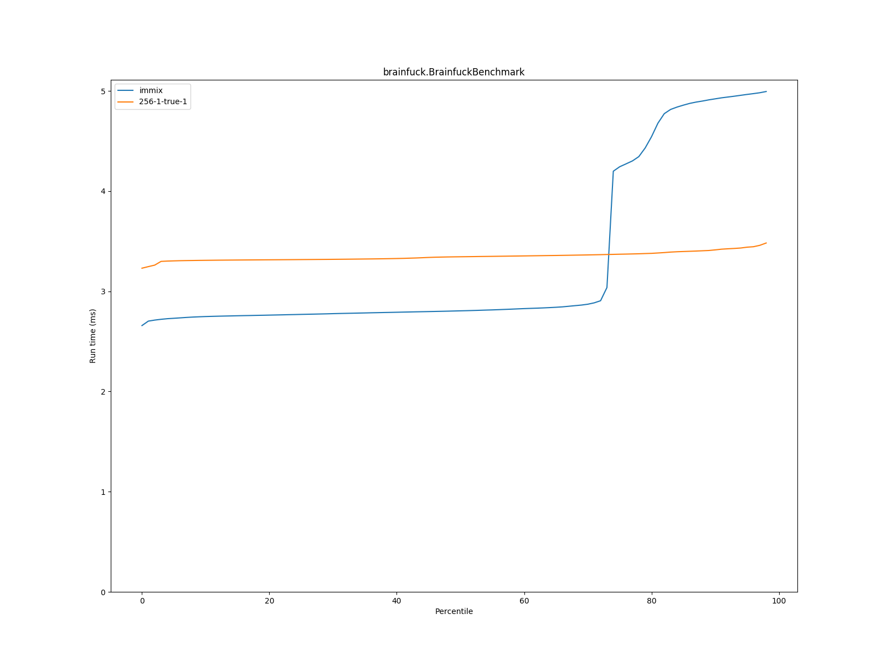
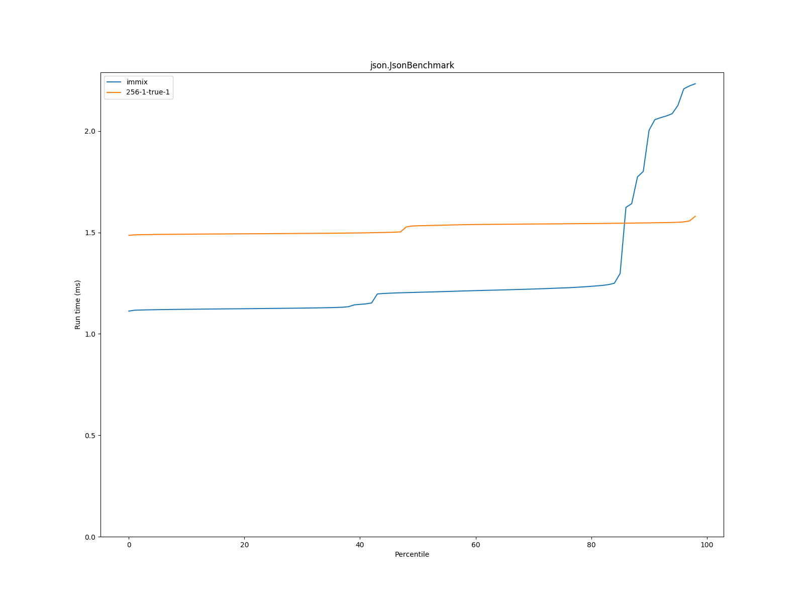
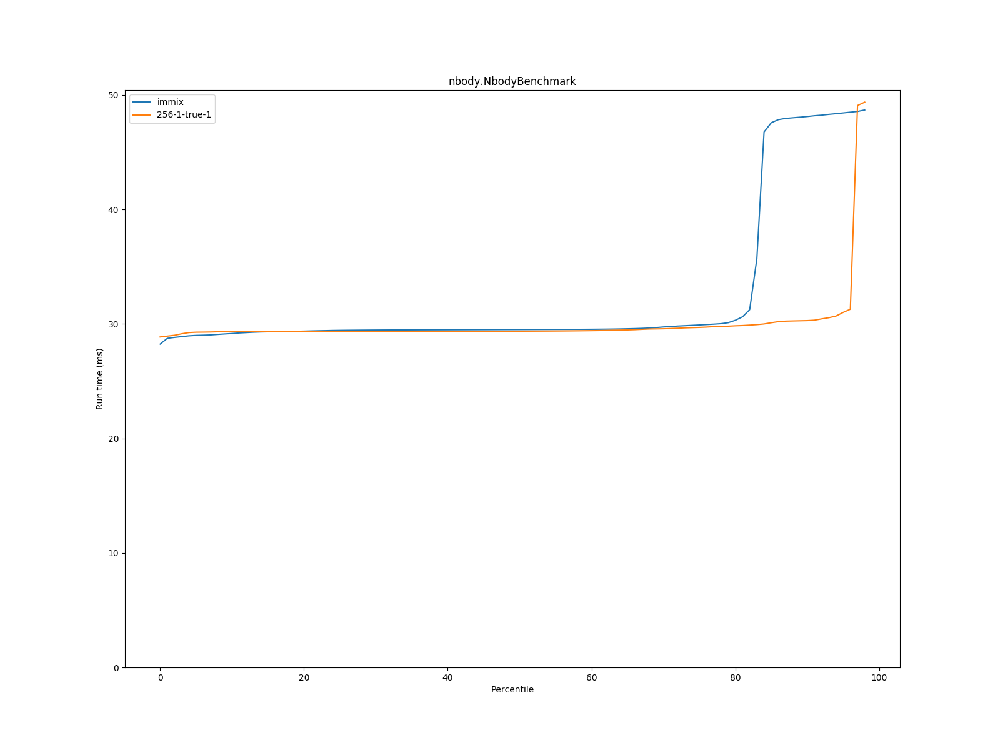
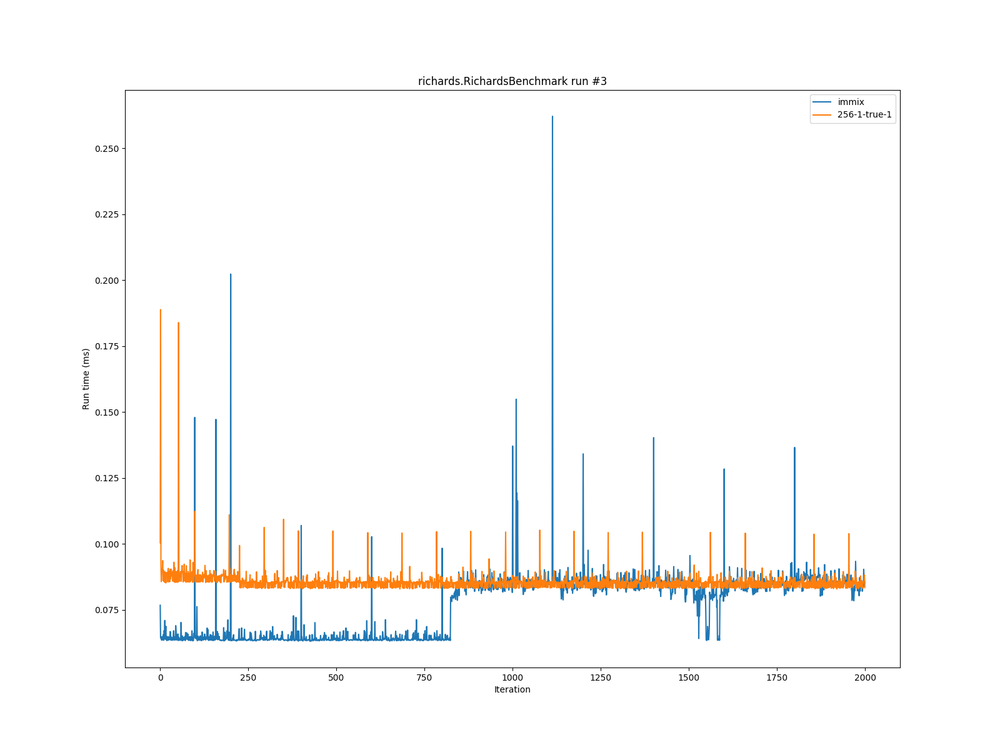

# Summary
## Benchmark run time (ms) at 50 percentile 

|name | immix | 256-1-true-1 | |
| -- | -- | -- | -- |
|[bounce.BounceBenchmark](#bouncebouncebenchmark)|0.0442|0.0469|+6.14%|
|[brainfuck.BrainfuckBenchmark](#brainfuckbrainfuckbenchmark)|2.8053|3.3449|+19.24%|
|[cd.CDBenchmark](#cdcdbenchmark)|19.7350|37.4518|+89.77%|
|[deltablue.DeltaBlueBenchmark](#deltabluedeltabluebenchmark)|0.1628|0.2314|+42.14%|
|[gcbench.GCBenchBenchmark](#gcbenchgcbenchbenchmark)|83.9916|334.8095|+298.62%|
|[json.JsonBenchmark](#jsonjsonbenchmark)|1.2048|1.5327|+27.22%|
|[kmeans.KmeansBenchmark](#kmeanskmeansbenchmark)|53.1623|72.8014|+36.94%|
|[list.ListBenchmark](#listlistbenchmark)|0.0441|0.0429|__-2.87%__|
|[mandelbrot.MandelbrotBenchmark](#mandelbrotmandelbrotbenchmark)|117.6027|114.3312|__-2.78%__|
|[nbody.NbodyBenchmark](#nbodynbodybenchmark)|29.5003|29.3610|__-0.47%__|
|[permute.PermuteBenchmark](#permutepermutebenchmark)|0.1623|0.2106|+29.76%|
|[queens.QueensBenchmark](#queensqueensbenchmark)|0.0824|0.0795|__-3.53%__|
|[richards.RichardsBenchmark](#richardsrichardsbenchmark)|0.0640|0.0852|+33.00%|
|[sudoku.SudokuBenchmark](#sudokusudokubenchmark)|1.7677|2.0771|+17.50%|
|[tracer.TracerBenchmark](#tracertracerbenchmark)|0.5574|0.9105|+63.35%|
| __Geometrical mean:__|| |+32.89%|
## Benchmark run time (ms) at 90 percentile 

|name | immix | 256-1-true-1 | |
| -- | -- | -- | -- |
|[bounce.BounceBenchmark](#bouncebouncebenchmark)|0.0446|0.0495|+10.97%|
|[brainfuck.BrainfuckBenchmark](#brainfuckbrainfuckbenchmark)|4.9215|3.4137|__-30.64%__|
|[cd.CDBenchmark](#cdcdbenchmark)|34.0275|37.7092|+10.82%|
|[deltablue.DeltaBlueBenchmark](#deltabluedeltabluebenchmark)|0.2157|0.2432|+12.74%|
|[gcbench.GCBenchBenchmark](#gcbenchgcbenchbenchmark)|120.9670|540.3720|+346.71%|
|[json.JsonBenchmark](#jsonjsonbenchmark)|2.0036|1.5472|__-22.78%__|
|[kmeans.KmeansBenchmark](#kmeanskmeansbenchmark)|97.3320|135.4331|+39.15%|
|[list.ListBenchmark](#listlistbenchmark)|0.0462|0.0440|__-4.67%__|
|[mandelbrot.MandelbrotBenchmark](#mandelbrotmandelbrotbenchmark)|120.7551|114.7217|__-5.00%__|
|[nbody.NbodyBenchmark](#nbodynbodybenchmark)|48.1112|30.2844|__-37.05%__|
|[permute.PermuteBenchmark](#permutepermutebenchmark)|0.1692|0.2281|+34.80%|
|[queens.QueensBenchmark](#queensqueensbenchmark)|0.0867|0.0815|__-5.96%__|
|[richards.RichardsBenchmark](#richardsrichardsbenchmark)|0.0838|0.0875|+4.40%|
|[sudoku.SudokuBenchmark](#sudokusudokubenchmark)|3.4635|3.6737|+6.07%|
|[tracer.TracerBenchmark](#tracertracerbenchmark)|0.8510|0.9173|+7.79%|
| __Geometrical mean:__|| |+9.65%|
## Benchmark run time (ms) at 99 percentile 

|name | immix | 256-1-true-1 | |
| -- | -- | -- | -- |
|[bounce.BounceBenchmark](#bouncebouncebenchmark)|0.0696|0.0514|__-26.17%__|
|[brainfuck.BrainfuckBenchmark](#brainfuckbrainfuckbenchmark)|5.0110|3.5089|__-29.98%__|
|[cd.CDBenchmark](#cdcdbenchmark)|36.3897|38.3716|+5.45%|
|[deltablue.DeltaBlueBenchmark](#deltabluedeltabluebenchmark)|0.2576|0.2821|+9.52%|
|[gcbench.GCBenchBenchmark](#gcbenchgcbenchbenchmark)|122.7365|552.7614|+350.36%|
|[json.JsonBenchmark](#jsonjsonbenchmark)|2.2463|1.5947|__-29.01%__|
|[kmeans.KmeansBenchmark](#kmeanskmeansbenchmark)|99.3254|138.9742|+39.92%|
|[list.ListBenchmark](#listlistbenchmark)|0.0559|0.0468|__-16.26%__|
|[mandelbrot.MandelbrotBenchmark](#mandelbrotmandelbrotbenchmark)|120.8288|115.4500|__-4.45%__|
|[nbody.NbodyBenchmark](#nbodynbodybenchmark)|48.8385|49.6657|+1.69%|
|[permute.PermuteBenchmark](#permutepermutebenchmark)|0.3309|0.2366|__-28.48%__|
|[queens.QueensBenchmark](#queensqueensbenchmark)|0.1537|0.0839|__-45.42%__|
|[richards.RichardsBenchmark](#richardsrichardsbenchmark)|0.0895|0.1021|+14.10%|
|[sudoku.SudokuBenchmark](#sudokusudokubenchmark)|3.6835|4.2756|+16.07%|
|[tracer.TracerBenchmark](#tracertracerbenchmark)|0.8956|0.9491|+5.97%|
| __Geometrical mean:__|| |+1.17%|
# Individual benchmarks
## bounce.BounceBenchmark

## brainfuck.BrainfuckBenchmark

## cd.CDBenchmark

## deltablue.DeltaBlueBenchmark

## gcbench.GCBenchBenchmark

## json.JsonBenchmark

## kmeans.KmeansBenchmark

## list.ListBenchmark

## mandelbrot.MandelbrotBenchmark

## nbody.NbodyBenchmark

## permute.PermuteBenchmark

## queens.QueensBenchmark

## richards.RichardsBenchmark

## sudoku.SudokuBenchmark

## tracer.TracerBenchmark

