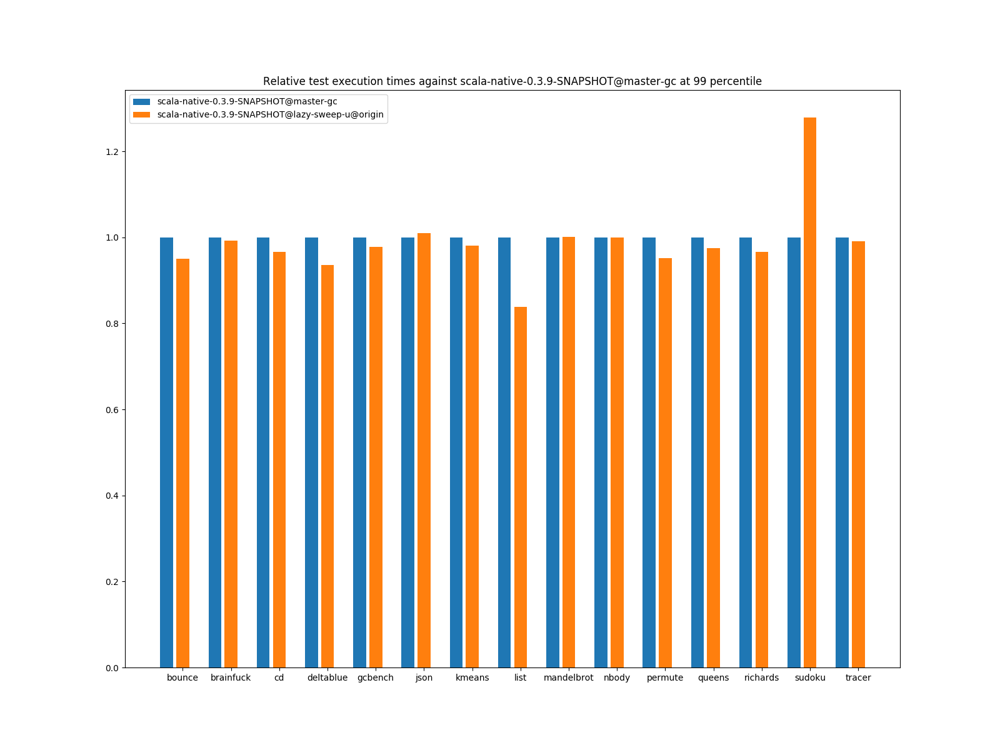

# Summary
## Benchmark run time (ms) at 50 percentile 

|name | scala-native-0.3.9-SNAPSHOT@master-gc | scala-native-0.3.9-SNAPSHOT@lazy-sweep-u@origin | |
| -- | -- | -- | -- |
|[bounce.BounceBenchmark](#bouncebouncebenchmark)|0.0588|0.0548|__-6.82%__|
|[brainfuck.BrainfuckBenchmark](#brainfuckbrainfuckbenchmark)|3.3540|3.3435|__-0.31%__|
|[cd.CDBenchmark](#cdcdbenchmark)|32.8311|32.3978|__-1.32%__|
|[deltablue.DeltaBlueBenchmark](#deltabluedeltabluebenchmark)|0.1914|0.1810|__-5.43%__|
|[gcbench.GCBenchBenchmark](#gcbenchgcbenchbenchmark)|134.0681|132.3115|__-1.31%__|
|[json.JsonBenchmark](#jsonjsonbenchmark)|1.6341|1.6612|+1.65%|
|[kmeans.KmeansBenchmark](#kmeanskmeansbenchmark)|53.6443|53.9792|+0.62%|
|[list.ListBenchmark](#listlistbenchmark)|0.0643|0.0557|__-13.46%__|
|[mandelbrot.MandelbrotBenchmark](#mandelbrotmandelbrotbenchmark)|126.2417|126.2080|__-0.03%__|
|[nbody.NbodyBenchmark](#nbodynbodybenchmark)|39.4775|39.4264|__-0.13%__|
|[permute.PermuteBenchmark](#permutepermutebenchmark)|0.2039|0.2048|+0.44%|
|[queens.QueensBenchmark](#queensqueensbenchmark)|0.1137|0.1156|+1.67%|
|[richards.RichardsBenchmark](#richardsrichardsbenchmark)|0.0763|0.0792|+3.81%|
|[sudoku.SudokuBenchmark](#sudokusudokubenchmark)|2.4608|2.3563|__-4.25%__|
|[tracer.TracerBenchmark](#tracertracerbenchmark)|0.7505|0.7642|+1.82%|
| __Geometrical mean:__|| |__-1.63%__|
## Benchmark run time (ms) at 90 percentile 

|name | scala-native-0.3.9-SNAPSHOT@master-gc | scala-native-0.3.9-SNAPSHOT@lazy-sweep-u@origin | |
| -- | -- | -- | -- |
|[bounce.BounceBenchmark](#bouncebouncebenchmark)|0.0595|0.0556|__-6.49%__|
|[brainfuck.BrainfuckBenchmark](#brainfuckbrainfuckbenchmark)|3.4431|3.4326|__-0.30%__|
|[cd.CDBenchmark](#cdcdbenchmark)|33.5115|32.8837|__-1.87%__|
|[deltablue.DeltaBlueBenchmark](#deltabluedeltabluebenchmark)|0.2002|0.1872|__-6.52%__|
|[gcbench.GCBenchBenchmark](#gcbenchgcbenchbenchmark)|137.3548|135.3197|__-1.48%__|
|[json.JsonBenchmark](#jsonjsonbenchmark)|1.6803|1.7026|+1.33%|
|[kmeans.KmeansBenchmark](#kmeanskmeansbenchmark)|56.2849|57.2394|+1.70%|
|[list.ListBenchmark](#listlistbenchmark)|0.0656|0.0573|__-12.70%__|
|[mandelbrot.MandelbrotBenchmark](#mandelbrotmandelbrotbenchmark)|127.1121|127.0733|__-0.03%__|
|[nbody.NbodyBenchmark](#nbodynbodybenchmark)|40.1422|40.0840|__-0.14%__|
|[permute.PermuteBenchmark](#permutepermutebenchmark)|0.2111|0.2178|+3.20%|
|[queens.QueensBenchmark](#queensqueensbenchmark)|0.1167|0.1181|+1.16%|
|[richards.RichardsBenchmark](#richardsrichardsbenchmark)|0.0785|0.0808|+2.88%|
|[sudoku.SudokuBenchmark](#sudokusudokubenchmark)|2.6719|3.4507|+29.15%|
|[tracer.TracerBenchmark](#tracertracerbenchmark)|0.7662|0.7845|+2.39%|
| __Geometrical mean:__|| |+0.48%|
## Benchmark run time (ms) at 99 percentile 

|name | scala-native-0.3.9-SNAPSHOT@master-gc | scala-native-0.3.9-SNAPSHOT@lazy-sweep-u@origin | |
| -- | -- | -- | -- |
|[bounce.BounceBenchmark](#bouncebouncebenchmark)|0.0674|0.0641|__-4.96%__|
|[brainfuck.BrainfuckBenchmark](#brainfuckbrainfuckbenchmark)|3.5782|3.5491|__-0.81%__|
|[cd.CDBenchmark](#cdcdbenchmark)|34.6577|33.5030|__-3.33%__|
|[deltablue.DeltaBlueBenchmark](#deltabluedeltabluebenchmark)|0.2703|0.2528|__-6.47%__|
|[gcbench.GCBenchBenchmark](#gcbenchgcbenchbenchmark)|139.9987|136.8458|__-2.25%__|
|[json.JsonBenchmark](#jsonjsonbenchmark)|1.7565|1.7731|+0.95%|
|[kmeans.KmeansBenchmark](#kmeanskmeansbenchmark)|59.4711|58.3147|__-1.94%__|
|[list.ListBenchmark](#listlistbenchmark)|0.0733|0.0614|__-16.20%__|
|[mandelbrot.MandelbrotBenchmark](#mandelbrotmandelbrotbenchmark)|128.8094|128.8673|+0.04%|
|[nbody.NbodyBenchmark](#nbodynbodybenchmark)|41.3540|41.3268|__-0.07%__|
|[permute.PermuteBenchmark](#permutepermutebenchmark)|0.2459|0.2340|__-4.85%__|
|[queens.QueensBenchmark](#queensqueensbenchmark)|0.1345|0.1311|__-2.50%__|
|[richards.RichardsBenchmark](#richardsrichardsbenchmark)|0.0952|0.0920|__-3.40%__|
|[sudoku.SudokuBenchmark](#sudokusudokubenchmark)|2.8524|3.6468|+27.85%|
|[tracer.TracerBenchmark](#tracertracerbenchmark)|0.8347|0.8267|__-0.97%__|
| __Geometrical mean:__|| |__-1.61%__|
# Individual benchmarks
## bounce.BounceBenchmark

## brainfuck.BrainfuckBenchmark

## cd.CDBenchmark

## deltablue.DeltaBlueBenchmark

## gcbench.GCBenchBenchmark

## json.JsonBenchmark

## kmeans.KmeansBenchmark

## list.ListBenchmark

## mandelbrot.MandelbrotBenchmark

## nbody.NbodyBenchmark

## permute.PermuteBenchmark

## queens.QueensBenchmark

## richards.RichardsBenchmark

## sudoku.SudokuBenchmark

## tracer.TracerBenchmark

