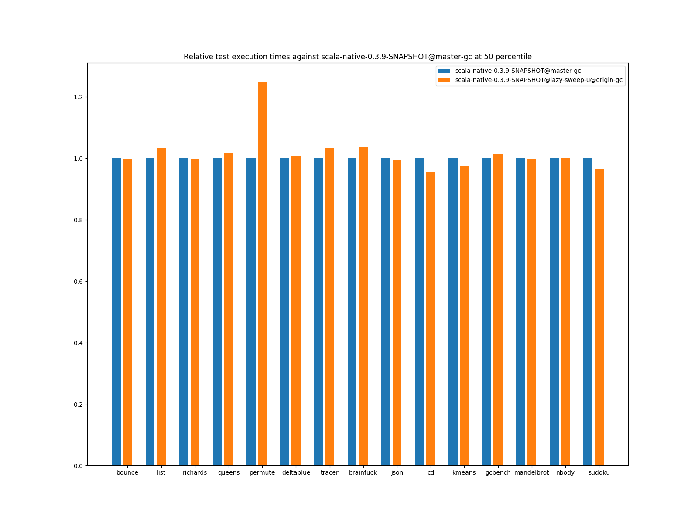
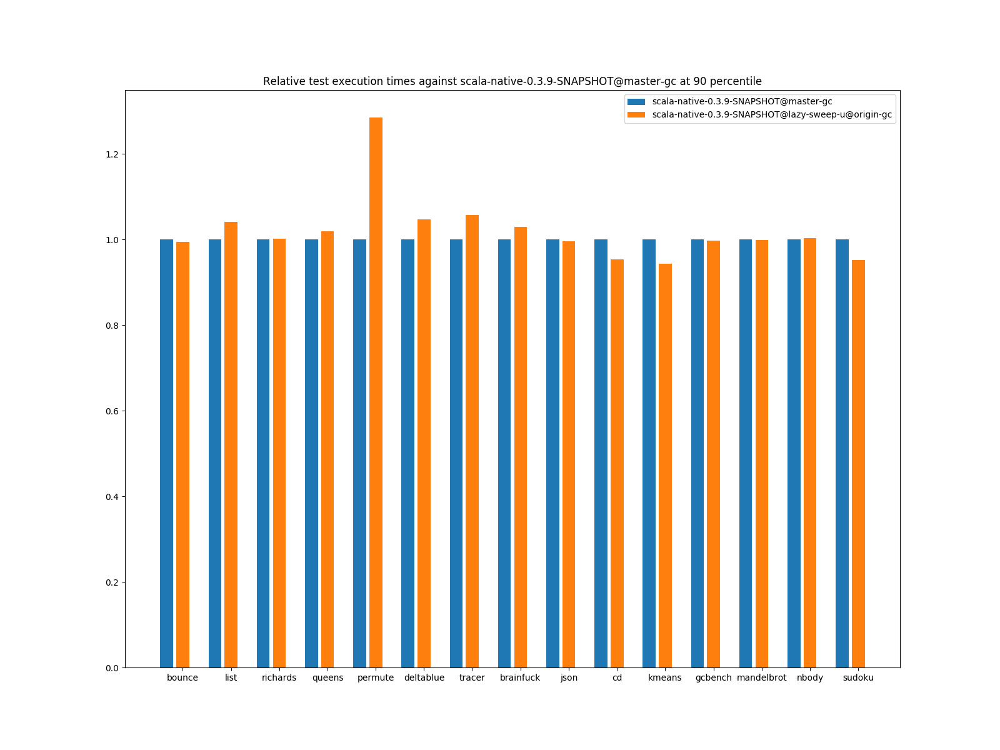
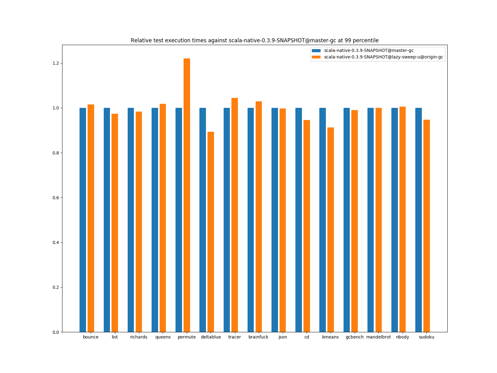

# Summary
## Benchmark run time (ms) at 50 percentile 

|name | scala-native-0.3.9-SNAPSHOT@master-gc | scala-native-0.3.9-SNAPSHOT@lazy-sweep-u@origin-gc | |
| -- | -- | -- | -- |
|[bounce.BounceBenchmark](#bouncebouncebenchmark)|0.0588|0.0587|__-0.22%__|
|[list.ListBenchmark](#listlistbenchmark)|0.0643|0.0665|+3.32%|
|[richards.RichardsBenchmark](#richardsrichardsbenchmark)|0.0763|0.0763|__-0.08%__|
|[queens.QueensBenchmark](#queensqueensbenchmark)|0.1137|0.1159|+1.92%|
|[permute.PermuteBenchmark](#permutepermutebenchmark)|0.2039|0.2545|+24.84%|
|[deltablue.DeltaBlueBenchmark](#deltabluedeltabluebenchmark)|0.1914|0.1928|+0.74%|
|[tracer.TracerBenchmark](#tracertracerbenchmark)|0.7505|0.7762|+3.42%|
|[brainfuck.BrainfuckBenchmark](#brainfuckbrainfuckbenchmark)|3.3540|3.4744|+3.59%|
|[json.JsonBenchmark](#jsonjsonbenchmark)|1.6341|1.6254|__-0.54%__|
|[cd.CDBenchmark](#cdcdbenchmark)|32.8311|31.3808|__-4.42%__|
|[kmeans.KmeansBenchmark](#kmeanskmeansbenchmark)|53.6443|52.2276|__-2.64%__|
|[gcbench.GCBenchBenchmark](#gcbenchgcbenchbenchmark)|134.0681|135.8634|+1.34%|
|[mandelbrot.MandelbrotBenchmark](#mandelbrotmandelbrotbenchmark)|126.2417|126.1486|__-0.07%__|
|[nbody.NbodyBenchmark](#nbodynbodybenchmark)|39.4775|39.5572|+0.20%|
|[sudoku.SudokuBenchmark](#sudokusudokubenchmark)|2.4608|2.3725|__-3.59%__|
| __Geometrical mean:__|| |+1.66%|
## Benchmark run time (ms) at 90 percentile 

|name | scala-native-0.3.9-SNAPSHOT@master-gc | scala-native-0.3.9-SNAPSHOT@lazy-sweep-u@origin-gc | |
| -- | -- | -- | -- |
|[bounce.BounceBenchmark](#bouncebouncebenchmark)|0.0595|0.0592|__-0.52%__|
|[list.ListBenchmark](#listlistbenchmark)|0.0656|0.0683|+4.07%|
|[richards.RichardsBenchmark](#richardsrichardsbenchmark)|0.0785|0.0787|+0.22%|
|[queens.QueensBenchmark](#queensqueensbenchmark)|0.1167|0.1190|+1.91%|
|[permute.PermuteBenchmark](#permutepermutebenchmark)|0.2111|0.2713|+28.52%|
|[deltablue.DeltaBlueBenchmark](#deltabluedeltabluebenchmark)|0.2002|0.2098|+4.78%|
|[tracer.TracerBenchmark](#tracertracerbenchmark)|0.7662|0.8102|+5.75%|
|[brainfuck.BrainfuckBenchmark](#brainfuckbrainfuckbenchmark)|3.4431|3.5461|+2.99%|
|[json.JsonBenchmark](#jsonjsonbenchmark)|1.6803|1.6742|__-0.36%__|
|[cd.CDBenchmark](#cdcdbenchmark)|33.5115|31.9820|__-4.56%__|
|[kmeans.KmeansBenchmark](#kmeanskmeansbenchmark)|56.2849|53.1383|__-5.59%__|
|[gcbench.GCBenchBenchmark](#gcbenchgcbenchbenchmark)|137.3548|137.1064|__-0.18%__|
|[mandelbrot.MandelbrotBenchmark](#mandelbrotmandelbrotbenchmark)|127.1121|127.0201|__-0.07%__|
|[nbody.NbodyBenchmark](#nbodynbodybenchmark)|40.1422|40.2913|+0.37%|
|[sudoku.SudokuBenchmark](#sudokusudokubenchmark)|2.6719|2.5443|__-4.78%__|
| __Geometrical mean:__|| |+1.91%|
## Benchmark run time (ms) at 99 percentile 

|name | scala-native-0.3.9-SNAPSHOT@master-gc | scala-native-0.3.9-SNAPSHOT@lazy-sweep-u@origin-gc | |
| -- | -- | -- | -- |
|[bounce.BounceBenchmark](#bouncebouncebenchmark)|0.0674|0.0684|+1.47%|
|[list.ListBenchmark](#listlistbenchmark)|0.0733|0.0713|__-2.70%__|
|[richards.RichardsBenchmark](#richardsrichardsbenchmark)|0.0952|0.0937|__-1.67%__|
|[queens.QueensBenchmark](#queensqueensbenchmark)|0.1345|0.1368|+1.71%|
|[permute.PermuteBenchmark](#permutepermutebenchmark)|0.2459|0.3001|+22.01%|
|[deltablue.DeltaBlueBenchmark](#deltabluedeltabluebenchmark)|0.2703|0.2414|__-10.69%__|
|[tracer.TracerBenchmark](#tracertracerbenchmark)|0.8347|0.8715|+4.41%|
|[brainfuck.BrainfuckBenchmark](#brainfuckbrainfuckbenchmark)|3.5782|3.6792|+2.82%|
|[json.JsonBenchmark](#jsonjsonbenchmark)|1.7565|1.7514|__-0.29%__|
|[cd.CDBenchmark](#cdcdbenchmark)|34.6577|32.7489|__-5.51%__|
|[kmeans.KmeansBenchmark](#kmeanskmeansbenchmark)|59.4711|54.2228|__-8.82%__|
|[gcbench.GCBenchBenchmark](#gcbenchgcbenchbenchmark)|139.9987|138.5020|__-1.07%__|
|[mandelbrot.MandelbrotBenchmark](#mandelbrotmandelbrotbenchmark)|128.8094|128.7383|__-0.06%__|
|[nbody.NbodyBenchmark](#nbodynbodybenchmark)|41.3540|41.5969|+0.59%|
|[sudoku.SudokuBenchmark](#sud