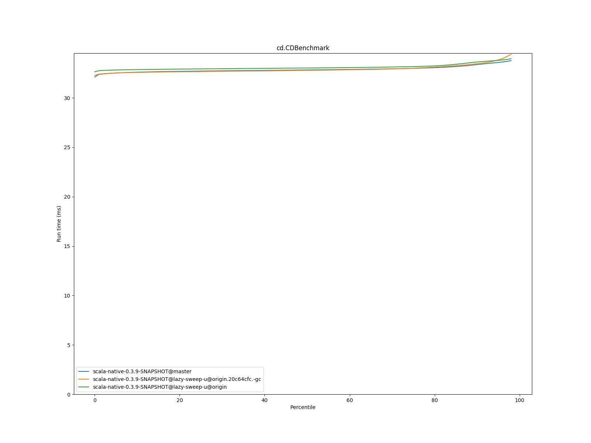
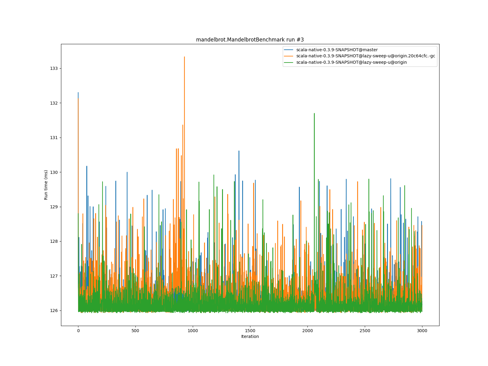
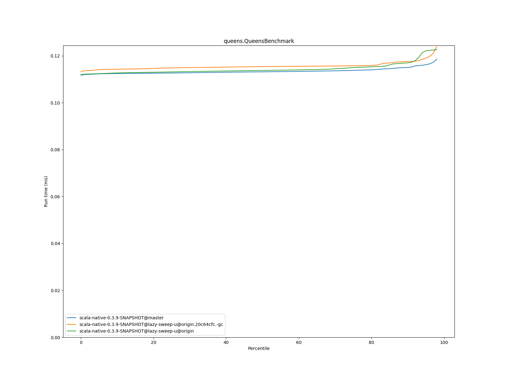
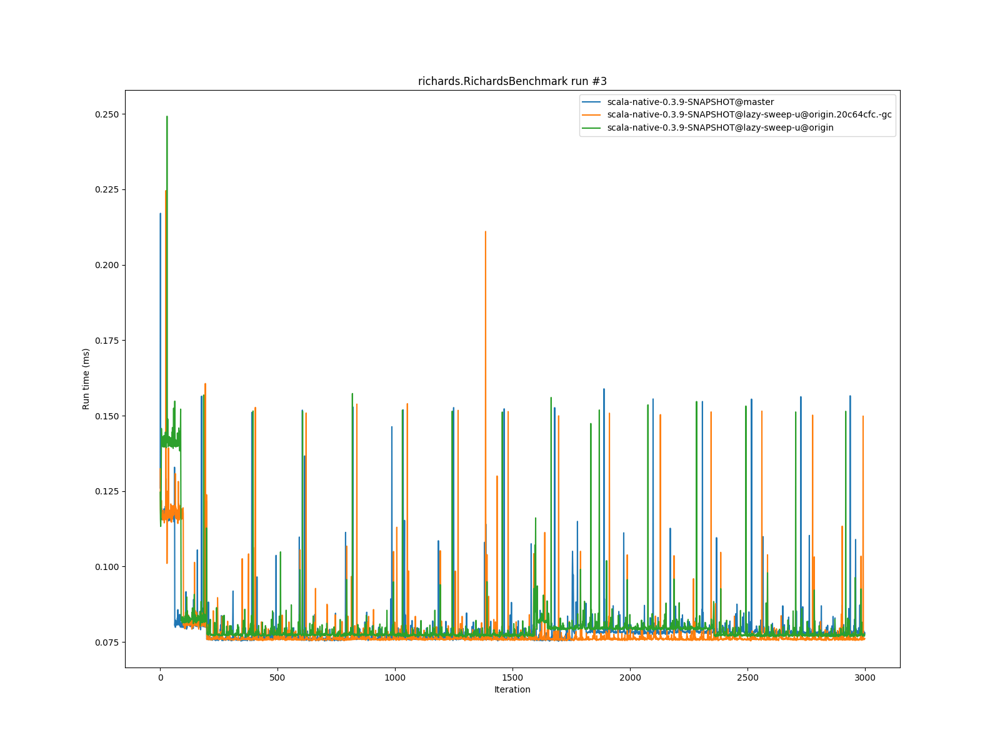

# Summary
## Benchmark run time (ms) at 50 percentile 

|name | scala-native-0.3.9-SNAPSHOT@master | scala-native-0.3.9-SNAPSHOT@lazy-sweep-u@origin.20c64cfc.-gc |  | scala-native-0.3.9-SNAPSHOT@lazy-sweep-u@origin | |
| -- | -- | -- | -- | -- | -- |
|[bounce.BounceBenchmark](#bouncebouncebenchmark)|0.0575|0.0541|__-5.94%__|0.0574|__-0.16%__|
|[brainfuck.BrainfuckBenchmark](#brainfuckbrainfuckbenchmark)|3.4230|3.3959|__-0.79%__|3.3632|__-1.75%__|
|[cd.CDBenchmark](#cdcdbenchmark)|32.8276|32.7846|__-0.13%__|33.0240|+0.60%|
|[deltablue.DeltaBlueBenchmark](#deltabluedeltabluebenchmark)|0.1881|0.1803|__-4.11%__|0.1862|__-1.01%__|
|[gcbench.GCBenchBenchmark](#gcbenchgcbenchbenchmark)|132.0552|134.1908|+1.62%|130.2956|__-1.33%__|
|[json.JsonBenchmark](#jsonjsonbenchmark)|1.6668|1.6473|__-1.17%__|1.6116|__-3.32%__|
|[kmeans.KmeansBenchmark](#kmeanskmeansbenchmark)|58.9348|53.1329|__-9.84%__|53.4818|__-9.25%__|
|[list.ListBenchmark](#listlistbenchmark)|0.0570|0.0548|__-3.83%__|0.0643|+12.82%|
|[mandelbrot.MandelbrotBenchmark](#mandelbrotmandelbrotbenchmark)|126.1322|126.2438|+0.09%|126.0928|__-0.03%__|
|[nbody.NbodyBenchmark](#nbodynbodybenchmark)|39.4214|39.5996|+0.45%|39.4270|+0.01%|
|[permute.PermuteBenchmark](#permutepermutebenchmark)|0.2495|0.2036|__-18.42%__|0.2024|__-18.90%__|
|[queens.QueensBenchmark](#queensqueensbenchmark)|0.1132|0.1154|+1.97%|0.1138|+0.52%|
|[richards.RichardsBenchmark](#richardsrichardsbenchmark)|0.0763|0.0761|__-0.26%__|0.0775|+1.63%|
|[sudoku.SudokuBenchmark](#sudokusudokubenchmark)|2.4037|2.4033|__-0.02%__|2.3255|__-3.25%__|
|[tracer.TracerBenchmark](#tracertracerbenchmark)|0.7537|0.7694|+2.08%|0.7456|__-1.08%__|
| __Geometrical mean:__|| |__-2.71%__| |__-1.84%__|
## Benchmark run time (ms) at 90 percentile 

|name | scala-native-0.3.9-SNAPSHOT@master | scala-native-0.3.9-SNAPSHOT@lazy-sweep-u@origin.20c64cfc.-gc |  | scala-native-0.3.9-SNAPSHOT@lazy-sweep-u@origin | |
| -- | -- | -- | -- | -- | -- |
|[bounce.BounceBenchmark](#bouncebouncebenchmark)|0.0579|0.0544|__-6.12%__|0.0589|+1.63%|
|[brainfuck.BrainfuckBenchmark](#brainfuckbrainfuckbenchmark)|3.4882|3.4807|__-0.22%__|3.4588|__-0.84%__|
|[cd.CDBenchmark](#cdcdbenchmark)|33.3688|33.4624|+0.28%|33.6348|+0.80%|
|[deltablue.DeltaBlueBenchmark](#deltabluedeltabluebenchmark)|0.1945|0.1885|__-3.10%__|0.1925|__-1.05%__|
|[gcbench.GCBenchBenchmark](#gcbenchgcbenchbenchmark)|135.7358|137.6260|+1.39%|134.1867|__-1.14%__|
|[json.JsonBenchmark](#jsonjsonbenchmark)|1.6847|1.6805|__-0.25%__|1.6594|__-1.50%__|
|[kmeans.KmeansBenchmark](#kmeanskmeansbenchmark)|62.0028|54.7135|__-11.76%__|56.7527|__-8.47%__|
|[list.ListBenchmark](#listlistbenchmark)|0.0583|0.0562|__-3.58%__|0.0660|+13.16%|
|[mandelbrot.MandelbrotBenchmark](#mandelbrotmandelbrotbenchmark)|126.6270|127.2542|+0.50%|126.6283|+0.00%|
|[nbody.NbodyBenchmark](#nbodynbodybenchmark)|40.0990|40.2316|+0.33%|40.0787|__-0.05%__|
|[permute.PermuteBenchmark](#permutepermutebenchmark)|0.2622|0.2118|__-19.24%__|0.2091|__-20.28%__|
|[queens.QueensBenchmark](#queensqueensbenchmark)|0.1150|0.1175|+2.17%|0.1170|+1.72%|
|[richards.RichardsBenchmark](#richardsrichardsbenchmark)|0.0788|0.0784|__-0.49%__|0.0806|+2.24%|
|[sudoku.SudokuBenchmark](#sudokusudokubenchmark)|3.5209|2.6447|__-24.88%__|2.4899|__-29.28%__|
|[tracer.TracerBenchmark](#tracertracerbenchmark)|0.7707|0.7926|+2.84%|0.7648|__-0.77%__|
| __Geometrical mean:__|| |__-4.50%__| |__-3.46%__|
## Benchmark run time (ms) at 99 percentile 

|name | scala-native-0.3.9-SNAPSHOT@master | scala-native-0.3.9-SNAPSHOT@lazy-sweep-u@origin.20c64cfc.-gc |  | scala-native-0.3.9-SNAPSHOT@lazy-sweep-u@origin | |
| -- | -- | -- | -- | -- | -- |
|[bounce.BounceBenchmark](#bouncebouncebenchmark)|0.0658|0.0576|__-12.38%__|0.0621|__-5.61%__|
|[brainfuck.BrainfuckBenchmark](#brainfuckbrainfuckbenchmark)|3.6235|3.6332|+0.27%|3.5900|__-0.92%__|
|[cd.CDBenchmark](#cdcdbenchmark)|33.9190|34.6858|+2.26%|34.1282|+0.62%|
|[deltablue.DeltaBlueBenchmark](#deltabluedeltabluebenchmark)|0.2763|0.2601|__-5.87%__|0.2489|__-9.94%__|
|[gcbench.GCBenchBenchmark](#gcbenchgcbenchbenchmark)|136.9614|139.0530|+1.53%|135.4787|__-1.08%__|
|[json.JsonBenchmark](#jsonjsonbenchmark)|1.7702|1.7719|+0.10%|1.7287|__-2.34%__|
|[kmeans.KmeansBenchmark](#kmeanskmeansbenchmark)|64.9986|56.5069|__-13.06%__|57.9481|__-10.85%__|
|[list.ListBenchmark](#listlistbenchmark)|0.0605|0.0590|__-2.43%__|0.0683|+12.92%|
|[mandelbrot.MandelbrotBenchmark](#mandelbrotmandelbrotbenchmark)|128.8155|128.9813|+0.13%|128.9027|+0.07%|
|[nbody.NbodyBenchmark](#nbodynbodybenchmark)|41.4952|41.5073|+0.03%|41.2682|__-0.55%__|
|[permute.PermuteBenchmark](#permutepermutebenchmark)|0.2906|0.2425|__-16.54%__|0.2283|__-21.46%__|
|[queens.QueensBenchmark](#queensqueensbenchmark)|0.1246|0.1329|+6.65%|0.1243|__-0.22%__|
|[richards.RichardsBenchmark](#richardsrichardsbenchmark)|0.0925|0.0941|+1.70%|0.0888|__-4.02%__|
|[sudoku.SudokuBenchmark](#sudokusudokubenchmark)|3.7683|3.5360|__-6.16%__|2.5835|__-31.44%__|
|[tracer.TracerBenchmark](#tracertracerbenchmark)|0.8077|0.8524|+5.53%|0.8045|__-0.39%__|
| __Geometrical mean:__|| |__-2.79%__| |__-5.60%__|
# Individual benchmarks
## bounce.BounceBenchmark

## brainfuck.BrainfuckBenchmark

## cd.CDBenchmark

## deltablue.DeltaBlueBenchmark

## gcbench.GCBenchBenchmark

## json.JsonBenchmark

## kmeans.KmeansBenchmark

## list.ListBenchmark

## mandelbrot.MandelbrotBenchmark

## nbody.NbodyBenchmark

## permute.PermuteBenchmark

## queens.QueensBenchmark

## richards.RichardsBenchmark

## sudoku.SudokuBenchmark

## tracer.TracerBenchmark

