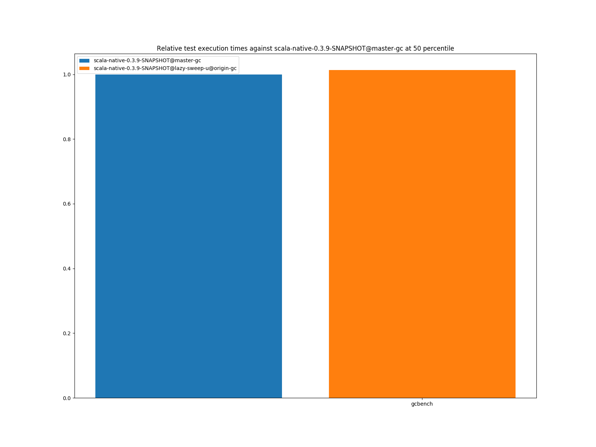
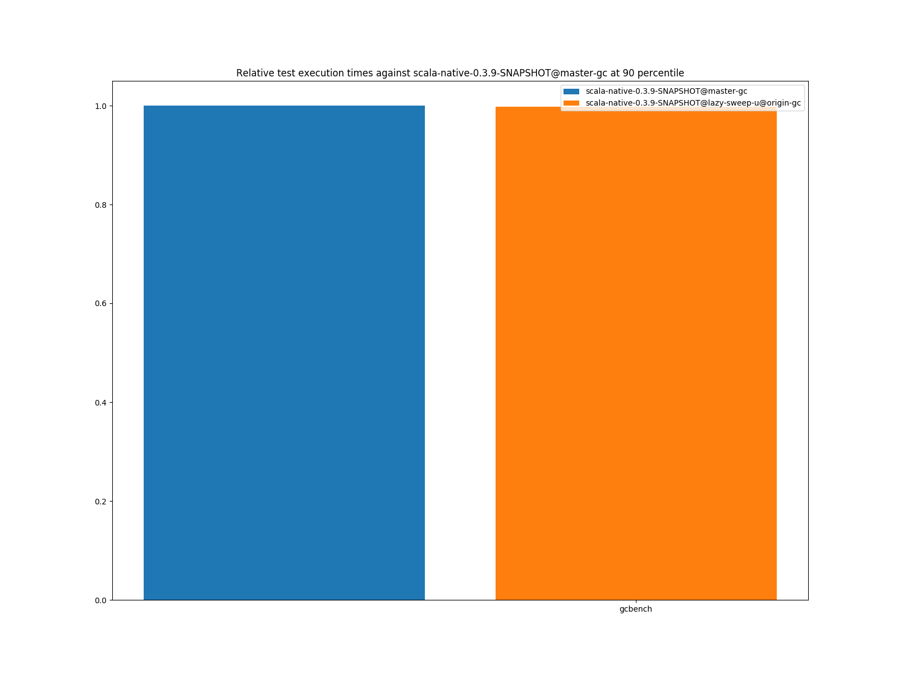
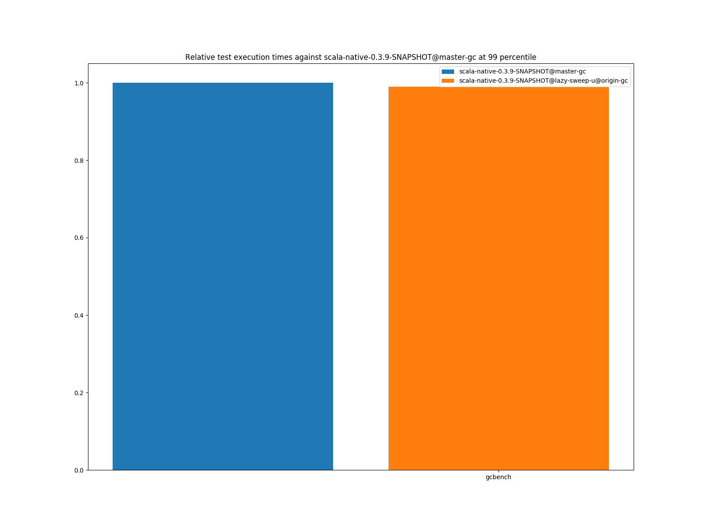

# Summary
## Benchmark run time (ms) at 50 percentile 

|name | scala-native-0.3.9-SNAPSHOT@master-gc | scala-native-0.3.9-SNAPSHOT@lazy-sweep-u@origin-gc | |
| -- | -- | -- | -- |
|[gcbench.GCBenchBenchmark](#gcbenchgcbenchbenchmark)|134.0681|135.8634|+1.34%|
| __Geometrical mean:__|| |+1.34%|
## Benchmark run time (ms) at 90 percentile 

|name | scala-native-0.3.9-SNAPSHOT@master-gc | scala-native-0.3.9-SNAPSHOT@lazy-sweep-u@origin-gc | |
| -- | -- | -- | -- |
|[gcbench.GCBenchBenchmark](#gcbenchgcbenchbenchmark)|137.3548|137.1064|__-0.18%__|
| __Geometrical mean:__|| |__-0.18%__|
## Benchmark run time (ms) at 99 percentile 

|name | scala-native-0.3.9-SNAPSHOT@master-gc | scala-native-0.3.9-SNAPSHOT@lazy-sweep-u@origin-gc | |
| -- | -- | -- | -- |
|[gcbench.GCBenchBenchmark](#gcbenchgcbenchbenchmark)|139.9987|138.5020|__-1.07%__|
| __Geometrical mean:__|| |__-1.07%__|
## Total GC time (ms) 
