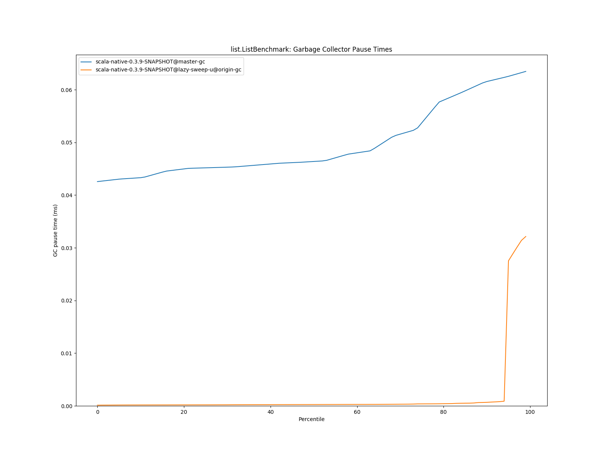
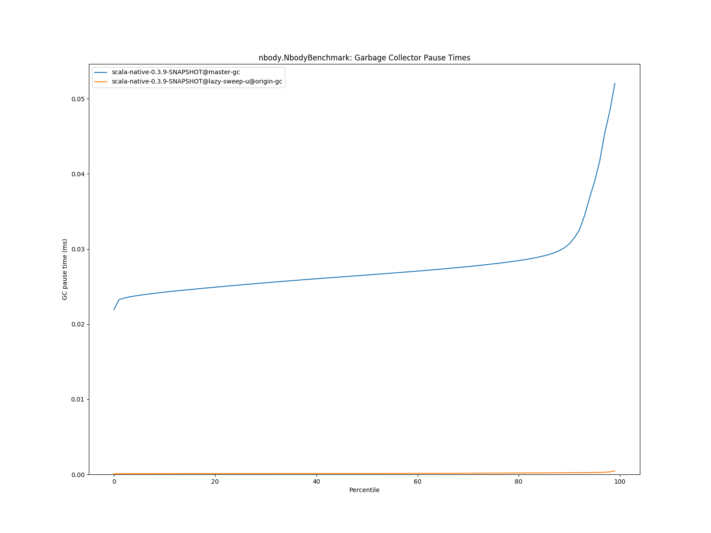
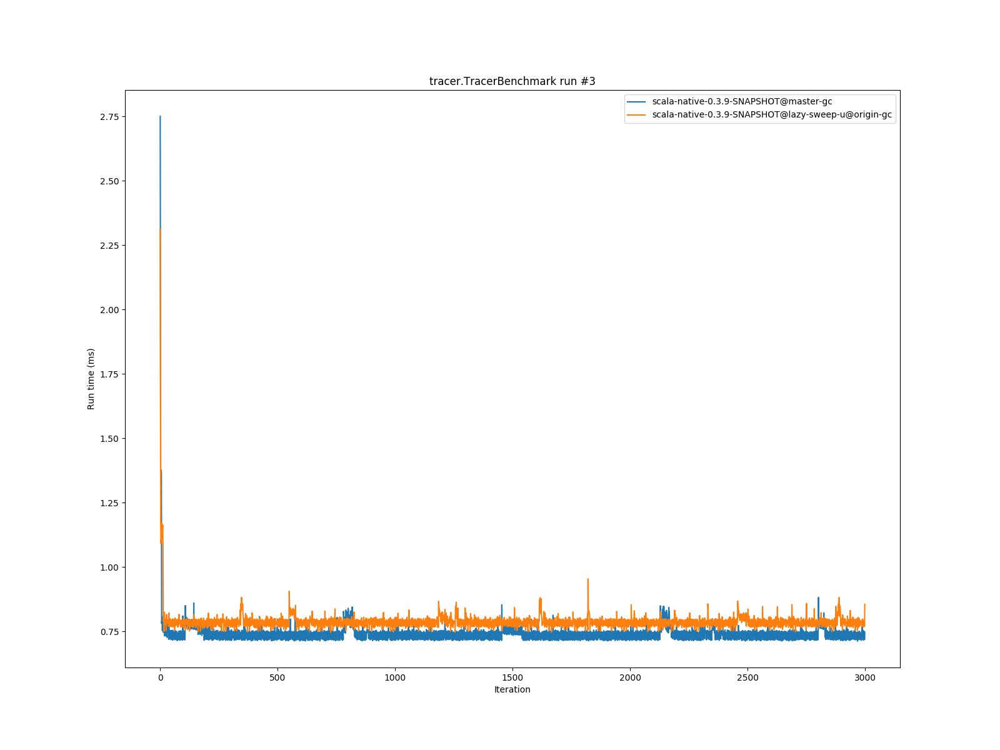

# Summary
## Benchmark run time (ms) at 50 percentile 

|name | scala-native-0.3.9-SNAPSHOT@master-gc | scala-native-0.3.9-SNAPSHOT@lazy-sweep-u@origin-gc | |
| -- | -- | -- | -- |
|[bounce.BounceBenchmark](#bouncebouncebenchmark)|0.0588|0.0587|__-0.22%__|
|[brainfuck.BrainfuckBenchmark](#brainfuckbrainfuckbenchmark)|3.3540|3.4744|+3.59%|
|[cd.CDBenchmark](#cdcdbenchmark)|32.8311|31.3808|__-4.42%__|
|[json.JsonBenchmark](#jsonjsonbenchmark)|1.6341|1.6254|__-0.54%__|
|[kmeans.KmeansBenchmark](#kmeanskmeansbenchmark)|53.6443|52.2276|__-2.64%__|
|[list.ListBenchmark](#listlistbenchmark)|0.0643|0.0665|+3.32%|
|[mandelbrot.MandelbrotBenchmark](#mandelbrotmandelbrotbenchmark)|126.2417|126.1486|__-0.07%__|
|[nbody.NbodyBenchmark](#nbodynbodybenchmark)|39.4775|39.5572|+0.20%|
|[permute.PermuteBenchmark](#permutepermutebenchmark)|0.2039|0.2545|+24.84%|
|[queens.QueensBenchmark](#queensqueensbenchmark)|0.1137|0.1159|+1.92%|
|[richards.RichardsBenchmark](#richardsrichardsbenchmark)|0.0763|0.0763|__-0.08%__|
|[sudoku.SudokuBenchmark](#sudokusudokubenchmark)|2.4608|2.3725|__-3.59%__|
|[tracer.TracerBenchmark](#tracertracerbenchmark)|0.7505|0.7762|+3.42%|
| __Geometrical mean:__|| |+1.76%|
## Benchmark run time (ms) at 90 percentile 

|name | scala-native-0.3.9-SNAPSHOT@master-gc | scala-native-0.3.9-SNAPSHOT@lazy-sweep-u@origin-gc | |
| -- | -- | -- | -- |
|[bounce.BounceBenchmark](#bouncebouncebenchmark)|0.0595|0.0592|__-0.52%__|
|[brainfuck.BrainfuckBenchmark](#brainfuckbrainfuckbenchmark)|3.4431|3.5461|+2.99%|
|[cd.CDBenchmark](#cdcdbenchmark)|33.5115|31.9820|__-4.56%__|
|[json.JsonBenchmark](#jsonjsonbenchmark)|1.6803|1.6742|__-0.36%__|
|[kmeans.KmeansBenchmark](#kmeanskmeansbenchmark)|56.2849|53.1383|__-5.59%__|
|[list.ListBenchmark](#listlistbenchmark)|0.0656|0.0683|+4.07%|
|[mandelbrot.MandelbrotBenchmark](#mandelbrotmandelbrotbenchmark)|127.1121|127.0201|__-0.07%__|
|[nbody.NbodyBenchmark](#nbodynbodybenchmark)|40.1422|40.2913|+0.37%|
|[permute.PermuteBenchmark](#permutepermutebenchmark)|0.2111|0.2713|+28.52%|
|[queens.QueensBenchmark](#queensqueensbenchmark)|0.1167|0.1190|+1.91%|
|[richards.RichardsBenchmark](#richardsrichardsbenchmark)|0.0785|0.0787|+0.22%|
|[sudoku.SudokuBenchmark](#sudokusudokubenchmark)|2.6719|2.5443|__-4.78%__|
|[tracer.TracerBenchmark](#tracertracerbenchmark)|0.7662|0.8102|+5.75%|
| __Geometrical mean:__|| |+1.85%|
## Benchmark run time (ms) at 99 percentile 

|name | scala-native-0.3.9-SNAPSHOT@master-gc | scala-native-0.3.9-SNAPSHOT@lazy-sweep-u@origin-gc | |
| -- | -- | -- | -- |
|[bounce.BounceBenchmark](#bouncebouncebenchmark)|0.0674|0.0684|+1.47%|
|[brainfuck.BrainfuckBenchmark](#brainfuckbrainfuckbenchmark)|3.5782|3.6792|+2.82%|
|[cd.CDBenchmark](#cdcdbenchmark)|34.6577|32.7489|__-5.51%__|
|[json.JsonBenchmark](#jsonjsonbenchmark)|1.7565|1.7514|__-0.29%__|
|[kmeans.KmeansBenchmark](#kmeanskmeansbenchmark)|59.4711|54.2228|__-8.82%__|
|[list.ListBenchmark](#listlistbenchmark)|0.0733|0.0713|__-2.70%__|
|[mandelbrot.MandelbrotBenchmark](#mandelbrotmandelbrotbenchmark)|128.8094|128.7383|__-0.06%__|
|[nbody.NbodyBenchmark](#nbodynbodybenchmark)|41.3540|41.5969|+0.59%|
|[permute.PermuteBenchmark](#permutepermutebenchmark)|0.2459|0.3001|+22.01%|
|[queens.QueensBenchmark](#queensqueensbenchmark)|0.1345|0.1368|+1.71%|
|[richards.RichardsBenchmark](#richardsrichardsbenchmark)|0.0952|0.0937|__-1.67%__|
|[sudoku.SudokuBenchmark](#sudokusudokubenchmark)|2.8524|2.7029|__-5.24%__|
|[tracer.TracerBenchmark](#tracertracerbenchmark)|0.8347|0.8715|+4.41%|
| __Geometrical mean:__|| |+0.44%|
## Total GC time (ms) 

|name |  | scala-native-0.3.9-SNAPSHOT@master-gc | scala-native-0.3.9-SNAPSHOT@lazy-sweep-u@origin-gc | |
| -- | -- | -- | -- | -- |
|[bounce.BounceBenchmark](#bouncebouncebenchmark)|mark|2.0981|2.2296|+6.27%|
||sweep|1.5055|1.6260|+8.00%|
||total|3.6035|3.8555|+6.99%|
|[brainfuck.BrainfuckBenchmark](#brainfuckbrainfuckbenchmark)|mark|4249.6554|2962.1691|__-30.30%__|
||sweep|1104.3096|1431.8983|+29.66%|
||total|5353.9650|4394.0674|__-17.93%__|
|[cd.CDBenchmark](#cdcdbenchmark)|mark|19231.6357|29521.9376|+53.51%|
||sweep|17189.0062|24222.2143|+40.92%|
||total|36420.6419|53744.1519|+47.57%|
|[json.JsonBenchmark](#jsonjsonbenchmark)|mark|1654.6457|1481.4015|__-10.47%__|
||sweep|522.8067|701.3576|+34.15%|
||total|2177.4524|2182.7591|+0.24%|
|[kmeans.KmeansBenchmark](#kmeanskmeansbenchmark)|mark|93632.3268|51004.6181|__-45.53%__|
||sweep|13061.2684|14670.3553|+12.32%|
||total|106693.5952|65674.9734|__-38.45%__|
|[list.ListBenchmark](#listlistbenchmark)|mark|0.6264|0.6128|__-2.18%__|
||sweep|0.3720|0.0989|__-73.41%__|
||total|0.9984|0.7117|__-28.72%__|
|[mandelbrot.MandelbrotBenchmark](#mandelbrotmandelbrotbenchmark)|mark|0.0000|0.0000|N/A|
||sweep|0.0000|0.0000|N/A|
||total|0.0000|0.0000|N/A|
|[nbody.NbodyBenchmark](#nbodynbodybenchmark)|mark|1591.4349|1588.2371|__-0.20%__|
||sweep|1686.2146|2157.4523|+27.95%|
||total|3277.6495|3745.6894|+14.28%|
|[permute.PermuteBenchmark](#permutepermutebenchmark)|mark|59.0019|57.5347|__-2.49%__|
||sweep|55.9604|72.6075|+29.75%|
||total|114.9624|130.1422|+13.20%|
|[queens.QueensBenchmark](#queensqueensbenchmark)|mark|3.7701|4.0031|+6.18%|
||sweep|2.6527|3.9102|+47.41%|
||total|6.4227|7.9134|+23.21%|
|[richards.RichardsBenchmark](#richardsrichardsbenchmark)|mark|5.5804|5.2439|__-6.03%__|
||sweep|4.3183|5.3729|+24.42%|
||total|9.8987|10.6168|+7.26%|
|[sudoku.SudokuBenchmark](#sudokusudokubenchmark)|mark|747.9854|1597.1918|+113.53%|
||sweep|532.5128|732.1223|+37.48%|
||total|1280.4983|2329.3141|+81.91%|
|[tracer.TracerBenchmark](#tracertracerbenchmark)|mark|653.9944|636.7296|__-2.64%__|
||sweep|591.1863|806.8868|+36.49%|
||total|1245.1807|1443.6164|+15.94%|
|__Geometrical mean:__|mark|| |+0.76%|
||sweep|| |+13.39%|
||total|| |+6.19%|
## GC pause time (ms) at 50 percentile 

|name | scala-native-0.3.9-SNAPSHOT@master-gc | scala-native-0.3.9-SNAPSHOT@lazy-sweep-u@origin-gc | |
| -- | -- | -- | -- |
|[bounce.BounceBenchmark](#bouncebouncebenchmark)|0.0331|0.0001|__-99.60%__|
|[brainfuck.BrainfuckBenchmark](#brainfuckbrainfuckbenchmark)|0.0691|0.0001|__-99.82%__|
|[cd.CDBenchmark](#cdcdbenchmark)|0.1445|0.0002|__-99.88%__|
|[json.JsonBenchmark](#jsonjsonbenchmark)|0.0714|0.0001|__-99.82%__|
|[kmeans.KmeansBenchmark](#kmeanskmeansbenchmark)|2.9652|0.0002|__-99.99%__|
|[list.ListBenchmark](#listlistbenchmark)|0.0464|0.0002|__-99.47%__|
|[mandelbrot.MandelbrotBenchmark](#mandelbrotmandelbrotbenchmark)|0.0000|0.0000|N/A|
|[nbody.NbodyBenchmark](#nbodynbodybenchmark)|0.0265|0.0001|__-99.54%__|
|[permute.PermuteBenchmark](#permutepermutebenchmark)|0.0280|0.0001|__-99.56%__|
|[queens.QueensBenchmark](#queensqueensbenchmark)|0.0332|0.0002|__-99.50%__|
|[richards.RichardsBenchmark](#richardsrichardsbenchmark)|0.0309|0.0001|__-99.58%__|
|[sudoku.SudokuBenchmark](#sudokusudokubenchmark)|0.2050|0.0002|__-99.91%__|
|[tracer.TracerBenchmark](#tracertracerbenchmark)|0.0295|0.0001|__-99.54%__|
| __Geometrical mean:__|| |__-99.78%__|
## GC pause time (ms) at 90 percentile 

|name | scala-native-0.3.9-SNAPSHOT@master-gc | scala-native-0.3.9-SNAPSHOT@lazy-sweep-u@origin-gc | |
| -- | -- | -- | -- |
|[bounce.BounceBenchmark](#bouncebouncebenchmark)|0.0454|0.0002|__-99.52%__|
|[brainfuck.BrainfuckBenchmark](#brainfuckbrainfuckbenchmark)|0.1092|0.0004|__-99.65%__|
|[cd.CDBenchmark](#cdcdbenchmark)|0.1881|0.0003|__-99.85%__|
|[json.JsonBenchmark](#jsonjsonbenchmark)|0.0754|0.0004|__-99.43%__|
|[kmeans.KmeansBenchmark](#kmeanskmeansbenchmark)|5.0564|0.0005|__-99.99%__|
|[list.ListBenchmark](#listlistbenchmark)|0.0616|0.0007|__-98.92%__|
|[mandelbrot.MandelbrotBenchmark](#mandelbrotmandelbrotbenchmark)|0.0000|0.0000|N/A|
|[nbody.NbodyBenchmark](#nbodynbodybenchmark)|0.0307|0.0002|__-99.29%__|
|[permute.PermuteBenchmark](#permutepermutebenchmark)|0.0305|0.0002|__-99.30%__|
|[queens.QueensBenchmark](#queensqueensbenchmark)|0.0456|0.0003|__-99.44%__|
|[richards.RichardsBenchmark](#richardsrichardsbenchmark)|0.0422|0.0002|__-99.55%__|
|[sudoku.SudokuBenchmark](#sudokusudokubenchmark)|0.2299|0.0004|__-99.83%__|
|[tracer.TracerBenchmark](#tracertracerbenchmark)|0.0316|0.0002|__-99.32%__|
| __Geometrical mean:__|| |__-99.66%__|
## GC pause time (ms) at 99 percentile 

|name | scala-native-0.3.9-SNAPSHOT@master-gc | scala-native-0.3.9-SNAPSHOT@lazy-sweep-u@origin-gc | |
| -- | -- | -- | -- |
|[bounce.BounceBenchmark](#bouncebouncebenchmark)|0.0605|0.0008|__-98.60%__|
|[brainfuck.BrainfuckBenchmark](#brainfuckbrainfuckbenchmark)|0.1331|0.0007|__-99.49%__|
|[cd.CDBenchmark](#cdcdbenchmark)|0.2628|0.0006|__-99.79%__|
|[json.JsonBenchmark](#jsonjsonbenchmark)|0.1009|0.0007|__-99.33%__|
|[kmeans.KmeansBenchmark](#kmeanskmeansbenchmark)|7.7074|0.0008|__-99.99%__|
|[list.ListBenchmark](#listlistbenchmark)|0.0635|0.0321|__-49.36%__|
|[mandelbrot.MandelbrotBenchmark](#mandelbrotmandelbrotbenchmark)|0.0000|0.0000|N/A|
|[nbody.NbodyBenchmark](#nbodynbodybenchmark)|0.0520|0.0004|__-99.14%__|
|[permute.PermuteBenchmark](#permutepermutebenchmark)|0.0512|0.0004|__-99.15%__|
|[queens.QueensBenchmark](#queensqueensbenchmark)|0.0612|0.0006|__-98.97%__|
|[richards.RichardsBenchmark](#richardsrichardsbenchmark)|0.0581|0.0005|__-99.18%__|
|[sudoku.SudokuBenchmark](#sudokusudokubenchmark)|0.2813|0.0006|__-99.79%__|
|[tracer.TracerBenchmark](#tracertracerbenchmark)|0.0395|0.0004|__-98.90%__|
| __Geometrical mean:__|| |__-99.34%__|
# Individual benchmarks
## bounce.BounceBenchmark

## brainfuck.BrainfuckBenchmark

## cd.CDBenchmark

## json.JsonBenchmark

## kmeans.KmeansBenchmark

## list.ListBenchmark

## mandelbrot.MandelbrotBenchmark

## nbody.NbodyBenchmark

## permute.PermuteBenchmark

## queens.QueensBenchmark

## richards.RichardsBenchmark

## sudoku.SudokuBenchmark

## tracer.TracerBenchmark

