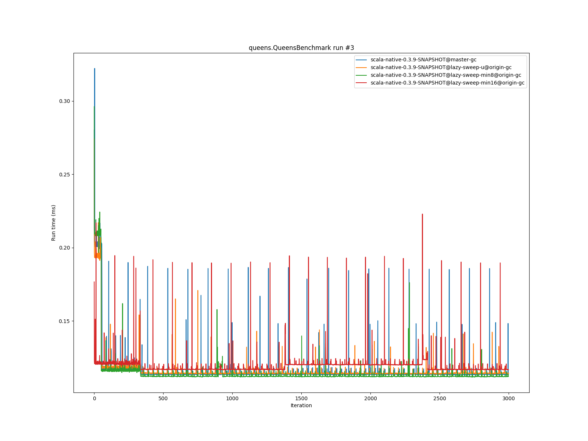

# Summary
## Benchmark run time (ms) at 50 percentile 

|name | scala-native-0.3.9-SNAPSHOT@master-gc | scala-native-0.3.9-SNAPSHOT@lazy-sweep-u@origin-gc |  | scala-native-0.3.9-SNAPSHOT@lazy-sweep-min8@origin-gc |  | scala-native-0.3.9-SNAPSHOT@lazy-sweep-min16@origin-gc | |
| -- | -- | -- | -- | -- | -- | -- | -- |
|[bounce.BounceBenchmark](#bouncebouncebenchmark)|0.0588|0.0587|__-0.22%__|0.0575|__-2.28%__|0.0547|__-7.07%__|
|[brainfuck.BrainfuckBenchmark](#brainfuckbrainfuckbenchmark)|3.3540|3.4744|+3.59%|3.3447|__-0.28%__|3.4095|+1.65%|
|[cd.CDBenchmark](#cdcdbenchmark)|32.8311|31.3808|__-4.42%__|33.4504|+1.89%|33.1639|+1.01%|
|[json.JsonBenchmark](#jsonjsonbenchmark)|1.6341|1.6254|__-0.54%__|1.6510|+1.03%|1.6245|__-0.59%__|
|[kmeans.KmeansBenchmark](#kmeanskmeansbenchmark)|53.6443|52.2276|__-2.64%__|52.8247|__-1.53%__|52.2200|__-2.66%__|
|[list.ListBenchmark](#listlistbenchmark)|0.0643|0.0665|+3.32%|0.0549|__-14.67%__|0.0571|__-11.28%__|
|[mandelbrot.MandelbrotBenchmark](#mandelbrotmandelbrotbenchmark)|126.2417|126.1486|__-0.07%__|126.1284|__-0.09%__|126.1333|__-0.09%__|
|[nbody.NbodyBenchmark](#nbodynbodybenchmark)|39.4775|39.5572|+0.20%|39.4560|__-0.05%__|39.4913|+0.03%|
|[permute.PermuteBenchmark](#permutepermutebenchmark)|0.2039|0.2545|+24.84%|0.2040|+0.08%|0.2442|+19.78%|
|[queens.QueensBenchmark](#queensqueensbenchmark)|0.1137|0.1159|+1.92%|0.1133|__-0.39%__|0.1166|+2.52%|
|[richards.RichardsBenchmark](#richardsrichardsbenchmark)|0.0763|0.0763|__-0.08%__|0.0762|__-0.13%__|0.0758|__-0.64%__|
|[sudoku.SudokuBenchmark](#sudokusudokubenchmark)|2.4608|2.3725|__-3.59%__|2.3812|__-3.23%__|2.3559|__-4.26%__|
|[tracer.TracerBenchmark](#tracertracerbenchmark)|0.7505|0.7762|+3.42%|0.7473|__-0.43%__|0.7548|+0.56%|
| __Geometrical mean:__|| |+1.76%| |__-1.63%__| |__-0.30%__|
## Benchmark run time (ms) at 90 percentile 

|name | scala-native-0.3.9-SNAPSHOT@master-gc | scala-native-0.3.9-SNAPSHOT@lazy-sweep-u@origin-gc |  | scala-native-0.3.9-SNAPSHOT@lazy-sweep-min8@origin-gc |  | scala-native-0.3.9-SNAPSHOT@lazy-sweep-min16@origin-gc | |
| -- | -- | -- | -- | -- | -- | -- | -- |
|[bounce.BounceBenchmark](#bouncebouncebenchmark)|0.0595|0.0592|__-0.52%__|0.0589|__-1.01%__|0.0561|__-5.72%__|
|[brainfuck.BrainfuckBenchmark](#brainfuckbrainfuckbenchmark)|3.4431|3.5461|+2.99%|3.4341|__-0.26%__|3.5013|+1.69%|
|[cd.CDBenchmark](#cdcdbenchmark)|33.5115|31.9820|__-4.56%__|34.0876|+1.72%|33.7975|+0.85%|
|[json.JsonBenchmark](#jsonjsonbenchmark)|1.6803|1.6742|__-0.36%__|1.6957|+0.92%|1.6534|__-1.60%__|
|[kmeans.KmeansBenchmark](#kmeanskmeansbenchmark)|56.2849|53.1383|__-5.59%__|53.5717|__-4.82%__|53.0871|__-5.68%__|
|[list.ListBenchmark](#listlistbenchmark)|0.0656|0.0683|+4.07%|0.0565|__-13.88%__|0.0585|__-10.92%__|
|[mandelbrot.MandelbrotBenchmark](#mandelbrotmandelbrotbenchmark)|127.1121|127.0201|__-0.07%__|126.6594|__-0.36%__|126.8252|__-0.23%__|
|[nbody.NbodyBenchmark](#nbodynbodybenchmark)|40.1422|40.2913|+0.37%|40.2530|+0.28%|40.0615|__-0.20%__|
|[permute.PermuteBenchmark](#permutepermutebenchmark)|0.2111|0.2713|+28.52%|0.2303|+9.11%|0.2601|+23.24%|
|[queens.QueensBenchmark](#queensqueensbenchmark)|0.1167|0.1190|+1.91%|0.1170|+0.20%|0.1204|+3.12%|
|[richards.RichardsBenchmark](#richardsrichardsbenchmark)|0.0785|0.0787|+0.22%|0.0780|__-0.69%__|0.0780|__-0.62%__|
|[sudoku.SudokuBenchmark](#sudokusudokubenchmark)|2.6719|2.5443|__-4.78%__|2.5348|__-5.13%__|2.5129|__-5.95%__|
|[tracer.TracerBenchmark](#tracertracerbenchmark)|0.7662|0.8102|+5.75%|0.7742|+1.05%|0.7933|+3.54%|
| __Geometrical mean:__|| |+1.85%| |__-1.12%__| |__-0.16%__|
## Benchmark run time (ms) at 99 percentile 

|name | scala-native-0.3.9-SNAPSHOT@master-gc | scala-native-0.3.9-SNAPSHOT@lazy-sweep-u@origin-gc |  | scala-native-0.3.9-SNAPSHOT@lazy-sweep-min8@origin-gc |  | scala-native-0.3.9-SNAPSHOT@lazy-sweep-min16@origin-gc | |
| -- | -- | -- | -- | -- | -- | -- | -- |
|[bounce.BounceBenchmark](#bouncebouncebenchmark)|0.0674|0.0684|+1.47%|0.0611|__-9.31%__|0.0579|__-14.20%__|
|[brainfuck.BrainfuckBenchmark](#brainfuckbrainfuckbenchmark)|3.5782|3.6792|+2.82%|3.5423|__-1.00%__|3.6103|+0.90%|
|[cd.CDBenchmark](#cdcdbenchmark)|34.6577|32.7489|__-5.51%__|34.5537|__-0.30%__|34.2933|__-1.05%__|
|[json.JsonBenchmark](#jsonjsonbenchmark)|1.7565|1.7514|__-0.29%__|1.7686|+0.69%|1.7152|__-2.35%__|
|[kmeans.KmeansBenchmark](#kmeanskmeansbenchmark)|59.4711|54.2228|__-8.82%__|54.5485|__-8.28%__|54.0420|__-9.13%__|
|[list.ListBenchmark](#listlistbenchmark)|0.0733|0.0713|__-2.70%__|0.0594|__-19.00%__|0.0607|__-17.21%__|
|[mandelbrot.MandelbrotBenchmark](#mandelbrotmandelbrotbenchmark)|128.8094|128.7383|__-0.06%__|128.9931|+0.14%|129.2848|+0.37%|
|[nbody.NbodyBenchmark](#nbodynbodybenchmark)|41.3540|41.5969|+0.59%|41.4639|+0.27%|41.3387|__-0.04%__|
|[permute.PermuteBenchmark](#permutepermutebenchmark)|0.2459|0.3001|+22.01%|0.2590|+5.33%|0.2812|+14.32%|
|[queens.QueensBenchmark](#queensqueensbenchmark)|0.1345|0.1368|+1.71%|0.1260|__-6.32%__|0.1347|+0.17%|
|[richards.RichardsBenchmark](#richardsrichardsbenchmark)|0.0952|0.0937|__-1.67%__|0.0911|__-4.34%__|0.0882|__-7.38%__|
|[sudoku.SudokuBenchmark](#sudokusudokubenchmark)|2.8524|2.7029|__-5.24%__|2.6614|__-6.69%__|2.6167|__-8.26%__|
|[tracer.TracerBenchmark](#tracertracerbenchmark)|0.8347|0.8715|+4.41%|0.8099|__-2.97%__|0.8449|+1.22%|
| __Geometrical mean:__|| |+0.44%| |__-4.17%__| |__-3.59%__|
## Total GC time (ms) 

|name |  | scala-native-0.3.9-SNAPSHOT@master-gc | scala-native-0.3.9-SNAPSHOT@lazy-sweep-u@origin-gc |  | scala-native-0.3.9-SNAPSHOT@lazy-sweep-min8@origin-gc |  | scala-native-0.3.9-SNAPSHOT@lazy-sweep-min16@origin-gc | |
| -- | -- | -- | -- | -- | -- | -- | -- | -- |
|[bounce.BounceBenchmark](#bouncebouncebenchmark)|mark|2.0981|2.2296|+6.27%|2.1986|+4.79%|2.0622|__-1.71%__|
||sweep|1.5055|1.6260|+8.00%|1.4790|__-1.76%__|1.3653|__-9.31%__|
||total|3.6035|3.8555|+6.99%|3.6777|+2.06%|3.4275|__-4.89%__|
|[brainfuck.BrainfuckBenchmark](#brainfuckbrainfuckbenchmark)|mark|4249.6554|2962.1691|__-30.30%__|3133.2667|__-26.27%__|3312.1865|__-22.06%__|
||sweep|1104.3096|1431.8983|+29.66%|1268.6486|+14.88%|1238.5416|+12.16%|
||total|5353.9650|4394.0674|__-17.93%__|4401.9153|__-17.78%__|4550.7281|__-15.00%__|
|[cd.CDBenchmark](#cdcdbenchmark)|mark|19231.6357|29521.9376|+53.51%|17248.8144|__-10.31%__|22157.1731|+15.21%|
||sweep|17189.0062|24222.2143|+40.92%|23751.9188|+38.18%|20837.9963|+21.23%|
||total|36420.6419|53744.1519|+47.57%|41000.7332|+12.58%|42995.1693|+18.05%|
|[json.JsonBenchmark](#jsonjsonbenchmark)|mark|1654.6457|1481.4015|__-10.47%__|1475.4887|__-10.83%__|1501.3346|__-9.27%__|
||sweep|522.8067|701.3576|+34.15%|619.3023|+18.46%|645.6683|+23.50%|
||total|2177.4524|2182.7591|+0.24%|2094.7910|__-3.80%__|2147.0029|__-1.40%__|
|[kmeans.KmeansBenchmark](#kmeanskmeansbenchmark)|mark|93632.3268|51004.6181|__-45.53%__|40203.9154|__-57.06%__|62159.2505|__-33.61%__|
||sweep|13061.2684|14670.3553|+12.32%|14587.5560|+11.69%|14536.5640|+11.30%|
||total|106693.5952|65674.9734|__-38.45%__|54791.4714|__-48.65%__|76695.8144|__-28.12%__|
|[list.ListBenchmark](#listlistbenchmark)|mark|0.6264|0.6128|__-2.18%__|0.6051|__-3.40%__|0.6164|__-1.60%__|
||sweep|0.3720|0.0989|__-73.41%__|0.1046|__-71.87%__|0.1227|__-67.00%__|
||total|0.9984|0.7117|__-28.72%__|0.7098|__-28.91%__|0.7391|__-25.97%__|
|[mandelbrot.MandelbrotBenchmark](#mandelbrotmandelbrotbenchmark)|mark|0.0000|0.0000|N/A|0.0000|N/A|0.0000|N/A|
||sweep|0.0000|0.0000|N/A|0.0000|N/A|0.0000|N/A|
||total|0.0000|0.0000|N/A|0.0000|N/A|0.0000|N/A|
|[nbody.NbodyBenchmark](#nbodynbodybenchmark)|mark|1591.4349|1588.2371|__-0.20%__|1575.5698|__-1.00%__|1614.3716|+1.44%|
||sweep|1686.2146|2157.4523|+27.95%|2016.1736|+19.57%|1910.8012|+13.32%|
||total|3277.6495|3745.6894|+14.28%|3591.7434|+9.58%|3525.1728|+7.55%|
|[permute.PermuteBenchmark](#permutepermutebenchmark)|mark|59.0019|57.5347|__-2.49%__|53.4098|__-9.48%__|57.2011|__-3.05%__|
||sweep|55.9604|72.6075|+29.75%|60.5779|+8.25%|60.2071|+7.59%|
||total|114.9624|130.1422|+13.20%|113.9877|__-0.85%__|117.4082|+2.13%|
|[queens.QueensBenchmark](#queensqueensbenchmark)|mark|3.7701|4.0031|+6.18%|3.6858|__-2.24%__|3.5914|__-4.74%__|
||sweep|2.6527|3.9102|+47.41%|3.0113|+13.52%|2.9171|+9.97%|
||total|6.4227|7.9134|+23.21%|6.6971|+4.27%|6.5085|+1.34%|
|[richards.RichardsBenchmark](#richardsrichardsbenchmark)|mark|5.5804|5.2439|__-6.03%__|5.2294|__-6.29%__|4.9238|__-11.77%__|
||sweep|4.3183|5.3729|+24.42%|4.6579|+7.87%|4.5116|+4.48%|
||total|9.8987|10.6168|+7.26%|9.8873|__-0.11%__|9.4354|__-4.68%__|
|[sudoku.SudokuBenchmark](#sudokusudokubenchmark)|mark|747.9854|1597.1918|+113.53%|1606.7037|+114.80%|1613.2882|+115.68%|
||sweep|532.5128|732.1223|+37.48%|607.6970|+14.12%|574.7910|+7.94%|
||total|1280.4983|2329.3141|+81.91%|2214.4007|+72.93%|2188.0792|+70.88%|
|[tracer.TracerBenchmark](#tracertracerbenchmark)|mark|653.9944|636.7296|__-2.64%__|583.4612|__-10.78%__|606.3836|__-7.28%__|
||sweep|591.1863|806.8868|+36.49%|627.2903|+6.11%|623.1543|+5.41%|
||total|1245.1807|1443.6164|+15.94%|1210.7514|__-2.77%__|1229.5379|__-1.26%__|
|__Geometrical mean:__|mark|| |+0.76%| |__-7.29%__| |__-1.20%__|
||sweep|| |+13.39%| |+0.90%| |__-0.96%__|
||total|| |+6.19%| |__-3.76%__| |__-0.91%__|
## GC pause time (ms) at 50 percentile 

|name | scala-native-0.3.9-SNAPSHOT@master-gc | scala-native-0.3.9-SNAPSHOT@lazy-sweep-u@origin-gc |  | scala-native-0.3.9-SNAPSHOT@lazy-sweep-min8@origin-gc |  | scala-native-0.3.9-SNAPSHOT@lazy-sweep-min16@origin-gc | |
| -- | -- | -- | -- | -- | -- | -- | -- |
|[bounce.BounceBenchmark](#bouncebouncebenchmark)|0.0331|0.0001|__-99.60%__|0.0010|__-97.00%__|0.0020|__-94.04%__|
|[brainfuck.BrainfuckBenchmark](#brainfuckbrainfuckbenchmark)|0.0691|0.0001|__-99.82%__|0.0010|__-98.61%__|0.0020|__-97.08%__|
|[cd.CDBenchmark](#cdcdbenchmark)|0.1445|0.0002|__-99.88%__|0.0015|__-98.94%__|0.0027|__-98.15%__|
|[json.JsonBenchmark](#jsonjsonbenchmark)|0.0714|0.0001|__-99.82%__|0.0009|__-98.73%__|0.0020|__-97.23%__|
|[kmeans.KmeansBenchmark](#kmeanskmeansbenchmark)|2.9652|0.0002|__-99.99%__|0.0017|__-99.94%__|0.0033|__-99.89%__|
|[list.ListBenchmark](#listlistbenchmark)|0.0464|0.0002|__-99.47%__|0.0021|__-95.54%__|0.0037|__-92.08%__|
|[mandelbrot.MandelbrotBenchmark](#mandelbrotmandelbrotbenchmark)|0.0000|0.0000|N/A|0.0000|N/A|0.0000|N/A|
|[nbody.NbodyBenchmark](#nbodynbodybenchmark)|0.0265|0.0001|__-99.54%__|0.0010|__-96.07%__|0.0020|__-92.48%__|
|[permute.PermuteBenchmark](#permutepermutebenchmark)|0.0280|0.0001|__-99.56%__|0.0009|__-96.71%__|0.0019|__-93.35%__|
|[queens.QueensBenchmark](#queensqueensbenchmark)|0.0332|0.0002|__-99.50%__|0.0010|__-96.85%__|0.0020|__-93.86%__|
|[richards.RichardsBenchmark](#richardsrichardsbenchmark)|0.0309|0.0001|__-99.58%__|0.0009|__-96.97%__|0.0019|__-93.96%__|
|[sudoku.SudokuBenchmark](#sudokusudokubenchmark)|0.2050|0.0002|__-99.91%__|0.0012|__-99.43%__|0.0023|__-98.88%__|
|[tracer.TracerBenchmark](#tracertracerbenchmark)|0.0295|0.0001|__-99.54%__|0.0009|__-96.95%__|0.0018|__-93.80%__|
| __Geometrical mean:__|| |__-99.78%__| |__-98.38%__| |__-96.83%__|
## GC pause time (ms) at 90 percentile 

|name | scala-native-0.3.9-SNAPSHOT@master-gc | scala-native-0.3.9-SNAPSHOT@lazy-sweep-u@origin-gc |  | scala-native-0.3.9-SNAPSHOT@lazy-sweep-min8@origin-gc |  | scala-native-0.3.9-SNAPSHOT@lazy-sweep-min16@origin-gc | |
| -- | -- | -- | -- | -- | -- | -- | -- |
|[bounce.BounceBenchmark](#bouncebouncebenchmark)|0.0454|0.0002|__-99.52%__|0.0019|__-95.83%__|0.0175|__-61.39%__|
|[brainfuck.BrainfuckBenchmark](#brainfuckbrainfuckbenchmark)|0.1092|0.0004|__-99.65%__|0.0028|__-97.40%__|0.0479|__-56.09%__|
|[cd.CDBenchmark](#cdcdbenchmark)|0.1881|0.0003|__-99.85%__|0.0019|__-98.97%__|0.0036|__-98.09%__|
|[json.JsonBenchmark](#jsonjsonbenchmark)|0.0754|0.0004|__-99.43%__|0.0036|__-95.18%__|0.0451|__-40.26%__|
|[kmeans.KmeansBenchmark](#kmeanskmeansbenchmark)|5.0564|0.0005|__-99.99%__|0.0036|__-99.93%__|0.0073|__-99.86%__|
|[list.ListBenchmark](#listlistbenchmark)|0.0616|0.0007|__-98.92%__|0.0297|__-51.77%__|0.0311|__-49.46%__|
|[mandelbrot.MandelbrotBenchmark](#mandelbrotmandelbrotbenchmark)|0.0000|0.0000|N/A|0.0000|N/A|0.0000|N/A|
|[nbody.NbodyBenchmark](#nbodynbodybenchmark)|0.0307|0.0002|__-99.29%__|0.0015|__-95.15%__|0.0118|__-61.57%__|
|[permute.PermuteBenchmark](#permutepermutebenchmark)|0.0305|0.0002|__-99.30%__|0.0012|__-95.96%__|0.0122|__-59.85%__|
|[queens.QueensBenchmark](#queensqueensbenchmark)|0.0456|0.0003|__-99.44%__|0.0017|__-96.26%__|0.0161|__-64.74%__|
|[richards.RichardsBenchmark](#richardsrichardsbenchmark)|0.0422|0.0002|__-99.55%__|0.0015|__-96.53%__|0.0132|__-68.73%__|
|[sudoku.SudokuBenchmark](#sudokusudokubenchmark)|0.2299|0.0004|__-99.83%__|0.0031|__-98.66%__|0.0066|__-97.11%__|
|[tracer.TracerBenchmark](#tracertracerbenchmark)|0.0316|0.0002|__-99.32%__|0.0012|__-96.17%__|0.0133|__-58.02%__|
| __Geometrical mean:__|| |__-99.66%__| |__-97.19%__| |__-83.96%__|
## GC pause time (ms) at 99 percentile 

|name | scala-native-0.3.9-SNAPSHOT@master-gc | scala-native-0.3.9-SNAPSHOT@lazy-sweep-u@origin-gc |  | scala-native-0.3.9-SNAPSHOT@lazy-sweep-min8@origin-gc |  | scala-native-0.3.9-SNAPSHOT@lazy-sweep-min16@origin-gc | |
| -- | -- | -- | -- | -- | -- | -- | -- |
|[bounce.BounceBenchmark](#bouncebouncebenchmark)|0.0605|0.0008|__-98.60%__|0.0281|__-53.60%__|0.0278|__-54.07%__|
|[brainfuck.BrainfuckBenchmark](#brainfuckbrainfuckbenchmark)|0.1331|0.0007|__-99.49%__|0.0544|__-59.16%__|0.0568|__-57.30%__|
|[cd.CDBenchmark](#cdcdbenchmark)|0.2628|0.0006|__-99.79%__|0.0633|__-75.92%__|0.0792|__-69.85%__|
|[json.JsonBenchmark](#jsonjsonbenchmark)|0.1009|0.0007|__-99.33%__|0.0552|__-45.34%__|0.0545|__-45.95%__|
|[kmeans.KmeansBenchmark](#kmeanskmeansbenchmark)|7.7074|0.0008|__-99.99%__|0.0051|__-99.93%__|1.0258|__-86.69%__|
|[list.ListBenchmark](#listlistbenchmark)|0.0635|0.0321|__-49.36%__|0.0349|__-45.00%__|0.0391|__-38.41%__|
|[mandelbrot.MandelbrotBenchmark](#mandelbrotmandelbrotbenchmark)|0.0000|0.0000|N/A|0.0000|N/A|0.0000|N/A|
|[nbody.NbodyBenchmark](#nbodynbodybenchmark)|0.0520|0.0004|__-99.14%__|0.0148|__-71.65%__|0.0158|__-69.68%__|
|[permute.PermuteBenchmark](#permutepermutebenchmark)|0.0512|0.0004|__-99.15%__|0.0154|__-70.04%__|0.0166|__-67.55%__|
|[queens.QueensBenchmark](#queensqueensbenchmark)|0.0612|0.0006|__-98.97%__|0.0254|__-58.45%__|0.0299|__-51.11%__|
|[richards.RichardsBenchmark](#richardsrichardsbenchmark)|0.0581|0.0005|__-99.18%__|0.0193|__-66.74%__|0.0217|__-62.62%__|
|[sudoku.SudokuBenchmark](#sudokusudokubenchmark)|0.2813|0.0006|__-99.79%__|0.1279|__-54.54%__|0.1303|__-53.69%__|
|[tracer.TracerBenchmark](#tracertracerbenchmark)|0.0395|0.0004|__-98.90%__|0.0150|__-62.05%__|0.0160|__-59.52%__|
| __Geometrical mean:__|| |__-99.34%__| |__-77.32%__| |__-62.08%__|
# Individual benchmarks
## bounce.BounceBenchmark

## brainfuck.BrainfuckBenchmark

## cd.CDBenchmark

## json.JsonBenchmark

## kmeans.KmeansBenchmark

## list.ListBenchmark

## mandelbrot.MandelbrotBenchmark

## nbody.NbodyBenchmark

## permute.PermuteBenchmark

## queens.QueensBenchmark

## richards.RichardsBenchmark

## sudoku.SudokuBenchmark

## tracer.TracerBenchmark

