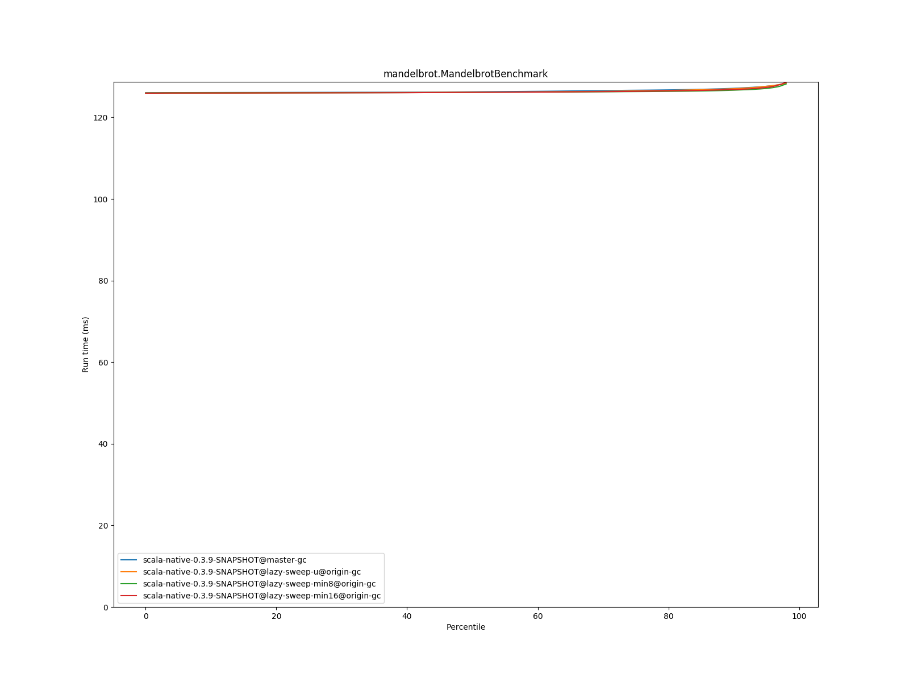

# Summary
## Benchmark run time (ms) at 50 percentile 

|name | scala-native-0.3.9-SNAPSHOT@master-gc | scala-native-0.3.9-SNAPSHOT@lazy-sweep-u@origin-gc |  | scala-native-0.3.9-SNAPSHOT@lazy-sweep-min8@origin-gc |  | scala-native-0.3.9-SNAPSHOT@lazy-sweep-min16@origin-gc | |
| -- | -- | -- | -- | -- | -- | -- | -- |
|[bounce.BounceBenchmark](#bouncebouncebenchmark)|0.0588|0.0587|__-0.22%__|0.0575|__-2.28%__|0.0547|__-7.07%__|
|[brainfuck.BrainfuckBenchmark](#brainfuckbrainfuckbenchmark)|3.3540|3.4744|+3.59%|3.3447|__-0.28%__|3.4095|+1.65%|
|[cd.CDBenchmark](#cdcdbenchmark)|32.8311|31.3808|__-4.42%__|33.4504|+1.89%|33.1639|+1.01%|
|[deltablue.DeltaBlueBenchmark](#deltabluedeltabluebenchmark)|0.1914|0.1928|+0.74%|0.1909|__-0.26%__|0.1845|__-3.60%__|
|[gcbench.GCBenchBenchmark](#gcbenchgcbenchbenchmark)|134.0681|135.8634|+1.34%|135.2294|+0.87%|136.6291|+1.91%|
|[json.JsonBenchmark](#jsonjsonbenchmark)|1.6341|1.6254|__-0.54%__|1.6510|+1.03%|1.6245|__-0.59%__|
|[kmeans.KmeansBenchmark](#kmeanskmeansbenchmark)|53.6443|52.2276|__-2.64%__|52.8247|__-1.53%__|52.2200|__-2.66%__|
|[list.ListBenchmark](#listlistbenchmark)|0.0643|0.0665|+3.32%|0.0549|__-14.67%__|0.0571|__-11.28%__|
|[mandelbrot.MandelbrotBenchmark](#mandelbrotmandelbrotbenchmark)|126.2417|126.1486|__-0.07%__|126.1284|__-0.09%__|126.1333|__-0.09%__|
|[nbody.NbodyBenchmark](#nbodynbodybenchmark)|39.4775|39.5572|+0.20%|39.4560|__-0.05%__|39.4913|+0.03%|
|[permute.PermuteBenchmark](#permutepermutebenchmark)|0.2039|0.2545|+24.84%|0.2040|+0.08%|0.2442|+19.78%|
|[queens.QueensBenchmark](#queensqueensbenchmark)|0.1137|0.1159|+1.92%|0.1133|__-0.39%__|0.1166|+2.52%|
|[richards.RichardsBenchmark](#richardsrichardsbenchmark)|0.0763|0.0763|__-0.08%__|0.0762|__-0.13%__|0.0758|__-0.64%__|
|[sudoku.SudokuBenchmark](#sudokusudokubenchmark)|2.4608|2.3725|__-3.59%__|2.3812|__-3.23%__|2.3559|__-4.26%__|
|[tracer.TracerBenchmark](#tracertracerbenchmark)|0.7505|0.7762|+3.42%|0.7473|__-0.43%__|0.7548|+0.56%|
| __Geometrical mean:__|| |+1.66%| |__-1.38%__| |__-0.38%__|
## Benchmark run time (ms) at 90 percentile 

|name | scala-native-0.3.9-SNAPSHOT@master-gc | scala-native-0.3.9-SNAPSHOT@lazy-sweep-u@origin-gc |  | scala-native-0.3.9-SNAPSHOT@lazy-sweep-min8@origin-gc |  | scala-native-0.3.9-SNAPSHOT@lazy-sweep-min16@origin-gc | |
| -- | -- | -- | -- | -- | -- | -- | -- |
|[bounce.BounceBenchmark](#bouncebouncebenchmark)|0.0595|0.0592|__-0.52%__|0.0589|__-1.01%__|0.0561|__-5.72%__|
|[brainfuck.BrainfuckBenchmark](#brainfuckbrainfuckbenchmark)|3.4431|3.5461|+2.99%|3.4341|__-0.26%__|3.5013|+1.69%|
|[cd.CDBenchmark](#cdcdbenchmark)|33.5115|31.9820|__-4.56%__|34.0876|+1.72%|33.7975|+0.85%|
|[deltablue.DeltaBlueBenchmark](#deltabluedeltabluebenchmark)|0.2002|0.2098|+4.78%|0.1966|__-1.82%__|0.1903|__-4.95%__|
|[gcbench.GCBenchBenchmark](#gcbenchgcbenchbenchmark)|137.3548|137.1064|__-0.18%__|137.4156|+0.04%|138.4487|+0.80%|
|[json.JsonBenchmark](#jsonjsonbenchmark)|1.6803|1.6742|__-0.36%__|1.6957|+0.92%|1.6534|__-1.60%__|
|[kmeans.KmeansBenchmark](#kmeanskmeansbenchmark)|56.2849|53.1383|__-5.59%__|53.5717|__-4.82%__|53.0871|__-5.68%__|
|[list.ListBenchmark](#listlistbenchmark)|0.0656|0.0683|+4.07%|0.0565|__-13.88%__|0.0585|__-10.92%__|
|[mandelbrot.MandelbrotBenchmark](#mandelbrotmandelbrotbenchmark)|127.1121|127.0201|__-0.07%__|126.6594|__-0.36%__|126.8252|__-0.23%__|
|[nbody.NbodyBenchmark](#nbodynbodybenchmark)|40.1422|40.2913|+0.37%|40.2530|+0.28%|40.0615|__-0.20%__|
|[permute.PermuteBenchmark](#permutepermutebenchmark)|0.2111|0.2713|+28.52%|0.2303|+9.11%|0.2601|+23.24%|
|[queens.QueensBenchmark](#queensqueensbenchmark)|0.1167|0.1190|+1.91%|0.1170|+0.20%|0.1204|+3.12%|
|[richards.RichardsBenchmark](#richardsrichardsbenchmark)|0.0785|0.0787|+0.22%|0.0780|__-0.69%__|0.0780|__-0.62%__|
|[sudoku.SudokuBenchmark](#sudokusudokubenchmark)|2.6719|2.5443|__-4.78%__|2.5348|__-5.13%__|2.5129|__-5.95%__|
|[tracer.TracerBenchmark](#tracertracerbenchmark)|0.7662|0.8102|+5.75%|0.7742|+1.05%|0.7933|+3.54%|
| __Geometrical mean:__|| |+1.91%| |__-1.09%__| |__-0.43%__|
## Benchmark run time (ms) at 99 percentile 

|name | scala-native-0.3.9-SNAPSHOT@master-gc | scala-native-0.3.9-SNAPSHOT@lazy-sweep-u@origin-gc |  | scala-native-0.3.9-SNAPSHOT@lazy-sweep-min8@origin-gc |  | scala-native-0.3.9-SNAPSHOT@lazy-sweep-min16@origin-gc | |
| -- | -- | -- | -- | -- | -- | -- | -- |
|[bounce.BounceBenchmark](#bouncebouncebenchmark)|0.0674|0.0684|+1.47%|0.0611|__-9.31%__|0.0579|__-14.20%__|
|[brainfuck.BrainfuckBenchmark](#brainfuckbrainfuckbenchmark)|3.5782|3.6792|+2.82%|3.5423|__-1.00%__|3.6103|+0.90%|
|[cd.CDBenchmark](#cdcdbenchmark)|34.6577|32.7489|__-5.51%__|34.5537|__-0.30%__|34.2933|__-1.05%__|
|[deltablue.DeltaBlueBenchmark](#deltabluedeltabluebenchmark)|0.2703|0.2414|__-10.69%__|0.2250|__-16.75%__|0.2246|__-16.92%__|
|[gcbench.GCBenchBenchmark](#gcbenchgcbenchbenchmark)|139.9987|138.5020|__-1.07%__|138.8932|__-0.79%__|139.6803|__-0.23%__|
|[json.JsonBenchmark](#jsonjsonbenchmark)|1.7565|1.7514|__-0.29%__|1.7686|+0.69%|1.7152|__-2.35%__|
|[kmeans.KmeansBenchmark](#kmeanskmeansbenchmark)|59.4711|54.2228|__-8.82%__|54.5485|__-8.28%__|54.0420|__-9.13%__|
|[list.ListBenchmark](#listlistbenchmark)|0.0733|0.0713|__-2.70%__|0.0594|__-19.00%__|0.0607|__-17.21%__|
|[mandelbrot.MandelbrotBenchmark](#mandelbrotmandelbrotbenchmark)|128.8094|128.7383|__-0.06%__|128.9931|+0.14%|129.2848|+0.37%|
|[nbody.NbodyBenchmark](#nbodynbodybenchmark)|41.3540|41.5969|+0.59%|41.4639|+0.27%|41.3387|__-0.04%__|
|[permute.PermuteBenchmark](#permutepermutebenchmark)|0.2459|0.3001|+22.01%|0.2590|+5.33%|0.2812|+14.32%|
|[queens.QueensBenchmark](#queensqueensbenchmark)|0.1345|0.1368|+1.71%|0.1260|__-6.32%__|0.1347|+0.17%|
|[richards.RichardsBenchmark](#richardsrichardsbenchmark)|0.0952|0.0937|__-1.67%__|0.0911|__-4.34%__|0.0882|__-7.38%__|
|[sudoku.SudokuBenchmark](#sudokusudokubenchmark)|2.8524|2.7029|__-5.24%__|2.6614|__-6.69%__|2.6167|__-8.26%__|
|[tracer.TracerBenchmark](#tracertracerbenchmark)|0.8347|0.8715|+4.41%|0.8099|__-2.97%__|0.8449|+1.22%|
| __Geometrical mean:__|| |__-0.45%__| |__-4.85%__| |__-4.32%__|
# Individual benchmarks
## bounce.BounceBenchmark

## brainfuck.BrainfuckBenchmark

## cd.CDBenchmark

## deltablue.DeltaBlueBenchmark

## gcbench.GCBenchBenchmark

## json.JsonBenchmark

## kmeans.KmeansBenchmark

## list.ListBenchmark

## mandelbrot.MandelbrotBenchmark

## nbody.NbodyBenchmark

## permute.PermuteBenchmark

## queens.QueensBenchmark

## richards.RichardsBenchmark

## sudoku.SudokuBenchmark

## tracer.TracerBenchmark

