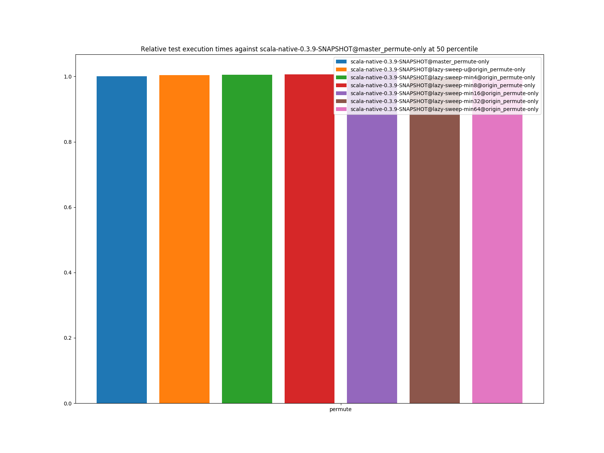
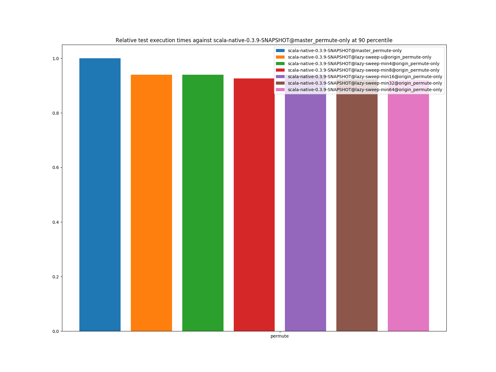
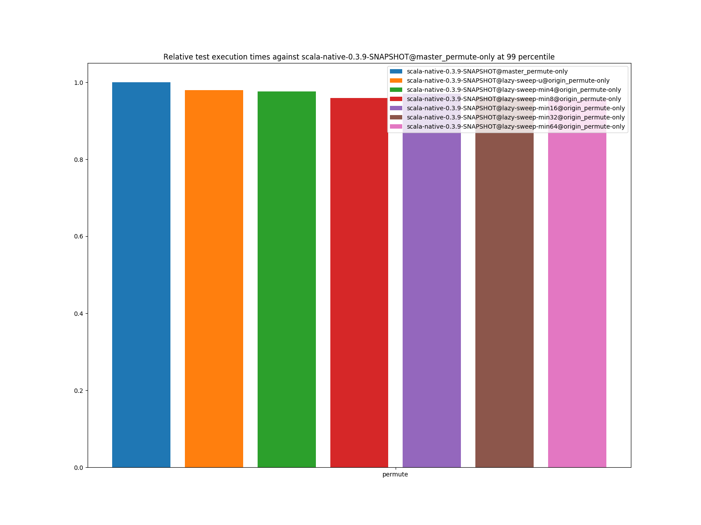
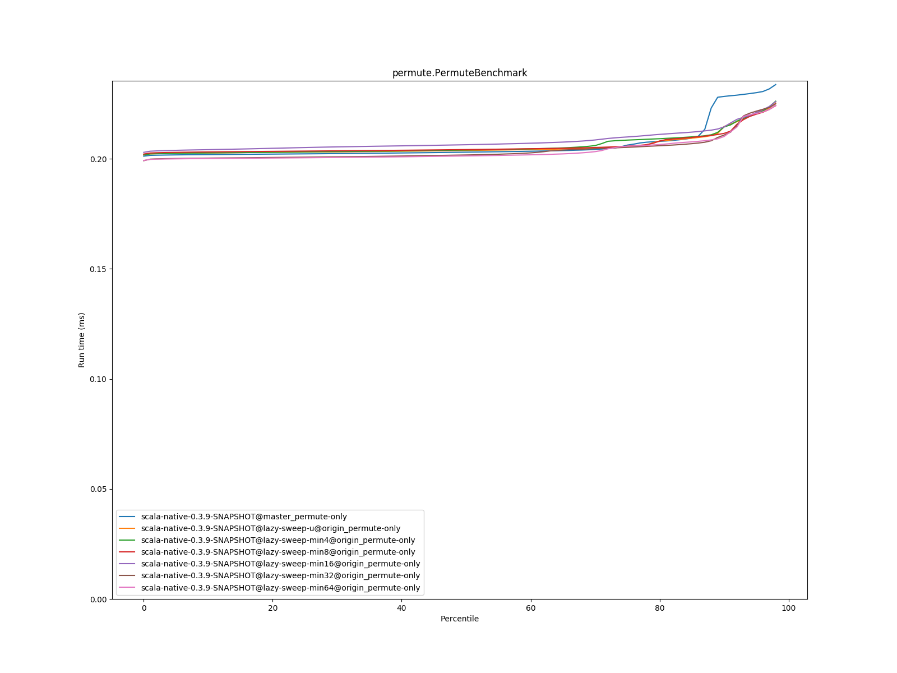
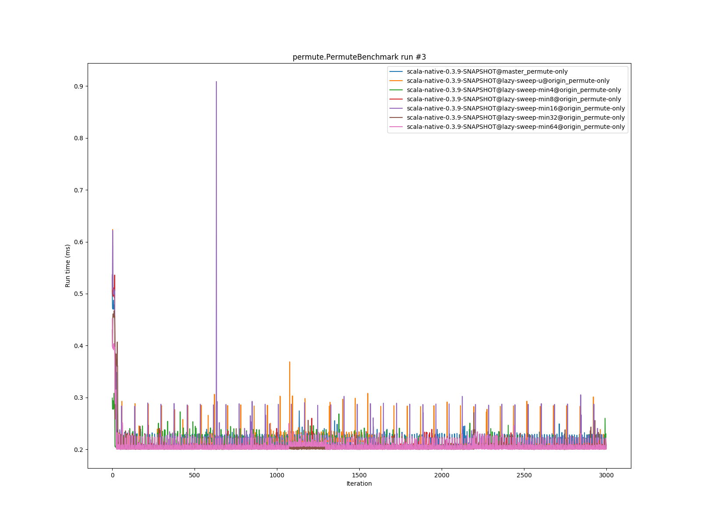

# Summary
## Benchmark run time (ms) at 50 percentile 

|name | scala-native-0.3.9-SNAPSHOT@master_permute-only | scala-native-0.3.9-SNAPSHOT@lazy-sweep-u@origin_permute-only |  | scala-native-0.3.9-SNAPSHOT@lazy-sweep-min4@origin_permute-only |  | scala-native-0.3.9-SNAPSHOT@lazy-sweep-min8@origin_permute-only |  | scala-native-0.3.9-SNAPSHOT@lazy-sweep-min16@origin_permute-only |  | scala-native-0.3.9-SNAPSHOT@lazy-sweep-min32@origin_permute-only |  | scala-native-0.3.9-SNAPSHOT@lazy-sweep-min64@origin_permute-only | |
| -- | -- | -- | -- | -- | -- | -- | -- | -- | -- | -- | -- | -- | -- |
|[permute.PermuteBenchmark](#permutepermutebenchmark)|0.2031|0.2038|+0.38%|0.2040|+0.48%|0.2042|+0.58%|0.2064|+1.66%|0.2018|__-0.63%__|0.2014|__-0.84%__|
| __Geometrical mean:__|| |+0.38%| |+0.48%| |+0.58%| |+1.66%| |__-0.63%__| |__-0.84%__|
## Benchmark run time (ms) at 90 percentile 

|name | scala-native-0.3.9-SNAPSHOT@master_permute-only | scala-native-0.3.9-SNAPSHOT@lazy-sweep-u@origin_permute-only |  | scala-native-0.3.9-SNAPSHOT@lazy-sweep-min4@origin_permute-only |  | scala-native-0.3.9-SNAPSHOT@lazy-sweep-min8@origin_permute-only |  | scala-native-0.3.9-SNAPSHOT@lazy-sweep-min16@origin_permute-only |  | scala-native-0.3.9-SNAPSHOT@lazy-sweep-min32@origin_permute-only |  | scala-native-0.3.9-SNAPSHOT@lazy-sweep-min64@origin_permute-only | |
| -- | -- | -- | -- | -- | -- | -- | -- | -- | -- | -- | -- | -- | -- |
|[permute.PermuteBenchmark](#permutepermutebenchmark)|0.2284|0.2147|__-5.99%__|0.2145|__-6.08%__|0.2116|__-7.35%__|0.2145|__-6.06%__|0.2108|__-7.68%__|0.2102|__-7.97%__|
| __Geometrical mean:__|| |__-5.99%__| |__-6.08%__| |__-7.35%__| |__-6.06%__| |__-7.68%__| |__-7.97%__|
## Benchmark run time (ms) at 99 percentile 

|name | scala-native-0.3.9-SNAPSHOT@master_permute-only | scala-native-0.3.9-SNAPSHOT@lazy-sweep-u@origin_permute-only |  | scala-native-0.3.9-SNAPSHOT@lazy-sweep-min4@origin_permute-only |  | scala-native-0.3.9-SNAPSHOT@lazy-sweep-min8@origin_permute-only |  | scala-native-0.3.9-SNAPSHOT@lazy-sweep-min16@origin_permute-only |  | scala-native-0.3.9-SNAPSHOT@lazy-sweep-min32@origin_permute-only |  | scala-native-0.3.9-SNAPSHOT@lazy-sweep-min64@origin_permute-only | |
| -- | -- | -- | -- | -- | -- | -- | -- | -- | -- | -- | -- | -- | -- |
|[permute.PermuteBenchmark](#permutepermutebenchmark)|0.2383|0.2335|__-2.02%__|0.2326|__-2.37%__|0.2287|__-4.03%__|0.2313|__-2.92%__|0.2289|__-3.93%__|0.2274|__-4.59%__|
| __Geometrical mean:__|| |__-2.02%__| |__-2.37%__| |__-4.03%__| |__-2.92%__| |__-3.93%__| |__-4.59%__|
# Individual benchmarks
## permute.PermuteBenchmark

