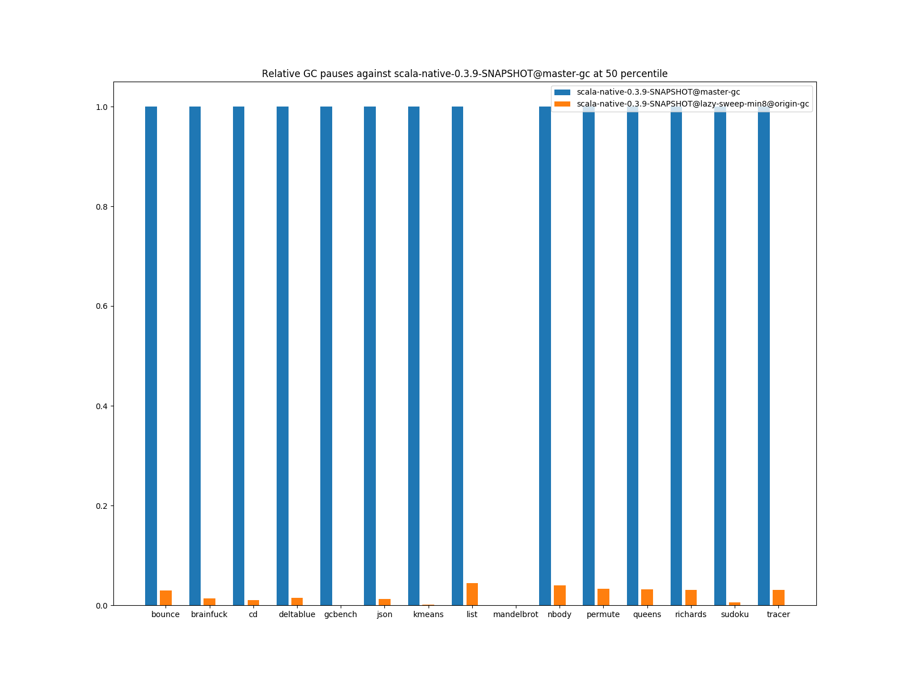
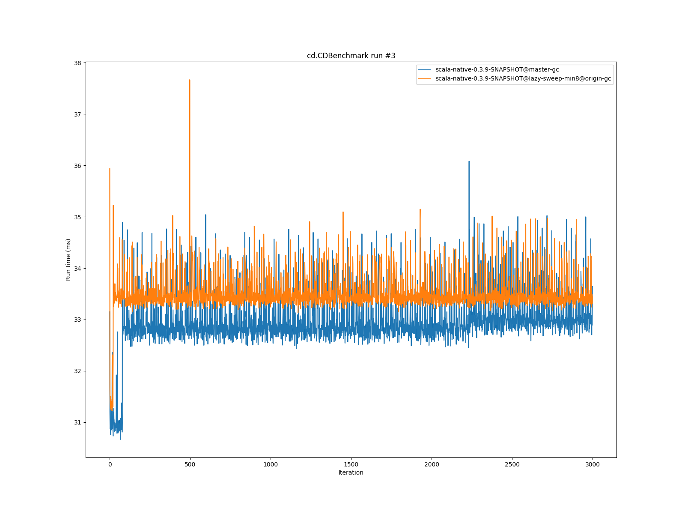
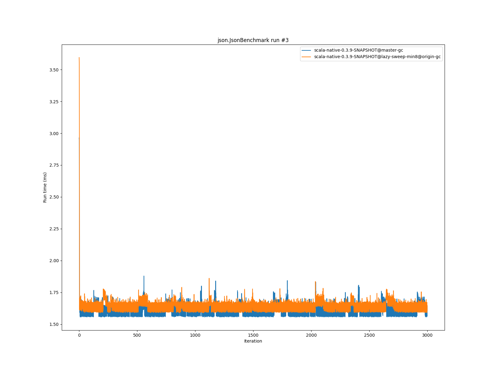
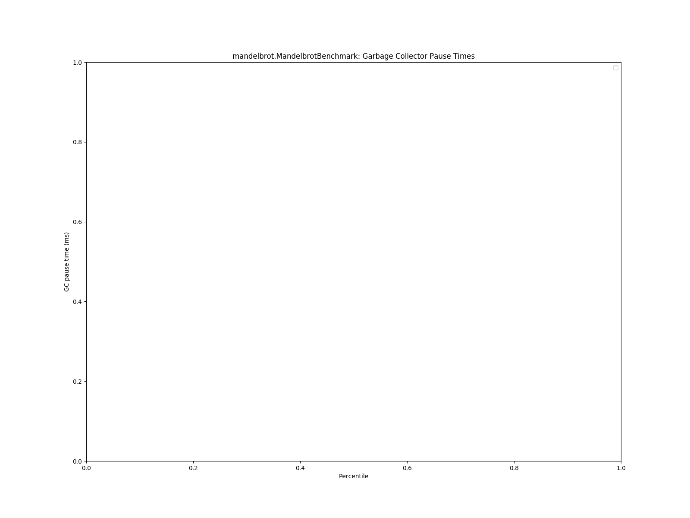
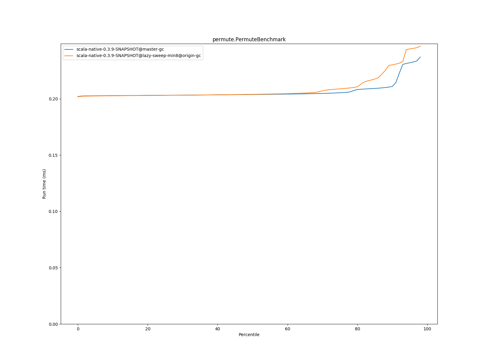
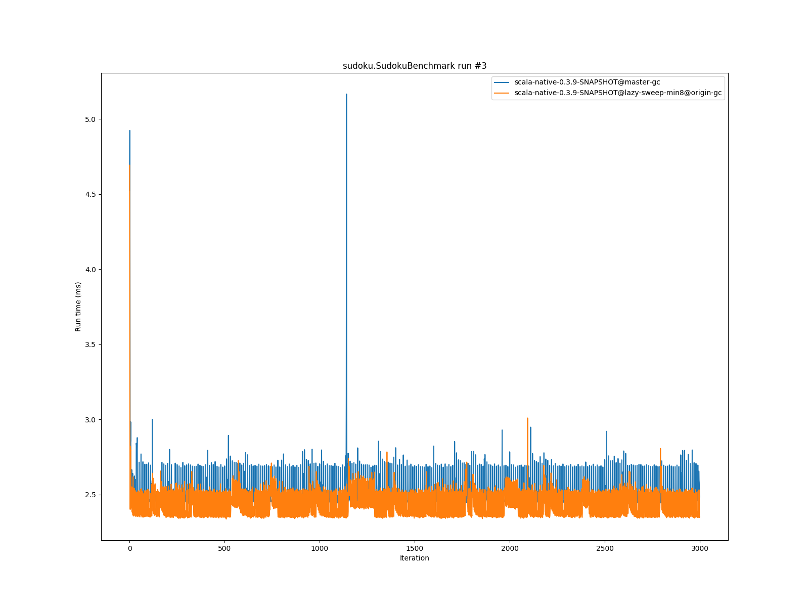

# Summary
## Benchmark run time (ms) at 50 percentile 

|name | scala-native-0.3.9-SNAPSHOT@master-gc | scala-native-0.3.9-SNAPSHOT@lazy-sweep-min8@origin-gc | |
| -- | -- | -- | -- |
|[bounce.BounceBenchmark](#bouncebouncebenchmark)|0.0588|0.0575|__-2.28%__|
|[brainfuck.BrainfuckBenchmark](#brainfuckbrainfuckbenchmark)|3.3540|3.3447|__-0.28%__|
|[cd.CDBenchmark](#cdcdbenchmark)|32.8311|33.4504|+1.89%|
|[deltablue.DeltaBlueBenchmark](#deltabluedeltabluebenchmark)|0.1914|0.1909|__-0.26%__|
|[gcbench.GCBenchBenchmark](#gcbenchgcbenchbenchmark)|134.0681|135.2294|+0.87%|
|[json.JsonBenchmark](#jsonjsonbenchmark)|1.6341|1.6510|+1.03%|
|[kmeans.KmeansBenchmark](#kmeanskmeansbenchmark)|53.6443|52.8247|__-1.53%__|
|[list.ListBenchmark](#listlistbenchmark)|0.0643|0.0549|__-14.67%__|
|[mandelbrot.MandelbrotBenchmark](#mandelbrotmandelbrotbenchmark)|126.2417|126.1284|__-0.09%__|
|[nbody.NbodyBenchmark](#nbodynbodybenchmark)|39.4775|39.4560|__-0.05%__|
|[permute.PermuteBenchmark](#permutepermutebenchmark)|0.2039|0.2040|+0.08%|
|[queens.QueensBenchmark](#queensqueensbenchmark)|0.1137|0.1133|__-0.39%__|
|[richards.RichardsBenchmark](#richardsrichardsbenchmark)|0.0763|0.0762|__-0.13%__|
|[sudoku.SudokuBenchmark](#sudokusudokubenchmark)|2.4608|2.3812|__-3.23%__|
|[tracer.TracerBenchmark](#tracertracerbenchmark)|0.7505|0.7473|__-0.43%__|
| __Geometrical mean:__|| |__-1.38%__|
## Benchmark run time (ms) at 90 percentile 

|name | scala-native-0.3.9-SNAPSHOT@master-gc | scala-native-0.3.9-SNAPSHOT@lazy-sweep-min8@origin-gc | |
| -- | -- | -- | -- |
|[bounce.BounceBenchmark](#bouncebouncebenchmark)|0.0595|0.0589|__-1.01%__|
|[brainfuck.BrainfuckBenchmark](#brainfuckbrainfuckbenchmark)|3.4431|3.4341|__-0.26%__|
|[cd.CDBenchmark](#cdcdbenchmark)|33.5115|34.0876|+1.72%|
|[deltablue.DeltaBlueBenchmark](#deltabluedeltabluebenchmark)|0.2002|0.1966|__-1.82%__|
|[gcbench.GCBenchBenchmark](#gcbenchgcbenchbenchmark)|137.3548|137.4156|+0.04%|
|[json.JsonBenchmark](#jsonjsonbenchmark)|1.6803|1.6957|+0.92%|
|[kmeans.KmeansBenchmark](#kmeanskmeansbenchmark)|56.2849|53.5717|__-4.82%__|
|[list.ListBenchmark](#listlistbenchmark)|0.0656|0.0565|__-13.88%__|
|[mandelbrot.MandelbrotBenchmark](#mandelbrotmandelbrotbenchmark)|127.1121|126.6594|__-0.36%__|
|[nbody.NbodyBenchmark](#nbodynbodybenchmark)|40.1422|40.2530|+0.28%|
|[permute.PermuteBenchmark](#permutepermutebenchmark)|0.2111|0.2303|+9.11%|
|[queens.QueensBenchmark](#queensqueensbenchmark)|0.1167|0.1170|+0.20%|
|[richards.RichardsBenchmark](#richardsrichardsbenchmark)|0.0785|0.0780|__-0.69%__|
|[sudoku.SudokuBenchmark](#sudokusudokubenchmark)|2.6719|2.5348|__-5.13%__|
|[tracer.TracerBenchmark](#tracertracerbenchmark)|0.7662|0.7742|+1.05%|
| __Geometrical mean:__|| |__-1.09%__|
## Benchmark run time (ms) at 99 percentile 

|name | scala-native-0.3.9-SNAPSHOT@master-gc | scala-native-0.3.9-SNAPSHOT@lazy-sweep-min8@origin-gc | |
| -- | -- | -- | -- |
|[bounce.BounceBenchmark](#bouncebouncebenchmark)|0.0674|0.0611|__-9.31%__|
|[brainfuck.BrainfuckBenchmark](#brainfuckbrainfuckbenchmark)|3.5782|3.5423|__-1.00%__|
|[cd.CDBenchmark](#cdcdbenchmark)|34.6577|34.5537|__-0.30%__|
|[deltablue.DeltaBlueBenchmark](#deltabluedeltabluebenchmark)|0.2703|0.2250|__-16.75%__|
|[gcbench.GCBenchBenchmark](#gcbenchgcbenchbenchmark)|139.9987|138.8932|__-0.79%__|
|[json.JsonBenchmark](#jsonjsonbenchmark)|1.7565|1.7686|+0.69%|
|[kmeans.KmeansBenchmark](#kmeanskmeansbenchmark)|59.4711|54.5485|__-8.28%__|
|[list.ListBenchmark](#listlistbenchmark)|0.0733|0.0594|__-19.00%__|
|[mandelbrot.MandelbrotBenchmark](#mandelbrotmandelbrotbenchmark)|128.8094|128.9931|+0.14%|
|[nbody.NbodyBenchmark](#nbodynbodybenchmark)|41.3540|41.4639|+0.27%|
|[permute.PermuteBenchmark](#permutepermutebenchmark)|0.2459|0.2590|+5.33%|
|[queens.QueensBenchmark](#queensqueensbenchmark)|0.1345|0.1260|__-6.32%__|
|[richards.RichardsBenchmark](#richardsrichardsbenchmark)|0.0952|0.0911|__-4.34%__|
|[sudoku.SudokuBenchmark](#sudokusudokubenchmark)|2.8524|2.6614|__-6.69%__|
|[tracer.TracerBenchmark](#tracertracerbenchmark)|0.8347|0.8099|__-2.97%__|
| __Geometrical mean:__|| |__-4.85%__|
## Total GC time (ms) 

|name |  | scala-native-0.3.9-SNAPSHOT@master-gc | scala-native-0.3.9-SNAPSHOT@lazy-sweep-min8@origin-gc | |
| -- | -- | -- | -- | -- |
|[bounce.BounceBenchmark](#bouncebouncebenchmark)|mark|2.0981|2.1986|+4.79%|
||sweep|1.5055|1.4790|__-1.76%__|
||total|3.6035|3.6777|+2.06%|
|[brainfuck.BrainfuckBenchmark](#brainfuckbrainfuckbenchmark)|mark|4249.6554|3133.2667|__-26.27%__|
||sweep|1104.3096|1268.6486|+14.88%|
||total|5353.9650|4401.9153|__-17.78%__|
|[cd.CDBenchmark](#cdcdbenchmark)|mark|19231.6357|17248.8144|__-10.31%__|
||sweep|17189.0062|23751.9188|+38.18%|
||total|36420.6419|41000.7332|+12.58%|
|[deltablue.DeltaBlueBenchmark](#deltabluedeltabluebenchmark)|mark|127.8300|73.3416|__-42.63%__|
||sweep|39.8346|42.6842|+7.15%|
||total|167.6645|116.0257|__-30.80%__|
|[gcbench.GCBenchBenchmark](#gcbenchgcbenchbenchmark)|mark|1971714.7835|1976996.7619|+0.27%|
||sweep|205181.6443|264822.1589|+29.07%|
||total|2176896.4279|2241818.9208|+2.98%|
|[json.JsonBenchmark](#jsonjsonbenchmark)|mark|1654.6457|1475.4887|__-10.83%__|
||sweep|522.8067|619.3023|+18.46%|
||total|2177.4524|2094.7910|__-3.80%__|
|[kmeans.KmeansBenchmark](#kmeanskmeansbenchmark)|mark|93632.3268|40203.9154|__-57.06%__|
||sweep|13061.2684|14587.5560|+11.69%|
||total|106693.5952|54791.4714|__-48.65%__|
|[list.ListBenchmark](#listlistbenchmark)|mark|0.6264|0.6051|__-3.40%__|
||sweep|0.3720|0.1046|__-71.87%__|
||total|0.9984|0.7098|__-28.91%__|
|[mandelbrot.MandelbrotBenchmark](#mandelbrotmandelbrotbenchmark)|mark|0.0000|0.0000|N/A|
||sweep|0.0000|0.0000|N/A|
||total|0.0000|0.0000|N/A|
|[nbody.NbodyBenchmark](#nbodynbodybenchmark)|mark|1591.4349|1575.5698|__-1.00%__|
||sweep|1686.2146|2016.1736|+19.57%|
||total|3277.6495|3591.7434|+9.58%|
|[permute.PermuteBenchmark](#permutepermutebenchmark)|mark|59.0019|53.4098|__-9.48%__|
||sweep|55.9604|60.5779|+8.25%|
||total|114.9624|113.9877|__-0.85%__|
|[queens.QueensBenchmark](#queensqueensbenchmark)|mark|3.7701|3.6858|__-2.24%__|
||sweep|2.6527|3.0113|+13.52%|
||total|6.4227|6.6971|+4.27%|
|[richards.RichardsBenchmark](#richardsrichardsbenchmark)|mark|5.5804|5.2294|__-6.29%__|
||sweep|4.3183|4.6579|+7.87%|
||total|9.8987|9.8873|__-0.11%__|
|[sudoku.SudokuBenchmark](#sudokusudokubenchmark)|mark|747.9854|1606.7037|+114.80%|
||sweep|532.5128|607.6970|+14.12%|
||total|1280.4983|2214.4007|+72.93%|
|[tracer.TracerBenchmark](#tracertracerbenchmark)|mark|653.9944|583.4612|__-10.78%__|
||sweep|591.1863|627.2903|+6.11%|
||total|1245.1807|1210.7514|__-2.77%__|
|__Geometrical mean:__|mark|| |__-9.91%__|
||sweep|| |+3.13%|
||total|| |__-5.55%__|
## GC pause time (ms) at 50 percentile 

|name | scala-native-0.3.9-SNAPSHOT@master-gc | scala-native-0.3.9-SNAPSHOT@lazy-sweep-min8@origin-gc | |
| -- | -- | -- | -- |
|[bounce.BounceBenchmark](#bouncebouncebenchmark)|0.0331|0.0010|__-97.00%__|
|[brainfuck.BrainfuckBenchmark](#brainfuckbrainfuckbenchmark)|0.0691|0.0010|__-98.61%__|
|[cd.CDBenchmark](#cdcdbenchmark)|0.1445|0.0015|__-98.94%__|
|[deltablue.DeltaBlueBenchmark](#deltabluedeltabluebenchmark)|0.0608|0.0009|__-98.51%__|
|[gcbench.GCBenchBenchmark](#gcbenchgcbenchbenchmark)|3.8029|0.0020|__-99.95%__|
|[json.JsonBenchmark](#jsonjsonbenchmark)|0.0714|0.0009|__-98.73%__|
|[kmeans.KmeansBenchmark](#kmeanskmeansbenchmark)|2.9652|0.0017|__-99.94%__|
|[list.ListBenchmark](#listlistbenchmark)|0.0464|0.0021|__-95.54%__|
|[mandelbrot.MandelbrotBenchmark](#mandelbrotmandelbrotbenchmark)|0.0000|0.0000|N/A|
|[nbody.NbodyBenchmark](#nbodynbodybenchmark)|0.0265|0.0010|__-96.07%__|
|[permute.PermuteBenchmark](#permutepermutebenchmark)|0.0280|0.0009|__-96.71%__|
|[queens.QueensBenchmark](#queensqueensbenchmark)|0.0332|0.0010|__-96.85%__|
|[richards.RichardsBenchmark](#richardsrichardsbenchmark)|0.0309|0.0009|__-96.97%__|
|[sudoku.SudokuBenchmark](#sudokusudokubenchmark)|0.2050|0.0012|__-99.43%__|
|[tracer.TracerBenchmark](#tracertracerbenchmark)|0.0295|0.0009|__-96.95%__|
| __Geometrical mean:__|| |__-98.74%__|
## GC pause time (ms) at 90 percentile 

|name | scala-native-0.3.9-SNAPSHOT@master-gc | scala-native-0.3.9-SNAPSHOT@lazy-sweep-min8@origin-gc | |
| -- | -- | -- | -- |
|[bounce.BounceBenchmark](#bouncebouncebenchmark)|0.0454|0.0019|__-95.83%__|
|[brainfuck.BrainfuckBenchmark](#brainfuckbrainfuckbenchmark)|0.1092|0.0028|__-97.40%__|
|[cd.CDBenchmark](#cdcdbenchmark)|0.1881|0.0019|__-98.97%__|
|[deltablue.DeltaBlueBenchmark](#deltabluedeltabluebenchmark)|0.0776|0.0020|__-97.37%__|
|[gcbench.GCBenchBenchmark](#gcbenchgcbenchbenchmark)|5.1933|0.0025|__-99.95%__|
|[json.JsonBenchmark](#jsonjsonbenchmark)|0.0754|0.0036|__-95.18%__|
|[kmeans.KmeansBenchmark](#kmeanskmeansbenchmark)|5.0564|0.0036|__-99.93%__|
|[list.ListBenchmark](#listlistbenchmark)|0.0616|0.0297|__-51.77%__|
|[mandelbrot.MandelbrotBenchmark](#mandelbrotmandelbrotbenchmark)|0.0000|0.0000|N/A|
|[nbody.NbodyBenchmark](#nbodynbodybenchmark)|0.0307|0.0015|__-95.15%__|
|[permute.PermuteBenchmark](#permutepermutebenchmark)|0.0305|0.0012|__-95.96%__|
|[queens.QueensBenchmark](#queensqueensbenchmark)|0.0456|0.0017|__-96.26%__|
|[richards.RichardsBenchmark](#richardsrichardsbenchmark)|0.0422|0.0015|__-96.53%__|
|[sudoku.SudokuBenchmark](#sudokusudokubenchmark)|0.2299|0.0031|__-98.66%__|
|[tracer.TracerBenchmark](#tracertracerbenchmark)|0.0316|0.0012|__-96.17%__|
| __Geometrical mean:__|| |__-97.91%__|
## GC pause time (ms) at 99 percentile 

|name | scala-native-0.3.9-SNAPSHOT@master-gc | scala-native-0.3.9-SNAPSHOT@lazy-sweep-min8@origin-gc | |
| -- | -- | -- | -- |
|[bounce.BounceBenchmark](#bouncebouncebenchmark)|0.0605|0.0281|__-53.60%__|
|[brainfuck.BrainfuckBenchmark](#brainfuckbrainfuckbenchmark)|0.1331|0.0544|__-59.16%__|
|[cd.CDBenchmark](#cdcdbenchmark)|0.2628|0.0633|__-75.92%__|
|[deltablue.DeltaBlueBenchmark](#deltabluedeltabluebenchmark)|0.1035|0.0294|__-71.60%__|
|[gcbench.GCBenchBenchmark](#gcbenchgcbenchbenchmark)|8.6813|0.0051|__-99.94%__|
|[json.JsonBenchmark](#jsonjsonbenchmark)|0.1009|0.0552|__-45.34%__|
|[kmeans.KmeansBenchmark](#kmeanskmeansbenchmark)|7.7074|0.0051|__-99.93%__|
|[list.ListBenchmark](#listlistbenchmark)|0.0635|0.0349|__-45.00%__|
|[mandelbrot.MandelbrotBenchmark](#mandelbrotmandelbrotbenchmark)|0.0000|0.0000|N/A|
|[nbody.NbodyBenchmark](#nbodynbodybenchmark)|0.0520|0.0148|__-71.65%__|
|[permute.PermuteBenchmark](#permutepermutebenchmark)|0.0512|0.0154|__-70.04%__|
|[queens.QueensBenchmark](#queensqueensbenchmark)|0.0612|0.0254|__-58.45%__|
|[richards.RichardsBenchmark](#richardsrichardsbenchmark)|0.0581|0.0193|__-66.74%__|
|[sudoku.SudokuBenchmark](#sudokusudokubenchmark)|0.2813|0.1279|__-54.54%__|
|[tracer.TracerBenchmark](#tracertracerbenchmark)|0.0395|0.0150|__-62.05%__|
| __Geometrical mean:__|| |__-84.94%__|
# Individual benchmarks
## bounce.BounceBenchmark

## brainfuck.BrainfuckBenchmark

## cd.CDBenchmark

## deltablue.DeltaBlueBenchmark

## gcbench.GCBenchBenchmark

## json.JsonBenchmark

## kmeans.KmeansBenchmark

## list.ListBenchmark

## mandelbrot.MandelbrotBenchmark

## nbody.NbodyBenchmark

## permute.PermuteBenchmark

## queens.QueensBenchmark

## richards.RichardsBenchmark

## sudoku.SudokuBenchmark

## tracer.TracerBenchmark

