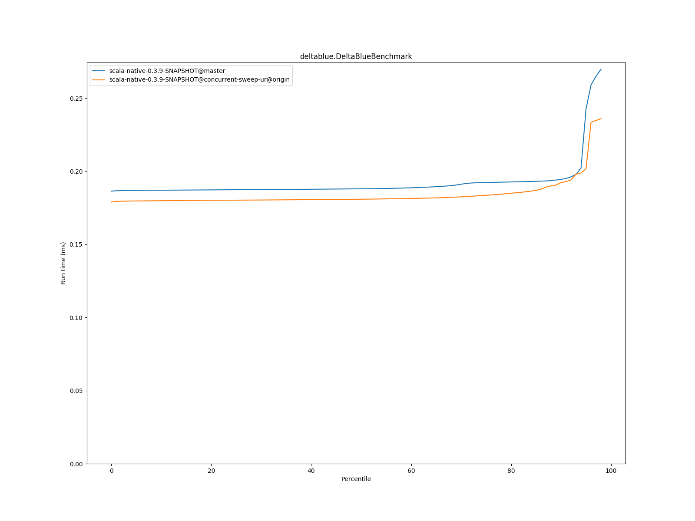
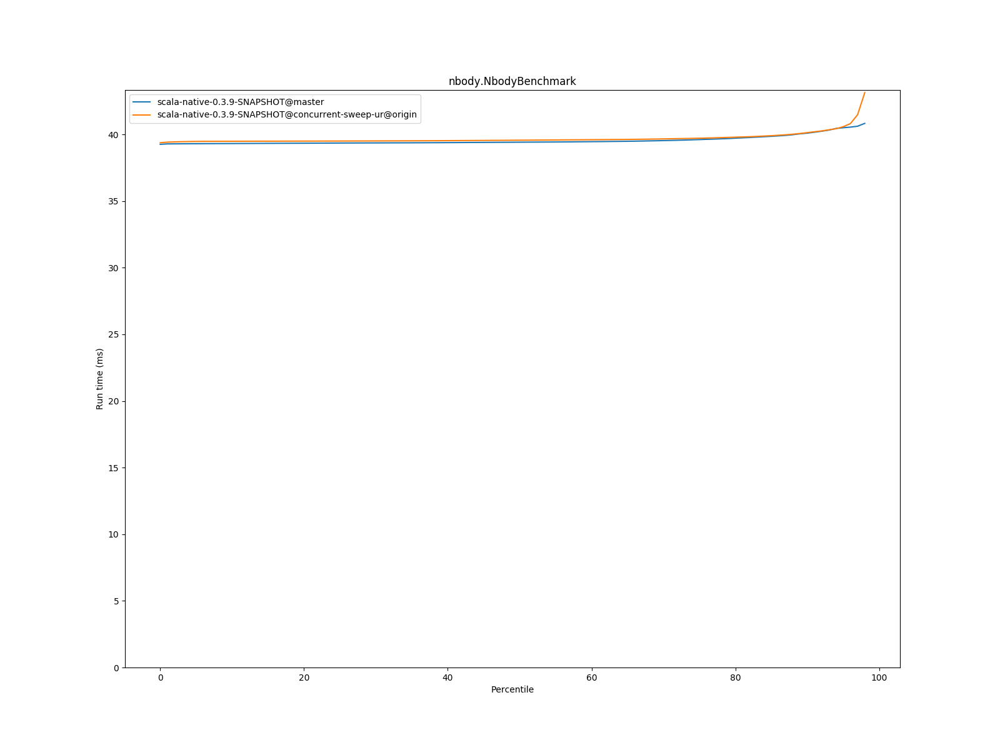
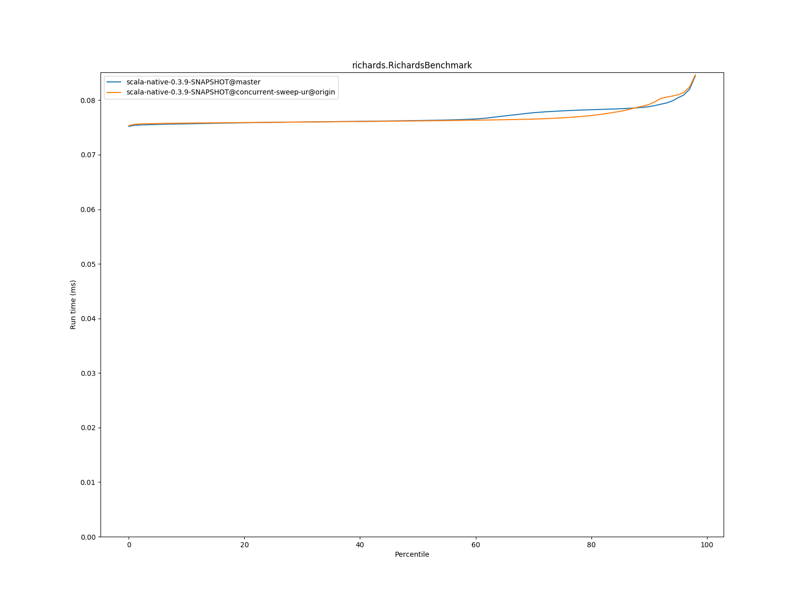

# Summary
## Benchmark run time (ms) at 50 percentile 

|name | scala-native-0.3.9-SNAPSHOT@master | scala-native-0.3.9-SNAPSHOT@concurrent-sweep-ur@origin | |
| -- | -- | -- | -- |
|[bounce.BounceBenchmark](#bouncebouncebenchmark)|0.0575|0.0542|__-5.68%__|
|[brainfuck.BrainfuckBenchmark](#brainfuckbrainfuckbenchmark)|3.4230|3.5131|+2.63%|
|[cd.CDBenchmark](#cdcdbenchmark)|32.8276|33.3987|+1.74%|
|[deltablue.DeltaBlueBenchmark](#deltabluedeltabluebenchmark)|0.1881|0.1809|__-3.78%__|
|[gcbench.GCBenchBenchmark](#gcbenchgcbenchbenchmark)|132.0552|136.4258|+3.31%|
|[json.JsonBenchmark](#jsonjsonbenchmark)|1.6668|1.7092|+2.54%|
|[kmeans.KmeansBenchmark](#kmeanskmeansbenchmark)|58.9348|55.9463|__-5.07%__|
|[list.ListBenchmark](#listlistbenchmark)|0.0570|0.0658|+15.42%|
|[mandelbrot.MandelbrotBenchmark](#mandelbrotmandelbrotbenchmark)|126.1322|126.0139|__-0.09%__|
|[nbody.NbodyBenchmark](#nbodynbodybenchmark)|39.4214|39.5700|+0.38%|
|[permute.PermuteBenchmark](#permutepermutebenchmark)|0.2495|0.2038|__-18.32%__|
|[queens.QueensBenchmark](#queensqueensbenchmark)|0.1132|0.1157|+2.27%|
|[richards.RichardsBenchmark](#richardsrichardsbenchmark)|0.0763|0.0762|__-0.08%__|
|[sudoku.SudokuBenchmark](#sudokusudokubenchmark)|2.4037|2.4609|+2.38%|
|[tracer.TracerBenchmark](#tracertracerbenchmark)|0.7537|0.7710|+2.30%|
| __Geometrical mean:__|| |__-0.24%__|
## Benchmark run time (ms) at 90 percentile 

|name | scala-native-0.3.9-SNAPSHOT@master | scala-native-0.3.9-SNAPSHOT@concurrent-sweep-ur@origin | |
| -- | -- | -- | -- |
|[bounce.BounceBenchmark](#bouncebouncebenchmark)|0.0579|0.0557|__-3.93%__|
|[brainfuck.BrainfuckBenchmark](#brainfuckbrainfuckbenchmark)|3.4882|3.5945|+3.05%|
|[cd.CDBenchmark](#cdcdbenchmark)|33.3688|33.6172|+0.74%|
|[deltablue.DeltaBlueBenchmark](#deltabluedeltabluebenchmark)|0.1945|0.1923|__-1.13%__|
|[gcbench.GCBenchBenchmark](#gcbenchgcbenchbenchmark)|135.7358|137.6454|+1.41%|
|[json.JsonBenchmark](#jsonjsonbenchmark)|1.6847|1.7328|+2.85%|
|[kmeans.KmeansBenchmark](#kmeanskmeansbenchmark)|62.0028|58.0046|__-6.45%__|
|[list.ListBenchmark](#listlistbenchmark)|0.0583|0.0680|+16.58%|
|[mandelbrot.MandelbrotBenchmark](#mandelbrotmandelbrotbenchmark)|126.6270|127.0054|+0.30%|
|[nbody.NbodyBenchmark](#nbodynbodybenchmark)|40.0990|40.1391|+0.10%|
|[permute.PermuteBenchmark](#permutepermutebenchmark)|0.2622|0.2332|__-11.07%__|
|[queens.QueensBenchmark](#queensqueensbenchmark)|0.1150|0.1190|+3.45%|
|[richards.RichardsBenchmark](#richardsrichardsbenchmark)|0.0788|0.0792|+0.52%|
|[sudoku.SudokuBenchmark](#sudokusudokubenchmark)|3.5209|2.6512|__-24.70%__|
|[tracer.TracerBenchmark](#tracertracerbenchmark)|0.7707|0.7837|+1.69%|
| __Geometrical mean:__|| |__-1.50%__|
## Benchmark run time (ms) at 99 percentile 

|name | scala-native-0.3.9-SNAPSHOT@master | scala-native-0.3.9-SNAPSHOT@concurrent-sweep-ur@origin | |
| -- | -- | -- | -- |
|[bounce.BounceBenchmark](#bouncebouncebenchmark)|0.0658|0.0578|__-12.16%__|
|[brainfuck.BrainfuckBenchmark](#brainfuckbrainfuckbenchmark)|3.6235|3.7094|+2.37%|
|[cd.CDBenchmark](#cdcdbenchmark)|33.9190|34.0670|+0.44%|
|[deltablue.DeltaBlueBenchmark](#deltabluedeltabluebenchmark)|0.2763|0.2389|__-13.56%__|
|[gcbench.GCBenchBenchmark](#gcbenchgcbenchbenchmark)|136.9614|141.7753|+3.51%|
|[json.JsonBenchmark](#jsonjsonbenchmark)|1.7702|1.7657|__-0.25%__|
|[kmeans.KmeansBenchmark](#kmeanskmeansbenchmark)|64.9986|59.5218|__-8.43%__|
|[list.ListBenchmark](#listlistbenchmark)|0.0605|0.0714|+18.10%|
|[mandelbrot.MandelbrotBenchmark](#mandelbrotmandelbrotbenchmark)|128.8155|129.6401|+0.64%|
|[nbody.NbodyBenchmark](#nbodynbodybenchmark)|41.4952|44.2553|+6.65%|
|[permute.PermuteBenchmark](#permutepermutebenchmark)|0.2906|0.2604|__-10.41%__|
|[queens.QueensBenchmark](#queensqueensbenchmark)|0.1246|0.1277|+2.50%|
|[richards.RichardsBenchmark](#richardsrichardsbenchmark)|0.0925|0.0882|__-4.66%__|
|[sudoku.SudokuBenchmark](#sudokusudokubenchmark)|3.7683|2.8034|__-25.61%__|
|[tracer.TracerBenchmark](#tracertracerbenchmark)|0.8077|0.8536|+5.68%|
| __Geometrical mean:__|| |__-2.89%__|
# Individual benchmarks
## bounce.BounceBenchmark

## brainfuck.BrainfuckBenchmark

## cd.CDBenchmark

## deltablue.DeltaBlueBenchmark

## gcbench.GCBenchBenchmark

## json.JsonBenchmark

## kmeans.KmeansBenchmark

## list.ListBenchmark

## mandelbrot.MandelbrotBenchmark

## nbody.NbodyBenchmark

## permute.PermuteBenchmark

## queens.QueensBenchmark

## richards.RichardsBenchmark

## sudoku.SudokuBenchmark

## tracer.TracerBenchmark

