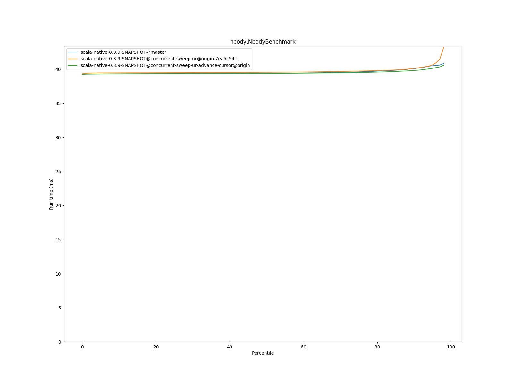
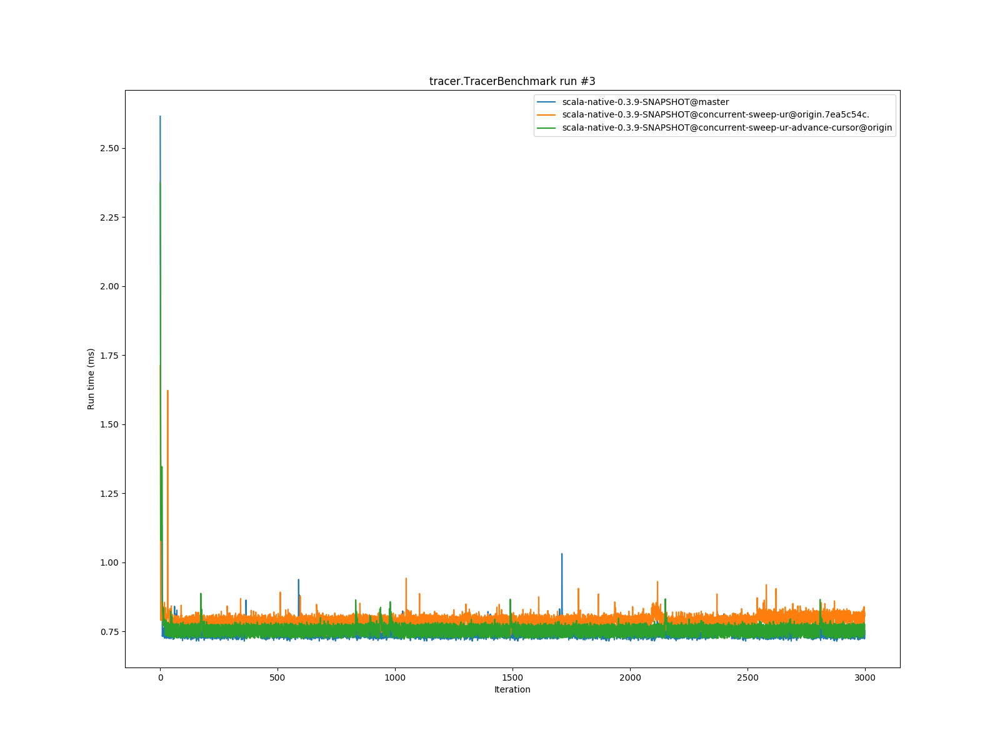

# Summary
## Benchmark run time (ms) at 50 percentile 

|name | scala-native-0.3.9-SNAPSHOT@master | scala-native-0.3.9-SNAPSHOT@concurrent-sweep-ur@origin.7ea5c54c. |  | scala-native-0.3.9-SNAPSHOT@concurrent-sweep-ur-advance-cursor@origin | |
| -- | -- | -- | -- | -- | -- |
|[bounce.BounceBenchmark](#bouncebouncebenchmark)|0.0575|0.0546|__-4.97%__|0.0587|+2.18%|
|[brainfuck.BrainfuckBenchmark](#brainfuckbrainfuckbenchmark)|3.4230|3.4883|+1.91%|3.4554|+0.95%|
|[cd.CDBenchmark](#cdcdbenchmark)|32.8276|33.3698|+1.65%|32.2956|__-1.62%__|
|[deltablue.DeltaBlueBenchmark](#deltabluedeltabluebenchmark)|0.1881|0.1832|__-2.57%__|0.1904|+1.23%|
|[gcbench.GCBenchBenchmark](#gcbenchgcbenchbenchmark)|132.0552|136.0267|+3.01%|138.5374|+4.91%|
|[json.JsonBenchmark](#jsonjsonbenchmark)|1.6668|1.7366|+4.18%|1.6076|__-3.55%__|
|[mandelbrot.MandelbrotBenchmark](#mandelbrotmandelbrotbenchmark)|126.1322|126.0166|__-0.09%__|126.0154|__-0.09%__|
|[mandelbrot.MandelbrotBenchmark](#mandelbrotmandelbrotbenchmark)|126.1322|126.0166|__-0.09%__|126.0154|__-0.09%__|
|[nbody.NbodyBenchmark](#nbodynbodybenchmark)|39.4214|39.5578|+0.35%|39.3958|__-0.06%__|
|[permute.PermuteBenchmark](#permutepermutebenchmark)|0.2495|0.2444|__-2.05%__|0.2025|__-18.84%__|
|[queens.QueensBenchmark](#queensqueensbenchmark)|0.1132|0.1152|+1.77%|0.1152|+1.76%|
|[richards.RichardsBenchmark](#richardsrichardsbenchmark)|0.0763|0.0795|+4.31%|0.0805|+5.52%|
|[sudoku.SudokuBenchmark](#sudokusudokubenchmark)|2.4037|2.5842|+7.51%|2.3831|__-0.86%__|
|[tracer.TracerBenchmark](#tracertracerbenchmark)|0.7537|0.7981|+5.90%|0.7696|+2.11%|
| __Geometrical mean:__|| |+1.43%| |__-0.63%__|
## Benchmark run time (ms) at 90 percentile 

|name | scala-native-0.3.9-SNAPSHOT@master | scala-native-0.3.9-SNAPSHOT@concurrent-sweep-ur@origin.7ea5c54c. |  | scala-native-0.3.9-SNAPSHOT@concurrent-sweep-ur-advance-cursor@origin | |
| -- | -- | -- | -- | -- | -- |
|[bounce.BounceBenchmark](#bouncebouncebenchmark)|0.0579|0.0562|__-2.98%__|0.0590|+1.90%|
|[brainfuck.BrainfuckBenchmark](#brainfuckbrainfuckbenchmark)|3.4882|3.5985|+3.16%|3.5374|+1.41%|
|[cd.CDBenchmark](#cdcdbenchmark)|33.3688|33.5906|+0.66%|32.6030|__-2.29%__|
|[deltablue.DeltaBlueBenchmark](#deltabluedeltabluebenchmark)|0.1945|0.1978|+1.68%|0.1959|+0.73%|
|[gcbench.GCBenchBenchmark](#gcbenchgcbenchbenchmark)|135.7358|137.1342|+1.03%|139.8356|+3.02%|
|[json.JsonBenchmark](#jsonjsonbenchmark)|1.6847|1.7538|+4.10%|1.6739|__-0.64%__|
|[mandelbrot.MandelbrotBenchmark](#mandelbrotmandelbrotbenchmark)|126.6270|127.1166|+0.39%|127.3087|+0.54%|
|[mandelbrot.MandelbrotBenchmark](#mandelbrotmandelbrotbenchmark)|126.6270|127.1166|+0.39%|127.3087|+0.54%|
|[nbody.NbodyBenchmark](#nbodynbodybenchmark)|40.0990|40.1348|+0.09%|39.8238|__-0.69%__|
|[permute.PermuteBenchmark](#permutepermutebenchmark)|0.2622|0.2716|+3.57%|0.2082|__-20.61%__|
|[queens.QueensBenchmark](#queensqueensbenchmark)|0.1150|0.1191|+3.58%|0.1167|+1.50%|
|[richards.RichardsBenchmark](#richardsrichardsbenchmark)|0.0788|0.0841|+6.76%|0.0822|+4.31%|
|[sudoku.SudokuBenchmark](#sudokusudokubenchmark)|3.5209|2.9641|__-15.81%__|2.5138|__-28.60%__|
|[tracer.TracerBenchmark](#tracertracerbenchmark)|0.7707|0.8188|+6.25%|0.7826|+1.54%|
| __Geometrical mean:__|| |+0.77%| |__-3.17%__|
## Benchmark run time (ms) at 99 percentile 

|name | scala-native-0.3.9-SNAPSHOT@master | scala-native-0.3.9-SNAPSHOT@concurrent-sweep-ur@origin.7ea5c54c. |  | scala-native-0.3.9-SNAPSHOT@concurrent-sweep-ur-advance-cursor@origin | |
| -- | -- | -- | -- | -- | -- |
|[bounce.BounceBenchmark](#bouncebouncebenchmark)|0.0658|0.0656|__-0.33%__|0.0619|__-5.82%__|
|[brainfuck.BrainfuckBenchmark](#brainfuckbrainfuckbenchmark)|3.6235|3.7090|+2.36%|3.6401|+0.46%|
|[cd.CDBenchmark](#cdcdbenchmark)|33.9190|34.0164|+0.29%|33.1191|__-2.36%__|
|[deltablue.DeltaBlueBenchmark](#deltabluedeltabluebenchmark)|0.2763|0.2513|__-9.07%__|0.2841|+2.82%|
|[gcbench.GCBenchBenchmark](#gcbenchgcbenchbenchmark)|136.9614|141.3742|+3.22%|143.1165|+4.49%|
|[json.JsonBenchmark](#jsonjsonbenchmark)|1.7702|1.8164|+2.61%|1.8256|+3.13%|
|[mandelbrot.MandelbrotBenchmark](#mandelbrotmandelbrotbenchmark)|128.8155|129.6309|+0.63%|129.6755|+0.67%|
|[mandelbrot.MandelbrotBenchmark](#mandelbrotmandelbrotbenchmark)|128.8155|129.6309|+0.63%|129.6755|+0.67%|
|[nbody.NbodyBenchmark](#nbodynbodybenchmark)|41.4952|44.6635|+7.64%|41.3500|__-0.35%__|
|[permute.PermuteBenchmark](#permutepermutebenchmark)|0.2906|0.3055|+5.14%|0.2406|__-17.23%__|
|[queens.QueensBenchmark](#queensqueensbenchmark)|0.1246|0.1363|+9.43%|0.1231|__-1.23%__|
|[richards.RichardsBenchmark](#richardsrichardsbenchmark)|0.0925|0.1036|+12.01%|0.0929|+0.40%|
|[sudoku.SudokuBenchmark](#sudokusudokubenchmark)|3.7683|3.6699|__-2.61%__|2.5828|__-31.46%__|
|[tracer.TracerBenchmark](#tracertracerbenchmark)|0.8077|0.8581|+6.23%|0.8265|+2.32%|
| __Geometrical mean:__|| |+2.60%| |__-3.64%__|
# Individual benchmarks
## bounce.BounceBenchmark

## brainfuck.BrainfuckBenchmark

## cd.CDBenchmark

## deltablue.DeltaBlueBenchmark

## gcbench.GCBenchBenchmark

## json.JsonBenchmark

## mandelbrot.MandelbrotBenchmark

## mandelbrot.MandelbrotBenchmark

## nbody.NbodyBenchmark

## permute.PermuteBenchmark

## queens.QueensBenchmark

## richards.RichardsBenchmark

## sudoku.SudokuBenchmark

## tracer.TracerBenchmark

