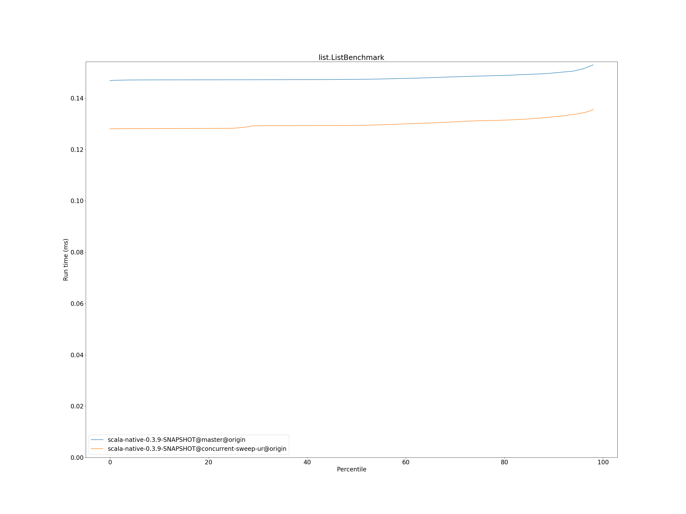

# Summary
## Benchmark run time (ms) at 50 percentile 

|name | scala-native-0.3.9-SNAPSHOT@master@origin | scala-native-0.3.9-SNAPSHOT@concurrent-sweep-ur@origin | |
| -- | -- | -- | -- |
|[tracer.TracerBenchmark](#tracertracerbenchmark)|1.8267|1.6352|__-10.48%__|
|[queens.QueensBenchmark](#queensqueensbenchmark)|0.5848|0.5433|__-7.09%__|
|[sudoku.SudokuBenchmark](#sudokusudokubenchmark)|14.6743|4.9021|__-66.59%__|
|[richards.RichardsBenchmark](#richardsrichardsbenchmark)|0.2460|0.1266|__-48.54%__|
|[bounce.BounceBenchmark](#bouncebouncebenchmark)|0.1789|0.0913|__-48.99%__|
|[gcbench.GCBenchBenchmark](#gcbenchgcbenchbenchmark)|255.2678|228.4957|__-10.49%__|
|[list.ListBenchmark](#listlistbenchmark)|0.1473|0.1293|__-12.18%__|
|[permute.PermuteBenchmark](#permutepermutebenchmark)|1.2873|0.4103|__-68.13%__|
|[deltablue.DeltaBlueBenchmark](#deltabluedeltabluebenchmark)|0.4120|0.3609|__-12.40%__|
|[kmeans.KmeansBenchmark](#kmeanskmeansbenchmark)|354.8431|114.4494|__-67.75%__|
|[json.JsonBenchmark](#jsonjsonbenchmark)|15.8732|3.3326|__-79.00%__|
|[brainfuck.BrainfuckBenchmark](#brainfuckbrainfuckbenchmark)|27.8825|7.7953|__-72.04%__|
|[cd.CDBenchmark](#cdcdbenchmark)|75.8135|63.8584|__-15.77%__|
|[mandelbrot.MandelbrotBenchmark](#mandelbrotmandelbrotbenchmark)|178.2329|177.8668|__-0.21%__|
|[nbody.NbodyBenchmark](#nbodynbodybenchmark)|305.5192|85.9043|__-71.88%__|
| __Geometrical mean:__|| |__-47.07%__|
## Benchmark run time (ms) at 90 percentile 

|name | scala-native-0.3.9-SNAPSHOT@master@origin | scala-native-0.3.9-SNAPSHOT@concurrent-sweep-ur@origin | |
| -- | -- | -- | -- |
|[tracer.TracerBenchmark](#tracertracerbenchmark)|1.8584|1.6980|__-8.63%__|
|[queens.QueensBenchmark](#queensqueensbenchmark)|0.6085|0.5879|__-3.38%__|
|[sudoku.SudokuBenchmark](#sudokusudokubenchmark)|14.8702|5.3343|__-64.13%__|
|[richards.RichardsBenchmark](#richardsrichardsbenchmark)|0.2612|0.1283|__-50.87%__|
|[bounce.BounceBenchmark](#bouncebouncebenchmark)|0.1910|0.0926|__-51.51%__|
|[gcbench.GCBenchBenchmark](#gcbenchgcbenchbenchmark)|257.0407|233.1058|__-9.31%__|
|[list.ListBenchmark](#listlistbenchmark)|0.1498|0.1328|__-11.38%__|
|[permute.PermuteBenchmark](#permutepermutebenchmark)|1.4386|0.4405|__-69.38%__|
|[deltablue.DeltaBlueBenchmark](#deltabluedeltabluebenchmark)|0.4418|0.3882|__-12.13%__|
|[kmeans.KmeansBenchmark](#kmeanskmeansbenchmark)|375.7836|120.0607|__-68.05%__|
|[json.JsonBenchmark](#jsonjsonbenchmark)|16.8718|3.4921|__-79.30%__|
|[brainfuck.BrainfuckBenchmark](#brainfuckbrainfuckbenchmark)|29.1444|8.0855|__-72.26%__|
|[cd.CDBenchmark](#cdcdbenchmark)|76.3746|64.3359|__-15.76%__|
|[mandelbrot.MandelbrotBenchmark](#mandelbrotmandelbrotbenchmark)|178.3594|177.9134|__-0.25%__|
|[nbody.NbodyBenchmark](#nbodynbodybenchmark)|312.4233|86.5159|__-72.31%__|
| __Geometrical mean:__|| |__-47.17%__|
## Benchmark run time (ms) at 99 percentile 

|name | scala-native-0.3.9-SNAPSHOT@master@origin | scala-native-0.3.9-SNAPSHOT@concurrent-sweep-ur@origin | |
| -- | -- | -- | -- |
|[tracer.TracerBenchmark](#tracertracerbenchmark)|1.8899|1.7398|__-7.94%__|
|[queens.QueensBenchmark](#queensqueensbenchmark)|0.7444|0.7497|+0.71%|
|[sudoku.SudokuBenchmark](#sudokusudokubenchmark)|15.0768|5.6718|__-62.38%__|
|[richards.RichardsBenchmark](#richardsrichardsbenchmark)|0.3961|0.1520|__-61.63%__|
|[bounce.BounceBenchmark](#bouncebouncebenchmark)|0.3263|0.1032|__-68.36%__|
|[gcbench.GCBenchBenchmark](#gcbenchgcbenchbenchmark)|263.4274|238.7149|__-9.38%__|
|[list.ListBenchmark](#listlistbenchmark)|0.1552|0.1368|__-11.86%__|
|[permute.PermuteBenchmark](#permutepermutebenchmark)|1.4841|0.5320|__-64.15%__|
|[deltablue.DeltaBlueBenchmark](#deltabluedeltabluebenchmark)|0.6715|0.5375|__-19.96%__|
|[kmeans.KmeansBenchmark](#kmeanskmeansbenchmark)|402.7166|122.0341|__-69.70%__|
|[json.JsonBenchmark](#jsonjsonbenchmark)|17.8913|3.6246|__-79.74%__|
|[brainfuck.BrainfuckBenchmark](#brainfuckbrainfuckbenchmark)|29.7414|8.3476|__-71.93%__|
|[cd.CDBenchmark](#cdcdbenchmark)|76.7938|66.0512|__-13.99%__|
|[mandelbrot.MandelbrotBenchmark](#mandelbrotmandelbrotbenchmark)|178.4224|178.0835|__-0.19%__|
|[nbody.NbodyBenchmark](#nbodynbodybenchmark)|314.5130|87.4323|__-72.20%__|
| __Geometrical mean:__|| |__-49.10%__|
# Individual benchmarks
## tracer.TracerBenchmark

## queens.QueensBenchmark

## sudoku.SudokuBenchmark

## richards.RichardsBenchmark

## bounce.BounceBenchmark

## gcbench.GCBenchBenchmark

## list.ListBenchmark

## permute.PermuteBenchmark

## deltablue.DeltaBlueBenchmark

## kmeans.KmeansBenchmark

## json.JsonBenchmark

## brainfuck.BrainfuckBenchmark

## cd.CDBenchmark

## mandelbrot.MandelbrotBenchmark

## nbody.NbodyBenchmark

