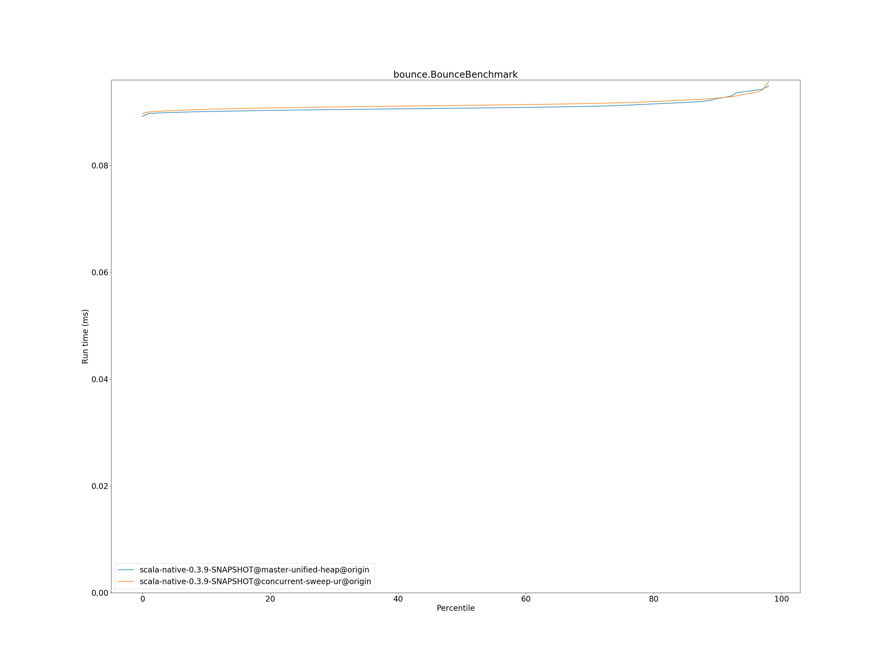
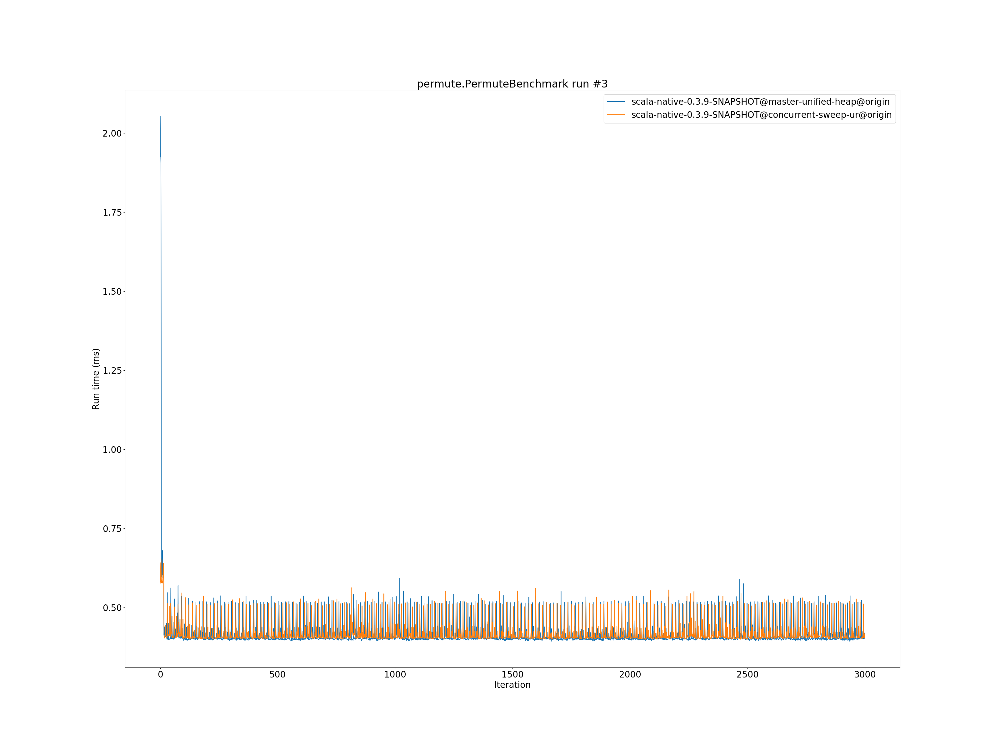

# Summary
## Benchmark run time (ms) at 50 percentile 

|name | scala-native-0.3.9-SNAPSHOT@master-unified-heap@origin | scala-native-0.3.9-SNAPSHOT@concurrent-sweep-ur@origin | |
| -- | -- | -- | -- |
|[queens.QueensBenchmark](#queensqueensbenchmark)|0.5419|0.5433|+0.25%|
|[cd.CDBenchmark](#cdcdbenchmark)|63.4734|63.8584|+0.61%|
|[richards.RichardsBenchmark](#richardsrichardsbenchmark)|0.1187|0.1266|+6.63%|
|[brainfuck.BrainfuckBenchmark](#brainfuckbrainfuckbenchmark)|7.7847|7.7953|+0.14%|
|[deltablue.DeltaBlueBenchmark](#deltabluedeltabluebenchmark)|0.3492|0.3609|+3.37%|
|[nbody.NbodyBenchmark](#nbodynbodybenchmark)|85.9010|85.9043|+0.00%|
|[list.ListBenchmark](#listlistbenchmark)|0.1295|0.1293|__-0.12%__|
|[bounce.BounceBenchmark](#bouncebouncebenchmark)|0.0907|0.0913|+0.59%|
|[sudoku.SudokuBenchmark](#sudokusudokubenchmark)|4.6616|4.9021|+5.16%|
|[json.JsonBenchmark](#jsonjsonbenchmark)|3.1657|3.3326|+5.27%|
|[kmeans.KmeansBenchmark](#kmeanskmeansbenchmark)|111.7315|114.4494|+2.43%|
|[tracer.TracerBenchmark](#tracertracerbenchmark)|1.5946|1.6352|+2.54%|
|[gcbench.GCBenchBenchmark](#gcbenchgcbenchbenchmark)|219.3171|228.4957|+4.19%|
|[mandelbrot.MandelbrotBenchmark](#mandelbrotmandelbrotbenchmark)|177.9165|177.8668|__-0.03%__|
|[permute.PermuteBenchmark](#permutepermutebenchmark)|0.4028|0.4103|+1.86%|
| __Geometrical mean:__|| |+2.17%|
## Benchmark run time (ms) at 90 percentile 

|name | scala-native-0.3.9-SNAPSHOT@master-unified-heap@origin | scala-native-0.3.9-SNAPSHOT@concurrent-sweep-ur@origin | |
| -- | -- | -- | -- |
|[queens.QueensBenchmark](#queensqueensbenchmark)|0.5510|0.5879|+6.70%|
|[cd.CDBenchmark](#cdcdbenchmark)|63.9190|64.3359|+0.65%|
|[richards.RichardsBenchmark](#richardsrichardsbenchmark)|0.1201|0.1283|+6.85%|
|[brainfuck.BrainfuckBenchmark](#brainfuckbrainfuckbenchmark)|7.9269|8.0855|+2.00%|
|[deltablue.DeltaBlueBenchmark](#deltabluedeltabluebenchmark)|0.3710|0.3882|+4.64%|
|[nbody.NbodyBenchmark](#nbodynbodybenchmark)|86.7485|86.5159|__-0.27%__|
|[list.ListBenchmark](#listlistbenchmark)|0.1325|0.1328|+0.21%|
|[bounce.BounceBenchmark](#bouncebouncebenchmark)|0.0926|0.0926|+0.08%|
|[sudoku.SudokuBenchmark](#sudokusudokubenchmark)|5.1107|5.3343|+4.38%|
|[json.JsonBenchmark](#jsonjsonbenchmark)|3.2923|3.4921|+6.07%|
|[kmeans.KmeansBenchmark](#kmeanskmeansbenchmark)|119.8152|120.0607|+0.20%|
|[tracer.TracerBenchmark](#tracertracerbenchmark)|1.6378|1.6980|+3.67%|
|[gcbench.GCBenchBenchmark](#gcbenchgcbenchbenchmark)|224.1036|233.1058|+4.02%|
|[mandelbrot.MandelbrotBenchmark](#mandelbrotmandelbrotbenchmark)|177.9553|177.9134|__-0.02%__|
|[permute.PermuteBenchmark](#permutepermutebenchmark)|0.4350|0.4405|+1.27%|
| __Geometrical mean:__|| |+2.66%|
## Benchmark run time (ms) at 99 percentile 

|name | scala-native-0.3.9-SNAPSHOT@master-unified-heap@origin | scala-native-0.3.9-SNAPSHOT@concurrent-sweep-ur@origin | |
| -- | -- | -- | -- |
|[queens.QueensBenchmark](#queensqueensbenchmark)|0.7280|0.7497|+2.99%|
|[cd.CDBenchmark](#cdcdbenchmark)|64.3670|66.0512|+2.62%|
|[richards.RichardsBenchmark](#richardsrichardsbenchmark)|0.1440|0.1520|+5.54%|
|[brainfuck.BrainfuckBenchmark](#brainfuckbrainfuckbenchmark)|8.1375|8.3476|+2.58%|
|[deltablue.DeltaBlueBenchmark](#deltabluedeltabluebenchmark)|0.6328|0.5375|__-15.06%__|
|[nbody.NbodyBenchmark](#nbodynbodybenchmark)|87.5794|87.4323|__-0.17%__|
|[list.ListBenchmark](#listlistbenchmark)|0.1365|0.1368|+0.25%|
|[bounce.BounceBenchmark](#bouncebouncebenchmark)|0.1030|0.1032|+0.26%|
|[sudoku.SudokuBenchmark](#sudokusudokubenchmark)|5.4401|5.6718|+4.26%|
|[json.JsonBenchmark](#jsonjsonbenchmark)|3.3632|3.6246|+7.77%|
|[kmeans.KmeansBenchmark](#kmeanskmeansbenchmark)|128.1995|122.0341|__-4.81%__|
|[tracer.TracerBenchmark](#tracertracerbenchmark)|1.6756|1.7398|+3.83%|
|[gcbench.GCBenchBenchmark](#gcbenchgcbenchbenchmark)|225.5215|238.7149|+5.85%|
|[mandelbrot.MandelbrotBenchmark](#mandelbrotmandelbrotbenchmark)|178.0800|178.0835|+0.00%|
|[permute.PermuteBenchmark](#permutepermutebenchmark)|0.5326|0.5320|__-0.11%__|
| __Geometrical mean:__|| |+0.91%|
# Individual benchmarks
## queens.QueensBenchmark

## cd.CDBenchmark

## richards.RichardsBenchmark

## brainfuck.BrainfuckBenchmark

## deltablue.DeltaBlueBenchmark

## nbody.NbodyBenchmark

## list.ListBenchmark

## bounce.BounceBenchmark

## sudoku.SudokuBenchmark

## json.JsonBenchmark

## kmeans.KmeansBenchmark

## tracer.TracerBenchmark

## gcbench.GCBenchBenchmark

## mandelbrot.MandelbrotBenchmark

## permute.PermuteBenchmark

