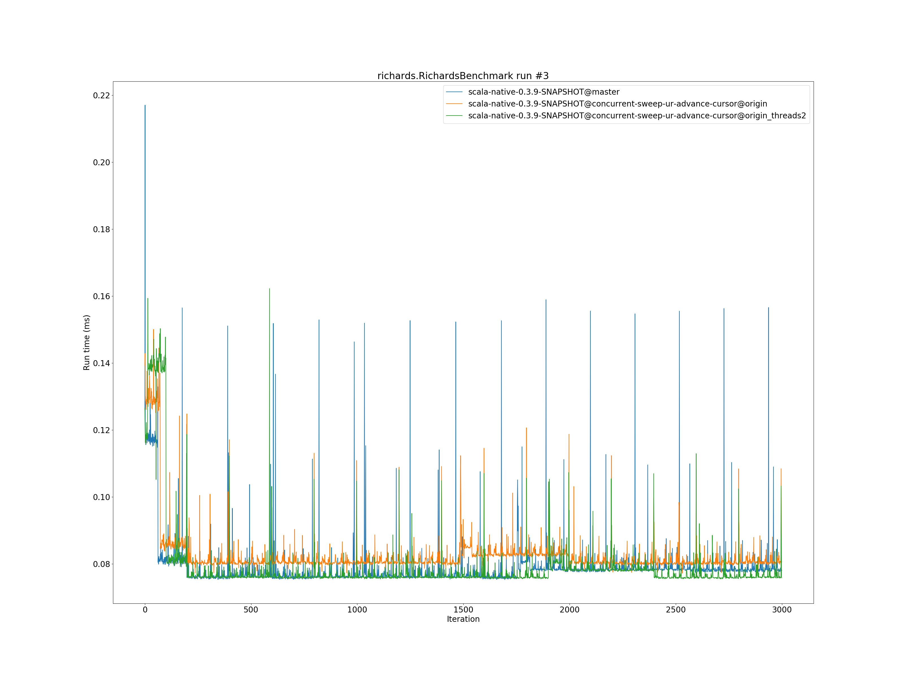

# Summary
## Benchmark run time (ms) at 50 percentile 

|name | scala-native-0.3.9-SNAPSHOT@master | scala-native-0.3.9-SNAPSHOT@concurrent-sweep-ur-advance-cursor@origin |  | scala-native-0.3.9-SNAPSHOT@concurrent-sweep-ur-advance-cursor@origin_threads2 | |
| -- | -- | -- | -- | -- | -- |
|[bounce.BounceBenchmark](#bouncebouncebenchmark)|0.0575|0.0587|+2.18%|0.0574|__-0.22%__|
|[brainfuck.BrainfuckBenchmark](#brainfuckbrainfuckbenchmark)|3.4230|3.4554|+0.95%|3.4785|+1.62%|
|[cd.CDBenchmark](#cdcdbenchmark)|32.8276|32.2956|__-1.62%__|32.4272|__-1.22%__|
|[deltablue.DeltaBlueBenchmark](#deltabluedeltabluebenchmark)|0.1881|0.1904|+1.23%|0.1822|__-3.12%__|
|[gcbench.GCBenchBenchmark](#gcbenchgcbenchbenchmark)|132.0552|138.5374|+4.91%|136.5296|+3.39%|
|[json.JsonBenchmark](#jsonjsonbenchmark)|1.6668|1.6076|__-3.55%__|1.6402|__-1.60%__|
|[kmeans.KmeansBenchmark](#kmeanskmeansbenchmark)|58.9348|53.3114|__-9.54%__|53.6576|__-8.95%__|
|[list.ListBenchmark](#listlistbenchmark)|0.0570|0.0678|+19.02%|0.0550|__-3.59%__|
|[mandelbrot.MandelbrotBenchmark](#mandelbrotmandelbrotbenchmark)|126.1322|126.0154|__-0.09%__|126.0199|__-0.09%__|
|[nbody.NbodyBenchmark](#nbodynbodybenchmark)|39.4214|39.3958|__-0.06%__|39.4253|+0.01%|
|[permute.PermuteBenchmark](#permutepermutebenchmark)|0.2495|0.2025|__-18.84%__|0.2034|__-18.49%__|
|[queens.QueensBenchmark](#queensqueensbenchmark)|0.1132|0.1152|+1.76%|0.1148|+1.44%|
|[richards.RichardsBenchmark](#richardsrichardsbenchmark)|0.0763|0.0805|+5.52%|0.0760|__-0.35%__|
|[sudoku.SudokuBenchmark](#sudokusudokubenchmark)|2.4037|2.3831|__-0.86%__|2.5516|+6.15%|
|[tracer.TracerBenchmark](#tracertracerbenchmark)|0.7537|0.7696|+2.11%|0.7711|+2.31%|
| __Geometrical mean:__|| |__-0.10%__| |__-1.69%__|
## Benchmark run time (ms) at 90 percentile 

|name | scala-native-0.3.9-SNAPSHOT@master | scala-native-0.3.9-SNAPSHOT@concurrent-sweep-ur-advance-cursor@origin |  | scala-native-0.3.9-SNAPSHOT@concurrent-sweep-ur-advance-cursor@origin_threads2 | |
| -- | -- | -- | -- | -- | -- |
|[bounce.BounceBenchmark](#bouncebouncebenchmark)|0.0579|0.0590|+1.90%|0.0576|__-0.55%__|
|[brainfuck.BrainfuckBenchmark](#brainfuckbrainfuckbenchmark)|3.4882|3.5374|+1.41%|3.5489|+1.74%|
|[cd.CDBenchmark](#cdcdbenchmark)|33.3688|32.6030|__-2.29%__|32.6721|__-2.09%__|
|[deltablue.DeltaBlueBenchmark](#deltabluedeltabluebenchmark)|0.1945|0.1959|+0.73%|0.1874|__-3.68%__|
|[gcbench.GCBenchBenchmark](#gcbenchgcbenchbenchmark)|135.7358|139.8356|+3.02%|139.5088|+2.78%|
|[json.JsonBenchmark](#jsonjsonbenchmark)|1.6847|1.6739|__-0.64%__|1.6631|__-1.28%__|
|[kmeans.KmeansBenchmark](#kmeanskmeansbenchmark)|62.0028|55.2704|__-10.86%__|55.5151|__-10.46%__|
|[list.ListBenchmark](#listlistbenchmark)|0.0583|0.0698|+19.65%|0.0564|__-3.31%__|
|[mandelbrot.MandelbrotBenchmark](#mandelbrotmandelbrotbenchmark)|126.6270|127.3087|+0.54%|127.1546|+0.42%|
|[nbody.NbodyBenchmark](#nbodynbodybenchmark)|40.0990|39.8238|__-0.69%__|39.8804|__-0.55%__|
|[permute.PermuteBenchmark](#permutepermutebenchmark)|0.2622|0.2082|__-20.61%__|0.2272|__-13.35%__|
|[queens.QueensBenchmark](#queensqueensbenchmark)|0.1150|0.1167|+1.50%|0.1189|+3.33%|
|[richards.RichardsBenchmark](#richardsrichardsbenchmark)|0.0788|0.0822|+4.31%|0.0784|__-0.56%__|
|[sudoku.SudokuBenchmark](#sudokusudokubenchmark)|3.5209|2.5138|__-28.60%__|2.6822|__-23.82%__|
|[tracer.TracerBenchmark](#tracertracerbenchmark)|0.7707|0.7826|+1.54%|0.7877|+2.21%|
| __Geometrical mean:__|| |__-2.58%__| |__-3.56%__|
## Benchmark run time (ms) at 99 percentile 

|name | scala-native-0.3.9-SNAPSHOT@master | scala-native-0.3.9-SNAPSHOT@concurrent-sweep-ur-advance-cursor@origin |  | scala-native-0.3.9-SNAPSHOT@concurrent-sweep-ur-advance-cursor@origin_threads2 | |
| -- | -- | -- | -- | -- | -- |
|[bounce.BounceBenchmark](#bouncebouncebenchmark)|0.0658|0.0619|__-5.82%__|0.0606|__-7.80%__|
|[brainfuck.BrainfuckBenchmark](#brainfuckbrainfuckbenchmark)|3.6235|3.6401|+0.46%|3.6356|+0.33%|
|[cd.CDBenchmark](#cdcdbenchmark)|33.9190|33.1191|__-2.36%__|33.2058|__-2.10%__|
|[deltablue.DeltaBlueBenchmark](#deltabluedeltabluebenchmark)|0.2763|0.2841|+2.82%|0.2797|+1.23%|
|[gcbench.GCBenchBenchmark](#gcbenchgcbenchbenchmark)|136.9614|143.1165|+4.49%|140.6681|+2.71%|
|[json.JsonBenchmark](#jsonjsonbenchmark)|1.7702|1.8256|+3.13%|1.7007|__-3.92%__|
|[kmeans.KmeansBenchmark](#kmeanskmeansbenchmark)|64.9986|56.6960|__-12.77%__|56.9495|__-12.38%__|
|[list.ListBenchmark](#listlistbenchmark)|0.0605|0.0715|+18.20%|0.0586|__-3.11%__|
|[mandelbrot.MandelbrotBenchmark](#mandelbrotmandelbrotbenchmark)|128.8155|129.6755|+0.67%|129.6918|+0.68%|
|[nbody.NbodyBenchmark](#nbodynbodybenchmark)|41.4952|41.3500|__-0.35%__|41.3263|__-0.41%__|
|[permute.PermuteBenchmark](#permutepermutebenchmark)|0.2906|0.2406|__-17.23%__|0.2480|__-14.65%__|
|[queens.QueensBenchmark](#queensqueensbenchmark)|0.1246|0.1231|__-1.23%__|0.1232|__-1.12%__|
|[richards.RichardsBenchmark](#richardsrichardsbenchmark)|0.0925|0.0929|+0.40%|0.0890|__-3.76%__|
|[sudoku.SudokuBenchmark](#sudokusudokubenchmark)|3.7683|2.5828|__-31.46%__|2.7855|__-26.08%__|
|[tracer.TracerBenchmark](#tracertracerbenchmark)|0.8077|0.8265|+2.32%|0.8155|+0.97%|
| __Geometrical mean:__|| |__-3.25%__| |__-4.95%__|
## Benchmark total run time (ms) 

|name | scala-native-0.3.9-SNAPSHOT@master | scala-native-0.3.9-SNAPSHOT@concurrent-sweep-ur-advance-cursor@origin |  | scala-native-0.3.9-SNAPSHOT@concurrent-sweep-ur-advance-cursor@origin_threads2 | |
| -- | -- | -- | -- | -- | -- |
|[bounce.BounceBenchmark](#bouncebouncebenchmark)|1157.1256|1179.5133|+1.93%|1151.2534|__-0.51%__|
|[brainfuck.BrainfuckBenchmark](#brainfuckbrainfuckbenchmark)|67862.0467|69476.0160|+2.38%|69706.9817|+2.72%|
|[cd.CDBenchmark](#cdcdbenchmark)|657986.3918|646005.6901|__-1.82%__|649225.3858|__-1.33%__|
|[deltablue.DeltaBlueBenchmark](#deltabluedeltabluebenchmark)|3872.0509|3901.6901|+0.77%|3738.1427|__-3.46%__|
|[gcbench.GCBenchBenchmark](#gcbenchgcbenchbenchmark)|2617900.8063|2675275.1194|+2.19%|2670709.9006|+2.02%|
|[json.JsonBenchmark](#jsonjsonbenchmark)|32864.7944|32521.4908|__-1.04%__|32232.4373|__-1.92%__|
|[kmeans.KmeansBenchmark](#kmeanskmeansbenchmark)|1183772.7863|1063093.5003|__-10.19%__|1067583.2555|__-9.82%__|
|[list.ListBenchmark](#listlistbenchmark)|1147.3050|1364.9065|+18.97%|1106.8058|__-3.53%__|
|[mandelbrot.MandelbrotBenchmark](#mandelbrotmandelbrotbenchmark)|2525478.1573|2527667.6753|+0.09%|2527453.2205|+0.08%|
|[nbody.NbodyBenchmark](#nbodynbodybenchmark)|791640.4969|790313.8625|__-0.17%__|790959.5901|__-0.09%__|
|[permute.PermuteBenchmark](#permutepermutebenchmark)|5068.7095|4107.4338|__-18.96%__|4149.5135|__-18.13%__|
|[queens.QueensBenchmark](#queensqueensbenchmark)|2276.3594|2313.3293|+1.62%|2313.2641|+1.62%|
|[richards.RichardsBenchmark](#richardsrichardsbenchmark)|1547.8696|1621.6916|+4.77%|1537.9378|__-0.64%__|
|[sudoku.SudokuBenchmark](#sudokusudokubenchmark)|51995.1476|48061.5123|__-7.57%__|51545.4714|__-0.86%__|
|[tracer.TracerBenchmark](#tracertracerbenchmark)|15026.5552|15269.1169|+1.61%|15328.0598|+2.01%|
| __Geometrical mean:__|| |__-0.68%__| |__-2.27%__|
# Individual benchmarks
## bounce.BounceBenchmark

## brainfuck.BrainfuckBenchmark

## cd.CDBenchmark

## deltablue.DeltaBlueBenchmark

## gcbench.GCBenchBenchmark

## json.JsonBenchmark

## kmeans.KmeansBenchmark

## list.ListBenchmark

## mandelbrot.MandelbrotBenchmark

## nbody.NbodyBenchmark

## permute.PermuteBenchmark

## queens.QueensBenchmark

## richards.RichardsBenchmark

## sudoku.SudokuBenchmark

## tracer.TracerBenchmark

