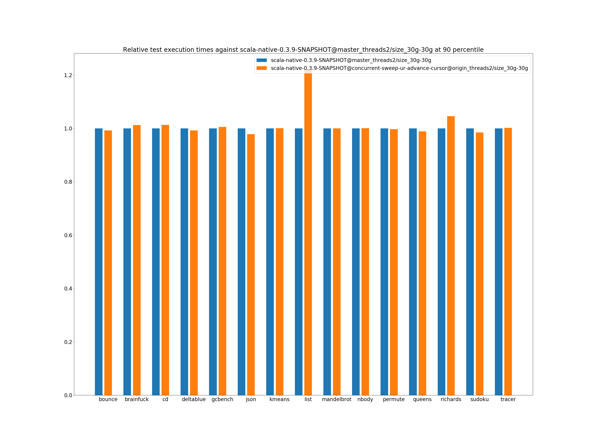

# Summary
## Benchmark run time (ms) at 50 percentile 

|name | scala-native-0.3.9-SNAPSHOT@master_threads2/size_30g-30g | scala-native-0.3.9-SNAPSHOT@concurrent-sweep-ur-advance-cursor@origin_threads2/size_30g-30g | |
| -- | -- | -- | -- |
|[bounce.BounceBenchmark](#bouncebouncebenchmark)|0.0606|0.0607|+0.25%|
|[brainfuck.BrainfuckBenchmark](#brainfuckbrainfuckbenchmark)|4.3677|4.4245|+1.30%|
|[cd.CDBenchmark](#cdcdbenchmark)|31.2883|31.6854|+1.27%|
|[deltablue.DeltaBlueBenchmark](#deltabluedeltabluebenchmark)|0.2313|0.2289|__-1.00%__|
|[gcbench.GCBenchBenchmark](#gcbenchgcbenchbenchmark)|99.9118|100.3586|+0.45%|
|[json.JsonBenchmark](#jsonjsonbenchmark)|2.1115|2.0670|__-2.11%__|
|[kmeans.KmeansBenchmark](#kmeanskmeansbenchmark)|50.7145|50.7720|+0.11%|
|[list.ListBenchmark](#listlistbenchmark)|0.0549|0.0678|+23.45%|
|[mandelbrot.MandelbrotBenchmark](#mandelbrotmandelbrotbenchmark)|126.0232|126.0128|__-0.01%__|
|[nbody.NbodyBenchmark](#nbodynbodybenchmark)|41.8445|41.8744|+0.07%|
|[permute.PermuteBenchmark](#permutepermutebenchmark)|0.2778|0.2768|__-0.35%__|
|[queens.QueensBenchmark](#queensqueensbenchmark)|0.1206|0.1189|__-1.41%__|
|[richards.RichardsBenchmark](#richardsrichardsbenchmark)|0.0805|0.0841|+4.49%|
|[sudoku.SudokuBenchmark](#sudokusudokubenchmark)|2.6963|2.6414|__-2.04%__|
|[tracer.TracerBenchmark](#tracertracerbenchmark)|1.5578|1.5591|+0.08%|
| __Geometrical mean:__|| |+1.48%|
## Benchmark run time (ms) at 90 percentile 

|name | scala-native-0.3.9-SNAPSHOT@master_threads2/size_30g-30g | scala-native-0.3.9-SNAPSHOT@concurrent-sweep-ur-advance-cursor@origin_threads2/size_30g-30g | |
| -- | -- | -- | -- |
|[bounce.BounceBenchmark](#bouncebouncebenchmark)|0.0624|0.0619|__-0.77%__|
|[brainfuck.BrainfuckBenchmark](#brainfuckbrainfuckbenchmark)|4.4911|4.5460|+1.22%|
|[cd.CDBenchmark](#cdcdbenchmark)|31.9689|32.3844|+1.30%|
|[deltablue.DeltaBlueBenchmark](#deltabluedeltabluebenchmark)|0.2377|0.2359|__-0.79%__|
|[gcbench.GCBenchBenchmark](#gcbenchgcbenchbenchmark)|101.7527|102.2926|+0.53%|
|[json.JsonBenchmark](#jsonjsonbenchmark)|2.1718|2.1243|__-2.19%__|
|[kmeans.KmeansBenchmark](#kmeanskmeansbenchmark)|51.9156|51.9623|+0.09%|
|[list.ListBenchmark](#listlistbenchmark)|0.0565|0.0689|+22.05%|
|[mandelbrot.MandelbrotBenchmark](#mandelbrotmandelbrotbenchmark)|126.7424|126.7221|__-0.02%__|
|[nbody.NbodyBenchmark](#nbodynbodybenchmark)|42.9970|43.0176|+0.05%|
|[permute.PermuteBenchmark](#permutepermutebenchmark)|0.2851|0.2842|__-0.32%__|
|[queens.QueensBenchmark](#queensqueensbenchmark)|0.1235|0.1222|__-1.08%__|
|[richards.RichardsBenchmark](#richardsrichardsbenchmark)|0.0832|0.0870|+4.60%|
|[sudoku.SudokuBenchmark](#sudokusudokubenchmark)|2.7600|2.7184|__-1.51%__|
|[tracer.TracerBenchmark](#tracertracerbenchmark)|1.6011|1.6043|+0.20%|
| __Geometrical mean:__|| |+1.42%|
## Benchmark run time (ms) at 99 percentile 

|name | scala-native-0.3.9-SNAPSHOT@master_threads2/size_30g-30g | scala-native-0.3.9-SNAPSHOT@concurrent-sweep-ur-advance-cursor@origin_threads2/size_30g-30g | |
| -- | -- | -- | -- |
|[bounce.BounceBenchmark](#bouncebouncebenchmark)|0.0649|0.0642|__-1.03%__|
|[brainfuck.BrainfuckBenchmark](#brainfuckbrainfuckbenchmark)|4.6182|4.6661|+1.04%|
|[cd.CDBenchmark](#cdcdbenchmark)|32.7239|34.8213|+6.41%|
|[deltablue.DeltaBlueBenchmark](#deltabluedeltabluebenchmark)|0.2493|0.2436|__-2.29%__|
|[gcbench.GCBenchBenchmark](#gcbenchgcbenchbenchmark)|329.4019|206.1444|__-37.42%__|
|[json.JsonBenchmark](#jsonjsonbenchmark)|2.2368|2.1886|__-2.15%__|
|[kmeans.KmeansBenchmark](#kmeanskmeansbenchmark)|53.2152|53.4365|+0.42%|
|[list.ListBenchmark](#listlistbenchmark)|0.0587|0.0711|+21.14%|
|[mandelbrot.MandelbrotBenchmark](#mandelbrotmandelbrotbenchmark)|129.5917|129.5802|__-0.01%__|
|[nbody.NbodyBenchmark](#nbodynbodybenchmark)|44.2476|44.2715|+0.05%|
|[permute.PermuteBenchmark](#permutepermutebenchmark)|0.3194|0.2934|__-8.13%__|
|[queens.QueensBenchmark](#queensqueensbenchmark)|0.1271|0.1255|__-1.27%__|
|[richards.RichardsBenchmark](#richardsrichardsbenchmark)|0.0894|0.0924|+3.41%|
|[sudoku.SudokuBenchmark](#sudokusudokubenchmark)|2.8606|2.8004|__-2.10%__|
|[tracer.TracerBenchmark](#tracertracerbenchmark)|1.6482|1.6600|+0.72%|
| __Geometrical mean:__|| |__-2.20%__|
## Benchmark total run time (ms) 

|name | scala-native-0.3.9-SNAPSHOT@master_threads2/size_30g-30g | scala-native-0.3.9-SNAPSHOT@concurrent-sweep-ur-advance-cursor@origin_threads2/size_30g-30g | |
| -- | -- | -- | -- |
|[bounce.BounceBenchmark](#bouncebouncebenchmark)|1216.8752|1216.0284|__-0.07%__|
|[brainfuck.BrainfuckBenchmark](#brainfuckbrainfuckbenchmark)|87938.8100|89001.9644|+1.21%|
|[cd.CDBenchmark](#cdcdbenchmark)|637767.6704|639422.9791|+0.26%|
|[deltablue.DeltaBlueBenchmark](#deltabluedeltabluebenchmark)|4661.9256|4611.5402|__-1.08%__|
|[gcbench.GCBenchBenchmark](#gcbenchgcbenchbenchmark)|2073085.6911|2042621.7186|__-1.47%__|
|[json.JsonBenchmark](#jsonjsonbenchmark)|42508.0254|41606.4601|__-2.12%__|
|[kmeans.KmeansBenchmark](#kmeanskmeansbenchmark)|1022326.1842|1019987.2496|__-0.23%__|
|[list.ListBenchmark](#listlistbenchmark)|1108.5240|1360.3949|+22.72%|
|[mandelbrot.MandelbrotBenchmark](#mandelbrotmandelbrotbenchmark)|2525938.5042|2525787.6086|__-0.01%__|
|[nbody.NbodyBenchmark](#nbodynbodybenchmark)|843068.5008|843427.4367|+0.04%|
|[permute.PermuteBenchmark](#permutepermutebenchmark)|5613.0838|5568.6735|__-0.79%__|
|[queens.QueensBenchmark](#queensqueensbenchmark)|2418.3233|2389.5628|__-1.19%__|
|[richards.RichardsBenchmark](#richardsrichardsbenchmark)|1621.2160|1693.4933|+4.46%|
|[sudoku.SudokuBenchmark](#sudokusudokubenchmark)|53999.4643|53288.8630|__-1.32%__|
|[tracer.TracerBenchmark](#tracertracerbenchmark)|31320.4327|31377.5339|+0.18%|
| __Geometrical mean:__|| |+1.22%|
# Individual benchmarks
## bounce.BounceBenchmark

## brainfuck.BrainfuckBenchmark

## cd.CDBenchmark

## deltablue.DeltaBlueBenchmark

## gcbench.GCBenchBenchmark

## json.JsonBenchmark

## kmeans.KmeansBenchmark

## list.ListBenchmark

## mandelbrot.MandelbrotBenchmark

## nbody.NbodyBenchmark

## permute.PermuteBenchmark

## queens.QueensBenchmark

## richards.RichardsBenchmark

## sudoku.SudokuBenchmark

## tracer.TracerBenchmark

