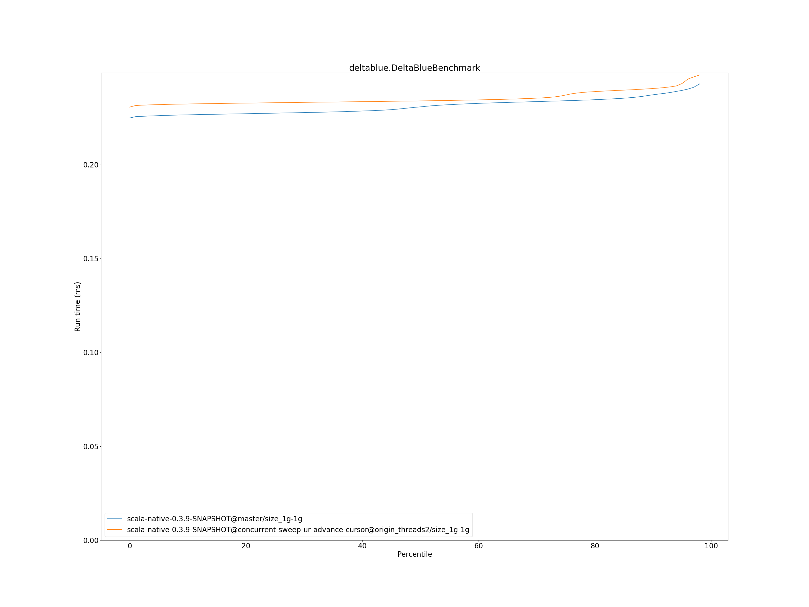
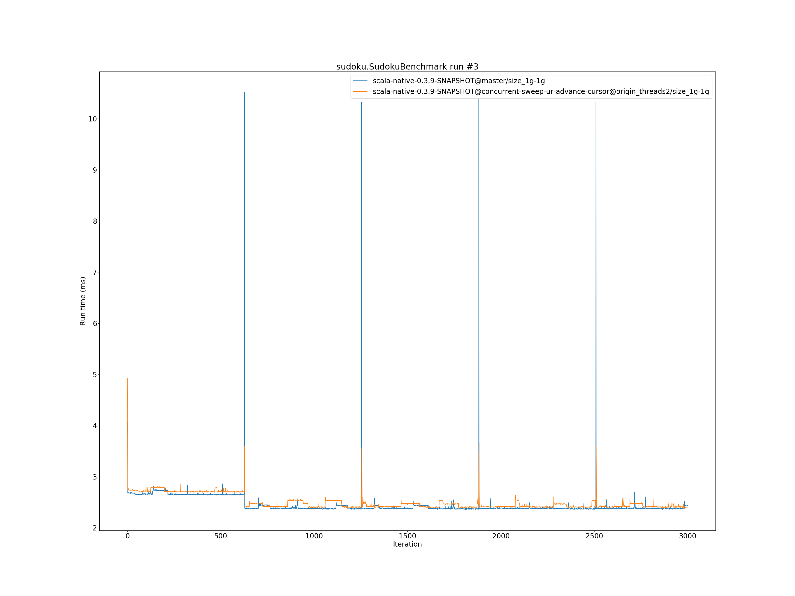

# Summary
## Benchmark run time (ms) at 50 percentile 

|name | scala-native-0.3.9-SNAPSHOT@master/size_1g-1g | scala-native-0.3.9-SNAPSHOT@concurrent-sweep-ur-advance-cursor@origin_threads2/size_1g-1g | |
| -- | -- | -- | -- |
|[bounce.BounceBenchmark](#bouncebouncebenchmark)|0.0562|0.0606|+7.88%|
|[brainfuck.BrainfuckBenchmark](#brainfuckbrainfuckbenchmark)|3.4291|3.3419|__-2.55%__|
|[cd.CDBenchmark](#cdcdbenchmark)|32.0295|31.5828|__-1.39%__|
|[deltablue.DeltaBlueBenchmark](#deltabluedeltabluebenchmark)|0.2308|0.2339|+1.38%|
|[gcbench.GCBenchBenchmark](#gcbenchgcbenchbenchmark)|105.9753|103.3144|__-2.51%__|
|[json.JsonBenchmark](#jsonjsonbenchmark)|1.6271|1.6289|+0.11%|
|[kmeans.KmeansBenchmark](#kmeanskmeansbenchmark)|51.8051|52.1113|+0.59%|
|[list.ListBenchmark](#listlistbenchmark)|0.0574|0.0564|__-1.72%__|
|[mandelbrot.MandelbrotBenchmark](#mandelbrotmandelbrotbenchmark)|126.0285|126.0167|__-0.01%__|
|[nbody.NbodyBenchmark](#nbodynbodybenchmark)|39.4391|40.9609|+3.86%|
|[permute.PermuteBenchmark](#permutepermutebenchmark)|0.2831|0.2779|__-1.82%__|
|[queens.QueensBenchmark](#queensqueensbenchmark)|0.1207|0.1199|__-0.70%__|
|[richards.RichardsBenchmark](#richardsrichardsbenchmark)|0.0817|0.0812|__-0.60%__|
|[sudoku.SudokuBenchmark](#sudokusudokubenchmark)|2.3876|2.4153|+1.16%|
|[tracer.TracerBenchmark](#tracertracerbenchmark)|0.8250|0.8211|__-0.47%__|
| __Geometrical mean:__|| |+0.18%|
## Benchmark run time (ms) at 90 percentile 

|name | scala-native-0.3.9-SNAPSHOT@master/size_1g-1g | scala-native-0.3.9-SNAPSHOT@concurrent-sweep-ur-advance-cursor@origin_threads2/size_1g-1g | |
| -- | -- | -- | -- |
|[bounce.BounceBenchmark](#bouncebouncebenchmark)|0.0578|0.0623|+7.82%|
|[brainfuck.BrainfuckBenchmark](#brainfuckbrainfuckbenchmark)|3.5402|3.4430|__-2.75%__|
|[cd.CDBenchmark](#cdcdbenchmark)|33.3034|32.7163|__-1.76%__|
|[deltablue.DeltaBlueBenchmark](#deltabluedeltabluebenchmark)|0.2372|0.2405|+1.41%|
|[gcbench.GCBenchBenchmark](#gcbenchgcbenchbenchmark)|113.7253|109.7633|__-3.48%__|
|[json.JsonBenchmark](#jsonjsonbenchmark)|1.6818|1.6742|__-0.45%__|
|[kmeans.KmeansBenchmark](#kmeanskmeansbenchmark)|53.2475|53.3931|+0.27%|
|[list.ListBenchmark](#listlistbenchmark)|0.0591|0.0578|__-2.19%__|
|[mandelbrot.MandelbrotBenchmark](#mandelbrotmandelbrotbenchmark)|127.6226|127.3909|__-0.18%__|
|[nbody.NbodyBenchmark](#nbodynbodybenchmark)|40.5622|42.1121|+3.82%|
|[permute.PermuteBenchmark](#permutepermutebenchmark)|0.3044|0.2851|__-6.35%__|
|[queens.QueensBenchmark](#queensqueensbenchmark)|0.1253|0.1236|__-1.41%__|
|[richards.RichardsBenchmark](#richardsrichardsbenchmark)|0.0852|0.0844|__-0.97%__|
|[sudoku.SudokuBenchmark](#sudokusudokubenchmark)|2.4668|2.4788|+0.49%|
|[tracer.TracerBenchmark](#tracertracerbenchmark)|0.8487|0.8392|__-1.12%__|
| __Geometrical mean:__|| |__-0.51%__|
## Benchmark run time (ms) at 99 percentile 

|name | scala-native-0.3.9-SNAPSHOT@master/size_1g-1g | scala-native-0.3.9-SNAPSHOT@concurrent-sweep-ur-advance-cursor@origin_threads2/size_1g-1g | |
| -- | -- | -- | -- |
|[bounce.BounceBenchmark](#bouncebouncebenchmark)|0.0600|0.0646|+7.64%|
|[brainfuck.BrainfuckBenchmark](#brainfuckbrainfuckbenchmark)|3.6565|3.6119|__-1.22%__|
|[cd.CDBenchmark](#cdcdbenchmark)|40.1800|34.5512|__-14.01%__|
|[deltablue.DeltaBlueBenchmark](#deltabluedeltabluebenchmark)|0.2468|0.2501|+1.34%|
|[gcbench.GCBenchBenchmark](#gcbenchgcbenchbenchmark)|115.1502|111.3470|__-3.30%__|
|[json.JsonBenchmark](#jsonjsonbenchmark)|1.7270|1.7872|+3.49%|
|[kmeans.KmeansBenchmark](#kmeanskmeansbenchmark)|62.6399|58.2538|__-7.00%__|
|[list.ListBenchmark](#listlistbenchmark)|0.0611|0.0595|__-2.54%__|
|[mandelbrot.MandelbrotBenchmark](#mandelbrotmandelbrotbenchmark)|129.8801|129.7300|__-0.12%__|
|[nbody.NbodyBenchmark](#nbodynbodybenchmark)|42.4235|43.3375|+2.15%|
|[permute.PermuteBenchmark](#permutepermutebenchmark)|0.3390|0.2939|__-13.28%__|
|[queens.QueensBenchmark](#queensqueensbenchmark)|0.1295|0.1275|__-1.56%__|
|[richards.RichardsBenchmark](#richardsrichardsbenchmark)|0.0904|0.0935|+3.48%|
|[sudoku.SudokuBenchmark](#sudokusudokubenchmark)|2.5424|2.5530|+0.42%|
|[tracer.TracerBenchmark](#tracertracerbenchmark)|0.9010|1.4842|+64.74%|
| __Geometrical mean:__|| |+1.52%|
## Benchmark total run time (ms) 

|name | scala-native-0.3.9-SNAPSHOT@master/size_1g-1g | scala-native-0.3.9-SNAPSHOT@concurrent-sweep-ur-advance-cursor@origin_threads2/size_1g-1g | |
| -- | -- | -- | -- |
|[bounce.BounceBenchmark](#bouncebouncebenchmark)|1127.1300|1217.0516|+7.98%|
|[brainfuck.BrainfuckBenchmark](#brainfuckbrainfuckbenchmark)|69752.6088|67507.1839|__-3.22%__|
|[cd.CDBenchmark](#cdcdbenchmark)|650357.0841|638622.5774|__-1.80%__|
|[deltablue.DeltaBlueBenchmark](#deltabluedeltabluebenchmark)|4628.6171|4713.8831|+1.84%|
|[gcbench.GCBenchBenchmark](#gcbenchgcbenchbenchmark)|2094328.0430|2055879.5903|__-1.84%__|
|[json.JsonBenchmark](#jsonjsonbenchmark)|33143.8115|32811.3294|__-1.00%__|
|[kmeans.KmeansBenchmark](#kmeanskmeansbenchmark)|1046074.3499|1048852.9298|+0.27%|
|[list.ListBenchmark](#listlistbenchmark)|1156.4007|1135.8810|__-1.77%__|
|[mandelbrot.MandelbrotBenchmark](#mandelbrotmandelbrotbenchmark)|2528702.6307|2527876.1268|__-0.03%__|
|[nbody.NbodyBenchmark](#nbodynbodybenchmark)|796339.0123|825517.0167|+3.66%|
|[permute.PermuteBenchmark](#permutepermutebenchmark)|5761.2546|5597.5130|__-2.84%__|
|[queens.QueensBenchmark](#queensqueensbenchmark)|2428.3156|2412.6131|__-0.65%__|
|[richards.RichardsBenchmark](#richardsrichardsbenchmark)|1648.4337|1640.3896|__-0.49%__|
|[sudoku.SudokuBenchmark](#sudokusudokubenchmark)|48305.1185|48692.2646|+0.80%|
|[tracer.TracerBenchmark](#tracertracerbenchmark)|17042.3435|16681.8107|__-2.12%__|
| __Geometrical mean:__|| |__-0.12%__|
# Individual benchmarks
## bounce.BounceBenchmark

## brainfuck.BrainfuckBenchmark

## cd.CDBenchmark

## deltablue.DeltaBlueBenchmark

## gcbench.GCBenchBenchmark

## json.JsonBenchmark

## kmeans.KmeansBenchmark

## list.ListBenchmark

## mandelbrot.MandelbrotBenchmark

## nbody.NbodyBenchmark

## permute.PermuteBenchmark

## queens.QueensBenchmark

## richards.RichardsBenchmark

## sudoku.SudokuBenchmark

## tracer.TracerBenchmark

