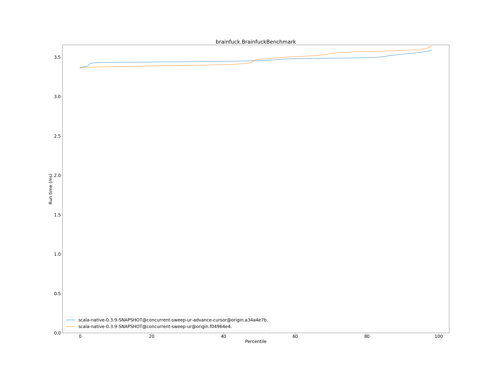
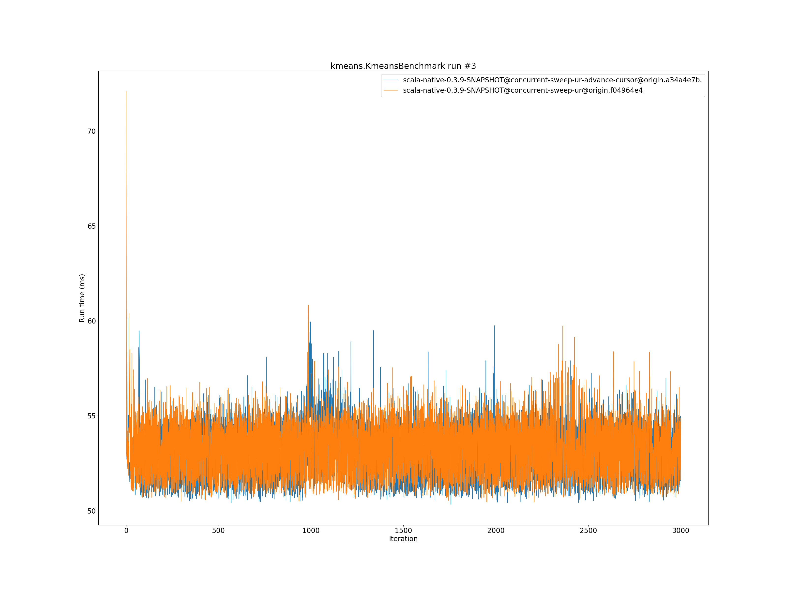
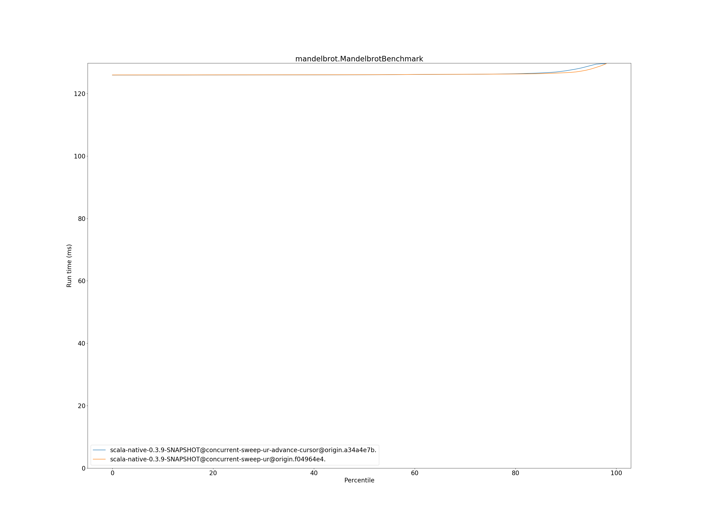

# Summary
## Benchmark run time (ms) at 50 percentile 

|name | scala-native-0.3.9-SNAPSHOT@concurrent-sweep-ur-advance-cursor@origin.a34a4e7b. | scala-native-0.3.9-SNAPSHOT@concurrent-sweep-ur@origin.f04964e4. | |
| -- | -- | -- | -- |
|[bounce.BounceBenchmark](#bouncebouncebenchmark)|0.0587|0.0542|__-7.80%__|
|[brainfuck.BrainfuckBenchmark](#brainfuckbrainfuckbenchmark)|3.4554|3.4726|+0.50%|
|[cd.CDBenchmark](#cdcdbenchmark)|32.2956|32.1805|__-0.36%__|
|[deltablue.DeltaBlueBenchmark](#deltabluedeltabluebenchmark)|0.1904|0.1805|__-5.17%__|
|[gcbench.GCBenchBenchmark](#gcbenchgcbenchbenchmark)|138.5374|133.8950|__-3.35%__|
|[json.JsonBenchmark](#jsonjsonbenchmark)|1.6076|1.6813|+4.58%|
|[kmeans.KmeansBenchmark](#kmeanskmeansbenchmark)|53.3114|53.2855|__-0.05%__|
|[list.ListBenchmark](#listlistbenchmark)|0.0678|0.0674|__-0.70%__|
|[mandelbrot.MandelbrotBenchmark](#mandelbrotmandelbrotbenchmark)|126.0154|126.0520|+0.03%|
|[nbody.NbodyBenchmark](#nbodynbodybenchmark)|39.3958|39.3855|__-0.03%__|
|[permute.PermuteBenchmark](#permutepermutebenchmark)|0.2025|0.2039|+0.66%|
|[queens.QueensBenchmark](#queensqueensbenchmark)|0.1152|0.1157|+0.50%|
|[richards.RichardsBenchmark](#richardsrichardsbenchmark)|0.0805|0.0750|__-6.84%__|
|[sudoku.SudokuBenchmark](#sudokusudokubenchmark)|2.3831|2.4591|+3.19%|
|[tracer.TracerBenchmark](#tracertracerbenchmark)|0.7696|0.7763|+0.86%|
| __Geometrical mean:__|| |__-0.99%__|
## Benchmark run time (ms) at 90 percentile 

|name | scala-native-0.3.9-SNAPSHOT@concurrent-sweep-ur-advance-cursor@origin.a34a4e7b. | scala-native-0.3.9-SNAPSHOT@concurrent-sweep-ur@origin.f04964e4. | |
| -- | -- | -- | -- |
|[bounce.BounceBenchmark](#bouncebouncebenchmark)|0.0590|0.0546|__-7.52%__|
|[brainfuck.BrainfuckBenchmark](#brainfuckbrainfuckbenchmark)|3.5374|3.5853|+1.36%|
|[cd.CDBenchmark](#cdcdbenchmark)|32.6030|32.4284|__-0.54%__|
|[deltablue.DeltaBlueBenchmark](#deltabluedeltabluebenchmark)|0.1959|0.1851|__-5.54%__|
|[gcbench.GCBenchBenchmark](#gcbenchgcbenchbenchmark)|139.8356|137.5107|__-1.66%__|
|[json.JsonBenchmark](#jsonjsonbenchmark)|1.6739|1.6940|+1.20%|
|[kmeans.KmeansBenchmark](#kmeanskmeansbenchmark)|55.2704|55.3743|+0.19%|
|[list.ListBenchmark](#listlistbenchmark)|0.0698|0.0690|__-1.06%__|
|[mandelbrot.MandelbrotBenchmark](#mandelbrotmandelbrotbenchmark)|127.3087|126.7000|__-0.48%__|
|[nbody.NbodyBenchmark](#nbodynbodybenchmark)|39.8238|39.8167|__-0.02%__|
|[permute.PermuteBenchmark](#permutepermutebenchmark)|0.2082|0.2442|+17.30%|
|[queens.QueensBenchmark](#queensqueensbenchmark)|0.1167|0.1191|+1.99%|
|[richards.RichardsBenchmark](#richardsrichardsbenchmark)|0.0822|0.0770|__-6.33%__|
|[sudoku.SudokuBenchmark](#sudokusudokubenchmark)|2.5138|2.5891|+2.99%|
|[tracer.TracerBenchmark](#tracertracerbenchmark)|0.7826|0.8169|+4.38%|
| __Geometrical mean:__|| |+0.27%|
## Benchmark run time (ms) at 99 percentile 

|name | scala-native-0.3.9-SNAPSHOT@concurrent-sweep-ur-advance-cursor@origin.a34a4e7b. | scala-native-0.3.9-SNAPSHOT@concurrent-sweep-ur@origin.f04964e4. | |
| -- | -- | -- | -- |
|[bounce.BounceBenchmark](#bouncebouncebenchmark)|0.0619|0.0575|__-7.16%__|
|[brainfuck.BrainfuckBenchmark](#brainfuckbrainfuckbenchmark)|3.6401|3.6800|+1.10%|
|[cd.CDBenchmark](#cdcdbenchmark)|33.1191|32.8368|__-0.85%__|
|[deltablue.DeltaBlueBenchmark](#deltabluedeltabluebenchmark)|0.2841|0.2638|__-7.16%__|
|[gcbench.GCBenchBenchmark](#gcbenchgcbenchbenchmark)|143.1165|139.1957|__-2.74%__|
|[json.JsonBenchmark](#jsonjsonbenchmark)|1.8256|1.7378|__-4.81%__|
|[kmeans.KmeansBenchmark](#kmeanskmeansbenchmark)|56.6960|56.9118|+0.38%|
|[list.ListBenchmark](#listlistbenchmark)|0.0715|0.0715|+0.05%|
|[mandelbrot.MandelbrotBenchmark](#mandelbrotmandelbrotbenchmark)|129.6755|129.6197|__-0.04%__|
|[nbody.NbodyBenchmark](#nbodynbodybenchmark)|41.3500|41.3144|__-0.09%__|
|[permute.PermuteBenchmark](#permutepermutebenchmark)|0.2406|0.2745|+14.12%|
|[queens.QueensBenchmark](#queensqueensbenchmark)|0.1231|0.1263|+2.62%|
|[richards.RichardsBenchmark](#richardsrichardsbenchmark)|0.0929|0.0871|__-6.16%__|
|[sudoku.SudokuBenchmark](#sudokusudokubenchmark)|2.5828|2.6978|+4.45%|
|[tracer.TracerBenchmark](#tracertracerbenchmark)|0.8265|0.8701|+5.28%|
| __Geometrical mean:__|| |__-0.20%__|
## Benchmark total run time (ms) 

|name | scala-native-0.3.9-SNAPSHOT@concurrent-sweep-ur-advance-cursor@origin.a34a4e7b. | scala-native-0.3.9-SNAPSHOT@concurrent-sweep-ur@origin.f04964e4. | |
| -- | -- | -- | -- |
|[bounce.BounceBenchmark](#bouncebouncebenchmark)|1179.5133|1088.6471|__-7.70%__|
|[brainfuck.BrainfuckBenchmark](#brainfuckbrainfuckbenchmark)|69476.0160|69494.4539|+0.03%|
|[cd.CDBenchmark](#cdcdbenchmark)|646005.6901|644486.8265|__-0.24%__|
|[deltablue.DeltaBlueBenchmark](#deltabluedeltabluebenchmark)|3901.6901|3689.2432|__-5.44%__|
|[gcbench.GCBenchBenchmark](#gcbenchgcbenchbenchmark)|2675275.1194|2630622.0872|__-1.67%__|
|[json.JsonBenchmark](#jsonjsonbenchmark)|32521.4908|32925.2030|+1.24%|
|[kmeans.KmeansBenchmark](#kmeanskmeansbenchmark)|1063093.5003|1065191.7255|+0.20%|
|[list.ListBenchmark](#listlistbenchmark)|1364.9065|1352.4502|__-0.91%__|
|[mandelbrot.MandelbrotBenchmark](#mandelbrotmandelbrotbenchmark)|2527667.6753|2526155.5981|__-0.06%__|
|[nbody.NbodyBenchmark](#nbodynbodybenchmark)|790313.8625|790013.5836|__-0.04%__|
|[permute.PermuteBenchmark](#permutepermutebenchmark)|4107.4338|4282.2092|+4.26%|
|[queens.QueensBenchmark](#queensqueensbenchmark)|2313.3293|2330.2937|+0.73%|
|[richards.RichardsBenchmark](#richardsrichardsbenchmark)|1621.6916|1513.0457|__-6.70%__|
|[sudoku.SudokuBenchmark](#sudokusudokubenchmark)|48061.5123|49768.6573|+3.55%|
|[tracer.TracerBenchmark](#tracertracerbenchmark)|15269.1169|15522.2178|+1.66%|
| __Geometrical mean:__|| |__-0.80%__|
# Individual benchmarks
## bounce.BounceBenchmark

## brainfuck.BrainfuckBenchmark

## cd.CDBenchmark

## deltablue.DeltaBlueBenchmark

## gcbench.GCBenchBenchmark

## json.JsonBenchmark

## kmeans.KmeansBenchmark

## list.ListBenchmark

## mandelbrot.MandelbrotBenchmark

## nbody.NbodyBenchmark

## permute.PermuteBenchmark

## queens.QueensBenchmark

## richards.RichardsBenchmark

## sudoku.SudokuBenchmark

## tracer.TracerBenchmark

