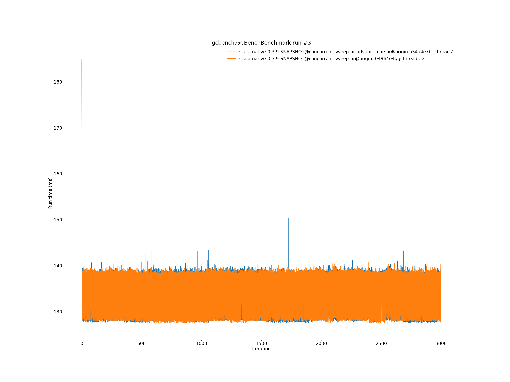

# Summary
## Benchmark run time (ms) at 50 percentile 

|name | scala-native-0.3.9-SNAPSHOT@concurrent-sweep-ur-advance-cursor@origin.a34a4e7b._threads2 | scala-native-0.3.9-SNAPSHOT@concurrent-sweep-ur@origin.f04964e4./gcthreads_2 | |
| -- | -- | -- | -- |
|[bounce.BounceBenchmark](#bouncebouncebenchmark)|0.0574|0.0542|__-5.55%__|
|[brainfuck.BrainfuckBenchmark](#brainfuckbrainfuckbenchmark)|3.4785|3.3010|__-5.10%__|
|[cd.CDBenchmark](#cdcdbenchmark)|32.4272|31.7257|__-2.16%__|
|[deltablue.DeltaBlueBenchmark](#deltabluedeltabluebenchmark)|0.1822|0.1836|+0.78%|
|[gcbench.GCBenchBenchmark](#gcbenchgcbenchbenchmark)|136.5296|136.5585|+0.02%|
|[json.JsonBenchmark](#jsonjsonbenchmark)|1.6402|1.6440|+0.23%|
|[kmeans.KmeansBenchmark](#kmeanskmeansbenchmark)|53.6576|53.0279|__-1.17%__|
|[list.ListBenchmark](#listlistbenchmark)|0.0550|0.0565|+2.81%|
|[mandelbrot.MandelbrotBenchmark](#mandelbrotmandelbrotbenchmark)|126.0199|125.9583|__-0.05%__|
|[nbody.NbodyBenchmark](#nbodynbodybenchmark)|39.4253|39.4535|+0.07%|
|[permute.PermuteBenchmark](#permutepermutebenchmark)|0.2034|0.2022|__-0.60%__|
|[queens.QueensBenchmark](#queensqueensbenchmark)|0.1148|0.1155|+0.62%|
|[richards.RichardsBenchmark](#richardsrichardsbenchmark)|0.0760|0.0778|+2.39%|
|[sudoku.SudokuBenchmark](#sudokusudokubenchmark)|2.5516|2.5235|__-1.10%__|
|[tracer.TracerBenchmark](#tracertracerbenchmark)|0.7711|0.7635|__-0.99%__|
| __Geometrical mean:__|| |__-0.68%__|
## Benchmark run time (ms) at 90 percentile 

|name | scala-native-0.3.9-SNAPSHOT@concurrent-sweep-ur-advance-cursor@origin.a34a4e7b._threads2 | scala-native-0.3.9-SNAPSHOT@concurrent-sweep-ur@origin.f04964e4./gcthreads_2 | |
| -- | -- | -- | -- |
|[bounce.BounceBenchmark](#bouncebouncebenchmark)|0.0576|0.0555|__-3.70%__|
|[brainfuck.BrainfuckBenchmark](#brainfuckbrainfuckbenchmark)|3.5489|3.4328|__-3.27%__|
|[cd.CDBenchmark](#cdcdbenchmark)|32.6721|32.0801|__-1.81%__|
|[deltablue.DeltaBlueBenchmark](#deltabluedeltabluebenchmark)|0.1874|0.1891|+0.93%|
|[gcbench.GCBenchBenchmark](#gcbenchgcbenchbenchmark)|139.5088|139.1217|__-0.28%__|
|[json.JsonBenchmark](#jsonjsonbenchmark)|1.6631|1.6640|+0.05%|
|[kmeans.KmeansBenchmark](#kmeanskmeansbenchmark)|55.5151|54.9935|__-0.94%__|
|[list.ListBenchmark](#listlistbenchmark)|0.0564|0.0581|+2.97%|
|[mandelbrot.MandelbrotBenchmark](#mandelbrotmandelbrotbenchmark)|127.1546|126.6953|__-0.36%__|
|[nbody.NbodyBenchmark](#nbodynbodybenchmark)|39.8804|39.9187|+0.10%|
|[permute.PermuteBenchmark](#permutepermutebenchmark)|0.2272|0.2094|__-7.85%__|
|[queens.QueensBenchmark](#queensqueensbenchmark)|0.1189|0.1177|__-1.01%__|
|[richards.RichardsBenchmark](#richardsrichardsbenchmark)|0.0784|0.0806|+2.79%|
|[sudoku.SudokuBenchmark](#sudokusudokubenchmark)|2.6822|2.5955|__-3.24%__|
|[tracer.TracerBenchmark](#tracertracerbenchmark)|0.7877|0.7918|+0.52%|
| __Geometrical mean:__|| |__-1.04%__|
## Benchmark run time (ms) at 99 percentile 

|name | scala-native-0.3.9-SNAPSHOT@concurrent-sweep-ur-advance-cursor@origin.a34a4e7b._threads2 | scala-native-0.3.9-SNAPSHOT@concurrent-sweep-ur@origin.f04964e4./gcthreads_2 | |
| -- | -- | -- | -- |
|[bounce.BounceBenchmark](#bouncebouncebenchmark)|0.0606|0.0582|__-3.97%__|
|[brainfuck.BrainfuckBenchmark](#brainfuckbrainfuckbenchmark)|3.6356|3.5217|__-3.13%__|
|[cd.CDBenchmark](#cdcdbenchmark)|33.2058|32.4583|__-2.25%__|
|[deltablue.DeltaBlueBenchmark](#deltabluedeltabluebenchmark)|0.2797|0.2694|__-3.72%__|
|[gcbench.GCBenchBenchmark](#gcbenchgcbenchbenchmark)|140.6681|141.0374|+0.26%|
|[json.JsonBenchmark](#jsonjsonbenchmark)|1.7007|1.7179|+1.01%|
|[kmeans.KmeansBenchmark](#kmeanskmeansbenchmark)|56.9495|56.5032|__-0.78%__|
|[list.ListBenchmark](#listlistbenchmark)|0.0586|0.0599|+2.21%|
|[mandelbrot.MandelbrotBenchmark](#mandelbrotmandelbrotbenchmark)|129.6918|129.5393|__-0.12%__|
|[nbody.NbodyBenchmark](#nbodynbodybenchmark)|41.3263|41.3528|+0.06%|
|[permute.PermuteBenchmark](#permutepermutebenchmark)|0.2480|0.2473|__-0.31%__|
|[queens.QueensBenchmark](#queensqueensbenchmark)|0.1232|0.1232|__-0.01%__|
|[richards.RichardsBenchmark](#richardsrichardsbenchmark)|0.0890|0.0912|+2.41%|
|[sudoku.SudokuBenchmark](#sudokusudokubenchmark)|2.7855|2.6873|__-3.52%__|
|[tracer.TracerBenchmark](#tracertracerbenchmark)|0.8155|0.8514|+4.39%|
| __Geometrical mean:__|| |__-0.53%__|
## Benchmark total run time (ms) 

|name | scala-native-0.3.9-SNAPSHOT@concurrent-sweep-ur-advance-cursor@origin.a34a4e7b._threads2 | scala-native-0.3.9-SNAPSHOT@concurrent-sweep-ur@origin.f04964e4./gcthreads_2 | |
| -- | -- | -- | -- |
|[bounce.BounceBenchmark](#bouncebouncebenchmark)|1151.2534|1091.1490|__-5.22%__|
|[brainfuck.BrainfuckBenchmark](#brainfuckbrainfuckbenchmark)|69706.9817|66312.9484|__-4.87%__|
|[cd.CDBenchmark](#cdcdbenchmark)|649225.3858|635637.2402|__-2.09%__|
|[deltablue.DeltaBlueBenchmark](#deltabluedeltabluebenchmark)|3738.1427|3759.9237|+0.58%|
|[gcbench.GCBenchBenchmark](#gcbenchgcbenchbenchmark)|2670709.9006|2668367.9506|__-0.09%__|
|[json.JsonBenchmark](#jsonjsonbenchmark)|32232.4373|32260.1459|+0.09%|
|[kmeans.KmeansBenchmark](#kmeanskmeansbenchmark)|1067583.2555|1058608.3372|__-0.84%__|
|[list.ListBenchmark](#listlistbenchmark)|1106.8058|1138.6715|+2.88%|
|[mandelbrot.MandelbrotBenchmark](#mandelbrotmandelbrotbenchmark)|2527453.2205|2524764.8800|__-0.11%__|
|[nbody.NbodyBenchmark](#nbodynbodybenchmark)|790959.5901|791482.3308|+0.07%|
|[permute.PermuteBenchmark](#permutepermutebenchmark)|4149.5135|4103.4744|__-1.11%__|
|[queens.QueensBenchmark](#queensqueensbenchmark)|2313.2641|2322.3978|+0.39%|
|[richards.RichardsBenchmark](#richardsrichardsbenchmark)|1537.9378|1572.8392|+2.27%|
|[sudoku.SudokuBenchmark](#sudokusudokubenchmark)|51545.4714|50808.3200|__-1.43%__|
|[tracer.TracerBenchmark](#tracertracerbenchmark)|15328.0598|15232.2110|__-0.63%__|
| __Geometrical mean:__|| |__-0.70%__|
# Individual benchmarks
## bounce.BounceBenchmark

## brainfuck.BrainfuckBenchmark

## cd.CDBenchmark

## deltablue.DeltaBlueBenchmark

## gcbench.GCBenchBenchmark

## json.JsonBenchmark

## kmeans.KmeansBenchmark

## list.ListBenchmark

## mandelbrot.MandelbrotBenchmark

## nbody.NbodyBenchmark

## permute.PermuteBenchmark

## queens.QueensBenchmark

## richards.RichardsBenchmark

## sudoku.SudokuBenchmark

## tracer.TracerBenchmark

