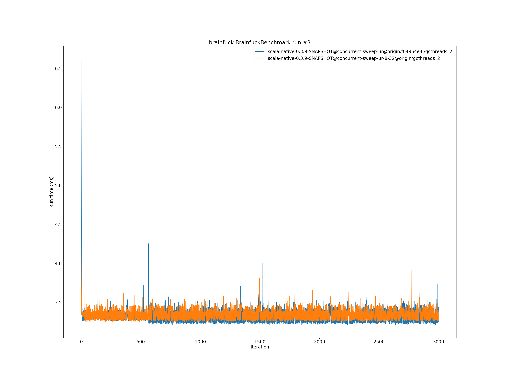
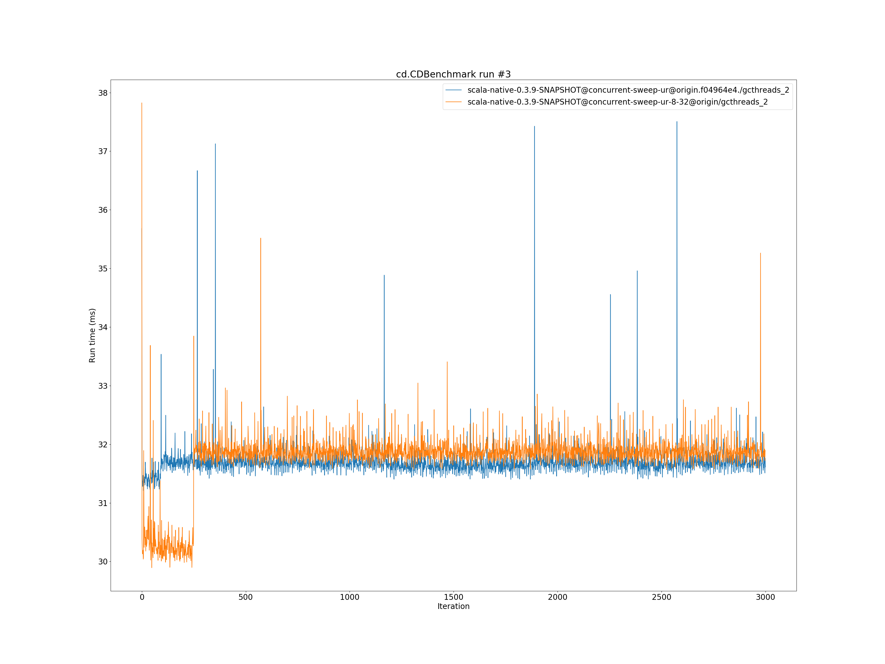
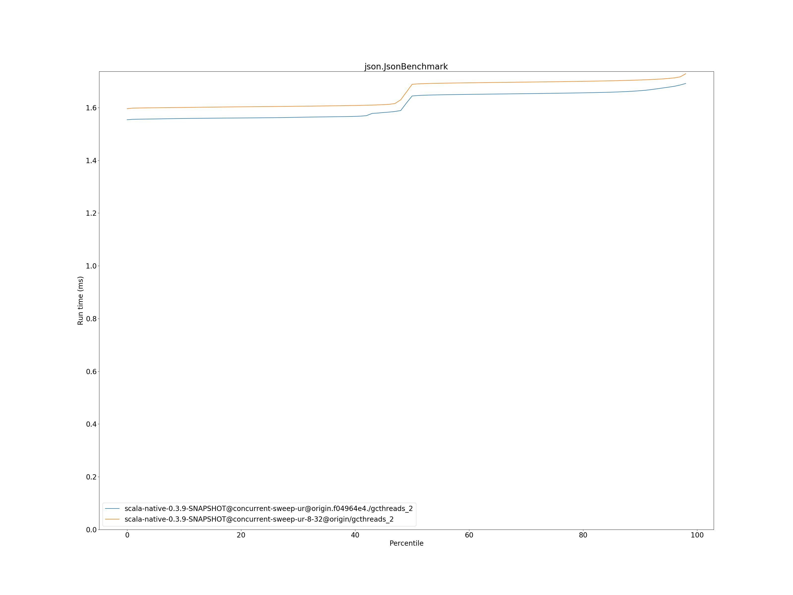
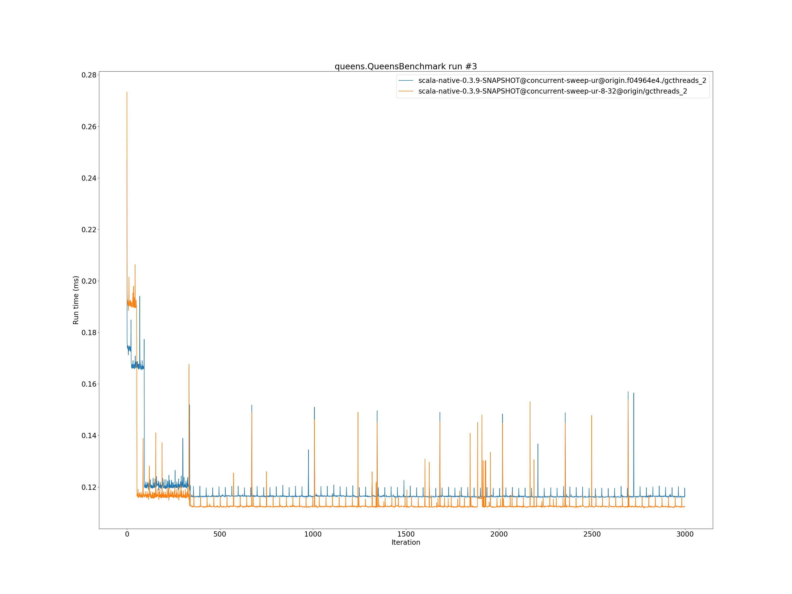
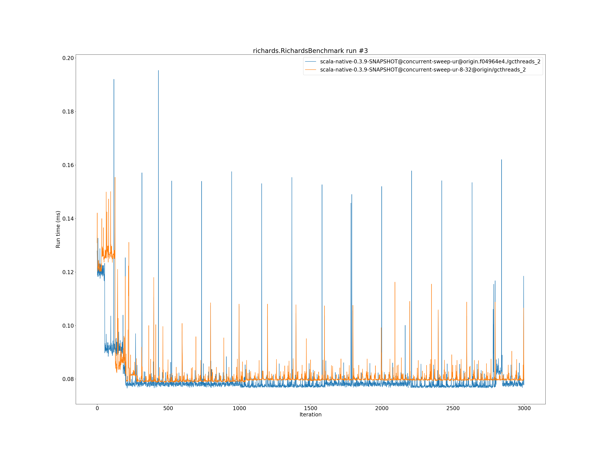

# Summary
## Benchmark run time (ms) at 50 percentile 

|name | scala-native-0.3.9-SNAPSHOT@concurrent-sweep-ur@origin.f04964e4./gcthreads_2 | scala-native-0.3.9-SNAPSHOT@concurrent-sweep-ur-8-32@origin/gcthreads_2 | |
| -- | -- | -- | -- |
|[bounce.BounceBenchmark](#bouncebouncebenchmark)|0.0542|0.0575|+6.11%|
|[brainfuck.BrainfuckBenchmark](#brainfuckbrainfuckbenchmark)|3.3010|3.3610|+1.82%|
|[cd.CDBenchmark](#cdcdbenchmark)|31.7257|31.9272|+0.64%|
|[deltablue.DeltaBlueBenchmark](#deltabluedeltabluebenchmark)|0.1836|0.1849|+0.69%|
|[gcbench.GCBenchBenchmark](#gcbenchgcbenchbenchmark)|136.5585|135.4401|__-0.82%__|
|[json.JsonBenchmark](#jsonjsonbenchmark)|1.6440|1.6883|+2.70%|
|[kmeans.KmeansBenchmark](#kmeanskmeansbenchmark)|53.0279|52.9949|__-0.06%__|
|[list.ListBenchmark](#listlistbenchmark)|0.0565|0.0566|+0.17%|
|[mandelbrot.MandelbrotBenchmark](#mandelbrotmandelbrotbenchmark)|125.9583|126.0192|+0.05%|
|[nbody.NbodyBenchmark](#nbodynbodybenchmark)|39.4535|39.5105|+0.14%|
|[permute.PermuteBenchmark](#permutepermutebenchmark)|0.2022|0.2035|+0.64%|
|[queens.QueensBenchmark](#queensqueensbenchmark)|0.1155|0.1131|__-2.10%__|
|[richards.RichardsBenchmark](#richardsrichardsbenchmark)|0.0778|0.0800|+2.77%|
|[sudoku.SudokuBenchmark](#sudokusudokubenchmark)|2.5235|2.4204|__-4.08%__|
|[tracer.TracerBenchmark](#tracertracerbenchmark)|0.7635|0.7704|+0.91%|
| __Geometrical mean:__|| |+0.61%|
## Benchmark run time (ms) at 90 percentile 

|name | scala-native-0.3.9-SNAPSHOT@concurrent-sweep-ur@origin.f04964e4./gcthreads_2 | scala-native-0.3.9-SNAPSHOT@concurrent-sweep-ur-8-32@origin/gcthreads_2 | |
| -- | -- | -- | -- |
|[bounce.BounceBenchmark](#bouncebouncebenchmark)|0.0555|0.0578|+4.24%|
|[brainfuck.BrainfuckBenchmark](#brainfuckbrainfuckbenchmark)|3.4328|3.4677|+1.02%|
|[cd.CDBenchmark](#cdcdbenchmark)|32.0801|32.1674|+0.27%|
|[deltablue.DeltaBlueBenchmark](#deltabluedeltabluebenchmark)|0.1891|0.1907|+0.86%|
|[gcbench.GCBenchBenchmark](#gcbenchgcbenchbenchmark)|139.1217|138.6298|__-0.35%__|
|[json.JsonBenchmark](#jsonjsonbenchmark)|1.6640|1.7047|+2.45%|
|[kmeans.KmeansBenchmark](#kmeanskmeansbenchmark)|54.9935|54.6179|__-0.68%__|
|[list.ListBenchmark](#listlistbenchmark)|0.0581|0.0583|+0.34%|
|[mandelbrot.MandelbrotBenchmark](#mandelbrotmandelbrotbenchmark)|126.6953|126.6296|__-0.05%__|
|[nbody.NbodyBenchmark](#nbodynbodybenchmark)|39.9187|39.9563|+0.09%|
|[permute.PermuteBenchmark](#permutepermutebenchmark)|0.2094|0.2432|+16.14%|
|[queens.QueensBenchmark](#queensqueensbenchmark)|0.1177|0.1154|__-1.91%__|
|[richards.RichardsBenchmark](#richardsrichardsbenchmark)|0.0806|0.0827|+2.61%|
|[sudoku.SudokuBenchmark](#sudokusudokubenchmark)|2.5955|2.5532|__-1.63%__|
|[tracer.TracerBenchmark](#tracertracerbenchmark)|0.7918|0.7868|__-0.63%__|
| __Geometrical mean:__|| |+1.44%|
## Benchmark run time (ms) at 99 percentile 

|name | scala-native-0.3.9-SNAPSHOT@concurrent-sweep-ur@origin.f04964e4./gcthreads_2 | scala-native-0.3.9-SNAPSHOT@concurrent-sweep-ur-8-32@origin/gcthreads_2 | |
| -- | -- | -- | -- |
|[bounce.BounceBenchmark](#bouncebouncebenchmark)|0.0582|0.0610|+4.85%|
|[brainfuck.BrainfuckBenchmark](#brainfuckbrainfuckbenchmark)|3.5217|3.5711|+1.40%|
|[cd.CDBenchmark](#cdcdbenchmark)|32.4583|32.6731|+0.66%|
|[deltablue.DeltaBlueBenchmark](#deltabluedeltabluebenchmark)|0.2694|0.2680|__-0.51%__|
|[gcbench.GCBenchBenchmark](#gcbenchgcbenchbenchmark)|141.0374|139.7666|__-0.90%__|
|[json.JsonBenchmark](#jsonjsonbenchmark)|1.7179|1.7553|+2.18%|
|[kmeans.KmeansBenchmark](#kmeanskmeansbenchmark)|56.5032|55.9027|__-1.06%__|
|[list.ListBenchmark](#listlistbenchmark)|0.0599|0.0611|+2.06%|
|[mandelbrot.MandelbrotBenchmark](#mandelbrotmandelbrotbenchmark)|129.5393|129.5780|+0.03%|
|[nbody.NbodyBenchmark](#nbodynbodybenchmark)|41.3528|41.4446|+0.22%|
|[permute.PermuteBenchmark](#permutepermutebenchmark)|0.2473|0.2530|+2.33%|
|[queens.QueensBenchmark](#queensqueensbenchmark)|0.1232|0.1215|__-1.37%__|
|[richards.RichardsBenchmark](#richardsrichardsbenchmark)|0.0912|0.0923|+1.28%|
|[sudoku.SudokuBenchmark](#sudokusudokubenchmark)|2.6873|2.6306|__-2.11%__|
|[tracer.TracerBenchmark](#tracertracerbenchmark)|0.8514|0.8125|__-4.57%__|
| __Geometrical mean:__|| |+0.28%|
## Benchmark total run time (ms) 

|name | scala-native-0.3.9-SNAPSHOT@concurrent-sweep-ur@origin.f04964e4./gcthreads_2 | scala-native-0.3.9-SNAPSHOT@concurrent-sweep-ur-8-32@origin/gcthreads_2 | |
| -- | -- | -- | -- |
|[bounce.BounceBenchmark](#bouncebouncebenchmark)|1091.1490|1154.9022|+5.84%|
|[brainfuck.BrainfuckBenchmark](#brainfuckbrainfuckbenchmark)|66312.9484|67149.4265|+1.26%|
|[cd.CDBenchmark](#cdcdbenchmark)|635637.2402|639200.4903|+0.56%|
|[deltablue.DeltaBlueBenchmark](#deltabluedeltabluebenchmark)|3759.9237|3780.8286|+0.56%|
|[gcbench.GCBenchBenchmark](#gcbenchgcbenchbenchmark)|2668367.9506|2639696.6218|__-1.07%__|
|[json.JsonBenchmark](#jsonjsonbenchmark)|32260.1459|33088.4253|+2.57%|
|[kmeans.KmeansBenchmark](#kmeanskmeansbenchmark)|1058608.3372|1053022.0853|__-0.53%__|
|[list.ListBenchmark](#listlistbenchmark)|1138.6715|1141.5808|+0.26%|
|[mandelbrot.MandelbrotBenchmark](#mandelbrotmandelbrotbenchmark)|2524764.8800|2525361.8518|+0.02%|
|[nbody.NbodyBenchmark](#nbodynbodybenchmark)|791482.3308|792191.4100|+0.09%|
|[permute.PermuteBenchmark](#permutepermutebenchmark)|4103.4744|4208.9654|+2.57%|
|[queens.QueensBenchmark](#queensqueensbenchmark)|2322.3978|2276.1468|__-1.99%__|
|[richards.RichardsBenchmark](#richardsrichardsbenchmark)|1572.8392|1616.4458|+2.77%|
|[sudoku.SudokuBenchmark](#sudokusudokubenchmark)|50808.3200|48823.2372|__-3.91%__|
|[tracer.TracerBenchmark](#tracertracerbenchmark)|15232.2110|15263.7551|+0.21%|
| __Geometrical mean:__|| |+0.59%|
# Individual benchmarks
## bounce.BounceBenchmark

## brainfuck.BrainfuckBenchmark

## cd.CDBenchmark

## deltablue.DeltaBlueBenchmark

## gcbench.GCBenchBenchmark

## json.JsonBenchmark

## kmeans.KmeansBenchmark

## list.ListBenchmark

## mandelbrot.MandelbrotBenchmark

## nbody.NbodyBenchmark

## permute.PermuteBenchmark

## queens.QueensBenchmark

## richards.RichardsBenchmark

## sudoku.SudokuBenchmark

## tracer.TracerBenchmark

