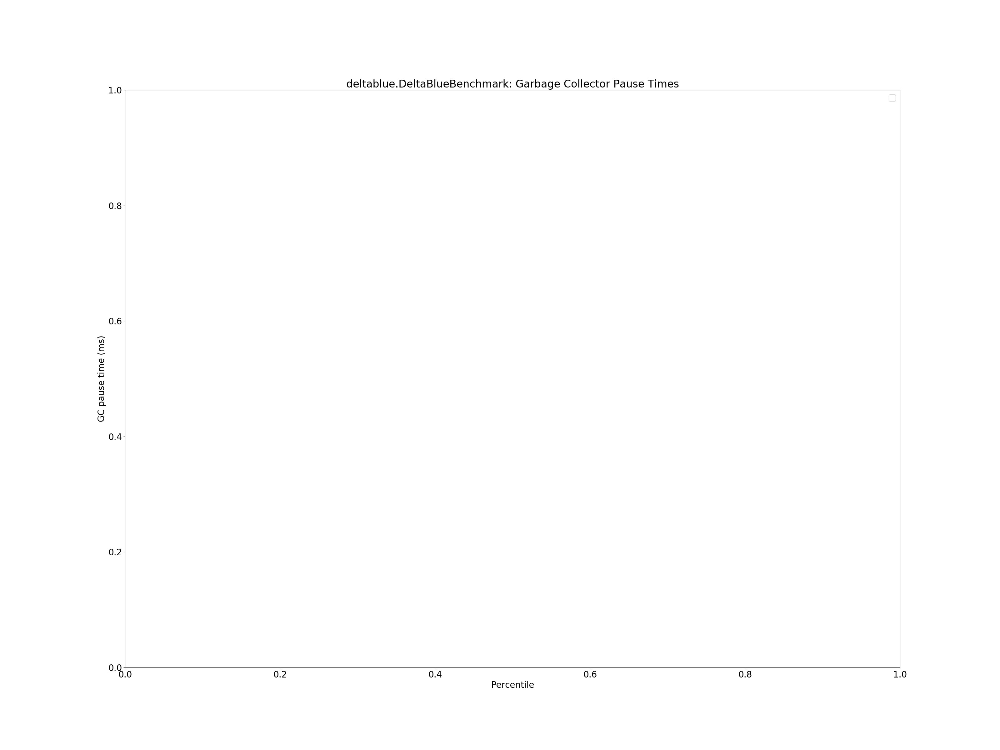
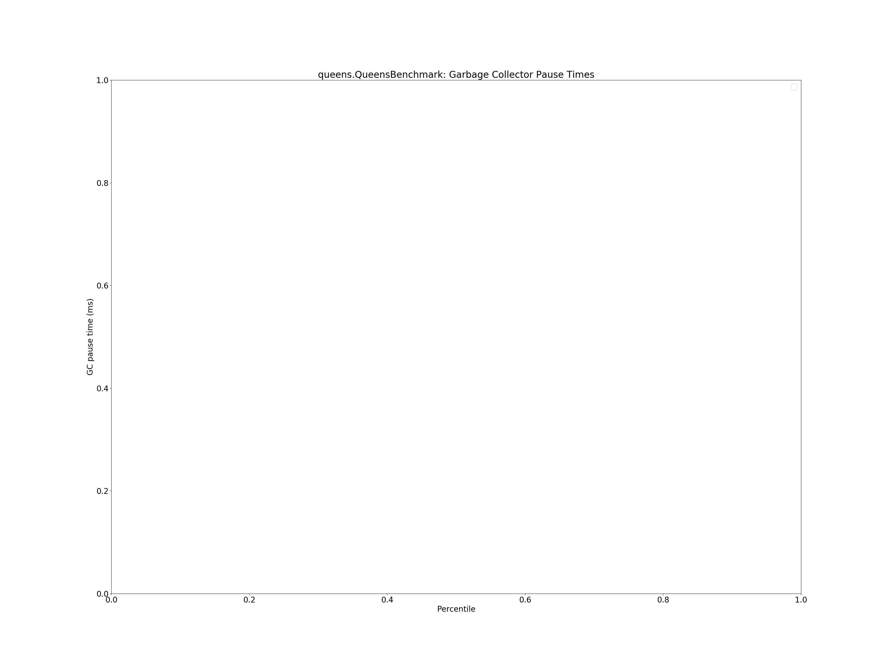

# Summary
## Benchmark run time (ms) at 50 percentile 

|name | scala-native-0.3.9-SNAPSHOT@concurrent-sweep-ur-8-16@origin-r3-gc/size_1g-1g_gcthreads_2 | scala-native-0.3.9-SNAPSHOT@concurrent-sweep-ur-8-32@origin-r3-gc/size_1g-1g_gcthreads_2 |  | scala-native-0.3.9-SNAPSHOT@concurrent-sweep-ur-8-64@origin-r3-gc/size_1g-1g_gcthreads_2 |  | scala-native-0.3.9-SNAPSHOT@concurrent-sweep-ur-4-16@origin-r3-gc/size_1g-1g_gcthreads_2 | |
| -- | -- | -- | -- | -- | -- | -- | -- |
|[bounce.BounceBenchmark](#bouncebouncebenchmark)|0.0562|0.0609|+8.50%|0.0567|+0.90%|0.0576|+2.51%|
|[brainfuck.BrainfuckBenchmark](#brainfuckbrainfuckbenchmark)|3.3936|3.3680|__-0.76%__|3.3607|__-0.97%__|3.3757|__-0.53%__|
|[cd.CDBenchmark](#cdcdbenchmark)|31.1154|31.5991|+1.55%|31.6803|+1.82%|31.2465|+0.42%|
|[deltablue.DeltaBlueBenchmark](#deltabluedeltabluebenchmark)|0.2314|0.2436|+5.30%|0.2356|+1.83%|0.2475|+6.98%|
|[gcbench.GCBenchBenchmark](#gcbenchgcbenchbenchmark)|105.1229|103.8453|__-1.22%__|104.4881|__-0.60%__|104.1755|__-0.90%__|
|[json.JsonBenchmark](#jsonjsonbenchmark)|1.6555|1.6408|__-0.89%__|1.6371|__-1.11%__|1.6495|__-0.37%__|
|[kmeans.KmeansBenchmark](#kmeanskmeansbenchmark)|51.2713|51.3572|+0.17%|51.0897|__-0.35%__|51.7017|+0.84%|
|[list.ListBenchmark](#listlistbenchmark)|0.0557|0.0550|__-1.22%__|0.0556|__-0.28%__|0.0647|+16.12%|
|[mandelbrot.MandelbrotBenchmark](#mandelbrotmandelbrotbenchmark)|126.0740|125.9709|__-0.08%__|126.0445|__-0.02%__|125.9628|__-0.09%__|
|[nbody.NbodyBenchmark](#nbodynbodybenchmark)|39.3863|39.3947|+0.02%|39.3865|+0.00%|39.5477|+0.41%|
|[permute.PermuteBenchmark](#permutepermutebenchmark)|0.2774|0.2779|+0.19%|0.3324|+19.83%|0.2760|__-0.51%__|
|[queens.QueensBenchmark](#queensqueensbenchmark)|0.1197|0.1197|+0.02%|0.1225|+2.38%|0.1174|__-1.87%__|
|[richards.RichardsBenchmark](#richardsrichardsbenchmark)|0.0896|0.0810|__-9.63%__|0.0894|__-0.24%__|0.0805|__-10.12%__|
|[sudoku.SudokuBenchmark](#sudokusudokubenchmark)|2.4507|2.4351|__-0.64%__|2.4910|+1.64%|2.4306|__-0.82%__|
|[tracer.TracerBenchmark](#tracertracerbenchmark)|0.8210|0.8189|__-0.26%__|0.8282|+0.87%|0.8285|+0.91%|
| __Geometrical mean:__|| |+0.00%| |+1.60%| |+0.73%|
## Benchmark run time (ms) at 90 percentile 

|name | scala-native-0.3.9-SNAPSHOT@concurrent-sweep-ur-8-16@origin-r3-gc/size_1g-1g_gcthreads_2 | scala-native-0.3.9-SNAPSHOT@concurrent-sweep-ur-8-32@origin-r3-gc/size_1g-1g_gcthreads_2 |  | scala-native-0.3.9-SNAPSHOT@concurrent-sweep-ur-8-64@origin-r3-gc/size_1g-1g_gcthreads_2 |  | scala-native-0.3.9-SNAPSHOT@concurrent-sweep-ur-4-16@origin-r3-gc/size_1g-1g_gcthreads_2 | |
| -- | -- | -- | -- | -- | -- | -- | -- |
|[bounce.BounceBenchmark](#bouncebouncebenchmark)|0.0574|0.0623|+8.54%|0.0579|+1.02%|0.0592|+3.13%|
|[brainfuck.BrainfuckBenchmark](#brainfuckbrainfuckbenchmark)|3.4964|3.4497|__-1.33%__|3.4691|__-0.78%__|3.4698|__-0.76%__|
|[cd.CDBenchmark](#cdcdbenchmark)|32.7770|32.7620|__-0.05%__|32.9907|+0.65%|32.5242|__-0.77%__|
|[deltablue.DeltaBlueBenchmark](#deltabluedeltabluebenchmark)|0.2387|0.2504|+4.89%|0.2420|+1.38%|0.2548|+6.74%|
|[gcbench.GCBenchBenchmark](#gcbenchgcbenchbenchmark)|110.4036|110.4068|+0.00%|110.5830|+0.16%|110.7787|+0.34%|
|[json.JsonBenchmark](#jsonjsonbenchmark)|1.7006|1.6860|__-0.86%__|1.6807|__-1.17%__|1.6929|__-0.45%__|
|[kmeans.KmeansBenchmark](#kmeanskmeansbenchmark)|52.5730|52.7179|+0.28%|52.2837|__-0.55%__|52.9502|+0.72%|
|[list.ListBenchmark](#listlistbenchmark)|0.0573|0.0561|__-2.02%__|0.0570|__-0.51%__|0.0657|+14.78%|
|[mandelbrot.MandelbrotBenchmark](#mandelbrotmandelbrotbenchmark)|126.8238|126.5300|__-0.23%__|126.5808|__-0.19%__|126.5271|__-0.23%__|
|[nbody.NbodyBenchmark](#nbodynbodybenchmark)|40.4867|40.4831|__-0.01%__|40.4733|__-0.03%__|40.6384|+0.37%|
|[permute.PermuteBenchmark](#permutepermutebenchmark)|0.2847|0.2847|+0.01%|0.3365|+18.21%|0.2831|__-0.56%__|
|[queens.QueensBenchmark](#queensqueensbenchmark)|0.1238|0.1219|__-1.48%__|0.1245|+0.59%|0.1204|__-2.75%__|
|[richards.RichardsBenchmark](#richardsrichardsbenchmark)|0.0921|0.0831|__-9.73%__|0.0922|+0.08%|0.0829|__-9.97%__|
|[sudoku.SudokuBenchmark](#sudokusudokubenchmark)|2.5122|2.5015|__-0.43%__|2.5412|+1.15%|2.5003|__-0.47%__|
|[tracer.TracerBenchmark](#tracertracerbenchmark)|0.8378|0.8382|+0.05%|0.8555|+2.11%|0.8555|+2.11%|
| __Geometrical mean:__|| |__-0.23%__| |+1.38%| |+0.69%|
## Benchmark run time (ms) at 99 percentile 

|name | scala-native-0.3.9-SNAPSHOT@concurrent-sweep-ur-8-16@origin-r3-gc/size_1g-1g_gcthreads_2 | scala-native-0.3.9-SNAPSHOT@concurrent-sweep-ur-8-32@origin-r3-gc/size_1g-1g_gcthreads_2 |  | scala-native-0.3.9-SNAPSHOT@concurrent-sweep-ur-8-64@origin-r3-gc/size_1g-1g_gcthreads_2 |  | scala-native-0.3.9-SNAPSHOT@concurrent-sweep-ur-4-16@origin-r3-gc/size_1g-1g_gcthreads_2 | |
| -- | -- | -- | -- | -- | -- | -- | -- |
|[bounce.BounceBenchmark](#bouncebouncebenchmark)|0.0598|0.0647|+8.14%|0.0605|+1.14%|0.0618|+3.29%|
|[brainfuck.BrainfuckBenchmark](#brainfuckbrainfuckbenchmark)|3.7542|3.6606|__-2.49%__|3.6179|__-3.63%__|3.6603|__-2.50%__|
|[cd.CDBenchmark](#cdcdbenchmark)|33.7956|34.6319|+2.47%|34.6190|+2.44%|33.9024|+0.32%|
|[deltablue.DeltaBlueBenchmark](#deltabluedeltabluebenchmark)|0.2527|0.2582|+2.16%|0.2563|+1.39%|0.2650|+4.84%|
|[gcbench.GCBenchBenchmark](#gcbenchgcbenchbenchmark)|111.6702|111.7266|+0.05%|111.7110|+0.04%|111.8692|+0.18%|
|[json.JsonBenchmark](#jsonjsonbenchmark)|1.7937|1.8050|+0.63%|1.8047|+0.61%|1.7957|+0.11%|
|[kmeans.KmeansBenchmark](#kmeanskmeansbenchmark)|56.4511|57.1054|+1.16%|56.9675|+0.91%|57.6388|+2.10%|
|[list.ListBenchmark](#listlistbenchmark)|0.0589|0.0584|__-0.94%__|0.0583|__-1.03%__|0.0676|+14.70%|
|[mandelbrot.MandelbrotBenchmark](#mandelbrotmandelbrotbenchmark)|129.6494|129.5172|__-0.10%__|129.5899|__-0.05%__|129.5542|__-0.07%__|
|[nbody.NbodyBenchmark](#nbodynbodybenchmark)|41.6684|41.6788|+0.02%|41.6382|__-0.07%__|41.8425|+0.42%|
|[permute.PermuteBenchmark](#permutepermutebenchmark)|0.2919|0.2951|+1.11%|0.3556|+21.84%|0.2894|__-0.85%__|
|[queens.QueensBenchmark](#queensqueensbenchmark)|0.1277|0.1241|__-2.78%__|0.1271|__-0.48%__|0.1231|__-3.57%__|
|[richards.RichardsBenchmark](#richardsrichardsbenchmark)|0.0975|0.0879|__-9.79%__|0.1020|+4.64%|0.0890|__-8.70%__|
|[sudoku.SudokuBenchmark](#sudokusudokubenchmark)|2.5689|2.5666|__-0.09%__|2.6330|+2.49%|2.6090|+1.56%|
|[tracer.TracerBenchmark](#tracertracerbenchmark)|1.4800|1.4911|+0.75%|1.5114|+2.12%|1.4770|__-0.20%__|
| __Geometrical mean:__|| |__-0.04%__| |+2.02%| |+0.66%|
## Benchmark total run time (ms) 

|name | scala-native-0.3.9-SNAPSHOT@concurrent-sweep-ur-8-16@origin-r3-gc/size_1g-1g_gcthreads_2 | scala-native-0.3.9-SNAPSHOT@concurrent-sweep-ur-8-32@origin-r3-gc/size_1g-1g_gcthreads_2 |  | scala-native-0.3.9-SNAPSHOT@concurrent-sweep-ur-8-64@origin-r3-gc/size_1g-1g_gcthreads_2 |  | scala-native-0.3.9-SNAPSHOT@concurrent-sweep-ur-4-16@origin-r3-gc/size_1g-1g_gcthreads_2 | |
| -- | -- | -- | -- | -- | -- | -- | -- |
|[bounce.BounceBenchmark](#bouncebouncebenchmark)|168.7845|183.2338|+8.56%|170.3011|+0.90%|173.2293|+2.63%|
|[brainfuck.BrainfuckBenchmark](#brainfuckbrainfuckbenchmark)|10296.9555|10171.1215|__-1.22%__|10168.7643|__-1.24%__|10218.1859|__-0.76%__|
|[cd.CDBenchmark](#cdcdbenchmark)|94702.0855|95873.2568|+1.24%|96281.7194|+1.67%|94799.0096|+0.10%|
|[deltablue.DeltaBlueBenchmark](#deltabluedeltabluebenchmark)|699.4512|735.8231|+5.20%|708.0748|+1.23%|743.0513|+6.23%|
|[gcbench.GCBenchBenchmark](#gcbenchgcbenchbenchmark)|309772.1473|309616.8204|__-0.05%__|310287.8612|+0.17%|310161.8361|+0.13%|
|[json.JsonBenchmark](#jsonjsonbenchmark)|5001.6587|4966.2266|__-0.71%__|4944.3929|__-1.14%__|4981.6145|__-0.40%__|
|[kmeans.KmeansBenchmark](#kmeanskmeansbenchmark)|154638.0648|155061.4696|+0.27%|154104.8421|__-0.34%__|156005.1073|+0.88%|
|[list.ListBenchmark](#listlistbenchmark)|167.5797|166.3298|__-0.75%__|166.8530|__-0.43%__|194.8141|+16.25%|
|[mandelbrot.MandelbrotBenchmark](#mandelbrotmandelbrotbenchmark)|379045.5814|378612.1626|__-0.11%__|378828.8243|__-0.06%__|378634.1290|__-0.11%__|
|[nbody.NbodyBenchmark](#nbodynbodybenchmark)|119080.5125|119055.3704|__-0.02%__|119016.1685|__-0.05%__|119540.8315|+0.39%|
|[permute.PermuteBenchmark](#permutepermutebenchmark)|837.2543|839.8747|+0.31%|1000.7217|+19.52%|832.3203|__-0.59%__|
|[queens.QueensBenchmark](#queensqueensbenchmark)|361.2983|360.3244|__-0.27%__|365.7055|+1.22%|354.2491|__-1.95%__|
|[richards.RichardsBenchmark](#richardsrichardsbenchmark)|269.7068|244.0939|__-9.50%__|269.8233|+0.04%|242.9996|__-9.90%__|
|[sudoku.SudokuBenchmark](#sudokusudokubenchmark)|7396.9032|7352.3401|__-0.60%__|7507.5695|+1.50%|7360.0472|__-0.50%__|
|[tracer.TracerBenchmark](#tracertracerbenchmark)|2500.6131|2496.8288|__-0.15%__|2529.6006|+1.16%|2528.4565|+1.11%|
| __Geometrical mean:__|| |+0.08%| |+1.50%| |+0.77%|
## Total GC time on Application thread (ms) 

|name |  | scala-native-0.3.9-SNAPSHOT@concurrent-sweep-ur-8-16@origin-r3-gc/size_1g-1g_gcthreads_2 | scala-native-0.3.9-SNAPSHOT@concurrent-sweep-ur-8-32@origin-r3-gc/size_1g-1g_gcthreads_2 |  | scala-native-0.3.9-SNAPSHOT@concurrent-sweep-ur-8-64@origin-r3-gc/size_1g-1g_gcthreads_2 |  | scala-native-0.3.9-SNAPSHOT@concurrent-sweep-ur-4-16@origin-r3-gc/size_1g-1g_gcthreads_2 | |
| -- | -- | -- | -- | -- | -- | -- | -- | -- |
|[bounce.BounceBenchmark](#bouncebouncebenchmark)|mark|0.0000|0.0000|N/A|0.0000|N/A|0.0000|N/A|
||sweep|0.0000|0.0000|N/A|0.0000|N/A|0.0000|N/A|
||total|0.0000|0.0000|N/A|0.0000|N/A|0.0000|N/A|
|[brainfuck.BrainfuckBenchmark](#brainfuckbrainfuckbenchmark)|mark|4.0533|3.7047|__-8.60%__|3.3960|__-16.21%__|3.5194|__-13.17%__|
||sweep|0.2398|0.3284|+36.94%|0.3840|+60.09%|0.2227|__-7.16%__|
||total|660.2908|659.3135|__-0.15%__|659.1308|__-0.18%__|661.0024|+0.11%|
|[cd.CDBenchmark](#cdcdbenchmark)|mark|45.2807|45.6410|+0.80%|44.6973|__-1.29%__|46.1015|+1.81%|
||sweep|4.5738|4.8562|+6.17%|4.7388|+3.61%|3.9323|__-14.03%__|
||total|12394.2591|12371.7410|__-0.18%__|12361.3255|__-0.27%__|12413.2008|+0.15%|
|[deltablue.DeltaBlueBenchmark](#deltabluedeltabluebenchmark)|mark|0.0000|0.0000|N/A|0.0000|N/A|0.0000|N/A|
||sweep|0.0000|0.0000|N/A|0.0000|N/A|0.0000|N/A|
||total|0.0000|0.0000|N/A|0.0000|N/A|0.0000|N/A|
|[gcbench.GCBenchBenchmark](#gcbenchgcbenchbenchmark)|mark|40085.7828|40084.2298|__-0.00%__|40006.4621|__-0.20%__|40164.4395|+0.20%|
||sweep|97.4331|124.9745|+28.27%|187.5999|+92.54%|102.1638|+4.86%|
||total|186242.7560|185970.2133|__-0.15%__|185560.9767|__-0.37%__|185775.8373|__-0.25%__|
|[json.JsonBenchmark](#jsonjsonbenchmark)|mark|2.8559|2.8509|__-0.18%__|2.8427|__-0.47%__|2.8378|__-0.63%__|
||sweep|0.0824|0.1327|+61.03%|0.0993|+20.50%|0.0658|__-20.11%__|
||total|311.7981|311.5081|__-0.09%__|312.3647|+0.18%|311.9088|+0.04%|
|[kmeans.KmeansBenchmark](#kmeanskmeansbenchmark)|mark|776.2064|765.6324|__-1.36%__|766.4000|__-1.26%__|769.3941|__-0.88%__|
||sweep|4.6770|4.6621|__-0.32%__|4.7431|+1.41%|4.0356|__-13.71%__|
||total|5807.6314|5728.2003|__-1.37%__|5759.5099|__-0.83%__|5761.9408|__-0.79%__|
|[list.ListBenchmark](#listlistbenchmark)|mark|0.0000|0.0000|N/A|0.0000|N/A|0.0000|N/A|
||sweep|0.0000|0.0000|N/A|0.0000|N/A|0.0000|N/A|
||total|0.0000|0.0000|N/A|0.0000|N/A|0.0000|N/A|
|[mandelbrot.MandelbrotBenchmark](#mandelbrotmandelbrotbenchmark)|mark|0.0000|0.0000|N/A|0.0000|N/A|0.0000|N/A|
||sweep|0.0000|0.0000|N/A|0.0000|N/A|0.0000|N/A|
||total|0.0000|0.0000|N/A|0.0000|N/A|0.0000|N/A|
|[nbody.NbodyBenchmark](#nbodynbodybenchmark)|mark|1.8664|1.8217|__-2.40%__|1.8749|+0.46%|1.8870|+1.11%|
||sweep|0.4385|0.4414|+0.68%|0.4649|+6.03%|0.2675|__-38.99%__|
||total|1297.2024|1301.5291|+0.33%|1296.9589|__-0.02%__|1305.0971|+0.61%|
|[permute.PermuteBenchmark](#permutepermutebenchmark)|mark|0.0000|0.0000|N/A|0.0000|N/A|0.0000|N/A|
||sweep|0.0000|0.0000|N/A|0.0000|N/A|0.0000|N/A|
||total|0.0000|0.0000|N/A|0.0000|N/A|0.0000|N/A|
|[queens.QueensBenchmark](#queensqueensbenchmark)|mark|0.0000|0.0000|N/A|0.0000|N/A|0.0000|N/A|
||sweep|0.0000|0.0000|N/A|0.0000|N/A|0.0000|N/A|
||total|0.0000|0.0000|N/A|0.0000|N/A|0.0000|N/A|
|[richards.RichardsBenchmark](#richardsrichardsbenchmark)|mark|0.0000|0.0000|N/A|0.0000|N/A|0.0000|N/A|
||sweep|0.0000|0.0000|N/A|0.0000|N/A|0.0000|N/A|
||total|0.0000|0.0000|N/A|0.0000|N/A|0.0000|N/A|
|[sudoku.SudokuBenchmark](#sudokusudokubenchmark)|mark|1.9835|2.0052|+1.09%|1.9929|+0.47%|2.0424|+2.97%|
||sweep|0.1175|0.0863|__-26.54%__|0.0834|__-29.05%__|0.0486|__-58.67%__|
||total|239.2839|238.1102|__-0.49%__|239.1115|__-0.07%__|238.8879|__-0.17%__|
|[tracer.TracerBenchmark](#tracertracerbenchmark)|mark|0.7478|0.7574|+1.29%|0.7698|+2.95%|0.7684|+2.75%|
||sweep|0.3917|0.6452|+64.74%|0.9926|+153.45%|0.3797|__-3.06%__|
||total|549.4331|548.3302|__-0.20%__|547.4316|__-0.36%__|548.5721|__-0.16%__|
|__Geometrical mean:__|mark|| |__-1.22%__| |__-2.11%__| |__-0.86%__|
||sweep|| |+17.56%| |+28.52%| |__-21.72%__|
||total|| |__-0.29%__| |__-0.24%__| |__-0.06%__|
## GC pause time (ms) at 50 percentile 

|name | scala-native-0.3.9-SNAPSHOT@concurrent-sweep-ur-8-16@origin-r3-gc/size_1g-1g_gcthreads_2 | scala-native-0.3.9-SNAPSHOT@concurrent-sweep-ur-8-32@origin-r3-gc/size_1g-1g_gcthreads_2 |  | scala-native-0.3.9-SNAPSHOT@concurrent-sweep-ur-8-64@origin-r3-gc/size_1g-1g_gcthreads_2 |  | scala-native-0.3.9-SNAPSHOT@concurrent-sweep-ur-4-16@origin-r3-gc/size_1g-1g_gcthreads_2 | |
| -- | -- | -- | -- | -- | -- | -- | -- |
|[bounce.BounceBenchmark](#bouncebouncebenchmark)|0.0000|0.0000|N/A|0.0000|N/A|0.0000|N/A|
|[brainfuck.BrainfuckBenchmark](#brainfuckbrainfuckbenchmark)|0.1758|0.1702|__-3.20%__|0.1746|__-0.70%__|0.1700|__-3.30%__|
|[cd.CDBenchmark](#cdcdbenchmark)|0.1095|0.1218|+11.29%|0.1042|__-4.86%__|0.0771|__-29.61%__|
|[deltablue.DeltaBlueBenchmark](#deltabluedeltabluebenchmark)|0.0000|0.0000|N/A|0.0000|N/A|0.0000|N/A|
|[gcbench.GCBenchBenchmark](#gcbenchgcbenchbenchmark)|7.7442|7.6973|__-0.61%__|7.6767|__-0.87%__|7.7303|__-0.18%__|
|[json.JsonBenchmark](#jsonjsonbenchmark)|3.5268|3.5286|+0.05%|3.5391|+0.35%|0.3241|__-90.81%__|
|[kmeans.KmeansBenchmark](#kmeanskmeansbenchmark)|4.8850|4.7738|__-2.28%__|4.6489|__-4.83%__|4.6355|__-5.11%__|
|[list.ListBenchmark](#listlistbenchmark)|0.0000|0.0000|N/A|0.0000|N/A|0.0000|N/A|
|[mandelbrot.MandelbrotBenchmark](#mandelbrotmandelbrotbenchmark)|0.0000|0.0000|N/A|0.0000|N/A|0.0000|N/A|
|[nbody.NbodyBenchmark](#nbodynbodybenchmark)|3.0856|3.0825|__-0.10%__|3.0888|+0.11%|3.0864|+0.03%|
|[permute.PermuteBenchmark](#permutepermutebenchmark)|0.0000|0.0000|N/A|0.0000|N/A|0.0000|N/A|
|[queens.QueensBenchmark](#queensqueensbenchmark)|0.0000|0.0000|N/A|0.0000|N/A|0.0000|N/A|
|[richards.RichardsBenchmark](#richardsrichardsbenchmark)|0.0000|0.0000|N/A|0.0000|N/A|0.0000|N/A|
|[sudoku.SudokuBenchmark](#sudokusudokubenchmark)|3.3135|3.3206|+0.22%|3.3266|+0.40%|3.3310|+0.53%|
|[tracer.TracerBenchmark](#tracertracerbenchmark)|0.0336|0.0331|__-1.54%__|0.0384|+14.41%|0.0354|+5.40%|
| __Geometrical mean:__|| |+0.39%| |+0.35%| |__-29.25%__|
## GC pause time (ms) at 90 percentile 

|name | scala-native-0.3.9-SNAPSHOT@concurrent-sweep-ur-8-16@origin-r3-gc/size_1g-1g_gcthreads_2 | scala-native-0.3.9-SNAPSHOT@concurrent-sweep-ur-8-32@origin-r3-gc/size_1g-1g_gcthreads_2 |  | scala-native-0.3.9-SNAPSHOT@concurrent-sweep-ur-8-64@origin-r3-gc/size_1g-1g_gcthreads_2 |  | scala-native-0.3.9-SNAPSHOT@concurrent-sweep-ur-4-16@origin-r3-gc/size_1g-1g_gcthreads_2 | |
| -- | -- | -- | -- | -- | -- | -- | -- |
|[bounce.BounceBenchmark](#bouncebouncebenchmark)|0.0000|0.0000|N/A|0.0000|N/A|0.0000|N/A|
|[brainfuck.BrainfuckBenchmark](#brainfuckbrainfuckbenchmark)|6.7365|6.7160|__-0.30%__|6.6940|__-0.63%__|6.7212|__-0.23%__|
|[cd.CDBenchmark](#cdcdbenchmark)|7.2923|7.2781|__-0.19%__|7.2715|__-0.28%__|7.2976|+0.07%|
|[deltablue.DeltaBlueBenchmark](#deltabluedeltabluebenchmark)|0.0000|0.0000|N/A|0.0000|N/A|0.0000|N/A|
|[gcbench.GCBenchBenchmark](#gcbenchgcbenchbenchmark)|16.9420|16.8892|__-0.31%__|16.8441|__-0.58%__|16.8984|__-0.26%__|
|[json.JsonBenchmark](#jsonjsonbenchmark)|6.9463|6.9223|__-0.35%__|6.9767|+0.44%|6.9510|+0.07%|
|[kmeans.KmeansBenchmark](#kmeanskmeansbenchmark)|8.6203|7.9760|__-7.47%__|8.0469|__-6.65%__|7.9792|__-7.44%__|
|[list.ListBenchmark](#listlistbenchmark)|0.0000|0.0000|N/A|0.0000|N/A|0.0000|N/A|
|[mandelbrot.MandelbrotBenchmark](#mandelbrotmandelbrotbenchmark)|0.0000|0.0000|N/A|0.0000|N/A|0.0000|N/A|
|[nbody.NbodyBenchmark](#nbodynbodybenchmark)|6.3842|6.4075|+0.37%|6.3589|__-0.40%__|6.4069|+0.36%|
|[permute.PermuteBenchmark](#permutepermutebenchmark)|0.0000|0.0000|N/A|0.0000|N/A|0.0000|N/A|
|[queens.QueensBenchmark](#queensqueensbenchmark)|0.0000|0.0000|N/A|0.0000|N/A|0.0000|N/A|
|[richards.RichardsBenchmark](#richardsrichardsbenchmark)|0.0000|0.0000|N/A|0.0000|N/A|0.0000|N/A|
|[sudoku.SudokuBenchmark](#sudokusudokubenchmark)|6.7029|6.6776|__-0.38%__|6.7187|+0.24%|6.7095|+0.10%|
|[tracer.TracerBenchmark](#tracertracerbenchmark)|7.6584|7.6434|__-0.20%__|7.6162|__-0.55%__|7.6513|__-0.09%__|
| __Geometrical mean:__|| |__-1.14%__| |__-1.08%__| |__-0.96%__|
## GC pause time (ms) at 99 percentile 

|name | scala-native-0.3.9-SNAPSHOT@concurrent-sweep-ur-8-16@origin-r3-gc/size_1g-1g_gcthreads_2 | scala-native-0.3.9-SNAPSHOT@concurrent-sweep-ur-8-32@origin-r3-gc/size_1g-1g_gcthreads_2 |  | scala-native-0.3.9-SNAPSHOT@concurrent-sweep-ur-8-64@origin-r3-gc/size_1g-1g_gcthreads_2 |  | scala-native-0.3.9-SNAPSHOT@concurrent-sweep-ur-4-16@origin-r3-gc/size_1g-1g_gcthreads_2 | |
| -- | -- | -- | -- | -- | -- | -- | -- |
|[bounce.BounceBenchmark](#bouncebouncebenchmark)|0.0000|0.0000|N/A|0.0000|N/A|0.0000|N/A|
|[brainfuck.BrainfuckBenchmark](#brainfuckbrainfuckbenchmark)|6.8316|6.8040|__-0.40%__|6.8096|__-0.32%__|6.8489|+0.25%|
|[cd.CDBenchmark](#cdcdbenchmark)|7.3898|7.3925|+0.04%|7.3567|__-0.45%__|7.3880|__-0.02%__|
|[deltablue.DeltaBlueBenchmark](#deltabluedeltabluebenchmark)|0.0000|0.0000|N/A|0.0000|N/A|0.0000|N/A|
|[gcbench.GCBenchBenchmark](#gcbenchgcbenchbenchmark)|17.1525|17.1423|__-0.06%__|17.1004|__-0.30%__|17.1319|__-0.12%__|
|[json.JsonBenchmark](#jsonjsonbenchmark)|7.1524|7.1499|__-0.04%__|7.1586|+0.09%|7.1446|__-0.11%__|
|[kmeans.KmeansBenchmark](#kmeanskmeansbenchmark)|9.5325|9.4217|__-1.16%__|9.4245|__-1.13%__|9.4912|__-0.43%__|
|[list.ListBenchmark](#listlistbenchmark)|0.0000|0.0000|N/A|0.0000|N/A|0.0000|N/A|
|[mandelbrot.MandelbrotBenchmark](#mandelbrotmandelbrotbenchmark)|0.0000|0.0000|N/A|0.0000|N/A|0.0000|N/A|
|[nbody.NbodyBenchmark](#nbodynbodybenchmark)|6.4629|6.5283|+1.01%|6.4910|+0.43%|6.5320|+1.07%|
|[permute.PermuteBenchmark](#permutepermutebenchmark)|0.0000|0.0000|N/A|0.0000|N/A|0.0000|N/A|
|[queens.QueensBenchmark](#queensqueensbenchmark)|0.0000|0.0000|N/A|0.0000|N/A|0.0000|N/A|
|[richards.RichardsBenchmark](#richardsrichardsbenchmark)|0.0000|0.0000|N/A|0.0000|N/A|0.0000|N/A|
|[sudoku.SudokuBenchmark](#sudokusudokubenchmark)|6.8030|6.7434|__-0.88%__|6.7826|__-0.30%__|6.7828|__-0.30%__|
|[tracer.TracerBenchmark](#tracertracerbenchmark)|7.7971|7.6766|__-1.55%__|7.6697|__-1.63%__|7.6860|__-1.43%__|
| __Geometrical mean:__|| |__-0.38%__| |__-0.45%__| |__-0.14%__|
# Individual benchmarks
## bounce.BounceBenchmark

## brainfuck.BrainfuckBenchmark

## cd.CDBenchmark

## deltablue.DeltaBlueBenchmark

## gcbench.GCBenchBenchmark

## json.JsonBenchmark

## kmeans.KmeansBenchmark

## list.ListBenchmark

## mandelbrot.MandelbrotBenchmark

## nbody.NbodyBenchmark

## permute.PermuteBenchmark

## queens.QueensBenchmark

## richards.RichardsBenchmark

## sudoku.SudokuBenchmark

## tracer.TracerBenchmark

