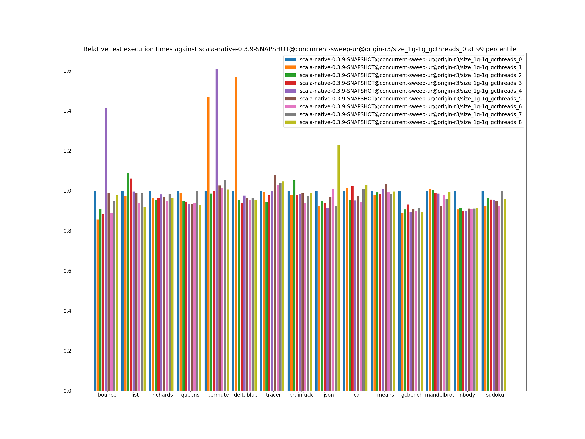
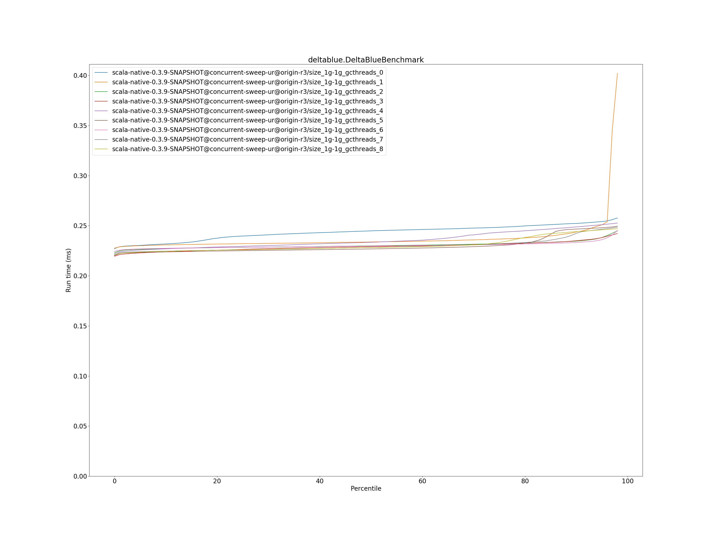
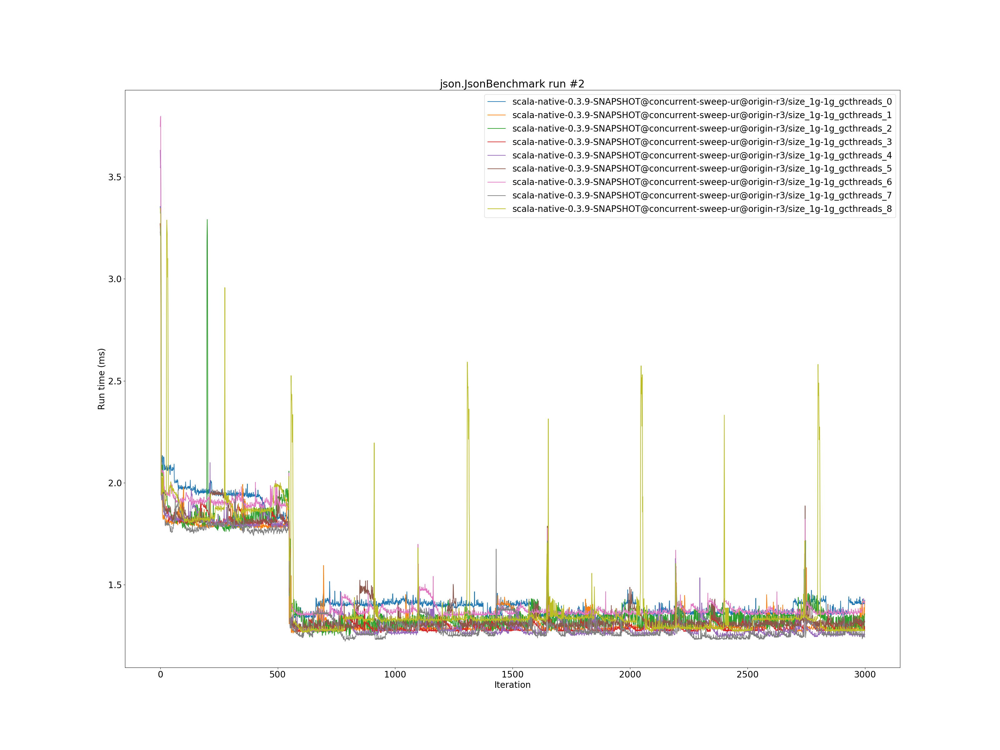
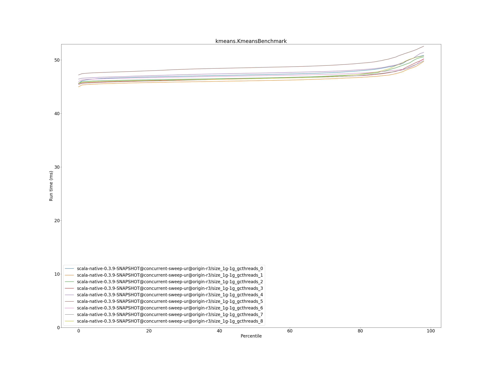

# Summary
## Benchmark run time (ms) at 50 percentile 

|name | scala-native-0.3.9-SNAPSHOT@concurrent-sweep-ur@origin-r3/size_1g-1g_gcthreads_0 | scala-native-0.3.9-SNAPSHOT@concurrent-sweep-ur@origin-r3/size_1g-1g_gcthreads_1 |  | scala-native-0.3.9-SNAPSHOT@concurrent-sweep-ur@origin-r3/size_1g-1g_gcthreads_2 |  | scala-native-0.3.9-SNAPSHOT@concurrent-sweep-ur@origin-r3/size_1g-1g_gcthreads_3 |  | scala-native-0.3.9-SNAPSHOT@concurrent-sweep-ur@origin-r3/size_1g-1g_gcthreads_4 |  | scala-native-0.3.9-SNAPSHOT@concurrent-sweep-ur@origin-r3/size_1g-1g_gcthreads_5 |  | scala-native-0.3.9-SNAPSHOT@concurrent-sweep-ur@origin-r3/size_1g-1g_gcthreads_6 |  | scala-native-0.3.9-SNAPSHOT@concurrent-sweep-ur@origin-r3/size_1g-1g_gcthreads_7 |  | scala-native-0.3.9-SNAPSHOT@concurrent-sweep-ur@origin-r3/size_1g-1g_gcthreads_8 | |
| -- | -- | -- | -- | -- | -- | -- | -- | -- | -- | -- | -- | -- | -- | -- | -- | -- | -- |
|[bounce.BounceBenchmark](#bouncebouncebenchmark)|0.0567|0.0486|__-14.25%__|0.0503|__-11.16%__|0.0491|__-13.28%__|0.0502|__-11.39%__|0.0560|__-1.13%__|0.0498|__-12.04%__|0.0525|__-7.25%__|0.0539|__-4.86%__|
|[list.ListBenchmark](#listlistbenchmark)|0.0530|0.0489|__-7.67%__|0.0576|+8.69%|0.0546|+3.00%|0.0517|__-2.46%__|0.0510|__-3.74%__|0.0477|__-10.11%__|0.0513|__-3.21%__|0.0476|__-10.23%__|
|[richards.RichardsBenchmark](#richardsrichardsbenchmark)|0.0711|0.0683|__-3.96%__|0.0680|__-4.26%__|0.0688|__-3.21%__|0.0696|__-2.00%__|0.0679|__-4.47%__|0.0677|__-4.74%__|0.0697|__-1.89%__|0.0673|__-5.30%__|
|[queens.QueensBenchmark](#queensqueensbenchmark)|0.0949|0.0955|+0.69%|0.0899|__-5.24%__|0.0900|__-5.17%__|0.0884|__-6.83%__|0.0885|__-6.72%__|0.0884|__-6.86%__|0.0925|__-2.53%__|0.0878|__-7.48%__|
|[permute.PermuteBenchmark](#permutepermutebenchmark)|0.2777|0.2800|+0.82%|0.2699|__-2.82%__|0.2696|__-2.90%__|0.2800|+0.85%|0.2800|+0.85%|0.2791|+0.52%|0.2913|+4.89%|0.2783|+0.23%|
|[deltablue.DeltaBlueBenchmark](#deltabluedeltabluebenchmark)|0.2449|0.2337|__-4.54%__|0.2299|__-6.11%__|0.2292|__-6.41%__|0.2334|__-4.66%__|0.2268|__-7.38%__|0.2297|__-6.18%__|0.2283|__-6.78%__|0.2282|__-6.81%__|
|[tracer.TracerBenchmark](#tracertracerbenchmark)|0.6762|0.6145|__-9.13%__|0.6095|__-9.87%__|0.6276|__-7.19%__|0.6121|__-9.48%__|0.6129|__-9.37%__|0.6022|__-10.95%__|0.6080|__-10.09%__|0.6164|__-8.84%__|
|[brainfuck.BrainfuckBenchmark](#brainfuckbrainfuckbenchmark)|3.6836|3.5239|__-4.34%__|3.4018|__-7.65%__|3.5045|__-4.86%__|3.4125|__-7.36%__|3.4764|__-5.62%__|3.2730|__-11.15%__|3.3666|__-8.61%__|3.4135|__-7.33%__|
|[json.JsonBenchmark](#jsonjsonbenchmark)|1.3918|1.3085|__-5.99%__|1.3018|__-6.47%__|1.3020|__-6.45%__|1.2731|__-8.53%__|1.3248|__-4.81%__|1.3803|__-0.82%__|1.2537|__-9.92%__|1.3351|__-4.07%__|
|[cd.CDBenchmark](#cdcdbenchmark)|22.4058|21.1815|__-5.46%__|21.2172|__-5.30%__|22.7230|+1.42%|21.1000|__-5.83%__|21.4873|__-4.10%__|21.0664|__-5.98%__|22.1300|__-1.23%__|22.9126|+2.26%|
|[kmeans.KmeansBenchmark](#kmeanskmeansbenchmark)|47.2399|46.1254|__-2.36%__|46.6216|__-1.31%__|46.5398|__-1.48%__|47.5387|+0.63%|48.5829|+2.84%|47.0394|__-0.42%__|46.5297|__-1.50%__|46.5148|__-1.53%__|
|[gcbench.GCBenchBenchmark](#gcbenchgcbenchbenchmark)|99.4004|87.4471|__-12.03%__|89.8979|__-9.56%__|91.2282|__-8.22%__|87.9266|__-11.54%__|89.3078|__-10.15%__|89.2469|__-10.21%__|89.3149|__-10.15%__|88.2066|__-11.26%__|
|[mandelbrot.MandelbrotBenchmark](#mandelbrotmandelbrotbenchmark)|91.0628|91.5337|+0.52%|91.3548|+0.32%|91.8951|+0.91%|90.6823|__-0.42%__|90.6370|__-0.47%__|90.9570|__-0.12%__|90.8332|__-0.25%__|90.7440|__-0.35%__|
|[nbody.NbodyBenchmark](#nbodynbodybenchmark)|29.2548|28.9485|__-1.05%__|29.0611|__-0.66%__|28.7938|__-1.58%__|28.7878|__-1.60%__|28.7985|__-1.56%__|29.2392|__-0.05%__|28.8779|__-1.29%__|28.6791|__-1.97%__|
|[sudoku.SudokuBenchmark](#sudokusudokubenchmark)|2.4350|2.3411|__-3.86%__|2.3562|__-3.24%__|2.3693|__-2.70%__|2.2592|__-7.22%__|2.3151|__-4.93%__|2.3026|__-5.44%__|2.4105|__-1.01%__|2.3221|__-4.64%__|
| __Geometrical mean:__|| |__-4.94%__| |__-4.42%__| |__-3.96%__| |__-5.27%__| |__-4.12%__| |__-5.74%__| |__-4.15%__| |__-4.89%__|
## Benchmark run time (ms) at 90 percentile 

|name | scala-native-0.3.9-SNAPSHOT@concurrent-sweep-ur@origin-r3/size_1g-1g_gcthreads_0 | scala-native-0.3.9-SNAPSHOT@concurrent-sweep-ur@origin-r3/size_1g-1g_gcthreads_1 |  | scala-native-0.3.9-SNAPSHOT@concurrent-sweep-ur@origin-r3/size_1g-1g_gcthreads_2 |  | scala-native-0.3.9-SNAPSHOT@concurrent-sweep-ur@origin-r3/size_1g-1g_gcthreads_3 |  | scala-native-0.3.9-SNAPSHOT@concurrent-sweep-ur@origin-r3/size_1g-1g_gcthreads_4 |  | scala-native-0.3.9-SNAPSHOT@concurrent-sweep-ur@origin-r3/size_1g-1g_gcthreads_5 |  | scala-native-0.3.9-SNAPSHOT@concurrent-sweep-ur@origin-r3/size_1g-1g_gcthreads_6 |  | scala-native-0.3.9-SNAPSHOT@concurrent-sweep-ur@origin-r3/size_1g-1g_gcthreads_7 |  | scala-native-0.3.9-SNAPSHOT@concurrent-sweep-ur@origin-r3/size_1g-1g_gcthreads_8 | |
| -- | -- | -- | -- | -- | -- | -- | -- | -- | -- | -- | -- | -- | -- | -- | -- | -- | -- |
|[bounce.BounceBenchmark](#bouncebouncebenchmark)|0.0581|0.0502|__-13.54%__|0.0520|__-10.46%__|0.0508|__-12.47%__|0.0568|__-2.25%__|0.0574|__-1.10%__|0.0521|__-10.34%__|0.0541|__-6.81%__|0.0570|__-1.90%__|
|[list.ListBenchmark](#listlistbenchmark)|0.0551|0.0538|__-2.36%__|0.0601|+9.14%|0.0589|+6.97%|0.0532|__-3.47%__|0.0525|__-4.73%__|0.0501|__-9.00%__|0.0526|__-4.60%__|0.0489|__-11.33%__|
|[richards.RichardsBenchmark](#richardsrichardsbenchmark)|0.0749|0.0718|__-4.12%__|0.0707|__-5.65%__|0.0715|__-4.55%__|0.0737|__-1.71%__|0.0726|__-3.14%__|0.0704|__-6.10%__|0.0737|__-1.66%__|0.0702|__-6.36%__|
|[queens.QueensBenchmark](#queensqueensbenchmark)|0.0978|0.0974|__-0.34%__|0.0921|__-5.82%__|0.0927|__-5.19%__|0.0910|__-6.90%__|0.0916|__-6.31%__|0.0915|__-6.40%__|0.0973|__-0.44%__|0.0909|__-6.98%__|
|[permute.PermuteBenchmark](#permutepermutebenchmark)|0.2831|0.2866|+1.24%|0.2866|+1.24%|0.2879|+1.70%|0.2927|+3.37%|0.2900|+2.44%|0.2947|+4.08%|0.3080|+8.78%|0.2893|+2.18%|
|[deltablue.DeltaBlueBenchmark](#deltabluedeltabluebenchmark)|0.2523|0.2438|__-3.34%__|0.2346|__-7.01%__|0.2350|__-6.85%__|0.2488|__-1.37%__|0.2467|__-2.23%__|0.2332|__-7.54%__|0.2424|__-3.93%__|0.2441|__-3.24%__|
|[tracer.TracerBenchmark](#tracertracerbenchmark)|0.6928|0.6475|__-6.54%__|0.6388|__-7.80%__|0.6508|__-6.06%__|0.6442|__-7.02%__|0.6481|__-6.46%__|0.6317|__-8.83%__|0.6470|__-6.62%__|0.6372|__-8.03%__|
|[brainfuck.BrainfuckBenchmark](#brainfuckbrainfuckbenchmark)|3.7616|3.5804|__-4.82%__|3.4911|__-7.19%__|3.5880|__-4.61%__|3.4963|__-7.05%__|3.5833|__-4.74%__|3.3655|__-10.53%__|3.5204|__-6.41%__|3.5921|__-4.51%__|
|[json.JsonBenchmark](#jsonjsonbenchmark)|1.4594|1.3263|__-9.12%__|1.3598|__-6.83%__|1.3256|__-9.17%__|1.3055|__-10.55%__|1.3762|__-5.70%__|1.4209|__-2.64%__|1.2977|__-11.08%__|1.4128|__-3.19%__|
|[cd.CDBenchmark](#cdcdbenchmark)|22.9336|23.1931|+1.13%|22.0797|__-3.72%__|23.4795|+2.38%|21.8723|__-4.63%__|22.4315|__-2.19%__|21.8583|__-4.69%__|23.3813|+1.95%|23.6657|+3.19%|
|[kmeans.KmeansBenchmark](#kmeanskmeansbenchmark)|48.9625|47.4418|__-3.11%__|48.5237|__-0.90%__|47.8538|__-2.26%__|49.0510|+0.18%|50.5373|+3.22%|48.0785|__-1.81%__|47.8951|__-2.18%__|48.9260|__-0.07%__|
|[gcbench.GCBenchBenchmark](#gcbenchgcbenchbenchmark)|102.9069|91.7535|__-10.84%__|94.2752|__-8.39%__|96.3600|__-6.36%__|92.9691|__-9.66%__|93.9216|__-8.73%__|94.0257|__-8.63%__|94.7745|__-7.90%__|92.8761|__-9.75%__|
|[mandelbrot.MandelbrotBenchmark](#mandelbrotmandelbrotbenchmark)|94.0566|93.7811|__-0.29%__|94.6403|+0.62%|93.8924|__-0.17%__|92.4106|__-1.75%__|91.1859|__-3.05%__|92.3241|__-1.84%__|91.9921|__-2.19%__|92.5613|__-1.59%__|
|[nbody.NbodyBenchmark](#nbodynbodybenchmark)|30.6784|29.6281|__-3.42%__|29.8290|__-2.77%__|29.5154|__-3.79%__|29.5425|__-3.70%__|29.9656|__-2.32%__|29.8315|__-2.76%__|29.9191|__-2.48%__|30.6350|__-0.14%__|
|[sudoku.SudokuBenchmark](#sudokusudokubenchmark)|2.5372|2.3961|__-5.56%__|2.5378|+0.03%|2.4423|__-3.74%__|2.3812|__-6.15%__|2.4741|__-2.49%__|2.3752|__-6.38%__|2.5743|+1.46%|2.4895|__-1.88%__|
| __Geometrical mean:__|| |__-4.43%__| |__-3.82%__| |__-3.72%__| |__-4.25%__| |__-3.22%__| |__-5.64%__| |__-3.05%__| |__-3.66%__|
## Benchmark run time (ms) at 99 percentile 

|name | scala-native-0.3.9-SNAPSHOT@concurrent-sweep-ur@origin-r3/size_1g-1g_gcthreads_0 | scala-native-0.3.9-SNAPSHOT@concurrent-sweep-ur@origin-r3/size_1g-1g_gcthreads_1 |  | scala-native-0.3.9-SNAPSHOT@concurrent-sweep-ur@origin-r3/size_1g-1g_gcthreads_2 |  | scala-native-0.3.9-SNAPSHOT@concurrent-sweep-ur@origin-r3/size_1g-1g_gcthreads_3 |  | scala-native-0.3.9-SNAPSHOT@concurrent-sweep-ur@origin-r3/size_1g-1g_gcthreads_4 |  | scala-native-0.3.9-SNAPSHOT@concurrent-sweep-ur@origin-r3/size_1g-1g_gcthreads_5 |  | scala-native-0.3.9-SNAPSHOT@concurrent-sweep-ur@origin-r3/size_1g-1g_gcthreads_6 |  | scala-native-0.3.9-SNAPSHOT@concurrent-sweep-ur@origin-r3/size_1g-1g_gcthreads_7 |  | scala-native-0.3.9-SNAPSHOT@concurrent-sweep-ur@origin-r3/size_1g-1g_gcthreads_8 | |
| -- | -- | -- | -- | -- | -- | -- | -- | -- | -- | -- | -- | -- | -- | -- | -- | -- | -- |
|[bounce.BounceBenchmark](#bouncebouncebenchmark)|0.0625|0.0535|__-14.47%__|0.0568|__-9.19%__|0.0551|__-11.85%__|0.0883|+41.14%|0.0619|__-0.98%__|0.0556|__-11.04%__|0.0592|__-5.40%__|0.0610|__-2.39%__|
|[list.ListBenchmark](#listlistbenchmark)|0.0574|0.0558|__-2.81%__|0.0625|+8.86%|0.0609|+6.04%|0.0571|__-0.47%__|0.0568|__-1.06%__|0.0538|__-6.23%__|0.0566|__-1.38%__|0.0528|__-8.08%__|
|[richards.RichardsBenchmark](#richardsrichardsbenchmark)|0.0781|0.0754|__-3.52%__|0.0745|__-4.56%__|0.0753|__-3.61%__|0.0766|__-1.86%__|0.0756|__-3.23%__|0.0740|__-5.27%__|0.0769|__-1.53%__|0.0752|__-3.77%__|
|[queens.QueensBenchmark](#queensqueensbenchmark)|0.1027|0.1015|__-1.11%__|0.0973|__-5.24%__|0.0970|__-5.50%__|0.0960|__-6.47%__|0.0958|__-6.68%__|0.0961|__-6.38%__|0.1027|+0.07%|0.0954|__-7.06%__|
|[permute.PermuteBenchmark](#permutepermutebenchmark)|0.2984|0.4378|+46.72%|0.2942|__-1.39%__|0.2976|__-0.25%__|0.4802|+60.92%|0.3060|+2.56%|0.3025|+1.37%|0.3145|+5.41%|0.3000|+0.54%|
|[deltablue.DeltaBlueBenchmark](#deltabluedeltabluebenchmark)|0.2605|0.4090|+57.01%|0.2482|__-4.71%__|0.2445|__-6.14%__|0.2541|__-2.44%__|0.2511|__-3.58%__|0.2486|__-4.56%__|0.2509|__-3.68%__|0.2483|__-4.66%__|
|[tracer.TracerBenchmark](#tracertracerbenchmark)|0.7172|0.7133|__-0.54%__|0.6776|__-5.52%__|0.7005|__-2.33%__|0.7166|__-0.08%__|0.7735|+7.85%|0.7381|+2.91%|0.7458|+3.99%|0.7500|+4.57%|
|[brainfuck.BrainfuckBenchmark](#brainfuckbrainfuckbenchmark)|3.8042|3.7256|__-2.07%__|4.0015|+5.19%|3.7215|__-2.17%__|3.7357|__-1.80%__|3.7518|__-1.38%__|3.5662|__-6.26%__|3.7027|__-2.67%__|3.7548|__-1.30%__|
|[json.JsonBenchmark](#jsonjsonbenchmark)|1.5100|1.3961|__-7.55%__|1.4304|__-5.28%__|1.4151|__-6.29%__|1.3811|__-8.54%__|1.4643|__-3.03%__|1.5202|+0.67%|1.3967|__-7.51%__|1.8575|+23.01%|
|[cd.CDBenchmark](#cdcdbenchmark)|24.0064|24.2749|+1.12%|22.8713|__-4.73%__|24.5281|+2.17%|22.8208|__-4.94%__|23.3824|__-2.60%__|22.6777|__-5.53%__|24.1926|+0.78%|24.7246|+2.99%|
|[kmeans.KmeansBenchmark](#kmeanskmeansbenchmark)|51.2301|50.0715|__-2.26%__|50.7629|__-0.91%__|50.4600|__-1.50%__|51.5678|+0.66%|52.8781|+3.22%|50.7661|__-0.91%__|50.3182|__-1.78%__|51.0061|__-0.44%__|
|[gcbench.GCBenchBenchmark](#gcbenchgcbenchbenchmark)|107.4089|95.4043|__-11.18%__|97.3001|__-9.41%__|99.9857|__-6.91%__|96.0457|__-10.58%__|97.7143|__-9.03%__|96.5150|__-10.14%__|98.2528|__-8.52%__|95.9127|__-10.70%__|
|[mandelbrot.MandelbrotBenchmark](#mandelbrotmandelbrotbenchmark)|100.0818|100.7177|+0.64%|100.5415|+0.46%|98.9656|__-1.12%__|98.6429|__-1.44%__|92.5258|__-7.55%__|97.9359|__-2.14%__|95.7909|__-4.29%__|99.3522|__-0.73%__|
|[nbody.NbodyBenchmark](#nbodynbodybenchmark)|34.6474|31.3932|__-9.39%__|31.6911|__-8.53%__|31.1593|__-10.07%__|31.1579|__-10.07%__|31.5513|__-8.94%__|31.4363|__-9.27%__|31.5632|__-8.90%__|31.6485|__-8.66%__|
|[sudoku.SudokuBenchmark](#sudokusudokubenchmark)|2.7110|2.5020|__-7.71%__|2.6101|__-3.72%__|2.5897|__-4.48%__|2.5816|__-4.77%__|2.5695|__-5.22%__|2.5081|__-7.48%__|2.7063|__-0.17%__|2.5949|__-4.28%__|
| __Geometrical mean:__|| |+1.31%| |__-3.37%__| |__-3.70%__| |+1.83%| |__-2.75%__| |__-4.77%__| |__-2.46%__| |__-1.68%__|
## Benchmark total run time (ms) 

|name | scala-native-0.3.9-SNAPSHOT@concurrent-sweep-ur@origin-r3/size_1g-1g_gcthreads_0 | scala-native-0.3.9-SNAPSHOT@concurrent-sweep-ur@origin-r3/size_1g-1g_gcthreads_1 |  | scala-native-0.3.9-SNAPSHOT@concurrent-sweep-ur@origin-r3/size_1g-1g_gcthreads_2 |  | scala-native-0.3.9-SNAPSHOT@concurrent-sweep-ur@origin-r3/size_1g-1g_gcthreads_3 |  | scala-native-0.3.9-SNAPSHOT@concurrent-sweep-ur@origin-r3/size_1g-1g_gcthreads_4 |  | scala-native-0.3.9-SNAPSHOT@concurrent-sweep-ur@origin-r3/size_1g-1g_gcthreads_5 |  | scala-native-0.3.9-SNAPSHOT@concurrent-sweep-ur@origin-r3/size_1g-1g_gcthreads_6 |  | scala-native-0.3.9-SNAPSHOT@concurrent-sweep-ur@origin-r3/size_1g-1g_gcthreads_7 |  | scala-native-0.3.9-SNAPSHOT@concurrent-sweep-ur@origin-r3/size_1g-1g_gcthreads_8 | |
| -- | -- | -- | -- | -- | -- | -- | -- | -- | -- | -- | -- | -- | -- | -- | -- | -- | -- |
|[bounce.BounceBenchmark](#bouncebouncebenchmark)|170.5106|146.3957|__-14.14%__|151.8187|__-10.96%__|148.2798|__-13.04%__|159.4339|__-6.50%__|168.6162|__-1.11%__|150.5379|__-11.71%__|158.4547|__-7.07%__|163.0387|__-4.38%__|
|[list.ListBenchmark](#listlistbenchmark)|158.4843|151.2448|__-4.57%__|171.5254|+8.23%|167.2968|+5.56%|155.9635|__-1.59%__|154.1982|__-2.70%__|144.9004|__-8.57%__|154.6277|__-2.43%__|143.6694|__-9.35%__|
|[richards.RichardsBenchmark](#richardsrichardsbenchmark)|214.7754|206.3141|__-3.94%__|205.0605|__-4.52%__|207.5954|__-3.34%__|210.3418|__-2.06%__|205.7920|__-4.18%__|204.0183|__-5.01%__|210.9067|__-1.80%__|203.3142|__-5.34%__|
|[queens.QueensBenchmark](#queensqueensbenchmark)|280.8557|286.5401|+2.02%|269.5774|__-4.02%__|271.2420|__-3.42%__|266.1720|__-5.23%__|266.9754|__-4.94%__|266.6152|__-5.07%__|277.4200|__-1.22%__|265.2234|__-5.57%__|
|[permute.PermuteBenchmark](#permutepermutebenchmark)|834.5853|849.9397|+1.84%|817.6850|__-2.02%__|816.0332|__-2.22%__|847.8994|+1.60%|843.3936|+1.06%|843.3661|+1.05%|881.4018|+5.61%|839.8024|+0.63%|
|[deltablue.DeltaBlueBenchmark](#deltabluedeltabluebenchmark)|731.3600|721.1194|__-1.40%__|692.8053|__-5.27%__|688.5565|__-5.85%__|708.2443|__-3.16%__|690.0137|__-5.65%__|691.7271|__-5.42%__|691.2526|__-5.48%__|692.9695|__-5.25%__|
|[tracer.TracerBenchmark](#tracertracerbenchmark)|2009.2958|1857.0612|__-7.58%__|1838.1910|__-8.52%__|1886.1516|__-6.13%__|1862.6640|__-7.30%__|1857.4605|__-7.56%__|1827.4931|__-9.05%__|1848.5788|__-8.00%__|1858.6336|__-7.50%__|
|[brainfuck.BrainfuckBenchmark](#brainfuckbrainfuckbenchmark)|11071.7853|10538.7599|__-4.81%__|10305.6872|__-6.92%__|10570.4836|__-4.53%__|10265.0187|__-7.29%__|10493.0445|__-5.23%__|9883.4653|__-10.73%__|10198.4971|__-7.89%__|10342.8726|__-6.58%__|
|[json.JsonBenchmark](#jsonjsonbenchmark)|4186.0524|3926.9447|__-6.19%__|3931.0668|__-6.09%__|3909.6823|__-6.60%__|3837.3373|__-8.33%__|3996.8829|__-4.52%__|4163.8876|__-0.53%__|3782.5429|__-9.64%__|4044.9022|__-3.37%__|
|[cd.CDBenchmark](#cdcdbenchmark)|67567.6294|64979.2955|__-3.83%__|63983.3909|__-5.30%__|68444.8289|+1.30%|63703.9335|__-5.72%__|64909.0790|__-3.93%__|63556.9548|__-5.94%__|67065.1258|__-0.74%__|68503.6075|+1.39%|
|[kmeans.KmeansBenchmark](#kmeanskmeansbenchmark)|142654.0621|139205.7876|__-2.42%__|141025.6502|__-1.14%__|140360.4449|__-1.61%__|143421.1085|+0.54%|146635.2298|+2.79%|141720.8473|__-0.65%__|140249.0346|__-1.69%__|140915.8506|__-1.22%__|
|[gcbench.GCBenchBenchmark](#gcbenchgcbenchbenchmark)|297647.6262|262831.5604|__-11.70%__|269227.5539|__-9.55%__|273354.8452|__-8.16%__|264214.3114|__-11.23%__|267136.7378|__-10.25%__|268163.4833|__-9.91%__|268033.5885|__-9.95%__|264099.5792|__-11.27%__|
|[mandelbrot.MandelbrotBenchmark](#mandelbrotmandelbrotbenchmark)|275233.3569|276639.3829|+0.51%|276755.8202|+0.55%|276386.2985|+0.42%|273306.6506|__-0.70%__|272255.7931|__-1.08%__|273340.7603|__-0.69%__|273513.7326|__-0.62%__|273495.1717|__-0.63%__|
|[nbody.NbodyBenchmark](#nbodynbodybenchmark)|88878.8775|87218.7276|__-1.87%__|87710.3189|__-1.31%__|86908.0775|__-2.22%__|86808.5431|__-2.33%__|86995.0724|__-2.12%__|88140.5109|__-0.83%__|87342.8725|__-1.73%__|87149.2389|__-1.95%__|
|[sudoku.SudokuBenchmark](#sudokusudokubenchmark)|7304.2179|7052.0623|__-3.45%__|7147.7709|__-2.14%__|7162.2339|__-1.94%__|6881.2798|__-5.79%__|7010.2919|__-4.02%__|6938.2516|__-5.01%__|7324.9948|+0.28%|7064.7821|__-3.28%__|
| __Geometrical mean:__|| |__-4.20%__| |__-4.04%__| |__-3.55%__| |__-4.40%__| |__-3.62%__| |__-5.29%__| |__-3.58%__| |__-4.31%__|
# Individual benchmarks
## bounce.BounceBenchmark

## list.ListBenchmark

## richards.RichardsBenchmark

## queens.QueensBenchmark

## permute.PermuteBenchmark

## deltablue.DeltaBlueBenchmark

## tracer.TracerBenchmark

## brainfuck.BrainfuckBenchmark

## json.JsonBenchmark

## cd.CDBenchmark

## kmeans.KmeansBenchmark

## gcbench.GCBenchBenchmark

## mandelbrot.MandelbrotBenchmark

## nbody.NbodyBenchmark

## sudoku.SudokuBenchmark

