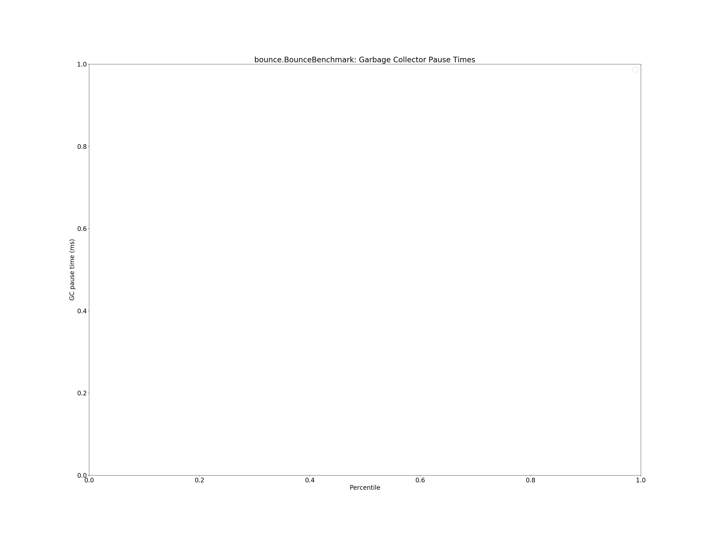
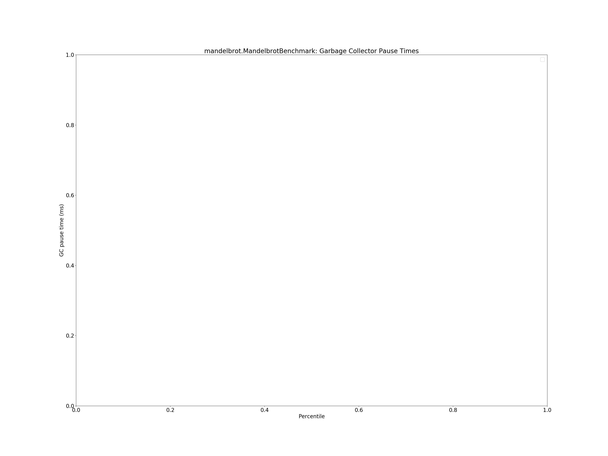

# Summary
## Benchmark run time (ms) at 50 percentile 

|name | scala-native-0.3.9-SNAPSHOT@master-r3-gc/size_1g-1g_gcthreads_2 | scala-native-0.3.9-SNAPSHOT@concurrent-sweep-ur-4-16@origin-r3-gc/size_1g-1g_gcthreads_2 |  | scala-native-0.3.9-SNAPSHOT@concurrent-sweep-ur-4-32@origin-r3-gc/size_1g-1g_gcthreads_2 |  | scala-native-0.3.9-SNAPSHOT@concurrent-sweep-ur-8-16@origin-r3-gc/size_1g-1g_gcthreads_2 |  | scala-native-0.3.9-SNAPSHOT@concurrent-sweep-ur-8-32@origin-r3-gc/size_1g-1g_gcthreads_2 |  | scala-native-0.3.9-SNAPSHOT@concurrent-sweep-ur-8-64@origin-r3-gc/size_1g-1g_gcthreads_2 | |
| -- | -- | -- | -- | -- | -- | -- | -- | -- | -- | -- | -- |
|[bounce.BounceBenchmark](#bouncebouncebenchmark)|0.0607|0.0576|__-5.11%__|0.0607|+0.10%|0.0562|__-7.43%__|0.0609|+0.44%|0.0567|__-6.60%__|
|[brainfuck.BrainfuckBenchmark](#brainfuckbrainfuckbenchmark)|3.4289|3.3757|__-1.55%__|3.2528|__-5.14%__|3.3936|__-1.03%__|3.3680|__-1.78%__|3.3607|__-1.99%__|
|[cd.CDBenchmark](#cdcdbenchmark)|31.5552|31.2465|__-0.98%__|31.6066|+0.16%|31.1154|__-1.39%__|31.5991|+0.14%|31.6803|+0.40%|
|[deltablue.DeltaBlueBenchmark](#deltabluedeltabluebenchmark)|0.2350|0.2475|+5.30%|0.2333|__-0.75%__|0.2314|__-1.57%__|0.2436|+3.65%|0.2356|+0.23%|
|[gcbench.GCBenchBenchmark](#gcbenchgcbenchbenchmark)|105.7184|104.1755|__-1.46%__|104.6108|__-1.05%__|105.1229|__-0.56%__|103.8453|__-1.77%__|104.4881|__-1.16%__|
|[json.JsonBenchmark](#jsonjsonbenchmark)|1.6591|1.6495|__-0.58%__|1.6143|__-2.70%__|1.6555|__-0.21%__|1.6408|__-1.10%__|1.6371|__-1.32%__|
|[kmeans.KmeansBenchmark](#kmeanskmeansbenchmark)|51.3528|51.7017|+0.68%|51.1111|__-0.47%__|51.2713|__-0.16%__|51.3572|+0.01%|51.0897|__-0.51%__|
|[list.ListBenchmark](#listlistbenchmark)|0.0574|0.0647|+12.72%|0.0548|__-4.52%__|0.0557|__-2.93%__|0.0550|__-4.11%__|0.0556|__-3.20%__|
|[mandelbrot.MandelbrotBenchmark](#mandelbrotmandelbrotbenchmark)|126.0142|125.9628|__-0.04%__|126.0374|+0.02%|126.0740|+0.05%|125.9709|__-0.03%__|126.0445|+0.02%|
|[nbody.NbodyBenchmark](#nbodynbodybenchmark)|39.4353|39.5477|+0.29%|39.6635|+0.58%|39.3863|__-0.12%__|39.3947|__-0.10%__|39.3865|__-0.12%__|
|[permute.PermuteBenchmark](#permutepermutebenchmark)|0.2851|0.2760|__-3.20%__|0.2764|__-3.05%__|0.2774|__-2.70%__|0.2779|__-2.52%__|0.3324|+16.59%|
|[queens.QueensBenchmark](#queensqueensbenchmark)|0.1212|0.1174|__-3.14%__|0.1197|__-1.25%__|0.1197|__-1.29%__|0.1197|__-1.27%__|0.1225|+1.06%|
|[richards.RichardsBenchmark](#richardsrichardsbenchmark)|0.0856|0.0805|__-5.94%__|0.0833|__-2.72%__|0.0896|+4.65%|0.0810|__-5.43%__|0.0894|+4.40%|
|[sudoku.SudokuBenchmark](#sudokusudokubenchmark)|2.4469|2.4306|__-0.67%__|2.5860|+5.68%|2.4507|+0.16%|2.4351|__-0.48%__|2.4910|+1.80%|
|[tracer.TracerBenchmark](#tracertracerbenchmark)|0.8210|0.8285|+0.91%|0.8269|+0.71%|0.8210|__-0.00%__|0.8189|__-0.26%__|0.8282|+0.87%|
| __Geometrical mean:__|| |__-0.27%__| |__-0.99%__| |__-1.00%__| |__-1.00%__| |+0.59%|
## Benchmark run time (ms) at 90 percentile 

|name | scala-native-0.3.9-SNAPSHOT@master-r3-gc/size_1g-1g_gcthreads_2 | scala-native-0.3.9-SNAPSHOT@concurrent-sweep-ur-4-16@origin-r3-gc/size_1g-1g_gcthreads_2 |  | scala-native-0.3.9-SNAPSHOT@concurrent-sweep-ur-4-32@origin-r3-gc/size_1g-1g_gcthreads_2 |  | scala-native-0.3.9-SNAPSHOT@concurrent-sweep-ur-8-16@origin-r3-gc/size_1g-1g_gcthreads_2 |  | scala-native-0.3.9-SNAPSHOT@concurrent-sweep-ur-8-32@origin-r3-gc/size_1g-1g_gcthreads_2 |  | scala-native-0.3.9-SNAPSHOT@concurrent-sweep-ur-8-64@origin-r3-gc/size_1g-1g_gcthreads_2 | |
| -- | -- | -- | -- | -- | -- | -- | -- | -- | -- | -- | -- |
|[bounce.BounceBenchmark](#bouncebouncebenchmark)|0.0618|0.0592|__-4.35%__|0.0624|+0.83%|0.0574|__-7.25%__|0.0623|+0.67%|0.0579|__-6.31%__|
|[brainfuck.BrainfuckBenchmark](#brainfuckbrainfuckbenchmark)|3.5255|3.4698|__-1.58%__|3.3411|__-5.23%__|3.4964|__-0.83%__|3.4497|__-2.15%__|3.4691|__-1.60%__|
|[cd.CDBenchmark](#cdcdbenchmark)|32.8519|32.5242|__-1.00%__|33.0881|+0.72%|32.7770|__-0.23%__|32.7620|__-0.27%__|32.9907|+0.42%|
|[deltablue.DeltaBlueBenchmark](#deltabluedeltabluebenchmark)|0.2436|0.2548|+4.62%|0.2419|__-0.69%__|0.2387|__-1.99%__|0.2504|+2.80%|0.2420|__-0.64%__|
|[gcbench.GCBenchBenchmark](#gcbenchgcbenchbenchmark)|114.1675|110.7787|__-2.97%__|110.6032|__-3.12%__|110.4036|__-3.30%__|110.4068|__-3.29%__|110.5830|__-3.14%__|
|[json.JsonBenchmark](#jsonjsonbenchmark)|1.7041|1.6929|__-0.66%__|1.6575|__-2.74%__|1.7006|__-0.21%__|1.6860|__-1.06%__|1.6807|__-1.37%__|
|[kmeans.KmeansBenchmark](#kmeanskmeansbenchmark)|52.6703|52.9502|+0.53%|52.3784|__-0.55%__|52.5730|__-0.18%__|52.7179|+0.09%|52.2837|__-0.73%__|
|[list.ListBenchmark](#listlistbenchmark)|0.0591|0.0657|+11.19%|0.0558|__-5.63%__|0.0573|__-3.13%__|0.0561|__-5.09%__|0.0570|__-3.63%__|
|[mandelbrot.MandelbrotBenchmark](#mandelbrotmandelbrotbenchmark)|126.5066|126.5271|+0.02%|126.5953|+0.07%|126.8238|+0.25%|126.5300|+0.02%|126.5808|+0.06%|
|[nbody.NbodyBenchmark](#nbodynbodybenchmark)|40.5240|40.6384|+0.28%|40.8029|+0.69%|40.4867|__-0.09%__|40.4831|__-0.10%__|40.4733|__-0.13%__|
|[permute.PermuteBenchmark](#permutepermutebenchmark)|0.2880|0.2831|__-1.70%__|0.2891|+0.38%|0.2847|__-1.14%__|0.2847|__-1.13%__|0.3365|+16.86%|
|[queens.QueensBenchmark](#queensqueensbenchmark)|0.1235|0.1204|__-2.57%__|0.1242|+0.54%|0.1238|+0.18%|0.1219|__-1.30%__|0.1245|+0.77%|
|[richards.RichardsBenchmark](#richardsrichardsbenchmark)|0.0892|0.0829|__-7.07%__|0.0863|__-3.23%__|0.0921|+3.22%|0.0831|__-6.82%__|0.0922|+3.31%|
|[sudoku.SudokuBenchmark](#sudokusudokubenchmark)|2.5139|2.5003|__-0.54%__|2.6632|+5.94%|2.5122|__-0.07%__|2.5015|__-0.49%__|2.5412|+1.09%|
|[tracer.TracerBenchmark](#tracertracerbenchmark)|0.8368|0.8555|+2.23%|0.8466|+1.17%|0.8378|+0.12%|0.8382|+0.17%|0.8555|+2.23%|
| __Geometrical mean:__|| |__-0.32%__| |__-0.76%__| |__-1.00%__| |__-1.22%__| |+0.37%|
## Benchmark run time (ms) at 99 percentile 

|name | scala-native-0.3.9-SNAPSHOT@master-r3-gc/size_1g-1g_gcthreads_2 | scala-native-0.3.9-SNAPSHOT@concurrent-sweep-ur-4-16@origin-r3-gc/size_1g-1g_gcthreads_2 |  | scala-native-0.3.9-SNAPSHOT@concurrent-sweep-ur-4-32@origin-r3-gc/size_1g-1g_gcthreads_2 |  | scala-native-0.3.9-SNAPSHOT@concurrent-sweep-ur-8-16@origin-r3-gc/size_1g-1g_gcthreads_2 |  | scala-native-0.3.9-SNAPSHOT@concurrent-sweep-ur-8-32@origin-r3-gc/size_1g-1g_gcthreads_2 |  | scala-native-0.3.9-SNAPSHOT@concurrent-sweep-ur-8-64@origin-r3-gc/size_1g-1g_gcthreads_2 | |
| -- | -- | -- | -- | -- | -- | -- | -- | -- | -- | -- | -- |
|[bounce.BounceBenchmark](#bouncebouncebenchmark)|0.0640|0.0618|__-3.55%__|0.0654|+2.12%|0.0598|__-6.62%__|0.0647|+0.98%|0.0605|__-5.55%__|
|[brainfuck.BrainfuckBenchmark](#brainfuckbrainfuckbenchmark)|3.6515|3.6603|+0.24%|3.5096|__-3.88%__|3.7542|+2.81%|3.6606|+0.25%|3.6179|__-0.92%__|
|[cd.CDBenchmark](#cdcdbenchmark)|39.8996|33.9024|__-15.03%__|34.6882|__-13.06%__|33.7956|__-15.30%__|34.6319|__-13.20%__|34.6190|__-13.23%__|
|[deltablue.DeltaBlueBenchmark](#deltabluedeltabluebenchmark)|0.2609|0.2650|+1.54%|0.2550|__-2.29%__|0.2527|__-3.14%__|0.2582|__-1.05%__|0.2563|__-1.79%__|
|[gcbench.GCBenchBenchmark](#gcbenchgcbenchbenchmark)|115.4704|111.8692|__-3.12%__|111.7192|__-3.25%__|111.6702|__-3.29%__|111.7266|__-3.24%__|111.7110|__-3.26%__|
|[json.JsonBenchmark](#jsonjsonbenchmark)|1.7583|1.7957|+2.12%|1.7577|__-0.04%__|1.7937|+2.01%|1.8050|+2.66%|1.8047|+2.64%|
|[kmeans.KmeansBenchmark](#kmeanskmeansbenchmark)|62.2060|57.6388|__-7.34%__|56.6215|__-8.98%__|56.4511|__-9.25%__|57.1054|__-8.20%__|56.9675|__-8.42%__|
|[list.ListBenchmark](#listlistbenchmark)|0.0606|0.0676|+11.53%|0.0578|__-4.57%__|0.0589|__-2.77%__|0.0584|__-3.68%__|0.0583|__-3.77%__|
|[mandelbrot.MandelbrotBenchmark](#mandelbrotmandelbrotbenchmark)|129.5647|129.5542|__-0.01%__|129.5963|+0.02%|129.6494|+0.07%|129.5172|__-0.04%__|129.5899|+0.02%|
|[nbody.NbodyBenchmark](#nbodynbodybenchmark)|42.1576|41.8425|__-0.75%__|42.0609|__-0.23%__|41.6684|__-1.16%__|41.6788|__-1.14%__|41.6382|__-1.23%__|
|[permute.PermuteBenchmark](#permutepermutebenchmark)|0.2956|0.2894|__-2.11%__|0.2961|+0.17%|0.2919|__-1.27%__|0.2951|__-0.18%__|0.3556|+20.30%|
|[queens.QueensBenchmark](#queensqueensbenchmark)|0.1257|0.1231|__-2.03%__|0.1267|+0.78%|0.1277|+1.61%|0.1241|__-1.22%__|0.1271|+1.12%|
|[richards.RichardsBenchmark](#richardsrichardsbenchmark)|0.0951|0.0890|__-6.43%__|0.0925|__-2.79%__|0.0975|+2.48%|0.0879|__-7.55%__|0.1020|+7.24%|
|[sudoku.SudokuBenchmark](#sudokusudokubenchmark)|2.5750|2.6090|+1.32%|2.7593|+7.16%|2.5689|__-0.23%__|2.5666|__-0.33%__|2.6330|+2.25%|
|[tracer.TracerBenchmark](#tracertracerbenchmark)|0.9108|1.4770|+62.16%|1.4954|+64.18%|1.4800|+62.49%|1.4911|+63.71%|1.5114|+65.93%|
| __Geometrical mean:__|| |+1.49%| |+1.26%| |+0.82%| |+0.77%| |+2.86%|
## Benchmark total run time (ms) 

|name | scala-native-0.3.9-SNAPSHOT@master-r3-gc/size_1g-1g_gcthreads_2 | scala-native-0.3.9-SNAPSHOT@concurrent-sweep-ur-4-16@origin-r3-gc/size_1g-1g_gcthreads_2 |  | scala-native-0.3.9-SNAPSHOT@concurrent-sweep-ur-4-32@origin-r3-gc/size_1g-1g_gcthreads_2 |  | scala-native-0.3.9-SNAPSHOT@concurrent-sweep-ur-8-16@origin-r3-gc/size_1g-1g_gcthreads_2 |  | scala-native-0.3.9-SNAPSHOT@concurrent-sweep-ur-8-32@origin-r3-gc/size_1g-1g_gcthreads_2 |  | scala-native-0.3.9-SNAPSHOT@concurrent-sweep-ur-8-64@origin-r3-gc/size_1g-1g_gcthreads_2 | |
| -- | -- | -- | -- | -- | -- | -- | -- | -- | -- | -- | -- |
|[bounce.BounceBenchmark](#bouncebouncebenchmark)|182.0843|173.2293|__-4.86%__|182.8826|+0.44%|168.7845|__-7.30%__|183.2338|+0.63%|170.3011|__-6.47%__|
|[brainfuck.BrainfuckBenchmark](#brainfuckbrainfuckbenchmark)|10457.9421|10218.1859|__-2.29%__|9839.0556|__-5.92%__|10296.9555|__-1.54%__|10171.1215|__-2.74%__|10168.7643|__-2.77%__|
|[cd.CDBenchmark](#cdcdbenchmark)|96637.1142|94799.0096|__-1.90%__|95559.2335|__-1.12%__|94702.0855|__-2.00%__|95873.2568|__-0.79%__|96281.7194|__-0.37%__|
|[deltablue.DeltaBlueBenchmark](#deltabluedeltabluebenchmark)|712.0039|743.0513|+4.36%|706.0120|__-0.84%__|699.4512|__-1.76%__|735.8231|+3.35%|708.0748|__-0.55%__|
|[gcbench.GCBenchBenchmark](#gcbenchgcbenchbenchmark)|314931.6344|310161.8361|__-1.51%__|309605.9355|__-1.69%__|309772.1473|__-1.64%__|309616.8204|__-1.69%__|310287.8612|__-1.47%__|
|[json.JsonBenchmark](#jsonjsonbenchmark)|5054.7291|4981.6145|__-1.45%__|4876.4052|__-3.53%__|5001.6587|__-1.05%__|4966.2266|__-1.75%__|4944.3929|__-2.18%__|
|[kmeans.KmeansBenchmark](#kmeanskmeansbenchmark)|155462.1086|156005.1073|+0.35%|154193.5966|__-0.82%__|154638.0648|__-0.53%__|155061.4696|__-0.26%__|154104.8421|__-0.87%__|
|[list.ListBenchmark](#listlistbenchmark)|173.3402|194.8141|+12.39%|165.4841|__-4.53%__|167.5797|__-3.32%__|166.3298|__-4.04%__|166.8530|__-3.74%__|
|[mandelbrot.MandelbrotBenchmark](#mandelbrotmandelbrotbenchmark)|378676.1006|378634.1290|__-0.01%__|378806.3466|+0.03%|379045.5814|+0.10%|378612.1626|__-0.02%__|378828.8243|+0.04%|
|[nbody.NbodyBenchmark](#nbodynbodybenchmark)|119259.2930|119540.8315|+0.24%|119616.9389|+0.30%|119080.5125|__-0.15%__|119055.3704|__-0.17%__|119016.1685|__-0.20%__|
|[permute.PermuteBenchmark](#permutepermutebenchmark)|851.1470|832.3203|__-2.21%__|837.5516|__-1.60%__|837.2543|__-1.63%__|839.8747|__-1.32%__|1000.7217|+17.57%|
|[queens.QueensBenchmark](#queensqueensbenchmark)|364.8347|354.2491|__-2.90%__|362.4507|__-0.65%__|361.2983|__-0.97%__|360.3244|__-1.24%__|365.7055|+0.24%|
|[richards.RichardsBenchmark](#richardsrichardsbenchmark)|258.0308|242.9996|__-5.83%__|251.7607|__-2.43%__|269.7068|+4.53%|244.0939|__-5.40%__|269.8233|+4.57%|
|[sudoku.SudokuBenchmark](#sudokusudokubenchmark)|7389.3601|7360.0472|__-0.40%__|7739.3942|+4.74%|7396.9032|+0.10%|7352.3401|__-0.50%__|7507.5695|+1.60%|
|[tracer.TracerBenchmark](#tracertracerbenchmark)|2539.0825|2528.4565|__-0.42%__|2525.8100|__-0.52%__|2500.6131|__-1.52%__|2496.8288|__-1.66%__|2529.6006|__-0.37%__|
| __Geometrical mean:__|| |__-0.51%__| |__-1.24%__| |__-1.27%__| |__-1.19%__| |+0.21%|
## Total GC time on Application thread (ms) 

|name |  | scala-native-0.3.9-SNAPSHOT@master-r3-gc/size_1g-1g_gcthreads_2 | scala-native-0.3.9-SNAPSHOT@concurrent-sweep-ur-4-16@origin-r3-gc/size_1g-1g_gcthreads_2 |  | scala-native-0.3.9-SNAPSHOT@concurrent-sweep-ur-4-32@origin-r3-gc/size_1g-1g_gcthreads_2 |  | scala-native-0.3.9-SNAPSHOT@concurrent-sweep-ur-8-16@origin-r3-gc/size_1g-1g_gcthreads_2 |  | scala-native-0.3.9-SNAPSHOT@concurrent-sweep-ur-8-32@origin-r3-gc/size_1g-1g_gcthreads_2 |  | scala-native-0.3.9-SNAPSHOT@concurrent-sweep-ur-8-64@origin-r3-gc/size_1g-1g_gcthreads_2 | |
| -- | -- | -- | -- | -- | -- | -- | -- | -- | -- | -- | -- | -- |
|[bounce.BounceBenchmark](#bouncebouncebenchmark)|mark|0.0000|0.0000|N/A|0.0000|N/A|0.0000|N/A|0.0000|N/A|0.0000|N/A|
||sweep|0.0000|0.0000|N/A|0.0000|N/A|0.0000|N/A|0.0000|N/A|0.0000|N/A|
||total|0.0000|0.0000|N/A|0.0000|N/A|0.0000|N/A|0.0000|N/A|0.0000|N/A|
|[brainfuck.BrainfuckBenchmark](#brainfuckbrainfuckbenchmark)|mark|3.8748|3.5194|__-9.17%__|3.6681|__-5.33%__|4.0533|+4.61%|3.7047|__-4.39%__|3.3960|__-12.36%__|
||sweep|248.1179|0.2227|__-99.91%__|0.2227|__-99.91%__|0.2398|__-99.90%__|0.3284|__-99.87%__|0.3840|__-99.85%__|
||total|251.9926|661.0024|+162.31%|662.4820|+162.90%|660.2908|+162.03%|659.3135|+161.64%|659.1308|+161.57%|
|[cd.CDBenchmark](#cdcdbenchmark)|mark|47.4762|46.1015|__-2.90%__|44.5998|__-6.06%__|45.2807|__-4.62%__|45.6410|__-3.87%__|44.6973|__-5.85%__|
||sweep|4387.2636|3.9323|__-99.91%__|3.4261|__-99.92%__|4.5738|__-99.90%__|4.8562|__-99.89%__|4.7388|__-99.89%__|
||total|4434.7398|12413.2008|+179.91%|12366.4849|+178.85%|12394.2591|+179.48%|12371.7410|+178.97%|12361.3255|+178.74%|
|[deltablue.DeltaBlueBenchmark](#deltabluedeltabluebenchmark)|mark|0.0000|0.0000|N/A|0.0000|N/A|0.0000|N/A|0.0000|N/A|0.0000|N/A|
||sweep|0.0000|0.0000|N/A|0.0000|N/A|0.0000|N/A|0.0000|N/A|0.0000|N/A|
||total|0.0000|0.0000|N/A|0.0000|N/A|0.0000|N/A|0.0000|N/A|0.0000|N/A|
|[gcbench.GCBenchBenchmark](#gcbenchgcbenchbenchmark)|mark|40566.9136|40164.4395|__-0.99%__|40350.2640|__-0.53%__|40085.7828|__-1.19%__|40084.2298|__-1.19%__|40006.4621|__-1.38%__|
||sweep|34276.2607|102.1638|__-99.70%__|118.8267|__-99.65%__|97.4331|__-99.72%__|124.9745|__-99.64%__|187.5999|__-99.45%__|
||total|74843.1743|185775.8373|+148.22%|186387.9101|+149.04%|186242.7560|+148.84%|185970.2133|+148.48%|185560.9767|+147.93%|
|[json.JsonBenchmark](#jsonjsonbenchmark)|mark|2.9019|2.8378|__-2.21%__|2.8299|__-2.48%__|2.8559|__-1.58%__|2.8509|__-1.76%__|2.8427|__-2.04%__|
||sweep|115.2524|0.0658|__-99.94%__|0.1095|__-99.90%__|0.0824|__-99.93%__|0.1327|__-99.88%__|0.0993|__-99.91%__|
||total|118.1543|311.9088|+163.98%|312.7726|+164.72%|311.7981|+163.89%|311.5081|+163.65%|312.3647|+164.37%|
|[kmeans.KmeansBenchmark](#kmeanskmeansbenchmark)|mark|1149.4778|769.3941|__-33.07%__|761.2323|__-33.78%__|776.2064|__-32.47%__|765.6324|__-33.39%__|766.4000|__-33.33%__|
||sweep|1666.8338|4.0356|__-99.76%__|4.6049|__-99.72%__|4.6770|__-99.72%__|4.6621|__-99.72%__|4.7431|__-99.72%__|
||total|2816.3116|5761.9408|+104.59%|5741.2686|+103.86%|5807.6314|+106.21%|5728.2003|+103.39%|5759.5099|+104.51%|
|[list.ListBenchmark](#listlistbenchmark)|mark|0.0000|0.0000|N/A|0.0000|N/A|0.0000|N/A|0.0000|N/A|0.0000|N/A|
||sweep|0.0000|0.0000|N/A|0.0000|N/A|0.0000|N/A|0.0000|N/A|0.0000|N/A|
||total|0.0000|0.0000|N/A|0.0000|N/A|0.0000|N/A|0.0000|N/A|0.0000|N/A|
|[mandelbrot.MandelbrotBenchmark](#mandelbrotmandelbrotbenchmark)|mark|0.0000|0.0000|N/A|0.0000|N/A|0.0000|N/A|0.0000|N/A|0.0000|N/A|
||sweep|0.0000|0.0000|N/A|0.0000|N/A|0.0000|N/A|0.0000|N/A|0.0000|N/A|
||total|0.0000|0.0000|N/A|0.0000|N/A|0.0000|N/A|0.0000|N/A|0.0000|N/A|
|[nbody.NbodyBenchmark](#nbodynbodybenchmark)|mark|2.1343|1.8870|__-11.59%__|1.8263|__-14.43%__|1.8664|__-12.55%__|1.8217|__-14.65%__|1.8749|__-12.15%__|
||sweep|529.4573|0.2675|__-99.95%__|0.3151|__-99.94%__|0.4385|__-99.92%__|0.4414|__-99.92%__|0.4649|__-99.91%__|
||total|531.5916|1305.0971|+145.51%|1306.1512|+145.71%|1297.2024|+144.02%|1301.5291|+144.84%|1296.9589|+143.98%|
|[permute.PermuteBenchmark](#permutepermutebenchmark)|mark|0.0000|0.0000|N/A|0.0000|N/A|0.0000|N/A|0.0000|N/A|0.0000|N/A|
||sweep|0.0000|0.0000|N/A|0.0000|N/A|0.0000|N/A|0.0000|N/A|0.0000|N/A|
||total|0.0000|0.0000|N/A|0.0000|N/A|0.0000|N/A|0.0000|N/A|0.0000|N/A|
|[queens.QueensBenchmark](#queensqueensbenchmark)|mark|0.0000|0.0000|N/A|0.0000|N/A|0.0000|N/A|0.0000|N/A|0.0000|N/A|
||sweep|0.0000|0.0000|N/A|0.0000|N/A|0.0000|N/A|0.0000|N/A|0.0000|N/A|
||total|0.0000|0.0000|N/A|0.0000|N/A|0.0000|N/A|0.0000|N/A|0.0000|N/A|
|[richards.RichardsBenchmark](#richardsrichardsbenchmark)|mark|0.0000|0.0000|N/A|0.0000|N/A|0.0000|N/A|0.0000|N/A|0.0000|N/A|
||sweep|0.0000|0.0000|N/A|0.0000|N/A|0.0000|N/A|0.0000|N/A|0.0000|N/A|
||total|0.0000|0.0000|N/A|0.0000|N/A|0.0000|N/A|0.0000|N/A|0.0000|N/A|
|[sudoku.SudokuBenchmark](#sudokusudokubenchmark)|mark|2.0609|2.0424|__-0.90%__|2.0054|__-2.69%__|1.9835|__-3.75%__|2.0052|__-2.70%__|1.9929|__-3.30%__|
||sweep|92.6116|0.0486|__-99.95%__|0.0655|__-99.93%__|0.1175|__-99.87%__|0.0863|__-99.91%__|0.0834|__-99.91%__|
||total|94.6725|238.8879|+152.33%|237.9618|+151.35%|239.2839|+152.75%|238.1102|+151.51%|239.1115|+152.57%|
|[tracer.TracerBenchmark](#tracertracerbenchmark)|mark|0.8727|0.7684|__-11.96%__|0.7726|__-11.47%__|0.7478|__-14.32%__|0.7574|__-13.21%__|0.7698|__-11.79%__|
||sweep|183.5472|0.3797|__-99.79%__|0.5996|__-99.67%__|0.3917|__-99.79%__|0.6452|__-99.65%__|0.9926|__-99.46%__|
||total|184.4200|548.5721|+197.46%|548.3905|+197.36%|549.4331|+197.92%|548.3302|+197.33%|547.4316|+196.84%|
|__Geometrical mean:__|mark|| |__-9.73%__| |__-10.25%__| |__-8.95%__| |__-10.06%__| |__-10.87%__|
||sweep|| |__-99.89%__| |__-99.87%__| |__-99.86%__| |__-99.84%__| |__-99.82%__|
||total|| |+155.46%| |+155.38%| |+155.61%| |+154.87%| |+155.00%|
## GC pause time (ms) at 50 percentile 

|name | scala-native-0.3.9-SNAPSHOT@master-r3-gc/size_1g-1g_gcthreads_2 | scala-native-0.3.9-SNAPSHOT@concurrent-sweep-ur-4-16@origin-r3-gc/size_1g-1g_gcthreads_2 |  | scala-native-0.3.9-SNAPSHOT@concurrent-sweep-ur-4-32@origin-r3-gc/size_1g-1g_gcthreads_2 |  | scala-native-0.3.9-SNAPSHOT@concurrent-sweep-ur-8-16@origin-r3-gc/size_1g-1g_gcthreads_2 |  | scala-native-0.3.9-SNAPSHOT@concurrent-sweep-ur-8-32@origin-r3-gc/size_1g-1g_gcthreads_2 |  | scala-native-0.3.9-SNAPSHOT@concurrent-sweep-ur-8-64@origin-r3-gc/size_1g-1g_gcthreads_2 | |
| -- | -- | -- | -- | -- | -- | -- | -- | -- | -- | -- | -- |
|[bounce.BounceBenchmark](#bouncebouncebenchmark)|0.0000|0.0000|N/A|0.0000|N/A|0.0000|N/A|0.0000|N/A|0.0000|N/A|
|[brainfuck.BrainfuckBenchmark](#brainfuckbrainfuckbenchmark)|7.6350|0.1700|__-97.77%__|0.1711|__-97.76%__|0.1758|__-97.70%__|0.1702|__-97.77%__|0.1746|__-97.71%__|
|[cd.CDBenchmark](#cdcdbenchmark)|7.7580|0.0771|__-99.01%__|0.0772|__-99.00%__|0.1095|__-98.59%__|0.1218|__-98.43%__|0.1042|__-98.66%__|
|[deltablue.DeltaBlueBenchmark](#deltabluedeltabluebenchmark)|0.0000|0.0000|N/A|0.0000|N/A|0.0000|N/A|0.0000|N/A|0.0000|N/A|
|[gcbench.GCBenchBenchmark](#gcbenchgcbenchbenchmark)|16.8070|7.7303|__-54.01%__|7.7011|__-54.18%__|7.7442|__-53.92%__|7.6973|__-54.20%__|7.6767|__-54.32%__|
|[json.JsonBenchmark](#jsonjsonbenchmark)|7.8967|0.3241|__-95.90%__|0.3257|__-95.88%__|3.5268|__-55.34%__|3.5286|__-55.32%__|3.5391|__-55.18%__|
|[kmeans.KmeansBenchmark](#kmeanskmeansbenchmark)|10.3567|4.6355|__-55.24%__|4.5610|__-55.96%__|4.8850|__-52.83%__|4.7738|__-53.91%__|4.6489|__-55.11%__|
|[list.ListBenchmark](#listlistbenchmark)|0.0000|0.0000|N/A|0.0000|N/A|0.0000|N/A|0.0000|N/A|0.0000|N/A|
|[mandelbrot.MandelbrotBenchmark](#mandelbrotmandelbrotbenchmark)|0.0000|0.0000|N/A|0.0000|N/A|0.0000|N/A|0.0000|N/A|0.0000|N/A|
|[nbody.NbodyBenchmark](#nbodynbodybenchmark)|7.6785|3.0864|__-59.80%__|3.0874|__-59.79%__|3.0856|__-59.82%__|3.0825|__-59.86%__|3.0888|__-59.77%__|
|[permute.PermuteBenchmark](#permutepermutebenchmark)|0.0000|0.0000|N/A|0.0000|N/A|0.0000|N/A|0.0000|N/A|0.0000|N/A|
|[queens.QueensBenchmark](#queensqueensbenchmark)|0.0000|0.0000|N/A|0.0000|N/A|0.0000|N/A|0.0000|N/A|0.0000|N/A|
|[richards.RichardsBenchmark](#richardsrichardsbenchmark)|0.0000|0.0000|N/A|0.0000|N/A|0.0000|N/A|0.0000|N/A|0.0000|N/A|
|[sudoku.SudokuBenchmark](#sudokusudokubenchmark)|7.8888|3.3310|__-57.78%__|3.2878|__-58.32%__|3.3135|__-58.00%__|3.3206|__-57.91%__|3.3266|__-57.83%__|
|[tracer.TracerBenchmark](#tracertracerbenchmark)|7.6851|0.0354|__-99.54%__|0.0348|__-99.55%__|0.0336|__-99.56%__|0.0331|__-99.57%__|0.0384|__-99.50%__|
| __Geometrical mean:__|| |__-92.14%__| |__-92.17%__| |__-88.89%__| |__-88.84%__| |__-88.85%__|
## GC pause time (ms) at 90 percentile 

|name | scala-native-0.3.9-SNAPSHOT@master-r3-gc/size_1g-1g_gcthreads_2 | scala-native-0.3.9-SNAPSHOT@concurrent-sweep-ur-4-16@origin-r3-gc/size_1g-1g_gcthreads_2 |  | scala-native-0.3.9-SNAPSHOT@concurrent-sweep-ur-4-32@origin-r3-gc/size_1g-1g_gcthreads_2 |  | scala-native-0.3.9-SNAPSHOT@concurrent-sweep-ur-8-16@origin-r3-gc/size_1g-1g_gcthreads_2 |  | scala-native-0.3.9-SNAPSHOT@concurrent-sweep-ur-8-32@origin-r3-gc/size_1g-1g_gcthreads_2 |  | scala-native-0.3.9-SNAPSHOT@concurrent-sweep-ur-8-64@origin-r3-gc/size_1g-1g_gcthreads_2 | |
| -- | -- | -- | -- | -- | -- | -- | -- | -- | -- | -- | -- |
|[bounce.BounceBenchmark](#bouncebouncebenchmark)|0.0000|0.0000|N/A|0.0000|N/A|0.0000|N/A|0.0000|N/A|0.0000|N/A|
|[brainfuck.BrainfuckBenchmark](#brainfuckbrainfuckbenchmark)|7.7233|6.7212|__-12.97%__|6.7496|__-12.61%__|6.7365|__-12.78%__|6.7160|__-13.04%__|6.6940|__-13.33%__|
|[cd.CDBenchmark](#cdcdbenchmark)|7.8765|7.2976|__-7.35%__|7.2696|__-7.71%__|7.2923|__-7.42%__|7.2781|__-7.60%__|7.2715|__-7.68%__|
|[deltablue.DeltaBlueBenchmark](#deltabluedeltabluebenchmark)|0.0000|0.0000|N/A|0.0000|N/A|0.0000|N/A|0.0000|N/A|0.0000|N/A|
|[gcbench.GCBenchBenchmark](#gcbenchgcbenchbenchmark)|17.0034|16.8984|__-0.62%__|16.9313|__-0.42%__|16.9420|__-0.36%__|16.8892|__-0.67%__|16.8441|__-0.94%__|
|[json.JsonBenchmark](#jsonjsonbenchmark)|8.0346|6.9510|__-13.49%__|6.9647|__-13.32%__|6.9463|__-13.55%__|6.9223|__-13.84%__|6.9767|__-13.17%__|
|[kmeans.KmeansBenchmark](#kmeanskmeansbenchmark)|10.5398|7.9792|__-24.29%__|7.8602|__-25.42%__|8.6203|__-18.21%__|7.9760|__-24.33%__|8.0469|__-23.65%__|
|[list.ListBenchmark](#listlistbenchmark)|0.0000|0.0000|N/A|0.0000|N/A|0.0000|N/A|0.0000|N/A|0.0000|N/A|
|[mandelbrot.MandelbrotBenchmark](#mandelbrotmandelbrotbenchmark)|0.0000|0.0000|N/A|0.0000|N/A|0.0000|N/A|0.0000|N/A|0.0000|N/A|
|[nbody.NbodyBenchmark](#nbodynbodybenchmark)|7.8072|6.4069|__-17.94%__|6.3972|__-18.06%__|6.3842|__-18.23%__|6.4075|__-17.93%__|6.3589|__-18.55%__|
|[permute.PermuteBenchmark](#permutepermutebenchmark)|0.0000|0.0000|N/A|0.0000|N/A|0.0000|N/A|0.0000|N/A|0.0000|N/A|
|[queens.QueensBenchmark](#queensqueensbenchmark)|0.0000|0.0000|N/A|0.0000|N/A|0.0000|N/A|0.0000|N/A|0.0000|N/A|
|[richards.RichardsBenchmark](#richardsrichardsbenchmark)|0.0000|0.0000|N/A|0.0000|N/A|0.0000|N/A|0.0000|N/A|0.0000|N/A|
|[sudoku.SudokuBenchmark](#sudokusudokubenchmark)|7.9556|6.7095|__-15.66%__|6.6775|__-16.07%__|6.7029|__-15.75%__|6.6776|__-16.07%__|6.7187|__-15.55%__|
|[tracer.TracerBenchmark](#tracertracerbenchmark)|7.7263|7.6513|__-0.97%__|7.6417|__-1.09%__|7.6584|__-0.88%__|7.6434|__-1.07%__|7.6162|__-1.42%__|
| __Geometrical mean:__|| |__-12.00%__| |__-12.20%__| |__-11.15%__| |__-12.15%__| |__-12.10%__|
## GC pause time (ms) at 99 percentile 

|name | scala-native-0.3.9-SNAPSHOT@master-r3-gc/size_1g-1g_gcthreads_2 | scala-native-0.3.9-SNAPSHOT@concurrent-sweep-ur-4-16@origin-r3-gc/size_1g-1g_gcthreads_2 |  | scala-native-0.3.9-SNAPSHOT@concurrent-sweep-ur-4-32@origin-r3-gc/size_1g-1g_gcthreads_2 |  | scala-native-0.3.9-SNAPSHOT@concurrent-sweep-ur-8-16@origin-r3-gc/size_1g-1g_gcthreads_2 |  | scala-native-0.3.9-SNAPSHOT@concurrent-sweep-ur-8-32@origin-r3-gc/size_1g-1g_gcthreads_2 |  | scala-native-0.3.9-SNAPSHOT@concurrent-sweep-ur-8-64@origin-r3-gc/size_1g-1g_gcthreads_2 | |
| -- | -- | -- | -- | -- | -- | -- | -- | -- | -- | -- | -- |
|[bounce.BounceBenchmark](#bouncebouncebenchmark)|0.0000|0.0000|N/A|0.0000|N/A|0.0000|N/A|0.0000|N/A|0.0000|N/A|
|[brainfuck.BrainfuckBenchmark](#brainfuckbrainfuckbenchmark)|7.7460|6.8489|__-11.58%__|6.8319|__-11.80%__|6.8316|__-11.80%__|6.8040|__-12.16%__|6.8096|__-12.09%__|
|[cd.CDBenchmark](#cdcdbenchmark)|8.0022|7.3880|__-7.67%__|7.3590|__-8.04%__|7.3898|__-7.65%__|7.3925|__-7.62%__|7.3567|__-8.07%__|
|[deltablue.DeltaBlueBenchmark](#deltabluedeltabluebenchmark)|0.0000|0.0000|N/A|0.0000|N/A|0.0000|N/A|0.0000|N/A|0.0000|N/A|
|[gcbench.GCBenchBenchmark](#gcbenchgcbenchbenchmark)|17.2045|17.1319|__-0.42%__|17.2049|+0.00%|17.1525|__-0.30%__|17.1423|__-0.36%__|17.1004|__-0.60%__|
|[json.JsonBenchmark](#jsonjsonbenchmark)|8.1091|7.1446|__-11.89%__|7.1640|__-11.66%__|7.1524|__-11.80%__|7.1499|__-11.83%__|7.1586|__-11.72%__|
|[kmeans.KmeansBenchmark](#kmeanskmeansbenchmark)|13.5353|9.4912|__-29.88%__|9.5345|__-29.56%__|9.5325|__-29.57%__|9.4217|__-30.39%__|9.4245|__-30.37%__|
|[list.ListBenchmark](#listlistbenchmark)|0.0000|0.0000|N/A|0.0000|N/A|0.0000|N/A|0.0000|N/A|0.0000|N/A|
|[mandelbrot.MandelbrotBenchmark](#mandelbrotmandelbrotbenchmark)|0.0000|0.0000|N/A|0.0000|N/A|0.0000|N/A|0.0000|N/A|0.0000|N/A|
|[nbody.NbodyBenchmark](#nbodynbodybenchmark)|7.9132|6.5320|__-17.46%__|6.6018|__-16.57%__|6.4629|__-18.33%__|6.5283|__-17.50%__|6.4910|__-17.97%__|
|[permute.PermuteBenchmark](#permutepermutebenchmark)|0.0000|0.0000|N/A|0.0000|N/A|0.0000|N/A|0.0000|N/A|0.0000|N/A|
|[queens.QueensBenchmark](#queensqueensbenchmark)|0.0000|0.0000|N/A|0.0000|N/A|0.0000|N/A|0.0000|N/A|0.0000|N/A|
|[richards.RichardsBenchmark](#richardsrichardsbenchmark)|0.0000|0.0000|N/A|0.0000|N/A|0.0000|N/A|0.0000|N/A|0.0000|N/A|
|[sudoku.SudokuBenchmark](#sudokusudokubenchmark)|7.9990|6.7828|__-15.20%__|6.7975|__-15.02%__|6.8030|__-14.95%__|6.7434|__-15.70%__|6.7826|__-15.21%__|
|[tracer.TracerBenchmark](#tracertracerbenchmark)|7.8024|7.6860|__-1.49%__|7.6809|__-1.56%__|7.7971|__-0.07%__|7.6766|__-1.61%__|7.6697|__-1.70%__|
| __Geometrical mean:__|| |__-12.42%__| |__-12.23%__| |__-12.29%__| |__-12.63%__| |__-12.69%__|
# Individual benchmarks
## bounce.BounceBenchmark

## brainfuck.BrainfuckBenchmark

## cd.CDBenchmark

## deltablue.DeltaBlueBenchmark

## gcbench.GCBenchBenchmark

## json.JsonBenchmark

## kmeans.KmeansBenchmark

## list.ListBenchmark

## mandelbrot.MandelbrotBenchmark

## nbody.NbodyBenchmark

## permute.PermuteBenchmark

## queens.QueensBenchmark

## richards.RichardsBenchmark

## sudoku.SudokuBenchmark

## tracer.TracerBenchmark

