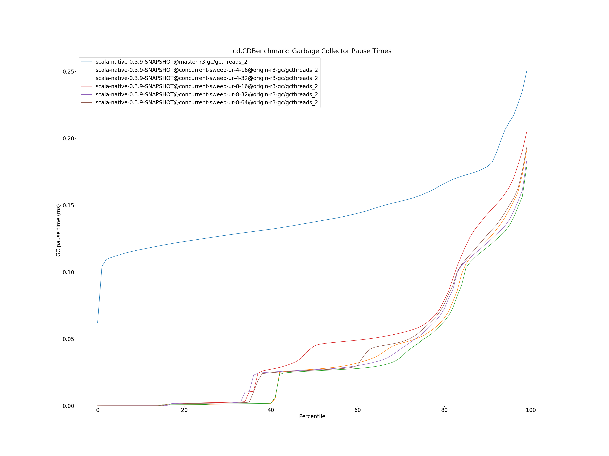
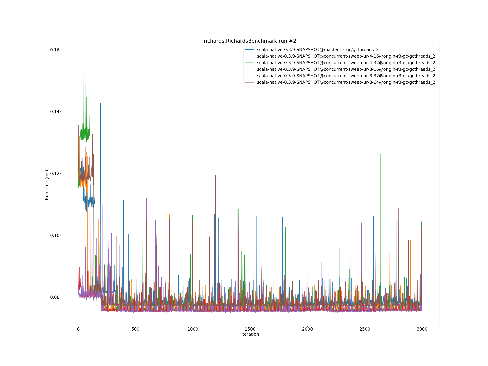

# Summary
## Benchmark run time (ms) at 50 percentile 

|name | scala-native-0.3.9-SNAPSHOT@master-r3-gc/gcthreads_2 | scala-native-0.3.9-SNAPSHOT@concurrent-sweep-ur-4-16@origin-r3-gc/gcthreads_2 |  | scala-native-0.3.9-SNAPSHOT@concurrent-sweep-ur-4-32@origin-r3-gc/gcthreads_2 |  | scala-native-0.3.9-SNAPSHOT@concurrent-sweep-ur-8-16@origin-r3-gc/gcthreads_2 |  | scala-native-0.3.9-SNAPSHOT@concurrent-sweep-ur-8-32@origin-r3-gc/gcthreads_2 |  | scala-native-0.3.9-SNAPSHOT@concurrent-sweep-ur-8-64@origin-r3-gc/gcthreads_2 | |
| -- | -- | -- | -- | -- | -- | -- | -- | -- | -- | -- | -- |
|[bounce.BounceBenchmark](#bouncebouncebenchmark)|0.0547|0.0591|+8.10%|0.0587|+7.37%|0.0546|__-0.13%__|0.0546|__-0.15%__|0.0546|__-0.02%__|
|[brainfuck.BrainfuckBenchmark](#brainfuckbrainfuckbenchmark)|3.4838|3.3153|__-4.84%__|3.4347|__-1.41%__|3.4550|__-0.83%__|3.4459|__-1.09%__|3.4632|__-0.59%__|
|[cd.CDBenchmark](#cdcdbenchmark)|32.5549|30.8902|__-5.11%__|30.8226|__-5.32%__|32.5912|+0.11%|30.8577|__-5.21%__|32.2455|__-0.95%__|
|[deltablue.DeltaBlueBenchmark](#deltabluedeltabluebenchmark)|0.1801|0.1938|+7.63%|0.1862|+3.39%|0.1832|+1.74%|0.1845|+2.49%|0.1824|+1.32%|
|[gcbench.GCBenchBenchmark](#gcbenchgcbenchbenchmark)|134.5046|134.0943|__-0.31%__|133.6028|__-0.67%__|134.4545|__-0.04%__|135.3058|+0.60%|132.0270|__-1.84%__|
|[json.JsonBenchmark](#jsonjsonbenchmark)|1.6716|1.6940|+1.34%|1.6729|+0.08%|1.6855|+0.83%|1.6467|__-1.49%__|1.6472|__-1.46%__|
|[kmeans.KmeansBenchmark](#kmeanskmeansbenchmark)|54.1631|52.1140|__-3.78%__|52.0288|__-3.94%__|51.9316|__-4.12%__|52.0131|__-3.97%__|53.7051|__-0.85%__|
|[list.ListBenchmark](#listlistbenchmark)|0.0656|0.0562|__-14.29%__|0.0564|__-14.05%__|0.0566|__-13.66%__|0.0569|__-13.22%__|0.0565|__-13.87%__|
|[mandelbrot.MandelbrotBenchmark](#mandelbrotmandelbrotbenchmark)|126.0941|126.0587|__-0.03%__|125.9744|__-0.09%__|126.0329|__-0.05%__|125.9958|__-0.08%__|126.0201|__-0.06%__|
|[nbody.NbodyBenchmark](#nbodynbodybenchmark)|39.6168|39.4949|__-0.31%__|39.4038|__-0.54%__|39.4707|__-0.37%__|39.3886|__-0.58%__|39.4719|__-0.37%__|
|[permute.PermuteBenchmark](#permutepermutebenchmark)|0.2494|0.2377|__-4.71%__|0.2606|+4.47%|0.2355|__-5.56%__|0.2154|__-13.63%__|0.2009|__-19.45%__|
|[queens.QueensBenchmark](#queensqueensbenchmark)|0.1158|0.1129|__-2.49%__|0.1148|__-0.84%__|0.1152|__-0.45%__|0.1148|__-0.81%__|0.1147|__-0.88%__|
|[richards.RichardsBenchmark](#richardsrichardsbenchmark)|0.0782|0.0758|__-3.05%__|0.0759|__-2.96%__|0.0757|__-3.17%__|0.0757|__-3.26%__|0.0775|__-0.98%__|
|[sudoku.SudokuBenchmark](#sudokusudokubenchmark)|2.4653|2.5621|+3.93%|2.5411|+3.08%|2.4417|__-0.96%__|2.5206|+2.24%|2.4118|__-2.17%__|
|[tracer.TracerBenchmark](#tracertracerbenchmark)|0.7526|0.7742|+2.86%|0.7707|+2.40%|0.7760|+3.10%|0.7710|+2.43%|0.7658|+1.74%|
| __Geometrical mean:__|| |__-1.15%__| |__-0.72%__| |__-1.65%__| |__-2.51%__| |__-2.88%__|
## Benchmark run time (ms) at 90 percentile 

|name | scala-native-0.3.9-SNAPSHOT@master-r3-gc/gcthreads_2 | scala-native-0.3.9-SNAPSHOT@concurrent-sweep-ur-4-16@origin-r3-gc/gcthreads_2 |  | scala-native-0.3.9-SNAPSHOT@concurrent-sweep-ur-4-32@origin-r3-gc/gcthreads_2 |  | scala-native-0.3.9-SNAPSHOT@concurrent-sweep-ur-8-16@origin-r3-gc/gcthreads_2 |  | scala-native-0.3.9-SNAPSHOT@concurrent-sweep-ur-8-32@origin-r3-gc/gcthreads_2 |  | scala-native-0.3.9-SNAPSHOT@concurrent-sweep-ur-8-64@origin-r3-gc/gcthreads_2 | |
| -- | -- | -- | -- | -- | -- | -- | -- | -- | -- | -- | -- |
|[bounce.BounceBenchmark](#bouncebouncebenchmark)|0.0561|0.0594|+5.93%|0.0589|+5.07%|0.0548|__-2.21%__|0.0549|__-2.16%__|0.0555|__-1.04%__|
|[brainfuck.BrainfuckBenchmark](#brainfuckbrainfuckbenchmark)|3.5651|3.3664|__-5.58%__|3.4901|__-2.10%__|3.5019|__-1.77%__|3.5043|__-1.71%__|3.5267|__-1.08%__|
|[cd.CDBenchmark](#cdcdbenchmark)|33.2554|32.1942|__-3.19%__|31.0990|__-6.48%__|32.8207|__-1.31%__|31.1182|__-6.43%__|32.5200|__-2.21%__|
|[deltablue.DeltaBlueBenchmark](#deltabluedeltabluebenchmark)|0.1848|0.1988|+7.55%|0.1926|+4.21%|0.1887|+2.12%|0.1901|+2.86%|0.1876|+1.50%|
|[gcbench.GCBenchBenchmark](#gcbenchgcbenchbenchmark)|138.4459|137.6950|__-0.54%__|135.4998|__-2.13%__|137.7028|__-0.54%__|137.6582|__-0.57%__|135.6119|__-2.05%__|
|[json.JsonBenchmark](#jsonjsonbenchmark)|1.7019|1.7164|+0.85%|1.6946|__-0.43%__|1.7048|+0.17%|1.6650|__-2.17%__|1.6662|__-2.10%__|
|[kmeans.KmeansBenchmark](#kmeanskmeansbenchmark)|56.8570|52.7975|__-7.14%__|52.7115|__-7.29%__|52.6490|__-7.40%__|52.8538|__-7.04%__|54.4738|__-4.19%__|
|[list.ListBenchmark](#listlistbenchmark)|0.0672|0.0573|__-14.78%__|0.0575|__-14.46%__|0.0584|__-13.03%__|0.0583|__-13.17%__|0.0576|__-14.33%__|
|[mandelbrot.MandelbrotBenchmark](#mandelbrotmandelbrotbenchmark)|127.2643|126.6138|__-0.51%__|126.8997|__-0.29%__|126.7928|__-0.37%__|126.6915|__-0.45%__|126.9343|__-0.26%__|
|[nbody.NbodyBenchmark](#nbodynbodybenchmark)|40.5792|39.9574|__-1.53%__|39.8612|__-1.77%__|39.8957|__-1.68%__|39.8769|__-1.73%__|39.9611|__-1.52%__|
|[permute.PermuteBenchmark](#permutepermutebenchmark)|0.2556|0.2460|__-3.74%__|0.2821|+10.37%|0.2427|__-5.06%__|0.2238|__-12.43%__|0.2094|__-18.09%__|
|[queens.QueensBenchmark](#queensqueensbenchmark)|0.1170|0.1159|__-0.90%__|0.1169|__-0.09%__|0.1162|__-0.63%__|0.1188|+1.60%|0.1153|__-1.45%__|
|[richards.RichardsBenchmark](#richardsrichardsbenchmark)|0.0794|0.0783|__-1.34%__|0.0779|__-1.92%__|0.0772|__-2.80%__|0.0776|__-2.23%__|0.0791|__-0.33%__|
|[sudoku.SudokuBenchmark](#sudokusudokubenchmark)|2.6803|2.6304|__-1.86%__|2.6857|+0.20%|2.5827|__-3.64%__|2.5844|__-3.58%__|2.4681|__-7.92%__|
|[tracer.TracerBenchmark](#tracertracerbenchmark)|0.7860|0.7983|+1.56%|0.7933|+0.93%|0.8059|+2.53%|0.7952|+1.17%|0.7914|+0.68%|
| __Geometrical mean:__|| |__-1.82%__| |__-1.23%__| |__-2.45%__| |__-3.31%__| |__-3.79%__|
## Benchmark run time (ms) at 99 percentile 

|name | scala-native-0.3.9-SNAPSHOT@master-r3-gc/gcthreads_2 | scala-native-0.3.9-SNAPSHOT@concurrent-sweep-ur-4-16@origin-r3-gc/gcthreads_2 |  | scala-native-0.3.9-SNAPSHOT@concurrent-sweep-ur-4-32@origin-r3-gc/gcthreads_2 |  | scala-native-0.3.9-SNAPSHOT@concurrent-sweep-ur-8-16@origin-r3-gc/gcthreads_2 |  | scala-native-0.3.9-SNAPSHOT@concurrent-sweep-ur-8-32@origin-r3-gc/gcthreads_2 |  | scala-native-0.3.9-SNAPSHOT@concurrent-sweep-ur-8-64@origin-r3-gc/gcthreads_2 | |
| -- | -- | -- | -- | -- | -- | -- | -- | -- | -- | -- | -- |
|[bounce.BounceBenchmark](#bouncebouncebenchmark)|0.0580|0.0620|+6.94%|0.0615|+6.18%|0.0575|__-0.79%__|0.0582|+0.34%|0.0643|+10.92%|
|[brainfuck.BrainfuckBenchmark](#brainfuckbrainfuckbenchmark)|3.6762|3.5107|__-4.50%__|3.5998|__-2.08%__|3.6144|__-1.68%__|3.6214|__-1.49%__|3.6597|__-0.45%__|
|[cd.CDBenchmark](#cdcdbenchmark)|34.0329|32.7460|__-3.78%__|31.6061|__-7.13%__|33.3827|__-1.91%__|31.7079|__-6.83%__|33.0665|__-2.84%__|
|[deltablue.DeltaBlueBenchmark](#deltabluedeltabluebenchmark)|0.2502|0.2721|+8.76%|0.2590|+3.52%|0.2661|+6.37%|0.2680|+7.11%|0.2623|+4.84%|
|[gcbench.GCBenchBenchmark](#gcbenchgcbenchbenchmark)|139.5498|139.4033|__-0.10%__|138.8617|__-0.49%__|139.2357|__-0.23%__|140.4004|+0.61%|138.0653|__-1.06%__|
|[json.JsonBenchmark](#jsonjsonbenchmark)|1.7813|1.8036|+1.25%|1.7896|+0.47%|1.7864|+0.29%|1.7659|__-0.86%__|1.7683|__-0.73%__|
|[kmeans.KmeansBenchmark](#kmeanskmeansbenchmark)|59.8369|53.8050|__-10.08%__|53.8861|__-9.95%__|53.8114|__-10.07%__|53.7695|__-10.14%__|55.5139|__-7.22%__|
|[list.ListBenchmark](#listlistbenchmark)|0.0698|0.0591|__-15.35%__|0.0595|__-14.76%__|0.0675|__-3.28%__|0.0599|__-14.23%__|0.0597|__-14.48%__|
|[mandelbrot.MandelbrotBenchmark](#mandelbrotmandelbrotbenchmark)|129.7372|129.6082|__-0.10%__|129.5492|__-0.14%__|129.6159|__-0.09%__|129.5600|__-0.14%__|129.6099|__-0.10%__|
|[nbody.NbodyBenchmark](#nbodynbodybenchmark)|41.8990|41.5044|__-0.94%__|41.1342|__-1.83%__|41.1446|__-1.80%__|41.3232|__-1.37%__|41.2277|__-1.60%__|
|[permute.PermuteBenchmark](#permutepermutebenchmark)|0.2803|0.2848|+1.61%|0.3168|+13.05%|0.2750|__-1.89%__|0.2557|__-8.78%__|0.2420|__-13.64%__|
|[queens.QueensBenchmark](#queensqueensbenchmark)|0.1273|0.1240|__-2.61%__|0.1261|__-0.98%__|0.1227|__-3.59%__|0.1239|__-2.70%__|0.1245|__-2.24%__|
|[richards.RichardsBenchmark](#richardsrichardsbenchmark)|0.0861|0.0871|+1.21%|0.0864|+0.39%|0.0844|__-1.94%__|0.0874|+1.56%|0.0865|+0.48%|
|[sudoku.SudokuBenchmark](#sudokusudokubenchmark)|2.7973|2.7281|__-2.47%__|2.7844|__-0.46%__|2.6698|__-4.56%__|2.6847|__-4.02%__|2.5983|__-7.11%__|
|[tracer.TracerBenchmark](#tracertracerbenchmark)|0.8006|0.8652|+8.07%|0.8764|+9.47%|0.8803|+9.96%|0.8943|+11.71%|0.8807|+10.01%|
| __Geometrical mean:__|| |__-1.00%__| |__-0.55%__| |__-1.11%__| |__-2.15%__| |__-1.93%__|
## Benchmark total run time (ms) 

|name | scala-native-0.3.9-SNAPSHOT@master-r3-gc/gcthreads_2 | scala-native-0.3.9-SNAPSHOT@concurrent-sweep-ur-4-16@origin-r3-gc/gcthreads_2 |  | scala-native-0.3.9-SNAPSHOT@concurrent-sweep-ur-4-32@origin-r3-gc/gcthreads_2 |  | scala-native-0.3.9-SNAPSHOT@concurrent-sweep-ur-8-16@origin-r3-gc/gcthreads_2 |  | scala-native-0.3.9-SNAPSHOT@concurrent-sweep-ur-8-32@origin-r3-gc/gcthreads_2 |  | scala-native-0.3.9-SNAPSHOT@concurrent-sweep-ur-8-64@origin-r3-gc/gcthreads_2 | |
| -- | -- | -- | -- | -- | -- | -- | -- | -- | -- | -- | -- |
|[bounce.BounceBenchmark](#bouncebouncebenchmark)|164.9419|177.7986|+7.79%|176.4894|+7.00%|164.1045|__-0.51%__|164.4389|__-0.30%__|165.1824|+0.15%|
|[brainfuck.BrainfuckBenchmark](#brainfuckbrainfuckbenchmark)|10482.5182|9985.7515|__-4.74%__|10344.0488|__-1.32%__|10399.8796|__-0.79%__|10386.9510|__-0.91%__|10436.6716|__-0.44%__|
|[cd.CDBenchmark](#cdcdbenchmark)|98103.3233|93655.5679|__-4.53%__|92609.4181|__-5.60%__|97893.2027|__-0.21%__|92712.5187|__-5.50%__|95381.6406|__-2.77%__|
|[deltablue.DeltaBlueBenchmark](#deltabluedeltabluebenchmark)|550.5780|592.7288|+7.66%|570.8560|+3.68%|561.9260|+2.06%|566.0840|+2.82%|559.0277|+1.53%|
|[gcbench.GCBenchBenchmark](#gcbenchgcbenchbenchmark)|400131.8901|391551.9069|__-2.14%__|388958.8284|__-2.79%__|393041.7507|__-1.77%__|395980.7566|__-1.04%__|389224.2120|__-2.73%__|
|[json.JsonBenchmark](#jsonjsonbenchmark)|4953.4785|4987.3088|+0.68%|4923.1921|__-0.61%__|4959.2714|+0.12%|4849.7676|__-2.09%__|4847.2893|__-2.14%__|
|[kmeans.KmeansBenchmark](#kmeanskmeansbenchmark)|162626.7810|156577.7411|__-3.72%__|156386.8622|__-3.84%__|156096.4015|__-4.02%__|156368.0437|__-3.85%__|161377.4347|__-0.77%__|
|[list.ListBenchmark](#listlistbenchmark)|198.3315|169.6352|__-14.47%__|170.5265|__-14.02%__|171.7937|__-13.38%__|171.6012|__-13.48%__|170.4397|__-14.06%__|
|[mandelbrot.MandelbrotBenchmark](#mandelbrotmandelbrotbenchmark)|379308.7586|378856.7380|__-0.12%__|378874.1599|__-0.11%__|378946.0149|__-0.10%__|378821.5187|__-0.13%__|378989.1018|__-0.08%__|
|[nbody.NbodyBenchmark](#nbodynbodybenchmark)|119406.2350|118871.9564|__-0.45%__|118585.4936|__-0.69%__|118761.9751|__-0.54%__|118565.2960|__-0.70%__|118786.9396|__-0.52%__|
|[permute.PermuteBenchmark](#permutepermutebenchmark)|755.0042|723.3810|__-4.19%__|805.2991|+6.66%|716.4006|__-5.11%__|656.1908|__-13.09%__|613.0358|__-18.80%__|
|[queens.QueensBenchmark](#queensqueensbenchmark)|348.9514|341.1123|__-2.25%__|347.7312|__-0.35%__|347.2904|__-0.48%__|346.8021|__-0.62%__|345.4976|__-0.99%__|
|[richards.RichardsBenchmark](#richardsrichardsbenchmark)|235.3404|230.1446|__-2.21%__|229.6946|__-2.40%__|228.8466|__-2.76%__|229.0551|__-2.67%__|234.0855|__-0.53%__|
|[sudoku.SudokuBenchmark](#sudokusudokubenchmark)|7482.1695|7688.7516|+2.76%|7707.7406|+3.01%|7387.9359|__-1.26%__|7600.7030|+1.58%|7272.6574|__-2.80%__|
|[tracer.TracerBenchmark](#tracertracerbenchmark)|2263.1285|2307.7798|+1.97%|2296.3720|+1.47%|2322.9595|+2.64%|2301.9545|+1.72%|2292.7292|+1.31%|
| __Geometrical mean:__|| |__-1.34%__| |__-0.79%__| |__-1.81%__| |__-2.67%__| |__-3.08%__|
## Total GC time on Application thread (ms) 

|name |  | scala-native-0.3.9-SNAPSHOT@master-r3-gc/gcthreads_2 | scala-native-0.3.9-SNAPSHOT@concurrent-sweep-ur-4-16@origin-r3-gc/gcthreads_2 |  | scala-native-0.3.9-SNAPSHOT@concurrent-sweep-ur-4-32@origin-r3-gc/gcthreads_2 |  | scala-native-0.3.9-SNAPSHOT@concurrent-sweep-ur-8-16@origin-r3-gc/gcthreads_2 |  | scala-native-0.3.9-SNAPSHOT@concurrent-sweep-ur-8-32@origin-r3-gc/gcthreads_2 |  | scala-native-0.3.9-SNAPSHOT@concurrent-sweep-ur-8-64@origin-r3-gc/gcthreads_2 | |
| -- | -- | -- | -- | -- | -- | -- | -- | -- | -- | -- | -- | -- |
|[bounce.BounceBenchmark](#bouncebouncebenchmark)|mark|0.2737|0.2524|__-7.81%__|0.2514|__-8.15%__|0.2616|__-4.45%__|0.2682|__-2.02%__|0.3052|+11.51%|
||sweep|0.2146|0.0203|__-90.54%__|0.0207|__-90.34%__|0.0276|__-87.12%__|0.0264|__-87.69%__|0.0610|__-71.58%__|
||total|0.4883|5.1854|+961.91%|5.2945|+984.26%|5.3741|+1000.56%|4.8743|+898.20%|4.6515|+852.57%|
|[brainfuck.BrainfuckBenchmark](#brainfuckbrainfuckbenchmark)|mark|589.6493|382.0530|__-35.21%__|418.5749|__-29.01%__|393.2138|__-33.31%__|438.4683|__-25.64%__|448.5438|__-23.93%__|
||sweep|161.7070|28.2676|__-82.52%__|31.1269|__-80.75%__|26.6275|__-83.53%__|26.9816|__-83.31%__|23.2230|__-85.64%__|
||total|751.3563|1546.5906|+105.84%|1742.4212|+131.90%|1579.6176|+110.24%|1772.9890|+135.97%|1829.4839|+143.49%|
|[cd.CDBenchmark](#cdcdbenchmark)|mark|2601.7508|3854.0439|+48.13%|4436.8582|+70.53%|2889.5535|+11.06%|4429.1111|+70.24%|3836.3477|+47.45%|
||sweep|2515.1496|169.4410|__-93.26%__|218.3049|__-91.32%__|221.4613|__-91.19%__|277.3328|__-88.97%__|206.0305|__-91.81%__|
||total|5116.9004|16485.6056|+222.18%|18106.6458|+253.86%|13607.2050|+165.93%|18299.0513|+257.62%|15853.8626|+209.83%|
|[deltablue.DeltaBlueBenchmark](#deltabluedeltabluebenchmark)|mark|17.0696|15.4635|__-9.41%__|13.7312|__-19.56%__|13.6893|__-19.80%__|13.7365|__-19.53%__|13.1260|__-23.10%__|
||sweep|5.8302|0.6474|__-88.90%__|0.6337|__-89.13%__|1.2788|__-78.06%__|1.2938|__-77.81%__|1.2525|__-78.52%__|
||total|22.8998|91.4203|+299.22%|81.1697|+254.46%|57.0456|+149.11%|54.9503|+139.96%|52.8932|+130.98%|
|[gcbench.GCBenchBenchmark](#gcbenchgcbenchbenchmark)|mark|305617.9793|292848.3180|__-4.18%__|291583.2106|__-4.59%__|289618.9495|__-5.23%__|292669.3508|__-4.24%__|292272.4296|__-4.37%__|
||sweep|29464.2903|1591.8028|__-94.60%__|1789.6694|__-93.93%__|1811.0147|__-93.85%__|2526.5598|__-91.43%__|2508.4428|__-91.49%__|
||total|335082.2696|668675.3979|+99.56%|662900.9425|+97.83%|661801.0797|+97.50%|666903.5960|+99.03%|662726.2111|+97.78%|
|[json.JsonBenchmark](#jsonjsonbenchmark)|mark|228.5646|236.2688|+3.37%|237.4087|+3.87%|235.1358|+2.87%|223.6256|__-2.16%__|240.3813|+5.17%|
||sweep|77.3635|17.6677|__-77.16%__|20.4618|__-73.55%__|8.1385|__-89.48%__|5.8533|__-92.43%__|6.1005|__-92.11%__|
||total|305.9281|994.2946|+225.01%|961.3290|+214.23%|964.4608|+215.26%|910.3475|+197.57%|922.7502|+201.62%|
|[kmeans.KmeansBenchmark](#kmeanskmeansbenchmark)|mark|14094.2711|6969.6677|__-50.55%__|7016.4460|__-50.22%__|6910.2889|__-50.97%__|7034.8379|__-50.09%__|7393.2505|__-47.54%__|
||sweep|1950.2690|189.5778|__-90.28%__|200.4420|__-89.72%__|184.6659|__-90.53%__|200.1912|__-89.74%__|217.8032|__-88.83%__|
||total|16044.5401|18277.5649|+13.92%|18191.3774|+13.38%|18095.4849|+12.78%|18195.8684|+13.41%|18881.5641|+17.68%|
|[list.ListBenchmark](#listlistbenchmark)|mark|0.0785|0.0779|__-0.70%__|0.0775|__-1.29%__|0.0782|__-0.37%__|0.0761|__-3.11%__|0.0740|__-5.74%__|
||sweep|0.0464|0.0234|__-49.56%__|0.0150|__-67.71%__|0.0255|__-44.94%__|0.0168|__-63.83%__|0.0076|__-83.65%__|
||total|0.1249|1.6868|+1250.78%|1.6817|+1246.65%|1.4426|+1055.20%|1.6453|+1217.54%|1.3580|+987.44%|
|[mandelbrot.MandelbrotBenchmark](#mandelbrotmandelbrotbenchmark)|mark|0.0000|0.0000|N/A|0.0000|N/A|0.0000|N/A|0.0000|N/A|0.0000|N/A|
||sweep|0.0000|0.0000|N/A|0.0000|N/A|0.0000|N/A|0.0000|N/A|0.0000|N/A|
||total|0.0000|0.0000|N/A|0.0000|N/A|0.0000|N/A|0.0000|N/A|0.0000|N/A|
|[nbody.NbodyBenchmark](#nbodynbodybenchmark)|mark|169.8520|156.4744|__-7.88%__|164.5806|__-3.10%__|155.7248|__-8.32%__|192.9280|+13.59%|151.0930|__-11.04%__|
||sweep|243.7884|15.8959|__-93.48%__|28.2652|__-88.41%__|24.0341|__-90.14%__|26.0265|__-89.32%__|24.8169|__-89.82%__|
||total|413.6403|8916.0669|+2055.51%|8737.5955|+2012.37%|8820.6932|+2032.45%|8616.1278|+1983.00%|8202.7536|+1883.06%|
|[permute.PermuteBenchmark](#permutepermutebenchmark)|mark|7.1758|7.5440|+5.13%|6.8032|__-5.19%__|7.5290|+4.92%|7.6643|+6.81%|8.0067|+11.58%|
||sweep|8.3466|0.6070|__-92.73%__|0.6046|__-92.76%__|0.8514|__-89.80%__|0.8757|__-89.51%__|0.9547|__-88.56%__|
||total|15.5224|109.6327|+606.29%|115.9827|+647.19%|105.1459|+577.38%|99.2788|+539.58%|89.1944|+474.62%|
|[queens.QueensBenchmark](#queensqueensbenchmark)|mark|0.4456|0.4492|+0.81%|0.4991|+12.01%|0.4274|__-4.10%__|0.4363|__-2.10%__|0.4290|__-3.73%__|
||sweep|0.3751|0.0329|__-91.23%__|0.0369|__-90.17%__|0.0445|__-88.13%__|0.0534|__-85.76%__|0.0435|__-88.41%__|
||total|0.8207|11.1151|+1254.28%|11.2357|+1268.98%|11.4978|+1300.91%|11.6276|+1316.72%|11.2957|+1276.28%|
|[richards.RichardsBenchmark](#richardsrichardsbenchmark)|mark|0.6500|0.6884|+5.91%|0.6490|__-0.17%__|0.6232|__-4.13%__|0.6045|__-7.01%__|0.6079|__-6.48%__|
||sweep|0.6426|0.0514|__-91.99%__|0.0521|__-91.90%__|0.0738|__-88.52%__|0.0873|__-86.41%__|0.0677|__-89.46%__|
||total|1.2927|10.6942|+727.29%|11.1108|+759.52%|10.8658|+740.57%|10.4382|+707.49%|11.0076|+751.53%|
|[sudoku.SudokuBenchmark](#sudokusudokubenchmark)|mark|247.9631|137.4412|__-44.57%__|116.1135|__-53.17%__|115.5949|__-53.38%__|131.2415|__-47.07%__|132.6831|__-46.49%__|
||sweep|86.1012|9.1706|__-89.35%__|7.2380|__-91.59%__|8.9701|__-89.58%__|11.6453|__-86.47%__|13.9918|__-83.75%__|
||total|334.0643|615.6458|+84.29%|458.8011|+37.34%|456.4022|+36.62%|593.4536|+77.65%|578.1168|+73.06%|
|[tracer.TracerBenchmark](#tracertracerbenchmark)|mark|70.5157|80.4998|+14.16%|86.4849|+22.65%|83.1490|+17.92%|79.9662|+13.40%|81.7924|+15.99%|
||sweep|87.5961|47.0558|__-46.28%__|45.5874|__-47.96%__|44.9311|__-48.71%__|45.1872|__-48.41%__|47.9221|__-45.29%__|
||total|158.1119|629.8638|+298.37%|607.4441|+284.19%|629.1529|+297.92%|584.1492|+269.45%|609.8912|+285.73%|
|__Geometrical mean:__|mark|| |__-9.30%__| |__-9.25%__| |__-13.49%__| |__-8.24%__| |__-9.04%__|
||sweep|| |__-87.91%__| |__-87.33%__| |__-86.09%__| |__-85.49%__| |__-86.00%__|
||total|| |+380.66%| |+374.50%| |+343.80%| |+358.04%| |+343.24%|
## GC pause time (ms) at 50 percentile 

|name | scala-native-0.3.9-SNAPSHOT@master-r3-gc/gcthreads_2 | scala-native-0.3.9-SNAPSHOT@concurrent-sweep-ur-4-16@origin-r3-gc/gcthreads_2 |  | scala-native-0.3.9-SNAPSHOT@concurrent-sweep-ur-4-32@origin-r3-gc/gcthreads_2 |  | scala-native-0.3.9-SNAPSHOT@concurrent-sweep-ur-8-16@origin-r3-gc/gcthreads_2 |  | scala-native-0.3.9-SNAPSHOT@concurrent-sweep-ur-8-32@origin-r3-gc/gcthreads_2 |  | scala-native-0.3.9-SNAPSHOT@concurrent-sweep-ur-8-64@origin-r3-gc/gcthreads_2 | |
| -- | -- | -- | -- | -- | -- | -- | -- | -- | -- | -- | -- |
|[bounce.BounceBenchmark](#bouncebouncebenchmark)|0.0315|0.0201|__-36.01%__|0.0202|__-35.85%__|0.0187|__-40.53%__|0.0172|__-45.48%__|0.0193|__-38.80%__|
|[brainfuck.BrainfuckBenchmark](#brainfuckbrainfuckbenchmark)|0.0659|0.0124|__-81.17%__|0.0136|__-79.30%__|0.0121|__-81.59%__|0.0137|__-79.25%__|0.0134|__-79.61%__|
|[cd.CDBenchmark](#cdcdbenchmark)|0.1375|0.0274|__-80.08%__|0.0261|__-80.99%__|0.0448|__-67.41%__|0.0270|__-80.34%__|0.0267|__-80.61%__|
|[deltablue.DeltaBlueBenchmark](#deltabluedeltabluebenchmark)|0.0582|0.0120|__-79.31%__|0.0116|__-80.07%__|0.0093|__-83.98%__|0.0088|__-84.82%__|0.0084|__-85.60%__|
|[gcbench.GCBenchBenchmark](#gcbenchgcbenchbenchmark)|3.9131|0.3148|__-91.96%__|0.3058|__-92.19%__|0.3169|__-91.90%__|0.3107|__-92.06%__|0.2946|__-92.47%__|
|[json.JsonBenchmark](#jsonjsonbenchmark)|0.0676|0.0240|__-64.43%__|0.0195|__-71.08%__|0.0203|__-69.94%__|0.0186|__-72.50%__|0.0172|__-74.61%__|
|[kmeans.KmeansBenchmark](#kmeanskmeansbenchmark)|2.9332|0.1254|__-95.72%__|0.1213|__-95.87%__|0.1243|__-95.76%__|0.1193|__-95.93%__|0.1185|__-95.96%__|
|[list.ListBenchmark](#listlistbenchmark)|0.0409|0.0615|+50.44%|0.0630|+54.02%|0.0243|__-40.47%__|0.0612|+49.67%|0.0250|__-38.96%__|
|[mandelbrot.MandelbrotBenchmark](#mandelbrotmandelbrotbenchmark)|0.0000|0.0000|N/A|0.0000|N/A|0.0000|N/A|0.0000|N/A|0.0000|N/A|
|[nbody.NbodyBenchmark](#nbodynbodybenchmark)|0.0233|0.0114|__-51.32%__|0.0118|__-49.35%__|0.0111|__-52.60%__|0.0130|__-44.24%__|0.0099|__-57.46%__|
|[permute.PermuteBenchmark](#permutepermutebenchmark)|0.0264|0.0158|__-40.12%__|0.0145|__-45.21%__|0.0173|__-34.44%__|0.0161|__-38.86%__|0.0142|__-46.36%__|
|[queens.QueensBenchmark](#queensqueensbenchmark)|0.0286|0.0279|__-2.55%__|0.0268|__-6.34%__|0.0279|__-2.54%__|0.0252|__-12.06%__|0.0318|+11.22%|
|[richards.RichardsBenchmark](#richardsrichardsbenchmark)|0.0280|0.0178|__-36.41%__|0.0260|__-7.11%__|0.0257|__-8.06%__|0.0151|__-45.88%__|0.0266|__-4.99%__|
|[sudoku.SudokuBenchmark](#sudokusudokubenchmark)|0.1758|0.0950|__-45.99%__|0.0580|__-67.03%__|0.0548|__-68.85%__|0.0918|__-47.77%__|0.0860|__-51.10%__|
|[tracer.TracerBenchmark](#tracertracerbenchmark)|0.0252|0.0080|__-68.39%__|0.0069|__-72.70%__|0.0074|__-70.55%__|0.0061|__-75.60%__|0.0077|__-69.42%__|
| __Geometrical mean:__|| |__-65.95%__| |__-67.34%__| |__-68.62%__| |__-68.55%__| |__-69.54%__|
## GC pause time (ms) at 90 percentile 

|name | scala-native-0.3.9-SNAPSHOT@master-r3-gc/gcthreads_2 | scala-native-0.3.9-SNAPSHOT@concurrent-sweep-ur-4-16@origin-r3-gc/gcthreads_2 |  | scala-native-0.3.9-SNAPSHOT@concurrent-sweep-ur-4-32@origin-r3-gc/gcthreads_2 |  | scala-native-0.3.9-SNAPSHOT@concurrent-sweep-ur-8-16@origin-r3-gc/gcthreads_2 |  | scala-native-0.3.9-SNAPSHOT@concurrent-sweep-ur-8-32@origin-r3-gc/gcthreads_2 |  | scala-native-0.3.9-SNAPSHOT@concurrent-sweep-ur-8-64@origin-r3-gc/gcthreads_2 | |
| -- | -- | -- | -- | -- | -- | -- | -- | -- | -- | -- | -- |
|[bounce.BounceBenchmark](#bouncebouncebenchmark)|0.0401|0.2740|+582.61%|0.2704|+573.75%|0.2564|+538.64%|0.2549|+535.14%|0.2133|+431.43%|
|[brainfuck.BrainfuckBenchmark](#brainfuckbrainfuckbenchmark)|0.1067|0.0875|__-18.03%__|0.0933|__-12.60%__|0.0929|__-12.95%__|0.0953|__-10.74%__|0.0977|__-8.46%__|
|[cd.CDBenchmark](#cdcdbenchmark)|0.1791|0.1242|__-30.64%__|0.1188|__-33.67%__|0.1436|__-19.78%__|0.1221|__-31.81%__|0.1282|__-28.43%__|
|[deltablue.DeltaBlueBenchmark](#deltabluedeltabluebenchmark)|0.0697|0.1024|+46.75%|0.0962|+37.92%|0.0759|+8.77%|0.0749|+7.32%|0.0737|+5.63%|
|[gcbench.GCBenchBenchmark](#gcbenchgcbenchbenchmark)|5.3117|3.7005|__-30.33%__|3.6516|__-31.25%__|3.6502|__-31.28%__|3.7014|__-30.32%__|3.6498|__-31.29%__|
|[json.JsonBenchmark](#jsonjsonbenchmark)|0.0695|0.1173|+68.67%|0.1144|+64.48%|0.1165|+67.45%|0.1113|+59.98%|0.1079|+55.12%|
|[kmeans.KmeansBenchmark](#kmeanskmeansbenchmark)|5.0731|0.9538|__-81.20%__|0.9505|__-81.26%__|0.9453|__-81.37%__|0.9477|__-81.32%__|0.9484|__-81.31%__|
|[list.ListBenchmark](#listlistbenchmark)|0.0427|0.3127|+631.73%|0.3090|+623.07%|0.2275|+432.34%|0.2957|+592.03%|0.2203|+415.57%|
|[mandelbrot.MandelbrotBenchmark](#mandelbrotmandelbrotbenchmark)|0.0000|0.0000|N/A|0.0000|N/A|0.0000|N/A|0.0000|N/A|0.0000|N/A|
|[nbody.NbodyBenchmark](#nbodynbodybenchmark)|0.0250|0.3080|+1130.10%|0.3079|+1129.56%|0.3080|+1130.20%|0.3097|+1136.77%|0.3070|+1126.22%|
|[permute.PermuteBenchmark](#permutepermutebenchmark)|0.0283|0.1136|+301.62%|0.1185|+318.65%|0.1117|+294.65%|0.1063|+275.81%|0.1017|+259.37%|
|[queens.QueensBenchmark](#queensqueensbenchmark)|0.0374|0.1704|+356.18%|0.1742|+366.50%|0.1741|+366.02%|0.1716|+359.55%|0.1785|+378.02%|
|[richards.RichardsBenchmark](#richardsrichardsbenchmark)|0.0334|0.1139|+241.39%|0.1143|+242.59%|0.1132|+239.37%|0.1135|+240.24%|0.1140|+241.62%|
|[sudoku.SudokuBenchmark](#sudokusudokubenchmark)|0.1831|0.2908|+58.78%|0.2292|+25.15%|0.2286|+24.84%|0.2912|+59.03%|0.2855|+55.88%|
|[tracer.TracerBenchmark](#tracertracerbenchmark)|0.0268|0.0591|+120.93%|0.0585|+118.40%|0.0595|+122.16%|0.0570|+112.93%|0.0576|+115.03%|
| __Geometrical mean:__|| |+106.04%| |+101.79%| |+95.36%| |+98.47%| |+91.79%|
## GC pause time (ms) at 99 percentile 

|name | scala-native-0.3.9-SNAPSHOT@master-r3-gc/gcthreads_2 | scala-native-0.3.9-SNAPSHOT@concurrent-sweep-ur-4-16@origin-r3-gc/gcthreads_2 |  | scala-native-0.3.9-SNAPSHOT@concurrent-sweep-ur-4-32@origin-r3-gc/gcthreads_2 |  | scala-native-0.3.9-SNAPSHOT@concurrent-sweep-ur-8-16@origin-r3-gc/gcthreads_2 |  | scala-native-0.3.9-SNAPSHOT@concurrent-sweep-ur-8-32@origin-r3-gc/gcthreads_2 |  | scala-native-0.3.9-SNAPSHOT@concurrent-sweep-ur-8-64@origin-r3-gc/gcthreads_2 | |
| -- | -- | -- | -- | -- | -- | -- | -- | -- | -- | -- | -- |
|[bounce.BounceBenchmark](#bouncebouncebenchmark)|0.0430|0.3433|+698.02%|0.3349|+678.52%|0.3841|+792.93%|0.3270|+660.01%|0.2852|+562.89%|
|[brainfuck.BrainfuckBenchmark](#brainfuckbrainfuckbenchmark)|0.1125|0.1230|+9.31%|0.1531|+36.10%|0.1322|+17.55%|0.1562|+38.85%|0.1575|+40.00%|
|[cd.CDBenchmark](#cdcdbenchmark)|0.2500|0.1908|__-23.69%__|0.1786|__-28.56%__|0.2046|__-18.14%__|0.1830|__-26.81%__|0.1930|__-22.81%__|
|[deltablue.DeltaBlueBenchmark](#deltabluedeltabluebenchmark)|0.0795|0.1830|+130.12%|0.1687|+112.18%|0.1376|+73.07%|0.1302|+63.81%|0.1018|+28.02%|
|[gcbench.GCBenchBenchmark](#gcbenchgcbenchbenchmark)|8.7757|8.7759|+0.00%|8.7752|__-0.01%__|8.8114|+0.41%|8.9089|+1.52%|8.7762|+0.01%|
|[json.JsonBenchmark](#jsonjsonbenchmark)|0.0752|0.1274|+69.35%|0.1284|+70.60%|0.1286|+70.88%|0.1244|+65.39%|0.1420|+88.75%|
|[kmeans.KmeansBenchmark](#kmeanskmeansbenchmark)|7.4208|0.9887|__-86.68%__|0.9879|__-86.69%__|0.9793|__-86.80%__|0.9888|__-86.67%__|1.3763|__-81.45%__|
|[list.ListBenchmark](#listlistbenchmark)|0.0431|0.3143|+628.50%|0.3246|+652.32%|0.3367|+680.20%|0.3040|+604.51%|0.3268|+657.47%|
|[mandelbrot.MandelbrotBenchmark](#mandelbrotmandelbrotbenchmark)|0.0000|0.0000|N/A|0.0000|N/A|0.0000|N/A|0.0000|N/A|0.0000|N/A|
|[nbody.NbodyBenchmark](#nbodynbodybenchmark)|0.0286|0.3260|+1038.32%|0.3247|+1033.49%|0.3280|+1045.08%|0.3283|+1046.09%|0.3249|+1034.19%|
|[permute.PermuteBenchmark](#permutepermutebenchmark)|0.0319|0.1257|+294.29%|0.1292|+305.16%|0.1187|+272.23%|0.1121|+251.62%|0.1081|+238.98%|
|[queens.QueensBenchmark](#queensqueensbenchmark)|0.0451|0.2622|+480.86%|0.2736|+506.23%|0.2777|+515.30%|0.2776|+515.07%|0.2667|+490.82%|
|[richards.RichardsBenchmark](#richardsrichardsbenchmark)|0.0423|0.1266|+199.08%|0.1265|+198.85%|0.1289|+204.50%|0.1279|+202.15%|0.1244|+193.97%|
|[sudoku.SudokuBenchmark](#sudokusudokubenchmark)|0.1955|0.3479|+77.92%|0.2878|+47.17%|0.2742|+40.24%|0.3393|+73.51%|0.3349|+71.28%|
|[tracer.TracerBenchmark](#tracertracerbenchmark)|0.0302|0.0711|+135.44%|0.0685|+126.82%|0.0719|+138.04%|0.0668|+121.34%|0.0654|+116.42%|
| __Geometrical mean:__|| |+124.43%| |+123.21%| |+121.87%| |+118.73%| |+119.48%|
# Individual benchmarks
## bounce.BounceBenchmark

## brainfuck.BrainfuckBenchmark

## cd.CDBenchmark

## deltablue.DeltaBlueBenchmark

## gcbench.GCBenchBenchmark

## json.JsonBenchmark

## kmeans.KmeansBenchmark

## list.ListBenchmark

## mandelbrot.MandelbrotBenchmark

## nbody.NbodyBenchmark

## permute.PermuteBenchmark

## queens.QueensBenchmark

## richards.RichardsBenchmark

## sudoku.SudokuBenchmark

## tracer.TracerBenchmark

