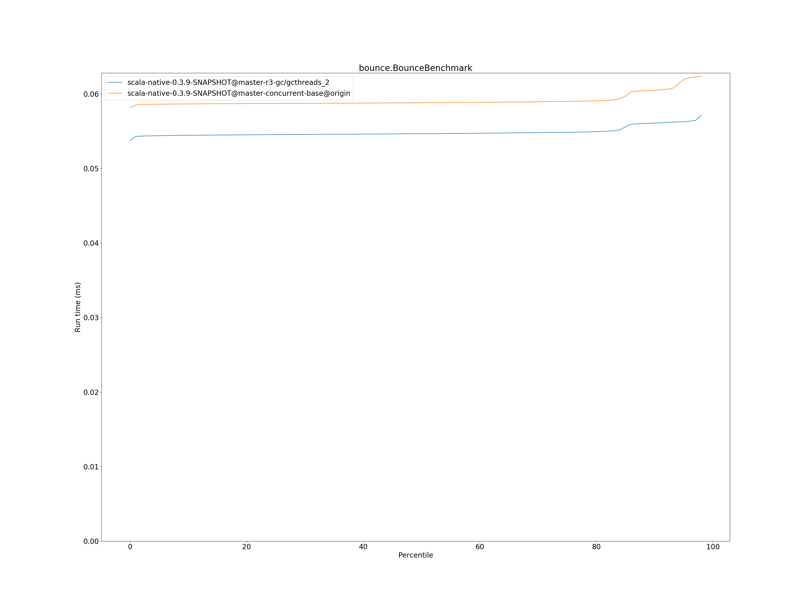

# Summary
## Benchmark run time (ms) at 50 percentile 

|name | scala-native-0.3.9-SNAPSHOT@master-r3-gc/gcthreads_2 | scala-native-0.3.9-SNAPSHOT@master-concurrent-base@origin | |
| -- | -- | -- | -- |
|[bounce.BounceBenchmark](#bouncebouncebenchmark)|0.0547|0.0588|+7.60%|
|[brainfuck.BrainfuckBenchmark](#brainfuckbrainfuckbenchmark)|3.4838|3.3759|__-3.10%__|
|[cd.CDBenchmark](#cdcdbenchmark)|32.5549|32.7898|+0.72%|
|[deltablue.DeltaBlueBenchmark](#deltabluedeltabluebenchmark)|0.1801|0.1823|+1.27%|
|[gcbench.GCBenchBenchmark](#gcbenchgcbenchbenchmark)|134.5046|132.9232|__-1.18%__|
|[json.JsonBenchmark](#jsonjsonbenchmark)|1.6716|1.6521|__-1.17%__|
|[kmeans.KmeansBenchmark](#kmeanskmeansbenchmark)|54.1631|53.9548|__-0.38%__|
|[list.ListBenchmark](#listlistbenchmark)|0.0656|0.0548|__-16.41%__|
|[mandelbrot.MandelbrotBenchmark](#mandelbrotmandelbrotbenchmark)|126.0941|126.0747|__-0.02%__|
|[nbody.NbodyBenchmark](#nbodynbodybenchmark)|39.6168|39.4352|__-0.46%__|
|[permute.PermuteBenchmark](#permutepermutebenchmark)|0.2494|0.2027|__-18.71%__|
|[queens.QueensBenchmark](#queensqueensbenchmark)|0.1158|0.1155|__-0.19%__|
|[richards.RichardsBenchmark](#richardsrichardsbenchmark)|0.0782|0.0769|__-1.72%__|
|[sudoku.SudokuBenchmark](#sudokusudokubenchmark)|2.4653|2.4286|__-1.49%__|
|[tracer.TracerBenchmark](#tracertracerbenchmark)|0.7526|0.7508|__-0.24%__|
| __Geometrical mean:__|| |__-2.59%__|
## Benchmark run time (ms) at 90 percentile 

|name | scala-native-0.3.9-SNAPSHOT@master-r3-gc/gcthreads_2 | scala-native-0.3.9-SNAPSHOT@master-concurrent-base@origin | |
| -- | -- | -- | -- |
|[bounce.BounceBenchmark](#bouncebouncebenchmark)|0.0561|0.0605|+7.87%|
|[brainfuck.BrainfuckBenchmark](#brainfuckbrainfuckbenchmark)|3.5651|3.4634|__-2.85%__|
|[cd.CDBenchmark](#cdcdbenchmark)|33.2554|33.3898|+0.40%|
|[deltablue.DeltaBlueBenchmark](#deltabluedeltabluebenchmark)|0.1848|0.1924|+4.10%|
|[gcbench.GCBenchBenchmark](#gcbenchgcbenchbenchmark)|138.4459|135.6477|__-2.02%__|
|[json.JsonBenchmark](#jsonjsonbenchmark)|1.7019|1.6739|__-1.64%__|
|[kmeans.KmeansBenchmark](#kmeanskmeansbenchmark)|56.8570|56.3564|__-0.88%__|
|[list.ListBenchmark](#listlistbenchmark)|0.0672|0.0563|__-16.23%__|
|[mandelbrot.MandelbrotBenchmark](#mandelbrotmandelbrotbenchmark)|127.2643|126.7456|__-0.41%__|
|[nbody.NbodyBenchmark](#nbodynbodybenchmark)|40.5792|40.2439|__-0.83%__|
|[permute.PermuteBenchmark](#permutepermutebenchmark)|0.2556|0.2269|__-11.22%__|
|[queens.QueensBenchmark](#queensqueensbenchmark)|0.1170|0.1188|+1.59%|
|[richards.RichardsBenchmark](#richardsrichardsbenchmark)|0.0794|0.0799|+0.66%|
|[sudoku.SudokuBenchmark](#sudokusudokubenchmark)|2.6803|2.6249|__-2.06%__|
|[tracer.TracerBenchmark](#tracertracerbenchmark)|0.7860|0.7768|__-1.16%__|
| __Geometrical mean:__|| |__-1.81%__|
## Benchmark run time (ms) at 99 percentile 

|name | scala-native-0.3.9-SNAPSHOT@master-r3-gc/gcthreads_2 | scala-native-0.3.9-SNAPSHOT@master-concurrent-base@origin | |
| -- | -- | -- | -- |
|[bounce.BounceBenchmark](#bouncebouncebenchmark)|0.0580|0.0626|+7.98%|
|[brainfuck.BrainfuckBenchmark](#brainfuckbrainfuckbenchmark)|3.6762|3.5840|__-2.51%__|
|[cd.CDBenchmark](#cdcdbenchmark)|34.0329|34.2258|+0.57%|
|[deltablue.DeltaBlueBenchmark](#deltabluedeltabluebenchmark)|0.2502|0.2633|+5.23%|
|[gcbench.GCBenchBenchmark](#gcbenchgcbenchbenchmark)|139.5498|136.9762|__-1.84%__|
|[json.JsonBenchmark](#jsonjsonbenchmark)|1.7813|1.7575|__-1.33%__|
|[kmeans.KmeansBenchmark](#kmeanskmeansbenchmark)|59.8369|58.3701|__-2.45%__|
|[list.ListBenchmark](#listlistbenchmark)|0.0698|0.0588|__-15.69%__|
|[mandelbrot.MandelbrotBenchmark](#mandelbrotmandelbrotbenchmark)|129.7372|128.7248|__-0.78%__|
|[nbody.NbodyBenchmark](#nbodynbodybenchmark)|41.8990|41.6190|__-0.67%__|
|[permute.PermuteBenchmark](#permutepermutebenchmark)|0.2803|0.2392|__-14.65%__|
|[queens.QueensBenchmark](#queensqueensbenchmark)|0.1273|0.1262|__-0.86%__|
|[richards.RichardsBenchmark](#richardsrichardsbenchmark)|0.0861|0.0877|+1.92%|
|[sudoku.SudokuBenchmark](#sudokusudokubenchmark)|2.7973|2.7182|__-2.83%__|
|[tracer.TracerBenchmark](#tracertracerbenchmark)|0.8006|0.8415|+5.11%|
| __Geometrical mean:__|| |__-1.72%__|
## Benchmark total run time (ms) 

|name | scala-native-0.3.9-SNAPSHOT@master-r3-gc/gcthreads_2 | scala-native-0.3.9-SNAPSHOT@master-concurrent-base@origin | |
| -- | -- | -- | -- |
|[bounce.BounceBenchmark](#bouncebouncebenchmark)|164.9419|1185.2632|+618.59%|
|[brainfuck.BrainfuckBenchmark](#brainfuckbrainfuckbenchmark)|10482.5182|67047.1111|+539.61%|
|[cd.CDBenchmark](#cdcdbenchmark)|98103.3233|657757.9143|+570.47%|
|[deltablue.DeltaBlueBenchmark](#deltabluedeltabluebenchmark)|550.5780|3744.6118|+580.12%|
|[gcbench.GCBenchBenchmark](#gcbenchgcbenchbenchmark)|400131.8901|2622185.5744|+555.33%|
|[json.JsonBenchmark](#jsonjsonbenchmark)|4953.4785|32669.6568|+559.53%|
|[kmeans.KmeansBenchmark](#kmeanskmeansbenchmark)|162626.7810|1077865.6741|+562.78%|
|[list.ListBenchmark](#listlistbenchmark)|198.3315|1106.3288|+457.82%|
|[mandelbrot.MandelbrotBenchmark](#mandelbrotmandelbrotbenchmark)|379308.7586|2525585.6944|+565.84%|
|[nbody.NbodyBenchmark](#nbodynbodybenchmark)|119406.2350|792356.6569|+563.58%|
|[permute.PermuteBenchmark](#permutepermutebenchmark)|755.0042|4141.0957|+448.49%|
|[queens.QueensBenchmark](#queensqueensbenchmark)|348.9514|2329.7301|+567.64%|
|[richards.RichardsBenchmark](#richardsrichardsbenchmark)|235.3404|1555.5275|+560.97%|
|[sudoku.SudokuBenchmark](#sudokusudokubenchmark)|7482.1695|49168.7215|+557.15%|
|[tracer.TracerBenchmark](#tracertracerbenchmark)|2263.1285|15044.7692|+564.78%|
| __Geometrical mean:__|| |+550.07%|
# Individual benchmarks
## bounce.BounceBenchmark

## brainfuck.BrainfuckBenchmark

## cd.CDBenchmark

## deltablue.DeltaBlueBenchmark

## gcbench.GCBenchBenchmark

## json.JsonBenchmark

## kmeans.KmeansBenchmark

## list.ListBenchmark

## mandelbrot.MandelbrotBenchmark

## nbody.NbodyBenchmark

## permute.PermuteBenchmark

## queens.QueensBenchmark

## richards.RichardsBenchmark

## sudoku.SudokuBenchmark

## tracer.TracerBenchmark

