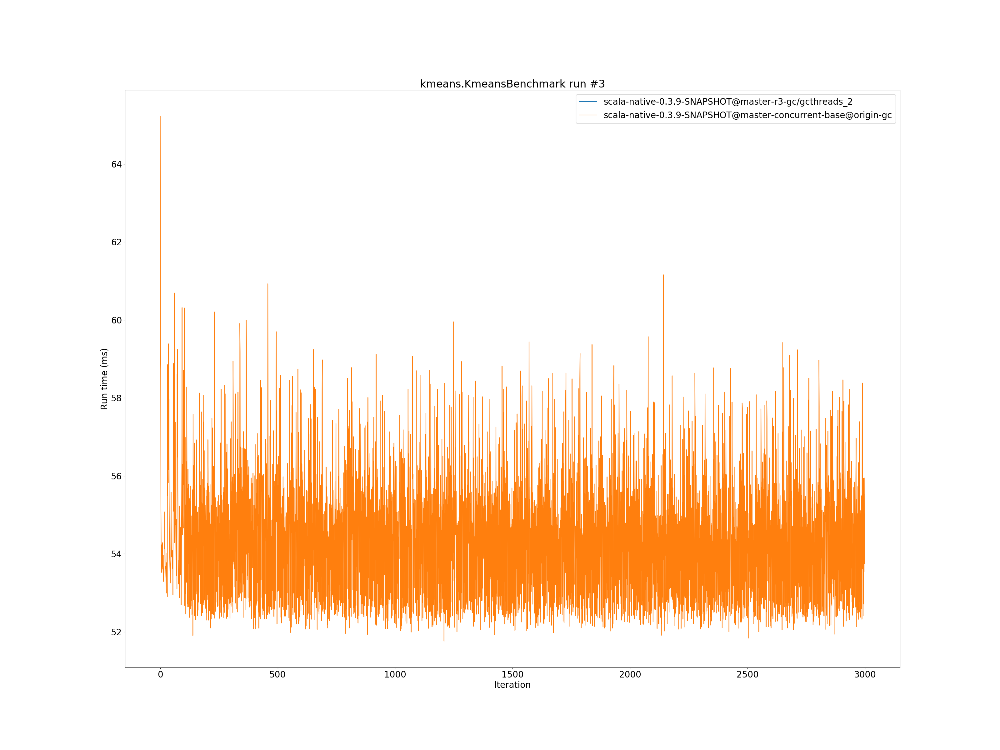

# Summary
## Benchmark run time (ms) at 50 percentile 

|name | scala-native-0.3.9-SNAPSHOT@master-r3-gc/gcthreads_2 | scala-native-0.3.9-SNAPSHOT@master-concurrent-base@origin-gc | |
| -- | -- | -- | -- |
|[bounce.BounceBenchmark](#bouncebouncebenchmark)|0.0547|0.0532|__-2.64%__|
|[brainfuck.BrainfuckBenchmark](#brainfuckbrainfuckbenchmark)|3.4838|3.4564|__-0.79%__|
|[cd.CDBenchmark](#cdcdbenchmark)|32.5549|32.0159|__-1.66%__|
|[deltablue.DeltaBlueBenchmark](#deltabluedeltabluebenchmark)|0.1801|0.1881|+4.49%|
|[gcbench.GCBenchBenchmark](#gcbenchgcbenchbenchmark)|134.5046|133.3344|__-0.87%__|
|[json.JsonBenchmark](#jsonjsonbenchmark)|1.6716|1.6509|__-1.24%__|
|[kmeans.KmeansBenchmark](#kmeanskmeansbenchmark)|54.1631|54.6604|+0.92%|
|[list.ListBenchmark](#listlistbenchmark)|0.0656|0.0548|__-16.42%__|
|[mandelbrot.MandelbrotBenchmark](#mandelbrotmandelbrotbenchmark)|126.0941|126.0898|__-0.00%__|
|[nbody.NbodyBenchmark](#nbodynbodybenchmark)|39.6168|39.4732|__-0.36%__|
|[permute.PermuteBenchmark](#permutepermutebenchmark)|0.2494|0.2028|__-18.67%__|
|[queens.QueensBenchmark](#queensqueensbenchmark)|0.1158|0.1140|__-1.54%__|
|[richards.RichardsBenchmark](#richardsrichardsbenchmark)|0.0782|0.0787|+0.61%|
|[sudoku.SudokuBenchmark](#sudokusudokubenchmark)|2.4653|2.4173|__-1.95%__|
|[tracer.TracerBenchmark](#tracertracerbenchmark)|0.7526|0.7499|__-0.36%__|
| __Geometrical mean:__|| |__-2.90%__|
## Benchmark run time (ms) at 90 percentile 

|name | scala-native-0.3.9-SNAPSHOT@master-r3-gc/gcthreads_2 | scala-native-0.3.9-SNAPSHOT@master-concurrent-base@origin-gc | |
| -- | -- | -- | -- |
|[bounce.BounceBenchmark](#bouncebouncebenchmark)|0.0561|0.0536|__-4.40%__|
|[brainfuck.BrainfuckBenchmark](#brainfuckbrainfuckbenchmark)|3.5651|3.5168|__-1.35%__|
|[cd.CDBenchmark](#cdcdbenchmark)|33.2554|32.6043|__-1.96%__|
|[deltablue.DeltaBlueBenchmark](#deltabluedeltabluebenchmark)|0.1848|0.1955|+5.78%|
|[gcbench.GCBenchBenchmark](#gcbenchgcbenchbenchmark)|138.4459|136.9870|__-1.05%__|
|[json.JsonBenchmark](#jsonjsonbenchmark)|1.7019|1.6779|__-1.41%__|
|[kmeans.KmeansBenchmark](#kmeanskmeansbenchmark)|56.8570|56.8927|+0.06%|
|[list.ListBenchmark](#listlistbenchmark)|0.0672|0.0566|__-15.75%__|
|[mandelbrot.MandelbrotBenchmark](#mandelbrotmandelbrotbenchmark)|127.2643|126.8120|__-0.36%__|
|[nbody.NbodyBenchmark](#nbodynbodybenchmark)|40.5792|40.1658|__-1.02%__|
|[permute.PermuteBenchmark](#permutepermutebenchmark)|0.2556|0.2143|__-16.14%__|
|[queens.QueensBenchmark](#queensqueensbenchmark)|0.1170|0.1176|+0.51%|
|[richards.RichardsBenchmark](#richardsrichardsbenchmark)|0.0794|0.0818|+3.06%|
|[sudoku.SudokuBenchmark](#sudokusudokubenchmark)|2.6803|2.6220|__-2.17%__|
|[tracer.TracerBenchmark](#tracertracerbenchmark)|0.7860|0.7716|__-1.84%__|
| __Geometrical mean:__|| |__-2.71%__|
## Benchmark run time (ms) at 99 percentile 

|name | scala-native-0.3.9-SNAPSHOT@master-r3-gc/gcthreads_2 | scala-native-0.3.9-SNAPSHOT@master-concurrent-base@origin-gc | |
| -- | -- | -- | -- |
|[bounce.BounceBenchmark](#bouncebouncebenchmark)|0.0580|0.0565|__-2.59%__|
|[brainfuck.BrainfuckBenchmark](#brainfuckbrainfuckbenchmark)|3.6762|3.6743|__-0.05%__|
|[cd.CDBenchmark](#cdcdbenchmark)|34.0329|33.4444|__-1.73%__|
|[deltablue.DeltaBlueBenchmark](#deltabluedeltabluebenchmark)|0.2502|0.2577|+3.02%|
|[gcbench.GCBenchBenchmark](#gcbenchgcbenchbenchmark)|139.5498|138.7733|__-0.56%__|
|[json.JsonBenchmark](#jsonjsonbenchmark)|1.7813|1.7612|__-1.13%__|
|[kmeans.KmeansBenchmark](#kmeanskmeansbenchmark)|59.8369|58.8480|__-1.65%__|
|[list.ListBenchmark](#listlistbenchmark)|0.0698|0.0590|__-15.53%__|
|[mandelbrot.MandelbrotBenchmark](#mandelbrotmandelbrotbenchmark)|129.7372|128.7928|__-0.73%__|
|[nbody.NbodyBenchmark](#nbodynbodybenchmark)|41.8990|41.6149|__-0.68%__|
|[permute.PermuteBenchmark](#permutepermutebenchmark)|0.2803|0.2348|__-16.21%__|
|[queens.QueensBenchmark](#queensqueensbenchmark)|0.1273|0.1243|__-2.38%__|
|[richards.RichardsBenchmark](#richardsrichardsbenchmark)|0.0861|0.0918|+6.69%|
|[sudoku.SudokuBenchmark](#sudokusudokubenchmark)|2.7973|2.7546|__-1.53%__|
|[tracer.TracerBenchmark](#tracertracerbenchmark)|0.8006|0.8103|+1.22%|
| __Geometrical mean:__|| |__-2.44%__|
## Benchmark total run time (ms) 

|name | scala-native-0.3.9-SNAPSHOT@master-r3-gc/gcthreads_2 | scala-native-0.3.9-SNAPSHOT@master-concurrent-base@origin-gc | |
| -- | -- | -- | -- |
|[bounce.BounceBenchmark](#bouncebouncebenchmark)|164.9419|1069.1015|+548.17%|
|[brainfuck.BrainfuckBenchmark](#brainfuckbrainfuckbenchmark)|10482.5182|68535.7002|+553.81%|
|[cd.CDBenchmark](#cdcdbenchmark)|98103.3233|642517.3699|+554.94%|
|[deltablue.DeltaBlueBenchmark](#deltabluedeltabluebenchmark)|550.5780|3846.9008|+598.70%|
|[gcbench.GCBenchBenchmark](#gcbenchgcbenchbenchmark)|400131.8901|2651021.9654|+562.54%|
|[json.JsonBenchmark](#jsonjsonbenchmark)|4953.4785|32691.6019|+559.97%|
|[kmeans.KmeansBenchmark](#kmeanskmeansbenchmark)|162626.7810|1090491.7006|+570.55%|
|[list.ListBenchmark](#listlistbenchmark)|198.3315|1108.3710|+458.85%|
|[mandelbrot.MandelbrotBenchmark](#mandelbrotmandelbrotbenchmark)|379308.7586|2526043.9684|+565.96%|
|[nbody.NbodyBenchmark](#nbodynbodybenchmark)|119406.2350|792535.4011|+563.73%|
|[permute.PermuteBenchmark](#permutepermutebenchmark)|755.0042|4122.0768|+445.97%|
|[queens.QueensBenchmark](#queensqueensbenchmark)|348.9514|2298.9204|+558.81%|
|[richards.RichardsBenchmark](#richardsrichardsbenchmark)|235.3404|1587.8358|+574.70%|
|[sudoku.SudokuBenchmark](#sudokusudokubenchmark)|7482.1695|49181.5634|+557.32%|
|[tracer.TracerBenchmark](#tracertracerbenchmark)|2263.1285|14983.9113|+562.09%|
| __Geometrical mean:__|| |+547.76%|
# Individual benchmarks
## bounce.BounceBenchmark

## brainfuck.BrainfuckBenchmark

## cd.CDBenchmark

## deltablue.DeltaBlueBenchmark

## gcbench.GCBenchBenchmark

## json.JsonBenchmark

## kmeans.KmeansBenchmark

## list.ListBenchmark

## mandelbrot.MandelbrotBenchmark

## nbody.NbodyBenchmark

## permute.PermuteBenchmark

## queens.QueensBenchmark

## richards.RichardsBenchmark

## sudoku.SudokuBenchmark

## tracer.TracerBenchmark

