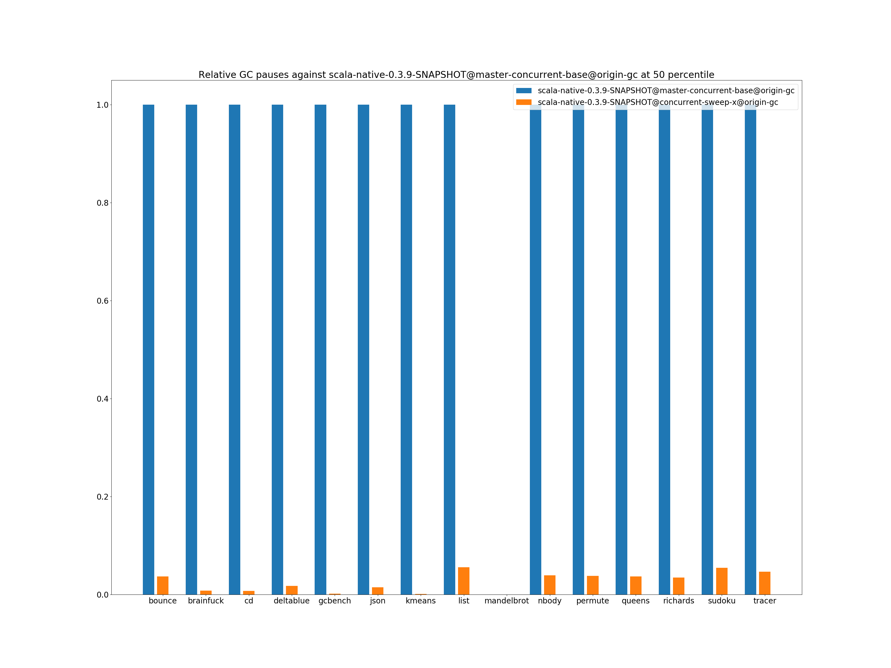
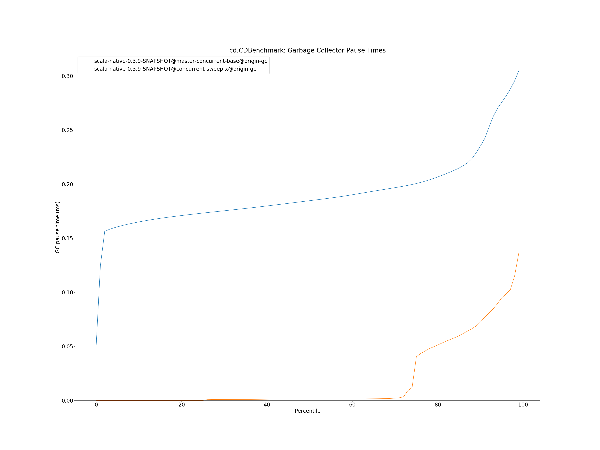
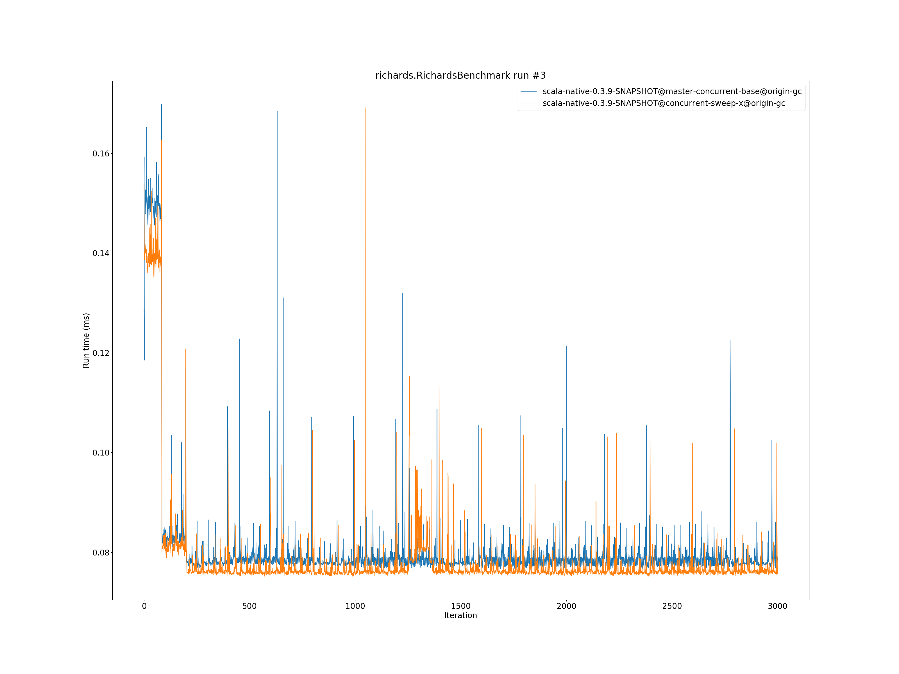

# Summary
## Benchmark run time (ms) at 50 percentile 

|name | scala-native-0.3.9-SNAPSHOT@master-concurrent-base@origin-gc | scala-native-0.3.9-SNAPSHOT@concurrent-sweep-x@origin-gc | |
| -- | -- | -- | -- |
|[bounce.BounceBenchmark](#bouncebouncebenchmark)|0.0532|0.0555|+4.29%|
|[brainfuck.BrainfuckBenchmark](#brainfuckbrainfuckbenchmark)|3.4564|3.3707|__-2.48%__|
|[cd.CDBenchmark](#cdcdbenchmark)|32.0159|32.1093|+0.29%|
|[deltablue.DeltaBlueBenchmark](#deltabluedeltabluebenchmark)|0.1881|0.1928|+2.47%|
|[gcbench.GCBenchBenchmark](#gcbenchgcbenchbenchmark)|133.3344|133.9728|+0.48%|
|[json.JsonBenchmark](#jsonjsonbenchmark)|1.6509|1.6159|__-2.12%__|
|[kmeans.KmeansBenchmark](#kmeanskmeansbenchmark)|54.6604|54.4824|__-0.33%__|
|[list.ListBenchmark](#listlistbenchmark)|0.0548|0.0659|+20.13%|
|[mandelbrot.MandelbrotBenchmark](#mandelbrotmandelbrotbenchmark)|126.0898|126.0987|+0.01%|
|[nbody.NbodyBenchmark](#nbodynbodybenchmark)|39.4732|39.5366|+0.16%|
|[permute.PermuteBenchmark](#permutepermutebenchmark)|0.2028|0.2191|+8.02%|
|[queens.QueensBenchmark](#queensqueensbenchmark)|0.1140|0.1160|+1.80%|
|[richards.RichardsBenchmark](#richardsrichardsbenchmark)|0.0787|0.0763|__-3.03%__|
|[sudoku.SudokuBenchmark](#sudokusudokubenchmark)|2.4173|2.4333|+0.66%|
|[tracer.TracerBenchmark](#tracertracerbenchmark)|0.7499|0.7728|+3.05%|
| __Geometrical mean:__|| |+2.09%|
## Benchmark run time (ms) at 90 percentile 

|name | scala-native-0.3.9-SNAPSHOT@master-concurrent-base@origin-gc | scala-native-0.3.9-SNAPSHOT@concurrent-sweep-x@origin-gc | |
| -- | -- | -- | -- |
|[bounce.BounceBenchmark](#bouncebouncebenchmark)|0.0536|0.0558|+4.01%|
|[brainfuck.BrainfuckBenchmark](#brainfuckbrainfuckbenchmark)|3.5168|3.4645|__-1.49%__|
|[cd.CDBenchmark](#cdcdbenchmark)|32.6043|32.3691|__-0.72%__|
|[deltablue.DeltaBlueBenchmark](#deltabluedeltabluebenchmark)|0.1955|0.1992|+1.87%|
|[gcbench.GCBenchBenchmark](#gcbenchgcbenchbenchmark)|136.9870|136.5485|__-0.32%__|
|[json.JsonBenchmark](#jsonjsonbenchmark)|1.6779|1.6936|+0.94%|
|[kmeans.KmeansBenchmark](#kmeanskmeansbenchmark)|56.8927|56.3014|__-1.04%__|
|[list.ListBenchmark](#listlistbenchmark)|0.0566|0.0682|+20.47%|
|[mandelbrot.MandelbrotBenchmark](#mandelbrotmandelbrotbenchmark)|126.8120|126.7927|__-0.02%__|
|[nbody.NbodyBenchmark](#nbodynbodybenchmark)|40.1658|39.9578|__-0.52%__|
|[permute.PermuteBenchmark](#permutepermutebenchmark)|0.2143|0.2286|+6.64%|
|[queens.QueensBenchmark](#queensqueensbenchmark)|0.1176|0.1181|+0.41%|
|[richards.RichardsBenchmark](#richardsrichardsbenchmark)|0.0818|0.0788|__-3.75%__|
|[sudoku.SudokuBenchmark](#sudokusudokubenchmark)|2.6220|2.4969|__-4.77%__|
|[tracer.TracerBenchmark](#tracertracerbenchmark)|0.7716|0.7990|+3.55%|
| __Geometrical mean:__|| |+1.53%|
## Benchmark run time (ms) at 99 percentile 

|name | scala-native-0.3.9-SNAPSHOT@master-concurrent-base@origin-gc | scala-native-0.3.9-SNAPSHOT@concurrent-sweep-x@origin-gc | |
| -- | -- | -- | -- |
|[bounce.BounceBenchmark](#bouncebouncebenchmark)|0.0565|0.0587|+3.97%|
|[brainfuck.BrainfuckBenchmark](#brainfuckbrainfuckbenchmark)|3.6743|3.5705|__-2.83%__|
|[cd.CDBenchmark](#cdcdbenchmark)|33.4444|32.9589|__-1.45%__|
|[deltablue.DeltaBlueBenchmark](#deltabluedeltabluebenchmark)|0.2577|0.2687|+4.25%|
|[gcbench.GCBenchBenchmark](#gcbenchgcbenchbenchmark)|138.7733|139.1153|+0.25%|
|[json.JsonBenchmark](#jsonjsonbenchmark)|1.7612|1.8315|+3.99%|
|[kmeans.KmeansBenchmark](#kmeanskmeansbenchmark)|58.8480|57.8578|__-1.68%__|
|[list.ListBenchmark](#listlistbenchmark)|0.0590|0.0708|+20.13%|
|[mandelbrot.MandelbrotBenchmark](#mandelbrotmandelbrotbenchmark)|128.7928|128.7653|__-0.02%__|
|[nbody.NbodyBenchmark](#nbodynbodybenchmark)|41.6149|41.3199|__-0.71%__|
|[permute.PermuteBenchmark](#permutepermutebenchmark)|0.2348|0.2684|+14.30%|
|[queens.QueensBenchmark](#queensqueensbenchmark)|0.1243|0.1275|+2.59%|
|[richards.RichardsBenchmark](#richardsrichardsbenchmark)|0.0918|0.0898|__-2.22%__|
|[sudoku.SudokuBenchmark](#sudokusudokubenchmark)|2.7546|2.6150|__-5.07%__|
|[tracer.TracerBenchmark](#tracertracerbenchmark)|0.8103|0.8838|+9.06%|
| __Geometrical mean:__|| |+2.77%|
## Benchmark total run time (ms) 

|name | scala-native-0.3.9-SNAPSHOT@master-concurrent-base@origin-gc | scala-native-0.3.9-SNAPSHOT@concurrent-sweep-x@origin-gc | |
| -- | -- | -- | -- |
|[bounce.BounceBenchmark](#bouncebouncebenchmark)|1069.1015|1114.2465|+4.22%|
|[brainfuck.BrainfuckBenchmark](#brainfuckbrainfuckbenchmark)|68535.7002|67820.9615|__-1.04%__|
|[cd.CDBenchmark](#cdcdbenchmark)|642517.3699|642987.1302|+0.07%|
|[deltablue.DeltaBlueBenchmark](#deltabluedeltabluebenchmark)|3846.9008|3935.0037|+2.29%|
|[gcbench.GCBenchBenchmark](#gcbenchgcbenchbenchmark)|2651021.9654|2605792.0683|__-1.71%__|
|[json.JsonBenchmark](#jsonjsonbenchmark)|32691.6019|32700.4909|+0.03%|
|[kmeans.KmeansBenchmark](#kmeanskmeansbenchmark)|1090491.7006|1085765.2111|__-0.43%__|
|[list.ListBenchmark](#listlistbenchmark)|1108.3710|1330.5093|+20.04%|
|[mandelbrot.MandelbrotBenchmark](#mandelbrotmandelbrotbenchmark)|2526043.9684|2526118.3323|+0.00%|
|[nbody.NbodyBenchmark](#nbodynbodybenchmark)|792535.4011|792749.2487|+0.03%|
|[permute.PermuteBenchmark](#permutepermutebenchmark)|4122.0768|4456.8111|+8.12%|
|[queens.QueensBenchmark](#queensqueensbenchmark)|2298.9204|2333.3823|+1.50%|
|[richards.RichardsBenchmark](#richardsrichardsbenchmark)|1587.8358|1543.3619|__-2.80%__|
|[sudoku.SudokuBenchmark](#sudokusudokubenchmark)|49181.5634|48914.2487|__-0.54%__|
|[tracer.TracerBenchmark](#tracertracerbenchmark)|14983.9113|15396.0396|+2.75%|
| __Geometrical mean:__|| |+2.03%|
## Total GC time on Application thread (ms) 

|name |  | scala-native-0.3.9-SNAPSHOT@master-concurrent-base@origin-gc | scala-native-0.3.9-SNAPSHOT@concurrent-sweep-x@origin-gc | |
| -- | -- | -- | -- | -- |
|[bounce.BounceBenchmark](#bouncebouncebenchmark)|mark|1.7394|1.6722|__-3.86%__|
||sweep|1.4444|0.1410|__-90.24%__|
||total|3.1838|1.8133|__-43.05%__|
|[brainfuck.BrainfuckBenchmark](#brainfuckbrainfuckbenchmark)|mark|2981.8161|3376.3843|+13.23%|
||sweep|938.6748|177.2167|__-81.12%__|
||total|3920.4908|3553.6009|__-9.36%__|
|[cd.CDBenchmark](#cdcdbenchmark)|mark|18841.2678|18370.1153|__-2.50%__|
||sweep|26441.0059|837.7812|__-96.83%__|
||total|45282.2737|19207.8965|__-57.58%__|
|[deltablue.DeltaBlueBenchmark](#deltabluedeltabluebenchmark)|mark|111.6066|96.9632|__-13.12%__|
||sweep|38.9022|3.7284|__-90.42%__|
||total|150.5088|100.6916|__-33.10%__|
|[gcbench.GCBenchBenchmark](#gcbenchgcbenchbenchmark)|mark|1856817.6615|1935268.1801|+4.22%|
||sweep|228657.5814|12791.2881|__-94.41%__|
||total|2085475.2429|1948059.4682|__-6.59%__|
|[json.JsonBenchmark](#jsonjsonbenchmark)|mark|1483.9046|1632.1659|+9.99%|
||sweep|522.5402|126.8740|__-75.72%__|
||total|2006.4448|1759.0399|__-12.33%__|
|[kmeans.KmeansBenchmark](#kmeanskmeansbenchmark)|mark|78461.8126|92377.2040|+17.74%|
||sweep|13903.4853|736.3727|__-94.70%__|
||total|92365.2980|93113.5767|+0.81%|
|[list.ListBenchmark](#listlistbenchmark)|mark|0.4831|0.4980|+3.09%|
||sweep|0.3150|0.1044|__-66.85%__|
||total|0.7981|0.6025|__-24.51%__|
|[mandelbrot.MandelbrotBenchmark](#mandelbrotmandelbrotbenchmark)|mark|0.0000|0.0000|N/A|
||sweep|0.0000|0.0000|N/A|
||total|0.0000|0.0000|N/A|
|[nbody.NbodyBenchmark](#nbodynbodybenchmark)|mark|1028.6022|1186.6269|+15.36%|
||sweep|1625.2079|120.2021|__-92.60%__|
||total|2653.8101|1306.8290|__-50.76%__|
|[permute.PermuteBenchmark](#permutepermutebenchmark)|mark|44.9398|42.5810|__-5.25%__|
||sweep|54.0087|6.6453|__-87.70%__|
||total|98.9485|49.2263|__-50.25%__|
|[queens.QueensBenchmark](#queensqueensbenchmark)|mark|2.9422|3.0331|+3.09%|
||sweep|2.5301|0.2229|__-91.19%__|
||total|5.4723|3.2559|__-40.50%__|
|[richards.RichardsBenchmark](#richardsrichardsbenchmark)|mark|4.2147|4.0965|__-2.81%__|
||sweep|4.1873|0.3237|__-92.27%__|
||total|8.4020|4.4201|__-47.39%__|
|[sudoku.SudokuBenchmark](#sudokusudokubenchmark)|mark|740.8834|869.2728|+17.33%|
||sweep|493.1625|278.6928|__-43.49%__|
||total|1234.0459|1147.9656|__-6.98%__|
|[tracer.TracerBenchmark](#tracertracerbenchmark)|mark|505.2561|560.4131|+10.92%|
||sweep|578.4200|302.2382|__-47.75%__|
||total|1083.6761|862.6513|__-20.40%__|
|__Geometrical mean:__|mark|| |+4.41%|
||sweep|| |__-87.44%__|
||total|| |__-31.33%__|
## GC pause time (ms) at 50 percentile 

|name | scala-native-0.3.9-SNAPSHOT@master-concurrent-base@origin-gc | scala-native-0.3.9-SNAPSHOT@concurrent-sweep-x@origin-gc | |
| -- | -- | -- | -- |
|[bounce.BounceBenchmark](#bouncebouncebenchmark)|0.0307|0.0011|__-96.31%__|
|[brainfuck.BrainfuckBenchmark](#brainfuckbrainfuckbenchmark)|0.1284|0.0010|__-99.20%__|
|[cd.CDBenchmark](#cdcdbenchmark)|0.1847|0.0014|__-99.26%__|
|[deltablue.DeltaBlueBenchmark](#deltabluedeltabluebenchmark)|0.0557|0.0010|__-98.23%__|
|[gcbench.GCBenchBenchmark](#gcbenchgcbenchbenchmark)|3.6894|0.0059|__-99.84%__|
|[json.JsonBenchmark](#jsonjsonbenchmark)|0.0666|0.0010|__-98.54%__|
|[kmeans.KmeansBenchmark](#kmeanskmeansbenchmark)|2.6665|0.0030|__-99.89%__|
|[list.ListBenchmark](#listlistbenchmark)|0.0391|0.0022|__-94.44%__|
|[mandelbrot.MandelbrotBenchmark](#mandelbrotmandelbrotbenchmark)|0.0000|0.0000|N/A|
|[nbody.NbodyBenchmark](#nbodynbodybenchmark)|0.0222|0.0009|__-96.08%__|
|[permute.PermuteBenchmark](#permutepermutebenchmark)|0.0246|0.0009|__-96.21%__|
|[queens.QueensBenchmark](#queensqueensbenchmark)|0.0292|0.0011|__-96.33%__|
|[richards.RichardsBenchmark](#richardsrichardsbenchmark)|0.0272|0.0009|__-96.55%__|
|[sudoku.SudokuBenchmark](#sudokusudokubenchmark)|0.1988|0.0108|__-94.55%__|
|[tracer.TracerBenchmark](#tracertracerbenchmark)|0.0258|0.0012|__-95.33%__|
| __Geometrical mean:__|| |__-98.24%__|
## GC pause time (ms) at 90 percentile 

|name | scala-native-0.3.9-SNAPSHOT@master-concurrent-base@origin-gc | scala-native-0.3.9-SNAPSHOT@concurrent-sweep-x@origin-gc | |
| -- | -- | -- | -- |
|[bounce.BounceBenchmark](#bouncebouncebenchmark)|0.0374|0.0178|__-52.49%__|
|[brainfuck.BrainfuckBenchmark](#brainfuckbrainfuckbenchmark)|0.1330|0.0500|__-62.40%__|
|[cd.CDBenchmark](#cdcdbenchmark)|0.2352|0.0725|__-69.16%__|
|[deltablue.DeltaBlueBenchmark](#deltabluedeltabluebenchmark)|0.0706|0.0448|__-36.52%__|
|[gcbench.GCBenchBenchmark](#gcbenchgcbenchbenchmark)|4.9069|3.3335|__-32.07%__|
|[json.JsonBenchmark](#jsonjsonbenchmark)|0.0695|0.0529|__-23.84%__|
|[kmeans.KmeansBenchmark](#kmeanskmeansbenchmark)|4.2400|3.3115|__-21.90%__|
|[list.ListBenchmark](#listlistbenchmark)|0.0416|0.0247|__-40.72%__|
|[mandelbrot.MandelbrotBenchmark](#mandelbrotmandelbrotbenchmark)|0.0000|0.0000|N/A|
|[nbody.NbodyBenchmark](#nbodynbodybenchmark)|0.0247|0.0106|__-56.94%__|
|[permute.PermuteBenchmark](#permutepermutebenchmark)|0.0274|0.0111|__-59.62%__|
|[queens.QueensBenchmark](#queensqueensbenchmark)|0.0382|0.0166|__-56.48%__|
|[richards.RichardsBenchmark](#richardsrichardsbenchmark)|0.0308|0.0141|__-54.20%__|
|[sudoku.SudokuBenchmark](#sudokusudokubenchmark)|0.2180|0.1381|__-36.64%__|
|[tracer.TracerBenchmark](#tracertracerbenchmark)|0.0276|0.0137|__-50.31%__|
| __Geometrical mean:__|| |__-48.54%__|
## GC pause time (ms) at 99 percentile 

|name | scala-native-0.3.9-SNAPSHOT@master-concurrent-base@origin-gc | scala-native-0.3.9-SNAPSHOT@concurrent-sweep-x@origin-gc | |
| -- | -- | -- | -- |
|[bounce.BounceBenchmark](#bouncebouncebenchmark)|0.0410|0.0243|__-40.75%__|
|[brainfuck.BrainfuckBenchmark](#brainfuckbrainfuckbenchmark)|0.1472|0.0885|__-39.89%__|
|[cd.CDBenchmark](#cdcdbenchmark)|0.3050|0.1366|__-55.21%__|
|[deltablue.DeltaBlueBenchmark](#deltabluedeltabluebenchmark)|0.0889|0.0577|__-35.13%__|
|[gcbench.GCBenchBenchmark](#gcbenchgcbenchbenchmark)|8.2953|8.4218|+1.52%|
|[json.JsonBenchmark](#jsonjsonbenchmark)|0.0753|0.1580|+109.96%|
|[kmeans.KmeansBenchmark](#kmeanskmeansbenchmark)|5.3671|3.6237|__-32.48%__|
|[list.ListBenchmark](#listlistbenchmark)|0.0476|0.0308|__-35.31%__|
|[mandelbrot.MandelbrotBenchmark](#mandelbrotmandelbrotbenchmark)|0.0000|0.0000|N/A|
|[nbody.NbodyBenchmark](#nbodynbodybenchmark)|0.0279|0.0128|__-54.25%__|
|[permute.PermuteBenchmark](#permutepermutebenchmark)|0.0358|0.0155|__-56.71%__|
|[queens.QueensBenchmark](#queensqueensbenchmark)|0.0431|0.0262|__-39.26%__|
|[richards.RichardsBenchmark](#richardsrichardsbenchmark)|0.0386|0.0223|__-42.22%__|
|[sudoku.SudokuBenchmark](#sudokusudokubenchmark)|0.2658|0.1533|__-42.32%__|
|[tracer.TracerBenchmark](#tracertracerbenchmark)|0.0313|0.0157|__-49.79%__|
| __Geometrical mean:__|| |__-35.99%__|
# Individual benchmarks
## bounce.BounceBenchmark

## brainfuck.BrainfuckBenchmark

## cd.CDBenchmark

## deltablue.DeltaBlueBenchmark

## gcbench.GCBenchBenchmark

## json.JsonBenchmark

## kmeans.KmeansBenchmark

## list.ListBenchmark

## mandelbrot.MandelbrotBenchmark

## nbody.NbodyBenchmark

## permute.PermuteBenchmark

## queens.QueensBenchmark

## richards.RichardsBenchmark

## sudoku.SudokuBenchmark

## tracer.TracerBenchmark

