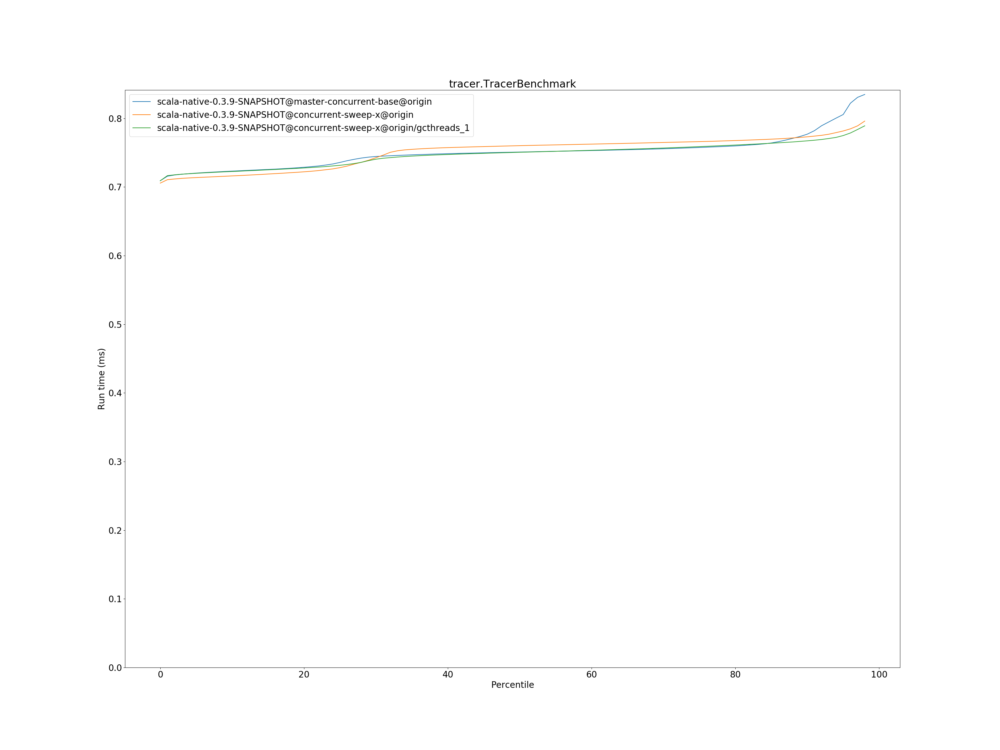

# Summary
## Benchmark run time (ms) at 50 percentile 

|name | scala-native-0.3.9-SNAPSHOT@master-concurrent-base@origin | scala-native-0.3.9-SNAPSHOT@concurrent-sweep-x@origin |  | scala-native-0.3.9-SNAPSHOT@concurrent-sweep-x@origin/gcthreads_1 | |
| -- | -- | -- | -- | -- | -- |
|[bounce.BounceBenchmark](#bouncebouncebenchmark)|0.0588|0.0596|+1.35%|0.0590|+0.28%|
|[brainfuck.BrainfuckBenchmark](#brainfuckbrainfuckbenchmark)|3.3759|3.5061|+3.86%|3.4522|+2.26%|
|[cd.CDBenchmark](#cdcdbenchmark)|32.7898|32.1803|__-1.86%__|32.0743|__-2.18%__|
|[deltablue.DeltaBlueBenchmark](#deltabluedeltabluebenchmark)|0.1823|0.1837|+0.75%|0.1913|+4.89%|
|[gcbench.GCBenchBenchmark](#gcbenchgcbenchbenchmark)|132.9232|132.0282|__-0.67%__|133.6332|+0.53%|
|[json.JsonBenchmark](#jsonjsonbenchmark)|1.6521|1.6775|+1.53%|1.6311|__-1.27%__|
|[kmeans.KmeansBenchmark](#kmeanskmeansbenchmark)|53.9548|57.7373|+7.01%|54.3306|+0.70%|
|[list.ListBenchmark](#listlistbenchmark)|0.0548|0.0660|+20.42%|0.0659|+20.12%|
|[mandelbrot.MandelbrotBenchmark](#mandelbrotmandelbrotbenchmark)|126.0747|126.1025|+0.02%|126.0530|__-0.02%__|
|[nbody.NbodyBenchmark](#nbodynbodybenchmark)|39.4352|39.4395|+0.01%|39.4110|__-0.06%__|
|[permute.PermuteBenchmark](#permutepermutebenchmark)|0.2027|0.2346|+15.74%|0.2045|+0.89%|
|[queens.QueensBenchmark](#queensqueensbenchmark)|0.1155|0.1178|+1.98%|0.1161|+0.50%|
|[richards.RichardsBenchmark](#richardsrichardsbenchmark)|0.0769|0.0772|+0.46%|0.0761|__-0.99%__|
|[sudoku.SudokuBenchmark](#sudokusudokubenchmark)|2.4286|2.4539|+1.04%|2.3935|__-1.45%__|
|[tracer.TracerBenchmark](#tracertracerbenchmark)|0.7508|0.7601|+1.24%|0.7505|__-0.04%__|
| __Geometrical mean:__|| |+3.36%| |+1.49%|
## Benchmark run time (ms) at 90 percentile 

|name | scala-native-0.3.9-SNAPSHOT@master-concurrent-base@origin | scala-native-0.3.9-SNAPSHOT@concurrent-sweep-x@origin |  | scala-native-0.3.9-SNAPSHOT@concurrent-sweep-x@origin/gcthreads_1 | |
| -- | -- | -- | -- | -- | -- |
|[bounce.BounceBenchmark](#bouncebouncebenchmark)|0.0605|0.0600|__-0.89%__|0.0597|__-1.32%__|
|[brainfuck.BrainfuckBenchmark](#brainfuckbrainfuckbenchmark)|3.4634|3.6019|+4.00%|3.5475|+2.43%|
|[cd.CDBenchmark](#cdcdbenchmark)|33.3898|32.4447|__-2.83%__|32.5037|__-2.65%__|
|[deltablue.DeltaBlueBenchmark](#deltabluedeltabluebenchmark)|0.1924|0.1904|__-1.01%__|0.1970|+2.39%|
|[gcbench.GCBenchBenchmark](#gcbenchgcbenchbenchmark)|135.6477|135.2432|__-0.30%__|135.1950|__-0.33%__|
|[json.JsonBenchmark](#jsonjsonbenchmark)|1.6739|1.7002|+1.57%|1.6597|__-0.85%__|
|[kmeans.KmeansBenchmark](#kmeanskmeansbenchmark)|56.3564|60.0588|+6.57%|56.3772|+0.04%|
|[list.ListBenchmark](#listlistbenchmark)|0.0563|0.0678|+20.49%|0.0678|+20.47%|
|[mandelbrot.MandelbrotBenchmark](#mandelbrotmandelbrotbenchmark)|126.7456|126.7892|+0.03%|126.7087|__-0.03%__|
|[nbody.NbodyBenchmark](#nbodynbodybenchmark)|40.2439|39.9279|__-0.79%__|40.3637|+0.30%|
|[permute.PermuteBenchmark](#permutepermutebenchmark)|0.2269|0.2756|+21.43%|0.2450|+7.97%|
|[queens.QueensBenchmark](#queensqueensbenchmark)|0.1188|0.1198|+0.78%|0.1190|+0.15%|
|[richards.RichardsBenchmark](#richardsrichardsbenchmark)|0.0799|0.0791|__-1.07%__|0.0788|__-1.46%__|
|[sudoku.SudokuBenchmark](#sudokusudokubenchmark)|2.6249|2.5648|__-2.29%__|2.5011|__-4.72%__|
|[tracer.TracerBenchmark](#tracertracerbenchmark)|0.7768|0.7730|__-0.49%__|0.7672|__-1.25%__|
| __Geometrical mean:__|| |+2.77%| |+1.26%|
## Benchmark run time (ms) at 99 percentile 

|name | scala-native-0.3.9-SNAPSHOT@master-concurrent-base@origin | scala-native-0.3.9-SNAPSHOT@concurrent-sweep-x@origin |  | scala-native-0.3.9-SNAPSHOT@concurrent-sweep-x@origin/gcthreads_1 | |
| -- | -- | -- | -- | -- | -- |
|[bounce.BounceBenchmark](#bouncebouncebenchmark)|0.0626|0.0635|+1.44%|0.0628|+0.35%|
|[brainfuck.BrainfuckBenchmark](#brainfuckbrainfuckbenchmark)|3.5840|3.7250|+3.93%|3.6614|+2.16%|
|[cd.CDBenchmark](#cdcdbenchmark)|34.2258|33.0002|__-3.58%__|33.0872|__-3.33%__|
|[deltablue.DeltaBlueBenchmark](#deltabluedeltabluebenchmark)|0.2633|0.2663|+1.15%|0.2656|+0.87%|
|[gcbench.GCBenchBenchmark](#gcbenchgcbenchbenchmark)|136.9762|136.2672|__-0.52%__|136.6375|__-0.25%__|
|[json.JsonBenchmark](#jsonjsonbenchmark)|1.7575|1.7627|+0.29%|1.7136|__-2.50%__|
|[kmeans.KmeansBenchmark](#kmeanskmeansbenchmark)|58.3701|62.1929|+6.55%|58.2517|__-0.20%__|
|[list.ListBenchmark](#listlistbenchmark)|0.0588|0.0703|+19.47%|0.0707|+20.17%|
|[mandelbrot.MandelbrotBenchmark](#mandelbrotmandelbrotbenchmark)|128.7248|128.6707|__-0.04%__|129.5321|+0.63%|
|[nbody.NbodyBenchmark](#nbodynbodybenchmark)|41.6190|41.4978|__-0.29%__|42.0859|+1.12%|
|[permute.PermuteBenchmark](#permutepermutebenchmark)|0.2392|0.2889|+20.78%|0.2607|+9.00%|
|[queens.QueensBenchmark](#queensqueensbenchmark)|0.1262|0.1279|+1.31%|0.1336|+5.82%|
|[richards.RichardsBenchmark](#richardsrichardsbenchmark)|0.0877|0.0880|+0.35%|0.0876|__-0.11%__|
|[sudoku.SudokuBenchmark](#sudokusudokubenchmark)|2.7182|2.6461|__-2.65%__|2.6040|__-4.20%__|
|[tracer.TracerBenchmark](#tracertracerbenchmark)|0.8415|0.8128|__-3.40%__|0.7977|__-5.20%__|
| __Geometrical mean:__|| |+2.75%| |+1.45%|
## Benchmark total run time (ms) 

|name | scala-native-0.3.9-SNAPSHOT@master-concurrent-base@origin | scala-native-0.3.9-SNAPSHOT@concurrent-sweep-x@origin |  | scala-native-0.3.9-SNAPSHOT@concurrent-sweep-x@origin/gcthreads_1 | |
| -- | -- | -- | -- | -- | -- |
|[bounce.BounceBenchmark](#bouncebouncebenchmark)|1185.2632|1197.7709|+1.06%|1185.1581|__-0.01%__|
|[brainfuck.BrainfuckBenchmark](#brainfuckbrainfuckbenchmark)|67047.1111|70052.8200|+4.48%|68969.2868|+2.87%|
|[cd.CDBenchmark](#cdcdbenchmark)|657757.9143|644420.9810|__-2.03%__|642973.0433|__-2.25%__|
|[deltablue.DeltaBlueBenchmark](#deltabluedeltabluebenchmark)|3744.6118|3764.7475|+0.54%|3900.5121|+4.16%|
|[gcbench.GCBenchBenchmark](#gcbenchgcbenchbenchmark)|2622185.5744|2590812.7705|__-1.20%__|2590064.1096|__-1.22%__|
|[json.JsonBenchmark](#jsonjsonbenchmark)|32669.6568|32951.6833|+0.86%|32225.5379|__-1.36%__|
|[kmeans.KmeansBenchmark](#kmeanskmeansbenchmark)|1077865.6741|1159673.6007|+7.59%|1085278.0167|+0.69%|
|[list.ListBenchmark](#listlistbenchmark)|1106.3288|1328.5362|+20.09%|1329.6959|+20.19%|
|[mandelbrot.MandelbrotBenchmark](#mandelbrotmandelbrotbenchmark)|2525585.6944|2526230.4056|+0.03%|2525700.0753|+0.00%|
|[nbody.NbodyBenchmark](#nbodynbodybenchmark)|792356.6569|791536.2404|__-0.10%__|793268.6431|+0.12%|
|[permute.PermuteBenchmark](#permutepermutebenchmark)|4141.0957|4838.7945|+16.85%|4253.5282|+2.72%|
|[queens.QueensBenchmark](#queensqueensbenchmark)|2329.7301|2368.8580|+1.68%|2339.0580|+0.40%|
|[richards.RichardsBenchmark](#richardsrichardsbenchmark)|1555.5275|1557.8226|+0.15%|1539.1964|__-1.05%__|
|[sudoku.SudokuBenchmark](#sudokusudokubenchmark)|49168.7215|49439.2938|+0.55%|48381.6228|__-1.60%__|
|[tracer.TracerBenchmark](#tracertracerbenchmark)|15044.7692|15045.9352|+0.01%|14961.7786|__-0.55%__|
| __Geometrical mean:__|| |+3.19%| |+1.41%|
# Individual benchmarks
## bounce.BounceBenchmark

## brainfuck.BrainfuckBenchmark

## cd.CDBenchmark

## deltablue.DeltaBlueBenchmark

## gcbench.GCBenchBenchmark

## json.JsonBenchmark

## kmeans.KmeansBenchmark

## list.ListBenchmark

## mandelbrot.MandelbrotBenchmark

## nbody.NbodyBenchmark

## permute.PermuteBenchmark

## queens.QueensBenchmark

## richards.RichardsBenchmark

## sudoku.SudokuBenchmark

## tracer.TracerBenchmark

