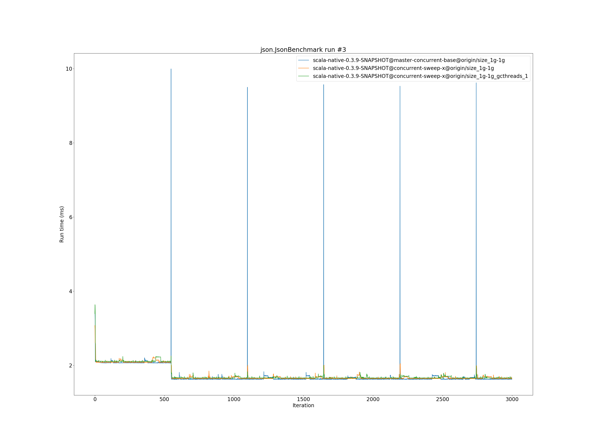

# Summary
## Benchmark run time (ms) at 50 percentile 

|name | scala-native-0.3.9-SNAPSHOT@master-concurrent-base@origin/size_1g-1g | scala-native-0.3.9-SNAPSHOT@concurrent-sweep-x@origin/size_1g-1g |  | scala-native-0.3.9-SNAPSHOT@concurrent-sweep-x@origin/size_1g-1g_gcthreads_1 | |
| -- | -- | -- | -- | -- | -- |
|[bounce.BounceBenchmark](#bouncebouncebenchmark)|0.0608|0.0618|+1.59%|0.0576|__-5.37%__|
|[brainfuck.BrainfuckBenchmark](#brainfuckbrainfuckbenchmark)|3.2888|3.2897|+0.03%|3.3046|+0.48%|
|[cd.CDBenchmark](#cdcdbenchmark)|31.5097|31.5879|+0.25%|31.5965|+0.28%|
|[deltablue.DeltaBlueBenchmark](#deltabluedeltabluebenchmark)|0.2325|0.2344|+0.79%|0.2411|+3.67%|
|[gcbench.GCBenchBenchmark](#gcbenchgcbenchbenchmark)|105.8854|104.9378|__-0.89%__|103.0627|__-2.67%__|
|[json.JsonBenchmark](#jsonjsonbenchmark)|1.6301|1.6466|+1.01%|1.6627|+2.00%|
|[kmeans.KmeansBenchmark](#kmeanskmeansbenchmark)|51.9209|53.2280|+2.52%|51.1721|__-1.44%__|
|[list.ListBenchmark](#listlistbenchmark)|0.0548|0.0667|+21.62%|0.0667|+21.68%|
|[mandelbrot.MandelbrotBenchmark](#mandelbrotmandelbrotbenchmark)|126.1105|126.1169|+0.01%|126.0462|__-0.05%__|
|[nbody.NbodyBenchmark](#nbodynbodybenchmark)|39.3838|39.3984|+0.04%|39.4783|+0.24%|
|[permute.PermuteBenchmark](#permutepermutebenchmark)|0.2762|0.2758|__-0.17%__|0.2770|+0.29%|
|[queens.QueensBenchmark](#queensqueensbenchmark)|0.1204|0.1213|+0.78%|0.1197|__-0.54%__|
|[richards.RichardsBenchmark](#richardsrichardsbenchmark)|0.0949|0.0829|__-12.66%__|0.0812|__-14.43%__|
|[sudoku.SudokuBenchmark](#sudokusudokubenchmark)|2.4403|2.4159|__-1.00%__|2.5710|+5.36%|
|[tracer.TracerBenchmark](#tracertracerbenchmark)|0.8200|0.8253|+0.65%|0.8176|__-0.29%__|
| __Geometrical mean:__|| |+0.77%| |+0.37%|
## Benchmark run time (ms) at 90 percentile 

|name | scala-native-0.3.9-SNAPSHOT@master-concurrent-base@origin/size_1g-1g | scala-native-0.3.9-SNAPSHOT@concurrent-sweep-x@origin/size_1g-1g |  | scala-native-0.3.9-SNAPSHOT@concurrent-sweep-x@origin/size_1g-1g_gcthreads_1 | |
| -- | -- | -- | -- | -- | -- |
|[bounce.BounceBenchmark](#bouncebouncebenchmark)|0.0623|0.0638|+2.41%|0.0592|__-5.01%__|
|[brainfuck.BrainfuckBenchmark](#brainfuckbrainfuckbenchmark)|3.3789|3.3830|+0.12%|3.4030|+0.71%|
|[cd.CDBenchmark](#cdcdbenchmark)|32.7606|32.3357|__-1.30%__|32.3891|__-1.13%__|
|[deltablue.DeltaBlueBenchmark](#deltabluedeltabluebenchmark)|0.2382|0.2404|+0.95%|0.2475|+3.92%|
|[gcbench.GCBenchBenchmark](#gcbenchgcbenchbenchmark)|113.6988|110.5364|__-2.78%__|107.5309|__-5.42%__|
|[json.JsonBenchmark](#jsonjsonbenchmark)|1.6732|1.6904|+1.02%|1.7078|+2.07%|
|[kmeans.KmeansBenchmark](#kmeanskmeansbenchmark)|53.0932|54.4018|+2.46%|52.4791|__-1.16%__|
|[list.ListBenchmark](#listlistbenchmark)|0.0562|0.0681|+21.14%|0.0687|+22.14%|
|[mandelbrot.MandelbrotBenchmark](#mandelbrotmandelbrotbenchmark)|126.8113|126.8389|+0.02%|126.7028|__-0.09%__|
|[nbody.NbodyBenchmark](#nbodynbodybenchmark)|40.2875|40.1663|__-0.30%__|40.4885|+0.50%|
|[permute.PermuteBenchmark](#permutepermutebenchmark)|0.2827|0.2842|+0.54%|0.2859|+1.14%|
|[queens.QueensBenchmark](#queensqueensbenchmark)|0.1228|0.1249|+1.68%|0.1233|+0.41%|
|[richards.RichardsBenchmark](#richardsrichardsbenchmark)|0.0978|0.0855|__-12.61%__|0.0838|__-14.37%__|
|[sudoku.SudokuBenchmark](#sudokusudokubenchmark)|2.5145|3.4848|+38.59%|3.1960|+27.10%|
|[tracer.TracerBenchmark](#tracertracerbenchmark)|0.8439|0.8475|+0.44%|0.8439|+0.00%|
| __Geometrical mean:__|| |+2.94%| |+1.61%|
## Benchmark run time (ms) at 99 percentile 

|name | scala-native-0.3.9-SNAPSHOT@master-concurrent-base@origin/size_1g-1g | scala-native-0.3.9-SNAPSHOT@concurrent-sweep-x@origin/size_1g-1g |  | scala-native-0.3.9-SNAPSHOT@concurrent-sweep-x@origin/size_1g-1g_gcthreads_1 | |
| -- | -- | -- | -- | -- | -- |
|[bounce.BounceBenchmark](#bouncebouncebenchmark)|0.0646|0.0669|+3.45%|0.0612|__-5.25%__|
|[brainfuck.BrainfuckBenchmark](#brainfuckbrainfuckbenchmark)|3.4959|3.5707|+2.14%|3.5889|+2.66%|
|[cd.CDBenchmark](#cdcdbenchmark)|39.6485|34.6108|__-12.71%__|33.2532|__-16.13%__|
|[deltablue.DeltaBlueBenchmark](#deltabluedeltabluebenchmark)|0.2498|0.2513|+0.59%|0.2555|+2.27%|
|[gcbench.GCBenchBenchmark](#gcbenchgcbenchbenchmark)|114.9839|111.8569|__-2.72%__|109.0540|__-5.16%__|
|[json.JsonBenchmark](#jsonjsonbenchmark)|1.7300|1.8086|+4.55%|1.7621|+1.86%|
|[kmeans.KmeansBenchmark](#kmeanskmeansbenchmark)|61.7564|57.4474|__-6.98%__|55.1583|__-10.68%__|
|[list.ListBenchmark](#listlistbenchmark)|0.0580|0.0701|+20.90%|0.0714|+23.04%|
|[mandelbrot.MandelbrotBenchmark](#mandelbrotmandelbrotbenchmark)|128.8678|128.9043|+0.03%|129.5541|+0.53%|
|[nbody.NbodyBenchmark](#nbodynbodybenchmark)|41.8785|41.5918|__-0.68%__|41.7115|__-0.40%__|
|[permute.PermuteBenchmark](#permutepermutebenchmark)|0.2978|0.3311|+11.16%|0.3119|+4.72%|
|[queens.QueensBenchmark](#queensqueensbenchmark)|0.1272|0.1294|+1.75%|0.1283|+0.84%|
|[richards.RichardsBenchmark](#richardsrichardsbenchmark)|0.1031|0.0917|__-11.07%__|0.0902|__-12.50%__|
|[sudoku.SudokuBenchmark](#sudokusudokubenchmark)|2.6030|3.6218|+39.14%|3.4081|+30.93%|
|[tracer.TracerBenchmark](#tracertracerbenchmark)|0.8840|1.5824|+79.01%|1.0802|+22.20%|
| __Geometrical mean:__|| |+6.69%| |+1.82%|
## Benchmark total run time (ms) 

|name | scala-native-0.3.9-SNAPSHOT@master-concurrent-base@origin/size_1g-1g | scala-native-0.3.9-SNAPSHOT@concurrent-sweep-x@origin/size_1g-1g |  | scala-native-0.3.9-SNAPSHOT@concurrent-sweep-x@origin/size_1g-1g_gcthreads_1 | |
| -- | -- | -- | -- | -- | -- |
|[bounce.BounceBenchmark](#bouncebouncebenchmark)|1220.6745|1242.9024|+1.82%|1155.1394|__-5.37%__|
|[brainfuck.BrainfuckBenchmark](#brainfuckbrainfuckbenchmark)|66786.5276|66326.6002|__-0.69%__|66637.0484|__-0.22%__|
|[cd.CDBenchmark](#cdcdbenchmark)|644172.7054|636781.5131|__-1.15%__|635920.2065|__-1.28%__|
|[deltablue.DeltaBlueBenchmark](#deltabluedeltabluebenchmark)|4678.7621|4712.0955|+0.71%|4852.4126|+3.71%|
|[gcbench.GCBenchBenchmark](#gcbenchgcbenchbenchmark)|2098783.9745|2073736.6634|__-1.19%__|2032051.4976|__-3.18%__|
|[json.JsonBenchmark](#jsonjsonbenchmark)|33089.1696|33155.5011|+0.20%|33469.3731|+1.15%|
|[kmeans.KmeansBenchmark](#kmeanskmeansbenchmark)|1046185.1819|1069597.5293|+2.24%|1028956.3730|__-1.65%__|
|[list.ListBenchmark](#listlistbenchmark)|1105.2728|1335.6586|+20.84%|1339.3170|+21.18%|
|[mandelbrot.MandelbrotBenchmark](#mandelbrotmandelbrotbenchmark)|2526501.5316|2526699.1351|+0.01%|2525674.7790|__-0.03%__|
|[nbody.NbodyBenchmark](#nbodynbodybenchmark)|793053.0000|791640.8170|__-0.18%__|793770.5971|+0.09%|
|[permute.PermuteBenchmark](#permutepermutebenchmark)|5553.1130|5586.9780|+0.61%|5600.9096|+0.86%|
|[queens.QueensBenchmark](#queensqueensbenchmark)|2409.7053|2439.2448|+1.23%|2410.0428|+0.01%|
|[richards.RichardsBenchmark](#richardsrichardsbenchmark)|1910.2981|1669.1545|__-12.62%__|1634.4940|__-14.44%__|
|[sudoku.SudokuBenchmark](#sudokusudokubenchmark)|49323.4374|50645.4070|+2.68%|53053.6470|+7.56%|
|[tracer.TracerBenchmark](#tracertracerbenchmark)|16944.2481|16785.1375|__-0.94%__|16543.4508|__-2.37%__|
| __Geometrical mean:__|| |+0.71%| |+0.15%|
# Individual benchmarks
## bounce.BounceBenchmark

## brainfuck.BrainfuckBenchmark

## cd.CDBenchmark

## deltablue.DeltaBlueBenchmark

## gcbench.GCBenchBenchmark

## json.JsonBenchmark

## kmeans.KmeansBenchmark

## list.ListBenchmark

## mandelbrot.MandelbrotBenchmark

## nbody.NbodyBenchmark

## permute.PermuteBenchmark

## queens.QueensBenchmark

## richards.RichardsBenchmark

## sudoku.SudokuBenchmark

## tracer.TracerBenchmark

