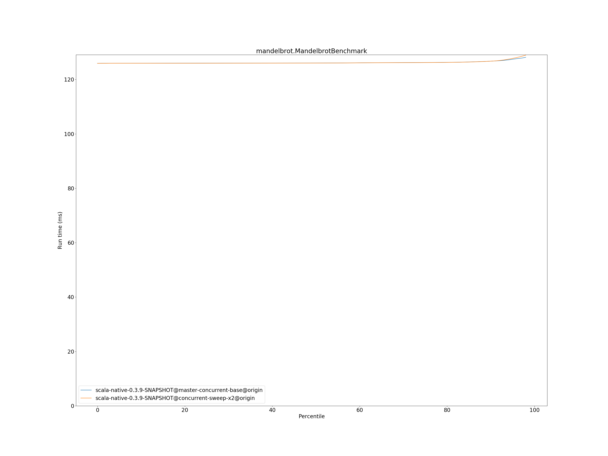
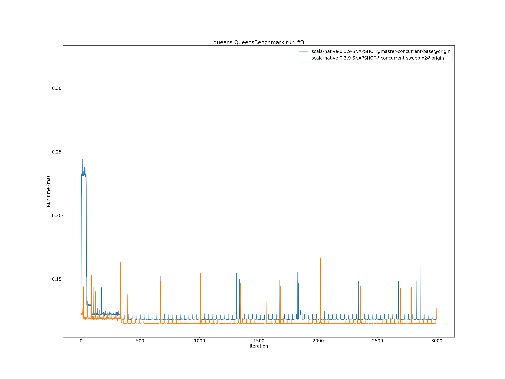

# Summary
## Benchmark run time (ms) at 50 percentile 

|name | scala-native-0.3.9-SNAPSHOT@master-concurrent-base@origin | scala-native-0.3.9-SNAPSHOT@concurrent-sweep-x2@origin | |
| -- | -- | -- | -- |
|[bounce.BounceBenchmark](#bouncebouncebenchmark)|0.0588|0.0554|__-5.77%__|
|[brainfuck.BrainfuckBenchmark](#brainfuckbrainfuckbenchmark)|3.3759|3.4607|+2.51%|
|[cd.CDBenchmark](#cdcdbenchmark)|32.7898|32.6947|__-0.29%__|
|[deltablue.DeltaBlueBenchmark](#deltabluedeltabluebenchmark)|0.1823|0.1919|+5.22%|
|[gcbench.GCBenchBenchmark](#gcbenchgcbenchbenchmark)|132.9232|134.0417|+0.84%|
|[json.JsonBenchmark](#jsonjsonbenchmark)|1.6521|1.6443|__-0.47%__|
|[kmeans.KmeansBenchmark](#kmeanskmeansbenchmark)|53.9548|54.3386|+0.71%|
|[list.ListBenchmark](#listlistbenchmark)|0.0548|0.0676|+23.35%|
|[mandelbrot.MandelbrotBenchmark](#mandelbrotmandelbrotbenchmark)|126.0747|126.0452|__-0.02%__|
|[nbody.NbodyBenchmark](#nbodynbodybenchmark)|39.4352|39.4976|+0.16%|
|[permute.PermuteBenchmark](#permutepermutebenchmark)|0.2027|0.2197|+8.38%|
|[queens.QueensBenchmark](#queensqueensbenchmark)|0.1155|0.1157|+0.19%|
|[richards.RichardsBenchmark](#richardsrichardsbenchmark)|0.0769|0.0759|__-1.32%__|
|[sudoku.SudokuBenchmark](#sudokusudokubenchmark)|2.4286|2.4282|__-0.02%__|
|[tracer.TracerBenchmark](#tracertracerbenchmark)|0.7508|0.7686|+2.37%|
| __Geometrical mean:__|| |+2.21%|
## Benchmark run time (ms) at 90 percentile 

|name | scala-native-0.3.9-SNAPSHOT@master-concurrent-base@origin | scala-native-0.3.9-SNAPSHOT@concurrent-sweep-x2@origin | |
| -- | -- | -- | -- |
|[bounce.BounceBenchmark](#bouncebouncebenchmark)|0.0605|0.0557|__-7.88%__|
|[brainfuck.BrainfuckBenchmark](#brainfuckbrainfuckbenchmark)|3.4634|3.5526|+2.57%|
|[cd.CDBenchmark](#cdcdbenchmark)|33.3898|32.9318|__-1.37%__|
|[deltablue.DeltaBlueBenchmark](#deltabluedeltabluebenchmark)|0.1924|0.1973|+2.54%|
|[gcbench.GCBenchBenchmark](#gcbenchgcbenchbenchmark)|135.6477|135.1963|__-0.33%__|
|[json.JsonBenchmark](#jsonjsonbenchmark)|1.6739|1.6698|__-0.24%__|
|[kmeans.KmeansBenchmark](#kmeanskmeansbenchmark)|56.3564|56.3140|__-0.08%__|
|[list.ListBenchmark](#listlistbenchmark)|0.0563|0.0690|+22.59%|
|[mandelbrot.MandelbrotBenchmark](#mandelbrotmandelbrotbenchmark)|126.7456|126.7460|+0.00%|
|[nbody.NbodyBenchmark](#nbodynbodybenchmark)|40.2439|39.8551|__-0.97%__|
|[permute.PermuteBenchmark](#permutepermutebenchmark)|0.2269|0.2278|+0.37%|
|[queens.QueensBenchmark](#queensqueensbenchmark)|0.1188|0.1190|+0.12%|
|[richards.RichardsBenchmark](#richardsrichardsbenchmark)|0.0799|0.0786|__-1.69%__|
|[sudoku.SudokuBenchmark](#sudokusudokubenchmark)|2.6249|2.5526|__-2.76%__|
|[tracer.TracerBenchmark](#tracertracerbenchmark)|0.7768|0.7803|+0.44%|
| __Geometrical mean:__|| |+0.71%|
## Benchmark run time (ms) at 99 percentile 

|name | scala-native-0.3.9-SNAPSHOT@master-concurrent-base@origin | scala-native-0.3.9-SNAPSHOT@concurrent-sweep-x2@origin | |
| -- | -- | -- | -- |
|[bounce.BounceBenchmark](#bouncebouncebenchmark)|0.0626|0.0588|__-6.01%__|
|[brainfuck.BrainfuckBenchmark](#brainfuckbrainfuckbenchmark)|3.5840|3.6609|+2.14%|
|[cd.CDBenchmark](#cdcdbenchmark)|34.2258|33.5148|__-2.08%__|
|[deltablue.DeltaBlueBenchmark](#deltabluedeltabluebenchmark)|0.2633|0.2750|+4.47%|
|[gcbench.GCBenchBenchmark](#gcbenchgcbenchbenchmark)|136.9762|136.0655|__-0.66%__|
|[json.JsonBenchmark](#jsonjsonbenchmark)|1.7575|1.7209|__-2.08%__|
|[kmeans.KmeansBenchmark](#kmeanskmeansbenchmark)|58.3701|58.1689|__-0.34%__|
|[list.ListBenchmark](#listlistbenchmark)|0.0588|0.0737|+25.22%|
|[mandelbrot.MandelbrotBenchmark](#mandelbrotmandelbrotbenchmark)|128.7248|129.5739|+0.66%|
|[nbody.NbodyBenchmark](#nbodynbodybenchmark)|41.6190|41.2587|__-0.87%__|
|[permute.PermuteBenchmark](#permutepermutebenchmark)|0.2392|0.2576|+7.67%|
|[queens.QueensBenchmark](#queensqueensbenchmark)|0.1262|0.1255|__-0.60%__|
|[richards.RichardsBenchmark](#richardsrichardsbenchmark)|0.0877|0.0877|__-0.09%__|
|[sudoku.SudokuBenchmark](#sudokusudokubenchmark)|2.7182|2.6153|__-3.79%__|
|[tracer.TracerBenchmark](#tracertracerbenchmark)|0.8415|0.8105|__-3.68%__|
| __Geometrical mean:__|| |+1.10%|
## Benchmark total run time (ms) 

|name | scala-native-0.3.9-SNAPSHOT@master-concurrent-base@origin | scala-native-0.3.9-SNAPSHOT@concurrent-sweep-x2@origin | |
| -- | -- | -- | -- |
|[bounce.BounceBenchmark](#bouncebouncebenchmark)|1185.2632|1113.9396|__-6.02%__|
|[brainfuck.BrainfuckBenchmark](#brainfuckbrainfuckbenchmark)|67047.1111|69033.6221|+2.96%|
|[cd.CDBenchmark](#cdcdbenchmark)|657757.9143|654623.9080|__-0.48%__|
|[deltablue.DeltaBlueBenchmark](#deltabluedeltabluebenchmark)|3744.6118|3922.5921|+4.75%|
|[gcbench.GCBenchBenchmark](#gcbenchgcbenchbenchmark)|2622185.5744|2590569.3922|__-1.21%__|
|[json.JsonBenchmark](#jsonjsonbenchmark)|32669.6568|32354.1266|__-0.97%__|
|[kmeans.KmeansBenchmark](#kmeanskmeansbenchmark)|1077865.6741|1085970.9664|+0.75%|
|[list.ListBenchmark](#listlistbenchmark)|1106.3288|1359.2827|+22.86%|
|[mandelbrot.MandelbrotBenchmark](#mandelbrotmandelbrotbenchmark)|2525585.6944|2525901.0644|+0.01%|
|[nbody.NbodyBenchmark](#nbodynbodybenchmark)|792356.6569|791797.5066|__-0.07%__|
|[permute.PermuteBenchmark](#permutepermutebenchmark)|4141.0957|4454.6723|+7.57%|
|[queens.QueensBenchmark](#queensqueensbenchmark)|2329.7301|2327.8388|__-0.08%__|
|[richards.RichardsBenchmark](#richardsrichardsbenchmark)|1555.5275|1535.4042|__-1.29%__|
|[sudoku.SudokuBenchmark](#sudokusudokubenchmark)|49168.7215|48931.2730|__-0.48%__|
|[tracer.TracerBenchmark](#tracertracerbenchmark)|15044.7692|15210.7235|+1.10%|
| __Geometrical mean:__|| |+1.78%|
# Individual benchmarks
## bounce.BounceBenchmark

## brainfuck.BrainfuckBenchmark

## cd.CDBenchmark

## deltablue.DeltaBlueBenchmark

## gcbench.GCBenchBenchmark

## json.JsonBenchmark

## kmeans.KmeansBenchmark

## list.ListBenchmark

## mandelbrot.MandelbrotBenchmark

## nbody.NbodyBenchmark

## permute.PermuteBenchmark

## queens.QueensBenchmark

## richards.RichardsBenchmark

## sudoku.SudokuBenchmark

## tracer.TracerBenchmark

