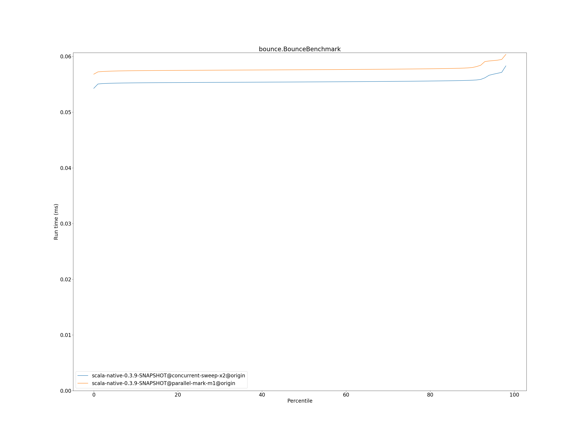

# Summary
## Benchmark run time (ms) at 50 percentile 

|name | scala-native-0.3.9-SNAPSHOT@concurrent-sweep-x2@origin | scala-native-0.3.9-SNAPSHOT@parallel-mark-m1@origin | |
| -- | -- | -- | -- |
|[bounce.BounceBenchmark](#bouncebouncebenchmark)|0.0554|0.0576|+3.96%|
|[list.ListBenchmark](#listlistbenchmark)|0.0676|0.0662|__-2.12%__|
|[richards.RichardsBenchmark](#richardsrichardsbenchmark)|0.0759|0.0801|+5.56%|
|[queens.QueensBenchmark](#queensqueensbenchmark)|0.1157|0.1145|__-1.12%__|
|[permute.PermuteBenchmark](#permutepermutebenchmark)|0.2197|0.2170|__-1.24%__|
|[deltablue.DeltaBlueBenchmark](#deltabluedeltabluebenchmark)|0.1919|0.1819|__-5.22%__|
|[tracer.TracerBenchmark](#tracertracerbenchmark)|0.7686|0.7615|__-0.93%__|
|[brainfuck.BrainfuckBenchmark](#brainfuckbrainfuckbenchmark)|3.4607|3.3705|__-2.61%__|
|[json.JsonBenchmark](#jsonjsonbenchmark)|1.6443|1.6802|+2.19%|
|[cd.CDBenchmark](#cdcdbenchmark)|32.6947|32.7525|+0.18%|
|[kmeans.KmeansBenchmark](#kmeanskmeansbenchmark)|54.3386|53.6434|__-1.28%__|
|[gcbench.GCBenchBenchmark](#gcbenchgcbenchbenchmark)|134.0417|120.5729|__-10.05%__|
|[mandelbrot.MandelbrotBenchmark](#mandelbrotmandelbrotbenchmark)|126.0452|0.0000|__-100.00%__|
|[nbody.NbodyBenchmark](#nbodynbodybenchmark)|39.4976|0.0000|__-100.00%__|
|[sudoku.SudokuBenchmark](#sudokusudokubenchmark)|2.4282|0.0000|__-100.00%__|
| __Geometrical mean:__|| |__-1.14%__|
## Benchmark run time (ms) at 90 percentile 

|name | scala-native-0.3.9-SNAPSHOT@concurrent-sweep-x2@origin | scala-native-0.3.9-SNAPSHOT@parallel-mark-m1@origin | |
| -- | -- | -- | -- |
|[bounce.BounceBenchmark](#bouncebouncebenchmark)|0.0557|0.0580|+4.08%|
|[list.ListBenchmark](#listlistbenchmark)|0.0690|0.0680|__-1.49%__|
|[richards.RichardsBenchmark](#richardsrichardsbenchmark)|0.0786|0.0824|+4.88%|
|[queens.QueensBenchmark](#queensqueensbenchmark)|0.1190|0.1160|__-2.51%__|
|[permute.PermuteBenchmark](#permutepermutebenchmark)|0.2278|0.2505|+9.96%|
|[deltablue.DeltaBlueBenchmark](#deltabluedeltabluebenchmark)|0.1973|0.1875|__-4.97%__|
|[tracer.TracerBenchmark](#tracertracerbenchmark)|0.7803|0.7774|__-0.37%__|
|[brainfuck.BrainfuckBenchmark](#brainfuckbrainfuckbenchmark)|3.5526|3.5310|__-0.61%__|
|[json.JsonBenchmark](#jsonjsonbenchmark)|1.6698|1.6939|+1.44%|
|[cd.CDBenchmark](#cdcdbenchmark)|32.9318|32.9895|+0.18%|
|[kmeans.KmeansBenchmark](#kmeanskmeansbenchmark)|56.3140|54.7845|__-2.72%__|
|[gcbench.GCBenchBenchmark](#gcbenchgcbenchbenchmark)|135.1963|124.1904|__-8.14%__|
|[mandelbrot.MandelbrotBenchmark](#mandelbrotmandelbrotbenchmark)|126.7460|0.0000|__-100.00%__|
|[nbody.NbodyBenchmark](#nbodynbodybenchmark)|39.8551|0.0000|__-100.00%__|
|[sudoku.SudokuBenchmark](#sudokusudokubenchmark)|2.5526|0.0000|__-100.00%__|
| __Geometrical mean:__|| |__-0.12%__|
## Benchmark run time (ms) at 99 percentile 

|name | scala-native-0.3.9-SNAPSHOT@concurrent-sweep-x2@origin | scala-native-0.3.9-SNAPSHOT@parallel-mark-m1@origin | |
| -- | -- | -- | -- |
|[bounce.BounceBenchmark](#bouncebouncebenchmark)|0.0588|0.0610|+3.68%|
|[list.ListBenchmark](#listlistbenchmark)|0.0737|0.0704|__-4.47%__|
|[richards.RichardsBenchmark](#richardsrichardsbenchmark)|0.0877|0.0920|+4.92%|
|[queens.QueensBenchmark](#queensqueensbenchmark)|0.1255|0.1240|__-1.18%__|
|[permute.PermuteBenchmark](#permutepermutebenchmark)|0.2576|0.2620|+1.73%|
|[deltablue.DeltaBlueBenchmark](#deltabluedeltabluebenchmark)|0.2750|0.2654|__-3.51%__|
|[tracer.TracerBenchmark](#tracertracerbenchmark)|0.8105|0.8221|+1.43%|
|[brainfuck.BrainfuckBenchmark](#brainfuckbrainfuckbenchmark)|3.6609|3.6925|+0.86%|
|[json.JsonBenchmark](#jsonjsonbenchmark)|1.7209|1.7507|+1.73%|
|[cd.CDBenchmark](#cdcdbenchmark)|33.5148|33.5519|+0.11%|
|[kmeans.KmeansBenchmark](#kmeanskmeansbenchmark)|58.1689|56.1120|__-3.54%__|
|[gcbench.GCBenchBenchmark](#gcbenchgcbenchbenchmark)|136.0655|126.4930|__-7.04%__|
|[mandelbrot.MandelbrotBenchmark](#mandelbrotmandelbrotbenchmark)|129.5739|0.0000|__-100.00%__|
|[nbody.NbodyBenchmark](#nbodynbodybenchmark)|41.2587|0.0000|__-100.00%__|
|[sudoku.SudokuBenchmark](#sudokusudokubenchmark)|2.6153|0.0000|__-100.00%__|
| __Geometrical mean:__|| |__-0.50%__|
## Benchmark total run time (ms) 

|name | scala-native-0.3.9-SNAPSHOT@concurrent-sweep-x2@origin | scala-native-0.3.9-SNAPSHOT@parallel-mark-m1@origin | |
| -- | -- | -- | -- |
|[bounce.BounceBenchmark](#bouncebouncebenchmark)|1113.9396|1157.1858|+3.88%|
|[list.ListBenchmark](#listlistbenchmark)|1359.2827|1333.7469|__-1.88%__|
|[richards.RichardsBenchmark](#richardsrichardsbenchmark)|1535.4042|1616.6523|+5.29%|
|[queens.QueensBenchmark](#queensqueensbenchmark)|2327.8388|2299.7787|__-1.21%__|
|[permute.PermuteBenchmark](#permutepermutebenchmark)|4454.6723|4436.7060|__-0.40%__|
|[deltablue.DeltaBlueBenchmark](#deltabluedeltabluebenchmark)|3922.5921|3720.7345|__-5.15%__|
|[tracer.TracerBenchmark](#tracertracerbenchmark)|15210.7235|15125.6728|__-0.56%__|
|[brainfuck.BrainfuckBenchmark](#brainfuckbrainfuckbenchmark)|69033.6221|68087.7829|__-1.37%__|
|[json.JsonBenchmark](#jsonjsonbenchmark)|32354.1266|32888.2730|+1.65%|
|[cd.CDBenchmark](#cdcdbenchmark)|654623.9080|655800.7624|+0.18%|
|[kmeans.KmeansBenchmark](#kmeanskmeansbenchmark)|1085970.9664|1069766.6515|__-1.49%__|
|[gcbench.GCBenchBenchmark](#gcbenchgcbenchbenchmark)|2590569.3922|836597.2485|__-67.71%__|
|[mandelbrot.MandelbrotBenchmark](#mandelbrotmandelbrotbenchmark)|2525901.0644|0.0000|__-100.00%__|
|[nbody.NbodyBenchmark](#nbodynbodybenchmark)|791797.5066|0.0000|__-100.00%__|
|[sudoku.SudokuBenchmark](#sudokusudokubenchmark)|48931.2730|0.0000|__-100.00%__|
| __Geometrical mean:__|| |__-9.10%__|
# Individual benchmarks
## bounce.BounceBenchmark

## list.ListBenchmark

## richards.RichardsBenchmark

## queens.QueensBenchmark

## permute.PermuteBenchmark

## deltablue.DeltaBlueBenchmark

## tracer.TracerBenchmark

## brainfuck.BrainfuckBenchmark

## json.JsonBenchmark

## cd.CDBenchmark

## kmeans.KmeansBenchmark

## gcbench.GCBenchBenchmark

## mandelbrot.MandelbrotBenchmark

## nbody.NbodyBenchmark

## sudoku.SudokuBenchmark

