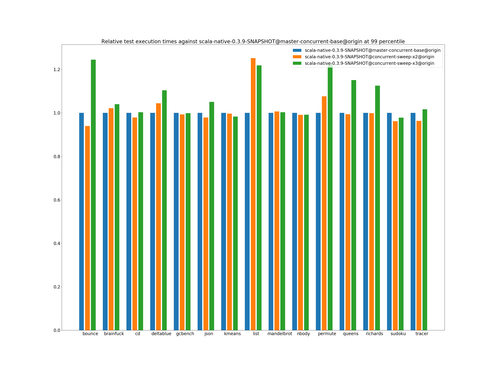
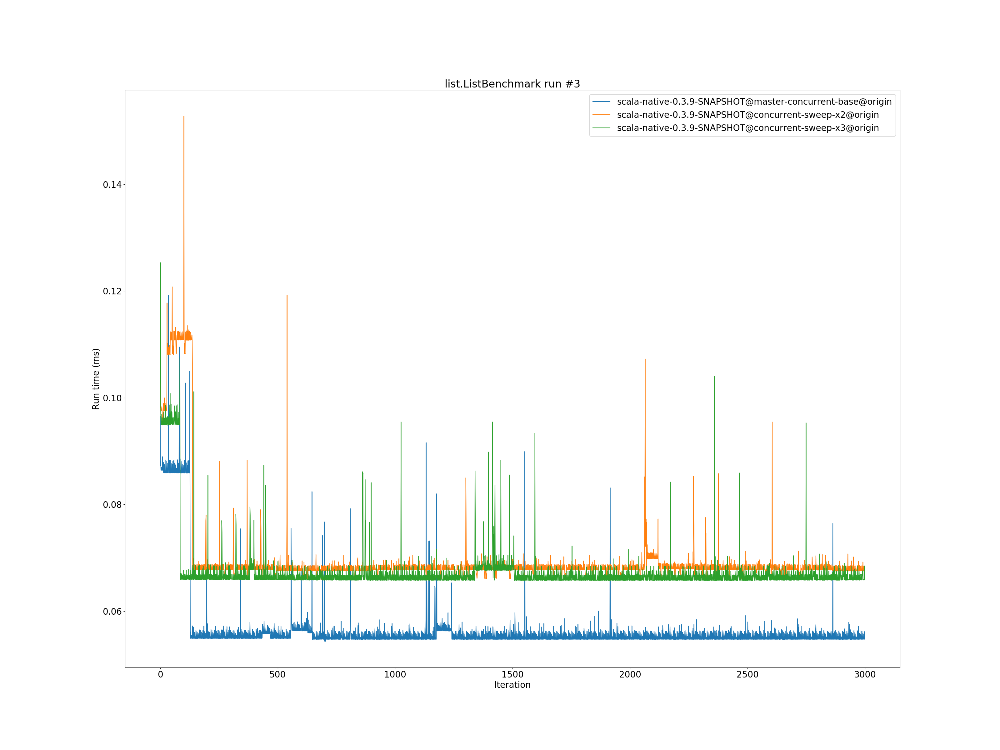

# Summary
## Benchmark run time (ms) at 50 percentile 

|name | scala-native-0.3.9-SNAPSHOT@master-concurrent-base@origin | scala-native-0.3.9-SNAPSHOT@concurrent-sweep-x2@origin |  | scala-native-0.3.9-SNAPSHOT@concurrent-sweep-x3@origin | |
| -- | -- | -- | -- | -- | -- |
|[bounce.BounceBenchmark](#bouncebouncebenchmark)|0.0588|0.0554|__-5.77%__|0.0596|+1.35%|
|[brainfuck.BrainfuckBenchmark](#brainfuckbrainfuckbenchmark)|3.3759|3.4607|+2.51%|3.4629|+2.58%|
|[cd.CDBenchmark](#cdcdbenchmark)|32.7898|32.6947|__-0.29%__|32.7249|__-0.20%__|
|[deltablue.DeltaBlueBenchmark](#deltabluedeltabluebenchmark)|0.1823|0.1919|+5.22%|0.1860|+1.98%|
|[gcbench.GCBenchBenchmark](#gcbenchgcbenchbenchmark)|132.9232|134.0417|+0.84%|133.7054|+0.59%|
|[json.JsonBenchmark](#jsonjsonbenchmark)|1.6521|1.6443|__-0.47%__|1.6878|+2.16%|
|[kmeans.KmeansBenchmark](#kmeanskmeansbenchmark)|53.9548|54.3386|+0.71%|52.6971|__-2.33%__|
|[list.ListBenchmark](#listlistbenchmark)|0.0548|0.0676|+23.35%|0.0663|+20.91%|
|[mandelbrot.MandelbrotBenchmark](#mandelbrotmandelbrotbenchmark)|126.0747|126.0452|__-0.02%__|126.4351|+0.29%|
|[nbody.NbodyBenchmark](#nbodynbodybenchmark)|39.4352|39.4976|+0.16%|39.5229|+0.22%|
|[permute.PermuteBenchmark](#permutepermutebenchmark)|0.2027|0.2197|+8.38%|0.2465|+21.60%|
|[queens.QueensBenchmark](#queensqueensbenchmark)|0.1155|0.1157|+0.19%|0.1173|+1.56%|
|[richards.RichardsBenchmark](#richardsrichardsbenchmark)|0.0769|0.0759|__-1.32%__|0.0804|+4.65%|
|[sudoku.SudokuBenchmark](#sudokusudokubenchmark)|2.4286|2.4282|__-0.02%__|2.4323|+0.15%|
|[tracer.TracerBenchmark](#tracertracerbenchmark)|0.7508|0.7686|+2.37%|0.7625|+1.56%|
| __Geometrical mean:__|| |+2.21%| |+3.59%|
## Benchmark run time (ms) at 90 percentile 

|name | scala-native-0.3.9-SNAPSHOT@master-concurrent-base@origin | scala-native-0.3.9-SNAPSHOT@concurrent-sweep-x2@origin |  | scala-native-0.3.9-SNAPSHOT@concurrent-sweep-x3@origin | |
| -- | -- | -- | -- | -- | -- |
|[bounce.BounceBenchmark](#bouncebouncebenchmark)|0.0605|0.0557|__-7.88%__|0.0613|+1.31%|
|[brainfuck.BrainfuckBenchmark](#brainfuckbrainfuckbenchmark)|3.4634|3.5526|+2.57%|3.5763|+3.26%|
|[cd.CDBenchmark](#cdcdbenchmark)|33.3898|32.9318|__-1.37%__|33.1537|__-0.71%__|
|[deltablue.DeltaBlueBenchmark](#deltabluedeltabluebenchmark)|0.1924|0.1973|+2.54%|0.1942|+0.96%|
|[gcbench.GCBenchBenchmark](#gcbenchgcbenchbenchmark)|135.6477|135.1963|__-0.33%__|135.5601|__-0.06%__|
|[json.JsonBenchmark](#jsonjsonbenchmark)|1.6739|1.6698|__-0.24%__|1.7215|+2.84%|
|[kmeans.KmeansBenchmark](#kmeanskmeansbenchmark)|56.3564|56.3140|__-0.08%__|55.0456|__-2.33%__|
|[list.ListBenchmark](#listlistbenchmark)|0.0563|0.0690|+22.59%|0.0682|+21.16%|
|[mandelbrot.MandelbrotBenchmark](#mandelbrotmandelbrotbenchmark)|126.7456|126.7460|+0.00%|127.3908|+0.51%|
|[nbody.NbodyBenchmark](#nbodynbodybenchmark)|40.2439|39.8551|__-0.97%__|40.0689|__-0.43%__|
|[permute.PermuteBenchmark](#permutepermutebenchmark)|0.2269|0.2278|+0.37%|0.2575|+13.49%|
|[queens.QueensBenchmark](#queensqueensbenchmark)|0.1188|0.1190|+0.12%|0.1197|+0.76%|
|[richards.RichardsBenchmark](#richardsrichardsbenchmark)|0.0799|0.0786|__-1.69%__|0.0826|+3.35%|
|[sudoku.SudokuBenchmark](#sudokusudokubenchmark)|2.6249|2.5526|__-2.76%__|2.5136|__-4.24%__|
|[tracer.TracerBenchmark](#tracertracerbenchmark)|0.7768|0.7803|+0.44%|0.7780|+0.15%|
| __Geometrical mean:__|| |+0.71%| |+2.49%|
## Benchmark run time (ms) at 99 percentile 

|name | scala-native-0.3.9-SNAPSHOT@master-concurrent-base@origin | scala-native-0.3.9-SNAPSHOT@concurrent-sweep-x2@origin |  | scala-native-0.3.9-SNAPSHOT@concurrent-sweep-x3@origin | |
| -- | -- | -- | -- | -- | -- |
|[bounce.BounceBenchmark](#bouncebouncebenchmark)|0.0626|0.0588|__-6.01%__|0.0779|+24.50%|
|[brainfuck.BrainfuckBenchmark](#brainfuckbrainfuckbenchmark)|3.5840|3.6609|+2.14%|3.7271|+3.99%|
|[cd.CDBenchmark](#cdcdbenchmark)|34.2258|33.5148|__-2.08%__|34.3435|+0.34%|
|[deltablue.DeltaBlueBenchmark](#deltabluedeltabluebenchmark)|0.2633|0.2750|+4.47%|0.2907|+10.40%|
|[gcbench.GCBenchBenchmark](#gcbenchgcbenchbenchmark)|136.9762|136.0655|__-0.66%__|136.8260|__-0.11%__|
|[json.JsonBenchmark](#jsonjsonbenchmark)|1.7575|1.7209|__-2.08%__|1.8473|+5.11%|
|[kmeans.KmeansBenchmark](#kmeanskmeansbenchmark)|58.3701|58.1689|__-0.34%__|57.4043|__-1.65%__|
|[list.ListBenchmark](#listlistbenchmark)|0.0588|0.0737|+25.22%|0.0717|+21.90%|
|[mandelbrot.MandelbrotBenchmark](#mandelbrotmandelbrotbenchmark)|128.7248|129.5739|+0.66%|129.1193|+0.31%|
|[nbody.NbodyBenchmark](#nbodynbodybenchmark)|41.6190|41.2587|__-0.87%__|41.2826|__-0.81%__|
|[permute.PermuteBenchmark](#permutepermutebenchmark)|0.2392|0.2576|+7.67%|0.2933|+22.60%|
|[queens.QueensBenchmark](#queensqueensbenchmark)|0.1262|0.1255|__-0.60%__|0.1453|+15.11%|
|[richards.RichardsBenchmark](#richardsrichardsbenchmark)|0.0877|0.0877|__-0.09%__|0.0988|+12.56%|
|[sudoku.SudokuBenchmark](#sudokusudokubenchmark)|2.7182|2.6153|__-3.79%__|2.6590|__-2.18%__|
|[tracer.TracerBenchmark](#tracertracerbenchmark)|0.8415|0.8105|__-3.68%__|0.8556|+1.68%|
| __Geometrical mean:__|| |+1.10%| |+7.20%|
## Benchmark total run time (ms) 

|name | scala-native-0.3.9-SNAPSHOT@master-concurrent-base@origin | scala-native-0.3.9-SNAPSHOT@concurrent-sweep-x2@origin |  | scala-native-0.3.9-SNAPSHOT@concurrent-sweep-x3@origin | |
| -- | -- | -- | -- | -- | -- |
|[bounce.BounceBenchmark](#bouncebouncebenchmark)|1185.2632|1113.9396|__-6.02%__|1206.9885|+1.83%|
|[brainfuck.BrainfuckBenchmark](#brainfuckbrainfuckbenchmark)|67047.1111|69033.6221|+2.96%|69246.9427|+3.28%|
|[cd.CDBenchmark](#cdcdbenchmark)|657757.9143|654623.9080|__-0.48%__|656019.5702|__-0.26%__|
|[deltablue.DeltaBlueBenchmark](#deltabluedeltabluebenchmark)|3744.6118|3922.5921|+4.75%|3836.2543|+2.45%|
|[gcbench.GCBenchBenchmark](#gcbenchgcbenchbenchmark)|2622185.5744|2590569.3922|__-1.21%__|2595815.8119|__-1.01%__|
|[json.JsonBenchmark](#jsonjsonbenchmark)|32669.6568|32354.1266|__-0.97%__|33315.2650|+1.98%|
|[kmeans.KmeansBenchmark](#kmeanskmeansbenchmark)|1077865.6741|1085970.9664|+0.75%|1058502.2553|__-1.80%__|
|[list.ListBenchmark](#listlistbenchmark)|1106.3288|1359.2827|+22.86%|1339.0322|+21.03%|
|[mandelbrot.MandelbrotBenchmark](#mandelbrotmandelbrotbenchmark)|2525585.6944|2525901.0644|+0.01%|2532140.9398|+0.26%|
|[nbody.NbodyBenchmark](#nbodynbodybenchmark)|792356.6569|791797.5066|__-0.07%__|793053.4529|+0.09%|
|[permute.PermuteBenchmark](#permutepermutebenchmark)|4141.0957|4454.6723|+7.57%|5007.7395|+20.93%|
|[queens.QueensBenchmark](#queensqueensbenchmark)|2329.7301|2327.8388|__-0.08%__|2369.0257|+1.69%|
|[richards.RichardsBenchmark](#richardsrichardsbenchmark)|1555.5275|1535.4042|__-1.29%__|1625.5435|+4.50%|
|[sudoku.SudokuBenchmark](#sudokusudokubenchmark)|49168.7215|48931.2730|__-0.48%__|48976.9424|__-0.39%__|
|[tracer.TracerBenchmark](#tracertracerbenchmark)|15044.7692|15210.7235|+1.10%|15162.5979|+0.78%|
| __Geometrical mean:__|| |+1.78%| |+3.47%|
# Individual benchmarks
## bounce.BounceBenchmark

## brainfuck.BrainfuckBenchmark

## cd.CDBenchmark

## deltablue.DeltaBlueBenchmark

## gcbench.GCBenchBenchmark

## json.JsonBenchmark

## kmeans.KmeansBenchmark

## list.ListBenchmark

## mandelbrot.MandelbrotBenchmark

## nbody.NbodyBenchmark

## permute.PermuteBenchmark

## queens.QueensBenchmark

## richards.RichardsBenchmark

## sudoku.SudokuBenchmark

## tracer.TracerBenchmark

