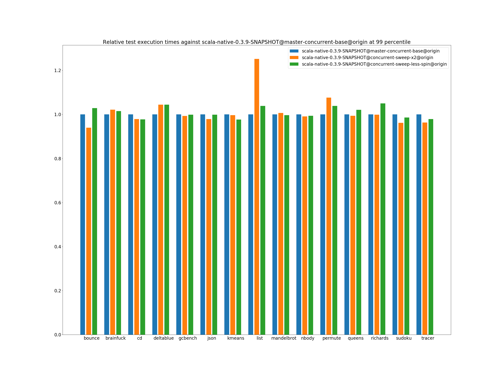
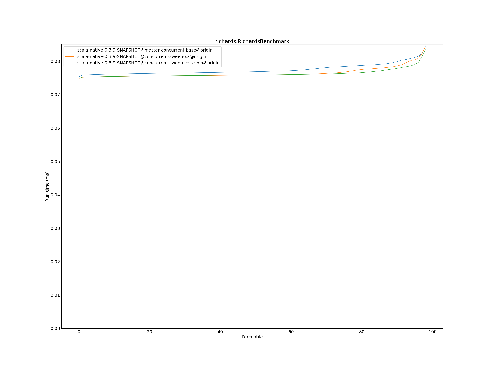
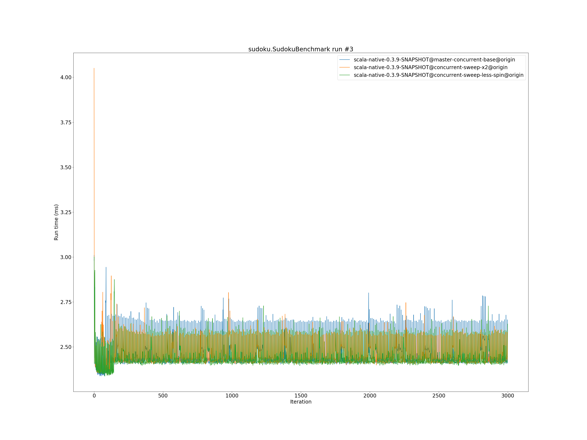
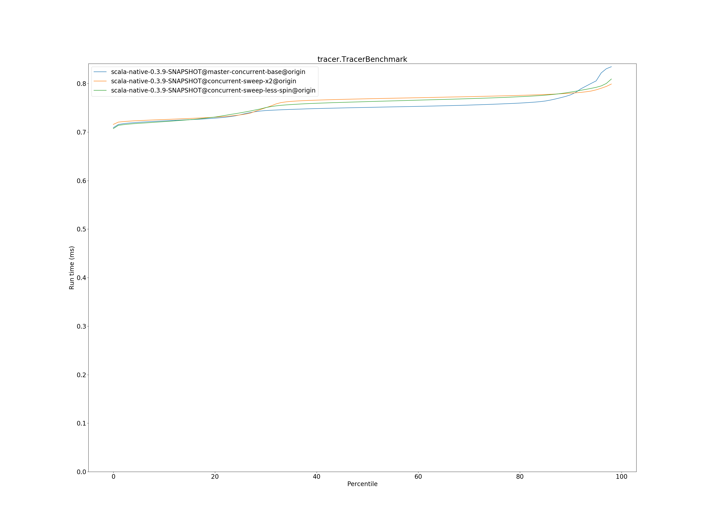

# Summary
## Benchmark run time (ms) at 50 percentile 

|name | scala-native-0.3.9-SNAPSHOT@master-concurrent-base@origin | scala-native-0.3.9-SNAPSHOT@concurrent-sweep-x2@origin |  | scala-native-0.3.9-SNAPSHOT@concurrent-sweep-less-spin@origin | |
| -- | -- | -- | -- | -- | -- |
|[bounce.BounceBenchmark](#bouncebouncebenchmark)|0.0588|0.0554|__-5.77%__|0.0557|__-5.28%__|
|[brainfuck.BrainfuckBenchmark](#brainfuckbrainfuckbenchmark)|3.3759|3.4607|+2.51%|3.3792|+0.10%|
|[cd.CDBenchmark](#cdcdbenchmark)|32.7898|32.6947|__-0.29%__|32.6216|__-0.51%__|
|[deltablue.DeltaBlueBenchmark](#deltabluedeltabluebenchmark)|0.1823|0.1919|+5.22%|0.1894|+3.85%|
|[gcbench.GCBenchBenchmark](#gcbenchgcbenchbenchmark)|132.9232|134.0417|+0.84%|125.3137|__-5.72%__|
|[json.JsonBenchmark](#jsonjsonbenchmark)|1.6521|1.6443|__-0.47%__|1.6705|+1.11%|
|[kmeans.KmeansBenchmark](#kmeanskmeansbenchmark)|53.9548|54.3386|+0.71%|53.0411|__-1.69%__|
|[list.ListBenchmark](#listlistbenchmark)|0.0548|0.0676|+23.35%|0.0568|+3.63%|
|[mandelbrot.MandelbrotBenchmark](#mandelbrotmandelbrotbenchmark)|126.0747|126.0452|__-0.02%__|126.2098|+0.11%|
|[nbody.NbodyBenchmark](#nbodynbodybenchmark)|39.4352|39.4976|+0.16%|39.4847|+0.13%|
|[permute.PermuteBenchmark](#permutepermutebenchmark)|0.2027|0.2197|+8.38%|0.2033|+0.31%|
|[queens.QueensBenchmark](#queensqueensbenchmark)|0.1155|0.1157|+0.19%|0.1159|+0.32%|
|[richards.RichardsBenchmark](#richardsrichardsbenchmark)|0.0769|0.0759|__-1.32%__|0.0759|__-1.28%__|
|[sudoku.SudokuBenchmark](#sudokusudokubenchmark)|2.4286|2.4282|__-0.02%__|2.4253|__-0.14%__|
|[tracer.TracerBenchmark](#tracertracerbenchmark)|0.7508|0.7686|+2.37%|0.7628|+1.59%|
| __Geometrical mean:__|| |+2.21%| |__-0.26%__|
## Benchmark run time (ms) at 90 percentile 

|name | scala-native-0.3.9-SNAPSHOT@master-concurrent-base@origin | scala-native-0.3.9-SNAPSHOT@concurrent-sweep-x2@origin |  | scala-native-0.3.9-SNAPSHOT@concurrent-sweep-less-spin@origin | |
| -- | -- | -- | -- | -- | -- |
|[bounce.BounceBenchmark](#bouncebouncebenchmark)|0.0605|0.0557|__-7.88%__|0.0571|__-5.59%__|
|[brainfuck.BrainfuckBenchmark](#brainfuckbrainfuckbenchmark)|3.4634|3.5526|+2.57%|3.4926|+0.84%|
|[cd.CDBenchmark](#cdcdbenchmark)|33.3898|32.9318|__-1.37%__|32.8819|__-1.52%__|
|[deltablue.DeltaBlueBenchmark](#deltabluedeltabluebenchmark)|0.1924|0.1973|+2.54%|0.1955|+1.62%|
|[gcbench.GCBenchBenchmark](#gcbenchgcbenchbenchmark)|135.6477|135.1963|__-0.33%__|135.9508|+0.22%|
|[json.JsonBenchmark](#jsonjsonbenchmark)|1.6739|1.6698|__-0.24%__|1.6974|+1.40%|
|[kmeans.KmeansBenchmark](#kmeanskmeansbenchmark)|56.3564|56.3140|__-0.08%__|55.0031|__-2.40%__|
|[list.ListBenchmark](#listlistbenchmark)|0.0563|0.0690|+22.59%|0.0583|+3.61%|
|[mandelbrot.MandelbrotBenchmark](#mandelbrotmandelbrotbenchmark)|126.7456|126.7460|+0.00%|126.9277|+0.14%|
|[nbody.NbodyBenchmark](#nbodynbodybenchmark)|40.2439|39.8551|__-0.97%__|39.9130|__-0.82%__|
|[permute.PermuteBenchmark](#permutepermutebenchmark)|0.2269|0.2278|+0.37%|0.2260|__-0.42%__|
|[queens.QueensBenchmark](#queensqueensbenchmark)|0.1188|0.1190|+0.12%|0.1195|+0.59%|
|[richards.RichardsBenchmark](#richardsrichardsbenchmark)|0.0799|0.0786|__-1.69%__|0.0779|__-2.57%__|
|[sudoku.SudokuBenchmark](#sudokusudokubenchmark)|2.6249|2.5526|__-2.76%__|2.5690|__-2.13%__|
|[tracer.TracerBenchmark](#tracertracerbenchmark)|0.7768|0.7803|+0.44%|0.7825|+0.73%|
| __Geometrical mean:__|| |+0.71%| |__-0.44%__|
## Benchmark run time (ms) at 99 percentile 

|name | scala-native-0.3.9-SNAPSHOT@master-concurrent-base@origin | scala-native-0.3.9-SNAPSHOT@concurrent-sweep-x2@origin |  | scala-native-0.3.9-SNAPSHOT@concurrent-sweep-less-spin@origin | |
| -- | -- | -- | -- | -- | -- |
|[bounce.BounceBenchmark](#bouncebouncebenchmark)|0.0626|0.0588|__-6.01%__|0.0644|+2.88%|
|[brainfuck.BrainfuckBenchmark](#brainfuckbrainfuckbenchmark)|3.5840|3.6609|+2.14%|3.6378|+1.50%|
|[cd.CDBenchmark](#cdcdbenchmark)|34.2258|33.5148|__-2.08%__|33.4669|__-2.22%__|
|[deltablue.DeltaBlueBenchmark](#deltabluedeltabluebenchmark)|0.2633|0.2750|+4.47%|0.2749|+4.41%|
|[gcbench.GCBenchBenchmark](#gcbenchgcbenchbenchmark)|136.9762|136.0655|__-0.66%__|136.8159|__-0.12%__|
|[json.JsonBenchmark](#jsonjsonbenchmark)|1.7575|1.7209|__-2.08%__|1.7559|__-0.09%__|
|[kmeans.KmeansBenchmark](#kmeanskmeansbenchmark)|58.3701|58.1689|__-0.34%__|57.0161|__-2.32%__|
|[list.ListBenchmark](#listlistbenchmark)|0.0588|0.0737|+25.22%|0.0611|+3.90%|
|[mandelbrot.MandelbrotBenchmark](#mandelbrotmandelbrotbenchmark)|128.7248|129.5739|+0.66%|128.2803|__-0.35%__|
|[nbody.NbodyBenchmark](#nbodynbodybenchmark)|41.6190|41.2587|__-0.87%__|41.3535|__-0.64%__|
|[permute.PermuteBenchmark](#permutepermutebenchmark)|0.2392|0.2576|+7.67%|0.2484|+3.86%|
|[queens.QueensBenchmark](#queensqueensbenchmark)|0.1262|0.1255|__-0.60%__|0.1288|+2.06%|
|[richards.RichardsBenchmark](#richardsrichardsbenchmark)|0.0877|0.0877|__-0.09%__|0.0922|+5.05%|
|[sudoku.SudokuBenchmark](#sudokusudokubenchmark)|2.7182|2.6153|__-3.79%__|2.6809|__-1.37%__|
|[tracer.TracerBenchmark](#tracertracerbenchmark)|0.8415|0.8105|__-3.68%__|0.8239|__-2.09%__|
| __Geometrical mean:__|| |+1.10%| |+0.93%|
## Benchmark total run time (ms) 

|name | scala-native-0.3.9-SNAPSHOT@master-concurrent-base@origin | scala-native-0.3.9-SNAPSHOT@concurrent-sweep-x2@origin |  | scala-native-0.3.9-SNAPSHOT@concurrent-sweep-less-spin@origin | |
| -- | -- | -- | -- | -- | -- |
|[bounce.BounceBenchmark](#bouncebouncebenchmark)|1185.2632|1113.9396|__-6.02%__|1122.1638|__-5.32%__|
|[brainfuck.BrainfuckBenchmark](#brainfuckbrainfuckbenchmark)|67047.1111|69033.6221|+2.96%|40540.2646|__-39.53%__|
|[cd.CDBenchmark](#cdcdbenchmark)|657757.9143|654623.9080|__-0.48%__|653253.4045|__-0.68%__|
|[deltablue.DeltaBlueBenchmark](#deltabluedeltabluebenchmark)|3744.6118|3922.5921|+4.75%|3880.8355|+3.64%|
|[gcbench.GCBenchBenchmark](#gcbenchgcbenchbenchmark)|2622185.5744|2590569.3922|__-1.21%__|2569053.2074|__-2.03%__|
|[json.JsonBenchmark](#jsonjsonbenchmark)|32669.6568|32354.1266|__-0.97%__|32823.3011|+0.47%|
|[kmeans.KmeansBenchmark](#kmeanskmeansbenchmark)|1077865.6741|1085970.9664|+0.75%|53085.1398|__-95.07%__|
|[list.ListBenchmark](#listlistbenchmark)|1106.3288|1359.2827|+22.86%|1145.0563|+3.50%|
|[mandelbrot.MandelbrotBenchmark](#mandelbrotmandelbrotbenchmark)|2525585.6944|2525901.0644|+0.01%|2527654.1686|+0.08%|
|[nbody.NbodyBenchmark](#nbodynbodybenchmark)|792356.6569|791797.5066|__-0.07%__|792000.2713|__-0.04%__|
|[permute.PermuteBenchmark](#permutepermutebenchmark)|4141.0957|4454.6723|+7.57%|4154.5788|+0.33%|
|[queens.QueensBenchmark](#queensqueensbenchmark)|2329.7301|2327.8388|__-0.08%__|2333.8441|+0.18%|
|[richards.RichardsBenchmark](#richardsrichardsbenchmark)|1555.5275|1535.4042|__-1.29%__|1532.0402|__-1.51%__|
|[sudoku.SudokuBenchmark](#sudokusudokubenchmark)|49168.7215|48931.2730|__-0.48%__|49176.2219|+0.02%|
|[tracer.TracerBenchmark](#tracertracerbenchmark)|15044.7692|15210.7235|+1.10%|15163.3918|+0.79%|
| __Geometrical mean:__|| |+1.78%| |__-20.93%__|
# Individual benchmarks
## bounce.BounceBenchmark

## brainfuck.BrainfuckBenchmark

## cd.CDBenchmark

## deltablue.DeltaBlueBenchmark

## gcbench.GCBenchBenchmark

## json.JsonBenchmark

## kmeans.KmeansBenchmark

## list.ListBenchmark

## mandelbrot.MandelbrotBenchmark

## nbody.NbodyBenchmark

## permute.PermuteBenchmark

## queens.QueensBenchmark

## richards.RichardsBenchmark

## sudoku.SudokuBenchmark

## tracer.TracerBenchmark

