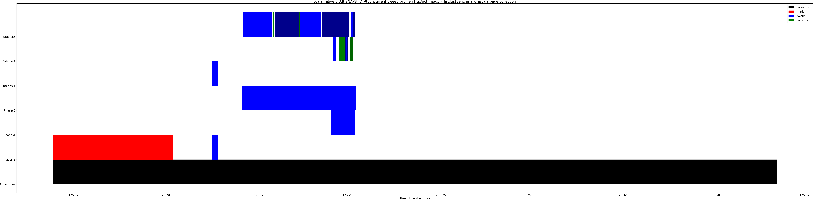
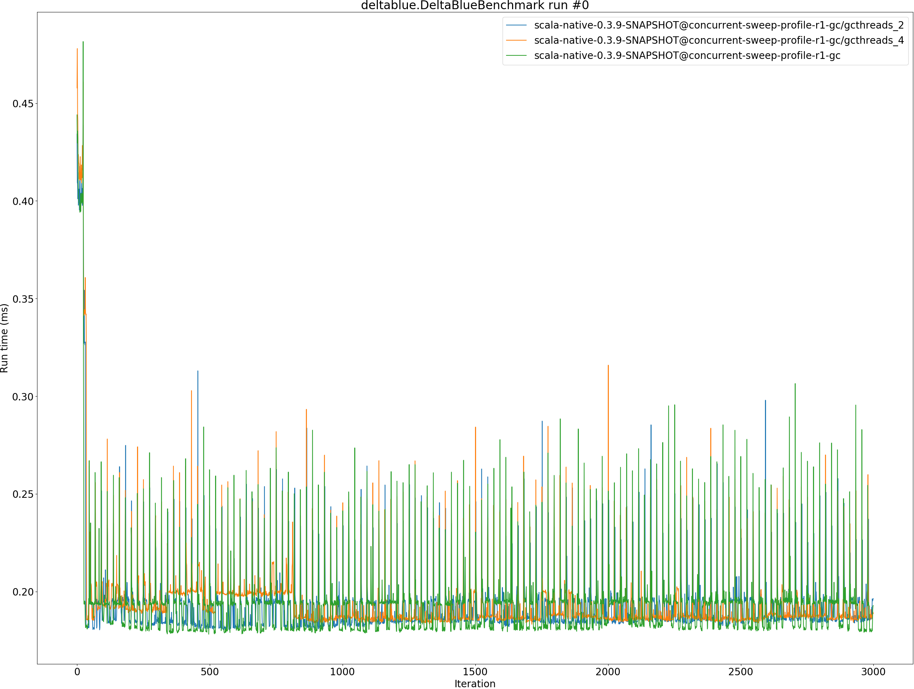
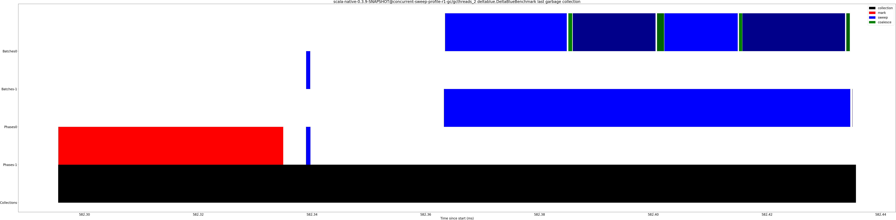
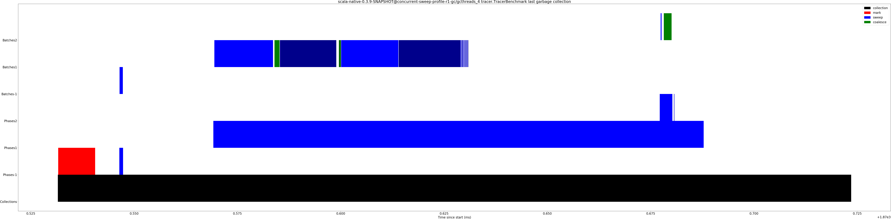
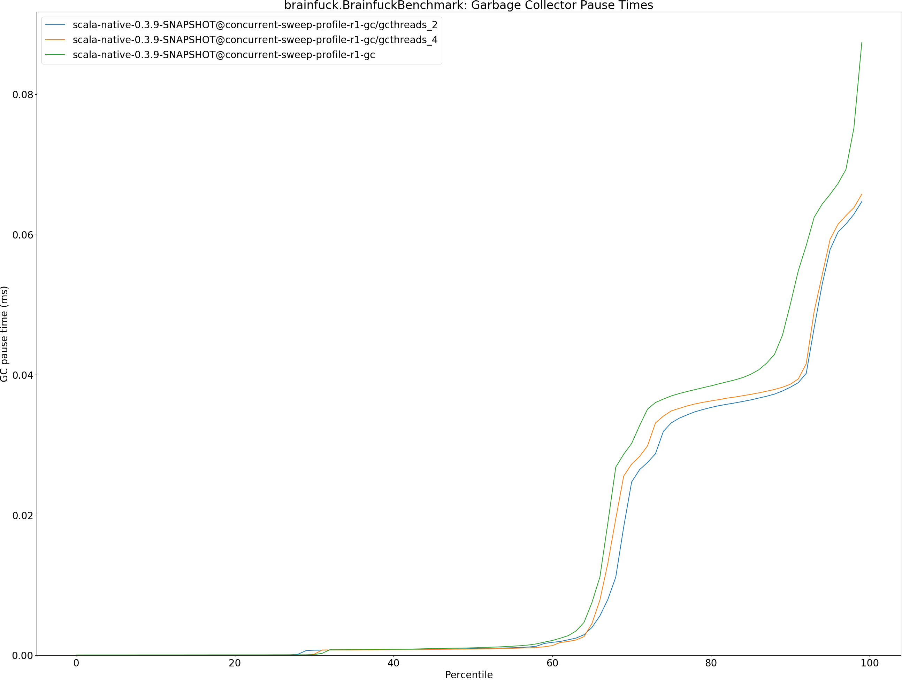
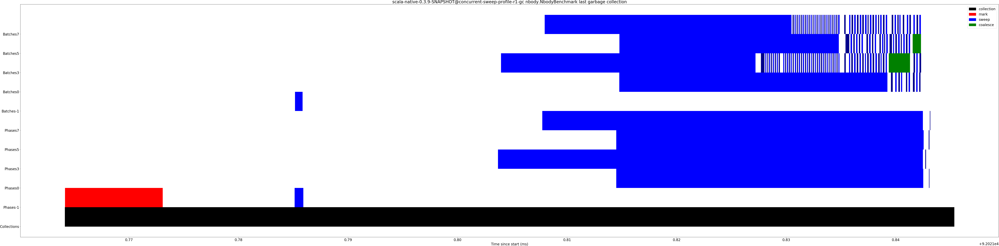

# Summary
## Benchmark run time (ms) at 50 percentile 

|name | scala-native-0.3.9-SNAPSHOT@concurrent-sweep-profile-r1-gc/gcthreads_2 | scala-native-0.3.9-SNAPSHOT@concurrent-sweep-profile-r1-gc/gcthreads_4 |  | scala-native-0.3.9-SNAPSHOT@concurrent-sweep-profile-r1-gc | |
| -- | -- | -- | -- | -- | -- |
|[bounce.BounceBenchmark](#bouncebouncebenchmark)|0.0479|0.0478|__-0.33%__|0.0481|+0.38%|
|[list.ListBenchmark](#listlistbenchmark)|0.0503|0.0515|+2.39%|0.0527|+4.76%|
|[richards.RichardsBenchmark](#richardsrichardsbenchmark)|0.0663|0.0618|__-6.86%__|0.0775|+16.89%|
|[queens.QueensBenchmark](#queensqueensbenchmark)|0.0871|0.0869|__-0.20%__|0.0927|+6.47%|
|[permute.PermuteBenchmark](#permutepermutebenchmark)|0.1946|0.2046|+5.11%|0.2231|+14.62%|
|[deltablue.DeltaBlueBenchmark](#deltabluedeltabluebenchmark)|0.1865|0.1867|+0.08%|0.1937|+3.86%|
|[tracer.TracerBenchmark](#tracertracerbenchmark)|0.6667|0.6228|__-6.59%__|0.6674|+0.10%|
|[brainfuck.BrainfuckBenchmark](#brainfuckbrainfuckbenchmark)|3.5994|3.9480|+9.69%|3.6701|+1.96%|
|[json.JsonBenchmark](#jsonjsonbenchmark)|1.3354|1.4006|+4.88%|1.4299|+7.07%|
|[cd.CDBenchmark](#cdcdbenchmark)|23.4140|22.8397|__-2.45%__|24.3319|+3.92%|
|[kmeans.KmeansBenchmark](#kmeanskmeansbenchmark)|49.1871|49.5422|+0.72%|50.3192|+2.30%|
|[gcbench.GCBenchBenchmark](#gcbenchgcbenchbenchmark)|105.0896|105.5235|+0.41%|105.8708|+0.74%|
|[mandelbrot.MandelbrotBenchmark](#mandelbrotmandelbrotbenchmark)|90.9735|94.3093|+3.67%|93.4957|+2.77%|
|[nbody.NbodyBenchmark](#nbodynbodybenchmark)|29.2085|29.9405|+2.51%|30.4068|+4.10%|
|[sudoku.SudokuBenchmark](#sudokusudokubenchmark)|2.3884|2.3780|__-0.44%__|2.4091|+0.86%|
| __Geometrical mean:__|| |+0.76%| |+4.62%|
## Benchmark run time (ms) at 90 percentile 

|name | scala-native-0.3.9-SNAPSHOT@concurrent-sweep-profile-r1-gc/gcthreads_2 | scala-native-0.3.9-SNAPSHOT@concurrent-sweep-profile-r1-gc/gcthreads_4 |  | scala-native-0.3.9-SNAPSHOT@concurrent-sweep-profile-r1-gc | |
| -- | -- | -- | -- | -- | -- |
|[bounce.BounceBenchmark](#bouncebouncebenchmark)|0.0504|0.0485|__-3.77%__|0.0511|+1.33%|
|[list.ListBenchmark](#listlistbenchmark)|0.0514|0.0550|+6.93%|0.0542|+5.36%|
|[richards.RichardsBenchmark](#richardsrichardsbenchmark)|0.0687|0.0634|__-7.66%__|0.0780|+13.51%|
|[queens.QueensBenchmark](#queensqueensbenchmark)|0.0928|0.0890|__-4.12%__|0.0937|+1.00%|
|[permute.PermuteBenchmark](#permutepermutebenchmark)|0.2127|0.2188|+2.84%|0.2324|+9.28%|
|[deltablue.DeltaBlueBenchmark](#deltabluedeltabluebenchmark)|0.1971|0.1939|__-1.61%__|0.1986|+0.79%|
|[tracer.TracerBenchmark](#tracertracerbenchmark)|0.6962|0.6602|__-5.17%__|0.6878|__-1.21%__|
|[brainfuck.BrainfuckBenchmark](#brainfuckbrainfuckbenchmark)|3.7095|4.0543|+9.30%|3.7604|+1.37%|
|[json.JsonBenchmark](#jsonjsonbenchmark)|1.4444|1.5197|+5.21%|1.5592|+7.95%|
|[cd.CDBenchmark](#cdcdbenchmark)|23.8389|23.7037|__-0.57%__|24.7510|+3.83%|
|[kmeans.KmeansBenchmark](#kmeanskmeansbenchmark)|50.3019|50.8211|+1.03%|51.6747|+2.73%|
|[gcbench.GCBenchBenchmark](#gcbenchgcbenchbenchmark)|108.7049|108.9672|+0.24%|110.0326|+1.22%|
|[mandelbrot.MandelbrotBenchmark](#mandelbrotmandelbrotbenchmark)|92.8932|95.0725|+2.35%|95.1678|+2.45%|
|[nbody.NbodyBenchmark](#nbodynbodybenchmark)|30.3437|30.2151|__-0.42%__|30.8469|+1.66%|
|[sudoku.SudokuBenchmark](#sudokusudokubenchmark)|2.5636|2.5860|+0.88%|2.6672|+4.04%|
| __Geometrical mean:__|| |+0.27%| |+3.62%|
## Benchmark run time (ms) at 99 percentile 

|name | scala-native-0.3.9-SNAPSHOT@concurrent-sweep-profile-r1-gc/gcthreads_2 | scala-native-0.3.9-SNAPSHOT@concurrent-sweep-profile-r1-gc/gcthreads_4 |  | scala-native-0.3.9-SNAPSHOT@concurrent-sweep-profile-r1-gc | |
| -- | -- | -- | -- | -- | -- |
|[bounce.BounceBenchmark](#bouncebouncebenchmark)|0.0529|0.0518|__-2.12%__|0.0525|__-0.77%__|
|[list.ListBenchmark](#listlistbenchmark)|0.0566|0.0569|+0.62%|0.0604|+6.79%|
|[richards.RichardsBenchmark](#richardsrichardsbenchmark)|0.0773|0.0777|+0.48%|0.0863|+11.63%|
|[queens.QueensBenchmark](#queensqueensbenchmark)|0.0949|0.0943|__-0.66%__|0.1480|+56.02%|
|[permute.PermuteBenchmark](#permutepermutebenchmark)|0.2527|0.2537|+0.40%|0.2815|+11.40%|
|[deltablue.DeltaBlueBenchmark](#deltabluedeltabluebenchmark)|0.2490|0.2537|+1.88%|0.2761|+10.88%|
|[tracer.TracerBenchmark](#tracertracerbenchmark)|0.7440|0.6914|__-7.07%__|1.3585|+82.60%|
|[brainfuck.BrainfuckBenchmark](#brainfuckbrainfuckbenchmark)|3.8333|4.1618|+8.57%|3.8941|+1.59%|
|[json.JsonBenchmark](#jsonjsonbenchmark)|1.4975|1.5899|+6.17%|1.6116|+7.62%|
|[cd.CDBenchmark](#cdcdbenchmark)|24.3055|24.5859|+1.15%|25.3264|+4.20%|
|[kmeans.KmeansBenchmark](#kmeanskmeansbenchmark)|51.6721|52.6930|+1.98%|52.7211|+2.03%|
|[gcbench.GCBenchBenchmark](#gcbenchgcbenchbenchmark)|112.0499|111.4738|__-0.51%__|115.6973|+3.26%|
|[mandelbrot.MandelbrotBenchmark](#mandelbrotmandelbrotbenchmark)|99.6766|95.9913|__-3.70%__|98.5548|__-1.13%__|
|[nbody.NbodyBenchmark](#nbodynbodybenchmark)|31.7947|30.6245|__-3.68%__|31.2729|__-1.64%__|
|[sudoku.SudokuBenchmark](#sudokusudokubenchmark)|2.7049|2.6965|__-0.31%__|2.8314|+4.68%|
| __Geometrical mean:__|| |+0.15%| |+11.45%|
## Benchmark total run time (ms) 

|name | scala-native-0.3.9-SNAPSHOT@concurrent-sweep-profile-r1-gc/gcthreads_2 | scala-native-0.3.9-SNAPSHOT@concurrent-sweep-profile-r1-gc/gcthreads_4 |  | scala-native-0.3.9-SNAPSHOT@concurrent-sweep-profile-r1-gc | |
| -- | -- | -- | -- | -- | -- |
|[bounce.BounceBenchmark](#bouncebouncebenchmark)|48.3381|47.8922|__-0.92%__|49.2430|+1.87%|
|[list.ListBenchmark](#listlistbenchmark)|50.7099|52.3565|+3.25%|51.9912|+2.53%|
|[richards.RichardsBenchmark](#richardsrichardsbenchmark)|66.6263|62.5925|__-6.05%__|77.9271|+16.96%|
|[queens.QueensBenchmark](#queensqueensbenchmark)|88.0514|87.4352|__-0.70%__|93.7479|+6.47%|
|[permute.PermuteBenchmark](#permutepermutebenchmark)|200.6492|208.3304|+3.83%|225.3542|+12.31%|
|[deltablue.DeltaBlueBenchmark](#deltabluedeltabluebenchmark)|191.6778|190.2846|__-0.73%__|193.4742|+0.94%|
|[tracer.TracerBenchmark](#tracertracerbenchmark)|663.4982|621.0078|__-6.40%__|673.4403|+1.50%|
|[brainfuck.BrainfuckBenchmark](#brainfuckbrainfuckbenchmark)|3608.5617|3958.9608|+9.71%|3693.4830|+2.35%|
|[json.JsonBenchmark](#jsonjsonbenchmark)|1337.4500|1415.7281|+5.85%|1434.7787|+7.28%|
|[cd.CDBenchmark](#cdcdbenchmark)|23491.1468|22978.2496|__-2.18%__|24369.2834|+3.74%|
|[kmeans.KmeansBenchmark](#kmeanskmeansbenchmark)|48897.1684|49377.0248|+0.98%|50174.4512|+2.61%|
|[gcbench.GCBenchBenchmark](#gcbenchgcbenchbenchmark)|104986.9181|105272.0596|+0.27%|105261.2100|+0.26%|
|[mandelbrot.MandelbrotBenchmark](#mandelbrotmandelbrotbenchmark)|91524.3358|94420.7515|+3.16%|93760.2377|+2.44%|
|[nbody.NbodyBenchmark](#nbodynbodybenchmark)|29418.1532|29971.7984|+1.88%|30458.1401|+3.54%|
|[sudoku.SudokuBenchmark](#sudokusudokubenchmark)|2411.3397|2420.7290|+0.39%|2436.7509|+1.05%|
| __Geometrical mean:__|| |+0.74%| |+4.30%|
## Total GC time on Application thread (ms) 

|name |  | scala-native-0.3.9-SNAPSHOT@concurrent-sweep-profile-r1-gc/gcthreads_2 | scala-native-0.3.9-SNAPSHOT@concurrent-sweep-profile-r1-gc/gcthreads_4 |  | scala-native-0.3.9-SNAPSHOT@concurrent-sweep-profile-r1-gc | |
| -- | -- | -- | -- | -- | -- | -- |
|[bounce.BounceBenchmark](#bouncebouncebenchmark)|mark|0.0648|0.0689|+6.33%|0.1182|+82.48%|
||sweep|0.0054|0.0050|__-7.59%__|0.0088|+62.77%|
||total|0.0702|0.0739|+5.26%|0.1270|+80.96%|
|[list.ListBenchmark](#listlistbenchmark)|mark|0.0289|0.0328|+13.49%|0.0350|+21.29%|
||sweep|0.0022|0.0019|__-13.34%__|0.0021|__-3.27%__|
||total|0.0311|0.0347|+11.61%|0.0372|+19.58%|
|[richards.RichardsBenchmark](#richardsrichardsbenchmark)|mark|0.1629|0.1811|+11.20%|0.3091|+89.83%|
||sweep|0.0140|0.0152|+8.59%|0.0264|+88.48%|
||total|0.1768|0.1963|+10.99%|0.3355|+89.73%|
|[queens.QueensBenchmark](#queensqueensbenchmark)|mark|0.1136|0.1094|__-3.69%__|0.2246|+97.61%|
||sweep|0.0100|0.0098|__-2.44%__|0.0159|+58.46%|
||total|0.1237|0.1192|__-3.59%__|0.2405|+94.44%|
|[permute.PermuteBenchmark](#permutepermutebenchmark)|mark|1.6375|1.9695|+20.27%|2.4526|+49.78%|
||sweep|1.6291|0.5527|__-66.07%__|0.4480|__-72.50%__|
||total|3.2665|2.5222|__-22.79%__|2.9006|__-11.20%__|
|[deltablue.DeltaBlueBenchmark](#deltabluedeltabluebenchmark)|mark|3.2919|3.2969|+0.15%|3.6679|+11.42%|
||sweep|0.1766|0.3041|+72.22%|0.1942|+9.99%|
||total|3.4684|3.6010|+3.82%|3.8621|+11.35%|
|[tracer.TracerBenchmark](#tracertracerbenchmark)|mark|19.3606|17.9847|__-7.11%__|19.5222|+0.83%|
||sweep|38.0242|27.9562|__-26.48%__|11.6678|__-69.31%__|
||total|57.3848|45.9409|__-19.94%__|31.1900|__-45.65%__|
|[brainfuck.BrainfuckBenchmark](#brainfuckbrainfuckbenchmark)|mark|128.3141|130.1237|+1.41%|148.5704|+15.79%|
||sweep|22.6594|17.3873|__-23.27%__|18.8387|__-16.86%__|
||total|150.9735|147.5110|__-2.29%__|167.4091|+10.89%|
|[json.JsonBenchmark](#jsonjsonbenchmark)|mark|60.0072|63.6307|+6.04%|60.0081|+0.00%|
||sweep|22.6897|19.0718|__-15.95%__|5.6456|__-75.12%__|
||total|82.6969|82.7024|+0.01%|65.6537|__-20.61%__|
|[cd.CDBenchmark](#cdcdbenchmark)|mark|1196.0987|862.2194|__-27.91%__|1265.7180|+5.82%|
||sweep|118.6433|150.7895|+27.09%|104.5390|__-11.89%__|
||total|1314.7420|1013.0090|__-22.95%__|1370.2569|+4.22%|
|[kmeans.KmeansBenchmark](#kmeanskmeansbenchmark)|mark|2882.8740|3050.7900|+5.82%|3104.9046|+7.70%|
||sweep|60.3325|50.4659|__-16.35%__|42.6229|__-29.35%__|
||total|2943.2064|3101.2559|+5.37%|3147.5276|+6.94%|
|[gcbench.GCBenchBenchmark](#gcbenchgcbenchbenchmark)|mark|41559.6095|41388.4561|__-0.41%__|44324.3729|+6.65%|
||sweep|1474.2715|1386.6528|__-5.94%__|871.1413|__-40.91%__|
||total|43033.8810|42775.1089|__-0.60%__|45195.5141|+5.02%|
|[mandelbrot.MandelbrotBenchmark](#mandelbrotmandelbrotbenchmark)|mark|0.0000|0.0000|N/A|0.0000|N/A|
||sweep|0.0000|0.0000|N/A|0.0000|N/A|
||total|0.0000|0.0000|N/A|0.0000|N/A|
|[nbody.NbodyBenchmark](#nbodynbodybenchmark)|mark|40.9502|40.4278|__-1.28%__|43.6352|+6.56%|
||sweep|8.1015|19.7009|+143.18%|8.1501|+0.60%|
||total|49.0518|60.1287|+22.58%|51.7853|+5.57%|
|[sudoku.SudokuBenchmark](#sudokusudokubenchmark)|mark|59.1761|58.8804|__-0.50%__|62.4726|+5.57%|
||sweep|3.6061|4.2817|+18.74%|26.3718|+631.31%|
||total|62.7822|63.1622|+0.61%|88.8444|+41.51%|
|__Geometrical mean:__|mark|| |+1.07%| |+24.76%|
||sweep|| |__-2.73%__| |__-9.58%__|
||total|| |__-1.72%__| |+14.44%|
## GC pause time (ms) at 50 percentile 

|name | scala-native-0.3.9-SNAPSHOT@concurrent-sweep-profile-r1-gc/gcthreads_2 | scala-native-0.3.9-SNAPSHOT@concurrent-sweep-profile-r1-gc/gcthreads_4 |  | scala-native-0.3.9-SNAPSHOT@concurrent-sweep-profile-r1-gc | |
| -- | -- | -- | -- | -- | -- |
|[bounce.BounceBenchmark](#bouncebouncebenchmark)|0.0009|0.0009|__-6.34%__|0.0019|+102.36%|
|[list.ListBenchmark](#listlistbenchmark)|0.0021|0.0016|__-24.53%__|0.0019|__-8.99%__|
|[richards.RichardsBenchmark](#richardsrichardsbenchmark)|0.0008|0.0008|+5.19%|0.0016|+110.51%|
|[queens.QueensBenchmark](#queensqueensbenchmark)|0.0009|0.0009|__-1.10%__|0.0016|+80.26%|
|[permute.PermuteBenchmark](#permutepermutebenchmark)|0.0008|0.0009|+12.63%|0.0009|+10.04%|
|[deltablue.DeltaBlueBenchmark](#deltabluedeltabluebenchmark)|0.0008|0.0008|+0.59%|0.0009|+3.51%|
|[tracer.TracerBenchmark](#tracertracerbenchmark)|0.0030|0.0022|__-26.42%__|0.0011|__-63.37%__|
|[brainfuck.BrainfuckBenchmark](#brainfuckbrainfuckbenchmark)|0.0009|0.0009|__-5.36%__|0.0011|+12.88%|
|[json.JsonBenchmark](#jsonjsonbenchmark)|0.0009|0.0009|+5.99%|0.0008|__-3.41%__|
|[cd.CDBenchmark](#cdcdbenchmark)|0.0014|0.0024|+73.52%|0.0016|+14.97%|
|[kmeans.KmeansBenchmark](#kmeanskmeansbenchmark)|0.0029|0.0031|+8.55%|0.0028|__-3.52%__|
|[gcbench.GCBenchBenchmark](#gcbenchgcbenchbenchmark)|0.0084|0.0070|__-16.87%__|0.0036|__-57.72%__|
|[mandelbrot.MandelbrotBenchmark](#mandelbrotmandelbrotbenchmark)|0.0000|0.0000|N/A|0.0000|N/A|
|[nbody.NbodyBenchmark](#nbodynbodybenchmark)|0.0007|0.0008|+8.53%|0.0007|+2.75%|
|[sudoku.SudokuBenchmark](#sudokusudokubenchmark)|0.0013|0.0015|+15.20%|0.0126|+855.67%|
| __Geometrical mean:__|| |+1.33%| |+21.13%|
## GC pause time (ms) at 90 percentile 

|name | scala-native-0.3.9-SNAPSHOT@concurrent-sweep-profile-r1-gc/gcthreads_2 | scala-native-0.3.9-SNAPSHOT@concurrent-sweep-profile-r1-gc/gcthreads_4 |  | scala-native-0.3.9-SNAPSHOT@concurrent-sweep-profile-r1-gc | |
| -- | -- | -- | -- | -- | -- |
|[bounce.BounceBenchmark](#bouncebouncebenchmark)|0.0116|0.0105|__-10.21%__|0.0239|+104.84%|
|[list.ListBenchmark](#listlistbenchmark)|0.0235|0.0266|+12.80%|0.0284|+20.75%|
|[richards.RichardsBenchmark](#richardsrichardsbenchmark)|0.0101|0.0110|+8.89%|0.0241|+137.88%|
|[queens.QueensBenchmark](#queensqueensbenchmark)|0.0102|0.0111|+9.02%|0.0281|+175.98%|
|[permute.PermuteBenchmark](#permutepermutebenchmark)|0.0081|0.0088|+9.00%|0.0123|+53.25%|
|[deltablue.DeltaBlueBenchmark](#deltabluedeltabluebenchmark)|0.0273|0.0273|__-0.22%__|0.0312|+14.25%|
|[tracer.TracerBenchmark](#tracertracerbenchmark)|0.0100|0.0094|__-5.87%__|0.0095|__-4.87%__|
|[brainfuck.BrainfuckBenchmark](#brainfuckbrainfuckbenchmark)|0.0382|0.0387|+1.12%|0.0501|+31.01%|
|[json.JsonBenchmark](#jsonjsonbenchmark)|0.0411|0.0423|+2.81%|0.0408|__-0.91%__|
|[cd.CDBenchmark](#cdcdbenchmark)|0.0494|0.0633|+28.09%|0.0540|+9.31%|
|[kmeans.KmeansBenchmark](#kmeanskmeansbenchmark)|2.0372|2.1370|+4.90%|2.2043|+8.20%|
|[gcbench.GCBenchBenchmark](#gcbenchgcbenchbenchmark)|1.3777|1.3720|__-0.41%__|1.5385|+11.67%|
|[mandelbrot.MandelbrotBenchmark](#mandelbrotmandelbrotbenchmark)|0.0000|0.0000|N/A|0.0000|N/A|
|[nbody.NbodyBenchmark](#nbodynbodybenchmark)|0.0065|0.0069|+6.81%|0.0071|+10.03%|
|[sudoku.SudokuBenchmark](#sudokusudokubenchmark)|0.0961|0.0947|__-1.47%__|0.1023|+6.50%|
| __Geometrical mean:__|| |+4.30%| |+33.03%|
## GC pause time (ms) at 99 percentile 

|name | scala-native-0.3.9-SNAPSHOT@concurrent-sweep-profile-r1-gc/gcthreads_2 | scala-native-0.3.9-SNAPSHOT@concurrent-sweep-profile-r1-gc/gcthreads_4 |  | scala-native-0.3.9-SNAPSHOT@concurrent-sweep-profile-r1-gc | |
| -- | -- | -- | -- | -- | -- |
|[bounce.BounceBenchmark](#bouncebouncebenchmark)|0.0224|0.0276|+23.03%|0.0377|+67.98%|
|[list.ListBenchmark](#listlistbenchmark)|0.0284|0.0322|+13.43%|0.0344|+21.25%|
|[richards.RichardsBenchmark](#richardsrichardsbenchmark)|0.0226|0.0280|+24.02%|0.0318|+41.03%|
|[queens.QueensBenchmark](#queensqueensbenchmark)|0.0262|0.0247|__-5.58%__|0.0318|+21.27%|
|[permute.PermuteBenchmark](#permutepermutebenchmark)|0.0355|0.0369|+3.79%|0.0312|__-12.19%__|
|[deltablue.DeltaBlueBenchmark](#deltabluedeltabluebenchmark)|0.0368|0.0411|+11.80%|0.0466|+26.71%|
|[tracer.TracerBenchmark](#tracertracerbenchmark)|0.0408|0.0383|__-6.30%__|0.0362|__-11.35%__|
|[brainfuck.BrainfuckBenchmark](#brainfuckbrainfuckbenchmark)|0.0647|0.0658|+1.62%|0.0874|+35.09%|
|[json.JsonBenchmark](#jsonjsonbenchmark)|0.0583|0.0783|+34.16%|0.0460|__-21.12%__|
|[cd.CDBenchmark](#cdcdbenchmark)|0.0911|0.1294|+41.98%|0.1026|+12.61%|
|[kmeans.KmeansBenchmark](#kmeanskmeansbenchmark)|2.4663|2.3762|__-3.65%__|2.6207|+6.26%|
|[gcbench.GCBenchBenchmark](#gcbenchgcbenchbenchmark)|4.1723|4.1341|__-0.92%__|4.2079|+0.85%|
|[mandelbrot.MandelbrotBenchmark](#mandelbrotmandelbrotbenchmark)|0.0000|0.0000|N/A|0.0000|N/A|
|[nbody.NbodyBenchmark](#nbodynbodybenchmark)|0.0225|0.0365|+62.57%|0.0164|__-26.80%__|
|[sudoku.SudokuBenchmark](#sudokusudokubenchmark)|0.1068|0.1111|+4.02%|0.1219|+14.16%|
| __Geometrical mean:__|| |+13.03%| |+9.78%|
# Individual benchmarks
## bounce.BounceBenchmark

## list.ListBenchmark

## richards.RichardsBenchmark

## queens.QueensBenchmark

## permute.PermuteBenchmark

## deltablue.DeltaBlueBenchmark

## tracer.TracerBenchmark

## brainfuck.BrainfuckBenchmark

## json.JsonBenchmark

## cd.CDBenchmark

## kmeans.KmeansBenchmark

## gcbench.GCBenchBenchmark

## mandelbrot.MandelbrotBenchmark

## nbody.NbodyBenchmark

## sudoku.SudokuBenchmark

