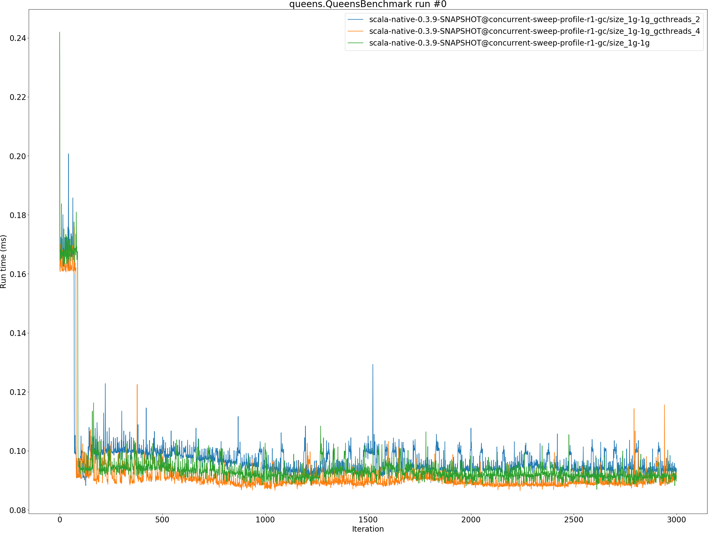
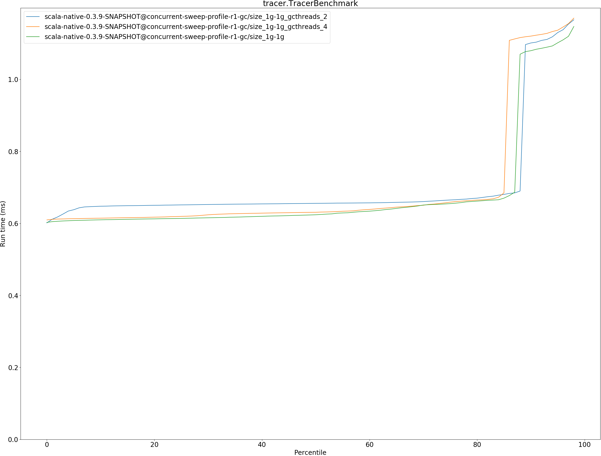
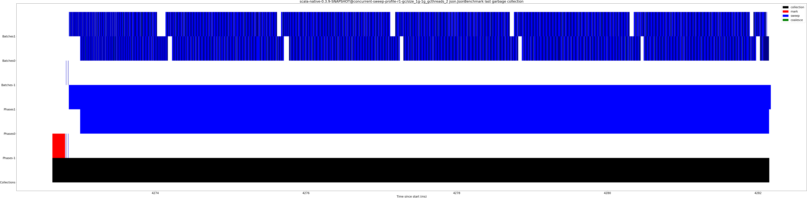

# Summary
## Benchmark run time (ms) at 50 percentile 

|name | scala-native-0.3.9-SNAPSHOT@concurrent-sweep-profile-r1-gc/size_1g-1g_gcthreads_2 | scala-native-0.3.9-SNAPSHOT@concurrent-sweep-profile-r1-gc/size_1g-1g_gcthreads_4 |  | scala-native-0.3.9-SNAPSHOT@concurrent-sweep-profile-r1-gc/size_1g-1g | |
| -- | -- | -- | -- | -- | -- |
|[bounce.BounceBenchmark](#bouncebouncebenchmark)|0.0490|0.0500|+2.04%|0.0503|+2.70%|
|[list.ListBenchmark](#listlistbenchmark)|0.0508|0.0521|+2.57%|0.0515|+1.22%|
|[richards.RichardsBenchmark](#richardsrichardsbenchmark)|0.0683|0.0694|+1.58%|0.0673|__-1.47%__|
|[queens.QueensBenchmark](#queensqueensbenchmark)|0.0940|0.0888|__-5.49%__|0.0915|__-2.65%__|
|[permute.PermuteBenchmark](#permutepermutebenchmark)|0.2923|0.2853|__-2.41%__|0.2620|__-10.37%__|
|[deltablue.DeltaBlueBenchmark](#deltabluedeltabluebenchmark)|0.2382|0.2413|+1.27%|0.2267|__-4.86%__|
|[tracer.TracerBenchmark](#tracertracerbenchmark)|0.6556|0.6307|__-3.79%__|0.6238|__-4.84%__|
|[brainfuck.BrainfuckBenchmark](#brainfuckbrainfuckbenchmark)|3.7470|3.3677|__-10.12%__|3.5557|__-5.10%__|
|[json.JsonBenchmark](#jsonjsonbenchmark)|1.3112|1.3295|+1.40%|1.3488|+2.87%|
|[cd.CDBenchmark](#cdcdbenchmark)|21.6412|23.2147|+7.27%|21.9670|+1.51%|
|[kmeans.KmeansBenchmark](#kmeanskmeansbenchmark)|46.9900|48.2938|+2.77%|47.9408|+2.02%|
|[gcbench.GCBenchBenchmark](#gcbenchgcbenchbenchmark)|95.1858|97.1382|+2.05%|93.7085|__-1.55%__|
|[mandelbrot.MandelbrotBenchmark](#mandelbrotmandelbrotbenchmark)|93.3576|93.8126|+0.49%|91.0395|__-2.48%__|
|[nbody.NbodyBenchmark](#nbodynbodybenchmark)|28.8745|28.9756|+0.35%|29.2782|+1.40%|
|[sudoku.SudokuBenchmark](#sudokusudokubenchmark)|2.4601|2.4378|__-0.90%__|2.3298|__-5.29%__|
| __Geometrical mean:__|| |__-0.14%__| |__-1.86%__|
## Benchmark run time (ms) at 90 percentile 

|name | scala-native-0.3.9-SNAPSHOT@concurrent-sweep-profile-r1-gc/size_1g-1g_gcthreads_2 | scala-native-0.3.9-SNAPSHOT@concurrent-sweep-profile-r1-gc/size_1g-1g_gcthreads_4 |  | scala-native-0.3.9-SNAPSHOT@concurrent-sweep-profile-r1-gc/size_1g-1g | |
| -- | -- | -- | -- | -- | -- |
|[bounce.BounceBenchmark](#bouncebouncebenchmark)|0.0520|0.0538|+3.29%|0.0525|+0.90%|
|[list.ListBenchmark](#listlistbenchmark)|0.0520|0.0555|+6.60%|0.0552|+6.03%|
|[richards.RichardsBenchmark](#richardsrichardsbenchmark)|0.0727|0.0733|+0.80%|0.0702|__-3.44%__|
|[queens.QueensBenchmark](#queensqueensbenchmark)|0.0995|0.0917|__-7.87%__|0.0937|__-5.81%__|
|[permute.PermuteBenchmark](#permutepermutebenchmark)|0.2980|0.3017|+1.25%|0.2710|__-9.07%__|
|[deltablue.DeltaBlueBenchmark](#deltabluedeltabluebenchmark)|0.2459|0.2503|+1.80%|0.2312|__-5.99%__|
|[tracer.TracerBenchmark](#tracertracerbenchmark)|1.1010|1.1201|+1.73%|1.0795|__-1.95%__|
|[brainfuck.BrainfuckBenchmark](#brainfuckbrainfuckbenchmark)|4.3831|3.4278|__-21.80%__|4.2362|__-3.35%__|
|[json.JsonBenchmark](#jsonjsonbenchmark)|1.3856|1.4047|+1.38%|1.3879|+0.17%|
|[cd.CDBenchmark](#cdcdbenchmark)|23.2155|25.0067|+7.72%|23.6342|+1.80%|
|[kmeans.KmeansBenchmark](#kmeanskmeansbenchmark)|48.7164|51.5283|+5.77%|49.5662|+1.74%|
|[gcbench.GCBenchBenchmark](#gcbenchgcbenchbenchmark)|100.1969|102.8626|+2.66%|98.5598|__-1.63%__|
|[mandelbrot.MandelbrotBenchmark](#mandelbrotmandelbrotbenchmark)|95.2300|95.2497|+0.02%|92.7395|__-2.62%__|
|[nbody.NbodyBenchmark](#nbodynbodybenchmark)|30.5819|30.6050|+0.08%|30.7329|+0.49%|
|[sudoku.SudokuBenchmark](#sudokusudokubenchmark)|2.7173|2.6729|__-1.63%__|2.5817|__-4.99%__|
| __Geometrical mean:__|| |__-0.14%__| |__-1.92%__|
## Benchmark run time (ms) at 99 percentile 

|name | scala-native-0.3.9-SNAPSHOT@concurrent-sweep-profile-r1-gc/size_1g-1g_gcthreads_2 | scala-native-0.3.9-SNAPSHOT@concurrent-sweep-profile-r1-gc/size_1g-1g_gcthreads_4 |  | scala-native-0.3.9-SNAPSHOT@concurrent-sweep-profile-r1-gc/size_1g-1g | |
| -- | -- | -- | -- | -- | -- |
|[bounce.BounceBenchmark](#bouncebouncebenchmark)|0.0545|0.0563|+3.16%|0.0556|+1.97%|
|[list.ListBenchmark](#listlistbenchmark)|0.0556|0.0579|+4.20%|0.0572|+2.93%|
|[richards.RichardsBenchmark](#richardsrichardsbenchmark)|0.0770|0.0767|__-0.43%__|0.0743|__-3.59%__|
|[queens.QueensBenchmark](#queensqueensbenchmark)|0.1027|0.0963|__-6.17%__|0.0979|__-4.67%__|
|[permute.PermuteBenchmark](#permutepermutebenchmark)|0.3122|0.3093|__-0.94%__|0.2847|__-8.79%__|
|[deltablue.DeltaBlueBenchmark](#deltabluedeltabluebenchmark)|0.2505|0.2581|+3.01%|0.2493|__-0.50%__|
|[tracer.TracerBenchmark](#tracertracerbenchmark)|2.3738|1.2035|__-49.30%__|1.1604|__-51.12%__|
|[brainfuck.BrainfuckBenchmark](#brainfuckbrainfuckbenchmark)|5.1819|3.5381|__-31.72%__|4.4623|__-13.89%__|
|[json.JsonBenchmark](#jsonjsonbenchmark)|1.4483|1.4760|+1.92%|1.4152|__-2.28%__|
|[cd.CDBenchmark](#cdcdbenchmark)|29.6658|33.9137|+14.32%|31.6405|+6.66%|
|[kmeans.KmeansBenchmark](#kmeanskmeansbenchmark)|53.7254|54.2746|+1.02%|53.1959|__-0.99%__|
|[gcbench.GCBenchBenchmark](#gcbenchgcbenchbenchmark)|103.3638|129.2636|+25.06%|107.1755|+3.69%|
|[mandelbrot.MandelbrotBenchmark](#mandelbrotmandelbrotbenchmark)|100.2003|96.9326|__-3.26%__|97.1473|__-3.05%__|
|[nbody.NbodyBenchmark](#nbodynbodybenchmark)|31.6784|32.5799|+2.85%|32.3727|+2.19%|
|[sudoku.SudokuBenchmark](#sudokusudokubenchmark)|2.8263|2.8077|__-0.66%__|2.6847|__-5.01%__|
| __Geometrical mean:__|| |__-4.31%__| |__-6.39%__|
## Benchmark total run time (ms) 

|name | scala-native-0.3.9-SNAPSHOT@concurrent-sweep-profile-r1-gc/size_1g-1g_gcthreads_2 | scala-native-0.3.9-SNAPSHOT@concurrent-sweep-profile-r1-gc/size_1g-1g_gcthreads_4 |  | scala-native-0.3.9-SNAPSHOT@concurrent-sweep-profile-r1-gc/size_1g-1g | |
| -- | -- | -- | -- | -- | -- |
|[bounce.BounceBenchmark](#bouncebouncebenchmark)|49.3304|50.6662|+2.71%|50.6163|+2.61%|
|[list.ListBenchmark](#listlistbenchmark)|51.1316|52.6239|+2.92%|52.1337|+1.96%|
|[richards.RichardsBenchmark](#richardsrichardsbenchmark)|68.9794|70.0973|+1.62%|67.8032|__-1.71%__|
|[queens.QueensBenchmark](#queensqueensbenchmark)|94.9189|89.4548|__-5.76%__|91.6945|__-3.40%__|
|[permute.PermuteBenchmark](#permutepermutebenchmark)|292.6777|288.3022|__-1.49%__|263.4707|__-9.98%__|
|[deltablue.DeltaBlueBenchmark](#deltabluedeltabluebenchmark)|239.2670|242.7386|+1.45%|227.7663|__-4.81%__|
|[tracer.TracerBenchmark](#tracertracerbenchmark)|726.6222|716.4615|__-1.40%__|696.9417|__-4.08%__|
|[brainfuck.BrainfuckBenchmark](#brainfuckbrainfuckbenchmark)|3939.7955|3397.6851|__-13.76%__|3755.9814|__-4.67%__|
|[json.JsonBenchmark](#jsonjsonbenchmark)|1337.5346|1348.4813|+0.82%|1361.5467|+1.80%|
|[cd.CDBenchmark](#cdcdbenchmark)|22224.4021|23992.8251|+7.96%|22467.9519|+1.10%|
|[kmeans.KmeansBenchmark](#kmeanskmeansbenchmark)|47476.2566|48866.2133|+2.93%|48404.6659|+1.96%|
|[gcbench.GCBenchBenchmark](#gcbenchgcbenchbenchmark)|93542.3921|97124.4783|+3.83%|93862.7758|+0.34%|
|[mandelbrot.MandelbrotBenchmark](#mandelbrotmandelbrotbenchmark)|93681.8651|94052.9233|+0.40%|91499.7191|__-2.33%__|
|[nbody.NbodyBenchmark](#nbodynbodybenchmark)|29207.8608|29288.0420|+0.27%|29556.1486|+1.19%|
|[sudoku.SudokuBenchmark](#sudokusudokubenchmark)|2520.9453|2488.1496|__-1.30%__|2396.6784|__-4.93%__|
| __Geometrical mean:__|| |__-0.04%__| |__-1.73%__|
## Total GC time on Application thread (ms) 

|name |  | scala-native-0.3.9-SNAPSHOT@concurrent-sweep-profile-r1-gc/size_1g-1g_gcthreads_2 | scala-native-0.3.9-SNAPSHOT@concurrent-sweep-profile-r1-gc/size_1g-1g_gcthreads_4 |  | scala-native-0.3.9-SNAPSHOT@concurrent-sweep-profile-r1-gc/size_1g-1g | |
| -- | -- | -- | -- | -- | -- | -- |
|[bounce.BounceBenchmark](#bouncebouncebenchmark)|mark|0.0000|0.0000|N/A|0.0000|N/A|
||sweep|0.0000|0.0000|N/A|0.0000|N/A|
||total|0.0000|0.0000|N/A|0.0000|N/A|
|[list.ListBenchmark](#listlistbenchmark)|mark|0.0000|0.0000|N/A|0.0000|N/A|
||sweep|0.0000|0.0000|N/A|0.0000|N/A|
||total|0.0000|0.0000|N/A|0.0000|N/A|
|[richards.RichardsBenchmark](#richardsrichardsbenchmark)|mark|0.0000|0.0000|N/A|0.0000|N/A|
||sweep|0.0000|0.0000|N/A|0.0000|N/A|
||total|0.0000|0.0000|N/A|0.0000|N/A|
|[queens.QueensBenchmark](#queensqueensbenchmark)|mark|0.0000|0.0000|N/A|0.0000|N/A|
||sweep|0.0000|0.0000|N/A|0.0000|N/A|
||total|0.0000|0.0000|N/A|0.0000|N/A|
|[permute.PermuteBenchmark](#permutepermutebenchmark)|mark|0.0000|0.0000|N/A|0.0000|N/A|
||sweep|0.0000|0.0000|N/A|0.0000|N/A|
||total|0.0000|0.0000|N/A|0.0000|N/A|
|[deltablue.DeltaBlueBenchmark](#deltabluedeltabluebenchmark)|mark|0.0000|0.0000|N/A|0.0000|N/A|
||sweep|0.0000|0.0000|N/A|0.0000|N/A|
||total|0.0000|0.0000|N/A|0.0000|N/A|
|[tracer.TracerBenchmark](#tracertracerbenchmark)|mark|0.3038|0.3444|+13.37%|0.3042|+0.16%|
||sweep|0.5107|1.0893|+113.28%|1.1948|+133.93%|
||total|0.8145|1.4337|+76.02%|1.4990|+84.04%|
|[brainfuck.BrainfuckBenchmark](#brainfuckbrainfuckbenchmark)|mark|1.2920|1.1353|__-12.13%__|1.3102|+1.41%|
||sweep|0.2456|0.2338|__-4.81%__|1.1326|+361.15%|
||total|1.5376|1.3691|__-10.96%__|2.4429|+58.87%|
|[json.JsonBenchmark](#jsonjsonbenchmark)|mark|0.6126|0.6227|+1.63%|0.6314|+3.06%|
||sweep|0.2248|0.4651|+106.89%|0.1796|__-20.12%__|
||total|0.8374|1.0877|+29.89%|0.8110|__-3.16%__|
|[cd.CDBenchmark](#cdcdbenchmark)|mark|16.9720|17.1687|+1.16%|17.4057|+2.56%|
||sweep|10.6562|9.9789|__-6.36%__|4.6721|__-56.16%__|
||total|27.6282|27.1476|__-1.74%__|22.0778|__-20.09%__|
|[kmeans.KmeansBenchmark](#kmeanskmeansbenchmark)|mark|166.0472|167.2327|+0.71%|178.3782|+7.43%|
||sweep|2.7044|2.6719|__-1.20%__|3.0586|+13.10%|
||total|168.7516|169.9046|+0.68%|181.4369|+7.52%|
|[gcbench.GCBenchBenchmark](#gcbenchgcbenchbenchmark)|mark|6421.0800|6551.9566|+2.04%|6456.4471|+0.55%|
||sweep|81.5487|85.3513|+4.66%|94.2340|+15.56%|
||total|6502.6287|6637.3079|+2.07%|6550.6811|+0.74%|
|[mandelbrot.MandelbrotBenchmark](#mandelbrotmandelbrotbenchmark)|mark|0.0000|0.0000|N/A|0.0000|N/A|
||sweep|0.0000|0.0000|N/A|0.0000|N/A|
||total|0.0000|0.0000|N/A|0.0000|N/A|
|[nbody.NbodyBenchmark](#nbodynbodybenchmark)|mark|0.8719|0.9031|+3.58%|0.8597|__-1.40%__|
||sweep|0.0773|0.4055|+424.52%|0.6337|+719.71%|
||total|0.9492|1.3086|+37.86%|1.4933|+57.32%|
|[sudoku.SudokuBenchmark](#sudokusudokubenchmark)|mark|0.5823|0.5128|__-11.93%__|0.5781|__-0.71%__|
||sweep|0.4395|0.7175|+63.23%|1.2159|+176.65%|
||total|1.0218|1.2303|+20.40%|1.7941|+75.58%|
|__Geometrical mean:__|mark|| |__-0.51%__| |+1.60%|
||sweep|| |+55.86%| |+80.36%|
||total|| |+16.58%| |+27.01%|
## GC pause time (ms) at 50 percentile 

|name | scala-native-0.3.9-SNAPSHOT@concurrent-sweep-profile-r1-gc/size_1g-1g_gcthreads_2 | scala-native-0.3.9-SNAPSHOT@concurrent-sweep-profile-r1-gc/size_1g-1g_gcthreads_4 |  | scala-native-0.3.9-SNAPSHOT@concurrent-sweep-profile-r1-gc/size_1g-1g | |
| -- | -- | -- | -- | -- | -- |
|[bounce.BounceBenchmark](#bouncebouncebenchmark)|0.0000|0.0000|N/A|0.0000|N/A|
|[list.ListBenchmark](#listlistbenchmark)|0.0000|0.0000|N/A|0.0000|N/A|
|[richards.RichardsBenchmark](#richardsrichardsbenchmark)|0.0000|0.0000|N/A|0.0000|N/A|
|[queens.QueensBenchmark](#queensqueensbenchmark)|0.0000|0.0000|N/A|0.0000|N/A|
|[permute.PermuteBenchmark](#permutepermutebenchmark)|0.0000|0.0000|N/A|0.0000|N/A|
|[deltablue.DeltaBlueBenchmark](#deltabluedeltabluebenchmark)|0.0000|0.0000|N/A|0.0000|N/A|
|[tracer.TracerBenchmark](#tracertracerbenchmark)|0.0156|0.0147|__-5.94%__|0.0037|__-76.61%__|
|[brainfuck.BrainfuckBenchmark](#brainfuckbrainfuckbenchmark)|0.0026|0.0024|__-6.40%__|0.0025|__-3.70%__|
|[json.JsonBenchmark](#jsonjsonbenchmark)|0.0024|0.0026|+7.22%|0.0024|__-0.02%__|
|[cd.CDBenchmark](#cdcdbenchmark)|0.0027|0.0027|+2.64%|0.0032|+21.20%|
|[kmeans.KmeansBenchmark](#kmeanskmeansbenchmark)|0.0035|0.0037|+4.12%|0.0197|+456.49%|
|[gcbench.GCBenchBenchmark](#gcbenchgcbenchbenchmark)|0.0049|0.0056|+15.15%|0.0034|__-31.06%__|
|[mandelbrot.MandelbrotBenchmark](#mandelbrotmandelbrotbenchmark)|0.0000|0.0000|N/A|0.0000|N/A|
|[nbody.NbodyBenchmark](#nbodynbodybenchmark)|0.0025|0.0026|+6.87%|0.0025|+2.02%|
|[sudoku.SudokuBenchmark](#sudokusudokubenchmark)|0.0263|0.0214|__-18.63%__|0.0161|__-38.73%__|
| __Geometrical mean:__|| |+0.13%| |__-5.16%__|
## GC pause time (ms) at 90 percentile 

|name | scala-native-0.3.9-SNAPSHOT@concurrent-sweep-profile-r1-gc/size_1g-1g_gcthreads_2 | scala-native-0.3.9-SNAPSHOT@concurrent-sweep-profile-r1-gc/size_1g-1g_gcthreads_4 |  | scala-native-0.3.9-SNAPSHOT@concurrent-sweep-profile-r1-gc/size_1g-1g | |
| -- | -- | -- | -- | -- | -- |
|[bounce.BounceBenchmark](#bouncebouncebenchmark)|0.0000|0.0000|N/A|0.0000|N/A|
|[list.ListBenchmark](#listlistbenchmark)|0.0000|0.0000|N/A|0.0000|N/A|
|[richards.RichardsBenchmark](#richardsrichardsbenchmark)|0.0000|0.0000|N/A|0.0000|N/A|
|[queens.QueensBenchmark](#queensqueensbenchmark)|0.0000|0.0000|N/A|0.0000|N/A|
|[permute.PermuteBenchmark](#permutepermutebenchmark)|0.0000|0.0000|N/A|0.0000|N/A|
|[deltablue.DeltaBlueBenchmark](#deltabluedeltabluebenchmark)|0.0000|0.0000|N/A|0.0000|N/A|
|[tracer.TracerBenchmark](#tracertracerbenchmark)|0.0438|0.0506|+15.49%|0.0449|+2.54%|
|[brainfuck.BrainfuckBenchmark](#brainfuckbrainfuckbenchmark)|0.0825|0.0946|+14.69%|0.1720|+108.46%|
|[json.JsonBenchmark](#jsonjsonbenchmark)|0.1638|0.1606|__-1.99%__|0.1632|__-0.36%__|
|[cd.CDBenchmark](#cdcdbenchmark)|0.0984|0.0936|__-4.82%__|0.0945|__-3.97%__|
|[kmeans.KmeansBenchmark](#kmeanskmeansbenchmark)|2.0498|2.0981|+2.35%|2.2341|+8.99%|
|[gcbench.GCBenchBenchmark](#gcbenchgcbenchbenchmark)|4.3774|4.4406|+1.45%|4.4085|+0.71%|
|[mandelbrot.MandelbrotBenchmark](#mandelbrotmandelbrotbenchmark)|0.0000|0.0000|N/A|0.0000|N/A|
|[nbody.NbodyBenchmark](#nbodynbodybenchmark)|0.0413|0.0431|+4.56%|0.0423|+2.60%|
|[sudoku.SudokuBenchmark](#sudokusudokubenchmark)|0.1662|0.1409|__-15.21%__|0.1678|+1.01%|
| __Geometrical mean:__|| |+1.62%| |+11.13%|
## GC pause time (ms) at 99 percentile 

|name | scala-native-0.3.9-SNAPSHOT@concurrent-sweep-profile-r1-gc/size_1g-1g_gcthreads_2 | scala-native-0.3.9-SNAPSHOT@concurrent-sweep-profile-r1-gc/size_1g-1g_gcthreads_4 |  | scala-native-0.3.9-SNAPSHOT@concurrent-sweep-profile-r1-gc/size_1g-1g | |
| -- | -- | -- | -- | -- | -- |
|[bounce.BounceBenchmark](#bouncebouncebenchmark)|0.0000|0.0000|N/A|0.0000|N/A|
|[list.ListBenchmark](#listlistbenchmark)|0.0000|0.0000|N/A|0.0000|N/A|
|[richards.RichardsBenchmark](#richardsrichardsbenchmark)|0.0000|0.0000|N/A|0.0000|N/A|
|[queens.QueensBenchmark](#queensqueensbenchmark)|0.0000|0.0000|N/A|0.0000|N/A|
|[permute.PermuteBenchmark](#permutepermutebenchmark)|0.0000|0.0000|N/A|0.0000|N/A|
|[deltablue.DeltaBlueBenchmark](#deltabluedeltabluebenchmark)|0.0000|0.0000|N/A|0.0000|N/A|
|[tracer.TracerBenchmark](#tracertracerbenchmark)|0.1722|0.4462|+159.08%|0.6610|+283.78%|
|[brainfuck.BrainfuckBenchmark](#brainfuckbrainfuckbenchmark)|0.2283|0.1692|__-25.87%__|0.5842|+155.90%|
|[json.JsonBenchmark](#jsonjsonbenchmark)|0.1820|0.3790|+108.23%|0.1734|__-4.74%__|
|[cd.CDBenchmark](#cdcdbenchmark)|0.1995|0.1764|__-11.56%__|0.1850|__-7.25%__|
|[kmeans.KmeansBenchmark](#kmeanskmeansbenchmark)|2.4991|2.5430|+1.76%|2.4616|__-1.50%__|
|[gcbench.GCBenchBenchmark](#gcbenchgcbenchbenchmark)|4.5877|5.1119|+11.43%|4.6301|+0.92%|
|[mandelbrot.MandelbrotBenchmark](#mandelbrotmandelbrotbenchmark)|0.0000|0.0000|N/A|0.0000|N/A|
|[nbody.NbodyBenchmark](#nbodynbodybenchmark)|0.0513|0.1419|+176.82%|0.2311|+350.76%|
|[sudoku.SudokuBenchmark](#sudokusudokubenchmark)|0.2030|0.4272|+110.42%|0.9047|+345.63%|
| __Geometrical mean:__|| |+48.27%| |+90.48%|
# Individual benchmarks
## bounce.BounceBenchmark

## list.ListBenchmark

## richards.RichardsBenchmark

## queens.QueensBenchmark

## permute.PermuteBenchmark

## deltablue.DeltaBlueBenchmark

## tracer.TracerBenchmark

## brainfuck.BrainfuckBenchmark

## json.JsonBenchmark

## cd.CDBenchmark

## kmeans.KmeansBenchmark

## gcbench.GCBenchBenchmark

## mandelbrot.MandelbrotBenchmark

## nbody.NbodyBenchmark

## sudoku.SudokuBenchmark

